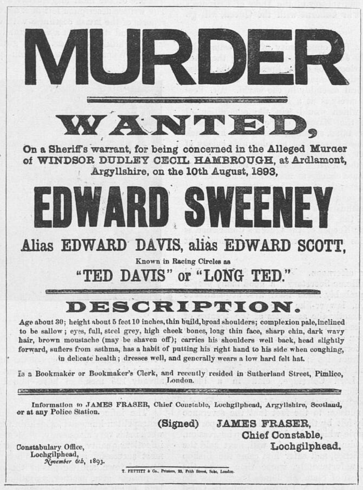

# Illustrated London News — Ardlamont

https://britishnewspaperarchive.co.uk/viewer/BL/0001860/18931213/014/0010?browse=true
The Sketch - Wednesday 13 December 1893

COpyright illustrated London news - images require license?

Lots of copyright images in Black and White
https://britishnewspaperarchive.co.uk/viewer/BL/0004617/18931230/121/0028?browse=true

TO DO - over several pages, many images

ALos lots of images (some the same?) in:

https://archive.org/details/sim_illustrated-london-news_1893-12-09_103_2851/page/732/mode/2up?q=ardlamont

The Illustrated London News  1893-12-09: Vol 103 Iss 2851
Publication date 1893-12-09

https://archive.org/details/sim_illustrated-london-news_1893-12-23_103_2853/page/n31/mode/2up?q=ardlamont

The Illustrated London News  1893-12-23: Vol 103 Iss 2853
Publication date 1893-12-23

https://archive.org/details/pub_illustrated-london-news?tab=collection&query=ardlamont&sin=TXT

lots...