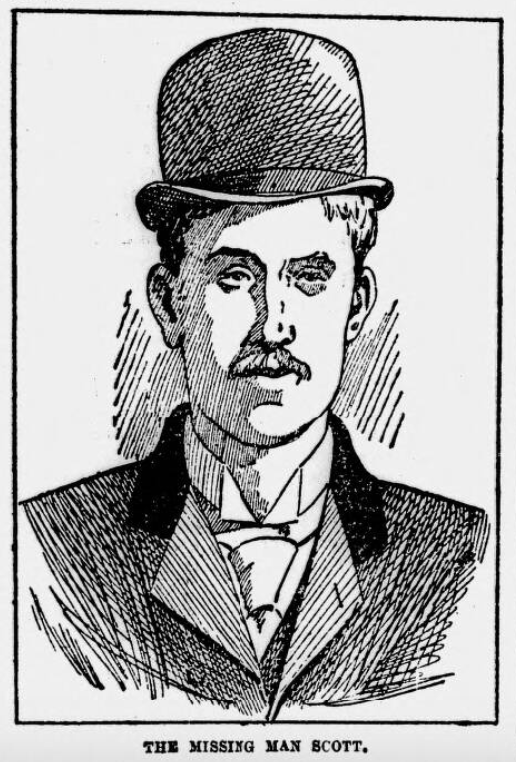

# Hambrough Monson Court Case


To skip to the end, a summary of what followed is provided in the introduction to a report of the court proceedings, published as part of a series of notable Scottish trials, in 1908:

```{admonition} *Trial of A.J. Monson*, ed. John W. More, 1908
:class: dropdown

In *Trial of A.J. Monson*, ed. John W. More, 1908, [pp.1-8](https://archive.org/details/trialofajmonson00mons):

INTRODUCTION.

The trial of Alfred John Monson on the double charge of attempting to murder and of murdering Windsor Dudley Cecil Hambrough at Ardlamont, Argyllshire, may be placed in the list of Scottish trials as the most important which has taken place since that of Madeleine Smith, nearly fifty years ago; and, as in the case of that trial, the most abiding interest to students of criminology lies in the fact that the verdict was that anomalous and peculiarly Scottish one of "not proven," and that the mystery which was seen to enfold the case from the first was not dispelled by any definite pronouncement by the jury. Not only was the charge against the prisoner the most serious which any man has to face at the hands of his fellow-men, but also the circumstances of the alleged crime, the place where it occurred, and the social position of the accused and of his alleged victim were of such a kind as at once to arrest attention and to make people look with interested eyes to the High Court of Justiciary in Edinburgh, where, on 12th December, 1893, the prosecution and the defence began their efforts, extending over ten long days, to get at the heart of the mystery. But as day by day the evidence unfolded itself, and as the rival theories upon which the Crown and the defence were staking their respective cases came to be apparent, the interest became deepened until, throughout the length and breadth of the country, men were busy with the solution of the problems of the case which soon came to be known, and has continued to be known, as "The Ardlamont Mystery."

Round the question of how the boy Cecil Hambrough came by death was woven, as the trial proceeded, a web of evidence the like of which, in complexity and in diversity, has been surpassed in no criminal trial in Scotland. In the attempt by the Crown to show to the satisfaction of the jury that the accused man was guilty as libelled, and in the attempt to refute this contention, the counsel on either side brought forward the evidence of diverse and dissimilar witnesses, from the unlettered testimony of ploughmen, grooms, domestic servants, and game-keepers, to the expert evidence of surveyors, gunmakers, and medical men of great experience and high standing. The motive which the Crown sought to prove in order to strengthen their contention was the accused man's belief that by the death of Cecil Hambrough he would be financially a gainer to a considerable extent, and for the proving and disproving of this element of the case a tangle of financial enterprises in which the prisoner had been engaged for several years had to be unravelled by the evidence of actuaries, insurance officials, and financial men of many and varied hues. The case was further complicated by the evidence relating to the identity and disappearance of Scott, the alleged accomplice of the prisoner, that enigmatic figure which flitted across the stage at the most critical moment of the drama, coming from where no man knows and disappearing beyond the ken of men.

Although undoubtedly, of all the evidence which was led during the trial, that which dealt most intimately with the young man's death is, from a sensational point of view, of most clamant interest, yet there are many eddies and backwashes of the stream of evidence which are well worthy the attention of those who have the taste for studying the minutiae of a great trial; and, looking at the case from a purely technical point of view, it is important on account of the legal points which came up for decision and which form an appendix to this report.

The uncontroversial facts of the case revealed during the progress of the trial are briefly these. In 1890 Mr. Monson was introduced to Major Hambrough, the father of Cecil Hambrough, by Mr. Tottenham, a London financier, and at Major Hambrough's request Mr. Monson undertook the custody and tuition of the boy Cecil, then seventeen years of age, till he should pass into the army, and for his services Mr. Monson was to be paid at the rate of £300 a year. At this time Major Hambrough was in a state of financial difficulty, and had mortgaged his life interest in certain family estates to an insurance company which had foreclosed, that is, had made itself owner of the interests mortgaged. Soon after taking up his duties as tutor to the boy Mr. Monson entered into negotiations with Major Hambrough with a view to relieving the Major's embarrassment, and these negotiations went on for some time. In 1892, however, for some reason a rupture occurred in the relations between Mr. Monson and the Major, who, from this time onward, used all his influence to induce his son to leave his tutor's house. In this he was unsuccessful, and Cecil continued to stay with Mr. Monson, most of his time being spent at a place in Yorkshire, where Monson was then residing.

In August, 1892, Mr. Monson was adjudicated bankrupt. In January, 1893, negotiations were entered into by him and Cecil with a view of raising money on the boy's expectancy in the Hambrough estates, but in February these broke down. Shortly after this Mr. Monson began to communicate with a firm of shooting agents in London in order to obtain the lease of a shooting in Scotland for the season, and in May a lease of Ardlamont House and shootings, in Argyllshire, was entered into in the names of Cecil Hambrough and Mr. Jerninghani, a gentleman whom Mr. Monson represented as being Cecil's guardian and good for the rent. The rent was £450 for the season, half to be paid by 1st August, under the condition that if it were not paid within a certain number of days thereafter the lease was to be void. Mr. Monson with his family went north to Ardlamont, and Cecil Hambrough joined them after finishing his training with the Yorks Militia, in which he held the rank of lieutenant. At this period and for some time before Mr. Monson and Cecil were being financed by Mr. Tottenham. In July Mr. Monson commenced to negotiate with Messrs. J. & F. Anderson, W.S., Edinburgh, agents for the proprietor of Ardlamont, for the purchase of the estate by Cecil Hambrough, but the price offered by Monson on behalf of Cecil was so inadequate that the agents would not consider it and the negotiations came to nothing. At the same time attempts were being made to effect an insurance over the life of Cecil Hambrough, and, after proposals to several insurance companies had been refused, owing to difficulties as to the insurable interest of those proposing the insurance, a proposal by Cecil Hambrough for insurance on his own life for £20,000, divided into two policies of £10,000 each, was accepted by the Mutual Life Assurance Company of New York, and the first premium, amounting to £194, was paid by Monson out of a cheque sent for another purpose by Tottenham. The policies were dated 4th August, and on 7th August Cecil Hambrough wrote to the manager of the Mutual Assurance Company, asking him to deliver them to Mr. or Mrs. Monson and saying that he had assigned them to Mrs. Monson for proper consideration and that she would be the person to whom the insurance money would be payable in the event of his death. On the same day he wrote a letter to Mrs. Monson assigning the policies and saying, "I am willing that you should hold the policies as security for all monies due to you from me, and as security against all liabilities incurred by you on my behalf, and in the event of my death occurring before the repayment of these monies you will be the sole beneficiary of these policies."

On Tuesday, 8th August, the day after the above two letters were written, a man arrived at Ardlamont in company with Mr. Monson. Ardlamont is only accessible from Glasgow and the Clyde by water, and the nearest pier to the house is at Kames, about four and a half miles off. This man, who travelled from Greenock by the same steamer as Mr. Monson, and who was apparently not familiar with the locality, left the steamer at Tighnabruaich, a pier about six miles from Ardlamont, and proceeded in the direction of Ardlamont by road. Mr. Monson, who landed at Karnes, drove back to meet him and brought him to the mansion-house, where he was introduced to the household as Scott, an engineer who had come to inspect the boilers of a yacht which Monson had purchased on behalf of Cecil. Scott took his meals with the family and was generally treated as a guest, although obviously not a gentleman in the social meaning of the word.

On the afternoon of Wednesday, 9th August, Monson and Scott went for a sail in a rowing boat, taking with them some of Mr. Monson's children. After dinner, at which Scott was present, the three men, Monson, Hambrough, and Scott, went down to Ardlamont Bay to engage in fishing. Monson and Cecil got into a boat in which was the net used for the fishing and Scott stayed on the shore. The party returned to the house about midnight, Monson and Cecil with their clothes soaked, both having somehow been immersed in the sea, but otherwise in good spirits and apparently treating the mishap as a joke. This misadventure was the cause of the Crown formulating the charge of attempted murder — the first head of the indictment under which Monson found himself in the dock. About six o'clock on the following morning, Thursday, 10th August, Mrs. Monson, accompanied by the governess and the children, left the house to go by boat to Glasgow for the day, and shortly afterwards Monson, Cecil, and Scott went out to shoot, Monson and Cecil each carrying a gun. The morning was wet and stormy. From the windows of the schoolhouse, which stands on the road to the mansion- house at the south end of the wood in which Cecil Hambrough met his death, the three men were seen by the witness Dunn walking along the road for a little in the direction of Ardlamont House and then crossing a fence to get into the field on the right-hand side of the road. After walking for a short distance in the field together, the three men were seen to spread out and enter the wood on the west side of the field in extended order, as if to beat the wood for rabbits, Scott, the man who had no gun, being in the middle. After entering the wood they were lost to Mr. Dunn's view, and nothing of them was again seen till some time after, when Monson and Scott returned to the house from the north end of the wood, passing the stables and offices on the way and bringing with them the two guns. On reaching the house Mr. Monson told the butler that Mr. Hambrough had been killed. The butler, accompanied by Monson and some of the estate servants, who were called upon to give assistance, went to the place where the body lay at the north end of the wood. It was found, with a gunshot wound in the head, lying on its back with the head towards the north, on the top of a sunk fence which divided the margin of the wood from a plantation of yoimg trees on the east. The sunk fence was about 4 1/2 feet in height, and at the bottom of it was a ditch overgrown by rank grass and bracken. The body was lifted and carried to the house, where the wound was washed. The local doctor was called in who, having examined the wound and received from Monson a statement as to the death, certified it as accidental. After luncheon Scott said that he had business to attend to which required that he should leave Ardlamont in the afternoon, and was told by the doctor that it was unnecessary for him to remain. He left by the afternoon boat for Glasgow and was not heard of again. Cecil Hambrough's father and mother were telegraphed for, and stayed at Ardlamont for two days. After their departure the body was taken by Monson to Ventnor, Isle of Wight, and was there buried, Monson returning to Ardlamont after the funeral. No suspicion was aroused as to the manner in which Cecil Hambrough had met his death until two officials of the Mutual Life Assurance Company came to Ardlamont on 23rd August to make inquiries concerning an application which had been made to the company for payment of the two insurance policies. They were taken by Monson to Inveraray to see the Procurator-Fiscal, and in consequence of what passed the Procurator-Fiscal began for the first time to look into the matter. The result of his inquiries was that he felt there was sufficient suspicion about the case to justify his putting the law in motion against Monson, and on 29th August Monson was arrested by the Chief Constable of Argyllshire. Orders were given for the exhumation of the body of Cecil Hambrough, and the examination following thereon resulted in a report hj the medical officer of the Crown and the doctor who had been called in at the time of the death, upon which a great part of the trial turned. Efforts were made both by the Crown and by Monson's legal advisers to find the man Scott, but without success; not only were the utmost efforts of the police of the country unavailing, but also the advertisement which was widely made by Monson's law agent met with no response. Scott's connection with the matter yet remains the most inexplicable element of this mysterious case. Immediately after his arrest Mr. Monson called in the Iielp of Mr. John Blair, W.S., of Messrs. Davidson & Syme, Edinburgh, who, in due course, retained Mr. Comrie Thomson, Mr. John Wilson, and Mr. William Findlay, advocates, to conduct the case for the defence. Nearly three months were epent by those engaged in the case in preparing for the trial, and it was not till 12th December that Monson stood at the bar before the Lord Justice-Clerk and a jury to answer the charges made against him. Such, in brief outline, are the main facts of the story, the elucidation of which occupied the greater part of the ten days spent over the trial.

Before the trial actually began an interesting formality was gone through by the macer of Court calling upon Scott, the missing man, to appear; upon his failing to do so, the judge passed sentence of outlawry against him.

As regards the first charge, namely, attempted murder by drowning late in the night of 9th August or early in the morning of the 10th, the theory of the Crown was that Monson took the boy out in a boat, in which he or Scott or both had previously cut a plug hole, and that when in deep water Monson removed the plug from the hole, with the result that the boat filled with water and sank, throwing them both into the sea, and that Monson, an expert swimmer, so attempted to drown the boy, who was unable to swim.

The defence explained the occurrence by saying that the hole was cut by Cecil himself for the purpose of emptying the boat of the water which accumulated during the course of fishing with the splash net, that Monson and the boy were thrown into the water by the boat capsizing through coming in contact with a rock, upon which Cecil clambered, and where he remained until Monson swam ashore and brought another boat to take him off. In his declaration on this matter Monson said — "So far from attempting on that evening to take young Hambrough's life, I consider that I saved it."

As regards the second charge, namely, that Cecil Hambrough met his death at the hand of another, and that other the prisoner at the bar, the Crown's theory was that he was killed by a glancing shot from a 12-bore gun, loaded with amberite powder, fired from behind at a distance of about 9 feet to the south of where he was standing at the time; that he lay where he fell, and died from loss of blood. This 12-bore gun was admittedly the gun by which the fatal shot was fired and was not the gun which Cecil was in the habit of using, Monson at first stated that the boy was carrying a 20-bore gun, but subsequently stated that on the occasion of the accident he himself was carrying the boy's short 20-bore gun with, which Cecil usually shot, the latter having taken his (Monson's) 12-bore that morning in order to try new amberite cartridges.

In working out this theory many elements were taken into consideration, such as the nature and direction of the wound, the position of the body when first seen by others than Monson and Scott, and the traces of blood on the ground. Stress was also laid upon the position in which a blood-stained cartridge wad and two small pieces of bone, proved to be pieces of the skull, were found in relation to the body. Marks of pellets in trees to the northward of where the body was found lying afforded the main clue upon which was based the Crown theory as to the direction of the fatal shot and the distance from the deceased at which it was fired. Elaborate experiments to test such points as the spread of shot, the relation between the distance from which a shot is fired and the signs of discoloration and singeing in the object fired at, were explained in evidence and put to the jury as bearing out the theoiy that it was the prisoner's hand which had done Cecil Hambrough to death.

The defence, for their part, contended that the place where the body was seen by the butler and the others who went to carry it to the house was not the place where it was first found by Monson and Scott, and that they had lifted it from the ditch where it was lying and placed it upon the higher level of the sunk fence. That being so, they argued, the Crown theory as to the line of fire fell to the ground, and Mr. Comrie Thomson very pertinently pointed out in his address to the jury that the position of the body when seen by the witnesses, namely, lying on its back with the head pointing north, and upon which the Crown's case was largely founded, was utterly inconsistent with the theory that it had been shot from behind and from the south and that it lay where it fell.

As has been already indicated, the motive for the alleged crime assigned by the Crown was the prisoner's belief that by causing the death of Cecil Hambrough he would, through his wife — to whom the insurance policies over the boy's life purported to be assigned — reap the benefit of these policies, amounting to the large sum of £20,000. It was proved beyond doubt that the Monsons were literally penniless at the time and entirely dependent upon such small doles as they were able to get from their friend Tottenham and others; it was argued that Monson, in ignorance of the elementary rule of law in Scotland as in England, that a minor cannot make a valid assignment without the consent of his guardians, believed that the assignment of the policies was good; and that the death of Cecil Hambrough was the coping-stone of a deeply laid scheme by which Monson sought to rehabilitate his broken- down financial condition.

The defence met this theory by arguing that the prisoner was well aware of the boy's incapacity to assign before attaining majority and of the impossibility of Mrs. Monson recovering anything under the policies if Cecil died before twenty-one. In explanation of the letters relating to the assignment, it was argued that they were to be read merely as a declaration of indebtedness by Cecil, which could be referred to when the boy came of age, so that the Monsons might secure repayment of the advances which they had undoubtedly made to both the boy and his father and get discharge of Monson's bill for board and education, towards which he had not received one penny from Major Hambrough during the long time the boy was a member of his household. The defence admitted that a claim had been made to the insurance company after Cecil Hambrough's death, but Mr. Tottenham, who made the claim on behalf of Mrs. Monson, admitted in the witness-box that in doing so he was trying to "bluff" the insurance company into paying the money, £4000 of which he was to receive, by agreement with Monson, as his share of the spoil. The defence summed up their position on the matter of motive by pointing out that Monson had everything to lose and nothing to gain by the death of the boy before he reached the age of twenty-one, and that if the prisoner wished by his death to gain pecuniary advantage he killed him some months too soon and chose the very worst time for doing the boy to death.

These theories for the prosecution and the defence, of which an outline has been given, were put to the jury by the Solicitor- General and by Mr. Comrie Thomson in speeches which were worthy of the importance of the case. That of the Solicitor- General was a model of skilful forensic oratory, marked by great sincerity and at the same time by that fairness which, it is hoped, will always remain a characteristic note in the speeches of the law officers of the Crown in Scotland. Mr. Comrie Thomson's address on behalf of the prisoner worthily Upheld the high standard set by Lord President Inglis in his speech in defence of Madeleine Smith, the opening w^ords of which, it is interesting to note, were quoted by Mr. Comrie Thomson. In urging upon the jury the necessity of bringing to the discharge of their duty an unprejudiced mind, Mr. Comrie Thomson referred in strong terms to the hostile attitude taken up by the press of the country towards the prisoner from the date of his arrest.

The Lord Justice-Clerk, in his careful and exhaustive charge to the jury, gave due prominence to the many doubts and difficulties in the case which the prosecution had left unsolved, and then the jury retired to consider their verdict. On their return to Court the foreman announced that the verdict of the jury was "not proven" on both charges. The prisoner was released from the dock and passed quietly out of Court, and the great trial came to an end. The Ardlamont mystery was still a mystery, and so it is likely to remain for a long time to come.

An echo of the case was heard in May of the following year, when the mysterious Scott appeared in an Edinburgh music-hall as part of a conjurer's equipment, and during his stay in Edinburgh petitioned the High Court of Justiciary to recall the sentences of outlawry against him, which was done, the Crown putting in no appearance against him. 

```

https://archive.org/details/sim_academy-and-literature_1909-04-10_76_1927/page/968/mode/2up?q=%22expedition+and+endeavoured+to+drown%22

The Academy  1909-04-10: Vol 76 Iss 1927
Publication date 1909-04-10

pp.968-9

THE ARDLAMONT MYSTERY SOLVED

In the "Notable Scottish Trials" Series, published by Messrs. William Hodge and Company, of Edinburgh, there recently appeared the full report of the trial in December, 1893, of Alfred John Monson for the attempted murder of Cecil Hambrough on the 9th of August of that year, and the murder of the same young man on the following day. The attempted murder was alleged to have taken place on the night of the 9th of August, when Alfred Monson, according to the theory of the prosecution, acting in collusion with Edward Scott, induced the boy Cecil Hambrough to go out on a sea-fishing expedition and endeavoured to drown him. On the following morning Monson, again according to the theory of the prosecution, with the knowledge and connivance of Edward Scott, shot and killed Cecil! Hambrough. In short, we have our old and much-discussed case "the Ardlamont mystery." The book contains the full verbatim report of the case, the speeches for the prosecution, and the defence, and the judge's summing up, and it was pure chance that induced us the other day to pick it up and read it, and thereby for the first time to obtain any real knowledge of this extraordinary case. We sat down to read it in an impartial frame of mind—that is to say, we were not conscious of prejudice one way or the other, and while we remembered more or less vaguely the general outlines of the case from reading the reports in the newspapers at the time the trial was proceeding, we had never come to any definite and final conclusion about it. We began the book languidly, we got interested, we became absorbed, we read it breathlessly to the end: the verdict of "Not Proven." We rubbed our eyes and read it all through again carefully and judicially, and with ever-increasing amazement and horror. For there is no mystery, no ambiguity, no possible room for doubt in the mind of any man with brains and a heart; Alfred Monson was innocent of the charges brought against him, and not only was he innocent, but the case against him of the prosecution was scarcely even a superficially plausible case. We defy any honest man of ordinary intelligence to read this book through and come to any other conclusion. Mr. Comrie Thomson, who defended Monson, was able to show conclusively that so far from there being any motive which could have actuated such an appalling crime as that alleged against Monson, the death of Cecil Hambrough meant complete financial ruin to Monson, and every consideration of self-interest made it incumbent on him to keep him alive. If Cecil Hambrough had lived till he was twenty-one years old, Monson would have received a large sum of money, and if he had died at any time after he was twenty-one years old Monson would have received £20,000, the amount of his insurance policy. Yet the jury who tried the case were asked by Mr. Asher, the Solicitor-General for Scotland, to believe that Monson, a man who, according to Mr. Asher's own showing, was a clever man of the world, and versed in all the intricacies of finance, was guilty of the horrible treachery and cruelty as well as the insane idiocy of murdering Cecil Hambrough in the hope of obtaining the full amount of the insurance policy assigned to him by Cecil Hambrough, a minor, such assignment, as any man of sense must have been aware, being invalid, and not worth the paper it was written on. Quite apart from the utter absence of motive for the murder, the charge was conclusively disproved by the evidence as a whole. Such was evidently the opinion of the judge, the Lord Justice-Clerk, Sir John Macdonald, as anyone can see for himself by reading his summing-up, in which he disposes of the case for the prosecution as effectually as Mr. Comrie's eloquent speech for the defence, if less dramatically. The Lord Justice-Clerk's summing up is as plain a direction to the jury to acquit the prisoner as could possibly be made consistently with the use of judicial language. Short of telling the jury in plain English that the case for the prosecution had completely broken down, and that it was their obvious duty to bring in a verdict of acquittal, the Lord Justice-Clerk could have done no more to secure Monson's acquittal. The verdict of the jury, "Not Proven," was a cowardly and wicked verdict, given as a cowardly and wicked concession to the unfair prejudice raised against Monson in the viler section of the Press. An English jury would have unhesitatingly acquitted Monson; according to English ideas of justice, when the case against a man is not proved he is entitled to acquittal. The writer of this article is a Scotsman, and proud of it, he bears a surname which is known and honoured all over Scotland, and he says deliberately that the verdict in the Monson case was a disrace to Scotland, a disgrace to Scottish justice and fair play, and a disgrace to humanity. And what can be said of the conduct of the Crown in the matter? Their whole case was founded on and inextricably woven up with the theory that the man Edward Scott, whose unaccountable disappearance before the trial caused so much excitement at the time, was the guilty accomplice of Monson. They used his disappearance against Monson, to his utmost prejudice, and proceeded to build up on that disappearance a hypothetical story of melodramatic villainy, which subsequent events proved to be a pure figment of the imagination. At the beginning of the case Scott's name was called, and on his failure to appear a sentence of outlawry was passed on him. The Solicitor-General worked up and completed an elaborate and gruesome picture in which the sinister figure of Edward Scott loomed largely and terribly—and then when, after the trial was over, the terrible Scott turned up and made an appearance on the music-hall stage, when he turned out to be an entirely inoffensive and rather foolish person, incapable of hurting a fly, who had run away and hidden himself in a fit of childish panic, did they make any charge against him or even appoint a commission to take his evidence? Not a bit of it; they simply rescinded the decree of outlawry which had been pronounced against him, and let the whole matter drop. The fact that if the evidence of Scott had been made public the result would have been to knock the whole bottom out of the case of the police and the prosecution, and even to make it appear supremely ridiculous, deterred them from taking any steps which might have served to vindicate the unfortunate victim who had gone out of court with his verdict of "Not Proven" to live a life of hell on earth. For to such a life was poor Alfred Monson condemned. His family behaved as families are apt to behave on this kind of occasion: a few of its members believed in his innocence, and proceeded nobly to give expression to their belief b referring to him with bated breath as "poor Alfred," by refraining from asking him to their houses "for fear that he might meet somebody who would be rude to him," by effectually preventing him from taking an steps to rehabilitate himself on the ground that "it would only make more scandal," by giving him "good advice," and by keeping him as short of money as was possible consistently with not allowing him and his wife and children to die of starvation; the other members of his family frankly spoke of him as a murderer, and, as is the amiable wont of hostile members of a family, were more virulent about him even than outsiders. On the whole, and with all suitable reservations, we may say that a man who gets into any kind of trouble may generally recommended to pray God to save him from his family, and the case of Monson is no exception to the eneral rule. The recital of the few details we have been able to gather of his life after the verdict would not be a cheerful one, and we shall not dwell on it. We shall merely say that the meagre financial support of his family did not long continue, that every time he succeeded in getting any sort of honest employment some kind Christian soul went round and denounced him as "Monson the murderer," and that finally, having been driven from pillar to post and hounded from every possibility of earning an honest living, he took to dishonest courses and was sentenced to a term of penal servitude for fraud. We do not know the details of this case, we should not be surprised to learn that he was unjustly convicted owing to the prejudice which had been excited against him, but in any case, and admitting that he was in this case rightly convicted, we shall continue to believe that he was a cruelly ill-used and martyred man. The book containing the report of the Ardlamont trial contains photographs of the Lord Justice-Clerk, Mr. Asher, the then Solicitor-General for Scotland, and Mr. Comrie Thomson. There is no photograph of Monson in the book, but we have seen one taken at the time of his trial. He was then thirty-three years of age, and we confess that as we looked at the presentment of his gay and gallant good-looks (he had a singularly beautiful and attractive face) and considered the horrible, brutal tragedy of his life, we were uncomfortably moved. We are informed that he died shortly after his release from prison, but our authority on this point is dubious, and it may be that he is still alive. If he is dead, and we hope for his own sake that he is, let this article serve as a tardy reparation offered to the memory of one of the most piteous victims of man's inhumanity to man who ever turned a face, brave, undaunted and debonair to the pack of howling dogs that hounded him down.

---

Judge's summing up in 
https://archive.org/details/trialofajmonson00mons/page/445/mode/1up 
Trial of A.J. Monson
by Monson, Alfred John, 1860-, defendant; More, John William; Scotland. High Court of Justiciary

Publication date 1908


---

https://www.britishnewspaperarchive.co.uk/viewer/bl/0000919/18931213/101/0006

South Wales Daily News - Wednesday 13 December 1893

ARDLAMONT MYSTERY
LIEUT. HAMBROUGH'S END. SIFTING THE EVIDENCE. MONSON BEFORE THE COURT. OUTLAWRY OF THE MISSING SCOTT. SENSATIONAL DISCLOSURES EXPECTED.

[PRESS ASSOCIATION TELEGRAM.]

EDINBURGH, Tuesday.— This morning, after 15 weeks' detention in prison, Alfred John Monson was brought up for trial on the double charge of attempting to murder and of murdering Lieut. Windsor Dudley Cecil Hamhrough, at Ardlamont in August last. ...

TO DO

---
https://www.britishnewspaperarchive.co.uk/viewer/bl/0000865/18931223/112/0008

Newcastle Chronicle - Saturday 23 December 1893

THE ARDLAMONT MYSTERY. NINTH DAY OF THE TRIAL.


---
https://www.britishnewspaperarchive.co.uk/viewer/bl/0001965/18931227/088/0005

Glasgow Evening Post - Wednesday 27 December 1893

The Ardlamont Mystery. The Missing 'Scott.' (By *Telegraph*.)

LANGHOLM, Noon.— A bookmaker answering to the description of 'Scott' attended Haithwaitegate Coursing Meeting on November 24th. The meeting is held about seven miles from Langholm and thirteen from Carlisle. The man was in very delicate health, and did his work very quietly. It is also now known to the police authorities that a man of precisely the same description was in lodgings in Carlisle for nearly a week the beginning of this month, and that he disappeared without paying his lodgings. His landlady states that he was evidently a betting man, and seldom stirred out till night. His only luggage was a handbag. He mentioned names to her the same as those which have since appeared in the evidence at the trial The description of this man tallies very exactly with that subsequently published of "Scott," and he appeared to be a stranger the coursing meeting.

Criticism of the "Not Proven" Verdict— The Benefit of the Doubt.

The Ardlamont case has caused merits of the verdict of "not proven" to be discussed in the Temple, says a legal critic in the *Globe*. There is much to be said both for and against it, but, on the whole, the feeling is opposed to it. A verdict of "not proven" inevitably means social ruin the person of whom is returned, but if the jury cannot make their minds that the prisoner is guilty is it right that they should be able to inflict this punishment upon him? In giving the prisoner the benefit of the doubt they express the doubt so severely that there is little moral benefit in it. It is claimed, on the other hand, that the Scotch system is more humane than our own, because in several cases in which English juries have returned a verdict of guilty, trusting the Home Secretary to mitigate the sentence of death, a Scotch jury would have brought in a verdict of "not proven." In more than one famous criminal trial in Scotland the jury have returned a verdict of "not proven" by a majority. Such was the result of the well-known case of Smith, who was accused of shooting a young farmer, upon whose life he held a policy of insurance. On this occasion the judge ventured to do what very few occupants of the bench have done. After the jury had returned their verdict, he asked whether they were divided between "not proven" and "guilty" or between "not proven" and "not guilty." He was informed that the difference had arisen upon the former alternative. Clearly this was a most improper question to address to the jury, and only on very rare occasions has such inquiry been made.


---
https://www.britishnewspaperarchive.co.uk/viewer/bl/0004283/18931227/003/0003

Uttoxeter New Era - Wednesday 27 December 1893

THE ARDLAMONT MYSTERY

Herewith we give a portrait of the missing Scott for whose arrest a reward of £200 is offered by the police in connection with the Ardlamont tragedy. Concerning Scott a strange story reaches us from Londonderry. A hairdresser in that town states that a person answerting to the official description of the missing man called at his shop on November 15 and had his moustache shaved off. The man's demeanout was uneasy. Questioned as to why he was having his moustache shaved off he explained that he was carrying out a joke, and gave the address of a friend, which turns out to be false. The hairdresser is firmly of opinion that Scott is no other than the stranger he shaved.



The hunt for Scott, however, seems to be going forward less keenly because it is noiseless. It is only natural, perhaps, that all sorts of rumours should be floating in the air. Thus it was announced in least one quarter on Saturday, of course from the usual "trustworthy source," that the fugitive might even yet be caught— "if the information received by authorities is correct."  "If" is at all times a pretty safe qualification. The actual fact is, at the time of the receipt of the intelligence on which these remarks are founded, that no official tidings have come to hand of the capture of the one man who is needed to complete the cycle of the Ardlamont mystery.


---

https://www.britishnewspaperarchive.co.uk/viewer/bl/0004833/18931229/100/0006

Morning Leader - Friday 29 December 1893

SCOTT IN CARLISLE

HE WAS ALLOWED TO SLIP AWAY — HIS LANDLADY's STORY

Interest in the Ardlamont case seems to be sustaining itself day by day by means of the missing man Scott. The Press Association's Carlisle correspondent states that on 19 Dec. a woman who lets lodgings in Carlisle reported to the city police that a man answering to the description of Scott, and evidently a betting man, had lodged at her house from 30 Nov. to 5 Dec., when he left without paying for his lodgings. He carried a revolver, and spoke of persons afterwards named in the Ardlamont case, and seldom went out until the evening. The Chief Constable forwarded the information to the Chief Constable of Argyllshire, but the man had then been gone a fortnight.

It is now placed beyond doubt (according to the Central News) that Scott has been staying in Carlisle. He attended Haithwaite Gate coursing meeting in North Cumberland, and before that he was seen in Newcastle by betting men who knew him. He is well known in Carlisle, where he has attended race meetings.

On the 2nd inst. Scott attended service in a Methodist chapel with his landlord. On the following Tuesday he was much upset on hearing his landlady read from a newspaper the report that a warrant had been issued for the arrest of Scott, and he decamped the same night after buying some collars and ties. It is supposed that he took a train for the south. 


---
https://www.britishnewspaperarchive.co.uk/viewer/bl/0000609/18931230/020/0001

London Evening Standard - Saturday 30 December 1893

THE ARDLAMONT MYSTERY. SUPPOSED SUICIDE OF SCOTT

Some excitement was caused to-day in the neighbourhood of Old Ford-road, Bow, by a report that the missing man Sweeney or Scott, who is wanted in connection with the Ardlamout mystery, had committed suicide in a lodging-house near by. It appears that early yesterday morning a man whose description tallies with that circulated by the police with reference to Scott, applied for a bed at a common lodginghouse in Old Ford-road. He was accommodated, and apparently fell asleep till 10.30 a.m., when a boy who occupied the next bed spoke to him. He answered the boy, and appeared rather excited, but no notice was taken of that, nor was anything thought of it till later in the day, when the landlady on going into the room found him lying in bed in a pool of blood. She at once communicated with the police, and Police-constable Clark, 247 K, was quickly on the spot. He found the man dead, and on examining the bed saw a British bull-dog revolver lying near his right hand, the muzzle pointing towards the Deceased's head on which just over the temple was a bullet wound. The Coroner was informed, and his officer removed the body to the Bow Mortuary. The police have circulated the following description :--Age about 33; length, 5ft. 9in.; complexion, fair; hair and moustache, brown; eyes: grey, one (the right) discoloured. He was dressed in a dark grey mixture coat and vest, dark striped trousers. military braces marked 55063 R.A. 1C35[?], dark flannel shirt, light grey ??, white collar, black satin scarf, black hard felt hat, marked "G. C. Davis, hatters, 25[?]6, Strand," white handkerchief, marked "H and 3-203," four gold studs, and white pocket knife with three blades. This description being almost the same as that supplied of the missing man, the police are now trying to find the friends of Scott, with the view to their seeing the body of the dead man.

The woman with whom the man suspected to be Scott lodged in Carlisle made a further statement yesterday bearing upon her lodger's identity. She says he wore on his watch chain a silver medal engraved with the letters "E. D." On being questioned as to these initials, which differed from those of Joseph Thompson, the name by which he was known, he said they meant "Edward Davies," which name he had borne until 16 years old, adding that he had three or four names. On Tuesday, the 5th December, he turned scarlet when his landlady read out to him a reward was offered for the capture of Scott. He at once read the announcement himself, and said he was going to the post-office to stop his letters front coming there. He left the same day without paying for his lodgings. The landlady further states that he had a deep scar on the left jaw, and that the right forefinger was wanting from the second joint. He had blue eyes and sallow complexion. In an illustrated paper there was a portrait of Scott reproduced from a photo, and that portrait she said was the very image of her lodger, except that the portrait had a moustache, whereas her lodger had none, but was growing one.

Mr. Thomas McNaughton, the Inverary official who had charge of the Ardlamont case, has, in consequence of the recent observations of Monson in reference to the prosecution, written to the *Scotsman*, stating exactly what was done by the officials. It was on August 10 that the Procurator Fiscal was informed of Lieutenant Hambrough's death. "On August 11, with the earliest opportunity available, I proceeded to Ardlamont, arriving there in the evening, accompanied by a police officer, who had previously handed me his report embodying the result of his inquiries, and also the result of the doctor's examination. I, on the evening of the same day, examined and took down in writing the statements of the witnesses, who were said to have first seen the body after the alarm was given by Monson. I also examined Monson. I then proceeded to the *locus*, which was pointed out to me by Monson, after which I returned to Ardlamont House and made an examiniation of the wound in deceased's head, thereafter returning to Tighnabruaich. The following day I had to proceed to other parts of the county on official business, and was unable to return to Inverary until the afternoon of August 15th, when I reported the result of my inquiries to the Procurator Fiscal, who the following morning communicated with the Glasgow officials, fully stating the case, and requesting them to take a minute and careful deposition from 'Scott,' and if not found at the address given to wire at once. Bit the Glasgow authorities failed to find the man, and stated so by wire and letter. On receipt of the letter, the constable at Tighnabruaich was wired by the Procurator Fiscal to proceed to Ardlamont and ascertain from Monson 'Scott's' whereabouts. Wires were received on the following day, August 22, both from the constable and Monson, stating that the latter would call next day, August 23, and explain matters. On the latter date Monson arrived, accompanied by Mr. Tottenham and the two insurance officials, and had an interview with the Procurator Fiscal and myself. The object of the visit, I learned, was not to give any information regarding 'Scott's' whereabouts, but for another purpose in connection with insurance. Next day the Procurator Fiscal and myself proceeded to Tighnabruaich and took further evidence. We returned the following day to Inverary and communicated at once with the proper authorities for instructions." As to what Monson said respecting Mr. McNaughton, this official desires simply to point out that it is untrue. "I beg to characterise it as a deliberate untruth that I was at Ardlamont on August 10, and it follows that I could not possibly have, as Monson says I might have done, wired to have 'Scott' stopped on the arrival of the boat, and have asked him to return. It will be understood that I am precluded from giving any information as to what Monson's statements to me were as to 'Scott' and other matters; and, further, that in the early stages of the inquiry it was impossible to verify or contradict any information obtained from Monson."

---

https://www.britishnewspaperarchive.co.uk/viewer/bl/0002933/18940101/023/0001

Toronto Daily Mail - Monday 01 January 1894

IS IT SCOTT?

A Suicide In London. The Police Suspect the Man to be the Scott of Ardlamout Fame. London, Dec. 31.—The body of a man who had committed suicide was found yesterday a lodging-house in the Old Ford road, East London. The man had shot himself with a revolver in the temple. When the pollee saw the body they were at once struck by its resemblance to the description of the mysterious Scott," for whom they have been looking for months in connection with the alleged murder of Lieut. Hambrough. "Scott" was jointly indicted with Alfred John Monson for the killing of Lieut. Hamhrough, and when the ease came ou for trial at Edinburgh a few days ago, and "Scott" did not appear for trial, be was declared an outlaw. Monson was tried, and escaped by the jury returning a verdict of "Not proven,".but the police continued their search for "Scott." The man found dead supposed to have shot himself on Friday evening. The police have sent for one of "Scott's" relatives in order to have them identify the body, as they think it is undoubtedly his.

---

https://www.britishnewspaperarchive.co.uk/viewer/bl/0000609/18940101/077/0005

London Evening Standard - Monday 01 January 1894

THE ARDLAMONT MYSTERY.

THE SUPPOSED SUICIDE OF "SCOTT."

The man who committed suicide by shooting himself with a revolver at a common lodging-house in the Old Ford-road, Bow, and who was suspected of being "Scott," has been identified by a brother. His name is John Williamson Foy, of Garden House, Martlett-court, Bow-street, W.C. 

---

----

https://www.britishnewspaperarchive.co.uk/viewer/bl/0002002/18940414/025/0002

Exmouth Journal - Saturday 14 April 1894

THE ARDLAMONT MYSTERY, scarfs STORY OF THE TRAGEDY. In the Pall Mall Gazette, Scott, the witness who was wanted but could not be found during the investigation of the Ardlamont case, relates the story of the death of Lieutenant Hambrough. Scott, according to the account he gives, was roused soon after daybreak on the morning of August 10 to go out on the rabbit shooting expedition which had so fatal an ending. The trio had not proceeded far in the wood when Monson and Hambrough separated Scott keeping in the rear to pick up the dead rabbits —when he heard a single shot fired. He called out something to the effect, "what have you got?" He received no reply, and concluded it was a miss. In a very short time he caught up with Mr. Monson, and about 15 or 20 yards further on the lifeless body of the ill-fated Cecil Hambrough was found. According to Scott, "shortly after midday it was an undoubted, admitted fact, that Mr. Hambrough had met his death by an accidentally self-inflicted wound caused by the going off of his own gun." As to his disappearance from Ardlamont, he declares that having ascertained from Dr. MacMillan that there would be no inquest, he left the place quite openly, speaking of the accident to a policeman on the pier at Tighnabruaich, and giving that officer his Glasgow address.

---

https://www.britishnewspaperarchive.co.uk/viewer/bl/0000901/18940406/077/0004

Huddersfield Daily Examiner - Friday 06 April 1894

THE ARDLAMONT MYSTERY. OFFERED SURRENDER OF SCOTT.

Scott, the man who disappeared when the Ardlamomt mystery aroused so much comment, offered to surrender, on Thursday, to the police in London. He has made a declaration to the effect that his name is Edward Sweeney, that at one time he was known as Ted Davies, bookmaker, that in August last year, under the name of Scott, be passed three days at Ardlamont, as Hanson's guest, and that he is the person against whom a warrant was issued for the alleged murder of Cecil Hambrough.

The Press Association says:—"The attempt to impart significance to the appearance of Scott has by no means disturbed the equanimity of the London police authorities. Scott is not in custody, and at present the Scotland Yard authorities have no intention of depriving him of his liberty. Such a course will entirely depend upon the Procurator-Fiscal in Edinburgh who will, it is expected, decide what course will be adopted."

---
https://www.britishnewspaperarchive.co.uk/viewer/bl/0000609/18940503/153/0004

London Evening Standard - Thursday 03 May 1894

LONDON PAVLIION.—The ARDLAMONT MYSTERY.— Scott.— Special Engagement of SCOTT (alias Edward Sweeney), who will appear, in conjunction with MORRITT, in a bewildering Illusion, entitled THE MISSING MAN, EVERY EVENING.

---
https://www.britishnewspaperarchive.co.uk/viewer/bl/0002876/18940514/064/0004

Huddersfield Daily Chronicle - Monday 14 May 1894

THE ARDLAMONT MYSTERY. "THE DISAPPEARING MAN."

Edward Sweeney, *alias* Davis, *alias* Scott, who was charged along with Monson in the Ardlamont case, and who at the time absconded, is at present residing in Edinburgh, for the purpose of taking steps to have the sentence of outlawry passed upon him removed. He has presented a petition to the High Court of Justiciary stating that he is not guilty of the charge of murder then preferred against him, and that he is now ready to meet it. The authorities will, however, have nothing to do with him. His petition has been served on the Lord Advocate, and will probably come before the court when it meets this week, but the likelihood is that no appearance will be made for the Crown, and that the prayer of the petition, in the absence of opposition, will be granted, and the sentence of outlawry removed. In the meantime "Scott" seems inclined to turn his notoriety to good account. He enters to-day on a week's engagement at the Empire Palace Theatre, where he appears in Professor Morritt's illusion as "The disappearing man."

---

https://www.britishnewspaperarchive.co.uk/viewer/bl/0000540/18940522/092/0004

The Scotsman - Tuesday 22 May 1894

YESTERDAY, Mr Edward Sweeney, *alias* Scott, had his sentence of outlawry recalled. Mr Sweeney, it will be remembered, was present at Ardlamont House on the morning that young Hambrough was shot. He was there under the name of Scott, and he had been introduced to different persons as an engineer. He was not an engineer, and his name, as we know, was not Scott. He has explained how it came about that he was represented as an engineer, and how he took the name of Scott, and that explanation has no doubt been weighed by the public. It was not given at the trial of Monson on a charge of murdering Hambrough. Sweeney was indicted along with Monson and as he did not appear, a sentence of outlawry was pronounced against him. The Crown sought to get evidence into the trial to prove that the Scott who was present at Ardlamont was Mr Sweeney, and it was not permitted. The police had been searching for Mr Sweeney for many weeks, and had not found him. He turned up subsequently at the instance of a London newspaper; and now he has come to Scotland to ask that the sentence of outlawry against him shall be recalled. His request was granted yesterday under some peculiar conditions. The Court had no opportunity of learning what the Crown thought on the subject. Sentence of outlawry had bean pronounced against Mr Sweeney at the instance of the Crown. His petition for a recall of the sentence had been intimated to the Crown officials. Yesterday had been appointed for the hearing of the petition; and when he came before the High Court of Justiciary no representative of the Crown was present, and not a word of guidance was given to the Court by any one on behalf of the Crown. Most properly this course was strongly commented upon by the Lord Justice-Clerk and by Lord Adam. They said that it seemed to be a dereliction of duty on the part of the Crown. What they said will have the approval of the country. It should be remembered that the Judges who sit on the bench have only to administer the law. It is the business of the Crown to bring to the knowledge of the bench all the facts it can gather in reference to any and every case that comes into Court in connection with criminal matters. If this be not done, the Judges are left almost entirely without guidance, and obviously there may be a serious miscarriage of justice. We are not saying or suggesting that anything of the kind has taken place in regard to this case; but it must be said that the absence of the Crown from the hearing of the petition placed the Judges in a position in which they ought not to have been left. Mr Sweeney has got his sentence of outlawry recalled, and has thereby made another precedent in the administration of criminal law in Scotland. It may be hoped that the Crown's dealing with the question will not be regarded as a precedent to be followed in the future.

---
https://www.britishnewspaperarchive.co.uk/viewer/bl/0001179/18940524/007/0015

The Stage - Thursday 24 May 1894

GLASGOW

Gaiety.— The appearance of Scott, who figured so largely in the Ardlamont mystery, served to crowd the Gaiety to witness the clever trick of Morritt's; ...

---
https://archive.org/details/the-magic-wand-vol-iii-september-1912-to-august-1913/page/391/mode/2up?q=%22charles+morritt%22+%22missing+man%22

The Magic Wand, Vol III, September 1912 To August 1913
by Magic Wand Publishing Company

Publication date 1913

p392

...

Mr. Charles Morritt's appearance at St. George's Hall, after an absence of many years, has awakened many recollections of his earlier career in the magical world. It was Mr. Morritt who invented the illusion of "The Disappearing Lady," and afterwards caused a sensation during the period of the Ardlamont mystery, by producing Scott, "the missing man," on the stage, when scores of people were scouring the land in search of him.

...


GLASGOW

Gaiety.— Charles Morritt, in his illusion "The Missing Man", is the centre of attraction at this hall. The "missing man" is no other than "Scott", of Ardlamont mystery fame, his reception being of a very mixed character. The illusion, however, is good; the disappearance only occupying five seconds.


---

Steinmeyer, Hiding the Elephant p 123-4

Morritt and Scott (previously Morritt and Tichborne Claimant); missing man photograph also included in book

---


https://archive.org/details/sim_blackwoods-magazine_1906-06_179_1088/page/774/mode/2up

Blackwood's Magazine  1906-06: Vol 179 Iss 1088

The Verdict "Not Proven."

...

I shall now proceed to the third case, that of the Lord Advocate against Monson and another, decided in December 1893, which is popularly known as the Ardlamont case, or the Ardlamont mystery. As in the case of Dr Smith, the charge against Monson was that he had first insured young Hambrough's life for £20,000, and in order to obtain payment of the insurance first tried to drown him on the 9th August, and having failed to do so murdered him on the morning of the 10th August by shooting him in the head while they were out shooting rabbits together. The evidence as to the attempt to drown, taken by itself, would certainly not have been sufficient; but when it was proved that the man, who in company with Monson had been nearly drowned on the night of the 9th, was, while also in company with Monson on the morning of the 10th, shot dead by a shot from a gun generally used by Monson, the circumstances connected with the alleged attempt to drown became of great significance. It was an admitted fact in the case that the gun which shot Hambrough was Monson's gun, a 12-bore fowling piece. Hambrough's gun, and indeed the only other gun in the house, was a 20-bore. The cartridges which fitted the 12-bore gun were loaded with amberite powder and No. 5 shot. On the other hand, the cartridges for the 20-bore gun were not loaded with amberite, and only carried a charge of No. 6 shot. The wadding of the cartridges of the 20-bore gun was, of course, much smaller than that of the cartridges of the 12-bore gun. Now four pellets of No. 5 shot were found in Hambrough's head, and a piece of wadding of a 12-bore cartridge was found at the spot where his body was found. If Hambrough that day was shooting with his own 20-bore gun, there would, I presume, have been no doubt that he was shot by Monson either by accident or design. Accidental shooting by Monson was excluded by the nature of the defence, which was that Hambrough, that morning, wished to try the amberite powder, which could only be done by using Monson's gun, and that, in point of fact, although Monson had got Hambrough's gun from the keeper to give to Hambrough, Hambrough went off with Monson's gun, and Monson carried Hambrough's 20-bore gun. Monson did not mention this till three weeks later, and left it to be supposed that Hambrough was shot through his own carelessness by his own 20-bore gun. There was no direct evidence as to what took place in the wood, because the man Scott, who was present in the wood, absconded, or at least was not to be found at the date of the trial, and therefore the case had to be decided mainly on skilled evidence as to the nature of the wound, the level at which the gun must have been held or gone off, and the distance from which the shot must have been fired. There is no doubt that guns do strange things when they are whisked out of the hands of the sportsman. I myself saw a gun, knocked out of the hand of a friend with whom I was shooting by a large retriever, go off in the air and discharge a shot backwards within a few inches of its owner's head. And, therefore, in Monson's case a great deal depended upon the evidence as to the distance from which the shot was fired and the position of the gun at the time when it was fired. I do not propose to examine the evidence, because the point with which I am at present dealing arises more sharply than in the other two cases. The Lord Justice-Clerk (Lord Kingsburgh), in the beginning of his charge, gives an exposition of the duty of a judge in such a case. I need not quote the whole of the passage, which is to be found on pages 272 and 273 of the first volume of 'Adam's Justiciary Reports,' but I may quote a part of it: "I may tell you, however, that it is according to practice that a judge should suggest to the jury things which occur to his own mind upon the evidence, and I shall certainly do so in the course of my observations; but I do it with this remark to you, that what I have to say as a matter of observation is said, not to dictate to you, but solely for your personal consideration. You may be inclined to give some weight to what is said as coming from a person the business of whose life it has been to state such cases, to see how they ought to be treated, and to notice the points in them, and to see which points tell for and against the prisoner. You may be inclined to do that, and doubtless you will be inclined to do it, but do it always with this impression upon your mind, that what is addressed to you by way of observation upon the evidence is addressed to you for your consideration, and that it is quite open to you to accept it, to accept it in a modified form, or to reject it altogether, according to your judgment on deliberation." Having thus stated the weight to be attached to any observations which he might make upon the evidence, the Lord Justice - Clerk proceeded to examine and comment upon it, and I do not think that I am incorrectly stating the result of that charge when I say that it was distinctly a charge for acquittal. The learned judge was well within his rights, holding the opinion which he apparently did, in letting the jury see his own view that the case for the Crown had not been satisfactorily established. In this case, however, Monson had the great advantage, that he not only had a very telling speech from his counsel, Mr Comrie Thomson, but that speech was immediately followed by a charge which, if the jury chose to accept the presiding judge's views on the evidence, led inevitably to acquittal; and yet in the result the jury simply found a unanimous verdict of "Not Proven."

Probably the shape which the verdict took was in a great measure due to the exceptionally powerful and_ closely reasoned speech of SolicitorGeneral Asher, who conducted the prosecution on behalf of the Crown. The speech is an excellent example of the thorough and effective pleading of that distinguished counsel, who, alas! as well as his opponent, Mr Comrie Thomson, is no longer with us.

I have referred to these three cases as illustrations of the attraction which this intermediate verdict has for a jury in an anxious and difficult case, In all these cases, notwithstanding an exceptionally powerful appeal from the Bar for the defence, and encouragement from the Bench to acquit, the jury preferred to avail themselves of this verdict (which was no doubt according to law), while they might, had they chosen, in all three cases have found a verdict of "Not Guilty." What their verdict would have been in all or any of these cases if the verdict of "Not Proven" had not been available we can only conjecture. In each case, looking to the nature of the defence, the jury had a clear question of fact to answer, yea or nay. In Dr Smith's case the question was, "On the evidence, are you satisfied, beyond reasonable doubt, that at 7.36 on the night in question the prisoner was in company with the deceased man M'Donald, at the place where his body was afterwards found?" In Madeleine Smith's case, the question was practically the same, "Are you satisfied, on the evidence, that the prisoner met L'Angelier on the evening of the 22nd March 1857." And in the Ardlamont case, "Are you satisfied, on the evidence, that Hambrough, at the time when he was shot, was carrying his own 20-bore gun?" These were the leading points, although the decision was affected by collateral evidence. If the jury were prepared to answer these questions in the affirmative, it was their duty, however painful, in all or any of these cases, to find the prisoner guilty. If, on the other hand, they were not prepared to answer the question affirmatively, they should, it seems to me, have found the prisoner "Not Guilty," simply because in their judgment the prosecutor had failed to prove his case to their satisfaction. Moral doubts should not affect a verdict in a criminal case.

One thing is clear—viz., that none of the jurymen in any of these cases were prepared to find the prisoner "Not Guilty." The verdict which they did return ("Not Proven") acquired significance from the fact that, owing to its existence as a third alternative, the verdict "Not Guilty" in Scotland has come to be regarded as a verdict of "Innocent," not by presumption merely but *de facto*. When, therefore, the verdict "Not Guilty" being available, a jury contents itself with finding the modified verdict "Not Proven," the verdict reflects, and is intended to reflect, unfavourably upon the character of the person acquitted.

I have always felt great sympathy with juries, especially in capital cases. Not trained to the law, they are torn from their avocations or businesses, shut up for days, it may be for weeks, perplexed by the conflicting eloquence of counsel, and finally, when perhaps they have formed a provisional opinion it is liable to be upset by the judge expressing an opinion to the opposite effect. No doubt they are not bound to adopt the judge's views on the facts, but who can wonder if, especially in a capital case, they hesitate to convict, in opposition to the expressed opinion of a trained and impartial judge? Sometimes they have the courage of their opinions, as is illustrated by the minority in two of the cases to which I have referred. In cases not capital, I have known juries convict in the teeth of the judge's strongly expressed views on, the evidence; and in one of these cases, curiously enough, it was proved by the subsequent confession of the prisoner that the jury was right at least as to the truth of the charge.

The main objection, then, in my opinion, to the verdict "Not Proven" is that, especially in capital cases, it gives a timid jury a loophole for acquitting when they ought to convict. On the other hand, if they acquit, it should be on the ground that they think the case not proved; and in that case it is not fair that they should send an acquitted prisoner back to the world with a lasting slur upon his character.

I fear, however, that this discussion is academic. The verdict "Not Proven" is too deeply rooted in the practice of Scotland and too convenient to be easily dislodged.


https://archive.org/details/fiftyyearsofnews00sincrich/page/196/mode/2up?q=ardlamont
Fifty years of newspaper life, 1845-1895: being chiefly reminiscences of that time
by Sinclair, Alexander

Publication date 1898

On the occasion of the trial in Edinburgh of Monson for the Ardlamont murder, in December, 1893, the full reports by our reporters were illustrated by one of our artists, who took sketches of scenes in the High Court during the proceedings; these were promptly sent by train from Edinburgh to Glasgow, where they were immediately dealt with and appeared in the Evening Times the same afternoon and evening. This was the first attempt of that character in such circumstances. Besides comic


https://archive.org/details/booksundialsori00evangoog/page/150/mode/2up?q=ardlamont

The book of sun-dials;
by Gatty, Alfred, Mrs., 1809-1873

Publication date 1900

An old dial in the garden of Auchenbowie near Stirling resembles the lower half of an obelisk dial. There is also a very fine obelisk dial in the gardens at Ardlamont in Argyleshire.


https://archive.org/details/sim_juridical-review_1894_6/page/42/mode/2up
The Juridical Review  1894: Vol 6
Publication date 1894

TO DO

pp43-57

GUNSHOT WOUNDS — THE MONSON CASE.

Any attempt, at this time of day, to throw further light on what is called the Ardlamont mystery, must, to most minds, seem superfluous. But it may be not without interest to discuss, shortly, some points arising on the evidence which appeal specially to the surgeon and the sportsman. Let me say at once, and most emphatically, that, so far from presuming to criticise the verdict, | believe that the evidence, as given and interpreted, was so contradictory, and its apparent discrepancies so little solved, that no other verdict was possible. But of some portions of the evidence other interpretations are possible to the onlooker than those given in Court; and I suggest these solely in the interests of scientific truth, and certainly in no unfair or unfriendly spirit to any of the medical witnesses examined.

The case is of such recent date, and excited such universal interest, that I need not repeat the story. I propose to take up the points of interest as they occur in reading the evidence; and I refer, in the first place, to the important evidence of Mr. Macnaughton, the gunmaker.

*Line of Fire.*—Mr. Macnaughton found on the rowan tree, some 6 feet from the ground, the marks of a charge of shot having passed through the tree. Guided by the line of grooving in these marks, he found corresponding marks in the branches of two trees, a beech and a lime, further along the dyke. Noting the position which Hambrough's head would have occupied if he had been standing upright on the spot where his feet lay when he was found dead, Mr. Macnaughton found on stretching a tape that the head, the marks in the rowan, and the marks in the beech and lime were in a straight line: from this the inference was drawn that part of the charge which killed Hambrough passed through the rowan and beech and lime trees. So far, this is plain enough; but when he proceeds to contend that the gun was necessarily fired from a point along the same line, I think the argument of the defence was perfectly legitimate. If Hambrough's head had been straight between the muzzle of the gun and the rowan tree, the shot would have been deflected from the head, and would not have made the pattern on the tree that was found. Assuming Mr. Macnaughton's line of fire to be the true one, I think that no sufficiently explicit answer was given to the objection raised by the defence.

Believing (for reasons to be given hereafter) that the shot was fired at very close quarters, and at a very particular angle to the head, I am of opinion that the charge tore through the parts, most of the pellets (say # of them) missing the head entirely, while those which struck the head were deflected at a very fine angle, and caused the pattern on the rowan and other trees to be indefinitely altered. In fact, the pattern on the trees was valueless in estimating the distance from the tree at which the fatal shot was fired, though it may be very good evidence to show that the shot passed in a more or less horizontal line at the height of a man's head from the ground through these trees.

There is an alternative explanation which may suit some minds better, and which appears to me quite tenable, though not so probable as the former. This depends upon the supposition that the shot was fired at an angle to Macnaughton's line of fire, the main body of the shot (say #) missing the head and going to the left of the rowan tree, and the remaining } striking the head and ricochetting in Macnaughton's line of fire on to the rowan and beech trees. Hither of these hypotheses appears to satisfy the conditions of the suggested line of fire, as far back as Hambrough's head, and at the same time to account for any amount of scatter—a factor which it is quite impossible to calculate with precision under such conditions as existed.

*Distance of Muzzle of Gun from Hambrough's Head.*— The Crown attempted to prove this from the pattern on the rowan, and put down the distance as 9 feet from Hambrough's head, and 21 from the rowan. But from what has been said above, it is evident that a consideration of the pellet marks on the trees gives no certain indication of the distance from which the shot was fired. This must be gathered exclusively from a consideration of the wound, taken in conjunction with the evidence as to the spread of shot at various distances. Upon this latter point prosecution and defence were practically unanimous, and for my purpose I may as well select as a fair example of the rest the results obtained by Mr. André and Mr. Macnaughton. The wound, it is admitted, was made by a charge of No. 5 shot from a 12-bore breech-loader, the powder used being amberite. With these conditions Mr. André finds that,—

At 1 foot there is a spread of 3/4 to 7/8 of an inch — edge of wound smooth.  
At 2 feet there is a spread of 1 1/8 to 1 3/8 of an inch — edge getting ragged.  
At 5 feet there is a spread of 1 1/2 to 1 3/4 of an inch — edge ragged.

At about 4 1/2 to 5 feet separate pellet marks begin to be seen round central hole. Macnaughton makes this last measurement about 6 feet instead of 5, and further states that at 9 feet there is "more scattering, pattern extending 1 inch all round central hole." At 12 feet there is an open pattern, and as a rule little or no hole in the centre.

I shall have occasion to examine more critically the exact nature of the wound at a later stage; it is sufficient at present to say that both sides agreed, first, that the direction of the wound was oblique or grazing from behind forwards; second, that at the point of entrance behind, the bevelled edges were somewhat ragged, but that there were no scattered pellets to be found in the skin around, or in the collar of the coat; third, that there was no singeing of hair or any noticeable discoloration of skin. Take the last point first:—

*Singeing, Scorching, Discoloration.*—The evidence on both sides proved conclusively that with amberite powder there is no singeing of hair whatever at any distance, even at 6 inches. Discoloration of the skin (or rather of a piece of white cardboard) was by no means always perceptible at the closest ranges, but it invariably ceased entirely at 3 feet. About scorching or burning of the skin, evidenced by a whitish or yellowish staining of the skin, not removable by washing, and probably followed (if the patient lived long enough) by a reactionary redness or vesication, there was no reliable evidence. Engraining of the powder (which is so useful a point in the case of black powder) was not noticed with amberite, but with a similar nitro-compound, Schultze, was noted up to three feet. (It would be interesting to investigate this point further, for though the engraining of some of these nitro-compounds is not very visible, the particles being of a yellowish white colour, something like that of the skin, it is conceivable that in the case of wounds inflicted at close quarters the grains of powder might be discovered in the skin post-mortem by careful chemical or microscopic examination.) Any one who has shot in the eye of a strong wind with Schultze or E.C. powder, will probably realise to his cost that these powders are not all converted into gas, for some particles fly back and get into the eye, causing very severe smarting and subsequent congestion at the spot. We may discard, then, as unreliable any conclusions that might be drawn from the evidence with regard to these points. Singeing would not be there at any rate; and discoloration by the powder, probably slight, if present at all, would not show on the surface of the hairy scalp. Besides this, the fact of blood being round the wound during Dr. Macmillan's first examination, and the second fact, that of his washing the wound at Ardlamont, would make it still less likely that discoloration should be visible at the examination of the body twenty-five days after death.

Getting no assistance from this point, we are practically thrown back to consider the effect of the pellets on the skin at the wound of entrance, in order to judge the distance at which the shot was fired. By far the strongest point urged against the Crown's contention was the proof adduced by the Crown witnesses themselves that at 9 feet there would be every expectation of finding scattered pellets round the margin of the wound. In computing the distance, then, we must, if we accept the experiments performed by both sides, reduce the number of feet from 9 to at most 5 or 6, at which distance there is no scattering—but, of course, the shot may have been fired much closer.

Several witnesses for the prosecution stated it as their opinion that if the shot had been fired at 2 or 3 feet, the skull would have been smashed to "smithereens." This is perfectly true if the whole charge strike the head (*cf. infra*) But where as in the present case only the edge (say, 4) strikes the head, while the injury will vary with the distance at which the shot is fired, the question whether there is much smashing, or little, or none at all, depends essentially upon the angle at which the shot strikes the skull. If proof were required of this, it is most abundantly forthcoming in the case of the witness Colonel Tillard, who accidently shot himself at close quarters, with the result of stripping off the pericranium from his skull at identically the same situation, and without smashing his skull at all. A similar case is within my own experience, where a glancing shot striking the bone at a few inches' distance, stripped off the periosteum without injuring the bone in the least, except by grooving it slightly. In other cases I have seen a large bone smashed into fragments by a similar shot striking it square. Have we not read in books on medical jurisprudence of the wellknown case of the soldier whose cap during an engagement was picked up with a good deal of his hair in it? He had been literally shaved by a half-spent and ricochetting cannon ball, and was none the worse!

There is no evidence, so far as we have gone, to prove the inside limit of distance: but we have the width of the wound at its middle given as 1 1/2 inches. This width, I agree with Dr. Hay, was probably increased from about 1 inch to 1 1/2 inches by retraction of the skin, such as always happens in wounds of the scalp. Taking, then, the width of the middle of the wound (i.e., the point where the edge of the body of pellets bit most deeply into the head) at 1 inch, that indicates that the diameter of the circle of shot was, at any rate, 1 inch when it passed this point, and very likely more; for I do not believe that more than a third or a quarter of the charge struck the head. Therefore, we now have an approximate inside limit. It cannot have been less than about 1 1/2 feet, and we have seen that it cannot be more than 5 or, at the most, 6 feet; but between these limits it may have been anywhere—say, at a guess, 3 or 4 feet. There was only one of the medical witnesses for the prosecution examined on this point —viz., Dr. Bell, who thought this possible.

It may be worthy of note here that though the spread of shot occurs pretty regularly in accordance with the rules given by the experts in this trial, on very rare occasions the charge flies in a compact mass for a considerable distance. In Taylor's book on medical jurisprudence such an event is noted as having happened to Lachése while firing at a paper target at some 60 yards, the pellets entering like a bullet. I myself have completely bisected a white hare with a charge of No. 5 shot in an ordinary cartridge, with black powder, at a paced distance of 34 yards. And in an old country house in Sussex I have seen in a glass case a stuffed pheasant, which with a charge of No. 6 shot out ofa 12-bore muzzleloader, at some 25 yards (like the "Gallia" of our youth), "divisa est in partes tres," or, as the Irish student translated it: "halved into three quarters." It is a well-established and curious fact that shot flies closer on a damp day. This fact is well-known to gunmakers, who, if they want to get a good pattern out of a gun, will preferably shoot it on a damp or misty day.

The blood-stained wad found near the head does not help much-on the question of distance of shot. While the light compact wad which lies over the shot will sometimes fly 20 yards or more, the porous thick wad (and it was this that was found) which lies between the powder and shot, is said by Mr. André not to go more than about 9 feet. It was found exactly where we should have expected to find it —ze., between the body and the dyke; but a little nearer than the rowan tree. In other words, being a lighter body, it flew off at a greater angle from the head than the shot did. Many fatal accidents have been reported from wounds with wads, the public not being generally aware what serious effects they have at close quarters. [1 myself witnessed many years ago in the course of a "burgling" charade in a country house, a statuette smashed to pieces and a deep hole knocked in the plaster behind it by a couple of wads discharged by the burgled paterfamilias, fortunately, a foot or so above the head of the enterprising burglar.

I now pass on to the consideration of some points in the report of the *post-mortem* examination made at Ventnor twenty-five days after death.

*The Cause of Death.*— The report says: "We are of opinion that deceased died from shock, the result of gunshot injury of the skull and brain, *and from subsequent loss of blood*." The death was frequently referred to in the course of the trial as being due to hemorrhage. Now, with all deference, I would submit that the appearances at the *post-mortem*, while strongly suggestive of death from hemorrhage, were not necessarily conclusive evidence to that effect—and this is borne out, to some extent, by the evidence given at the trial.

The injury to the skull and brain, exclusive of the bleeding, was amply sufficient to cause instant death. Of course every surgeon of experience knows of cases of severe injury to the skull (and even to the base of the skull, where most danger lurks, as there lie the parts of the brain essential to life) where the patient has not only lived many days, but has presented comparatively slight symptoms at first. It is hardly necessary, in order to prove this, to cite the celebrated case where an iron rod, some three feet long, was driven by a charge of powder right through the upper part of a miner's skull and brain, after which he lived for some twenty years, little the worse for the accident. His skull is now in a museum, and its presence there emphasises the fact that while such a thing can happen, it is a striking exception to the general rule. No; on considering the great violence applied to the lower part of Hambrough's skull, sufficient to split up the dense petrous bone and to fissure the skull in several directions, one would be extremely surprised to hear that such a shock could be tolerated for an instant consistently with life by the very sensitive base of the brain, which lay in close apposition to the injury to the skull.

I am of opinion, then, that while it is possible that the body may have moved convulsively for a few seconds, it is much more likely that death was absolutely instantaneous, caused by shock to the important centres at the base of the brain; and that, consequently, any hemorrhage that took place was post-mortem. Not only is it a well-established fact that if a large vein is opened it may bleed profusely and for several hours after death (thus forming an exception to the general rule of post-mortem bleeding), but there is a mass of evidence to prove the point in this case. All the witnesses who saw the body, either in the wood. or in the house, deponed that blood was oozing from the wound when they examined it—this even applies to Dr. Macmillan, who did not see the body until about four hours after death.

Evidence was led to the effect that the amount of blood under Hambrough's head, as he lay in the wood, was only about a kitchen-bowlful. Now, it is a well-known fact, that the lay observer invariably overstates rather than understates the amount of blood lost on such occasions, and even if we admit that a kitchen-bowlful were lost, it is known to medical jurists that in the healthy adult five to eight pints of blood is the quantity required to cause death from hemorrhage. The hole in which the blood lay would not have held a pint; and as the blood was oozing slowly from the vein it would clot almost immediately, and not soak to any extent into the ground or be washed away. It was also proved that a large quantity of blood escaped from the head in the transit to the house, and was spilt about the cart, and rug, and room where the body was laid, &e. Again, it was urged with perfect propriety by Dr. Hay that putrefactive changes would account considerably for the apparent bloodlessness of the body at the post-mortem examination. Putting these factors together, then, I arrive at the conclusion that Hambrough did not die from hemorrhage. If he had, there would have been much more blood to be seen in the wood than there was.

It will now be necessary to discuss the nature of the wound in the light of the post-mortem examination and the photographs then taken. An exact idea on this subject is of the first importance, for I submit that it establishes without possibility of doubt the exact line of fire from gun to head.

It was admitted on both sides that the wound, which was 3 1/2 inches long, was inflicted from behind; the direction was almost horizontal, the wound tending slightly upwards from behind forwards; it was more or less triangular, with its apex, or point of entrance, about an inch wide behind, with a bevelled edge (starting in the soft parts, as Dr. Littlejohn deponed, a-quarter of an inch in front of the occipital protuberance) passing forwards and biting more deeply into the outline of the convexity of the skull presented to the line of fire; it became both wider (1 1/2 inches) towards the middle, and penetrated through the scalp at this point and struck the skull at about 1 or 1 1/2 inches from the occipital protuberance, smashing the skull considerably; it then widened still further as it went forward to the extent of 2 1/2 inches, this part of the wound being lacerated and doubtless caused by the detached pieces of bone flying forward. There was in addition at the same level a wound of the ear, consisting in the removal of a piece about the size of a florin cut in half from the middle of its flap, leaving the upper part and lobe at the bottom uninjured.

Now, a consideration of the above points, coupled with a careful inspection of the back of the human head, must lead to the conclusion that the shot was fired, not only from the rear, but from the left rear; and this, it must be observed, is in relation, not necessarily to the body, but to a vertical antero-posterior line drawn through the middle of the head. If this is once admitted, all photographs, or other suggestions tending to show that Hambrough shot himself with his gun in his right hand, fall at once to the ground. It is a physical impossibility for a man with his gun in his right hand to put the muzzle in the proper position to cause such a wound, unless, indeed, the elbow is flexed and the muzzle of the gun put close up behind the head, the stock being away to the left side. But we have already shown above by the width of the wound in its middle that the shot could not have been fired at less than 14 feet: therefore this exception may be discarded.

It is evident that a close shot, fired from any position but the left rear, would, if it struck the head first as in Hambrough's case, at half-an-inch in front of the occipital protuberance, pass directly inwards and blow the skull to pieces, or at least perforate it and smash up the brain (unless, indeed, it passed away obliquely to the left of the head—a condition of things we are not considering). This direction of the fatal discharge is also important in connection with the position of the body, which was found lying on its back. If the deceased were walking forward towards the rowan tree, and twisted quickly to the left on his right foot at the moment, the effect of the discharge actually received would be to "slew" him round and make him fall upon his back. If, however, he fell without turning, but with his left arm beneath him, the natural thing would be for anyone to pull upon that arm, and the body would turn round upon its own axis on the same spot. This is familiar to surgeons.

It is necessary to say that the occipital protuberance is not the part of the head which strikes the ground when a person falls back. It is impossible in a normal head for this to happen. This statement is not made in a spirit of captious criticism. The occipital protuberance is in reality from 1 to 14 inches below the prominence which would strike the ground.

Mr. André, one of the witnesses for the defence, said he could not conceive the wound being caused accidentally, unless the gun fell or was thrown out of Hambrough's hand and he was shot on the ground in the act of holding back his head to avoid a blow on the face from the ground. This does not seem the most plausible of the accident theories. If the gun were carried on the "trail," it would have a much shorter distance to fall than the body, and it would have struck the ground and gone off before the body reached the ground, and in any case the gun would probably have fallen under Hambrough or in front of him, and not behind him at the left rear. If, on the other hand, we suppose the gun was carried by the muzzle over the shoulder, he then is supposed to fall forward, and the gun falling on the ground or being thrown out of his hand behind him, shoots him from the back. With regard to the possibility of a man throwing his gun from him in the act of falling, it might be of great importance in a case to be able to establish such a fact. I remember seeing a man fall while shooting on the Norfolk marshes. He put his foot into a hole and pitched forwards, pulling spasmodically at the butt of the gun which was over his shoulder, with the effect that the gun flew forward some ten yards in front of him, turning a complete somersault in its course, and going off when it struck the ground. If he had been shot at ten yards, the writer might have been put in an awkward position! as it was, no one was hit. Of course, one of the advantages of hammerless over hammered guns is, that there is no chance of a hammerless gun going off if it falls (or anything falls on it) from anything knocking the hammers down; but it may be of interest medico-legally, as well as from the sportsman's point of view, to state that I have seen a dog shot through the back by his owner, who tapped him lightly on the back with the muzzle of his gun (a new and expensive hammerless gun by one of the first makers in the country); a warning to some shooters who are too apt to use their guns to beat whin bushes, &c., for game.

I must confess to being a little puzzled at first sight to explain the peculiar "bite" taken out of the ear. This apparent difficulty is solved at once when one recognises the true line of fire from the left rear. As to what caused the wound in the ear, while we think it almost certain that it was the edge of the charge itself, it may possibly have been the wad, or even loose pieces of bone.

Mr. André said it was possible for a whole charge to hit the head at the back of the ear and then ricochet off. Let us analyse this opinion. To clear the ground, let us say, in primis, that it seems absolutely certain that the whole charge did not hit Hambrough's head. To produce that result, the gun must be placed so as to aim at a point in the head which is removed from the outline of the edge of the head (as presented to the line of fire) by a distance equal to half the diameter of the spread of pellets at any given distance.

At what distance shall we apply this test? It is self-evident that, at a comparatively long distance, where the spread is, for instance, 10 inches, you would have practically to shoot at the middle of the head, or, in other words, 5 inches from the outline of the edge of the head as presented to the line of fire, in order to fulfil the conditions. It will hardly be contended that the central part of the charge, striking the head full in the centre of its convexity, would ricochet off. A few of the outside shot striking the surface of the skull obliquely might do so; the mass of the shot towards the centre of the charge would perforate the bone or stick in it. But it may be said, this is not a fair distance to judge
from. Then, bring it down to 2 or 3 feet, and then apply the same rules rigidly. The result then will be, as was proved beyond cavil in court, that the head will be smashed to pieces, a large hole ploughed through the skull, and pellets found in the brain, which will be considerably injured. But this is not what we understand by the "whole charge ricocheting off the surface of the skull."

Further, if from any angle an attempt had been made to imitate a wound in the same direction as Hambrough's by shooting more directly upon the skull, and trusting to deflection to carry the shot away forwards, if it had all gone forwards (which is impossible as I have proved) it would inevitably have carried away the whole ear, and made a flesh wound absolutely different from what was found.

This leads me to consider the opinion expressed that the piece of the petrous bone found on the grass most probably was shaken out of the wound while Hambrough was being moved. There is, however, nothing extraordinary in the idea, when from intense external force applied to its base, the petrous bone was split up into fragments, and a hole made in the skull for their escape, that one of these fragments should shoot out of the wound, somewhat in the same manner chips of hard wood are apt to fly in the face when one is chopping down a tree with an axe.

It was suggested that another piece of bone found on the grass near the head might have dropped out of the wound as Hambrough was carried from the ditch—and, further, that it acted as a plug, and thus accounted for the fact that no hemorrhage took place in the ditch, or on the way from the ditch to where Hambrough was found. Now, I have seen many cases of compound depressed fracture of the skull where a piece of bone has acted as a plug and prevented hemorrhage from the vessels of the biain,— but in every single instance such a piece of bone has been depressed below the general level of the skull, and has been firmly held in position by a surrounding firm edge of uninjured bone. No surgeon would for a moment suppose that under any other circumstances would such a piece of bone be likely to act as an efficient plug. We thus seem to be on the horns of a dilemma. Either the bone was firmly fixed and stopped the hemorrhage, in which case it certainly could not have been shaken out, but would have required a surgical operation to remove it; or else it was loose enough to tumble out, in which case it could not possibly have stopped the bleeding.

With regard to the four shot that were found in the brain, I disagree entirely with the opinion expressed by one witness that they were necessarily pellets on the outside of the charge which found their way into the brain, because they were travelling with less force than the rest of the charge which passed onwards. All pellets in the charge travel with enormous force at such close quarters.

It must be borne in mind that at close ranges, at any rate, a charge of shot does not travel as a flat circle, nor even exactly in the form of a sphere, but as a *cylinder*. This can easily be proved by firing a charge at the edge of a quickly circulating target, when the pattern will be found to be a long stripe, not a circle. So we presume that the front pellets in the charge smashed the skull, and some of the later pellets, following on in the same track, found the bone already smashed, and in a condition to deflect them into the brain; or quite possibly some of the front pellets by their impact on the bone were momentarily arrested, while the later pellets following in their track struck against them, and were so deflected in various directions.

Any one who has had considerable experience of guns must be well aware of the extraordinary course that pellets will take when they strike a hard body, flying occasionally, for instance, at no less than a right angle from even such a thing as the beak, leg, or wing bone of a bird, such as partridge or grouse. In the case of a medical student who accidentally shot himself at very close quarters through the large muscle on the outside of the shoulder joint, the charge passing in on the anterior aspect of the arm, and tearing a complete tunnel through the flesh just outside the upper end of the humerus or arm bone, I removed a large number of shot from the back of the shoulder joint, which must have, so to speak, curled round the bone, and must have been deflected inwards by the skin and soft parts, to get into that position. One learns that it is impossible to define certainly the course pellets will take when they strike an irregular surface obliquely.

It is quite evident from a consideration of the whole evidence in the case that the time has come for a new edition of chapter fifty of Taylor's "Medical Jurisprudence," and, indeed, for a more thorough examination of the whole subject of gunshot wounds by medical jurists.

J. M. Cotterill.

---
