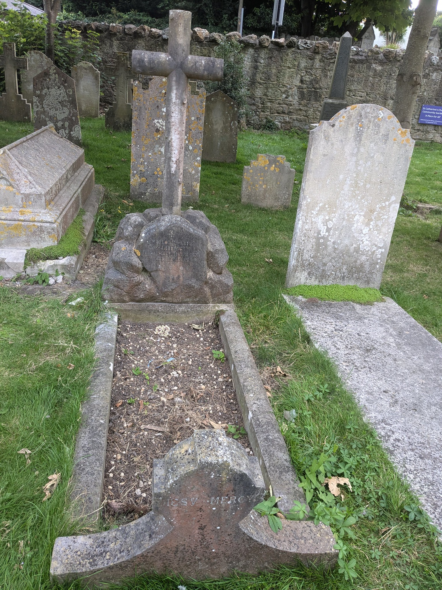
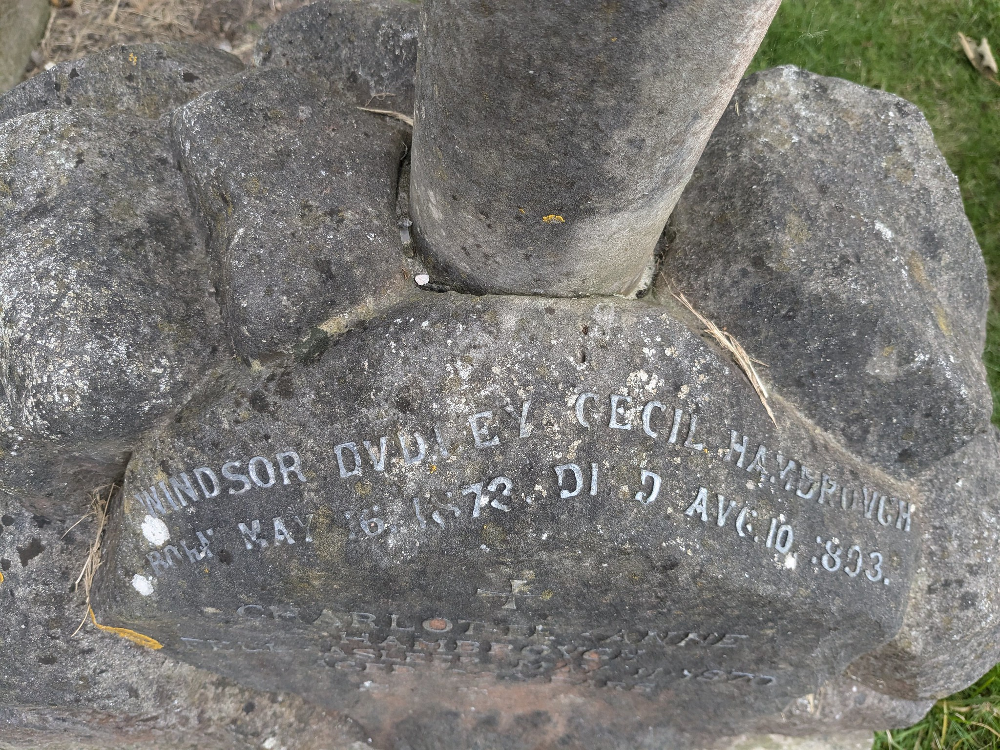
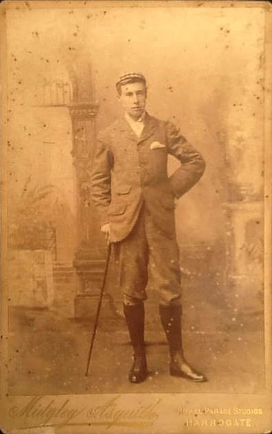
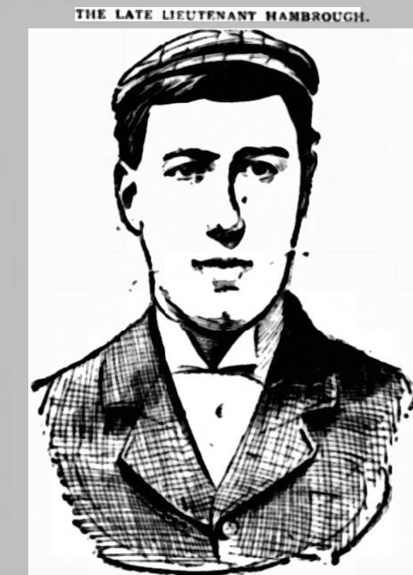
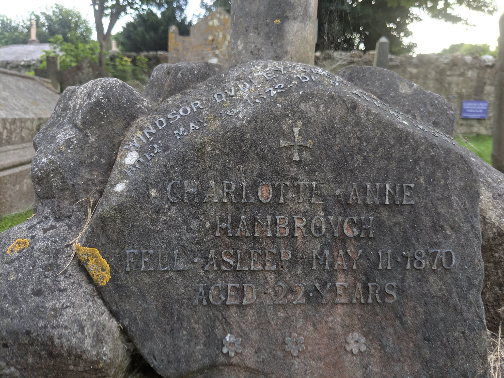

 # The Ardlamont Affair


If you walk around the graveyard of St. Catherine's Church in Ventnor, just up the road slightly from Ventnor Exchange, the home of the Ventnor Fringe, you might notice a grave of





It's 1893. Summer. And news of an accident breaks...

## A Unfortunate Accident

The popular story of the Ardlamont Mystery begins with newspaper reports in mid-August, 1893, of what appears to be an unfortunate shooting accident on an Scottish estate:

```{admonition} *YOUNG GENTLEMAN SHOT DEAD IN BUTE*, Dundee Evening Telegraph, Saturday 12 August, 1893
:class: dropdown

In Dundee Evening Telegraph, Saturday 12 August 1893, [p2](https://www.britishnewspaperarchive.co.uk/viewer/bl/0000453/18930812/009/0002):

YOUNG GENTLEMAN SHOT DEAD IN BUTE.

A sad shooting fatality happened on Thursday the estate Ardlament, some distance from Tighnabruaich. Mr Hambro *[sic]*, a young gentleman of 23 years, who is believed to have been a banker in America, and who was joint-tenant of the Ardlamont shootings along with Mr Monson, was shot dead while out shooting rabbits. The young gentleman was crossing dyke with his loaded gun, which he was carrying under his arm at full-cock. It is supposed that the trigger was caught by the bushes, and this, it is believed, caused the gun accidentally to go off. The charge lodged in the unfortunate gentleman's head, and he was killed on the spot. His friends coming up immediately afterwards were too late to render any assistance. The body was removed to House, which is at present in the possession of the shooting tenants. The sad occurrence has cast a gloom over the district. Mr Hambro hod been staying at Ardlamout with his friend Mr Monson during the past three or four weeks.

The death of young Mr Hambrough, says the *N.B. Mail*, at Ardlament is singularly sad. He seemed to be one of "Fortune's children," with a life of happiness and ease before him. Had he lived till April next he would have attained his majority and inherited a fortune of about a quarter of a million, some £70,000 of which would probably have been devoted to the purchase of the Ardlamont estate, to which he had taken a strong liking since he became the shooting tenant a few months ago. Mr Hambro was a well-built, handsome young fellow, and his simple, frank, and courteous manners had already won him many friends in the district. 

```

```{admonition} *ARDLAMONT SHOOTING FATALITY*, Glasgow Evening Post, Monday 14 August 1893
:class: dropdown

In *Glasgow Evening Post*, Monday 14 August 1893, [p3](https://www.britishnewspaperarchive.co.uk/viewer/bl/0001965/18930814/053/0003):

ARDLAMONT SHOOTING FATALITY. 

Investigation by the Fiscal. (*By Telegraph.*)  
DUNOON, 3.—Mr McNaughton, the deputy-Fiscal for Argyllshire, arrived in Dunoon this morning, after completing his investigation into the sad affair which occurred at Ardlamont on Thursday morning. The unfortunate young gentleman who met such an untimely end was only 20 years of age, and a lieutenant in the 3rd West Yorkshire Militia, his full name being Windsor Dudley Cecil Harmborough (*sic*). His father is Major Hamborough, of the same regiment. From the information now to hand, it appears that on the morning of the 10th August young Mr Hamborough went out about half-past six to shoot in a plantation close to Ardlamont House. He was accompanied by Alfred John Morrison (*sic*), his guardian, and Mr Edward Scott, engineer, Glasgow, the latter going out with the intention of carrying the game. Both Mr Hamborough and Mr Morrison had guns. In going through the plantation they separated, and in a few minutes time Mr Morrison heard a shot fired. He called out to Mr Hamborough, asking what he had_killed, but received no reply. Running in the direction from where the shot came, he was horrified to find the poor lad lying on his left side in a ditch with a gunshot wound immediately behind the left ear, the brains protruding. The gun was lying beside him. He was quite dead, No one saw the accident, and how it was caused will never be known. It is thought that he must have been walking along a dyke, which forms a sort of breast-wall, and slipped, the gun going off he fell.

The affair is one of the most lamentable that has ever happened in the district, and has cast a gloom over the whole place. The young gentleman's brother officers arrived at Ardlamont House later in the day for the purpose of enjoying a few days' shooting, and received a great shock on being informed that their friend was dead. Had Hamborough lived till he attained his majority he would have come in for a fortune of over a quarter of a million. He and Mr Morrison had just purchased the Ardlamont estate a week ago. The deceased lad's father and mother will arrive at Ardlamont today. 
```

The death of "Mr Hambro" was also reported in the *Portsmouth Evening News*: "Mr Hambro" was, in fact, Lietentant Hambrough, scion of a notable family on the Isle of Wight:

```{admonition} *Births, Marriages & Deaths*, Portsmouth Evening News, Saturday 19 August, 1893
:class: dropdown

In *Portsmouth Evening News*, Saturday 19 August 1893, [p2](https://www.britishnewspaperarchive.co.uk/viewer/bl/0000290/18930819/084/0002):

Births, Marriages & Deaths

...

HAMBROUGH. On the 10th inst., at Ardlamont House, Argyllshire, from a gun accident, W. D. C. Hambrough, Lieut. 3rd Batt. West Yorkshire Regiment, eldest son of D. A. Hambrough, late of Steephill Castle, Ventnor, I.W., in his 21st year. 

...

```

That such accidents occurred seems to have be regarded as unfortunate, but not unknown:

```{admonition} *THE COUNTY GENTLEMAN*, Sporting Gazette, Saturday 19 August 1893
:class: dropdown

In *Sporting Gazette*Saturday 19 August 1893, [p22](https://www.britishnewspaperarchive.co.uk/viewer/bl/0002525/18930819/131/0022):

THE COUNTY GENTLEMAN.

...

The sad accident by which Mr. Hamborough, of Ardlamont, in carrying his gun over a fence on his Argyllshire shooting, lost his life, has come as a reminder to some careless gunners that even in these days of patent intercepting safety blocks, automatic ejectors, and hammerless central fires, it is wise to cultivate a wholesome fear of the reckless use of firearms. Young gunners particularly are too apt to treat their central fires as if they were harmless walking-sticks. Natural carelessness prevents them appreciating risks to their friends or to themselves; and though loading and unloading has now become so exceedingly easy it never occurs to them to beware of unloading in dangerous places, where a slip or a stumble may send them and their gun rolling over together, or in placing their weapons aside during lunch to be careful to extract the cartridges beforehand. Improvements have taken away seventy-five per cent. of the risk of accidents undertaken by our grandfathers, but the risk remaining, small as it is, should not be increased by the recklessness of headlong gunners, who forget, or have never learned, the danger of treating a central-fire as if it were a plaything. Gun accidents on the whole now are very infrequent, but it is only by a due exercise of sportmanlike carefulness that they can be kept from increasing in number. 

```

## Coming of Age

To beriefly step out of a chronological view of the unfolding story, the first part of the following report provides some biographical details of Hambrough and Monson:

```{admonition} Pall Mall Gazette, Friday 01 September 1893
:class: dropdown

In *Pall Mall Gazette*, Friday 01 September 1893, [p7](https://www.britishnewspaperarchive.co.uk/viewer/bl/0000098/18930901/021/0007):

THE SCOTCH SHOOTING MYSTERY

(From our Special Correspondent.)

Not since the summer of 1889, when the young Engishman Eward Rose was so foully murdered by his false Scottish friend, J. W. Laurie, in Glen Sannox, has a tragic event north of the Tweed excited so much interest as what is now known as the Ardlamont mystery. The tourist who, has sailed in the *Coluba* or the *Lord of the Isles* through the Kyles of Bute will remember that at the western extremity of that beautiful strait the steamer turns sharply round a promontory into Loch Fyne. That promontory is Ardlamont Point. There the estate of Ardlamont is pleasntly situated. It covers 11,000 acres, one-third ot which is arable land, while the remainder is moorland, woodland, pasture, and hill country. From time immemorial the estate had been owned by the Lamonts of Cowal; but not long ago Colonel Lamont died. After his death the estate was valued at £82,000; but was offered in the market by his trustees at the upset price of £80,000. A prospective purchaser appeared in the person of a Yorkshire gentleman, Mr. Alfred John Monson who took the mansion-house and the shootings for the season as a temporary arrangement while the negotiations for the transfer of the property were proceeding. He brought his servants from England with him, and at once became very popular with everybody with whom he came in contact. After he had been at Ardlamont a month or two he was joined by Mr. Windsor Cecil Hambrough, a lieutenant in the 4th. Battalion Prince of Wale's Own Yorkshire Regiment, and the eldest son of Mr. Dudley Albert Hambrough of Steephill Castle, Isle of Wight, who is a Justice of the Peace for Hants, and generally resides at Houghton, Stockbridge. Lieutenant Hambrough having been born in 1873.

WOULD HAVE ATTAINEO HIS MAJORITY NEXT YEAR.

Mr. Monson, who was born in May, 1858, is the third son of the late Rev. Thomas John Monson, rector of Kirby-Underdale, his mother being a daughter of the fifth Viscount Galway, while his grandfather, the  Hon. and Rev Thomas Monson, rector of Bedale, was a son of the second Baron Monson and grand-uncle of the present Viscount Oxenbridge, Master of the Horse. Mr. Monson was understood to be Lieutenant Hambrough's guardaian or trustee, and on coming of age the young man, who is said to be connected with the well-known bankers, Messrs. Hambrough, Bros., London and New York, would have come into a fortune of about a quarter of million sterling, which had been left him by a near relative. After Lieutenant Hambrough's arrival at Ardlamont, an undertaking was come to that the estate should be purchased jointly by him and Mr. Monson, and title deeds to this effect were being drawn up. Then came the tragic incident which resulted in the young officer's death.

```



We can perhaps get a sense of what a coming of age celebration might have been like amongst the upper class members of Ventnor society around that time, from a report of the coming of age dinner held in honour of Hambrough's father, Dudley Albert Hambrough, back in 1870:

```{admonition} *VENTNOR — COMPLIMENTARY BANQUET*, Hampshire Independent, Friday 11 February 1870
:class: dropdown

In *Hampshire Independent*, Friday 11 February 1870, [p3](https://www.britishnewspaperarchive.co.uk/viewer/bl/0002941/18700211/035/0003):

VENTNOR. COMPLIMENTARY Banquet.—On Tuesday last a public dinner, celebrating the coming of age of Dudley Albert Hambrough, Esq., took place at the Marine Hotel, which was largely attended by the resident gentry, the principal tradesmen, and others taking an interest in a name so well known and so thoroughly respected as that borne by the young gentleman, to do honour to whom they had met together. Messrs. Bush and Judd have the credit, we believe, of being the first in Ventnor to serve a public dinner *a la Russe*, and they may be congratulated on the complete success of the experiment, for although, of course, it involves a much larger staff of waiters, the additional comfort of the guests was fully appreciated. The handsome coffee-room was tastefully and appropriately decorated for the occasion, whilst the taste and elegance of the tables, which were adorned with a number of magnificent epergnes, vases of flowers, and a splendid dessert, produced a most pleasing effect, and called forth general expressions of delight. The bill of fare was such as might tempt a hermit to forswear his vows, and, in fact, the whole of the arrangements were admirable. After the more solid business of the table had been despatched, the chairman (Dr. Leeson) proposed the health of Her Majesty the Queen, which was responded to loyally, and two verses of the National Anthem sung; after which the health of the "Prince of Wales and the rest of the Royal Family" met with an equally hearty reception. "The army, navy, and volunteers" was replied to by Captain Norris, who, in the absence of General Sir John Cheape, briefly thanked the assembly for the army and militia, and Lieutenant Camplin for the Volunteers, who, in the course of his speech, made some touching allusions to the respect and affection in which the late Mr. Hambrough had been held by the Ventnor Volunteers. They (the Volunteers) had looked forward to seeing Mr. Dudley Hambrough at their head, and they could not but grudge him to the army. but he wished the army to understand that they regarded it only in the light of a loan, and he hoped that in a few short years Mr. Hambrough would again be amongst them, taking the lead in every national and philanthropic movement The toast of the evening was then proposed by the chairman. He hoped that Mr. Hambrough would, when perhaps far distant, often recur with pleasure to the gathering of that evening. He was quite sure that the rest of those present would not readily forget it. He could not look upon the beaming face of the young gentleman beside him just entered upon manhood's many duties without anticipating for him an honourable and brilliant career, although at this same time he could not but regret that for some time he would be absent from a locality in which he had already so many friends. The toast was drunk with hearty and prolonged cheering, the toastmaster (Mr. Gilbert, of Ryde), in energetically giving the beats, bringing down the glass of a chandelier with his baton, which narrowly missed that functionary's respectable head.—Mr. Hambrough, when at length he could make himself heard, thanked those present for the hearty way in which he had been received, and the honour they had done him. His late father's memory had been touched on in a previous speech, and for the many kindly epithets which had been used in connection with it, he thanked them very much. He only hoped that he should live in such a manner as to cause his friends and neighbours to speak of him after he was gone with equal kindness and respect. After a few more remarks expressive of the pleasure he felt in meeting so goodly an assembly as the present, he sat down amidst renewed cheering.—In returning thanks for the "Town of Ventnor," Mr. T. Burt, as one of the oldest inhabitants, said he could well recollect the time when Ventnor was not. There was a place called "Ventnor Farm," but that was all. Mr. Hambrough's grandfather, when he came into this neighbourhood, anticipated a quiet retreat from the turmoil of business and the cares of society. In purchsaing the Steephill estate, he expected to be far removed from any town, or collection of houses; but no sooner was the Castle built than people began to build here and there, in what is now called Ventnor, and gradually the town grew. Now, when Mr. Hambrough thus found his expectations disappointed, did he leave the neighbourhood or otherwise show his vexation? No, he erupted his new position, and the duties which were attached to it, and he commenced by building St. Catherine's Church; and the present still growing and prosperous town is, to a great extent, the result of the fostering care and generosity thus bestowed upon its infancy. Mr. Dudley Hambrough, now present, and whose majority they had met to celebrate, now stands in the same position as that occupied by his grandfather thirty or forty years ago, and from what he (Mr. Burt) had heard, he had no doubt that he would occupy his important position in such a manner as to give satisfaction to his neighbours and do honour to himself.—The health of Mrs. Verner and the ladies of Steephill was then proposed by Mr. Martin, which being drank with honours, Dr. Leeson returned thanks in a few appropriate words. He then named "the clergy," which was responded to *seriatim* by the four clerical gentlemen present, Mr. Wills, by reason of the virtues of "Good old St. Catherine," taking the precedence. Mr. Peile referred to the great kindness he had individually experienced from the late Mr. Hambrough and his amiable family. It was, in fact, indirectly through him that he had taken up his residence in Ventnor. He liked meetings of the present character; it threw people together who would otherwise not have the opportunity of making one another's acquaintance. Clergymen could for a time drop their strict clerical character; for his part, he liked to associate occasionally as well as to teach, and he had made many friends at the dinner table. After a few more remarks complimentary to the gentleman occupying the post of honour, he proposed the health of the worthy chairman, who had just taken a new lease of life, if he might so call it, and none who knew Mrs. Leeson could say that the doctor had acted otherwise than wisely.—In returning thanks Dr. Leeson thanked Mr. Peile for his ingenuity, and assured him of no better pre scription. and sat down amidst cheers and laugher.—The committee and secretary being proposed by the chairman, who referred to the secretary's readiness to couple himself with any scheme which could in any way promote the welfare and happiness of his fellow townsmen.—Mr. Trueman rose and said the absence of the original secretary, Mr. G. M. Burt, was occasioned by the loss of a near and dear relative, and having in a few appropriate words referred to the prospects of the town, and the auspicious event they were celebrating, Mr. Wells, in the absence of Dr. Whitehead, named "the ladies," a toast which met with its accustomed warm reception. Mr. Wells liked to propose "the ladies," and he was sure everybody liked to drink their health. He hoped he should be forgiven if he expressed a hope that in the hearts of most of those present the ladies were indelibly engraven. During the evening attention had been called to the rapid growth which had been made by Ventnor. He thought it a pity that a more uniform plan had not been considered in the construction of the town. The natural features, which in the Undercliff are everywhere charming, had not been sufficiently preserved. That, however, was to he expected from the eleemosynary way in which the town had been built. Now a large portion of the Steephill estate was about to be thrown into the building market for the erection of first-class residential houses, and a plan worked upon which, when the new town was completed, would combine the proper position and classing of roads and houses with the elimination of all that was naturally beautiful (a voice: "The ladies"). He believed that this was great prospect for Ventnor. He had noticed that the shops increased in undne proportion to the surrounding residences. Perhaps in the whole Undercliff there was no place to compare in natural beauty with Steephill. He who had seen the sun's noon-tide rays glistening upon the—(cries, "the ladies, the ladies"). Gentlemen, if you interrupt me so I shall lose the point. I was going to say—. The chairman: But when are we to get to "the ladies." Mr. Wells: As I see you are in a hurry, gentlemen. I will not detain you any longer than to propose in all respect "The health of the ladies." This was drunk "bumpers all," and the chairman, Mr. Hambrough, and several others left—Mr. T. A. Raynes was then elected to the chair, and a vote of thanks passed to Messrs. Bush and Judd for the admirable manner in which they had carried out their arrangements. The meeting did not separate till a late hour, when all expressed themselves delighted with the evening they had spent —The gentlemen acting as the committee, and with whom the project of the dinner originated, are Mr. T. Burt, Mr. T. A. Raynes, Mr. G. M. Burt, Mr. T. H. Grey, Mr. L. B. Trimen, Mr. F. Trueman, Mr. Moore, and Mr. Gibbs.
```

For a history of the Steephill Castle itself, see [*Steephill Castle, Ventnor, Isle of Wight, the residence of John Morgan Richards, Esq.; a handbook and a history*](https://archive.org/details/steephillcastlev00mars/page/n7/mode/2up), John B. Marsh, 1907.

## The Rumours Begin

But what more of the shooting? A couple of weeks after the accident was first reported, rumours are starting to circulate:

```{admonition} *THE ARDLAMONT SHOOTING FATALITY*, Aberdeen Press and Journal, Tuesday 29 August 1893
:class: dropdown

In *Aberdeen Press and Journal*, Tuesday 29 August 1893, [p5](https://www.britishnewspaperarchive.co.uk/viewer/bl/0000575/18930829/070/0005):

THE ARDLAMONT SHOOTING FATALITY 

According to rumour pretty current in the Ardlament district, a new and startling development has taken place in regard the fatal shooting accident which occurred there nearly three weeks ago. It may be recalled that the story was that on the 10th of the present month Mr Hambro, the young gentleman, who had just attained his majority, was out shooting rabbits. It was said he was not proficient in handling a gun, and that while crossing a dyke his foot slipped, and the gun went off, all the contents lodging in his head. No one, however, seems to have been beside the unfortunate lad at the time, and it is now whispered that the gunshot wound did not appear to be such as an accident could account for. nor such as he could well have inflicted upon himself. The sheriff and a doctor and police officials visited the scene of the occurence on Saturday, and it is reported that the body of the deceased gentleman is to exhumed. It also appears that on the Tuesday prior to the accident young Hambro had a narrow escape from drowning. He was out boating, when the craft either sank or capsized. He was unable to swim, but was picked up by a gentleman who was fishing in the neighbourhood. 

```

```{admonition} *THE ARDLAMONT SHOOTING FATALITY*, Glasgow Herald, Tuesday 29 August 1893
:class: dropdown

In *Glasgow Herald*, Tuesday 29 August 1893, [p4](https://www.britishnewspaperarchive.co.uk/viewer/bl/0000060/18930829/020/0004):

THE ARDLAMONT SHOOTING FATALITY.

Yesterday Captain Fraser, chief-constable for Argyllshire; Mr MacNaughton, deputy-fiscal for the county; and a police official from Gourock visited Ardlamont, Kyles of Bute, with the view of making further investigations regarding the sad death of Lieutenant Windsor Cecil Dudley Hamborough, of the West Yorkshire Militia, who was shot dead while out rabbit-shooting on the Ardlamont Estate on the morning of the 1Oth inst. The young gentleman's death, together with many strange rumours regarding it which are current in the Ardlamont district, has thrown the whole neighbourbood into a state of great excitement.

It will be remembered that on the morning of the 10th inst. Mr Hamborough. went out about half-past six to shoot in a plantation close to Ardlamont House. He was accomipanied by Mr Alfred John Monson, his guardian, and Mr Edward Scott, an engineer, the latter going out with the intention of carrying the game. Both Mr Hanmborough and Mr Monson had guns. In going through the plantation they separated, and in a few minutes' time Mr Monson heard a shot fired. He called out to Mr Hamborough, askise what he had killed, but received no reply, Running in the direction from where the shot came, he was horrified to find the poor lad lying on his left side in a ditch with a gunshot wound immediately behind the left ear, the brains protruding.

A new and startling development has taken place with regard to the tragic affair, inasmuch as Mr Scott has left. Inquiries are being made to ascertain his whereabouts, and it is hoped that, if found, he may be able to throw light on the mystery. It is said that Mr Hamborough was a novice with the gun, and that while going over a dyke his foot slipped and the gun went off. It is now rumnoured that the gunshot wound did not appear to be such as an accident of the kind could account for, nor such as he could have inflicted upon himself, the shot having entered the back of the left ear in a horizontal position. It is also rumoured that the company in which the deceased gentleman was insured had refused to pay the amount of the policy, but on inquiry we learn that up to the present time no claim has been lodged with the insurance company. The deceased gentleman had a narrow escape from drowning on the evening prior to his death. 

```

On top of the rumours, renewed official interest in the case:

```{admonition} *THE ARDLAMONT SHOOTING CASE: Extraordinatry Developments*, Glasgow Evening Post, Tuesday 29 August 1893
:class: dropdown

In *Glasgow Evening Post*, Tuesday 29 August 1893, [p5](https://www.britishnewspaperarchive.co.uk/viewer/bl/0001965/18930829/102/0005):

THE ARDLAMONT SHOOTING CASE

Extraordinary Developments.  
Renewed Investigation the Police.  
(*From Our Special Reporter.*)  
TIGHNABRUAICH, Tuesday Morning.

Within the past few days the Ardlamont shooting case, briefly commented upon by the newspapers a fortnight ago as an unfortunate accident presenting no suspicious features, has been magnified in the eyes the people of Ardlamont, Dunoon, Tighnabruaich, and the neighbourhood into something approaching a tragedy. This new, and so far, unjustifiably extravagant view of the case has been the result of certain unusual steps on the part of the police authorities of the County of Argyll, in which the affair occurred. It is but right say at the outset that up till last night no evidence had been brought forward satisfactorily discrediting the hypothesis first formed that Mr Hamborough, the unfortunate victim of the accident of 10th inst., was killed by the accidental discharge of his own gun. The Argyllshire police authorities, however, would appear to consider that they have got upon the track of a serious crime, judging from the extraordinary and elaborate investigations and experiments they have been making in the course of the past week. At the present moment the entire criminal administration of the county massed on Ardlamont. The Sheriff-Substitute of the county, Mr Campbell Shairp, along with the Procurator-Fiscal, J. C. M'Lullich, and his deputy, Mr Thomas M'Naughton from Inveraray, as well as the Chief Constable of the county, Mr Fraser, from Lochgilphead, proceeded to Tighnabruaich yesterday afternoon in order to make the third investigation into all the details of the unfortunate incident. The whole district is accordingly in a state of intense excitement regarding the ultimate outcome of these police measures, and the wildest rumours are prevalent.

So briefly and so inaccurately was the affair of the 10th inst. reported that it may be well to give, even at this date,  
A CORRECT AND FULL ACCOUNT  
of it. At the outset is necessary to explain that the estate of Ardlamont is in the market for sale. It is an extensive and beautiful tract of country between Tighnabruaich and Lochfyne, and the passenger through the Kyles of Bute sees the southern extremity of it at the prominent portion of the northern mainland familiar as Ardlamont Point. The estate, according to the recent valuation, is worth about £82,000, and the upset price which it has been offered is £8O,OOO. A prospective purchaser of this old historic Cowal estate came forward last spring in the person of Mr Alfred John Monson, a Yorkshire gentleman, who now occupies the most unpleasant position of anyone involved in the shooting ease. He took the mansion house and shootings for the season as a temporary arrangement while the negotiations for the transfer of the estate were proceeding, and brought servants from England. A month or two later Mr Monson—who became very popular among the permanent officials and servants on the estate —was joined by a Mr Windsor Cecil Dudley Hamborough, a lieutenant in the 3rd Battalion West York Regiment (militia), whose "guardian" or trustee he was understood to be under the testament of a relative of Hamborough, who had left that gentleman a quarter of million of money. This money Mr Hamborough. who was 20 years of age, was to inherit on his majority. Mr Hamborough's arrival gave a new phase to the negotiations for the purchase of the estate, the understanding come to being that the purchase was to be a joint arrangement between Mr Monson and him. So far had the negotiations gone in this direction that it is probable, but for the affair of the 10th inst, the title-deeds would have been signed before now. A small steam launch, the "Alert," was purchased, and Mr Hamborough engaged  
A YOUNG MAN NAMED EDWARD SCOTT  
as engineer. Scott is described as a very gentlemanly-looking Englishman, who came to Ardlamont on the 9th, was nearly all the time in the company of his employers, and was even privileged to dine with them. Beyond this, nothing is known about him at Ardlamont, and his sudden and inexplicable disappearance from the place within the past week has been one of the incidents which have set the police upon a new course of investigation.

On the morning of Thursday, the 10th inst, Mr Monson and Mr Hamborough went out before breakfast to a small planting, near Ardlamont House, to shoot rabbits, and they were accompanied by Scott, who was to carry any game that might be killed. Scott had no gun. The guns which the two gentlemen carried were of different bores—one being a 12-bore and the other a 20. One rabbit only had been shot, and, to Monson's story, he was passing through the wood towards the house, on the opposite side of the wood from Mr Hamborough when he heard a shot fired. He cried out asking his fnend what he had got, and receiving no answer went in the direction in which he had heard the discharge, and found his friend lying dead beside a small embankment. The exact situation is within twenty yards of the high road, and beside the road are the stables of Ardlamont House, the house itself being only a few yards further off. Monson carried  
HIS OWN GUN AND HIS FRIEND'S  
into the house and got and a gardner and some others to remove the body there. The factor on the estate—Mr Steven—was called and Dr M'Millan, Tignabruaich, was sent for. The doctor, on examining the body, found a gunshot wound of between two and three inches wide behind the right ear. The wound, as would naturally happen in the case of a discharge of small shot at close range was pulpy and well-defined, and the face was untouched. Mortification ensued very rapdly, and whenever the deputy Procurator-Fiscal (Mr M'Naughton) had made the necessary formal examination of the body it was coffined and sent to the Isle of Ventnor (*sic*), Isle of Wight, for interment. Mr Steven, the factor, acting upon the instructions of the deceased's father and mother, who were summoned to Ardlamont on Thursday night, accompanied the coffin to the Isle of Wight.

The examination by the Deputy-Fiscal gave no substantial cause for doubting that an accident had happened in the manner suggested, although it was considered rather curious that a horizontal wound at the back of the right ear should have been caused by the accidental discharge of the victim's gun, the position necessary before such an occurrence could take place being a very improbable one. The explanation offered was that Mr Hamborough had been walking along the top of a dyke, carrying his gun at full cock, and had fallen off the dyke, with the result that the gun was discharged.

All these facts were collected by Mr M'Naughton, the Deputy-Fiscal, who proceeded to Inverary on Monday to lay them before his chief previous to their being reported in the ordinary course to Crown counsel. The bald facts of the case were secured with difficulty by the local correspondents of the Glasgow newspapers, and several details which were altogether erroneous. The whole matter was then considered to be at end. Local sentiment, and  
LOCAL IMAGINATION,  
the latter always very strong agent among country communities where tragedies are rare, began, however, to invest the affair with sinister theories, and certain new facts transpired which gave wings to all sorts of rumours. In the first place, it was learned that Mr Hamborough instead of being a novice with the gun, as was first stated, was an expert marksman, who had been for years used to the handling of firearms. Then it transpired that within a few days previously he had narrowly escaped death twice—once by the discharge of his gun and once by a boating accident. To crown all, the Procurator-Fiscal appeared on the scene again prepared to make further investigation, and was surprised to find that Scott had disappeared, leaving no trace behind. He left Tignabruaich by the Columba on Saturday, 12th, giving his address to the police as the Central Hotel, Glasgow. At the Central Hotel no such person is known, and Mr Monson, the only one who could be expected to give a clue to Scott's whereabouts, professes himself absolutely ignorant of his antecedents or his present location. The guns at this stage evidently assumed a new interest for the police, for they were taken possession of and sent to Inverary, mainly, it is understood, because of  
A GRAVE STATEMENT  
by a gamekeeper on the estate as to the relative users of the two guns and the apparent bore of weapon which had inflicted the wound. Experiments with the two guns at various ranges have, we understand, been made. The climax came, however, with the new fact which only canme to light last week, that the deceased's life was insured for £20,000 indirectly in favour of Mr Monson. Mr Monson, who was naturally very much affected by the lamentable occurrence of the 1Oth has within the past few days had the unpleasantness of his position intensified, for it understood that he is practically under police surveillance.

```

As the rumours took shape, they start to be described as "sinister" rumours:

```{admonition} *A YOUNG MAN'S TRAGIC END*, Dundee Courier, Tuesday 29 August 1893
:class: dropdown

In *Dundee Courier*, Tuesday 29 August 1893, [p5](https://www.britishnewspaperarchive.co.uk/viewer/bl/0000162/18930829/060/0005):

A YOUNG MAN'S TRAGIC END.  
INSURED FOR £10,000.  
SINISTER RUMOURS.

According to rumour pretty current in the Ardlamont district of Argyleshire, a new and startling development has taken place in regard to the fatal shooting accident which occurred there nearly three weeks ago. It may be recalled (*says the Glasgow Evening Citizen*) that the story was that on the 10th of the present month Mr Hambro, the young gentleman, who had just attained his majority, was out shooting rabbits. It was said he was not proficient in handling gun, and that while crossing a dyke his foot slipped and the gun went off, all the contents lodging in his head. No one, however, seems to have been beside the unfortunate lad at the time, and it is now whispered that the gunshot wound did not appear to be such as an accident could account for nor such as he could well have inflicted upon himself. Deceased is reported to have been insured in an American office for £10,000, and in view of the mysterious nature of his death the insurance company, it is said, has declined to pay up. Be that as it may, the Sheriff and a doctor and police official visited the scene of the occurrence on Saturday and it is reported that the body of the deceased gentleman is to be exhumed. It also appears that on the Tuesday prior to the accident Hambro had a narrow escape from drowning. He was out boating with two friends when the craft either sank through the plug coming out or capsized. While his companions could swim, he was unable to do so, but was picked up by a gentleman who was fishing in the neighbourhood—only, however, as it turned out, to meet with a still more violent death two days later. 

```

And then — an arrest, along with an interview with one of the estate workers from a member of the press:

```{admonition} *Sensational Developments*, Glasgow Evening Post, Wednesday 30 August 1893
:class: dropdown

In *Glasgow Evening Post*, Wednesday 30 August 1893, [p5](https://www.britishnewspaperarchive.co.uk/viewer/bl/0001965/18930830/166/0005)

THE ARDLAMONT SHOOTING CASE.  
Sensational Developments.  
ARREST OF MR MONSON  
His Removal to Inveraray-  
Rumoured Arrest of Scott  
(*From Our Own Reporter.*) 

TIGNABRUAICH, Wednesday.—The excitement regarding the Ardlamont shooting case reached a climax this forenoon, when Mr Monson, the tenant of the estate, was arrested. Sheriff Shairp and the representatives of the criminal authorities for the county took an extraordinary number of precognitions yesterday, and the substance of these justified them in taking that important and grave step.

The arrest was made in the morning, but it was done very quietly. The news, however, leaked out, and it was believed the prisoner would be at once taken to Inverary, a crowd gathered on the pier before eleven o'clock to await the arrival of the Lord of the Isles.

At a quarter-past eleven on the pier were the Sheriff, the Chief Constable, the Fiscal, and the Fiscal-Depute. They at once went on board. Behind them came a little group of three men, and they hurriedly went through the crowd and made their way downstairs. The three wore plain clothes —Constables Ross and M'Lean, with the prisoner, Mr Monson, young man, dressed in a stylish navy blue suit, black felt hat, and black bow tie, who shunned the eyes turned upon him, and looked exceedingly embarrassed and haggard.

The Columba happened this morning to get left behind by the Inverary steamer through calling at Kirn, and she arrived about five minuter behind the other. Mr Monson's brother and Steven, the factor, were on board. The brother was thunderstruck on being informed by the local constable of what had taken place, and the steamer conveying his brother whom he had specially come to meet being but few hundred yards off.

The village here remains in a state of surprise at the turn events have taken, more especially as it is rumoured that Scott has been taken into custody by the London police.

Interviews on the Estate.  
(*From Our Own Reporter.*)
TIGHNABRUAICH, Wednesday Morning.  
Following up the inquiry of yesterday, as fully reported in the *News*, I have interviewed a number of the persons upon whose evidence the action of the police authorities to a large degree depends; and I have driven out to that portion of the estate where the incident of the 10th occurred. The police are naturally reticent, partly because they think it injudicious to confide too much in the reporters, but mainly because they have very little beyond incomplete theories to work upon. Scott's disappearance is, they admit, greatly to be regretted. All that was done to keep track of him was to instruct the policeman at Tighnabruaich Pier to get his name and address as left the Columba, and though this was done, it was, as events have proved, a useless precaution. The most graphic and reliable account of the whole affair which I have yet got was from Mr Steven, the acting factor on the Ardlamont estate. Mr Steven, who is a young man from Cathcart, is an acute and business like gentleman, popular with all the tenantry and employes on the estate. Residing within few hundred yards of Ardlamont House, he naturally came into daily contact with all the parties involved in this affair, and his services were particularly in request after the sad occurrence of the 10th. It is but fair to Mr Steven to say that had he been aware of the fact that his interviewer was a member of the press he would probably have been less free with his story, for the police have discouraged too much publicity in the meantime. "Mr Monson," he said, in answer to inquiries, "was the first one who, in response to advertisement in the papers, came here, and was followed sometime after by Hambrough. The statement that the estate was sold them made by some of the newspapers is untrue;  
TERMS HAD NOT BEEN COME TO.  
Mr Monson is a quiet, good-natured gentleman, and so was Mr Hambrough. They were both temperate men, indeed Mr Hambrough was almost a teetotaler. So far as I saw all the party lived very harmoniously and agreeably together. The first time I saw Scott he was along with Mr Hambrough and Mr Monson, and I took him for one the party. On the morning of the 10th, when the three went out shooting they took a circuitous route round the estate coming back through the planting to the house in order to get breakfast. They were within twenty or thirty yards of being out of the wood when the shot was heard. Mr Hambrough was on the right side of the wood going toward the house, and Scott and Mr Monson were the opposite side of the wood. Hamurough's left side was towards his friends, and he was shot in the right side. I was not near the wood at the time, but am certain I heard the shot fired. Shortly afterwards the gardener came to me and told me one of the gentlemen had shot himself in the planting. We took a cart and found that Monson and Scott had lifted the body from the ditch it is believed to have fallen into, and placed him on the bank above it.  
I DID NOT SEE ANY GUNS  
Mr Monson was said to have carried them into the house. The body was carried into the house, and M'Millan was sent for. Mr Monson was, naturally, in a terribly grieved condition. I went to Glasgow to order a coffin and make arrangements for the removal of the body to Ventnor, and when on my way back I was joined by the father and mother of the deceased, who were very much shocked at the sudden death of their son. My impression is that Mr Hambrough met his death in the way suggested, falling while his gun was full cock, and consequently receiving the shot in his head. He was, I believe, an expert with the gun; at least all the men about here say so, and his father told me that he had since early youth been accustomed to handle firearms. I am afraid the Procurator Fiscal has been too hastily flying at  
RASH CONCLUSIONS  
in this matter. I speak from an intimate knowledge of all the facts and of all the parties. One thing, by the way, which seems to have passed unobserved that some of the scattered pellets from the fatal shot lodged in a tree beside which Mr Hambrough fell. The marks are plainly to be distinguished.

Where does Mr Monson come from?

I don't know; I have heard that he comes from Yorkshire, but can't speak with any certainty. The arrangements for letting the place were made through our Edinburgh agents.

And Mr Hambrough. where does he come from?

He belonged to Yorkshire, but his family, so far as I can learn, is best known at Ventnor.

What about the insurance on the life of the deceased, said have been assigned to Mr Monson ?

Well, I have spoken to Mr Monson about that, and he has told me, and can prove, that the death of his friend means a considerable loss of money to him. I consider all the prevalent rumours as absurd."

One of the men the estate, speaking evidently the sentiments of his fellow workmen, expressed the utmost sympathy with Mr Monson in his troubles. At the same time he animadverted strongly upon the conduct of the shooting party (augmented since the accident) which has not lost a single day's sport on the hill since the sad event. I was anxious to see Monson and have an interview with him. but was informed that he was that moment away shooting. A somewhat  
FORMAL DINNER PARTY  
it is said, took place in the house on the evening on which the Depute-Procurator-Fiscal made his examination. It is hardly necessary to say that that gentleman did not avail himself of an invitation he got to be present. His examination was carried out under the most unpleasant conditions, for the usual dressings above the wound had slipped off, and besides the purely legal duties of Procurator-Fiscal. Mr M'Naugbton had to exercise those of another profession by putting lint dressings on the body himself. It is significant of the distressing effect the accident had upon both Mr Monson and Mr Scott that none of them could be prevailed upon to look at the body after it had been carried into the house.

Since Monday the estate officials have prevented any unauthorised person visiting that portion the estate in which the accident occurred, but for the time being I found the rule relaxed, and drove from Tighnabruaich to the edge of the wood where Mr Hambrough was shot. It is round a corner from the factor's house, and within sight of the mansion-house — the stables, indeed, as stated yesterday, being only a few yards from where Mr Hambrough's body was found. The wood is mere planting." much longer than it is broad, and, as there little brush in it, and the trees are fairly wide apart, one can see right through it. Mr Hambrough's body when seen by the factor and workmen was on the extreme edge of the wood, beside a moss-covered or drystone dyke, or rather embankment, which dips a few feet into an adjoining field. Scott said they found Mr Hambrough in the field, and lifted him up on to the bank. As is the custom among Highlanders, the workmen on the estate have already piled a smail cairn of stones at the spot.

SCOTT'S DISAPPEARANCE  
was in no way covert, it should be understood. He told several people that as he would not be needed any longer for the "Alert" he would go. He was, according to his first plan, to go away at two o'clock in the afternoon, but as some further information was wanted from him, he remained for the Columba at 2.45. Mr Steven, the factor, drove him in his gig to Tighnabruaich Pier. 

```

By this point, details of Mr Monson were becoming of interest:

```{admonition} Nottingham Evening Post, Thursday 31 August 1893
:class: dropdown

In *Nottingham Evening Post*, Thursday 31 August 1893, [p3](https://www.britishnewspaperarchive.co.uk/viewer/bl/0000321/18930831/019/0003):

THE ARDLAMONT MYSTERY.

Mr. Alfred Monson was brought before the Sheriff at Court House to-day. The proceedings were private, but it is understood that Mr. Monson sticks circumstantially to the account already given by him of what he knew of the tragic death of Mr. Hambrough on the 10th inst. Mr Monson is the third son of the late Rev. Monson, Rector of Kirkby-under-Dale, Yorkshire, his mother being a daughter of the fifth Viscount Galway.

```

Details were also emerging about another near-fatal accident suffered by Mr Hamborough just hours before his death:

```{admonition} Dundee Evening Telegraph, Thursday 31 August 1893
:class: dropdown

In *Dundee Evening Telegraph*, Thursday 31 August 1893, [p2](https://www.britishnewspaperarchive.co.uk/viewer/bl/0000453/18930831/006/0002):

THE ARDLAMONT MYSTERY.  
DECLARATION BY THE PRISONER.

Mr Monson made a declaration to-day before Sheriff Shairp at Inveraray. The examination was of course conducted in private; but, it is understood, that Mr Monson sticks substantially by his former account of the affair of the 10th inst.

MR HAMBROGH AND MR MONSON.

As erroneous statements have been put in currency as to the connection of the two principal parties in this lamentable tragedy, the following particulars, taken from an authoritative source, says the *N. B. Mail*, may be given :—

Windsor Dudley Cecil Hambrough was the eldest son of Dudley Albert Hambrough Esq., Steephill Castle, Isle of Wight He was born 1873, and would have attained his majority early next year. He was lieutenant in the 4th Battalion Prince of Wales' Own Yorkshire Regiment. Lieutenant Hambrough's father is a J.P. for Hants, and the patron of two livings, and resides principally at Houghton, Stookbridge.

Alfred John Monson is the third son of the late Rev. Thomas John Monson, rector of Kirby-under-Dale, Yorkshire, his mother being a daughter the fifth Viscount Galway. He was born in May, 1860, and is thus in his 34th year. Mr Monson is a member of the family which Viscount Oxenbridge, the Master of the Horse, is the head, his grandfather, the Hon. and Rev. Thomas Monson. rector of Bedale, having been a son of the second Baron Monson, and the granduncle of the present Peer.

ANOTHER INSURANCE PROPOSAL.

A Rothesay correspondent telegraphs:—It may be stated that Dr Lawson. Rothesay, received a communication on 25th July from the head office of the Royal Insurance Company, Liverpool, stating that Lieutenant Windsor Dudley Cecil Hambrough, who, it was said, was then residing in Rothesay, would call for medical examination with reference to insurance. The young gentleman, however, did not call. He was said to be 21 years of age and resided at Risely Hall, Ripley, Yorkshire.

NOTES AND INCIDENTS.

The case, to which the arrest has imparted a complexion which it did not seem to bear at first, seems, says the *Glasgow Herald*, more peculiar the more it is inquired into. For obvious reasons it would be injudicious at the present time publish all the circumstances connected with it. There has been a good deal of comment on the fact that Mr Hambrough was rescued from a perilous position not many hours before he lost his life by shooting. At dusk on the evening of the 9th instant he went out sea-fishing in a boat with Mr Monson at Ardlamont Point. The boat struck on a rock and filled with water. Hambrough could not swim, but his companion could do so, and he went ashore for aid, returning with another boat in which he took his ward to land. Both men arrived at Ardlamont House at two o'clock in the morning, drenched to the skin, and Hambrough in particular very much exhausted. In spite of this they were early astir, and were out shooting as early as six o'clock. As an explanation of the reason why they were so soon about, Mr Monson that his wife and family, who were residing with him at Ardlamont, had occasion to visit Glasgow that day, and that as he had to be up at any rate to see them off he thought might as well put in the morning rabbit shooting with his ward. An hour and half after they set out Mr Hambrough was lying dead, shot in the back of the head. The gardener and the joiner who are employed on the estate were summoned, and they carried the body into the mansion-house, where it was seen two hours afterwards by Dr Macmillan, from Tighnabruaich. He wrote a report on the case, stating that death had resulted from a gunshot wound, and gave it as his opinion that it might have been caused by Mr Hambrough getting over the wall where his body was found holding his gun incautiously in his hand. This report, it may be explained, was granted on the assumption that the young gentleman had been using a short 20-bore sporting gun. It was subsequently ascertained, however, that his gun was a long 12-bore. In reference to this, Mr Monson said that they had exchanged guns when they were out. They had really wished to test a new sporting powder, known as amberite, and finding that they had no cartridges that morning which would suit Hambrough's gun they effected the exchange. In view of the fact referred to, Dr Macmillan at once withdrew his report and certificate from the Procurator-Fiscal, and also from the officials of American Insurance Company who had insured Mr Hambrough's life before his death for £20,000. At the time of the tragedy young Hambrough was in his twenty-first year, and it is believed there was an uncompleted document in existence which had been written with the object assigning the policy to Mr Monson.

A SINISTER FACT.

In the hurry and bustle incidental to so sad a tragedy it is not strange that some minor matters should have escaped attention at the time. About six yards distant from the place where Hambrough's feet were there is a small tree growing, and a careful examination of the bark about the height of a man's head shows a number pellet marks. The young man's head was not disfigured by the scorching or burning of gunpowder. 

```

As word came out that the original examining doctor's report had been withdrawn, it was revelaed that Hambrough's body was to be exhumed. Scott's disappearance was also increasingly commented upon, and his description started to be circulated, even as there were rumpours of his arrest in London.

```{admonition} *ARREST OF MONSON; HIS WARD'S BODY TO BE EXHUMED.*Dundee Courier - Thursday 31 August 1893
:class: dropdown

In *Dundee Courier*, Thursday 31 August 1893, [https://www.britishnewspaperarchive.co.uk/viewer/bl/0000162/18930831/036/0003](p3):

THE ARDLAMONT MYSTERY.  
ARREST OF MONSON.  
HIS WARD'S BODY TO BE EXHUMED.  
THE MISSING MAN SCOTT.  
RUMOURED ARREST IN LONDON.  
EXCITEMENT IN THE DISTRICT.

Yesterday morning Mr Alfred Henry Monson, the tenant of the Ardlamont estate, Argyllshire, was arrested in connection with the death of his ward, Windsor Dudley Cecil Hambrough, by shooting, on the 10th of this month, full particulars of which were given in yesterday's *Courier*. The arrest was effected very quietly at seven o'clock in the moi on the public road leading to Ardlamont House >y Chief Constable Eraser. When about five miles out from Tighnabruaich, and within two miles Ardlamont House, met driving in a pony trap with guest who was going awav the Glasgow and South-Western steamer Neptune for Prince's Pier, Greenock. Seated at the back of Mr Monson's machine was a police officer, Sergeant Ross, of Lochgilpheau, who been shadowing him since Monday night. When Captain Fraser met the party he intimated that he had some business with throwing the reins to his friend, told him to on and leave the horse and machine the village. Mr Monson, apparently thinking that the liiei Constable was going straight the house, off his own trap and jumped on Captain Fraser's trap, and was followed by Sergeant Ross. Having got his man safely on board, Captain Fraser then turned the horse's head towards Tighnabruaich, and was told that he might consider himself his prisoner for having caused the death his friend, Hambrough. Monson, although taken by surprise by the suddenness of his arrest, took the matter very coolly. The prisoner was conveyed the Royal Hotel at Tighnabruiach, the party being met by the road Sheriff and the Fiscals, who were going out to the scene of the fatality to make some further inquiries bofore leaving the neighbourhood. The prisoner was removed to Inveraray by the Lord of the Isles. Monson is yonngish-looking man. His age is 35. He is middle height and fair complexion, and has a cleanshaven face, sharp features, and a rather prominent nose, which is slightly twisted to one side. At Crarae Mr M'Laclilan, writer, Lochgilphead, joined the Lord of the Isles, and proceeded with the prisoner to Inveraray. Mr M'Lachlan is act the prisoner's defence. telegraphed him before leaving Tighnabruaich.

BODY TO EXHUMED.

In view of the developments in the case, the body of Hambrough, which was taken England for interment, is to be exhumed.

COULD THE INSURANCE POLICY BE ASSIGNED ?

As has been already stated, the deceased gentleman about ten days before his death effected insurance for £20,000 with the Mutual Life Assurance Society of New York. The policy, however, having to come from New York, had never reached him, and could not, therefoie, have beon assigned to any one, whatever the intention may have been. Regarding the alleged assignation of the insurance policy on Hambrough's life to Monson, our representative was yesterday told that Monson's own explanation of the matter that the police was in course of being assigned to him, but that the assignment was not the date of Hambrough's death.

THE NATURE OF THE EVIDENCE.

The evidence in possession of the authorities believed, so far, to be circumstantial. Special points which are being investigated are the probable elevation at which the gun went off, and the kind of shot with which was loaded. It is reported that some of the pellets lodged in the trunk of a tree near at hand about a man s height.

THE MISSING MAN SCOTT.

Edward Scott, the man who is wanted by the police, is 28 years of age, between 5 ft. 9 in. and 5 ft. 10 in. in height. He has a sallow complexion, small dark moustachios, steel grey eyes, and carries his head erect, but there is nothing peculiar ia his gait. At the time he was last seen he wore a dark blue cloth coat and waistcoat and dark grey trousers. It is understood that Monson has given information to the police to the effect that he has heard from Scott since lie left Tighnabruaich, and that he believes that he is at present in London. When Scott was leaving Tighnabruich on the evening of the Saturday when young Hambrough was shot the local policeman, Duncan M'Calman, in view of the fact that the inquiry had not been completed, with commendable official sagacity, advised him not to go away, but as he had not a warrant he could not, of course, detain him, and Scott accordingly went on board the boat.

THE BOATING ACCIDENT.

There has been lot of talk here during the past day or two about the boating and the shooting accident occurring on the some morning within such short time of each other, the accident on the loch happening half-past one, and the fatal shooting affair at half-past seven. The explanation given of that is that Mrs Monson and her family, three in number, required to go Glasgow by the early morning boat, and that the family had all to be up very early in consequence. He also got Hambrough up, and, when his wife and family had gone, the three men (Scott, it will be recollected, being with them) went out shooting. When the body was found the men got the gardener and joiner on the estate, and they, with young Lyon, the farmer's son, removed the remains into the mansion house.

THE DOCTOR'S STATEMENT.

Dr M'Millan, of Tighnabruaich, who examined Hambrough's body, granted a report in which he certified that death had resulted from gunshot wound, and it is further said that he led it be understood that he was perfectly satisfied that the death had been an accidental one. On that account the inquiry was the meantime stayed, only to be resumed on Thursday last more extended scale in consequence of rumoursi having got abroad that there had been foul play the matter. Monson's arrest is believed to have been made under instructions from the Crown Counsel. It is now stated that Dr M'Millan withdrew his first report and certified that the accident had not occurred in the way he had at first supposed.

MONSON BEFORE THE SHERIFF.

Monson was brought before Sheriff-Substitute yesterday afternoon for emitting declaration. On the motion, however, of his agent, Mr M'Lachlan, the examination was adjourned till this forenoon eleven o'clock, to admit the prisoner's Edinburgh agent, Mr Davidson Syme, Castle Street, being present.

ARREST OF SCOTT.

Mr Monson's brother, and Steven, the factor, arrived at Tignabruaich just after the Lord of the Isles had sailed for Inveraray with Mr Monson, a prisoner, on board. The brother was thunderstruck on being informed by the local constable of what had taken place, and the steamer conveying his brother, whom had specially come to meet, being but a few hundred yards off. The excitement in Tignabruaich was intensified yesterday by a rumour that Scott had been taken into custody the London police. 

```

Although now under arrest, it seems as if Monson was still enjoying the comforts of life, even as questions were being asked about the state of the insurance policies and the extent to which he may or may not have benefited from them:

```{admonition} *THE INSURANCE QUESTION*, Dundee Courier, Friday 01 September 1893
:class: dropdown

in *Dundee Courier* Friday 01 September 1893, [p4](https://www.britishnewspaperarchive.co.uk/viewer/bl/0000269/18930901/050/0004):

The Ardlamont Mystery

MONSON BEFORE THE SHERIFF

THE INSURANCE QUESTION.

SCOTT STILL AT LARGE.

Mr Alfred Monson was yesterday brought before Sheriff Shairp in the Courthouse, Inveraray, and judicially examined on the charge of causing the death of Mr Windsor Dudley Cecil Hamhrough, by shooting, at Ardlamont, on the 10th of the present month. After emitting his declaration, the accused was committed to prison for further examination. It is probable that he will brought up for his second examination after a lapse of eight days, and if he is then committed to prison he will be removed to Greenock, there to await his trial.

Accused in Prison.

Mr Monson is meantime living comfortably, if not luxuriously, at his own expense. His meals are brought into him from the George Hotel, which adjoins the Courthouse. On Wednesday he had a dinner of three courses. He had tea in the evening, and breakfast was carried to him before nine o'clock yesterday morning. In other respects he is being treated as an ordinary prisoner. He sleeps in his clothes on the raised wooden bed-shaped arrangement on the floor of the cell, with a couple of blankets thrown over him. He is said to be now feeling his position, it is believed, very keenly. While under police surveillance from Monday night till Wednesday morning his behaviour savoured something of bravado. On Tuesday he was out shooting on the moor in the company of some of his guests with a policeman walking on each side of him, and he drove about, dined, and slept constantly shadowed by representatives of the law, and never once did he show the least sign of annoyance or discomposure.

APPLICATION TO HOME SECRETARY.

The criminal authorities are preparing precognitions to be laid before Crown counsel. An application has been made to the Home Secretary for authority to exhume the remains of the young gentleman who is alleged have been murdered. Mr Hambrough's body was buried in the Isle of Wight in the family burial-ground there, and an official from Inveraray will go through to the Isle Wight to superintend the exhuming and examination the remains. From hints which have been dropped since Monson's arrest, it is believed that, if the case goes to trial at all, the evidence will be of a rather sensational nature. It is now stated that Monson was not Hambrough's legal guaidiau all, but only his tutor.

WARRANT TOR ARREST.

A warrant for the arrest the missing engineer, Edward Scott, was signed Wednesday night.

THE ACCUSED.

Alfred John Monson is the third son of the late Rev. Thomas John Monson, rector of Kirby-under-Dale. Yorkshire, his mother being the daughter of the fifth Viscount Galway. He was born in May, 1858, and is thus in his thirty-fourth year. Mr Monson is a member of the family of which Viscount Oxenbridge, the Master of the Horse, is the head, his grandfather, the Hon. and Rev. Thomas Monson, rector of Bedale, having been a son of the second Baron Monson, and the grand-uncle of the present peer.

THE DECEASED

Windsor Dudley Cecil Hambrough was thee eldest son of Dudley Albert Hambroug, Esq., of Steephill Castle, Isle of Wight. He was bron in 1873, and would have attained his majority early next year. He was a Lieutenant in the 4th Battalion Prince of Wales' Own Yorkshire Regiment. Lieutenant Hambrough's father is a J.P. for Hants and the patron of two livings, and resides principally at Houghton, Stockbridge.

THE TRUE STORY OF THE INSURANCE

From a thoroughly reliable source the Glasgow *Evening Citizen* has learned all about the insurance negotiations, concerning which no end of rumours have been in circulation. Mr Hambrough being desirous of insuring his life approached the Mutual Life Assurance Society, of New York, through their Glasgow office, and, after the usual preliminaries of examination and references, a policy or policies amounting to £20,000 were taken out. When the insurance was being effected it was understood by the representatives of the Company that the policy was to be assigned to Mr Monson, with whom, indeed, there were one or more interviews on the subject. The question naturally arises, why should Mr Hambrough ASSIGN THE POLICY TO HIS FRIEND Mr Monson? The explanation seems a reasonable one. Mr Hambrough was desirous of purchasing the Ardlamont estate, and required money for this purpose. Although having the prospect of great wealth when he came of age, Mr Hambrough was not, in the meantime, in the possession of much money, and, as it was, was indebted to his friend Monson. The latter gentleman himself is reported not to be rich, but his wife is stated to be wealthy. Indeed, it is said that the intention first was to assign the policy to this lady and her children as the advances for the acquiring of the estate to be made out of her money. As events turned out,
THE POLICY NEVER WAS ASSIGNED.

And for the best of all reasons — it had not been received from the head office in New York, and, of course, no transfer could take place without the principal document. Mr Hambrough had merely received a receipt or covering note pending the arrival of the policy. This, then, leads directly the conclusion that Mr Monson can derive no pecuniary benefit from the death of Mr Hambrough. Whatever may have been the intentions of the contracting parties, there has been no assignation whatever of the policy, and whoever the Mutual Life Aseurance Society of New York pay the £20,000 to it will certainly not be Mr Monson, but the relatives of the deceased gentleman.

```

Once the order for the exhumation was approved by the Home Secretary, little time was wasted in carrying it out. And as the news story developed, we can only imagine how gripped people were to hear the next installment, and the extent to which they were forming their own opinions about whether the death was an accident, or something more sinister, with the tragic incident that alerted me to this story in the first place, in what is now *The Ferryman* pub in Lymington:

```{admonition} *EXHUMATION OF LIEUT. HAMBROUGH'S BODY*, Sheffield Evening Telegraph, Tuesday 05 September 1893
:class: dropdown

In *Sheffield Evening Telegraph*, Tuesday 05 September 1893, [p3](https://www.britishnewspaperarchive.co.uk/viewer/BL/0000275/18930905/019/0003):

THE SCOTCH SHOOTING CASE

EXHUMATION OF LIEUT. HAMBROUGH'S BODY.  

OPINION AS TO THE WOUNDS.

HIS INSURANCE POLICIES.

A Ventnor correspondent, telegraphing last night, says: —The body if Lietenant Windsor Cecil Dudley was exhumed this afternoon Ventnor, in the presence of an immense crowd of spectators. Early in the day communication had been received by the Rev. J. Hall Smith, Vicar of St. Catherine's, the Mother Church, from the Lord Advocate, to the effect that the application to tha Home Secretary for order to exhume the body had been successful, and that the gentlemen having the matter in hand behalf the Government would arrive at Ventnor at three o'clock in the afternoon with full power to remove the body. The deceased, like his father, was well known at Ventnor, and when Major arrived the London train shortly before four o'clock, met with many expressions of sympathy. It is stated that he was at the Home Office on Sunday from eleven till seven o'clock with his legal advisers. In an interview this afternoon Major Hambrough, while remarking that he was unable to make any statement at the present time, being in a sense in the hands of the police, said that it was fact that two policies had been effected on his son's life  
EACH FOR TEN THOUSAND POUNDS  
and that a few daya before the death of his son they were both assigned to Mrs. Monson, not to the prisoner. There came over by the train already mentioned Mr. J. C. MacCulloch, of Inverary, Procurator Fiscal. Mr. MacNaughten, Deputy-Procurator Fiscal of Argyleshire, also arrived, accompanied by Dr. Littlejohn, of Edinburgh, and Dr. McMillan, who first examined the deceased. Dr. Sanders, of Edinburgh, came the same train to be present at the examination on behalf of the prisoner Monson. They drove to the Royal Marine Hotel. A messenger was immediately sent for the vicar, who proceeded to the hotel and signed the order of the Secretary of State placing the churchyard at the disposal of the Procurator Fiscal and his party. The opening of the grave was immediately proceeded with in the presence of Mr. MacNaughten and the Deputy Chief Constable Gibson, who, with a staff of police, kept the public outside the graveyard. It was intended to examine the body in the mortuary, but this was found to be too confined for such an operation, and it was taken out again and placed upon a bier in the cemetery yard. Removed from the case in which it was enclosed within the oak coffin, it was examined in the open and identified.

Immediately the lead inside coffin was opened the body was identified by one or two who knew Lieutenant Hambrough quite well. The body was greatly decomposed. The examination lasted over two hours, and was not completed before darkness set in. Photographs of wounds in the head of the deceased were taken in several aspects. Photograpbs were also obtained of internal sections of the scull. Major Hambrough was present at the cemetery, and watched the proceedings from a distance.  
HE WAS DEEPLY AGITATED.  
After the examination the body was again placed in the coffins, which were sealed and screwed down. The re-interment, which took place about ten o'clock, was unaccompanied by any ceremony. The legal and medical officials conducting the investigation were extremely reticent as to the result of the post-mortem, but sufficient was permitted to leak out to favour the conviction that the wound was not self-inflicted. Several pellets were found in the head, and it was demonstrated that the shots entered the head from the back and passed out behind the ear, a portion of which was carried away. All the medical gentlemen were, it is understood, perfectly satisfied that there was singeing of the hair or skin around the wound, which leads to the belief that the instrument of death could not have been in the hands of the unfortunate young gentleman. The body was formally identified on the coffins being opened by Dr. McMillan and Mr. MacNaughten. Major Hambrough was not asked to perform this painful duty. The gentleman who accompanied Mr. Monson on the occasion of the funeral was not the missing Mr. Scott, but Mr. Stevens, the factor of the Ardlamont Estate.

The Hambrough family trace their descent back to 1670.  Steephill Castle is erected on the sight of a rustic thatched villa, built about 1700 by the Right Hon. Hans Stanley, when Governor of the island, and a later period inhabited by an Earl of Dysart. The structure was commenced by J. Hambrough in 1833, and completed in two years. It was designed by Sanderson, the architext of the Ryde Town-hall. The mansion, situated about half a mile from Ventnor, is an imitation of the baronial castles of the reign of Stephen. In the grounds, some seventy or eighty acres in extent, there is an historic well dedicated to St. Lawrence, and a short distance further on the village of St. Lawrence, the parish of which consists of a strip of land extending about a mile and a half along the seashore. A few years ago the estate was in the books of a Piccadilly agent, the upset price being £30,000.

The question arises  
WHETHER ANYONE WITNESSED THE FATALITY.  
The prisoner states that he and Scott were amongst the trees of larger growth, out of sight, the one carrying the 20-bore gun and the other a few rabbits. They heard a shot fired, and rushing forward to see what success had attended the shot, they found Mr. Hambrough lying dead. But a third person heard the shot, a gentleman who occupied the neighbouring schoolhouse for the month. The next thing he heard was that a fatality had occurred. He has been interviewed by the authorities, since which he has gone home, and the house again tenanted by the schoolmistress. Mr. Monson regards this stranger a witness in his favour, and his address is retained. With regard to Mr. Scott, Mr. Monson only knew him for a few hours. The prisoner asserts this himself.

THE TREND OF THE EVIDENCE.  
WHAT THE PHOTOGRAPHS WILL PROVE.

The Press Association's Ventnor correspondent, telegraphing this morning, states that Professor Littlejohn's testimony regarding the death of Lieut. Hambrough will be altogether opposed to the theory that he lost his life through an accident. In addition to the absence of singeing of the hair, it is regarded as a significant fact that no wadding from the cartridge was found in the head, photographs of which have been taken in six different positions. The party which attended the exhumation left Ventnor this morning for Glasgow, and will proceed thence to Inverary, to attend the hearing of the charge against Monson, which will be resumed on Friday next. 

EXPLAINING THE ARDLAMONT MYSTERY.

TRAGIC SHOOTTNG ACCIDENT.

The Press Association's Lymington correspondent telegraphs.— A tragically shocking affair occurred this morning at Wallhampton. Henry Card, a gamekeeper in the employ of Mr. J. W. Heseltine was talking with the landlord of the local public house, when the conversation turned upon the Ardlamont shooting mystery. Card insisted that it was possible that Mr. Hamborough's injuries were self-inflicted, and in order to demonstrate this he took up his gun, placed it behind his back with one hand, and reaching down the other hand, pulled the trigger. The gun happened to be loaded, and Card blew the top of his skull off. He is not dead yet, but the doctors state that it will be impossible for him to recover. 

```

```{admonition} *EXCITEMENT AT VENTNOR*, Hampshire Independent, Saturday 09 September 1893
:class: dropdown

In *Hampshire Independent*, Saturday 09 September 1893, [p5](https://www.britishnewspaperarchive.co.uk/viewer/bl/0002941/18930909/087/0005):

THE ARDLAMONT MYSTERY

EXCITEMENT AT VENTNOR, EXHUMATION OF LIEUTENANT HAMBROUGH'S REMAINS.

MR. MONSON COMMITTED FOR TRIAL

HEAVY INSURANCE POLICIES.

Public interest has during this week been keenly aroused in what has become widely known as the Ardlamont mystery, and when it was ascertained that an application had been made to the Home Secretary for permission to exhume the body of Lieut. Hamborough, the keenest excitement was exhibitied throughout the Island. Events have followed each other rapidly, and having despatched a special representative to Ventnor, we are able to give the fullest details of the proceedings.

INTERVIEW WITH THE VICAR.

In the course of an interview the Vicar (the Rev. Mr. Shaw) told our reporter that he was much upset about the affair. It was the first of the kind he had ever been mixed up in. The certificate of death was brought to him by Mr. Monson and Mr Houston, the clerk of Ventnor Local Board, and who was for a long time agent to the estate. He saw them in his study, and they handed in a certificate signed by "Alexander Stewart, of Kilpinan," but it did not state any cause of death, that not being required. The Vicar enquired as to the accident and Mr. Monson, who appeared deeply affected, answered. He was, said the Vicar, a very good looking young gentleman, but at the time he was not aware of his identity: but gathered from his remarks that he was the undertaker. Indeed he was very much impressed with the fact, because at the funeral Mr Monson was moved to tears, which led the Vicar to mentally remark "This is the first time I have seen an undertaker cry." The explanation given to him of the accident was that the deceased stepped on some furze which concealed a hidden drain, and this led the Vicar to preach the funeral sermon on the Sundary evening following, from the words "There is but a step between me and death "; that in the morninng being "Jesus wept." Every effort was made by Mr. Manson to get the body interred in the family vault, but there is a strong feeling in Ventnor against disturbing the bodies in vaults beneath the church; therefore the Vicar declined to act unless under an order from the Home Office, which did not arrive in time.



During the week there have been numbers of visitors at the churchyard to view the grave of the deceased. It is almost opposite the front of the beautiful church his grandfather erected, and is covered with beautiful flower and plants. The stone is a handsome one, surmounted by a rustic cross, and beneath is the inscription to the aunt who died in May, 1870, and about whom there is curious family story. The family vault is beneath the church; but in the building is a very handsome memorial tablet in white marble. The inscription runs—

"In memory of JOHN HAMBROUGH, Esq., of Steephill Castle, in the Isle of Wight, who departed this life on 4th February, 1863, aged 69 years. Also of SOPHIA HAMBROUGH, daughter of George Townsend, Esq., and Lady Elisabeth Townsend, of Honingtee Hall, Warwickshire, wife of the above, who departed this life the 16th February, 1863. seed 70. 'Our light affliction, which is but a moment, worketh for us a far more exceeding and eternal weight of glory.'"

AN HISTORIC FAMILY.

The Hambrough family trace their descent back to 1670. Steephill Castle is erected on the site of a rustic thatched villa, built aroiund 1700 by the Right Hon. Hans Stanley when governor of the Island, and at a later period inhabited by an Earl of Dysart. The structure was commenced by J. Hambrough in 1833, and completed in two years. It was designed by Sanderson, the architect of the Ryde Town Hall. The mansion, situated about half a mile from Ventnor, is an imitation of the baronial castles of the reign of Stephen. In the grounds, some seventy or eighty acres in extent, there is an historic well dedicated to St. Lawrence, and a short distance further on is the village of St. Lawrence, the parish of which consists of a strip of land extending about a mile and a half along the seashore. A few years ago the estate was in the books of a Piccadilly agent, the upset price being £30,000.

PUBLIC INTEREST.

The order for exhumation arrived on Saturday, and preparations were made for its execution on Monday. On that day, outwardly, to Ventoor, there was nothing that would tell an outsider an imnvestigation was to be carried on, but the whole of the conversation was directed to the facts of the case, which were discussed in all their bearings and from every point of view. The deeper interest was taken in the case from the fact that the late Lieutenant was an Island man, bred and born, and anyone who knows the "Clannish" proclivites of Islanders will readily realise what that means. And again it was hoped that when the young gentleman was to prepared to settle down he would turn his eyes to the old family estate, and that the Hambroughs would again occupy the position they held up to within the last seven years, So everyone was talking of the tragic end of the young gentleman who met his death so unexpectedly in the grounds of his friend.

THE SCOTCH CERTIFICATE OF BURIAL.

Investigation in a strange place is never very pleasant work, but at Ventnor everyone is so good, frank, and courteous that most of the difficulties in the way were easily overcome. Our representative visited the Vicarage and a beautiful residence it is, situated in its own grounds, and commanding a beautiful view from the upper windows of the fine expanse of the sea. The Vicar, who, we believe, has been in residence over a year, was most polite, indeed he seemed to go to any trouble to ansswer any question put to him. "Come in" he courteously asked, and the reporter went into his study. There was a fine library, and our representative noticed a sermon in preparation. The first thing he did was go to an iron box in the passage, and he then produced for inspection a register he keeps of interments. The churchyard has been closed for burial for a long time past, and it is only in cases of famiy graves that funerals are allowed now. In the box was lying the certificate for burial signed in Scotland. Of course under our English system in such a case an inquest would have been necessary, but in Scotland that is dispensed with. We shall all be inclined to admit now that there is a very strong safeguard in the English Coroner's Court of Inquiry. Then the Vicar described what had taken place when Mr. Monson and the Clerk to the Ventnor Local Board called upon him. And here again was the same explanation of the accident we have heard all along. Personally, the Vicar was unacquainted with Mr. Hambrough, and he did not have an opportunity of expressing his personal condolence with Mr. Hambrough, sen., though he called upon him, and afterwards sent a very kindly message in writing.

Leaving the Vicarage for the churchyard, our reporter found the dainty grave which is occuped by the deceased's aunt, who was buried as far back as 1870, her age being placed as 22. It is planted with beautiful flowers— conspicuous the sweet smelling rose, and that flower which appeals so strongly to the heart— the Forget-me-not, which is to be found in profusion. Standing around the grave were several ladies and gentlemen who, with bated breath, were talking of the tragedy as they heard of it. The churchyard is now full: no burials take place there except in vaults prepared for the members of families who have graves there. From thence, just a visit to the church. What an air of repose and rest! True, 'tis adjoining the street, but the noise is subdued, and one might well be filled with sacred thoughts. Beneath is the family vault, not distrubed this time: let us hope there will be no occasion to use it for many years to come!

MR. MONSON AT VENTNOR.

Then, adds our representative, my thoughts naturally turned to Mr. Monson, and I proceeded to make inquiries. Where did he stay whilst on the flying visit to Ventnor! Easily answered that —'twas at the Royal MArine Hotel, and everyone owned to know that. It is a really beautiful place, and sitting in the well furnished coffee-room one hears the pleasant whisper of the waves. In front of us is the pier: further on a collection of bathing machines, and dotted on the water, which spreads as a panorama before the view, are many vessels ploughing their way to their destinations. It was here that Mr. Monson, accompanied by a person who gave his name as Stevens, arrived on August 21st, a Monday evening. Mr. Monson was himself very unwell—it appeared as though he had caught a chill, and early he sought his bed. Yet not for a time to rest! He became seriously unwell, and during the night it was found necessary to send for a local practitioner to attend him, who prescribed, and next day the patient had rallied completely, and went out to transact the melancholy business which brought him to the fashionable seaside resort. On the Tuesday evening he had dinner, and then proceeded to the station to meet the father, who had been so terribly bereaved. And reporters, though they are said to pry into everything, could not penetrate into the details of such a meeting as that! I gladly draw a veil. for what what can be said as to a meeting with the man whose son had thus so suddenly been cut off, and the man who was last in his company on earth.

THE EXHUMATION.

Scotch officials, accompanied by medical experts, arrived at Ventnor, by the 3.30 afternoon train on Monday. They at once moved to the Royal Marine Hotel, where they were met by the Rev. Hall Shaw, the vicar of the parish. The Home Secretary's order was produced and countersigned by the vicar, and the keys of the churchard were then handed to the Scotch authorities. They were—Mr. J. Maclullich, Procurator Fiscal, of Inverary; Mr. McNaughton, Deputy Procurator Fiscal; Mr. Littlejohn, of Edinburgh, for the Crown; Dr. McMillian, who first examined the body and Dr. Sanders, M.B., on behalf of the prisoner Monroe. Mr. McNaughton was interviewed by our reporter immediately on his arrival, and stated that the orders they had received to carry out were very strict, and, whilst the Press should have every information, it was desired to keep the churchyard perfectly clear during the operation, which would be proceeded with at once

At twenty minutes to five the gravediggers commenced their work, the Deputy Chief Constable and Mr. McNaughthn being present. Crowds of persons lined the churchyard walls, and the proceedings appeared to arouse a great amount of interest. Immediately the coffin was brought to the surface (it wan of massive oak and silver mountings) it was removed to the mortuary, at the cemetery, where the examisation at once commenced.

At a quarter to six the coffin came to the surface. By that time the walls of the churchyard were lined with a curious, though silent crowd, and from the middle of the road every vehicle was utilised as a vantage ground to see what going on. The arrangements were under the control of Mr. McNaughton, the Deputy-Procurator Fiscal, a gentleman extremely pleasant to talk to, and evidently a keen and far-seeing officer. When at last the coffin came to the surface it was seen to be but little scratched by the grave, and was, in fact, in a perfect state of preservation. It was immediately placed upon a hearse and driven to the cemetery, which is a continuation of St. Boniface Down, where the mortuary is situated. Whilst waiting in the street our reporter met Major Hambrough, who had specially journeyed to Ventnor to be present on the mournful errand. He was accompanied by a gentleman, and our representative made a statement of the utmost importance. "Have you anything you would like to make public, major?" he inquired. He was deeply agitated, but answered with somewhat of a military firnmess, "No; I have nothing to communicate. The matter it entirely in the hands of the authorities and I do not desire in any way to interfere." The he suggested that there was a great deal of talk about certain insurance policies, and the Major replied: "This is the truth to that. My son was insured in the Mutual Life Office of New Nork for two sums of £10,000, and those policies were assigned to Mrs. Monson." That was the only statement he desired to make, and he passed on, later proceeding to the cemetery.

The doctor and other were at the cemetery awaiting the coffin, and on its arrival the grounds were closed, and kept free from intrusion by the police. Taken into the mortuary, the building was found too confined for such an operation, and therefore the body was placed upon a bier in the open air. The corpse was very much decomposed, but though the task became a most unenviable one, the doctors manfully stuck to their poot. Photographs of the body were takeb before commencing operations, and later on the various wounds were photographed in several aspects. The examination was of the most complete character, and lasted over two hours, darknes having set in before its conclusion. Then the body was replaced in the coffin, and afterwards re-interred, 

MEDICAL OPINIONS.

It was very late when the officials returned to their hotel. They were asked to give information on the points raised in the case, but they were extremely reticent; but one or two facts were allowed to be given. In the first place it was said (though not officially, and the statement is given with every reserve) that the deceased could not have been shot by his own gun. Several pellets were found in the head, and it was demonstrated that the shots entered the headd from the back of the ear, a portion of which was carried away. All the medical men were, it practieally understood, satisfied that there was no singeing of the hair or skin around the wound.

A Ventnor telegram stated that Professor Littlejohn's investigation does not support the theory that Lieutenant Hambrough was shot accidentally. There was no singeing of the hair, nor was any tram of wadding found in the wound. The party attending the exhumation left to0day for Scotland, where the charge against Monson will be further heard on Friday.

It is now stated that, in the opinion of the medical experts, the fatal shot was fired from a distance of not less than fourteen paces; and the fact of the pellets striking the back of the head, inflicting an almost horizontal wound extending from the base of the brain to the centre of the ear, which was the highest part, is considered against the theory that the deceased could have shot himself either accidentally or intentionally. In reference to the alleged exchnnge of guns, since Monson's arrest 16 cartridges made with ordinary gunpowder, of the same bore as his gun, were found in the deceased's shooting jacket, and among them was not one amberite cartridge, whereas the prisoner stated that the deceased was shooting with his (the prisoner's) gun and using amberite cartridges. The appearance the wound, too, is consistent with the belief that a smokeless powder such as amberite had been used in the cartridge. The operative work of autopsy was performed by Dr. Littlejohn with great skill.

Dr. Littlejohn, of Edinburgh, arrived in London on Tuesday afternoon, and had a long and important interview with the Lord Advocate at the office of the Secretary for Scotland. It is understood that astounding revelations are imminent.

LIFE POLICIES.

With reference to the large life insurances, a reason for their assignment to Mrs. Monson is to be found in the fact that the prisoner is an undischarged bankrupt; but, in any case, the assignment would be invalid, owing to Lieutenant Hambrough being a minor. The insurance companies have intimated their willingness to pay over the money as soon as the persons legally entitled to it have been ascertained. Some little time ago Major Hambrough wrote to the prisoner asking him for the whereabouts of his son. To this communication Monson curtly replied. "-Sir.-I am not your son's keeper, but I believe he is at Riseley Hall." This letter will be produced at the trial.

MR. MONSON COMMITTED FOR TRIAL.

Mr. McLullich, the Procurator-Fiscal, and his assistant, Mr. McNaughton, arrived from Ventnor at Inverary on Wednesday. Dr. McMillan, of Tichnabruich, who was the first medical man to see the body of Mr. Hamboruugh, also came to Ventnor, where he had taken part in the post-mortem examination, and landed at Tichnabruich, where he resides. They declined to state the result of their visit to the south, but it was understood to be unfavourable to Mr. Monson. At any rate, Mr. Monson was that afternoon committed for trial on the charge of murder, and was subsequently removed from Inverary to Greenock. The date of the trial is uncertain. Mr. Monson has all along declined to make any statement. In this he acts upon the advice of his counsel, although at the same time he maintains his entire innocence. According to Scotch law, nothing in the case is allowed to officially transpire. One fact which has come out very prominently is that Mr. Monson has all along been in pecuniary difficulties, although he boasted that there was great wealth at the disposal of himself and Mr. Hambrough. Nothing was ever hinted of his having been adjudged a bankrupt. He produced such an impression of wealth that there was much competitton for the custom of Ardlamont House. The story put forth that Mr. Hambrough was to succeed to a quarter of a million it now regarded as entirely absurd. It is also said that a number of pawntickets were taken possession of by the authorities when they searched Ardlamont House. 

ARTISTS AT ARDLAMONT.

Artists are daily arriving at Ardlamont to take sketches of the spot where Mr. Hambrough's dead body was found, but they are not allowed to get near it. Policemen, by order of the Sheriff, guard the place night and day, the authorities being desirous to keep everything intact, particularly a small rowan tree at the foot of which Mr. Hambrough fell; they say that the twigs are ploughed as if by the leaden pellets from a gun. The watch is to be maintained until the tree and its surroundings have been photographed from every point of view. Neither are sketches of Ardlamont House allowed to be taken, though why not does not appear. On Wednesday the calmness which surrounded the mansion was repeatedly broken by the firing of guns; two of the guests of the late Mr. Hambrough, who have remained in the house since his untimely death, were enjoying themselves shooting game in the woods to the west. Not gun has been fired in the woods to the east, as it is there Mr. Hambrough met his death. It is curious fact that Mr. Monson wished to insure Mr. Harnbrough's life in the London, Liverpool, and Globe for £50,000, but they declined as there was no insurable interest. He then succeeded in insuring Mr. Hambrough's life in two sums of £10,000 each in another office, but he did not disclose the fact that the London, Liverpool, and Globe had declined to issue a policy, though that is one of the conditions of all insurances.

WHERE IS SCOTT?

Another element for enquiry is added to case. Who took the body to Ventnor is a mystery. Some of those consulted on the point say it was Mr. Scott, though they did not enquire as to his name. Others think it was a fourth person. Mr. Stevens, but he arrived with Mr. Monson. This point is one of great importance, and will have to be sifted by the Scotch authorities. It is stated that a warrant has been issued for the arrest of Mr. Scott for whom the police are prosecuting a vigilant search. There was a report in London on Wednesday night that Scott is in hiding there. He is said not to be an engineer at all, but a man about town, and to be well known in a certain fashionable West End bar. He is said to have been seen by several of his companions since the tragedy in Scotland. 

REMOVAL OF MR. MONSON.

A special reporter telegraphing from Inverary on Friday, says:— I am assured by a legal gentleman, who has seen the documents, that the assignments of Mr. Hambrough's life policies to Mrs. Monson were out and out assignments, and not merely in the nature of securities. The question of the validity of such assignments does not arise, so long it can be proved that Mr. Monson, with his non-legal mind, thought they were valid. I am told, too, on semiofficial authority, that Mr. McNaughton, the Deputy-Fiscal, upon returning from inspecting the body the day after the tragedy, expressed confidently the opinion that the dead man had not shot himself either accidentally or intentionally. His suspicion of Mr. Monson may of itself account for the shadowing of Mr. Monson for some time before his arrest, but it renders more inexplicable the mistake of Dr Macmillan in giving the report which he subsequently withdrew.

Mr. Monson, handcuffed to a policeman in plain clothes, left Inverary yesterday on the steamer Lord of the Isles. Monson was taken quietly to the vessel 15 minutes before she was timed to start, passing round the back of the town, so to create as little attention as possible. Monson, on boarding the steamer, was immediately placed in the captain's cabin.
```

```{admonition} *DEATHS*, Pall Mall Gazette, Wednesday 25 May 1870
:class: dropdown seealso

In *Pall Mall Gazette*, Wednesday 25 May 1870, [p3](https://www.britishnewspaperarchive.co.uk/viewer/bl/0000098/18700525/004/0003):

Deaths

Hambrough, Charlotte A., daughter of the late Mr. A.J. of Steephill Castle, Ventnor, Isle of Wight, aged 22, May 11
```

```{admonition} *DEATHS*, Hampshire Telegraph, Saturday 28 May 1870
:class: dropdown seealso

In *Hampshire Telegraph*, Saturday 28 May 1870, [p5](https://www.britishnewspaperarchive.co.uk/viewer/bl/0000069/18700528/018/0005):

DEATHS

HAMBROUGH— On the 11th inst., Charlotte Ann, second daughter of the late Albert John Hambrough, Esq., of Steephill Castle, Ventnor, Isle of Wight, aged 22.
```



Certainly, the funeral seems not to have been a typical affair?

```{admonition} *Funeral of Miss Hambrough*, Hampshire Advertiser - Wednesday 25 May 1870
:class: dropdown seealso

In *Hampshire Advertiser*, Wednesday 25 May 1870, [p4](https://www.britishnewspaperarchive.co.uk/viewer/bl/0000495/18700525/017/0004):

VENTNOR, May 25 The funeral of Miss Hambrough, eldest unmarried daughter of the late Mr. Albert Hambrough, of Steephill Castle. took place on Monday in the churchyard of St. Catherine's, Ventnor, and was conducted throughout with a rude, unceremonious simplicity, hardly in accordance with the young lady's own worth, and with the high social position of her family. To the numerous inhabitants of Ventnor, by whom the memory of her deceased father is still held in the most affectionate esteem, it was, indeed, painful to observe that not a single shutter was put up, nor a sign of grief displayed, all over the town, upon this melancholy occasion! This omission, we are sure, was not the result of any want of proper respect or regret for the departed young lady (cut off in her 22nd year), but must rather be ascribed to other and peculiar circumstances.

```

Am amusing story from back when Hambrough's father was still a boy:

```{admonition} *Ashford v. Hambrough*, Hampshire Chronicle, Saturday 16 July 1864
:class: dropdown seealso

In *Hampshire Chronicle*, Saturday 16 July 1864, [p3](https://www.britishnewspaperarchive.co.uk/viewer/bl/0000231/18640716/022/0003):

Ashford v. Hambrough. —An action to recover wages by Edwin Ashford, butler, of the defendant. Mrs. Charlotte Hambrough, of Steep Hill Castle. Ventnor, Isle of Wight. The declaration set forth that the plaintiff had entered the service of the defendant as butler, at a salary of £45 a year, and board wages, and that she had unlawfully dismissed him from her service. Defendant pleaded that before committing the breach of contract, plaintiff had misconducted himself by neglecting his duties and absenting himself from the house when his services had to be performed, and till a late hour, when he was brought back drunk and incapable, and in consequence he had been dismissed. Mr. Prideaux appeared for the plaintiff; Mr. Russell and Mr. Compton for defendant. The learned counsel for the plaintiff then stated the case for his client. He said the plaintiff was a highly respectable young man, who for many years past had filled the situation of butler in families of distinction in the South of England. He first entered into service in the family of a gentleman in the neighbourhood in which his father was living, and from there he entered into the employment of the late Dr. Lowe, Dean of Exeter, with whom he remained eleven years. He then went into the service of a gentleman of wealth and position in Somersetshire —the late Mr. Hobhouse. At his decease the widow reduced her establishment, and plaintiff looked out for another situation, and was put into communication with the defendant through an advertisement in the *Times* newspaper. In January last he was engaged at salary of £45 and board wages of 14s a week, defendant stating that plaintiff's testimonials were very satisfactory. The learned counsel argued that it was not likely a dignitary of the Church of England would have kept the plaintiff in his employment for eleven years if he were not man of sober habits. Having entered the service of the defendant, all things went on well for short time, when the lady went to London. There was a wine and spirit merchant living at Ventnor, named Bryant, who supplied spirits to his mistress's house, and he invited plaintiff to his house, where he drank two glasses of brandy-and-water, and smoked a couple of cigars. Not being in the habit of smoking, he felt sick, not drunk. He left at a quarter to seven in the evening, and returned to his mistress’s house at halfpast nine o'clock. He performed his duties before he retired, gave no offence, and exhibited no incapacity of any kind: he got up next morning perfectly well, and the first thing Mrs. Hubbard, the housekeeper, told him was that she had written to Mrs. Hambrough about him. Next day a letter came from the defendant directing that plaintiff should be discharged. Now a clerk or sexton could not discharged unless he had opportunity of explaining his conduct, and if he were so discharged the Court would compel his restoration to office. Plaintiff had no notice, and he refused to leave, as the custody of the wine and plate was in his keeping. When an examination was made, and all things found right according to the inventory, he left, and 24s was given to him as a gratuity, not for wages. He tried three times to get an interview with his mistress, who, however, refused to see him. The action. Mr. Prideaux said, was now brought in form to recover wages, but was in substance an action for slander, and to vindicate his character, and to enable him to obtain another situation. The pecuniary claim was a trifle, namely 18s 11d for travelling expenses, £1 17s 6d for two weeks' wages,  £1 8s for board wages, and£3 15s for a mouths's wages in lieu of notice, making a total of £7 19s 5d; £1 19ss had been paid into Court, leaving a claim by the plaintiff of £6 0s 5d. though he trusted the jury would give them something as damages. The learned counsel drew a fanciful picture of the wrongs suffered by his client, who, he said, had lost his bread, and the means by which lived —his character being gone it was impossible for him to obtain another place, and all the result of injustice and misrepresentation! But the main facts of his statement were unsupported by evidence. The plaintiff himself seemed triumphantly to repudiate the idea that he could not get another situation; he was in one then, and indeed, through the influence of a friend, who was a steward at a club, had only been out a situation for a fortnight when he left defendant's service. The witnesses for the defence, too, incontestably showed that the plaintiff did return to his mistress's house in a beastly state of intoxication— evidently not the result of sickness caused by tobacco, which he only occasionally indulged in. A witness (Geo. Kingswell) who was a stranger to him, and who only knew him as the "new butler," accosted him as he was standing with his head leaning towards the earth, at about threequarters of a mile from his mistress's house. He took plaintiff to the house, and on the way laid hold of his arm because they could walk "more comfortably" so, and up to that time they had not been waking comfortably— "the road was not wide enough for both of them," and "because plaintiff took a good deal of room [laughter] . He could not speak plaimly, and when they got inside the lodge gate, Kingswell turned round shut the gate, plaintiff moved on, stumbled, and fell to the ground. Before he went out that night—just a week after his entry into the lady's service, and the first opportunity for such a bout—he asked the housekeeper (Mrs. Hubbard) if she knew Mr. Bryant, and told her that he was "a nice fellow and quite up to the knocker" [laughter ]. When he got to the house on his return he fell down immediately the door was opened, was supported and nearly carried down stairs to the pantry, in which he tumbled head over heels, and the coachman had the pleasure of putting him to bed, whilst some of the plaintiff's duties were performed in his absence and after his return by other members of the household. Plaintiff subsequently acknowledged that he was in fault, though he said it had been greatly exaggerated to Mr. O'Brien, who received instructions from defendant to discharge, and he consulted a solicitor upon the matter—for his own personal safety, as he "had a great respect for lawyers and for the law of the land" [laughter]. The learned Judge directed that if the jury were of opinion that the defence set up had been proved that was a sufficient answer to the action, for money enough had been paid to discharge all further claim. If thev beUeved plaintiff came home drunk as described their verdict would be for defendant. After a minute's consultation the jury found a verdict in favour of this view and consequently for the defendant. 

```

?? what is the curious strory about the aunt?

One report of the exhumation of the body also described Monson's visit to the Island on Monday, August 21st, when he brought Hambrough's body back to the Island:

```{admonition} *EXHUMATION OF LIEUTENANT HAMBROUGH'S BODY*, The Globe, Monday 04 September 1893
:class: dropdown

In *The Globe*, Monday 04 September 1893, [p5](https://www.britishnewspaperarchive.co.uk/viewer/bl/0001652/18930904/044/0005):

THE SCOTCH MYSTERY. EXHUMATION OF LIEUTENANT HAMBROUGH'S BODY.

All arrangements having been completed, the exhumation of the body of Lieutenant Hambrough takes place this afternoon at Ventnor. The grave is in a churchyard which has for some time been disused, except for those having family vaults. It is in the centre busy street, and though the strictest privacy is to observed, the coffin will necessarily be exposed to the public view. For examination it will be removed to the mortuary, where it remained when brought from Scotland.

Mr. Monson when at Ventnor was accompanied by person who gave the name of Stevens. They occupied rooms at the Royal Marine Hotel, and an official there states that soon after dinner on the first evening of their stay—Monday, August 21. —Mr. Monson seemed very depressed, and was very unwell, in consequence, he said, of worry through the sad accident, and of having entertained a large party at his castle in Scotland. So bad, indeed, did become that it was found necessary to send for a local doctor, who prescribed for him, and next day was much better. On the Tuesday evening he left the hotel, and proceeded to the station, where he met Lieutenant Hambrough's father, and escorted him to the hotel, where they both remained until after the funeral on Wednesday, when Mr. Monson discharged the account, and they left together. Yesterday a large number of people entered the churchyard look at the grave. Though Mr. Monson visited the vicar at the time of the funeral, that gentleman was unaware of his identity, but believed him to be the Scotch undertaker. Mr. Monson described how the accident was supposed to have happened, his account exactly corresponding with that published. At the graveside the vicar noticed that Mr. Monson was greatly affected, which, to use his own words, surprised him, for he had never seen undertaker weep at a funeral before. Mr. Monson's statement led the vicar to take as his text the following Sunday evening "There is but step between me and death," and in his discourse made special reference to the occurrence, describing it as had been spoken of to him.

The body was brought to Ventnor in charge of a gentleman believed to be the missing Mr. Scott. When asked how the accident occurred, this gentleman said,I was out with the party, but no one really knows how it happened." Mr. Scott remained till after the funeral.

Mrs. Monson, the wife of the prisoner, is a youngish lady of prepossessing appearance, and is the daughter of Mr. Fisher, a large and well-known colliery proprietor in the Barnsley district of Yorkshire. The publication of the fact in the newspapers that Scott is wanted has resulted in the officials at Inverary being literally deluged with telegrams regarding the movements of men bearing a similar name. None of them, however, referred to the proper person. The authorities are still vigorously prosecuting the search for him. 

```

```{admonition} *EXHUMATION OF THE BODY*, Lincolnshire Chronicle - Friday 08 September 1893
:class: dropdown

In *Lincolnshire Chronicle*, Friday 08 September 1893, [p3](https://www.britishnewspaperarchive.co.uk/viewer/bl/0000354/18930908/022/0003):

THE SCOTCH SHOOTING MYSTERY. EXHUMATION OF THE BODY

On Monday afternoon last the remains of the late Lieutenant Windsor Cecil Dudley Hambrough, who was believed to have been accidentally shot at Ardlamont, Scotland, were exhumed in the churchyard of St. Catherine's Ventnor, by order of the Home Secretary. Shortly after four o'clock Mr. J. C. Ma-Culloch, of Inverary, procurator fiscal, and Mr. M'Naughton, deputy procurator fiscal of Argyllshire, arrived with the authority of the Home Secretary. They were accompanied by Dr. Littlejohn, of Edinburgh, and Dr. McMillan, the gentleman who examined the body before burial, and appointed to examine to remains on behalf of the Crown; and Dr. Sanders, of Edinburgh, who was present on behalf of the accused man, Monson. Dr. Whitehead, of Ventnor, afterwards joined them, in the interests of the Hambrough family. Major Hambrough arrived at Ventnor in time to witness from the high road the excavation in the graveyard. In answer to enquiries Major Hambrough confirmed the statement that two insurances for ten thousand pounds each were effected on his son's life, and assigned to Mrs. Monson, and not to Mr. Monson. Beyond this he declined to commit himself to any statement, remarking that in a sense he was the hands of the police, and did not feel at liberty to make any observations with regard to the case. The body was encased in a massive oak coffin with silver mountings. On its removal from the grave it was placed in a hearse, and taken to the mortuary at Ventnor Cemetery, which is situated on the upper range of hills, in line with St. Boniface own.

It is understood that some astounding revelations are imminent. A Ventnor correspondent says :— Facts are leaking out concerning the post-mortem examination of Lieutenant Hambrough's body. It is now an open secret that in the opinion of the medical experts, the fatal shot was fired at a distance of not lot less than fourteen paces and the fact of the pellets striking the back of the head, inflicting an almost horizontal wound, extending from the base of the brain to the centre of the ear, which was the highest part, is considered against the theory that the deceased could have shot himself either accidentally or intentionally. Then, again, the pellets were discovered embedded in trees about on a level with Hambrough's head, an additional proof that the gun must have been discharged in a horizontal direction. In reference to the alleged exchange guns, since Monson's arrest sixteen cartridges made with ordinary gunpowder, of the same bore as his own gun, were found in the deceased's shooting jacket, and among them was not one amberite cartridge, whereas the prisoner stated that the deceased was shooting at Ardlamont with his (the prisoner's) gun and using amberite cartridges. The appearance of the wound, too, is consistent with the belief that a smokeless powder such as amberite had been used in the cartridge. No wad at all was found in the wound, showing that the fatal shot was not fired close to the head. The operative work of autopsy was performed by Dr. Littlejohn with great skill. With reference to the large life insurances, a reason for their assignment to Mrs. Monson may be found in the fact that the prisener is an undischarged bankrnpt; but in any case, the assignment would be nvalid, owing to Lieutenant Hambrough being a minor. The insurance companies have intimated their willingness to pay over the moneys as soon as the persons legally entitled to them have been ascertained. Some little time ago Major Hambrough wrote to the prisoner asking him for the whereabouts of his son. To this communication Monson curtly eplied, "Sir, I am not your son's keeper, but I believe he at Riseley Hall." This letter, it is said, will be produced. The Procurator Fiscal and deputy, with medical witnesses, left Ventnor at twenty minutes past seven on Tuesday morning for Glasgow.

THE SCENE OF THE FATALITY.

The scene of the shooting fatality is carefully guarded, no person being allowed to approach it. It is about a quarter of a mile from Ardlamont House, and the stone wall, about which so much has been said, is reached on one side by squeezing through the two arms of a tree growing on the top. Twelve yards further along is the spot where the body was found, now marked by decayed ferns. At hand is an ash tree about six feet hign. Several branches of a tree close to the place have been cut down to be produced in the case. These branches are said to bear the marks of having been pierced by pellets. The question rises whether anyone witnessed the fatality. The prisoner Monson states that he and Scott were among the trees of larger growth, out of sight, the one carrying the 20-bore gun and the other a few rabbits. They heard a shot fired, and, rushing forward to see what success had attended the shot, they found Mr. Hambrough lying dead on the top of the wall. But a third person heard the shot—a gentleman who occupied the neighbouring schoolhouse for the month. The next thing he heard was that fatality had occurred.

Mrs. Monson is a black-eyed, rather dark lady, looking few years over 30, with good appearance, except for a hookish nose and erratic carriage, which indicates that the silver-mounted ebony walking-stick she carried is not only for ornament. The statement which has been given out that she was Miss Fisher is incorrect, the *Pall Mall Gazette* says; she is undoubtedly the daughter of a colliery owner, but Mr. Steven, the factor of the Ardlamont estate, says that he is not at liberty to state who she is. Mrs. Monson told him there was no occasion to mention her former name.

A shockingly tragic affair occurred on Tuesday morning, at Wallhampton. Henry Carr, gamekeeper in the employ of Mr. J. P. Haseltine, was talking to the landlord of a local public-house, when the conversation turned upon the Ardlamont sheoting mystery. Carr insisted that it was possible that Lieut. Hambrough's injuries were self-inflicted, and, in order to demonstrate this, he took up his gun, placed it behind his back with one hand, and reaching down the other hand, pulled the trigger. The gun happened to be loaded, and Carr blew the top of his skull off. 

```

Around the country, readers were now presented with the idea that Monson had some strange hold over Hambrough, or at least, so his father believed:

```{admonition} *STATEMENT BY MAJOR HAMBROUGH*, London Evening Standard - Thursday 14 September 1893
:class: dropdown 
In *London Evening Standard*, Thursday 14 September 1893, [p4](https://www.britishnewspaperarchive.co.uk/viewer/bl/0000609/18930914/074/0004
):

THE ARDLAMONT MYSTERY.  
STATEMENT BY MAJOR HAMBROUGH. 

The *Glasgow Citizen* of last evening publishes a report of an interview with Major Hambrough at Glasgow, on his return from Inverary on Tuesday. After contradicting the statement that he had leased a shooting estate in Wigtonshire, where a gun accident happened in 1880, Major Hambrough, who has never been in Scotland until the present occasion, said he was introduced to Mr. Monson in June, 1890, by Mr. Tottenham, and that, being satisfied that Monson was a capable tutor, he placed his son Cecil under his charge. Major Hambrough, being of a Hants family, was desirous that Cecil should join a Hampshire regiment; but, contrary to his wishes, Monson entered the lad in the Yorkshire Militia. The father was opposed to this at first, but ultimately agreed, on the understanding that when the Militia training was over his son should be transferred to the Hampshire Regiment. This training was over in June. Major Hambrough continued:—

Of course, I am now speaking of 1892. I never saw Cecil until September, when he came home for a week. As he brought no luggage,he left for the nurpose of bringing his things from Riseley Hall, promising faithfully to his mother that he would return. I saw nothing more of him till January of this year. In the interval we had sent numerous letters and telegrams to Riseley Hall. Some of these we think, he never got, for he was very much attached to his mother, and his long absence and silence were unnatural. He answered one or two telegrams, but the reply was always the same "I cannot come to-day." Some time in January I got to hear, through a friend, that my son was in London. I went up the same night to fetch him. Next morning I found him at the Metropole, and, after much trouble, got him to go home with me. Both Mr. Monson and his wife were there, but I was so indignant because of their conduct that I had little to say to them. The next I heard of my son was that he was going North for a week's fishing. My idea of Monson was that he was in league with money-lenders. To us it seemed so strange and unnatural, so unlike my son's previous conduct when at home, that he should forget his parents, his home, and his repeated assurances of affection, whenever he left us and went back to those people, that I can only suppose he had been hypnotised. It was a fortnight after I had heard that Cecil was at Ardlamont that I discovered that Monson was with him. Then we got a telegram to the effect that Cecil had been wounded by a gunshot accident, and we were asked to come North. This telegram stated that Mr. Mormon would meet me on arrival at Glasgow. At the Kings-cross Station I telegraphed to Mr. Monson—" Wire me care of Station Master, Newcastle, how Cecil is, and nature of accident." At Newcastle I ascertained that no message had come for me. We arrived in Glasgow at six o 'clock, but Mr. Monson did not meet us, as promised in his telegram to Dr. Hambleten. We walked to the hotel here, and, leaving my wife in the coffee-room, I immediately despatched another telegram to Mr. Monson, repeating the message sent from London. I then returned to the hotel, and on entering the coffee-room I met a waiter with a copy of the *Citzen*. I borrowed the paper, and read the lines "Sad shooting accident. Young gentleman shot dead at Ardlamont." Mrs. Hambrough saw by the expression on my face that something was wrong, and asked me if I had any particulars. I thought it best to tell her the worst, and read to her the heading of the paragraph. On hearing that Cecil was dead she screamed and fainted. Shortly after this I received a telegram from Mr. Monson :—"Wired you full particulars to Newcastle. Come on at once." That same evening I got a telegram from Mr. Monson :—" Prepare for the worst;" and later I received, "Cecil's accident fatal." Next morning we left by the five minutes past ten train for Greenock, and Mr. Monson met us on the platform at Prince's Pier. He appeared so deeply affected that all our bitter feelings against him were removed. I said to my wife :—" This man is punished sufficiently," and then we shook hands with him. We got to Tighnavruaich between two and three o'clock in the afternoon. Mrs. Monson was there, and she also displayed the greatest possible grief.

Had you any ides of foul play at that time?

Not the slightest, or I would not have stayed a moment in the house with them. I saw the body before and after it was placed in the coffin, and got explanations which at the time appeared to be satisfactory. I did not see the wound. One of the questions I put to Mr. Monson was: "Are there any insurances?" and he replied that there was none. I wanted to see Scott, but could not find him. I also tried to see the doctor, but failed. Mr. Monson informed me that Scott lived in Glasgow, and that I could see him there on my return. I came to Glasgow, but could not find him. I first heard of the insurance policies in London, the day that Mr. Monson was arrested. That was the first intimation I had of any suspicion against Mr. Monson.

In reply to the question why he had not appealed to the law for power to compel his son to leave Monson and come home, the Major explained that an idea had occurred to him and to other members of the family, and that he had actually taken preliminary steps in that direction; but he was restrained from applying to the Court in consideration of his son's repeated promises to come home, and the fact that his legal advisers pointed out to him that, owing to Cecil's approaching majority, the Court would probably not interfere. He was influenced in the choice of Monson as his son's tutor by the fact that he was highly recommended.

As to the two insurance policies of 10,000*l*. each, said to be assigned to Mrs. Monson, Major Hambrough is advised that his son, being a minor, could not enter into any legal contract, and consequently the money will be paid to the next-of-kin. The next heir to the Hambrough estates is a little boy three and a half years of age, he and two daughters being the remaining members of Major Hambmugh's family.

Further progress was made yesterday by the Procurator Fiscal in the work of precognosing witnesses in connection with the death of Lieutenant Hambrough. Mr. M'Naughton. the Deputy Procurator Fiscal, accompanied by Constable Campbell, drove out to Ardlamont from Tignabruaich. Here they were joined by Mr. Maclullich, the Procurator Fiscal, who had been conveyed across from Ardrishaig. It is stated that the house servants were first questioned, then the estate hands. James Wright, the butler in the house, was among those examined. He arrived at Ardlamont the night before the shooting accident. It was he who supplied the refreshments to Hambrough, Monson, and Scott early in the morning, after the boating misadventure. After his examination he was taciturn, but it could be gathered in the course of conversations about the house, that on the morning of August 10 Wright was thunderstruck when Mr. Monson and Scott walked into the dining-room, where he was; and when Mr. Monson informed him that "Hambrough was shot," Scott was carrying rabbits, and these he handed to the butler. Apprehending that Lieutenant Hambrough had been shot in the shrubbery outside the house, Wright ran out to search for him, but when he could not find him he returned to the house and told Mr. Monson that the search had been fruitless. Mr. Monson then said, "Come, and I will show you the spot," or used words of like import. Mr. Monson and Wright then proceeded into the wood, and passing the offices Mr. Monson called Archibald White and Hugh Carmichael to follow. Wright was the first to see the body. Mr Hambrough was lying partly on the left side. His head lay on his left shoulder. His left hand was across the breast, and the right was extended by his side. His legs were slightly drawn up. The head was towards the rowan tree, and was about eight feet from it. There were no guns lying about.

```

```{admonition} *MAJOR HAMBROUGH'S VIEWS — HYPNOTISM SUGGESTED*, Bolton Evening News, Thursday 14 September 1893
:class: dropdown

In *Bolton Evening News*, Thursday 14 September 1893, [p2](https://www.britishnewspaperarchive.co.uk/viewer/bl/0000646/18930914/079/0002):

THE SCOTCH MYSTERY

MAJOR HAMBROUGH'S VIEWS. HYPNOTISM SUGGESTED.

A reporter of a Glasgow evening paper has had an interview with Major Hambrouph, the father of the late Lieutenant Hambrough, and some remarkable statements are the result. It appears that Major Hambrough was introduced to Mr. Monson in 1892, and in that year placed his son under his care as tutor, being influenced to take this course by Monson's high recommendations and his aristocratic connections. After he joined Monson the family, however, saw  little of the deceaeed, and were very much concerned at the fact that he did not visit home. They had even taken preliminary steps in an appeal to the law to compel Lieutenant Hambrough to leave Monson, but the proceedings were dropped, because of the young man's repeated promises to return home, and because of the feeling that the courts would not interfere in view of the fact that he had nearly attained his majority. In reply to the question. "How do you account for the extraordinary influence which three people possessed over your son?" the Major said. "I'm a believer in hypnotism, and strange to say, the doctor at Inverary to-day was of the same opinion. To us it seemed strange and unnatural, so unlike his  
PREVIOUS CONDUCT WHEN AT HOME,  
that he should forget his parents, his home, and his repeated assurance of affection whenever left us, and went back to these people." Continuing, Major Hambrough stated that he and his wife heard that deceased and Monson were at Ardlamont, and then came a telegram announcing that he had been wounded in a gun accident, and that Monson would meet them in Glasgow. They started for the North—Major Hambrough being convinced that his son was dead, though he did not communicate this suspicion to his wife. "At King's Cross Station. London (he continued), I telegraphed to Mr. Monson, 'Wire me, care of stationmaster Newcastle, how Cecil is, and nature of accident'. At Newcastle, I ascertained on inquiry that no wire had come for me. We arrived in Glasgow at six o'clock, but Mr. Monson did not meet us as promised in his telegram." From a copy of an evening paper, which he saw at a Glasgow hotel, Major Hambrough learnt that his son had been shot dead, and later received a telegram from Monson which said: "Wired you full particulars at Newcastle, come on once."— Have you satisfied your self since that no such wire was sent? Only by inquiring on arrival from London.—Then you have not inquired when passing through Newcastle on subsequent occasions? No, there was no necessity. Monson had plenty of time to answer my telegram between the hour of my departure from London and my arrival at Newcastle. That same evening I got a telegram from Mr. Monson,  
"PREPARE FOR THE WORST,"  
and later I received another wire, "Cecil's accident fatal." Next morning we left with the 10-5 train for Greenock, and when Monson met us on the platfom at Prince's Pier he appeared so deeply to be affected that all our bitter feeling against him was removed. I said to my wife. "This man is punished sufficiently," and then shook hands with him, We got to Tighnabruaich between two and three o'clock in the afternoon. Mrs. Monson was there and she also displayed the greatest possible grief. Had you any idea of foul play at the time? Not the slightest, I would not have stayed a moment in the house with them. I saw the body before and after it was placed the coffin, and got explanations which at the time appeared satisfactory. I did not see the wound. One the questions I put to Mr. Monson was, "Are there any insurances?" He answered me there were none. —Did you see Scott when at Ardlamont? I wanted to see Scott, but could not find him. I also tried see the doctor. But failed. Mr. Monson informed me that Scott lived in Glasgow, and that I could see him there on my return. I came to Glasgow, but could not find him.—When, may I ask, did you first hear of the insurance policies? I heard of the insruance policies in London, on the same day that Mr. Monson was arrested. That was the first intimation I had of any suspicion against Mr. Monson.

```

```{admonition} *EXAMINATION OF WITNESSES*, Ipswich Journal, Saturday 16 September 1893
:class: dropdown

In *Ipswich Journal*, Saturday 16 September 1893, [p3](https://www.britishnewspaperarchive.co.uk/viewer/bl/0000071/18930916/013/0003):

LIEUT. HAMBROUGH'S DEATH. EXAMINATION OF WITNESSES

The special correspondent of the *Daily Telegraph* at Tighnabruaich says that further progress was made on Wednesday by the Procurator-Fiscal in the work of precognoscing witnesses in connection with the mysterious death of Lieutenant Hambrough at Ardlamont on August 10th. Almost every person on the estate who was at the house, or near the offices, or who had any dealings with the shooting tenants has been examined. For the purposes of the inquiry the smoking-room on the ground floor of the west wing of the house was set apart. First the house servants were questioned, and then the estate hands. Those examined were afterwards extremely reticent. Miss Edith Haron, the governess, gave her evidence in the most intelligent manner. Her examination was a long and exhaustive one. Having been several years in the Monson family, she was able to give the Fiscal much information with respect to the relations subsisting between Hambrough and the Monsons, and she likewise had a good deal to relate regarding what occurred after Scott's arrival, and on the morning of Lieutenant Hambrough's death.— James Wright, the butler in the house, was also examined. He arrived at Ardlamont the night before the shooting accident. It was he who supplied the refreshments to Hambrough, Monson, and Scott early in the morning after the boating misadventure. His evidence will be of the utmost importance with regard to the events immediately succeeding the gun accident. After his examination he was extremely taciturn, but it could be gathered in the course of conversations about the house, that on the morning of August 10th Wright was thunderstruck when Monson and Scott walked into the dining-room where he was, and Mr. Monson informed him that "Hambrough was shot." Scott was carrying rabbits, and these he handed to the butler. Apprehending that Lieut. Hambrough had been shot in the shrubbery outside the house, Wright ran out to search for him, but when he could not find him he returned to the house and told Mr. Monson that the search had been fruitless. Mr. Monson then said, "Come and I will shew you the spot," or used worss of like import. Monson and Wright then proceeded into the wood, and passing the offcies Monson called Archibald White and Hugh Carmichael to follow. Wright was the first to see the body. Hambrough was lying partly on the left side. His head lay on his left shoulder. His left hand was across the breast, and his right was extended by his side. His legs were slightly drawn up. The head was toward the rowan tree, and was about eight feet from it. There were no guns lying about.— Jessie McLeod, housemaid; Janet Guinea, kitchen-maid, Alexandrina Shand, nursemaid, and Flora McKinnon, cook, were also examined. One of the witnesses produced the cap worn by the deceased on the fatal morning. It was, upon examination, found to have a pellet mark on the right side. The cap will be one of the "productions" in the case. Another is said to be the jacket which was found below the upturned boat in the bay. It was one of Hambrough's jackets, and is of a light check pattern. Several of the witnesses who saw and spoke with Scott have been shown a photograph said to be his, which had evidently been found in the house. It is that of a rather good-looking young man, with broad forehead, aquiline nose, and slight moustache. One or two of the witness's cannot positively say that it is that of the man wanted but the police are believed to be following up the clue which the name of the photographer on the card affords. After the exaumination of the house servants, the estate lands were examined, including Donald M'Intyre and George Lamont, the gamekeepers, who spoke concerning the guns used by the party on the 10th; Archibald White, the gardener; Hugh Carmichael, the ploughman; Stewart M'Nicol, the joiner, and Hugh Carmichael, jun., the coachman who drove Scott to the pier on the day of his departure.

```

