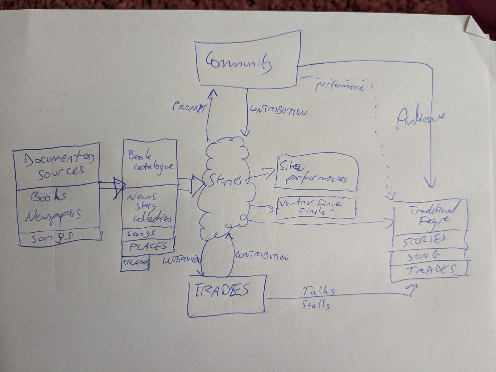
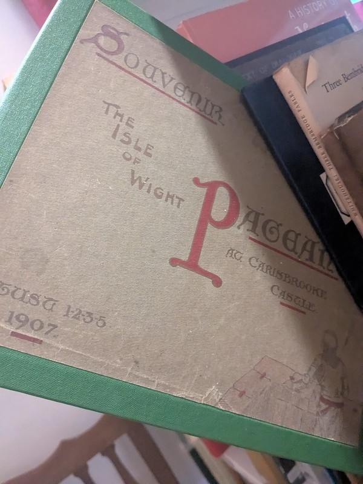

# Past Futures

Uncovering heritage on the Isle of Wight: a response to [Creative Island *Past Futures* call for bids (£5-10k, 1 year 9/25-9/26)](https://creativeisland.org/past-futures-a-peoples-history-of-the-isle-of-wight/) with a focus on intangible cultural heritage.

*(TH personal take, reflecting my own interests and possible contribution areas. Mileage may vary for anyone not me... Also note this project would sit within the context of other current and historical projects, initiatives, groups etc. extant on the Island and online.)*

Stories exist:

- in peoples' heads
- in documentary sources (books, pamplets, newspaper articles)

Stories can be triggered:

- by places
- by artefacts
- by trades
- by stories
- by songs
- by smells and tastes
- by sound
- by weather
- by roadnames, placenames, field names etc.
- in conversation
- etc.

## Documentary sources

*Focussing on documentary sources more than 100 years old: out of copyright; no-one still living to retell the tales first hand.*

One aim of the project is to expose "hidden heritage". So what physical or digital collections exist that might act as a source of hidden, in the sense of *forgotten*, local stories?

- book collections (e.g. Castle Museum has a large collection of 19th c. guides to the Isle of Wight; many of this include descriptions of "things that were commonly known" about local places, annual events, etc. ("lost" or forgotten commonplace knowledge from 100+ years ago)); digitised copies many of the works in e.g. the Castle Museum are available to read online via the Internaet Archive, Google Books, etc.

- newspaper archives: the IWCP and Island Observer regularly publish "historical news" columns, demonstrating an interest (and cheap source of copy) in old news. The British Newspaper Archive ([BNA](https://britishnewspaperarchive.co.uk/)) includes local and regional newspapers that span the 19th c. News stories identify: events, places, people, and also often reveal (or, intriguingly, suggest but do not describe...) commonplace knowledge.

*(There are also other possible collections which may be in or out of scope, e.g. pictures, photographs, postcards (front and back...); traditional songs and tunes.)*

__Contribution__: make an index available of historical books about the Island, ideally with brief summaries. For example, using OpenLIbriary lists [e.g. https://openlibrary.org/people/psychemedia/lists/OL294450L/Isle_of_Wight_Travel_Guides ]

__Contribution__: links to / transcripts of interesting historical newspaper articles (BNA is searchable but the text transripts are often corrupted, which also hinders search indexing, etc.)

*The Isle of Wight History Centre provides quite a [rich source](https://www.iwhistory.org.uk/) of Island related history resources. Might this project provide and populate an additional resource area on that site (scroll down on the home page to see they how they categorise things)?*

The above contributions can provide a starting point for story discovery / research, as well as identifying stories than can act as triggers for learning more about those stories. They surface resources that already exist and make them more visible, more accessible, more usable.

*Why is this important? There are collections available but who knows about them, or what they contain?*

## Community discovery and contribution

Community contributions might include, but are not limited to:

- providing *additional* or missing detail regarding a particular tale/place/person/event etc;
- providing *alternative* tellings;
- providing context;
- "that reminds me of ..."

Community contributions might include:

- stories;
- resources (books, pamphlets, ephemera, objects, photographs/postcards/drawings/pictures, places)

The community process can by triggered by / supported using prompts of stories identified in documentary collections, backed up by / further triggered by research from documentary collections, etc.

*I don't have a clear idea about who or what this "community" or "communities"  is or are, how it/they might be identified, approached, recruited? FB provides ones possible entry point, I guess, though limited to people in it and with access to it? (E.g. [The Isle of Wight Heritage Group (private group)](https://www.facebook.com/groups/426949524045326), [Isle of Wight History and Heritage group (deprecated?)](https://www.facebook.com/IsleOfWightHistoryAndHeritage), not open accessible / requires being logged in to FB, signing up, etc.). See also [*Isle of Wight History Centre — Heritage Organisations
on the Isle of Wight*](https://www.iwhistory.org.uk/heritageorganisations/), [*Folk On Wight — Island Folk History*](https://folkonwight.com/island-folk-history/) etc.). For a specific location, I imagine it might include regular walkers, dog-walkers, etc., as well as occasional, one-off visitors, etc. Related interested might be generated from offering "work in progress" talks to local history societies, interest groups, etc? Chatting to folk in cafes, pubs, etc.?*

## Trades

Some things change, some things don't. What glimpses are there of the past that can be triggered by, or continue in some form, in craft based trades, and what tales exist in the records that can be retriggered by living examples today:

- glass-making
- clock-making / repair
- book-binding
- wood-working
- blacksmithing
- harness making etc.
- globe making

__Contribution__: listing / directory of folk on the Island engaged in traditional crafts. *For Island Storytellers et al., this can help us plug into a living resource of folk we can talk to about traditional craft practice, related tales, etc.*

Approching craftworkers as community members has the advantage that, if they are trading, they are discoverable and identifiable.

*Why is this important? What did we lose when the Island lost Kevin Garlick, traditional shoemaker last year, along with his craft-related knowledge and tales?*

*Island farming recollections were collected in recent years as part of the [Farming Memories project](https://farmingmemories.com/).*

Trade / craft workers are knoweldgeable in tools, practice, apprentice-based transmission of skill and knowledge.

*Transport is another area with highly engaged specialist interest communities, but is maybe out of scope if we want to avoid becoming too sprawling.*

## Place names / Street names

The Ordnance Survey *OpenNames* product has a list of current road names and place names ([example data](https://github.com/ouseful-datasupply/housing_prices_ownership_homelessness/blob/main/os_placenames/os_placenames_doodles.ipynb)). Many names recall a person or family, a place, or perhaps an event (e.g. *Burnt House Lane*).

__Prompt__: *do folk know the story behind the name of the road on which they live?*

*Field names represent more of a challenge. They can be found on old tithe maps, so is there a good source of those?*

## Story realisation

Having identified, developed and articulated stories:

- they can be retold / remembered (oral transmission; e.g. amongst, by and from the community engaged in the community process);
- they can be added to the repertoire of, and performed by, Island storytellers (site specific events; final capstone performance; traditional fayre);
- they can described in written form (small published print book, online story archive);
- they can be captured, e.g. as an audio recording of a telling, video recording of an informal telling, performance, etc.
- they can be illustrated or act as a provocation for a visual reprepresentation.

__Contribution__: live performance / telling at site specific locations.

__Contribution__: capstone performance featuring headline stories (e.g. at *Ventnor Fringe 2026).*

## Retelling the tales that featured in the Isle of Wight Pageant, 1907?

The Isle of Wight Pageant, 1907

[Details](https://historicalpageants.ac.uk/pageants/1103/)

A full recreation might be a little ambitious (though biddable for as a 120 year celbration in 2027?), but we could perhaps retell many of the same tales? Or do a "natural pageant" of tales from the landscape?

## Somewhen Festival, Take 2

Building on ideas and reflections arising from the original Somewhen Festival, use the project as an input into a "Somewhen Traditional Fayre" — stories, music and crafts with an Island focus, celebrating things about the Island once commonly known... Ideally situated at an industrial heritage sight (e.g. Calbourne Water Mill).
