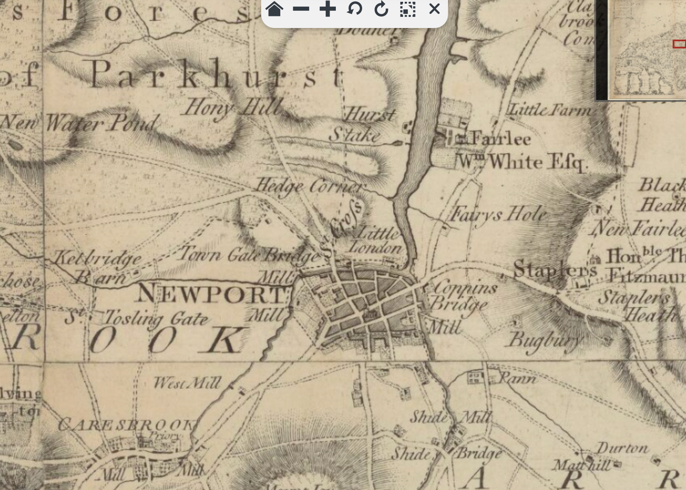
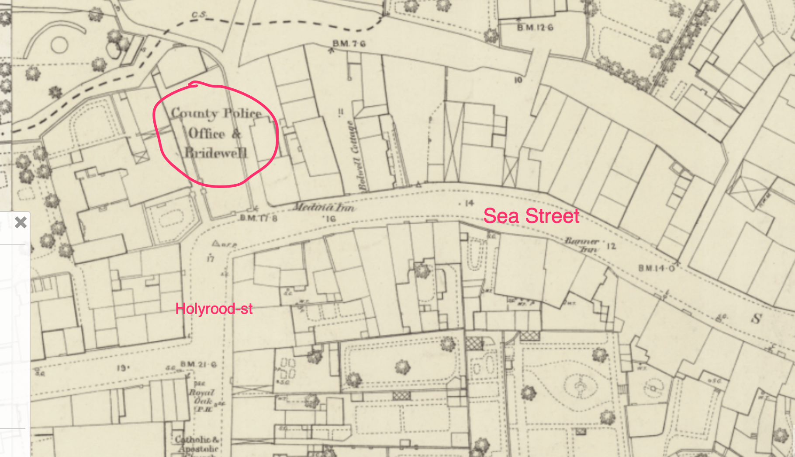

# A Barracks Town and a New Mayor

It's the mid-1850s, and Britain is one of the allied forces sending off her young men to fight in the Crimea. In Newport, on the Isle of Wight, the troops are temporarily stationed in Parkhurst Barracks before making their way to Portsmouth, and the troop ships that await them.

For the young soldiers, many of them in their late teens or early twenties, entertainment is to be found in the public houses of Newport, and the arms of the women who ply their trade there.

```{note}

A topographical map of the isle of Wight, John Andrews, fragment, [[via](https://gallica.bnf.fr/ark:/12148/btv1b53010266f/f1.zoom.r=.langEN)]



```

```{note}
A Plan of the Town of Newport, Andrews 1759, [[via](https://www.nostalgicpicturelibrary.com/wp-content/uploads/2019/12/0198-scaled.jpg)]


```

```{seealso}
[Interactive map, Ordnance Survey](https://maps.nls.uk/geo/explore/#zoom=16.8&lat=50.69959&lon=-1.29219&layers=117746211&b=1), (includes many pub names); surveyed 1862, published 1865.
```

Amidst the hustle and bustle of the town, the sound of an accordion might perhaps have been heard.

```{admonition} A persistent, vagrant, Italian minor, begging with an accordion for 16d. a day, December, 1848
:class: dropdown
[Hampshire Independent - Saturday 30 December 1848](https://www.britishnewspaperarchive.co.uk/viewer/bl/0002941/18481230/084/0008)

Borough Court

On Tuesday, before the Mayor (J. Eldridge, Esq.), and R. M. Wavell, Esq.

An Italian boy, giving his name as Powliss Wagner, was charged with vagrancy.

A female with whom the defendant lived acted as interpreter.

Inspector Grapes stated that that morning he saw the defendant playing an accordion in the street. He had, for the last mouth, frequently seen him in the street playing and begging, and had desired him not to do it. He took him to the station house about a month since, and found 16d. on him, which was one day's earnings. His father came to the station house, and promised that he should not offend again, upon which witness allowed him to go. He had, however, played every day since, and witness had frequently told him not to do so, but it was of no use, and he was obliged, at last, to bring him before the magistrates.

The Mayor said that as far as the magistrates were concerned, they would much rather that the defendant's father was at the bar. They would, however, punish the father, through the defendant, by sending the defendant to the House of Correction for a week, with hard labour, for begging ; and this was way that the magistrates intended to deal with the rest of the fraternity if they ever caught any of them.

```

## Keeping the Streets Lit

In the central part of Newport, steps were being made to introduce street gas lighting in 1820. 


```{admonition} Preparations in a great state forwardness, October 1820
:class: dropdown
[Hampshire Chronicle - Monday 09 October 1820](https://www.britishnewspaperarchive.co.uk/viewer/bl/0000230/18201009/019/0004)

Newport, Oct. 6.— The preparations making for lighting this town with gas are in great state forwardness.
```

The necessary Act of Parliament was then passed in 1821.

```{admonition} Act of Parliament announced, June 1821
:class: dropdown
https://www.britishnewspaperarchive.co.uk/viewer/bl/0000230/18210604/014/0004
Hampshire Chronicle - Monday 04 June 1821

Saturday Night's Gazette

THIS announces Royal to numerous public and private Acts of Parliament, amongst which are— an Act for lighting Newport, I.W. with gas.
```

```{admonition} Act of Parliament, May 1821
:class: dropdown
[Newport (Isle of Wight) Gas Act 1821](https://www.legislation.gov.uk/ukla/Geo4/1-2/57/contents/enacted)

Cap. lvii

An Act for lighting with Gas the Town of Newport in the Isle of Wight, and Places adjacent [28th May 1821;]

WHEREAS inflammable Air, Coke, Oil, Tar, Pitch, Asphaltum, Ammoniacal Liquor, and Essential Oil may be procured from Coal: And whereas the said Inflammable Air, being conveyed by means of Pipes or Tubes, may be safely and beneficially used and applied for lighting Streets, Squares, Market Places, and other public Places; and also for lighting Manufactories, Shops, Warehouses and private Houses : And whereas the said Coke may be usefully and beneficially employed as Fuel in private Houses and Manufactories, and the aforesaid Articles may be used and applied in various other Ways with great Advantage: And whereas John Barlow and George Barlow, of Sambrooke Court, Basinghall Street, in the City of London, Iron Merchants and Copartners, are ready to contract With the Commissioners acting under an Act of Parliament passed in the Twenty-sixth Year of the Reign of His late Majesty King George the Third, intituled An Act for paving, repairing, cleansing, lighting, and watching the Streets, Lanes, Ways, Passages, and Places within the Borough of Newport, in the Isle of Wight ; and for the Removal of present and Prevention of future Encroachments, Nuisances, and Annoyances therein ; to erect and build Retorts, Gasometers, Receivers, and other proper Buildings and Works, for lighting with Gas the Streets, Lanes, and public Passages of the said Borough of Newport, and for lighting the public Lamps thereof with Gas : ...

```

By 1823, *The Newport Gas Light Company* was ready for incorporation.

```{admonition} The Newport Gas Light Companyt, January 1823
:class: dropdown
[Hampshire Telegraph - Monday 20 January 1823](https://www.britishnewspaperarchive.co.uk/viewer/bl/0000069/18230120/012/0003)

The Newport Gas Light Company

Notice is hereby given,— That a General Assembly or MEETING of the PROPRIETORS of SHARES in the NEWPORT GAS LIGHT COMPANY, will be holden at the Gas Works in the Borough of Newport, in the Isle of Wight, on Friday the 24th day of January, 1823, at eleven o'clock in the forenoon, to proceed in the execution of the Act of Parliament, passed for Incorporating the said Company; at which Meeting or Assembly, a. TREASURER or TREASURERS of the said Company, and a COMMITTEE Of MANAGEMENT, are to be elected and chosen.

ADAM TWIGG, Superintendent.

```

Improvements were also made to the gas provision in the early 1850s, albeit at the expense of roadworks!

```{admonition} leading thoroughfares are being broken-up, January 1852
:class: doprdown
[Hampshire Advertiser - Saturday 03 January 1852](https://www.britishnewspaperarchive.co.uk/viewer/bl/0000494/18520103/026/0005)

NEWPORT, SATURDAY, January 3. The Newport Gas Company.— The brilliancy of the new lights, as seen this week, placed alongside of the old ones, seems to have " won golden opinions from all sorts of people," and made new gas the order of the day. Mr. Nunn's extensive lace factory, we hear, is to be supplied with one hundred and fifty burners, and a large number of tradesmen and professional men, as well as private persons, are being supplied. To accomplish this, of course, the leading thoroughfares are being broken-up,— a temporary inconvenience, which if perpetuated, it seems, would now be more tolerable than the light of other days, or rather nights.

```

## Francis Pittis — Mayor, then Alderman

In November 1852, council members unanimously elected Francis Pittis, a well-regarded local auctioneer and valuer, as well as Conservative councillor, Mayor for the first time, the term of appointment being one year.

```{admonition} General meeting of the council
:class: dropdown
[Isle of Wight Observer - Saturday 13 November 1852](https://www.britishnewspaperarchive.co.uk/viewer/bl/0000170/18521113/007/0003)

TOWN COUNCIL

A general meeting of the council was held  in the Council Chamber, at the Guildhall, on Tuesday last, for general business. The names of the members of the council being called over, the town clerk gave notice that the first business to be transacted was the

ELECTION OF A MAYOR.

Upon which Thomas Cooke, Esq., after passing very high compliment the late mayor for the conscientious fulfilment of his duties during the last year, and proposed Mr. Francis Pittis to fill that office for this borough for the ensuing year, and in doing so, bore testimony to his high character and ability, and although he was unwilling when first asked to be proposed fill the office, he had now consented ; and he therefore felt great pleasure in proposing him.

Edward Way, Esq., said it is with great pleasure that he seconded the nomination of Mr. Francis Pittis, as the mayor of the Borough of Newport, as he is a native of the town and much respected, and one that he (Mr. Way) himself had been acquainted with for many years.

There being no opposition, Mr. Pittis was then sworn in, and the ex-mayor resigned his seat into his hands ; which being properly occupied, the mayor, said, —the first step I consider for me to take in filling this chair, is to return you my sincere and heartful thanks for placing me here, and I very sensible of the honor conferred upon me in being placed in this position, and when I feel that it has been by the unanimous voice of this meeting, not one vote being accorded against me this day, it is most gratifying to me, and will help to carry through this important function which is the highest you could have placed upon me. I shall feel it my duty to dismiss everything like party or political feelings from my breast, and will endeavour so far as possible to do everything that may be conducive to the prosperity of the town of Newport. I hope therefore that you will give me that support which my office requires from you.

...
```

He was also reappointed for a second term the year afterwards.

```{admonition} Re-election of F. Pittis
:class: dropdown
[Isle of Wight Observer - Saturday 12 November 1853](https://www.britishnewspaperarchive.co.uk/viewer/BL/0000170/18531112/007/0002?browse=true)

TOWN COUNCIL. The quarterly meeting of the Town Council was held at the Guildhall on Wednesday last, the Mayor. F.Pittis, Esq., in the chair.

The election of mayor for the ensuing year being the first business, Mr. Estcourt in a most able but brief speech, proposed the reelection of Mr. Pittis to the civic chair, which being seconded by Mr. E. Way, was carried unanimously.
```

As a reward for his service, and mid-way through his second term as Mayor of Newport, Francis Pitts, Esq., was elected Alderman of the Borough of Newport in April, 1854.

```{admonition} Proposing Mr. F. Pittis as Alderman, April 1854
:class: dropdown
[Isle of Wight Observer - Saturday 15 April 1854](https://www.britishnewspaperarchive.co.uk/viewer/bl/0000170/18540415/014/0003)

Town Council.

...

Mr. Estcourt proposed Mr. F. Pittis as Alderman, and on a ballot being taken, he was declared duly elected.

...
```

## Local bye-laws

In the 1850s, disorderly conduct in the public streets had been regulated by the [Vagrancy Act, 1824](https://www.legislation.gov.uk/ukpga/1824/83/pdfs/ukpga_18240083_en.pdf), which included the following clause:

> ... every Common Prostitute wandering in the public Streets or public Highways, or in any Place of public Resort, and behaving in a riotous or indecent Manner;  ... , shall be deemed an idle and disorderly Person within the true Intent and Meaning of this Act.

Town Commissioners could also adopt regulations defined in the [Town Police Clauses Act 1847](https://www.legislation.gov.uk/ukpga/1847/89/pdfs/ukpga_18470089_en.pdf) as local Bye_laws. Among other things, this allowed them, to explicitly regulate, amongst other things, bad language and disorderly conduct:

> XXVIII. Every Person who in any Street, to the Obstruction, Annoyance, or Danger of the Residents or Passengers, commits any of the following Offences, shall be liable to a Penalty not exceeding Forty Shillings for each Offence, or, in the Discretion of the justice before whom he is convicted, may be committed to Prison, there to remain for a Period not exceeding Fourteen Days, and any Constable or other Officer appointed by virtue of this or the special Act shall take into Custody, without Warrant, and, forthwith convey before a Justice, any Person who within his View commits any such Offence ; (that is to say,) ...
> 
> - Every Person who publicly offers for Sale or Distribution, or exhibits to public View, any profane, indecent, or obscene Book, Paper, Print, Drawing, Painting, or Representation, or sings any profane or obscene Song or Ballad, or uses any profane or obscene Language
> 
> - Every common Prostitute or Nightwalker loitering and importuning Passengers for the Purpose of Prostitution

Drunken behaviour could also be targeted:

> XXIX. Every Person drunk in any Street, and guilty of any riotous or indecent Behaviour therein, and also every Person guilty of any violent or indecent Behaviour in any Police Office or any Police Station House within the Limits of the special Act, shall be liable to a Penalty not exceeding Forty Shillings for every such Offence, or, in the Discretion of the Justice before whom he is convicted, to Imprisonment for a Period not exceeding Seven Days.

In addition, the owners of establishments that might encourage or facilitate disorderly conduct could also be prosecuted:

> XXXV. Every Person keeping any House, Shop, Room, or other Place of public Resort within the Limits of the special Act for the Sale or Consumption of Refreshments of any Kind who knowingly suffers common Prostitutes or reputed Thieves to assemble at and continue in his Premises shall, for every such Offence, be liable to a Penalty not exceeding Five Pounds.

```{seealso}
For a thematic overview of the law in 19th century England, see for example James Stephen's [Laws of England, 1883](https://archive.org/details/dli.ministry.16072/page/229/mode/2up).

For regulations relating more particularly to vice, see Sheldon Amos' *A comparative survey of laws in force for the prohibition, regulation, and licensing of vice in England and other countries; with an appendix giving the text of laws and police regulations as they now exist in England, in British dependencies, in the chief towns of continental Europe*, 1877 [[link](https://archive.org/details/cu31924017705116/page/n5/mode/2up)].

```

The Newport Bridewell and the Town Gaol were both situated near the corner of Holyrood-st and Sea-st, by the Medina Inn (now the Medina Railway Tavern).

```{seealso}
Named after the original Bridewell, Bridewells were houses of correction where prisoners could serve out short term sentences, often for crimes relating to vagrancy, disorderly conduct, etc.



For more information about the Newport Bridewell and Town Gaol, see https://www.theprison.org.uk/NewportTGCB/

```

```{admonition} On converting Newport Bridewell to a Police-station, July 1849
:class: dropdown
[Hampshire Advertiser - Saturday 07 July 1849](https://www.britishnewspaperarchive.co.uk/viewer/bl/0000494/18490707/012/0003)

Newport Bridewell

The Rev. R. Walton White read the report of the Committee appointed to ascertain in what manner the Newport Bridewell might be converted into a Police-station, with a sufficient number of cells for the safe custody of prisoners remanded for further examination, together with proper accommodation for magistrates assembled in petty sessions, by which it appeared that the buildings of the prison are unfit for the purposes of a police-station, but might be converted to such purpose; and had they been at the immediate disposal of the county, the Committee would have been prepared with a detailed suggestion as to their conversion to such purpose, although it was worthy of consideration to have sold the interest of the county and adopted a different site and erected a new building thereon.

`[Further discussion on how to accommodate the police stattion then follows.]`

```

## Parkhurst Barracks

Parkhurst (Albany) Barracks were located on the northern edge of Newport, next door to Parkhurst prison, previously a military hospital that had been converted to a prison for young male offenders in December 1838.

As a garrison town, soldiers from a wide variety of regiments were stationed at Parkhurst Barracks, often *en route* to the Crimea via troop ships sailing out of Portsmouth. The muster appears to have reached about 1,300 officers and men at any one time, many of them young men in their teens or early twenties.

Troops were landed at Fountain Quay in Cowes, and then marched south to Parkhurst Barracks. The road on into Newport would have entered the town at Hunny-hill, although it seems that pedestrian access could perhaps have been improved further.

```{admonition} A footpath to the Barracks and Prison
:class: dropdown
[Hampshire Telegraph - Saturday 09 February 1856](https://www.britishnewspaperarchive.co.uk/viewer/bl/0000069/18560209/013/0004)

MEETING OF THE NEWPORT TOWN COUNCIL.

The Quarterly Meeting of the Town Council was held on Tuesday, the Mayor, John Henry Hearn, Esq., in the chair.

...

It was proposed by Mr. Pinnock that the foot pavement leading towards Parkhurst Barracks should be extended as far as the boundaries of the Borough, and that measures be taken to obtain a footpath to the Barracks and Prison.

Mr. B. W. Mew hoped to see a foot-path lighted from the town to the Prison.

A committee were then appointed to report on the subject.

```

According to [Report of the Commissioners appointed to inquire into the regulations affecting the sanitary condition of the army, the organization of military hospitals, and the treatment of the sick and wounded  with evidence and appendix. Presented to both Houses of Parliament by Command of Her Majesty](https://archive.org/details/b21365210/page/440/mode/2up?q=parkhurst):

*Return showing the Amount of Accommodation in each Barrack in the United Kingdom,
I. — England and Wales — continued.*

| Station | Barrack| The No. of Men Each Barrack is calculated to accommodate | No. of Men's Rooms in the Barrack | No. of Men in a Room (Highest / Lowest) | Cubic Feet of space allowed for each man (Highest / Lowest) | Hospital (No. of Wards; No. of Patients in a Ward (Highest / Lowest) ; Cubic feet of space for each Patient (Highest / Lowest)) |
|---|---|---|---|---|---|---|
|Albany, Parkhurst | - | 1,524 | 92 | 24 / 12 | 520 / 333 | 14 ; 16 / 3 ; 975 / 385|

A brief report in the *Hampshire Telegraph* of Saturday, 11th October, 1856, estimates the muster at the barracks at about 1300 men.

```{admonition} Hampshire Telegraph - Saturday 11 October 1856
:class: dropdown
[Hampshire Telegraph - Saturday 11 October 1856](https://www.britishnewspaperarchive.co.uk/viewer/bl/0000069/18561011/011/0004)

The military depots at Parkhurst Barracks, in the Isle of Wight, muster about 1,300 men and officers. A number of the men have volunteered recently into the Military Train, which is the name of a permanent corps that is to be a substitute for the Land Transport Corps. The military train is to number about 3,000, and the head-quarters is at Bristol. As soon as there is any large number of volunteers at Parkhurst they are sent under an escort to that city.

```

Reports occasionally appeared in the local press announcing the latest troop movements in and out of Parkhurst Barracks.

```{admonition} 23rd, 58th, 65th, 63rd, 93rd; Isle of Wight Observer - Saturday 11 March 1854
:class: dropdown

[Isle of Wight Observer - Saturday 11 March 1854](https://www.britishnewspaperarchive.co.uk/viewer/bl/0000170/18540311/015/0003)

PARKHURST BARRACKS. The 23rd Regiment Royal Welsh Fusileers left these barracks on the 25th ult. for Portsmouth, from whence they will embark for the East on or about the 12th, as a portion of the second division to be sent out.

The 58th Depot, which had not been long at Parkhurst, left on Tuesday last for New Zealand.

The 65th Depot also left the barracks on Tuesday last for Weymouth.

The loss to the island generally, especially to Newport, will be greatly felt.

On Monday a Depot of the 63rd Rifle Brigade, of about 150 men, and Tuesday Depot of the 93rd Regiment, of about 100 men, partly filled the place of the above Regiment and Depots.
```

```{admonition} 4th, 77th, Hampshire Telegraph - Saturday 01 April 1854
:class: dropdown

[Hampshire Telegraph - Saturday 01 April 1854](https://www.britishnewspaperarchive.co.uk/viewer/bl/0000069/18540401/014/0004)

The Depot of the 77th Regiment arrived here on Friday, and on the two previous days the depots of the 4th and another Regiment were landed at the Fountain Quay, and thence marched for Parkhurst Barracks, where they will be stationed for some time.
```

```{admonition} 4th, 20th, 26th, 28th, Sun (London) - Saturday 18 November 1854
:class: dropdown
[Sun (London) - Saturday 18 November 1854](https://www.britishnewspaperarchive.co.uk/viewer/bl/0002194/18541118/010/0001)

Cowes, Isle of Wight, Nov. 17

Troops for the East

Detachments form the 4th, 20th, 26th and 28th Regiments embarked from Cowes this morning, amounting to 250 rank and file. Recruits are arriving daily, and sometimes two or three times a day, in parties of 12, 20 or 30, and proceed on to Parkhurst Barracks. They appear all young men, very few of them being above 20 years of age.
```

```{admonition} 77th, Hampshire Telegraph - Saturday 27 January 1855
:class: dropdown
[Hampshire Telegraph - Saturday 27 January 1855](https://www.britishnewspaperarchive.co.uk/viewer/bl/0000069/18550127/012/0004)

COWES. A detachment of 300 men of the 77th Regiment marched from Parkhurst Barracks on Friday morning, and embarked for Portsmouth, *en route* for the Crimea. The men seemed in good spirits, and well pleased with the prospect of proceeding to aid their fellow soldiers in the East.
```

```{admonition} *Cheerful countenance*, Hampshire Telegraph - Saturday 10 February 1855
:class: dropdown
[Hampshire Telegraph - Saturday 10 February 1855](https://www.britishnewspaperarchive.co.uk/viewer/bl/0000069/18550210/012/0004)

Owing to the severity of the weather, our poor would have fared badly had it not been for the liberality of the wealthy. As it is, coals, bread, and other comforts have been distributed among the necessitous, and an intimation given that whilst the cold continued the wants of the needy would not be forgotten nor disregarded.

During the week we have had fresh arrivals of recruits for Parkhurst Barracks, and several hundred soldiers of different regiments have left for Portsmouth *en route* for the Crimea, all of whom wore a cheerful countenance and did not appear at all depressed at leaving England; but on the contrary, they cheered lustily, and vowed they would give a good account oft the Russians if they should have the good luck to meet them.
```

```{admonition} *28th Slashers-Sebastopol, or death !*, Hampshire Telegraph - Saturday 14 April 1855
:class: dropdown

[Hampshire Telegraph - Saturday 14 April 1855](https://www.britishnewspaperarchive.co.uk/viewer/bl/0000069/18550414/011/0004)

A large draft of upwards of 300 left Parkhurst Barracks, on Friday, for the Crimea, in excellent spirits, and eager for the fight. A flag was unfurled which had been got up by the men, inscribed "The 28th Slashers-Sebastopol, or death !"
```

```{admonition} 48th, Hampshire Telegraph - Saturday 07 July 1855
:class: dropdown
[Hampshire Telegraph - Saturday 07 July 1855](https://www.britishnewspaperarchive.co.uk/viewer/bl/0000069/18550707/015/0004)

Visitors continue to arrive daily in considerable numbers in the Isle of Wight, the coaches appear well laden, and carriages of all descriptions are again in motion ; lodgings are getting in request, and in Newport many are occupied by military officers and their families, in consequence of the quarters at Parkhurst not affording accommodation for the number. 

...

Large drafts of men and a considerable number of officers have lately left Parkhurst Barracks for the Crimea, who have been replaced by fresh arrivals, so that the Barracks are quite full at the present time. The Isle of Wight Militia Artillery, upwards of 100 strong, were under orders to be billetted at Ryde, so as to make room for the 48th Regiment in Newport, but the order was afterwards countermanded.
```

```{admonition} Considerable drafts have left Parkhurst barracks, November 1855
:class: dropdown
https://www.britishnewspaperarchive.co.uk/viewer/bl/0000069/18551103/011/0004
Hampshire Telegraph - Saturday 03 November 1855

Considerable drafts have left Parkhurst barracks within a short time for the seat of war.

```

```{admonition} 15th, 30th, 55th arrivals, Hampshire Advertiser - Saturday 06 June 1857
:class: dropdown
[Hampshire Advertiser - Saturday 06 June 1857](https://www.britishnewspaperarchive.co.uk/viewer/bl/0000494/18570606/040/0007)

Our Garrison.— About 350 men of the 15th, 30th, and 55th Regiments, came into Barracks, from off station in the Mediterranean, on Thursday. We have now 1100 men in Garrison.
```

The officer class of regiments stationed at the garrison seem to have integrated themselves into Island society:

```{admonition} A grand entertainment, September 1853
:class: dropdown
[Isle of Wight Observer - Saturday 17 September 1853](https://www.britishnewspaperarchive.co.uk/viewer/bl/0000170/18530917/007/0002)

HURRAH FOR THE WELSH FUSILIERS !

On Tuesday last the officers of the 23rd Royal Welsh Fusiliers gave a grand entertainment at the Queen's Rooms, Newport, which was brilliantly attended. The rooms were decorated with consummate taste, and presented a very gay and elegant tromp d'oeil. On the walls were pourtrayed animals of various kinds, around which gracefully depended festoons and bouquets; and from the side windows, avenues filled with choice exotic and native plants branched off, presenting charming perspective. Rarely, indeed, have we witnessed a more delightful reunion. Dancing commenced at ten o'clock to the music of the excellent Ryde Quadrille band, and alternately with that of the regiment, under the able superintendence of Mr. Handley. Quadrille, polka, valse, and galop followed each other rapid succession, and were kept till an advanced hour in the morning, giving ample occupation to the votaries of Terpsichore; the gay uniforms of the officers contrasting with the sober dress of the civilian, and intermingling with the beautiful costumes of "thefairest of the fair, presented scene charming in the extreme. At 12, the supper room, magnificently adorned with a profusion of plate and vases of flowers, and provided with the most luxuriant viands in the greatest profusion for the assembled guests, which reflected much credit upon the caterer, Mr. Jelly, the messman of the regiment, was thrown open.

The ball was most appropriately wound up with that Old English dance " Sir Roger de Coverley," with a rapid galop as *finale*.

The cordial *empressement* and affable hospitality of the gallant Fusiliers won all hearts, rendering every one who had the good fortune to be present happy and delighted. The most cynical could not refuse their full meed of approbation to their successful exertions in diffusing pleasure and amusement throughout the evening. For many years a more brilliant gathering has not been seen in Newport, and we most sincerely congratulate the Royal " Goats" on their signal success.

... [A list of the notable persons who attended is prodvided.]

```

And on the whole, it seems as if there was no real enmity between the garrison and the town, as the Court's comments in the following case suggest:


```{admonition} Disrputing the peace between the gentlemen of the garrison and the inhabitants the town, August 1854
:class: dropdown
[Isle of Wight Observer - Saturday 12 August 1854](https://www.britishnewspaperarchive.co.uk/viewer/bl/0000170/18540812/009/0002)

BOROUGH SESSIONS.

Wednesday.— Before F. Pittis, esq. (mayor), and E. Way, esq.

Ellen Bull, Jane Bull, Emma Huck, Capt. Eyre Massey, 95th Regiment, and Capt. William Middleton, 93rd Regiment, were summoned by Charles Bagwell for an assault. Each of the defendants were summoned separately, and had accordingly to be heard separately.

The complaint against Jane Bull was first heard, and the complainant, being sworn, said— I am a laborer and live in Paradise-row. About half-past 12 o'clock on Monday night I was just turned out of Pvle-street into Paradise-row, going to my own house. I met the defendant with her sister, Emma Huck, and two officers. They were walking arm in arm all abreast. They took up all the road. I was just passing the water tank, when they gave me push and pushed me back against it. Ellen Bull was nearest to me, but they were all pushing together. They appeared to do it on purpose, because they were all round me directly. They stopped, and one of the men held up a stick to my face. They hindered me from passing. The gentleman who put the stick in my face did not say what he did it for. The gals laughed. I asked them what they did it for, and just on it two more officers came through the lane and asked what was the matter. Afterwards they were all as one. The gals wanted me to strike them. Ellen Bull said I had struck her sister. I said I had not. I did not strike either of the girls first or last. Ellen Bull said to the officers, who came up and asked what was the matter, that I had struck her sister, upon which one of them said I was no Englishman to strick a woman. The defendant was with the rest when they pushed me, but when the other officers came up she went away, and I never saw any more of her. They could have got pass very well without pushing me. They pushed me hard enough to push me down in the trough where they put the buckets. I had a bundle with me at the time. The defendant did not touch me herself, but she might have pushed the others. The defendant never wrung her fist in my face, but her sister did.

Cross-examined by defendant: you were all together. I was not rapping the Adam and Eve door when you passed. I had a dog with me. The dog did not touch you. I struck the officer alter he struck me with a stick. You were the farthest off from me. I did not strike you. Your sister wanted me to strike you, but I would not.

The complainant then called Philip Williams, who said— I live in Paradise-row. On Tuesday morning, between 12 and 1 o'clock, I was standing against my door—just outside. I saw Bagwell come round the corner with a bundle. There were some gentlemen and some girls coming through the other way. The gentlemen looked like officers. There were three men and three women first, and afterwards two more men came through. I was called in-doors for minute, and when I came out again I heard Bagwell ask one of the men what made him hit his dog. They were then talking together. Baswell was walking backwards towards his own door. Bagwell told me they had shoved him and pushed him down, and struck his dog. Jane Bull said they did not shove him, nor yet strike his dog. He said they did. I did not see the pushing. They were arm in arm, two in a row. Jane Bull was ahead; Huck was next, and Ellen Bull was behind. Ellen Bull was some distance behind the others. They were talking. The three girls went away, and the three gentlemen stopped there, and two more came along presently. Jane Bull was nearest to Bagwell. They were not all joined in a row. They were behind each other.

By Bagwell: I saw you sitting in the tank, and you told me they had pushed you. One of the girls said you had struck her, but I won't be certain which it was.

By the Court: they were not all a row; they couldn't walk six or even five in a row in the lane.

By Bagwell: there were three men at first.

By defendant: I saw you coming through the lane. Your sister was not close to you; she was behind.

The Magistrates said the evidence of the complainant was contradicted by his own witness, and as he had no other to corroborate it, they should dismiss the case.

The magistrate then asked the complainant if he wished to bring forward the other girls, having heard what his witness had before stated.

The complainant said no.

Capt. Eyre Massoy, 95th Regiment, was next called, and the evidence of the complainant and a wituess taken, but nothing appearing against him, the case was dismissed.

Capt. Middleton, 93rd Regiment, whose left eye and nose were changed from their natural color, was next placed in the defendant's box, when the complainant swore to him having first committed the assault. The complainant said, I saw the defendant come into the lane with another gentleman. I was walking backwards at the time to get in doors ; the others were following me up. The defendant asked what was up, and Ellen Bull said I had struck her sister. I had not struck or touched her. Emma Huck said at the time that I had not. Jane Bull was not present then. The defendant said I was no man to strike a woman ; why did'nt I strike him. I told him I had not struck a woman. He pushed Ellen Bull up against me two or three times, and told me to strike her. He said I was no Englishman like he was, or else I would fight him. Some one told him he would get marked. He said he did'nt care about that; it was not the first time. He then put a stick which he had in his hand under my chin, and said if I struck her (Ellen Bull) he would strike me with his stick. I said I had not struck her, nor I did not want to strike her. He then struck me on the left side of the head with the stick. The bruises I have were caused by the blow. He knocked me down under the wall, and whilst I was down he hit me on the head and shoulders. Some one then came and took away the stick. I nearly got up, but he would not let me quite. He struck me about a dozen times with his fist about my head and body, and knocked me down again on my back, and kicked me in the eye. He tried to do it. I dare say my eye has bled a pint since. I had not at that time struck him at all. I got up then and knocked him down. I never struck any one else first or last. I had not offered him any provocation. I am sure he is the person who struck me. Some one said the policeman was coming, and he said he would give me in charge. He then got away from me.

Cross-examined by defendant: You said I was a coward if I had struck a woman. My friends did not say have at him. I did not take off my coat at all. The dog was gone before you came. I did not set him at you. The dog did not get hold of my arm.

By the Court: I am sure the dog was not there when Capt. Middleton came into the lane. While I was down the defendant took out some sharp instrument and touched my side. I saw it shine. It was about a foot long. Some one said, are you going to kill him and he then put it away.

In defence, Capt. Middleton said, — As far as I remember, about half-past 11 on Monday night, I was coming down the High0street wlth Captain Massey, of the 95th Regiment. When we got to this lane we heard a great noise, and I distinguished the voices of two gentlemen I knew. Captain Massey said we had better go up and see what it was. There was an immense crowd, and they appeared to be talking about this man's dog. I endeavoured to explain it to the man, and some girl came up and said he had struck her. 1 told him he was no Englishmen, he was a coward. He said, did you call me a coward? I said, I don't call you a coward ; but if you struck a woman, you are a coward. He called his dog and set him at me, and the dog got hold of my trowsers, and he struck me himself. I did not strike him with the stick, but with my fist. I gave my stick to Capt. Massey. When 1 got into the High-street I was attacked by two or three women and a man. One of them hit me across the face with a stick. The policeman walked off with some man. The two young gentlemen would have been almost murdered up there by themselves.

Capt. Massey was then sworn, and said, —I was with Capt. Middleton. We were walking on the road towards Carisbrooke in company with two women. When we got to the end of the street we left them there and came back. As we got near a lane, I believe they call it Paradise-row, we heard a great noise, and learning there were two other officers out —two small men— we went up to see if they were there amongst the crowd. On reaching the crowd, one of the girls said, this man, Bagwell, I believe is his name, had struck her; upon which Capt. Middleton said to him you are not Englishman, you are a ———— coward. Bagwell took off his coat and said, do you mean to say I am a coward ? Capt. Middleton said, I don't mean to say that you are a coward, but if you struck a woman you are one. One of the men in the crowd called out, at him Bill, or some other name, I dont exactly remember the name. Capt. Middleton gave me his stick, and said to the man, now strike me if you dare. He said, hold my stick Massey and leave him to me. To the best of my belief the man struck him somewhere about the shoulder, but there was such crowd I could not tell exactly where he struck him or whether he struck him at all, but he struck at him. Capt. Middleton then knocked him down with his fist. I am certain Capt Middleton did not strike him with a stick at all, for I held his stick all the time, I consider the man has been guilty of perjury.

By Capt. Middlcton: I saw a dog there, and I saw the complainant endeavour to set the dog at you.

Cross-examined by Bagwell: Captain Middleton gave me his stick. You were not struck with a stick by Capt. Middleton at all. Capt. Middleton did not take any sharp instrument out of his pocket to touch your side with. You took off your coat.

P.C. Stubbs said, I was on duty in the High-street and heard a great noise in Paradise-row, I went there and saw a great crowd of persons, Capt. Middleton was coming away from the crowd, Henry Morris was on the ground and some gentlemen were beating him with sticks, Bagwell was also on the ground on his back;, Capt. Middleton had no stick in his hand when he came out from the crowd, I took hold of his arm and if he had had a stick I must have seen it; when Bagwell was lying on the ground he had neither a coat or waistcoat on, had only his shirt above his trowsers and that was partly blue and partly white.

On hearing this, the magistrates said they could not give credit to one word that Bagwell had spoken, and immediately dismissed the case.

Capt. Eyre Masscey, 95th Regiment, Capt. Middleton, 93rd Regiment, Henry Morris, Philip Williams, and Charles Bagwell were then charged by P.C. Stubbs, with fighting and creating a disturbance in the street.

The policeman gave similiar evidence as in the last case, and the magistrates said that most unfortunate affray had certainly taken place, but as they did not appear have the gentlemen before them who went into the lane with the girls, and who, it appeared, had commenced it, they should dismiss the case in the hope that it would not occur again, and that the peace which had been many years enjoyed between the gentlemen of the garrison and the inhabitants the town would not now be broken.

```

But as we shall see, the soldiery did have lots of other contact with certain of Newport's residents!

```{admonition} Disorderly females infesting the road, June 1842
:class: dropdown
[Hampshire Independent - Saturday 11 June 1842](https://www.britishnewspaperarchive.co.uk/viewer/BL/0002941/18420611/033/0003)

At the Petty Sessions, on Saturday last, before the County Magistrates, at the Guildhall.

— The Colonel of the St. Helens Regiment, together with Capt. Woolcombe, the Governor of the Juvenile Prison, appeared in court to complain of the great number of disorderly females which infested the road leading to the Barracks, and were constantly lying-in-wait around the Barnet-gate, drawing away the attention of the men from their military duty, and occasioning very great inconvenience to the and moreover had been the means of sending many of the soldiers to the Hospital. The Court promised to consider what steps they could take to abate the evil; but it is well known that many of these wretched women —children, we had almost said—had followed the regiment from Winchester and Gosport, and the consequent evils were to be attributed to them. There is, however, a much greater evil existing within the Barrack-palings, and which calls aloud for a remedy. We have no doubt of the justice of the complaint laid by the Colonel of the indecent conduct exhibited without the gate ; but is it not a sin against all morals and decency to eject these miserable unfortunates at all times of the night, when caught within the precincts of the soldiers' quarters, to drive them from the gates to find the best of their way to the town without an article of clothing to cover them. Many of these poor creatures have been met by workmen in the mornings crawling along under the hedges and bye-roads in a state of nudity. Surely a remedy may be found without resorting to this indecent and immoral system to put a stop to the intrusion of improper character into the Garrison.

```

## What Next?

And so the scene is set. But what of the character — and characters — of the Borough of Newport in the 1840s and 1850s, at least for the purposes of this tale?
