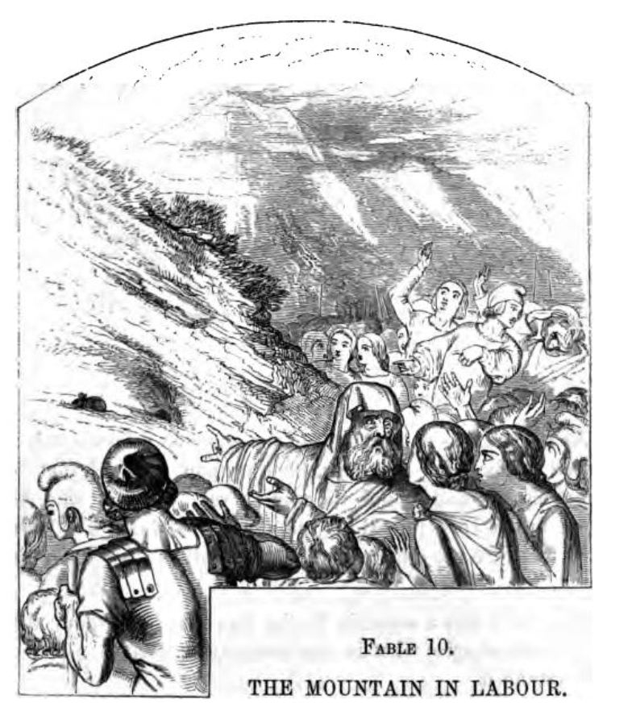

# Carus Wilson Continues To Have His Say

A year on from the publication of "Tempters and Tempted", and it seems that the Revd. W. Carus Wilson could not but help himself, feeling compelled to publish another New Year's Day tract that was almost guaranteed to meet with less than universal approval.

```{admonition} PORTSMOPUTH IN FLAMES!!!
:class: seealso

Available in *The lending library of Ipswich temperance tracts, [v. 9](https://babel.hathitrust.org/cgi/pt?id=nyp.33433006521334&seq=139).


See the full tract in the Appendix.
```

```{admonition} Portsmouth in Flames, January 1857
:class: dropdown
[Hampshire Telegraph - Saturday 17 January 1857](https://britishnewspaperarchive.co.uk/viewer/bl/0000069/18570117/017/0005)

PORTSMOUTH IN FLAMES!

Our readers will remember that some few months since a clergyman, the Rev. Carus Wilson, took upon himself the inviduous task of exposing what he termed the vast amount of crime, vice, and degradation existing in the town of Newport, in the Isle of Wight. The pamphlet in which this *exposé* appeared excited great illwill and indignation on the part of the inhabitants, some of whom were personally hinted at as being guilty of conduct of, to family men especially, a very disreputabie character. The reverend gentleman had, however, to make a public recantation of these abusive charges. Gaining but little wisdom by his experience, he has now given the borough of Portsmouth, in a pamphlet under the above heading, the benefit of a similar amount of zeal, delicacy of phraseology, and accuracy of statements to that which he displayed in his Newport brochure. The existence of an immense amount of crime and vice in this borough he vouches for on the strength of his own knowledge and experience. He declares that he has visited the haunts of immorality, and seen with his own eyes and heard with his own ears the fearful nature of the doings there. And Portsmouth, not content with such indulgences, spreads a taste, and panders to that taste, in neighbouring localities and communities. For instance, whenever he passes over the floating bridge, he is sure to find vehicles crossing laden with intoxicating drinks, or otherwise engaged in the service of the nameless one— not the nameless to the reverend gentleman, however, for his tract is full of references to that evil spirit, of the place he inhabits, and the fate he is preparing for myriads of our fellow creatures. The Rev. Mr. Carus Wilson has the visited the bars of gin palaces, and he describes with an apparent relish the scenes he has, or says he has, witnessed. It never appears to have occurred to the writer to whisper a word of counsel in the ear of the vicious and abandoned, or to impart a gleam of hope or a desire for amendment into the heart of a weak and frail creature of humanity. We hear of the members of a faith termed less tolerant and charitable, and others belonging to denominations of less pretensions than that to which Mr. Wilson belongs, going about amongst the poor, the outcast, and even the depraved, counselling and exhorting them to hope and amendment; but also refraining from noting down the details of those things which *they* have no other desire or object but to remove. or at least to ameliorate. Impelled, by a lofty `[humourously, this looks like "lefty" on the scanned page]` sense of duty, they desire to abate vice and its attendant misery, and to spread abroad the truths of a religion which abounds in charity and love towards the most lowly and outcast of mankind. *They* conceive it to be no part of their mission to pry into revolting facts for the sake of compiling a revolting story, only calculated to horrify the pious, alarm the timid, and harden those who are intended to be exposed. What, we would ask, would be thought of the members of the medical profession, if, instead of applying all the resources of their healing ability to the relief of the sick and the dying, they were to confine themselves to tormenting their patient with horrifying details of the frightful character of his wound or disorder, and of the certainty of an immediate and agonising death?

We do not see that Mr. Wilson attributes a larger amount of crime and vice to the borough of Portsmuouth than to other places. He is, we believe, intent on a series of *exposees*, and it is indifferent to him as to what town he will next favour with a notice. We expect to have to peruse, before long, either "Brighton in Blazes,"  "Southampton, the Storehouse of Sin," "Ryde the Ruined," or some other similarly exciting tract. Now we should imagine that the writer of these diatribes would find in his own immediate neighbourhood, and within his own proper jurisdiction, sufficient of sin and vice to occupy his full attention and solicitude, and that he might leave to the resident clergy of the places he assails the task of doing their particular duty themselves. In Portsmouth, for instance, we have numerous clergy, of all denominations who distinguish themselves by the zeal (*theirs* is unobtrusive zeal) with which they minister to the spiritual wants of the inhabitants of the borough. Mr. Wilson may claim for himself a peculiar "speciality",but if he does it can only be regarded as similar to that possessed by the old contrivance once in vogue in London, of hanging up a lamp in the vicinity of a house of illrepute— as though the making known the fact of the existence of vice would have any effect, of itself, in the spread of morality.
```

```{admonition} A great imbecility of argument, January 1857
:class: dropdown
[Portsmouth Times and Naval Gazette - Saturday 24 January 1857](https://britishnewspaperarchive.co.uk/viewer/bl/0001365/18570124/044/0005)

"PORTSMOUTH IN FLAMES," BY THE REV. W. CARUS WILSON, M.A. [COMMUNICATED.]

The perusal of this minimum production has been rather a melancholy duty, plainly exposing as it does, not only a great imbecility of argument and general debility of the reasoning faculties, but also a gratuitous act of misguided censure in a deluded, though perhaps talented writer. I cannot too strongly deprecate the present system of tract concoction adopted by the supporters of a certain extreme party in the Church. To dress up truths of the most sacred character in the flippant garb of popular literature is not only the exponent of an uneducated and superficial mind, but infallibly secularises most deplorably those holy truths, and subjects them to the low jest of the sceptic and the scoffer. The continual harping upon the most vital doctrines in a slangey and familiar style is productive of immense evil, especially among the less educated. Why has it become the mark of the Ultra Low Churchman to desecrate the most serious subjects by promulgating them in the form of a jocose handbill? Religion and wit, slang and scripture, parson and mountebank, are impossible fusions. Here are a few examples published at 3d per dozen" Have you an appetite?" "A man alive;" "There's a good time coming;" "Chaff;" "Which Class?" "Fast Asleep;" "Dnot Linger;" no doubt suggested by the popular melody "Do not Mingle ." It certainly seems be the mark of a perverted intellect to imagine that sacred truths are only palatable when dressed up in this fashion, and that the world can only be taught religion under "false pretences." Let us, in all humility, suggest to the fertile imaginations of these would be-omnipoteat evangelists, a few texts for their penny-a-line effusions, the entire point of which consists in the large letters on the covers—" Whose your Tailor, or Shriek from the Minories;" "Pails and Pattens, or word to Unconverted Chairwomen;" "The Milkman's Niece, or Sequel the Dairyman's Daughter;" "Buttons for Unbeliever's Buttonless Breeches;" "Are you Shaved ?" &c. These would be highly popular and taking amongst the people; already has the text of the above tract been appropriated as a puff by a tobacconist to sell his snuffs and cigars. But to return to "Portsmouth in Flames;" it burns only in the inflamed imagination of the author; it is alight, we are happy to state, only metaphorically. We do not, for one moment, deny the demoralization of this town; we do not deny the truth of some portion of this small squib; we do not deny the existence of vice; but we do think the concoction of inflaming handbills in a retired nook of the Isle of Wight a strange way to reduce the general infamy, certainly a very easy and comfortable one. The endeavour to transfer the sin of one class to another is by no means a judicious proceeding. Thus much for the nature of this harmless book. As regards its contents, we will only say if it be divested of some of its arguments and deductions (written apparently under a false impression); if the extreme familiarity with things sacred be altered, and a continual repetition of words (not the most elegant) be abstained from; a word, the book recast, it would present a very different and far more acceptable appearance. The casting the sin of drink from the consumer upon the brewer and distiller seems to be the sole drift of the book. Our author confesses himself unable to tell "where the consciences of these men (i.e., brewers and distillers) can be," or how "they expect to compose themselves on a dying pillow, or to stand in the judgment day." This is "very powerful," to use a Portsea expression, and no doubt very popular with the Landport topers. Again, "I cannot fancy any in hell who will have a larger crowd around them of wretched reproachers." This tremendous and highly charitable (?) philippic hurled at the heads of unconverted gin and beer makers, enough to make the most obdurate distiller quake in his boots, and the most hardened brewer as hot as his own grains; and there is only one saving clause connected with these gentlemen, and that is the fact of our author having "met with an interesting case of a converted brewer," and being acquainted likewise with a few "distillers who are beginning tremble." Charging the merchants and retailers of spirits with the entire guilt of this town, converting them into ungodly stokers of the metaphorical flames of Portsmouth, and condemning them finally, body and soul Tophet, is worthy of the most grandiloquent tub orator that Smithfield or Wapping ever saw. Has it quite escaped the Ventnor Demosthenes that the Government, especially in respect of this town, is a most culpable party? Is this powerful individual oblivious to the fact that since the establishment by act of Parliament, of beer-houses, crime and vice have multiplied ten-fold. Over the licenses of these houses, respectable people have power—as long as two parties of sufficient rating can be found to sign their papers, they are impregnable. Not so with inns and taverns—they are under greater control, and are better conducted; and it is a well known fact, that the more debased the place of entertainment for man and beast, the greater attraction will it have for the poor. So long as man is man, and hot weather and thirst endure, so long will the consumption of exciting beverages last. The existence of breweries, distilleries, beershops, gin-palaces, and gentlemen, engaged in the wholesale and retail of intoxicating fluids, is a great fact; and even if the Rev. Champion were to realise his wish of calling upon such individually, we doubt if he would succeed in adding many to the number of his repentant brewers and trembling distillers. How are we to mitigate the evil? or, in the language of tracts, "All hands to the Engine!—who will pump!" Surely not by casting slurs upon the parochial clergy; not by ignoring value of their labors; not by the distribution of crude tracts, filled with commonplace, invective and erroneous reason; not by the exorcising all brewers, distillers, and magistrates; not by fulsome pandering to the lower orders. These are the means adopted by fanatic demagogues. Counter attractions must be provided for the poor the in the shape of profitable amusement and instruction; their social character elevated by the reorganization of their dwellings; the building of churches, the multiplication of clergy, schools, and working men's institutes—these arc a few of legitimate methods to pursued. Let hope that our clergy will not rest satisfied with groaning over the sins of our large towns in the easy arm chairs of their comfortable rectories, nor confine their energies in such emergencies, to the spasmodic publication of ridiculous tracts under pompous titles, thus completely verifying the truth of that ancient line— *"Parturiunt montes nascetur ridiculus mus."*  
H. F. P.

```

The previous article ends with a Latin quote — *"Parturiunt montes nascetur ridiculus mus"* — and provides a moral to the tale...

```{admonition} The Mountain in Labour
:class: dropdown seealso

The commounication to the *Portsmouth Times and Naval Gazette* of [Saturday, 24 January 1857](https://britishnewspaperarchive.co.uk/viewer/bl/0001365/18570124/044/0005) on *"Portsmouth in Flames"* ends with the Latin quote, *"Parturiunt montes nascetur ridiculus mus."*

This translates, via *Google Translate*, as: *"The mountains will give birth to a funny mouse"*, a reference to Aesop's fable *"The Mountain in Labour"*.

We can find a contemporary version of the fable in T. James' [Æsop's fables: a new version ](https://archive.org/details/sopsfablesanewv00aesogoog), with illustrations by J. Tenniel, 1852.



> THE MOUNTAIN IN LABOUR.
>
> In days of yore, a mighty rumbling was beard in a Mountain. It was said to be in labour, and multitudes flocked together, from for and near, to see what it would produce. After long expectation and many wise conjectures from the bystanders — out popped, a Mouse.
>
> The story applies to those whose magnificent promises end in a paltry performance.

```

A couple of years later, in June 1859, an encounter with the pamphlet is preceded by a interesting set-up, that we might twist co-opt along the lines of: *man goes into a bookseller on Pyle Strret*, "Can I help ?", [shiftily] "Er, yes, I'm looking for a copy of *Tempters and Tempted*", and is presented with a rather graphic magazine that was not what he anticipated.

```{admonition} Irreverence, June 1859
:class: dropdown
[Westmorland Gazette - Saturday 11 June 1859](https://britishnewspaperarchive.co.uk/viewer/bl/0000399/18590611/008/0003)

MISCELLANEA

Irreverence.— We were recently in country bookseller's shop, and a man put his head in at the door, and asked in monotone, "Have you come to Jesus?" "No, I have not," was the prompt reply, and the inquirer disappeared. The incident was startling at the moment, from the cool tone of the speakers; but, on reflection, it was evident that *Come to Jesus* was one of those little publications, which, like *More about Jesus*, &c, tend so very much to familiarize the lips and lightest thoughts of the people with that holy name which a special commandment forbids should ever be taken in vain. Another like occurrence came under our observation. We met with a little tract having the title, *Portsmouth in Flames*, and which obviously announced a conflagration in our great marine arsenal, the words being incapable of bearing any other construction. But, like the witty puffs of the tradesman who allures you to perusal by a commencement totally irrelevant to the announcement which he has in store, this title was merely a cloak concealing the writer's denunciations of the sins of a seaport town, and the flame of divine judgment which he concluded must await such a spot. Many of the hymns, too, of the same party are no less open to objection, on account of their irreverent and even amative expressions; and, according to Rowland Hills determination, that the Devil should not have all the good tunes, these effusions have been boldly set and sung to the music of the concert-room. — *"The Low Church  Party," in the Constitutional Press.*
```
