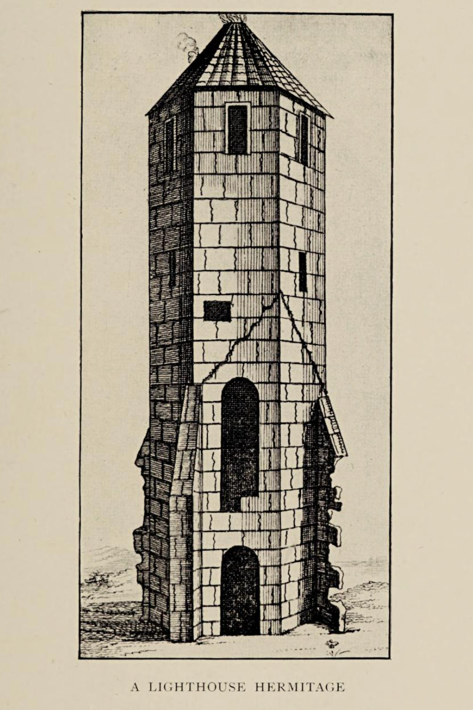

# Walter de Godeton and the Pepperpot

The end of the oratory as a religious site came with the dissolution of the monasteries in ???, but the lighthouse continued to operate until 17??; another one started in 1785 ?? (circular stump forming the base remains still there), but never completed.

No lighthouse for the next ?? years, but if you were to look back down to St Catherine's point from the St Catherine's Hill, you'd see the "new" lighthouse built in ???

And thereby lays another tale...

 The lighthouse, which formed the western tower of the oratory is all that survives of the original building. However, the remains of the walls, are visible as earthworks forming three sides of a square with the lighthouse on the open, west, side. The oratory walls are about 12 metres apart and survive to a height of one metre

---


https://www.heritagegateway.org.uk/Gateway/Results_Single.aspx?uid=1119117&resourceID=19191

Historic England Research Records
Blessed Mary

NB: There is a record for a French cargo vessel which was reported in the Privy Council Papers in 1314 as stranded in Chale Bay, en route from Bayonne to Flanders with wine. Enough of the details are consistent with the ST MARY to suspect that this may be an alternative account of the same vessel, particularly as wrecks tend to turn up in state Papers several months or even years after the initial incident, and this would appear to sound close to the account in source (6). Alternatively, there may be two wrecks in question, the ST MARY, which was definitively bound for England, according to source (5), and the other vessel bound for Flanders. Byger, Campan[ar]e and Colum[in]ers appear to have been involved in the former, (5) and appear as fraudulent claimants in the latter (7). It is therefore possible that these may be one and the same wreck, but it is also possible that if they had not obtained restitution for their wreck, they instead claimed a stake in another wreck nearby. (8)

ship owner: Regimus de Depe (1); Remigius de Depe (7)

Cargo owners: Elie Byger or Elias Biger, Frederick Campanare, Bernard Columers, Gascony (1)(3)(5)(6), these appear spelt Elias Byger, Fretheric de Campane and Bernard de Columiners, as fraudulent claimants in (7); Remigius de Depe, rightful claimant (7)
Date of Loss Qualifier: Actual date of loss
Additional sources cited in shipwreck Index of the British Isles:
Quarr Abbey Wreck, V; Driving Tour of the Isle of Wight; Back of Wight, p5; N.CRO TPT/75; PRP.C47/60/1 [Privy Council records?]; Ballads of the Wight, J R Brummell, The Wreck of the st Mary
sOURCE TEXT
(1) Richard and Bridget Larn 1995 shipwreck index of the British Isles, volume 2: Hampshire, Isle of Wight, sussex, Kent (Mainland), Kent (Downs), Goodwin sands, Thames
section 2, Isle of Wight, (BB)
(2) J C Medland 1986 shipwrecks of the Wight
Page(s)8
(3) s F Hockey 1982 Insula Vecta
Page(s)111
(4) by Ken Phillips 1988 shipwrecks of the Isle of Wight
Page(s)11
(5) Calendar of Patent Rolls
Edward II, 1307-1313, membrane 5d, accessed via: http://www.uiowa.edu/~acadtech/patentrolls/ on 18-OCT-2006 I Page(s)604
(6) Calendar of Patent Rolls
Edward II, 1313-17, membrane 18d, accessed via: http://www.uiowa.edu/~acadtech/patentrolls/ on 17-NOV-2006 II Page(s)55
(7) Calendar of Patent Rolls
Edward II, 1313-1317, membrane 9d, accessed via: http://www.uiowa.edu/~acadtech/patentrolls/ on 18-OCT-2006 II Page(s)149-50
(8) Oral information, correspondence (not archived) or staff comments

-


Wreck of the blessed mary - https://www.pastscape.org.uk/hob.aspx?hob_id=1119117 (via smugglers of the wight, hutchings); history of st Catherine's hill pharos and oratory
BLEssED MARY
ALTERNATIVE NAME: 	sAINTE MARIE, sT MARY
1313 wreck of French cargo vessel which stranded in Chale Bay en route from Tonnay-Charente and Bayonne to England and/or Picardie with wine. Constructed of wood, she was a sailing vessel. This is the vessel which inspired the building of st. Catherine's Oratory, the so-called "Pepper Pot" lighthouse (459794), as restitution for the wine taken by local inhabitants from the wreck.
MONUMENT NUMBER:	1119117	COUNTY:	IsLE OF WIGHT
NMR NUMBER:	sZ 47 NE 458	DIsTRICT:	IsLE OF WIGHT
LAsT UPDATED:	N/A	PARIsH:	N/A
AREA:	CHALE BAY
sTREET:	N/A
MARITIME LOCATION:	CHALE BAY IsLE OF WIGHT
LOCATION:	sZ 4660 7669
Carried 174 tuns of white wine belonging to the Duchy of Aquitaine, Regimus de Depe, owner. ship lost on the sunday after Easter, with many survivors. Many casks of wine removed from the beach by local men. Complaint by the merchants, viz Elie Byger, Frederick Campanare and Bernard Columers, all of Gascony, resulted in the case being the first heard at southampton on 8-JUN-1313. It was claimed that 154 tuns had reached the Isle of Wight beaches, of which much was stolen, the loss to the merchants being £1,000. There was also some action taken concerning the wreck and sir Goditon and the pepper-box lighthouse on the Isle of Wight. Quarr Abbey account names the ship as the BLEssED MARY. (1)
A ballad reads: '...she carried in her hold a delicious wine... white wine it was, the finest, and what's more, there were one hundred tuns and seventy four. Now soon, as water crashed upon her deck, the brave sT MARY was a total wreck.' (Ballads of the Isle of Wight) (1)

In 1313 occurred the most famous of the island's medieval wrecks, the ST MARY of Bayonne. The ship of the BLESSED MARY was sailing from Bayonne in Gascony with a cargo of 174 barrels of white wine from the Duchy of Aquitaine. she was bound for Picardy, where the wine would be delivered to the monastery of Livers. However, the MARY was blown off course, far to the north, and on the 22-APR-1313 she was driven ashore in Chale Bay, in the remote and wild wastes of the 'Back of Wight'. (2)

On the sunday after Easter 1313, which was 22nd April, a wreck occurred under Chale. It was a ship from Bayonne, called the ship of BLESSED MARY, which had been loaded at Tonnay, on the Charente in Aquitaine, with a cargo of 174 barrels of white wine. There were many survivors, but most of the casks of wine were removed from beaches by local men. As the owners Elie Byger, Frederick Campanare and Bernard Columers were from Gascony, the King wished justice to be done to the complaint, especially as they were his subjects at that date. The case was first heard at southampton 8th June 1313, then Winchester 20th July 1313 and finally restitution and damages were finally settled at the court held on Wednesday in the first week of Lent, 22nd February 1314. (3)
Walter de Goditon and his cronies, when standing before a jury in southampton on 8th June 1313, had audaciously removed some 57 casks of white wine from the SAINTE MARIE after she had been wrecked in Chale Bay. (4)


----

## Additional Notes - Not Done

goods distrained "except the horses and oxen of his ploughs" and half of his lands and tenements leases out until the fine of 287 (227?) and a half marks had been paid in full. 

[Marks - m    mark    2/3 £ or 13s 4d  http://faculty.goucher.edu/eng240/early_english_currency.htm]
https://www.nationalarchives.gov.uk/currency-converter/#currency-result
£150  ~ £90k today
distrain - To seize and hold (property) to compel payment or reparation, as of debts.


m    mark    2/3 £ or 13s 4d

TO DO


---
https://archive.org/details/hermitsanchorite00clay_0/page/52/mode/2up?q=%22de+godeton%22
The hermits and anchorites of England
by Clay, Rotha Mary

Publication date 1914

p.52 and facing

Upon Chale Down, in the Isle of Wight, there was in 1312 a hermitage and chapel in honour of St. Catherine. Two years later a shipwreck occurred, which led to the foundation of a lantern tower at St. Catherine's. A French ship belonging to a religious house was wrecked, and the mariners, who sold the cargo to certain men of the island, were afterwards charged with sacrilege for having appropriated Church property. It is said that a papal bull was issued threatening the chief offender, Walter de Godeton, with excommunication. In expiation he was charged to build a lighthouse on the Down near Nyton, above the scene of the disaster. A letter of Bishop Stratford proves that the tower had already been erected in 1328. A chantry priest was to keep up a bright light to warn mariners sailing by night on that dangerous coast. A survey of 1566 shows the buildings as they then existed, with little stacks of wood ready piled for the beacon. The octagonal tower with its conical roof is about 35 feet high (Plate XXI). It is in good preservation, having been strengthened during the eighteenth century as an important sea-mark. It stands 750 feet above sea level. Into the walls of the old lighthouse a piscina is built, which probably came from the oratory, now demolished.




---

https://archive.org/details/calendarentries00offigoog

Calendar of entries in the Papal registers relating to Great Britain and Ireland. Papal letters, 1198- .. W. H. Bliss, vol. II 1306-1342.
by Great Britain. Public Record Office

Publication date 1893

--

--
Percy Stone cites a ?? in the Abbreviation of Pleas, 1315

https://en.wikipedia.org/wiki/Percy_Stone architect, author, archaologist
https://iwnhas.org/wp-content/uploads/2020/02/Archaeology-timeline.pdf
1907 Pageant of Isle of Wight History held at Carisbrooke Castle (CC).
Percy Stone, architect & antiquary, acts as advisor. [A programme for this is in the Castle Museum Library.]
1909 'Guide to Carisbrooke Castle' by Percy Stone
1910 Percy Stone excavates at St Catherine's Oratory (and earlier at Quarr Abbey).
Lived at Merstone, died 1934
The Architectural Antiquities of the Isle of Wight from the XIth to the XVIIth centuries inclusive, 1891


--


```{admonition} TO DO — of little value / essentially a duplicates
:class: dropdown

In Charles S. Ward, ed. W. Baxter, *The Isle of Wight, including notes for geologists*, 1909, [p45-6](https://archive.org/details/isleofwight00ward/mode/2up).

St. Catherine's Hill (781 ft.) can be ascended in about 15 minutes from the C.G. Station at Blackgang. The summit, not quite the highest ground in the Island — St. Boniface Down, above Ventnor, being 787 ft. — commands the island from S. to N. and E. to W., but a comparatively poor foreground detracts from the views except W. along the coast to the chalk cliffs of Freshwater. The map will suffice to identify the places in sight.

The two ruins are both those of lighthouses, but these are of very unequal interest. The insignificant one represents a lighthouse begun in 1785, but never finished owing to the liability of a light at such an altitude to be obscured by fogs. It was reduced to its present condition about 1870. The other ruin is that of an ancient pharos, and its history, as elucidated by Mr. Percy Stone, is so interesting that we summarise his account of it (*Archit. Antiq. of I. of W.*).

> By the Winchester Registers of Bishop Woodlock, it is evident an anchorage existed previous to A.D. 1312, as in that year one Walter de Laugeberewe was admitted to the *hermitorium super Montem de Chale .... in honore Saticfce Katerinae Virginis construendum et reparandum*, being licensed to perform Divine service *in cappella ibidem construenda*. Three years after the foundation of this isolated chapel a circumstance occurred ... explaining very clearly the *raison d'etre* of the still existing lighthouse. One stormy night in the winter of A.D. 1314 a vessel—one of a fleet chartered by sundry merchants of the King's Duchy of Aquitaine to convey a large consignment of white wine to England—drove ashore on Atherfield Ledge. The sailors escaped ... and sold the cargo to the Island folk—174 casks of wine each worth five marks. The merchants took proceedings against the receivers of the stolen cargo, for it clearly did not belong to the sailors, who were, however, apparently not deemed worth prosecuting, even if they could have been traced. One Island landowner, Walter de Godeton, was found guilty of receiving 53 casks, and had to pay 227 marks. But another party besides the merchants had to be reckoned with, namely, the Church, for the wine, it appeared, belonged to the religious community of Livers, in Picardy, who had lodged a complaint against De Godeton in the Roman Court. This resulted in the culprit having to build, on the Down above the scene of the disaster, a lighthouse to warn ships, and to found an oratory for a priest to say masses for the souls of those lost at sea, and to trim the "light. De Godeton before 1328 did as he was required, and the existing ruin, repaired at the end of the 18th century, is the relic of his work. Mr. Stone in 1891 laid bare the foundations of the oratory, which extended S.W. from the tower, and was of two floors, answering to the two doorways on that face of the ruin. A piscina inverted in the wall of the bottom stage of the tower is supposed to have belonged to the chapel, which was on the first-floor level of the annexe, above an undercroft communicating with the ground stage of the tower.

```


--


--- 


---

plea rolls?
https://www.medievalgenealogy.org.uk/sources/law.shtml

http://aalt.law.uh.edu/EdwardII.html


KB 27/219 1315
Coram Rege Chief Justice's roll, venue: Westminster, 8 Edw II Hilary term. http://discovery.nationalarchives.gov.uk/browse/r/r/C214792 This record has not been digitised and cannot be downloaded.


https://www.pastscape.org.uk/hob.aspx?hob_id=899227 JEsUs CHRIsT
ALTERNATIVE NAME: 	NAVIs DE JEHsU CHRIsTI, sHIP OF JEsUs CHRIsT, NAVIs DE JEHsU CHRIsTI DE PORTU

1318 or earlier wreck of Portuguese cargo vessel which stranded at Brighstone en route from Oporto and/or Lisbon to England. Forty-five or fifty local people were accused of stealing her goods, and the court case is documented for nearly 20 years; 1318 is the earliest year for which a complaint has come to light. Constructed of wood, she was a sailing vessel.

Commission of Oyer and Terminer, where as merchants of Portugal and fellows, that whereas they had laden a ship called the JEsUs CHRIsT of Portyngall with merchandise for conveyance to England and the ship had been driven ashore on the coast of Brighteston in the Isle of Wight and all on board her had escaped to land whereby the ship and merchandise ought not to be declared wreck of the sea, John, Prior of Caresbrok, John de Presford, John, son of William Gilberd, Robert le Haggere, Robert stille, Adam stille of the Isle of Wight; Philip Aubyn, John Gabriel, John de Notlye, 'spicer' etc, took and carried away their goods against their will. (3)

A Portuguese vessel, the ship of JEsUs CHRIsT, which the merchant Martin de Bek, had freighted with goods for England, was driven ashore by storm at Brighstone. The merchant complained, 1 July 1336, that it was not a wreck, for all the crew came safely ashore with their goods, but a considerable number of men came and carried off these goods. In the long list of some 45 men we find many islanders who ought to have known better, among whom was Walter de Goditon. The list includes men from Christchurch, Lymington, Milford and Portsmouth. (4)

source (3) states the date of loss as 01-JUL-1336, which, in fact, is the last date recorded in the Patent Rolls for a legal action which appears to have continued for nearly 20 years, and the date has accordingly been corrected to a reporting date of 22-NOV-1318.

Additionally, a vessel is said to have been lost in Brooke Bay at Hanover Point, in 1320 [q.v.]. This lies very close to Brighstone and may be a variant account of the JEsUs CHRIsT; a variant account of the sT MARY [q.v.], also lost 1320; or a separate wreck in its own right. Any of these could have been lost earlier than 1320 or the confusion could have arisen at a later date.


Owner: of cargo, Martin le Bek, of Oporto and his fellow merchants of Oporto (4)(5)(6)(7)(8)(9)(10)

Date of Loss Qualifier: Reporting date of loss
sOURCE TEXT
(1) United Kingdom shipwreck index [pre publication typescript]
(2) J C Medland 1986 shipwrecks of the Wight
Page(s)9
(3) Richard and Bridget Larn 1995 shipwreck index of the British Isles, volume 2: Hampshire, Isle of Wight, sussex, Kent (Mainland), Kent (Downs), Goodwin sands, Thames
section 2, Isle of Wight (BB)
(4) s F Hockey 1982 Insula Vecta
Page(s)113
(5) Calendar of Patent Rolls
Edward II, 1317-21, membrane 14d, accessed via http://www.uiowa.edu/~acadtech/patentrolls/ III Page(s)296
(6) Calendar of Patent Rolls
Edward II, 1317-21, membrane 20d, accessed via http://www.uiowa.edu/~acadtech/patentrolls/ III Page(s)538-9
(7) Calendar of Patent Rolls
Edward II, 1317-1321, membrane 8d, accessed via http://www.uiowa.edu/~acadtech/patentrolls/ III Page(s)546
(8) Calendar of Patent Rolls
Edward II, 1317-21, membrane 22d, accessed via http://www.uiowa.edu/~acadtech/patentrolls/ III Page(s)604
(9) Calendar of Patent Rolls
Edward II, 1321-4, membrane 13d, accessed via http://www.uiowa.edu/~acadtech/patentrolls/ IV Page(s)380
(10) Calendar of Patent Rolls
Edward III, 1334-8, membrane 1d, accessed via http://www.uiowa.edu/~acadtech/patentrolls/ III Page(s)298


=----
## Generic web resources


--
oratory - pharo https://www.british-history.ac.uk/vch/hants/vol5/pp235-240
GOTTEN
GOTTEN (Gadetune, xi cent.; Godeton, xiv cent.), now only a small farm-house, was held before the Conquest by a certain Bruning and his brother, but belonged in 1086 to William son of Stur. (fn. 47) The overlordship passed like Gatcombe (q.v.) to the descendants of William son of Stur, being held in the 13th century as part of a fee in Whitefield (fn. 48) and Gotten, &c., of Maud de Estur, lady of Gatcombe. (fn. 49)
In the 13th and 14th centuries the intermediate tenants of Gotten were the lords of Whitefield (q.v.), the Tracy family, who held the above fee, (fn. 50) while the intermediate tenants who held Gotten of the lords of Whitfield for one-twelfth of a knight's fee were the family of Goditon or Gotton, who were also holding Southale in Hale (fn. 51) (q.v.). Thus in about 1305 William de Goditon or Gotton died seised of a tenement in Gotton, held as above, and was succeeded by his son Robert, (fn. 52) and from this date it appears that Gotton descended like Southale in Hale (q.v.), being possibly merged in the same. In the 16th, 17th and 18th centuries estates in both Hale and Gotton were in possession of the Oglander family, that in Gotton being termed half the manor of Gotton. (fn. 53) This estate seems subsequently to have been acquired by the lord of Chale and annexed to that manor.

island graves https://iw-bereavementservices.co.uk/


https://www.pharology.eu/history/britishisles/BR02_eccliasticallights.html
Shipwrecks were both good news and bad news, bad for the sailors and their families, but good for the people who lived nearby and who could benefit from salvage of the cargoes. Such windfalls often meant the difference between comfort and despair in lean times. Once seamen came to depend upon certain lights being shown, it was only a matter of time before unscrupulous rogues showed false lights to lure ships onto deadly rocks. The Cornish coasts, in particular, hold many secrets of wreckers and their deadly games. In the 14th century, piracy at the Bell Rock in Scotland is the focus of a tale in which a warning bell was established on the dangerous rock by the Abbot of Arbroath, but removed by the pirate to further his own evil ends. It is said that he perished a year later when his ship struck the same rocks because there was no longer a warning.

From medieval times to the beginning of the 17th century, the safety of seamen, which included showing lights, was a task that often fell to the caring people of the church. Indeed, the majority of early maritime lights were of ecclesiastical origin. One of the first recorded lights, established by a religious order in the British Isles, was at Hook Head in County Wexford, reputed to be the site where the monks of St. Dubhan established a fire beacon as early as the 5th century. Another report gives 810 as the date of establishment, but there is no doubt that the tower that exists there today is the oldest operational light in any of the four countries – England, Wales, Scotland and Ireland, and dates from 1245. It was reportedly built by the warden and chaplains of the monastery of St. Saviour Rendeuan. A lighthouse is said to have been built at Youghal in 1190 by Maurice Fitzgerald who put it in the care of the nuns of St. Ann's convent, which he endowed. In England, the earliest known light was a harbour light at Winchelsea on the Kent coast, erected about 1261.

Whilst monks may have tended to lights, not all were built by them. St. Catherine's oratory on the Isle of Wight was erected by a rich merchant to fight ex-communication by the Papal church. The merchant, Walter de Godeton, purchased numerous barrels of wine from the local wrecking community at St. Catherine's. Despite the principle of 'Custom and Descent', where salvage from shipwrecks was considered the lawful right of the people, the Pope considered that, because the wine had been destined for the Catholic Church, the salvage was an act of plunder and sacrilegious. In penance to the Church, Walter de Godeton was forced to build St. Catherine's Oratory to provide a 'chaunting priest' and to establish 'a light for the benefit of mariners, to be lit every night for ever'. From 1314 until the dissolution of the monasteries by Henry VIII in 1534, the family of Walter de Godeton kept the oratory lit.


St Catherines oratory https://www.pastscape.org.uk/hob.aspx?hob_id=459794

A medieval lighthouse forming the west tower of an oratory, and the remains of the oratory, set within a medieval enclosure on St Catherine's Hill. The lighthouse survives as a stone tower (known as the Pepperpot), octagonal on the outside and square within, originally consisting of four stories. Eight windows on the third floor form the lantern. The lighthouse, which formed the western tower of the oratory, is all that survives of the original building. However, the remains of the walls are visible as earthworks forming three sides of a square with the lighthouse on the open, west side. The oratory walls are about 12 metres apart and survive to a height of one metre. Partial excavations in 1891 revealed the building plan. The lighthouse was completed by 1328. It was built by Walter de Godeton, a local landowner, who was condemned by the Church for stealing casks of wine from a shipwreck which had occurred in 1313 off Chale Bay. The Church threatened de Godeton with excommunication unless he built a lighthouse above the scene of the shipwreck together with an adjoining oratory. The oratory was to be endowed to maintain a priest to tend the light and to say masses for souls lost at sea. These duties were apparently carried out until the Dissolution of the Monasteries. The tower's arched door-heads suggest it was substantially repaired in the mid 16th century, possibly with the threat of the Spanish Armada. Surrounding the lighthouse and oratory on their north, west and south sides is a bank about 0.5 metres high and 5 metres wide, the fourth side likely to have been levelled by cultivation. The oratory is a Scheduled Ancient Monument, is listed Grade II, and is in the care of English Heritage.


http://iwhistory.co.uk/The%20pepper%20box.doc  Alan F Champion? ???Stanly Cotton?

The monument known locally as 'the pepper pot' is a mediaeval oratory and pharos, a lighthouse, built near the summit (800 ft) of St Catherine Down above Chale Abbey, i.It is known that an hermitage existed on the site previous to 1312 because the Bishop of Winchester, Bishop Woodlock 2 issued a licence* on 4th. October 1312:
".. domimm Walterum-de Langeberewe" [longbarraw ] (Langstrell given in Tomkins) ad hermitorium super mantem de Chale in Insula Vecta nostrae dioceses in honore Santa Katerinae Virginis construendum et reparendum., quantum in nobis est, admisimus et quod in capell ibidem cowtruende divinia celebrare poterit..."
*'His permission to build the lighthouse and perform divine service'
The light was provided from a blazing brazir within but it was useless to mariners.
Two years later one stormy night in 1314 a vessel, the 'Mary of Bayonne', laden with 174 tuns (barrels) of white wine foundered in Atherfield Bay. She was part of a fleet belonging to some merchants of the King's Duchy of Aquitaine all carrying wine, loaded in Tormay, on the River Charrante in Poitou to England. The wine was consumed by the locals or sold as 'wrecks of the sea' 3 but the owners took action to recover their loss in the King's Court-Malefactiones de Comittatu de Suthanton `[Abbrev. Placitor, Hilary 8 Edward II AD 1315]` mentioning one Walter de Godeton. His defence that he had bought the wine in good faith from the survivors of the wreck was successful in spite of the fact that as 'Flotsam' it still belonged to the shippers. Another jury however found the Islanders to blame and they had to pay for 53 casks of wine some 227 marks. `[Abbrev. Placitor, Hilary 20 Edward II AD 1327.]` The Church were not satisfied with this as the wine was said to belong to the Monastery of Livers in Picardy so they then took action in a Papal Court and a Bull was issued ordering Walter, in reparation and expiation, 'to make good their losses and build the present oratory and lighthouse in penance or to prevent further shipwreck'; (see Percy Stone p28. Vol. n.). A visit to the tower was recorded in the 'Gentleman's Magazine' 6 [Gentleman's Magazine. Vol. xxvii .1757.] Percy Stone thought that the anchorite's chapel and the oratory were different buildings. Both were dedicated to St Catherine but she was patron saint of hills.

Undercliff of Isle of Wight, Whitehead
p332, 333 Worsley on rights of lord to wreck "revenue of wrecks"


"Abbreviatio Placitorum, Hilary 8 Edward II AD 1315" abbreviated records of pleas or court cases


Via http://www.invectis.co.uk/iow/wl_ventnor.html#scd, Percy Stone, in his Architectural Antiquities of the Isle of Wight, gives some interesting particulars. A hermitage appears to have been founded here early in the fourteenth century: "Three years after the foundation of this isolated chapel a circumstance occurred . . . explaining very clearly the raison d'être of the still existing lighthouse. One stormy night in the winter of A.D. 1314, a vessel- one of a fleet chartered by sundry merchants of the King's Duchy of Aquitaine to convey a large consignment of white wine to England- drove ashore on Atherfield Ledge. The sailors escaped . . . and sold the cargo to the Island folk- 174 casks of wine, each worth five marks. The merchants took proceedings against the receivers of the stolen cargo, for it clearly did not belong to the sailors, who were, however, apparently not deemed worth prosecuting, even if they could have been traced. One Island landowner, Walter de Godeton, was found guilty of receiving 53 casks and had to pay 2271/2 marks. But another party besides the merchants had to be reckoned with, namely, the Church; for the wine, it appeared, belonged to the religious community of Livers, in Picardy, who had lodged a complaint against de Codeton in the Roman Court. This resulted in the culprit having to build, on the Down above the scene of the disaster, a lighthouse to warn ships, and to found an oratory for a priest to say masses for the souls of those lost at sea, and to trim the light. De Codeton, before 1328, did as he was required, and the existing ruin, repaired at the end of the eighteenth century, is the relic of his work."

de geodeton - gotten manor https://historicengland.org.uk/listing/the-list/list-entry/1209206 
https://www.gottenmanor.co.uk/history/ Gotten seems to have been inhabited for a least a thousand years, originating probably as an early Jutish settlement with the name of Godyngton.
[NOT LORD IF MANOR OF CHALE https://www.british-history.ac.uk/vch/hants/vol5/pp235-240 ]

By 1066 it was held by two brothers called Bruning, as recorded in the Domesday Book. Under the Normans it passed to William, son of Stur and is described with the name of Gadetune as comprising one hide (about 120 acres), worked by two brothers (smallholders) and valued at 20 shillings (Domesday).

No local record is available until 1250 when Adam de Godeton received the grant of "a dwelling with half a acre of ground". Other grants and rents followed notably in 1275 "half a pound of cumin seed as annual rent". By the 14th century, "the intermediate tenants of Gotten from the Lords of Whitefield were the Family of Goditon". (Victoria County History).

In about 1305 came the first official description of Gotten Manor, in an inquest report on the death of William de Goditon and the succession of his son Robert.

It describes "the tenement being extended as a Hall, a Grange, an Oxstall, with half an acre of Garden, a Dovecot, 30 acres of Arable, 20 acres of Pasture and one Free Tenant rendering 12 pence per annum".(Inqu.p.m. 33Edw.I, No.39)

In 1313 the holder of Gotten was a Walter de Goditon who became involved in a notorious shipwreck in Chale. The 'Ship of the Blessed Mary' carrying cargo of white wine from Aquitaine to England, was driven ashore by a gale and the owners claimed that most of the 174 casks of white wine were removed from the beaches by local men. As these owners came from Gascony, which then belonged to England, King Edward II was obliges to arraign the accused men, chief of whom was Walter!

After a long trial, culminating at Westminster, he was fined so heavily that all his goods had to be distrained, "except the horses and oxen of his ploughs" and half of his lands and tenements leases out until the fine of 287 and a half marks had been paid in full. Many stories have been woven around this case but the only documented evidence is a local record of 1323 that Walter gave to the Church "an acre of land with Buildings on St Catherine's Down". On this site was built the famous 'St Catherine's Oratory' with the tower which served as a lighthouse for centuries and still stands today.


https://h2g2.com/edited_entry/A87770334
The Pepper Pot's Construction
In April 1313 the merchant ship St Marie of Bayonne, carrying the finest quality wine from Tonnay in the Aquitaine region of France, ran aground on Atherfield Ledge in Chale Bay. All the sailors survived and the local Islanders salvaged the wine. However all 174 casks of wine soon disappeared, with Lord Walter de Godeton3 of nearby Chale Manor caught plundering it. De Godeton was charged with illegally receiving the casks and was fined 227.5 marks. There the matter might have ended, had the wine not belonged to the monastery of Livers in Picardy, who appealed to the Pope.
The Pope declared that taking church wine was sacrilege and summoned de Godeton to the ecclesiastical court in Rome. The Pope told him that he would be excommunicated from the church and his soul would be damned to burn in Hell for all eternity. The only way to avoid such a fate would be by atoning for his sin by building a lighthouse on top of Chale Down to prevent any more shipwrecks, near the oratory to St Catherine of Alexandria4. As well as constructing the lighthouse, de Godeton should bequeath money to finance a priest to pray for the souls of those at sea. This de Godeton did, finishing the lighthouse by 13285.
St Catherine's Lighthouse
After St Catherine's Oratory was abandoned, Chale Bay witnessed shipwrecks so frequently, it had become known locally as the Bay of Death. Sixty ships sank in the area between 1746 and 1808. However it took the most infamous shipwreck of the Island's shore before anything more was done. The wreck was the Clarendon, a three-masted ship with a crew of 16 and 10 passengers including five young girls and two women, which was driven to the shoals of Blackgang Chine during a fierce storm. Locals managed to rescue three of the sailors on board, but the broken bodies of the remaining 13 sailors and ten passengers (including the seven females), clothes ripped off by the force of the storm, were later swept to shore. All but one of the bodies came ashore at Chale, where they were buried. The remaining body, that of a Miss Gourley, was carried by the water and came to rest at Southsea, at the foot of her father's garden.
Trinity House, given responsibility for lighthouses by an Act of Parliament in 1836, was swamped with demands for a lighthouse to be built at St Catherine's Point to help prevent further disasters. The new lighthouse was therefore built a little over a mile (2km) from St Catherine's Oratory in a position closer to the sea, overlooking St Catherine's Point, lower down on the Undercliff, west of the village of Niton. James Walker designed the lighthouse as a three-tiered octagonal tower, built 1838 - 40. It was originally much higher than today, and 94 steps led from the ground to the lantern room. The elevation of the light proved to be too high, as the lantern frequently became mist-capped and in 1875 it was decided to lower the light by 13m. This was achieved by taking roughly 6m out of the uppermost section and about 7m out of the middle. Doing this, though, destroyed its beauty and gave it a dwarfed appearance, but it meant that the tower was more effective.
In 1868 St Catherine's Lighthouse had a fog signal house constructed to help warn of the danger, with its own lighthouse keeper. By the early 20th Century this had eroded over the cliff and so in 1932 a second lighthouse tower housing the foghorn equipment was constructed adjoining the tower in the same style. This warned of the danger until 1987, when the foghorn was replaced with a radio beacon transmitter. The two towers have been nicknamed, with the lighthouse called 'The Cow' and the foghorn tower 'the Calf'.

https://www.nationaltrust.org.uk/st-catherines-down-and-knowles-farm/features/a-colourful-history-behind-st-catherines-oratory Built in the 14th century, high on a hill overlooking Chale Bay on the Isle of Wight, St Catherine's Oratory is the stuff of colourful legend involving the Lord of the Manor. Known locally as the 'Pepperpot', we look after all that remains of the Oratory in partnership with English Heritage. Plunder and punishment In 1313, a ship (the St Mary of Bayonne) was blown off-course and ran aground on the treacherous Atherfield Ledge in Chale Bay. Its cargo of white wine, destined for a French monastery, was sold illegally by the sailors to local people. Many barrels found their way into the cellars of Walter de Godeton, Lord of the Manor of Chale. The ship came from Gascony, part of King Edward II's kingdom. The incident was brought to his notice and Walter de Godeton appeared before an ecclesiastical court and was heavily fined. Penitent and priest Unfortunately for de Godeton, the Pope heard of the incident and, to avoid excommunication, de Godeton was ordered to build an oratory and beacon on Chale Down (now St Catherine's Hill) as penance. A priest would tend the light to guide ships and say prayers for the souls of the drowned – at de Godeton's expense. However, there is a record of repairs needed to a chapel in 1312, before the shipwreck. So it may be that de Godeton was simply ordered to provide a more substantial endowment for the existing chapel. St Catherine's Oratory is often referred to as the finest surviving example of a medieval lighthouse in Britain. In reality, it's more likely to have been a bell tower with a beacon alongside. It fell into disrepair in the 16th century following the dissolution of the monasteries and was abandoned. The octagonal tower survived because of its importance as a seamark.


https://en.wikipedia.org/wiki/St_Catherine%27s_Point
St Catherine's Point is the southernmost point on the Isle of Wight. It is close to the village of Niton and the point where the Back of the Wight changes to the Undercliff of Ventnor.
On nearby St Catherine's Down is St Catherine's Oratory, locally known as the "Pepperpot", a stone lighthouse built in the 1323 by Walter De Godeton. It is Britain's oldest medieval lighthouse.[1]


https://www.english-heritage.org.uk/visit/places/st-catherines-oratory/history/ It is likely that the oratory, completed in 1328, was erected by Walter de Godeton, a local landowner who was condemned by the Church for stealing casks of wine from a shipwreck which had occurred in 1314 off Chale Bay.
The ship was one of a fleet carrying a cargo of white wine for the monastery of Livers in Picardy. The Church threatened de Godeton with excommunication unless he built a lighthouse above the scene of the shipwreck, together with an adjoining oratory.
The oratory was to be endowed to maintain a priest to tend the light and to say masses for souls lost at sea. The duties were apparently carried out until the Reformation in the 16th century.

https://en.wikipedia.org/wiki/St._Catherine%27s_Oratory It is Britain's only surviving medieval lighthouse, and the second oldest (only the Roman lighthouse at Dover being older). It is a stone structure four stories high, octagonal on the outside and four-sided on the inside, originally attached to the west side of a building; remnants of three other walls are visible. ... de Godeton was tried for theft in Southampton, before a jury from the island, and fined 287 and half marks on 27 February 1314. However, he was also later tried by the Church courts, since the wine had been destined for the monastery of Livers in Picardy. The Church threatened to excommunicate him unless he built a lighthouse near Chale Bay.


https://en.wikipedia.org/wiki/Carisbrooke_Priory
In 1046, William FitzOsbern, kinsman of William the Conqueror, founded Lyre Abbey in Normandy. When William became King of England, FitzOsbern was given charge of the Isle of Wight, and took up residence in Carisbrooke Castle. In the wake of the Norman conquest, FitzObern became one of the great magnates of early Norman England, acquiring extensive lands there, from which he made generous donations to Lyre Abbey.[1] The church of Carisbrooke, and other property, had been granted to the abbey of Lire, probably by William Fitz Osborne, Earl of Hereford around 1067.[2] By the mid-12th century, Lyre Abbey had adopted the Benedictine rule.
Around 1100, Henry I of England made Richard de Redvers, also from Normandy, Lord of the Isle of Wight.[3] His son, Baldwin de Redvers, Earl of Exeter and Lord of the Isle of Wight, gave to the Abbey of Lyre all the churches, tithes, lands, rents and benefits that he held throughout the island. Henry II's confirmation charter to Lyre Abbey specifies its possessions throughout England. The priory of Carisbrooke was founded in 1156 by Baldwin de Redvers, to collect the dues in the Isle of Wight of the parent house in Normandy. The monks of Carisbrooke served the chapels of Newport and Northwood
-- monks bay  - monks used to land from Lyre? Is this also Livers of st Mary? Or is that perhaps https://www.visit-somme.com/breathe-and-relax/valloires-abbey-and-gardens? https://en.wikipedia.org/wiki/List_of_Cistercian_monasteries_in_France https://en.wikipedia.org/wiki/List_of_Benedictine_monasteries_in_France

https://en.wikipedia.org/wiki/Lyre_Abbey Lyre Abbey (French: L'abbaye Notre-Dame de Lyre) was a monastery in Normandy, founded in 1046 at what is now the village of La Vieille-Lyre. From the mid-12th century it was a Benedictine house. It was abolished at the French Revolution and the abbey buildings mostly destroyed.

---

### Letter to IW archive

record.office@iow.gov.uk

Researching some local stories for if/when Island Storytellers ever get to tell again(!) I am trying to find original materials relating to court cases surrounding William de Godeton (Goditon) from the 1300s, particularly in respect of cases relating to wrecking and the receipt of wrecked goods relating to the wrecks of:
 
Saint Mary / Blessed Mary 1313 https://www.pastscape.org.uk/hob.aspx?hob_id=1119117
Jesus Christ 1318? https://www.pastscape.org.uk/hob.aspx?hob_id=899227
 
I've found mentions in the Calendar of Patent Rolls, eg as cited in the above records via archive.org, but I'm not sure where to find the records or transcripts of the actual court hearings or their decisions.
 
Many local tellings of the wreck of the Saint Mary also mention more detail of hearings on 8th June 1313 (Southampton), then Winchester 20th July 1313 and finally 22nd February 1314  (location?) which resulted not least in a fine of 227.5 (?) marks to de Goditon.
 
QUESTION: do you know where I might find or access records, copies or transcripts of the actual court hearings or their decisions?
 
A Gotten Manor history (https://www.gottenmanor.co.uk/history/) suggests "[de Goditon] was fined so heavily that all his goods had to be distrained, "except the horses and oxen of his ploughs" and half of his lands and tenements leases out until the fine had been paid in full" and mentions documented evidence of a local record of 1323 in which Walter gave to the Church "an acre of land with Buildings on St Catherine's Down". On this site was built the famous 'St Catherine's Oratory' with the tower which served as a lighthouse for centuries and still stands today.

QUESTION: do you know where I might find or access records, copies or transcripts of actions taken relating to the fine, the distraining action, the payment and relaxation of this sentence?

The Saint Mary stories also mention how a Papal court was involved by a monastery from Picardy for whom the lost goods of the Saint Mary were presumably intended, and as a result de Godeton was threatened with excommunication unless he built what we now know as St. Catherine's Oratory, and also "to provide a 'chaunting priest' and to establish 'a light for the benefit of mariners, to be lit every night for ever'" [https://www.pharology.eu/history/britishisles/BR02_eccliasticallights.html]

QUESTION: do you know where I might find or access records, copies or transcripts of actions taken relating to the papal court action and perhaps how it played out with respect to local Church courts (eg how does the "acre of land with Buildings on St Catherine's Down" fit into the various sentences imposed on de Godeton)? [I did wonder if the Quarr Abbey library might be a place to start?]

--

I am sorry for my slowness in giving you a full reply. We are down to a single member of staff rather than our usual team of four due to redeployments in this lockdown.
I have now had a chance to look at some of the references cited in the links that you have provided. I think that there is very little here that is going to get you close to the original sources, but I hope that there may be a few leads that will prove of use
Sir Richard Worsley in his History of the Isle of Wight of 1781 refers to one source as Reg Winton 1323 and later to the fact that it was already a hermitage in 1312 quoting from a register for the diocese of Winchester. Both of these references will presumably lead to items at the Hampshire Record Office, in the records of that diocese. My colleagues at that office may be able to suggest how to get closer to the source through their finding aids. There is a useful on-line catalogue that is searchable and it may be worth looking at that.
The majority of the sources quoted in the Shipwreck Index of the Isle of Wight relate to the Calendars of Patent Rolls at the National Archive, which you have already had access to. There are some secondary sources that we hold here which are referred to, including an article on the wreck of the Blessed Mary (TPT 75) and books such as the volumes on shipwrecks and the Back of Wight by Fred Mew, Ken Phillips and John Medland.
S F Hockey in Insula Vecta (1982) deals with the topic rather briefly. "The little that is known about the oratory and its origin is soon told. The episcopal licence of 15 October 1312 to repair the hermitage for divine worship in the chapel seems to indicate that it was not a question of a new foundation, though there is no earlier allusion to its existence, nor any name of a priest or hermit residing at the oratory. Obviously the little chapel had never been sufficiently endowed. Later, it was granted to Barton oratory, for the maintenance of the divine office and the light by night." There are two references given in this passage. The first is to the episcopal licence and is "Reg Woodlock p589". Woodlock is a bishop of Winchester and so this is the same 1312 reference as above I think. The second reference to the grant to Baton Oratory cites Winchester College Muniments (WCM3689). Access to this item is now through the Hampshire Record Office.
So sadly I don't think that there are any sources at this office that would help you. I would assume that if there were any full court transcripts these would have been used by now. It was, as I understand it usual for records to record the outcome of court business rather than keep a record of the evidence. However if anything survived then I suspect that it was more likely to have been dealt with through a diocesan court rather than through an abbey.
We don't have any on-line sequence of maps along the lines of the ones that you have shared. We do have some images that might be scannable from the Ordnance Survey editions and from 18th century maps such as that for Andrews, and some of these might be scannable. Is there a particular part of the haven that you are interested in, or is it the shape of the whole inlet that is of interest
Yours sincerely
Richard Smout
Richard Smout Isle of Wight Heritage Service Manager, Culture and Partnership Development
Isle of Wight County Record Office, 26 Hillside, Newport, Isle of Wight PO30 2EB
Tel: 01983 823820  (Mailbox 2232)
Email: richard.smout@iow.gov.uk Web: https://www.iwight.com/recordofficeandarchive

--


## Additional Notes - Done or duplicated elsewhere


FOLLOWING IN ORIGINAL SPELLING IN history_of_the_pepperpot.md
https://archive.org/details/bim_eighteenth-century_collections-for-the-hist_d-y_1795_1/page/126/mode/2up
p126-7

Collections for the history of Hampshire, and the bishopric of Winchester: including the Isles of Wight, Jersey, Guernsey, and Sarke, by D. Y. With the original Domesday of the county, and an accurate English translation, ... By Richard Warner, ... Illustrated with upwards of sixty plates, ... In six volumes. ...  1795: Vol 1
by D. Y.
 1795

The manor of Godyton, in this parish, gave name to its ancient possessors. Walter de Godyton, in the year 1323, built a chapel on Chale down, dedicated to St. Catharine, assigning certain rents for a chantry Priest to sing mass, and also to provide lights, for the safety of such vessels as chanced to come on that dangerous coast during the night. At the dissolution of chantries, it was, perhaps, found impracticable to divide the useful from the superstitious part of the institution; so that the whole fell together, the chantry involving the light-house in its ruin.

By an entry in the registers of this diocese, it appears, that eleven years before the erection of this chapel, there was an hermitage standing on the same spot: the entry is as follows: *Walter de Langstrell, admissus ad hermitorium supra montem de Chale, in insula Vectis, Tail. Octobris, A. D. 1312*.

The situation pointed it out for a sea mark; it being about 750 feet above high water level, half a mile from the shore, and commanding a most extensive view. The tower of the chapel is yet standing, and is known by the name of St. Catharine's Tower: it is thirty-five feet six inches high; octangular without, and quadrangular within, finished with a pyramidical roof; each side, interior as well as exterior, being exactly four feet. From this construction, the curious have found out some resemblance to the temple of the eight winds at Athens—a building, it is more than probable the architect never saw, or ever heard of. `[In an ancient survey, belonging to Sir Richard Worsley, Bart. there is a small rude drawing of this chapel; from which, it appears that it had only a body, without a transept. The tower stood at the west end. A description of this tower, with four views of it, in its decayed state, are seen in the Gent. Mag. vol. xxvii. p. 176.]`

St. Catharine's tower still remains of most essential use, by day, to vessels navigating the channel: but having become extremely ruinous, its fall was to be apprehended; and, as it sudden disappearance might have been attended with fatal consequences, it was substantially repaired, and its angles strengthened with buttresses, at the expence of the lord of the manor. The foundation of the whole chapel is also cleared and levelled; by which, not only its figure was discovered, but also the floor and stone hearth of the Priest's little cell, at the south-west corner, close to the tower
