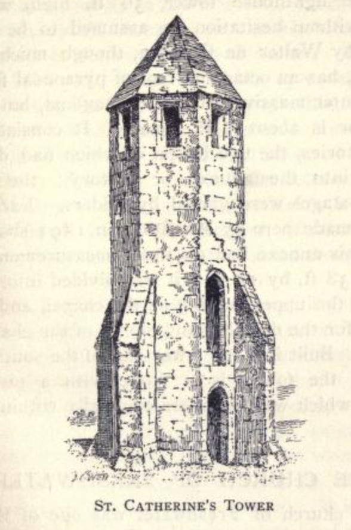

# Walter de Godeton and the Pepperpot

The end of the oratory as a religious site came with the dissolution of the monasteries in ???, but the lighthouse continued to operate until 17??; another one started in 1785 ?? (circular stump forming the base remains still there), but never completed.

No lighthouse for the next ?? years, but if you were to look back down to St Catherine's point from the St Catherine's Hill, you'd see the "new" lighthouse built in ???

And thereby lays another tale...

 The lighthouse, which formed the western tower of the oratory is all that survives of the original building. However, the remains of the walls, are visible as earthworks forming three sides of a square with the lighthouse on the open, west, side. The oratory walls are about 12 metres apart and survive to a height of one metre

---

[https://archive.org/details/calendarofpaten01grea/page/604/mode/2up p604, Membrane 5d]
'1313. June 8, Westminster. The like to Thomas de Warblinton, John de Grimestede and John le Flemyng, on complaint by Elias Biger, Frederick Campanare and Bernard de Columers, merchants of the duchy [of Aquitaine], who had laden a ship, the *st. Mary* of Bayonne, with 174 tuns of white wine at Tonnay, upon the River Charrante, in Poitou, for export to England, and whose ship was wrecked on the Isle of Wyght, and the wine was cast ashore at divers places in the island, that divers men of the county of southampton seized and carried away the wine, although it was not wreck of sea, as many of the mariners of the ship had escaped alive to the land. Witness: J Bishop of Bath and Wells. By the Bishop of Worcester.' (5)

[https://archive.org/details/calendarofpaten02grea/page/54/mode/2up p55, Membrane 18d]
'1313. July 24. Westminster. Association of John Randolf with Thomas de Warblinton, John de Grymstede, and John le Flemyng in a commission of oyer and terminer issued touching a complaint by Elias Biger, Frederick Campanare, and Bernard de Columers, merchants of the duchy [of Aquitaine]. They had freighted a ship called the *st. Mary* of Bayonne with 174 tuns of white wine at the town of Tormay on the river Charrante in Poitou for conveyance to England, and on the voyage the ship was driven ashore on the coast of the Isle of Wight, where the wine was seized as wreck of sea by divers men of the county of southampton, notwithstanding that many of the mariners escaped alive to land.' (6)

[https://archive.org/details/calendarofpaten02grea/page/148/mode/2up pp. 149-50, Membrane 9d.]
'1314, May 26, Newcastle-upon-Tyne. The like `[commission of oyer and terminer]` to Master John de Everesdon and John de Westecote, on complaint by John Besecu that, whereas a ship of Remigius de Depe, merchant of Bayonne, freighted with white wines in the duchy [of Aquitaine] to be carried to the ports of Flanders by the said Remigius de Depe and his men, was driven ashore by tempest near Chale in the Isle of Wight and wrecked, by which a great part of the wine was endangered, and the said Remigius de Depe proved that the ship and wines were his, and afterwards obtained that proof and made his profit therein, Robert de Harslade, John le Walshe and Reymund Arnald having made a plot to injure him, and conspired with certain others at Newport in the same island that Elias Byger, Fretheric de Campane and Bernard de Columiners, unknown men, should lay claim to the ship and wines, and that the said John Besecu should be indicted of having committed a theft of these wines from them, as if those wines had been their property when they were not, and as if Remigius de Depe had not proved that the ship and wines were his, procured his capture and detention for a long time in prison at Winchester until according to the law and custom of the realm he was acquitte: the justices are to enquire fully into these allegations by oath of good men of the county of southampton. By fine of 40s.' (7)

--

The most comprehensive report regarding the historical tale of Walter de Godeton's dealings with the shipwrecked wine from the St. Mary can be found in John Whitehead's *The Undercliff Of The Isle Of Wight Past And Present*:

https://archive.org/details/in.ernet.dli.2015.502008/page/n439/mode/1up

The Undercliff Of The Isle Of Wight Past And Present
by Whitehead, John L. 1911 p327-334 Chapter XII

"Oft in this bay — the dark o'erwhelming deep  
Mocks the poor pilot's skill, and braves his sighs;  
O'er the high deck the frothy billows sweep,  
And the fierce tempest drowns the sea-boys cries." — *Old Song.*

OF LIGHTHOUSES—WRECKS OF THE SEA, SMUGGLING, Etc.

The southern coast of the Isle of Wight must always have been very dangerous to mariners, owing to the conformation of the coast line, the many hidden reefs, and the existence of strong currents—"The high lands of St. Albans, in Dorsetshire, and St. Catherine's Point, in the Isle of Wight, form a great bay, and in blowing weather, with the wind to the south-west, hardly any vessel that gets within it escapes without coming ashore." `[Pennants, I. of W., vol. ii, p. 188.]`

Numerous stories are told of the shipwrecks that have taken place off this coast, and a winter seldom passed without a number of vessels being wrecked in Chale Bay.

The earliest intimation of any preventive measures having been taken to provide a light for warning ships from approaching too near to the dangerous coast off St. Catherine's Point is given in the Winchester register of Bishop Woodlock. It records the admission of one Walter de Langeberewe to the hermitorium situated on the top of Chale Down: "dominum Walterum de Langeberewe ad hermitorium super Montem de Chale in insula Vecta nostrae diocesis in honore Sanctae Katerinae Virginis construendum et reparandum, quantum in nobis est, admisimus et quod in capella ibidem construenda divinia celebrare poterit, etc., i d. Oct. 1312." [*We have admitted Lord Walter de Langeberewe to the hermitage on the Mount of Chale in the Isle of Wight of our diocese, to be built and repaired in honor of Saint Catherine the Virgin, as far as it lies in our power, and that he may celebrate divine services in the chapel to be constructed there.*] `[Woodlock Bishop, Wynton Reg.]` "It is thus manifest," writes the Rev. Charles Cox, "that a hermitage existed on the high grounds of Chale prior to 1312. It is impossible to say and idle to conjecture for how long before this date a hermitage and chapel, with a beacon light attached to it, had existed on these lonely downs; but it seems clear that one had existed here sufficiently long to require rebuilding, and that it had been endowed by a pious founder with some slender stipend. Had it been a mere hermitage dependent on alms the entry would not have appeared in this form in the diocesan register. Had it at that date been first endowed, some record of the founder, however brief, would doubtless have appeared." `[Cox, County Churches I. of W., p. 76.]`

Two years elapse ere the next phase relating to the primitive light thus referred to is entered upon and is connected with a shipwreck occurring off this coast. The story runs that a ship of Bayonne freighted with white wines of the duchy of Acquitaine sailing to the coast of Flanders, was wrecked on the hidden reef known as Atherfield Ledge in Chale Bay. Many of the sailors, however, escaped and came ashore. What then occurred is not clear. The story goes that certain persons would appear to have conspired together to dispute the ownership of the wines, with the result that one, Remigius de Depe, the claimant, was lodged in Winchester Gaol to await his trial. The particulars appear on a Patent Roll, 7 Edward II:—

\1313. July 24. Westminster  
"Association of John Randolph, with Thomas de Warblinton, John de Grymstede, and John le Flemyng, in a Commission of Westminster, oyer and terminer issued touching a complaint by Elias Biger, Frederick Campanare, and Bernard de Columers, merchants of the Duchy of [Aquitaine]. They had freighted a ship called the St. Mary of Bayonne, with 174 tuns of white wine at the town of Tormay, on the river Charrante, in Poitou, for conveyance to England, and on the voyage the vessel was driven ashore on the coast of the Isle of Wight, where the wine was seized as *wreck of sea* by divers men of the county of Southampton, notwithstanding that many of the mariners escaped alive to the land." `[Cal. Pat. R., 7 Edw. II, p. 55.]`

The other side of the story is related ten months later in the same series of Rolls:—

\1314. May 26. Newcastle-on-Tyne.  
"Commission of Oyer and Terminer to Master John de Everesdon and John de Westecote, on complaint by John Besecu that, whereas a ship of Remigius de Depe, merchant of Bayonne, freighted with white wines in the duchy of [Aquitaine] to be carried to the ports of Flanders by the said Remigius de Depe and his men, was driven ashore by tempest near Chale, in the Isle of Wight, and wrecked, by which a great part of the wine was endangered, and the said Remigius de Depe proved that the ship and wines were his, and afterwards obtained that proof and made his profit therein. Robert de Harslade, John le Walshe, and Reynum Arnold having made a plot to injure him and conspired with certain others, at Newport, in the same island, that Elias Byger, Fretheric de Campane and Bernard de Columeners, unknown men, should lay claim to the ship and wines, and that the said John Besecu should be indicted of having committed a theft of the wines from them, as if the wines had been their property when they were not, and as if Remigius de Depe had not proved that the ship and wines were his; procured his capture and detention for a long time, in prison at Winchester, until according to the law and custom of the realm he was acquitted: The justices are to enquire fully into these allegations, by oath of good men of the county of Southampton." `[Ibid., p. 149.]`

In the meantime the 174 casks of wine had been sold, and since each cask was valued at five marks (a mark's value was 13s. 4d.) the amount taken was considerable. With reference to the allegation that the wine was seized as "wreck of the sea" by divers men of the county, it may be said, in explanation thereof, that from the earliest times lords of manors abutting on the sea front claimed "wreck of sea" as belonging to them. Sir Thomas Langford, having leased out his manor of Chale, specially reserved the rights and emoluments coming from this source. `[W., Hist., p. 245.]` It was shown, however, at the inquiry, that the cargo formed no "wreck of the sea." Further particulars appear in the Abbreviation of Pleas, 8 Edward II, giving an abstract of the pleadings in the King's Bench:—

"Ex gravi querela quorundem mercatorum ducatus domini Regis Aquitanise quod ipsi carcaverunt diversa dolea vini albi pro Anglia in quibusdam navibus unde una navis in veniendo versus Angliam super mare in costera Insule de Wight per venti contrarietatem et marls intemperiem ibidem ad terram projecta fuit et confracta vinaque predicta ad terram in diversis partibus in insula predicta devenerunt et quod quidam malefatores de com. Suth' vina predicta licet plures marinarii... Per quod dominus Rex assignavit justiciarios quod inde inquierunt per legates homines... Qui retornaverunt quod dicta Vina surrepta fuere per diversos homines de insula predicta set precipue per Waiterum de Godeton et iij alii usque ad numeram centum lx et xiiij doleorum vini albi plenorum et semiplenorum precii dolei v marcas... Set per alium juratorem computatum est quod predictus Walterus et duo alii liij dolea vinorum predictorum precii dolei v marcas, etc. `[From the serious complaint of certain merchants of the duchy of the lord King of Aquitaine, that they had loaded various casks of white wine for England into certain ships, of which one ship, while sailing towards England, was by contrary winds and the roughness of the sea cast ashore and wrecked on the coast of the Isle of Wight, and the aforementioned wines came ashore in various places on the said island. And that certain wrongdoers from the county of Southampton took the said wines, even though there were many sailors [present]... Whereupon the lord King assigned justices to investigate the matter by sworn men... who returned that the said wines were stolen by various men from the said island, but especially by Walter de Godeton and three others, to the number of 100 and 60 and 14 (=174) casks of white wine, full and half-full, each cask valued at 5 marks... But according to another juror's account, the aforesaid Walter and two others [had] 53 casks of the said wine, each valued at 5 marks,]` `[Abbrev. Placitor, Hill. Term, 8 Edw. II, 1195—1327.]`

It appears, therefore, that Walter de Godeton and other local land-owners were involved, either in the seizure or by purchasing the wine. Ultimately the jurors returned a verdict to the effect that since Walter, with others, had unlawfully received fifty-three casks of the wine, they must pay for them the sum of 227 1/2 marks, etc. Here the matter should have terminated, but, inasmuch as the wine appears to have belonged to a religious community — the monastery of Livers, in Picardy, a further charge of sacrilege was preferred against De Godeton. For his misdeeds it is stated that he was threatened by the Pope with divers pains and penalties. In expiation, and as a token of contrition, he was ordered to build, on the down above the scene of the disaster, a lighthouse to warn ships off the dangerous coast, and further to assign certain rents for a chaunting priest to sing masses for the repose of the souls of Walter, his ancestors, and those lost at sea.

A further record appears in the Winchester registers of Bishop Stratford, having reference to the foregoing. "In a communication to the Archdeacon of the Isle of Wight, the Bishop mentions the fact that Walter de Godston (Godeton) had assigned certain rents for the sustentation of the oratory on Chale Downs, for the maintaining of a clear light on every night on those dangerous parts of the sea-board, whereby divers perils to those navigating the seas might be avoided, and also provided a sufficient endowment for the other uses of the oratory." `[Cox, County Churches, I. W., p. 77.]` The writer goes on to discuss the surmise as to there being "two small establishments on these desolate downs, the one a hermitage and the other this lighthouse and oratory of Godeton's founding, both dedicated to St. Catherine. Having seen the original entries, and having studied at first hand the entries as to hermitages in a score of cases in the early diocesan records, Mr. Cox says:—"There is no doubt whatever that the 1328 entry refers to the same establishment as that of 1312, and that Walter de Godeton reconstructed the lighthouse and oratory, putting the endowment on a more satisfactory footing. A hermitage of mediaeval England differed *in toto* from an ankerhold or dwelling for a recluse. I know of no case," he adds, "of a hermitage where the hermit had not some definite practical work assigned to him, the repair of a bridge, the mending of a causeway leading thereto, or the guarding of a ford " `[Ibid., p. 78.]`

These duties were performed and the light continued to shine till the Reformation when at the dissolution of the chantries, *temp.* Henry VIII, the prayers of the priest, and the more efficacious security derived from the light-house, were involved in one common ruin, and both light and chantry disappeared. It was perhaps found impracticable to divide the useful from the superstitious part of the foundation, so that the whole fell together, the chantry involving the primitive light-house in its ruin. Neither of them was ever restored, yet the little tower, still called St. Catherine's, survived and continued to serve as a guide to mariners
by day.

Of the building erected by Walter de Godyton the foundations only remain. These were excavated, in 1757, by Sir Richard Worsley, and the form of the chapel was disclosed. The tower of the chapel stood at the west end, having four distinct storeys, and was 35ft. 6in. high, octangular without and quadrangular within, finished with a pyramidal roof, each side, interior as well as exterior, being four feet square. "The lower part was perhaps used as a belfry to the chapel of the Hermitage. Its upper story was evidently constructed as a lighthouse for the direction of mariners. It is of plain, but neat masonry. Just beneath the roof it is pierced with eight small windows, whose openings diminish inwards, and all tend to the centre of the building. This construction, which would have been ill calculated for the admission of light from without, is perfectly well contrived for its diffusion from within." The tower—towards the close of the i8th century—was again put into a state of thorough repair, so that it appears capable of withstanding, for another century, the stormy blasts which rage at this elevation. Worsley speaks of the priests' little cell, being found at the south-west corner close to the tower. Mr. Percy Stone, in his excavations undertaken in 1891, says he could find no trace of it, so must conclude Worsley was wrong in his bearings, and meant the walls of the oratory, which I successfully uncovered without finding anything of interest beyond the mere foundations. `[Stone, Percy, Archit Ant. I. of W,, vol. ii, p. 29.]`

The tower stood on the summit of St. Catherine's Down, 781 feet above sea level. "When standing on this airy summit it is impossible not to picture to the mind the venerable inhabitant of this cell lifted almost out of the habitable world, and only recalled to it by the charitable care of his friendly lamp; mingling his nightly orisons with the howling of the storm, and pouring forth prayers for the safety of those whose anxious eyes were strained with watching for its welcome ray, twinkling by fits through the sweeping clouds."

"The view from the hill," writes Mr. Thorne (*The Land we live in*), "is of wondrous extent, reaching over, by far the larger part of the island, and including the New Forest, the hills of Hampshire, and the south coast as far as Beachy Head."

The ancestors of Walter de Godyton are found mentioned in the feodary, 8 Edward I:— "Will'us de Godditon tenet dimidium feodi apud Hale," and a later reference to the same manor is entered in a Close Roll, under date July 26th, 1352:

\1352. July 26.  
The King appointed William de Ryngebourn, Theobald de Gorges, and John de Kyngesdon, to take an inquisition and it is found that a manor called Hale was lately half a Knight's fee, that William de Godyton now held it entire of the manor of Gatecombe in demesne... that the manor was not divided after the death of William de Hale and that Richard atte Hale held the messuage and land of Robert de Godyton by the service of a fourth part of a Knight's fee," etc. `[Cal Cl R., 1349—1354.]`

The manor of Godyton is found under its modern name of "Gotten," as a farm situated on the north-east slope of Chale Down. In 1780 the Trinity Board, recognising the value of the ancient tower as a landmark, and desiring to re-establish the light, substantially repaired the tower, and, at an expense of £7,000, erected another pharos by its side. This light was soon found to be useless in bad weather when most wanted, for the high hills are almost always enveloped in clouds, and of course the lanthorns invisible at any little distance. Pennant, from whom the quotation is taken, mentions that "From mistaking this light for the Portland lights, a Dutch frigate of 36 guns and 250 men came bump ashore and was beat to pieces, and though most of the crew were saved at last, the surf ran so high it was one night and two days before they could be brought off." "I was," he adds, "the means of saving eight men, by bribing a desperate smuggler to go off to them in his boat." `[Pennants, Journey to the I. W., vol. ii, p. 189.]`

TO DO

In bygone days the south side of the island obtained an unenviable notoriety from the behaviour on these occasions of the people living on the coast strip. The ingenious Mr. J. Sturch, of Newport, writing on the Isle of Wight in 1756, says:—

"The Country People, of the meaner Sort, have for many years been too much accustomed to make a barbarous Advantage of these Misfortunes, plundering and carrying off the Merchants Effects in a most unjust and infamous Manner," adding — "of late this savage Practice has been much suppressed." `[The General Magazine of Arts and Sciences, p. 122.]`

Albin, writing in 1795, tells us "The inhabitants are usually more intent on plundering than on affording assistance to the distressed and shipwrecked mariner." A year later, Tomkins, in his *Tour of the Island*, refers "to an inhuman stratagem practised by the inhabitants of Chale" — adding that it has too much the air of fiction to be seriously credited — "on every stormy night the unwary mariner is allured to his destruction by fixing a lantern to the head of an old horse, one of whose legs had been previously tied up. The limping gait of the animal gave the lantern a kind of motion, exactly similar to that of a ship's light, and led the deceived pilot on these fatal rocks, to fall a prey to merciless plunderers."

In consequence of this atrocious behaviour — whether here or elsewhere — it was enacted in the reign of George II "That death was to be the punishment for hanging out false lights, also for stealing goods from a wreck."

Behaviour of this kind could not have been notorious here, or very general, since we find Gilpin, in 1798, writing:— "There is another picturesque circumstance frequently seen on the coasts of the Isle of Wight, which may be mentioned, though it is a dreadful one. A winter seldom passes in which the inhabitants of these dangerous coasts are not called together to see some dreadful event (a wreck) of this kind. Long experience has taught them to judge when the mischief is inevitable. They see that every wave which beats over the perishing vessel drives her nearer some reef of rocks, well known to them, though the seaman knows it not; signals can be of no use; yet they make what signals they can to point out the danger. In a short moment the dreadful crash arrives. The labouring vessel, now beating among the rocks, gives way in every part, and the hospitable islanders, very unlike their neighbours on the Cornish Coast, have nothing left but to do everything in their power to save the miserable people, and recover what they can from the wreck."

From the earliest period "wreck of the sea, waifs and estrays," pertained to the lordship of the island. At an inquisition taken on the death of Baldwin de Redvers, 47 Henry III (1263), "the jurors also say that wreck of the sea belonging to the lord of the castle is worth 4s. per annum." During the countess Isabella's tenure the claim was contested by the abbot of Quarr, by John de Insula, owning Bonchurch and other Undercliff estates, by Sir Thomas de Aula, of St. Lawrence, and the lady Matilda de Estur, of Old Park, in Whitwell parish, on the plea that each of them was entitled to one-half of whatever should be wrecked on their respective lands, as a compensation or salvage for preserving the other half for the use of the lord." The trial took place before the Justices Itinerant, at Winchester, 8 Edward I (1280), when "Isabella, countess of Albermarl, was summoned to show to the Lord the King, by what warrant she thus claimed to have wreck of the sea, and Isabella comes and saith that she and all her ancestors, from the time of king Richard, and also before that time always unto the present time have had their wreck of the sea in her fee of the Isle of Wight without any interruption." The story is given in Hillier's unfinished *History of the Isle of Wight*, and "The jury being chosen, say upon oath, 'that the aforesaid Countess and also all her ancestors, from the time whereof memory doth not exist, had such wreck of sea in her fee,' etc., and by an order of the Itinerant Justices the rights of the Countess were confirmed. `[Hillier, Hist. and Antiq, I. W., pt. ii, p. 95.]`

In 1416, 3 Henry V, is entered the following:—

"Edwardus Dux Ebor'.

Insula de Wight et Caresbrok Castr' infra eundem et totum dominium addict' insulam et castrum pertinens cum wrecco maris..." `[Cal. Inq., p. m., vol. iv.]`

The "revenue of wrecks" was granted as a royal franchise to lords of manors, and the Wardens of the Island claimed this privilege. Worsley writes:— "When the Lordship was in Prince Edward, Sir Henry Tyeys was Warden under him, a petition was exhibited against him to the Parliament by Ralph de Gorges (of Knighton, I. of W.), complaining that he (Sir Henry Tyeys) had defrauded the lord of part of the salvage of a wreck," etc. `[Worsley, Hist., p. 88.]` The lords of the manor of Ashey, which included the sub-manor of Knyghton, claimed to have all wrecks of the sea on the north side of the island between Ryde and Binstead, as far beyond low water mark as a man could reach the ground with an oar, 18 ft. long, as their property.

The result of the inquiry is entered on a Patent Roll:—

1320 Nov. 15 Westminster  
"Commission of Oyer and Terminer to John de Bello Campo of Somersete (and others), touching the petition, exhibited before the King's Council, of Ralph de Gorges, alleging that divers trespasses and other malpractices under colour of office had been committed as well against the King, Edward, earl of Chester and lord of the Isle of Wight, his son, as against men of the county of Southampton and of the said Island, by Henry le Tyeys and John de Burton and other ministers of the said Henry during the time the same Henry was Constable of the said Island. " `[Cal. Pat. R., 1317-1321, Edw. II. p. 546.]`

And later, in the same series of Rolls, is entered:—

1321. July 2. Westminster.  
"Grant to Ralph de Gorges, lately taken prisoner while on the King's service and ransomed afterwards, of 500 marks towards his ransom, to be received out of the first money accruing from the £1000 by which Henry Tyeys lately made fine for trespasses against the King, Edward, earl of Chester, in the Isle of Wight of which he was convicted..." `[Ibid, p. 596.]`

As the commerce between the continent and the mainland increased in volume this asset must have become much more valuable. It possibly explains the effort the early manorial lords seem to have made to secure a sea-frontage on the exposed south side of the Island, however contracted the area might be.

The phrase "flotsam and jetsam" is often used, but the true meaning is not always fully understood. In order to constitute a legal wreck the goods must come to land. If they continue at sea the law distinguishes them by the above terms. "Jetsam " is applied where goods are cast into the sea, and there sink and remain under water; "flotsam," where the goods continue floating on the surface of the waves, and a third term, "ligan," where they are sunk in the sea, but tied to a cork or buoy to be found again, a mode of procedure endeared to the heart of many a bygone smuggler.

The following deed is of interest, as showing that some of the rights claimed by the "Lords of the Island" in early days still appertained to the later governorship:—

"An agreement between Richard Worsley, Captaine of the Isle of Wight, and certyn Merchaunts of London, concerning Goods wrecked on the Island, 35 Henry VIII (1544).

> This Indenture made the vijth day of March in the xxxvth year of the Reign of our Sovereigne Lord Henry 8th by the Grace of God of Ingland, Fraunce and Ireland, Kyng, Defender of the Faith and on Erth immediately under God suppreme Hed of the Church of Ingland and Ireland. Betweene Richard Worsleye, Esqyer, Captaine of the Isle of Wight in the Countie of Sutht' of the one partie and us as well the Merchaunts and Laders as Factors, attourneys, and Deputies for the Merchauntts Laders of the Citie of London of and in a Ship namyed the 'Concepcion of Castric' lately perished and lost at a place called the Donne-Nose within the said Isle of Wight of the other partie. Witnesseth that the saide Merchauntts, Laders, Factors, Attorneys and Deputies for and in behalfe of the Merchauntts and Owners of al the Goods and Merchaundises conteyned within the saide Ship by these Presents hath covenanted concluded and fully agreed to and with the said Richard Worsleye in manner and forme followinge that is to say the seyd Richard Worsleye to have for the Recovery and Savying of all such merchaundises as yu the seyd Ship was laden and styvyn from hensforth as well brode Clothes, Screytes, Dosens, Kersies and Cottons as also Hides, Calf Skynnes, Tallowe, Pewter and other Marchandises wherewith the seyd Ship was laden as the saide Richard Worsleye shall save and recover or by any manner of meanes bring into his possession or Custodie as wel in hole clothes as Remnants and Pieces to the Behoof and Profit of us the seyd Merchauntts and Laders the fourthe part for his paines and i:harges of all the seyd Wares so hereafter by him savid and recovered. The saide Richard Worsleye delyveryng or causyng to be delyvered to uss the seyd Merchauntts or to owre assignes the other three partes clere of all manner of Costs and Charges which he shall do or cause to be done about the sayvng and recoveryng off the same. And the saide Richard shall also cause the saide Clothes as well hole as in pecys to be washyd, driyd, and d'elyverid to the seide Merchauntts or to theire assignes the seide three parts clere at the Key of the Town of Newporte within the seide He at his ppre Costs and Charges. In Witness whereof the parties aforesaide to these present Indentures have interchangeably set their Seales.  
Per me Rolandu Stap. (L.S.)

Dunnose, where the disaster happened, is a well-known and dangerous point on the coast near Luccombe, and here, in recent years, several shipping disasters have occurred, notably the wreck of H.M.S. Eurydice,

From a note entered in a Calendar of State Papers it would seem attention had been drawn to the dangerous coast near by Dunnose:—

"1661. Nov. 16. Reference to the Trinity House of the Petition of Edward Penruddock, for setting up a light house on the western coast and Dunnose Point on the south of the Isle of Wight." `[Cal, S. P. Dom, Ser., 1661—1663, p. 149.]`

The foregoing "Notes" may very fitly conclude with a brief description of the well-known lighthouse situated at St. Catherine's Point, in the parish of Niton.

ST. CATHERINE'S LIGHTHOUSE

After the primitive light disappeared in consequence of the chantry endowments having been taken away in the reign of Henry VIII, no further attempt to lessen the dangers of navigation was made until the year 1780. In this year the Brethren of the Trinity House erected^ a lighthouse on the top of the down near to the western boundary of the parish of Niton. This, however, proved useless on account of the misty vapours which so frequently obscured the summit of the hill, when the mariners had most need of the lights’ friendly aid.

...

----

## Additional Notes - Not Done

goods distrained "except the horses and oxen of his ploughs" and half of his lands and tenements leases out until the fine of 287 (227?) and a half marks had been paid in full. 

[Marks - m    mark    2/3 £ or 13s 4d  http://faculty.goucher.edu/eng240/early_english_currency.htm]
https://www.nationalarchives.gov.uk/currency-converter/#currency-result
£150  ~ £90k today
distrain - To seize and hold (property) to compel payment or reparation, as of debts.

m    mark    2/3 £ or 13s 4d

TO DO

--

https://en.wikipedia.org/wiki/Carisbrooke_Priory
In 1046, William FitzOsbern, kinsman of William the Conqueror, founded Lyre Abbey in Normandy. When William became King of England, FitzOsbern was given charge of the Isle of Wight, and took up residence in Carisbrooke Castle. In the wake of the Norman conquest, FitzObern became one of the great magnates of early Norman England, acquiring extensive lands there, from which he made generous donations to Lyre Abbey.[1] The church of Carisbrooke, and other property, had been granted to the abbey of Lire, probably by William Fitz Osborne, Earl of Hereford around 1067.[2] By the mid-12th century, Lyre Abbey had adopted the Benedictine rule.
Around 1100, Henry I of England made Richard de Redvers, also from Normandy, Lord of the Isle of Wight.[3] His son, Baldwin de Redvers, Earl of Exeter and Lord of the Isle of Wight, gave to the Abbey of Lyre all the churches, tithes, lands, rents and benefits that he held throughout the island. Henry II's confirmation charter to Lyre Abbey specifies its possessions throughout England. The priory of Carisbrooke was founded in 1156 by Baldwin de Redvers, to collect the dues in the Isle of Wight of the parent house in Normandy. The monks of Carisbrooke served the chapels of Newport and Northwood
-- monks bay  - monks used to land from Lyre? Is this also Livers of st Mary? Or is that perhaps https://www.visit-somme.com/breathe-and-relax/valloires-abbey-and-gardens? https://en.wikipedia.org/wiki/List_of_Cistercian_monasteries_in_France https://en.wikipedia.org/wiki/List_of_Benedictine_monasteries_in_France

https://en.wikipedia.org/wiki/Lyre_Abbey Lyre Abbey (French: L'abbaye Notre-Dame de Lyre) was a monastery in Normandy, founded in 1046 at what is now the village of La Vieille-Lyre. From the mid-12th century it was a Benedictine house. It was abolished at the French Revolution and the abbey buildings mostly destroyed.

---
https://archive.org/details/bim_eighteenth-century_collections-for-the-hist_d-y_1795_1/page/126/mode/1up?q=%22week+down%22
p126-7

Collections for the history of Hampshire, and the bishopric of Winchester: including the Isles of Wight, Jersey, Guernsey, and Sarke, by D. Y. With the original Domesday of the county, and an accurate English translation, ... By Richard Warner, ... Illustrated with upwards of sixty plates, ... In six volumes. ...  1795: Vol 1
by D. Y.
 1795

The manor of Godyton, in this parish, gave name to its ancient possessors. Walter de Godyton, in the year 1323, built a chapel on Chale down, dedicated to St. Catharine, assigning certain rents for a chantry Priest to sing mass, and also to provide lights, for the safety of such vessels as chanced to come on that dangerous coast during the night. At the dissolution of chantries, it was, perhaps, found impracticable to divide the useful from the superstitious part of the institution; so that the whole fell together, the chantry involving the light-house in its ruin.

By an entry in the registers of this diocese, it appears, that eleven years before the erection of this chapel, there was an hermitage standing on the same spot: the entry is as follows: *Walter de Langstrell, admissus ad hermitorium supra montem de Chale, in insula Vectis, Tail. Octobris, A. D. 1312*.

The situation pointed it out for a sea mark; it being about 750 feet above high water level, half a mile from the shore, and commanding a most extensive view. The tower of the chapel is yet standing, and is known by the name of St. Catharine's Tower: it is thirty-five feet six inches high; octangular without, and quadrangular within, finished with a pyramidical roof; each side, interior as well as exterior, being exactly four feet. From this construction, the curious have found out some resemblance to the temple of the eight winds at Athens—a building, it is more than probable the architect never saw, or ever heard of. `[In an ancient survey, belonging to Sir Richard Worsley, Bart. there is a small rude drawing of this chapel; from which, it appears that it had only a body, without a transept. The tower stood at the west end. A description of this tower, with four views of it, in its decayed state, are seen in the Gent. Mag. vol. xxvii. p. 176.]`

St. Catharine's tower still remains of most essential use, by day, to vessels navigating the channel: but having become extremely ruinous, its fall was to be apprehended; and, as it sudden disappearance might have been attended with fatal consequences, it was substantially repaired, and its angles strengthened with buttresses, at the expence of the lord of the manor. The foundation of the whole chapel is also cleared and levelled; by which, not only its figure was discovered, but also the floor and stone hearth of the Priest's little cell, at the south-west corner, close to the tower

https://archive.org/details/s2492id1330005/page/176/mode/2up
The gentleman's magazine. Volume 27,  1757 p176

Mr Urban,

I Send you four views of the tower of St Catharine's which stands upon the summit of St Catharine's Hill Down, on the back of the Isle of Wight, about 750 feet higher than high-water mark, and about half a mile from the sea, commanding the most extensive view, both by sea and land, of any place in Britain. It is part of a consecrated building of great antiquity, as appears by the Winchester register, in which there is this entry :

"Walter de Langsterell, admijssus ad Hermitorium supra montem de Chale in insula Victis. Idil. Octobris A.D. 1312."

The figure of this tower within, is quadrangular, and without octagonal; each side both of the octagon and quadrangle is just four feet, its height to the roof is 27 feet, and the perpendicular height of the roof is two feet.

It seems to be a Gothic imitation of the Temple of the eight winds at Athens, which was built by Andronicus, whom Vitruvius calls Cyrrbastes, at Athens.

I have added a view of this temple, which was of marble; on each side was carved, in bass relief, a representation of the wind of that quarter which it fronted; and on the point of the roof, which was a pyramid of marble, a brazen Triton was placed, as a weather-cock, holding a small rod in his right hand, which pointed to the quarter from which the wind blew.

The tower of St Catharine has been long a sea mark, and has been of the most important service by directing our mariners to avoid the adjacent rocky shores in navigating the channel, and it would therefore have been thought very strange in any time less negligent of the public interest, and less improvident for the morrow', than the present, that it should have been suffered to go to ruin. You will see by the south view, that it must very soon fall at once into rubbish if it is not effectually repaired, and the sudden disappearance of it, before the accident can be known at sea, will probably occasion the loss of more vessels and lives than the most dreadful hurricane that ever happened. I hope, Mr Urban, that those whose inattention has suffered this necessary service to be delayed, will now see it performed, as they must after this memorial incur more severe censure by neglecting it.

I am Yours, &c., A, B.

### Letter
record.office@iow.gov.uk

Researching some local stories for if/when Island Storytellers ever get to tell again(!) I am trying to find original materials relating to court cases surrounding William de Godeton (Goditon) from the 1300s, particularly in respect of cases relating to wrecking and the receipt of wrecked goods relating to the wrecks of:
 
Saint Mary / Blessed Mary 1313 https://www.pastscape.org.uk/hob.aspx?hob_id=1119117
Jesus Christ 1318? https://www.pastscape.org.uk/hob.aspx?hob_id=899227
 
I've found mentions in the Calendar of Patent Rolls, eg as cited in the above records via archive.org, but I'm not sure where to find the records or transcripts of the actual court hearings or their decisions.
 
Many local tellings of the wreck of the Saint Mary also mention more detail of hearings on 8th June 1313 (Southampton), then Winchester 20th July 1313 and finally 22nd February 1314  (location?) which resulted not least in a fine of 227.5 (?) marks to de Goditon.
 
QUESTION: do you know where I might find or access records, copies or transcripts of the actual court hearings or their decisions?
 
A Gotten Manor history (https://www.gottenmanor.co.uk/history/) suggests "[de Goditon] was fined so heavily that all his goods had to be distrained, "except the horses and oxen of his ploughs" and half of his lands and tenements leases out until the fine had been paid in full" and mentions documented evidence of a local record of 1323 in which Walter gave to the Church "an acre of land with Buildings on St Catherine's Down". On this site was built the famous 'St Catherine's Oratory' with the tower which served as a lighthouse for centuries and still stands today.

QUESTION: do you know where I might find or access records, copies or transcripts of actions taken relating to the fine, the distraining action, the payment and relaxation of this sentence?

The Saint Mary stories also mention how a Papal court was involved by a monastery from Picardy for whom the lost goods of the Saint Mary were presumably intended, and as a result de Godeton was threatened with excommunication unless he built what we now know as St. Catherine's Oratory, and also "to provide a 'chaunting priest' and to establish 'a light for the benefit of mariners, to be lit every night for ever'" [https://www.pharology.eu/history/britishisles/BR02_eccliasticallights.html]

QUESTION: do you know where I might find or access records, copies or transcripts of actions taken relating to the papal court action and perhaps how it played out with respect to local Church courts (eg how does the "acre of land with Buildings on St Catherine's Down" fit into the various sentences imposed on de Godeton)? [I did wonder if the Quarr Abbey library might be a place to start?]

--

I am sorry for my slowness in giving you a full reply. We are down to a single member of staff rather than our usual team of four due to redeployments in this lockdown.
I have now had a chance to look at some of the references cited in the links that you have provided. I think that there is very little here that is going to get you close to the original sources, but I hope that there may be a few leads that will prove of use
Sir Richard Worsley in his History of the Isle of Wight of 1781 refers to one source as Reg Winton 1323 and later to the fact that it was already a hermitage in 1312 quoting from a register for the diocese of Winchester. Both of these references will presumably lead to items at the Hampshire Record Office, in the records of that diocese. My colleagues at that office may be able to suggest how to get closer to the source through their finding aids. There is a useful on-line catalogue that is searchable and it may be worth looking at that.
The majority of the sources quoted in the Shipwreck Index of the Isle of Wight relate to the Calendars of Patent Rolls at the National Archive, which you have already had access to. There are some secondary sources that we hold here which are referred to, including an article on the wreck of the Blessed Mary (TPT 75) and books such as the volumes on shipwrecks and the Back of Wight by Fred Mew, Ken Phillips and John Medland.
S F Hockey in Insula Vecta (1982) deals with the topic rather briefly. "The little that is known about the oratory and its origin is soon told. The episcopal licence of 15 October 1312 to repair the hermitage for divine worship in the chapel seems to indicate that it was not a question of a new foundation, though there is no earlier allusion to its existence, nor any name of a priest or hermit residing at the oratory. Obviously the little chapel had never been sufficiently endowed. Later, it was granted to Barton oratory, for the maintenance of the divine office and the light by night." There are two references given in this passage. The first is to the episcopal licence and is "Reg Woodlock p589". Woodlock is a bishop of Winchester and so this is the same 1312 reference as above I think. The second reference to the grant to Baton Oratory cites Winchester College Muniments (WCM3689). Access to this item is now through the Hampshire Record Office.
So sadly I don't think that there are any sources at this office that would help you. I would assume that if there were any full court transcripts these would have been used by now. It was, as I understand it usual for records to record the outcome of court business rather than keep a record of the evidence. However if anything survived then I suspect that it was more likely to have been dealt with through a diocesan court rather than through an abbey.
We don't have any on-line sequence of maps along the lines of the ones that you have shared. We do have some images that might be scannable from the Ordnance Survey editions and from 18th century maps such as that for Andrews, and some of these might be scannable. Is there a particular part of the haven that you are interested in, or is it the shape of the whole inlet that is of interest
Yours sincerely
Richard Smout
Richard Smout Isle of Wight Heritage Service Manager, Culture and Partnership Development
Isle of Wight County Record Office, 26 Hillside, Newport, Isle of Wight PO30 2EB
Tel: 01983 823820  (Mailbox 2232)
Email: richard.smout@iow.gov.uk Web: https://www.iwight.com/recordofficeandarchive

--

Calendar of entries in the Papal registers relating to Great Britain and Ireland. Papal letters, 1198- .. W. H. Bliss, vol. II 1306-1342.
by Great Britain. Public Record Office

Publication date 1893

--

https://archive.org/details/isleofwightitsch00coxjuoft/page/n97/mode/2up
Isle of Wight: its churches and religious houses
by Cox, J. Charles (John Charles), 1843-1919

Publication date 1911
pp. 75-80

THE ORATORY AND LIGHTHOUSE OF CHALE

Mr. Stone, the Island's historian of the present generation, has done no better work than in rescuing from strange neglect the outline of the story of the mediaeval pharos on the southernmost heights of England's coast, kept burning through the nights of centuries by the faithful guardianship of vowed religious. This merciful provision for the safety of mariners, carried out by a succession of prayerful men, was probably a far greater boon to humanity and saved infinitely more lives than the rescue from snowdrifts of travellers over an Alpine pass; and yet for every thousand who know much of the monks of St. Bernard, there is probably scarcely a single one who has ever heard of the lighthouse-keeper of St. Catherine, on the dreary downs of Chale, 800 ft. above the sea.

From the Winchester register of Bishop Woodlock, it is manifest that a hermitage existed on the high grounds of Chale prior to 1312. In that year one Walter Langeberewe was admitted by the bishop to the *hermitorium super Montem de Chale in Insula Vecta nostre diocesis in honorem S. Katerine Virginis construendum et reperandum*. Walter was evidently a priest, for he was licensed to perform Divine Service in the chapel. It is impossible to say and idle to conjecture for how long before this date a hermitage and chapel, with a beacon light attached to it, had existed on these lonely downs; but it seems clear that one had existed here sufficiently long to require rebuilding, and that it had been endowed by a pious founder with some slender stipend. Had it been a mere hermitage dependent on alms the entry would not have appeared in this form in the diocesan register. Had it at that date been first endowed, some record of the founder, however brief, would doubtless have appeared.

For the account of the wreck of a vessel laden with wine on a spur of Chale Down in 1314, and of the illegal sale by the shipwrecked sailors of 174 casks, worth 227 1/2 marks to the Islanders, in which Walter de Godston *`[sic]`* played a leading part, reference must be made to Mr. Stone's pages (vol. ii. pp. 27—8). One version of the story — but this part has not been as yet authenticated — states that the wine belonged to the monastery of Livers, in Picardy, who lodged a complaint in France against Walter for what amounted to sacrilege, and to expiate the offence by founding a lighthouse near the site of the disaster, with an oratory attached for a priest to say masses for the souls of those lost at sea.

At this point the invaluable contemporary record of the Winchester registers again intervenes. On August 17, 1328, Bishop Stratford, in a communication to the Archdeacon of the Isle of Wight, enters the fact that Walter de Godston had assigned certain rents for the sustentation of the oratory on Chale Downs, for the maintaining of a clear light on every night on those dangerous parts of the sea-board, whereby divers perils to those navigating the seas might be avoided, and had also provided a sufficient endowment for the other uses of the oratory. The rights of the mother church of Chale were to be duly safeguarded.

The strange surmise has been offered that there were two small establishments on these desolate downs, the one a hermitage and the other this lighthouse and oratory of Godston's founding, both dedicated to St. Catherine. But to my mind, having seen the original entries at Winchester, and having studied at first hand the entries as to hermitages in a score or two of cases in the early diocesan records, there is no doubt whatever that the 1328 entry refers to the same establishment as that of 1312; and that Godston reconstructed the lighthouse and oratory, and put the endowment on a more satisfactory footing. A hermitage of mediaeval England differed *in toto* from an ankerhold or dwelling for a recluse. I know of no case of a hermitage where the hermit had not some definite practical work assigned to him, usually the repair of a bridge, the mending of a causeway leading thereto, or the guarding of a ford.

The light remained burning, in all probability, night by night, until the accession of the boy-king Edward VI. The reckless scheme of the dissolution of the monasteries by that avaricious spendthrift Henry VIII. had put out the light maintained by the monks of Quarr for the help of mariners north of the Island, and the Council of his son following this policy of greed crippled religion and summarily suppressed a variety of good works by the seizing of the chantry endowments under the plea of "superstition." Among other results, such as the extinguishing of schools, came about the loss of this beacon light.

A survey of 1566, of which Mr. Stone supplies a facsimile, shows the lighthouse tower and the adjoining oratory (though disused) still standing. Near by two curious pyramidal piles are depicted, which represent beacons ready stacked for burning, not for saving the life of mariners, but for giving warning of the approach of enemies. By the i8th century, and probably long before, the oratory had ceased to exist, for a plate in the *Gentleman's Magazine* of 1757 shows the dilapidated tower standing by itself. In 1785, the Trinity Board, recognising the value of the ancient tower as a landmark and desiring to re-establish the light, undertook the substantial repair of the tower, and began the construction of another pharos by its side; but the latter was never completed, for it began to be recognised that fogs and mists frequently render lofty lighthouses on lofty sites useless. `[Since 1840, the Trinity Board have maintained a lighthouse on St. Catherine's point at the extreme south of the Island. Recent improvements have rendered this the most powerful coast light in the world, whilst the syren or foghorn attached to it has no rival for resonance.]`

The lighthouse tower, 36 ft. high, which may without hesitation be assumed to be that built by Walter de Godston, though much repaired, has an octagonal roof of pyramidal form. The outer massive walls are octagonal, but the interior is about 5 ft. square. It consists of four stories, the two lowest of which had doorways into the annexe or oratory; the two upper stages were gained by ladders. Excavations made here by Mr. Stone in 1891 showed that this annexe had an inner measurement of about 38 ft. by 15 ft.; it was divided into two floors, the upper serving as the chapel, and the lower for the dwelling and stores of the chantry priest. Built into the lower part of the southern fall of the tower is a stone with a piscina drain, which was doubtless originally within the chapel.

--
Percy Stone cites a ?? in the Abbreviation of Pleas, 1315

https://en.wikipedia.org/wiki/Percy_Stone architect, author, archaologist
https://iwnhas.org/wp-content/uploads/2020/02/Archaeology-timeline.pdf
1907 Pageant of Isle of Wight History held at Carisbrooke Castle (CC).
Percy Stone, architect & antiquary, acts as advisor. [A programme for this is in the Castle Museum Library.]
1909 'Guide to Carisbrooke Castle' by Percy Stone
1910 Percy Stone excavates at St Catherine's Oratory (and earlier at Quarr Abbey).
Lived at Merstone, died 1934
The Architectural Antiquities of the Isle of Wight from the XIth to the XVIIth centuries inclusive, 1891

---

oratory - pharo https://www.british-history.ac.uk/vch/hants/vol5/pp235-240
GOTTEN
GOTTEN (Gadetune, xi cent.; Godeton, xiv cent.), now only a small farm-house, was held before the Conquest by a certain Bruning and his brother, but belonged in 1086 to William son of Stur. (fn. 47) The overlordship passed like Gatcombe (q.v.) to the descendants of William son of Stur, being held in the 13th century as part of a fee in Whitefield (fn. 48) and Gotten, &c., of Maud de Estur, lady of Gatcombe. (fn. 49)
In the 13th and 14th centuries the intermediate tenants of Gotten were the lords of Whitefield (q.v.), the Tracy family, who held the above fee, (fn. 50) while the intermediate tenants who held Gotten of the lords of Whitfield for one-twelfth of a knight's fee were the family of Goditon or Gotton, who were also holding Southale in Hale (fn. 51) (q.v.). Thus in about 1305 William de Goditon or Gotton died seised of a tenement in Gotton, held as above, and was succeeded by his son Robert, (fn. 52) and from this date it appears that Gotton descended like Southale in Hale (q.v.), being possibly merged in the same. In the 16th, 17th and 18th centuries estates in both Hale and Gotton were in possession of the Oglander family, that in Gotton being termed half the manor of Gotton. (fn. 53) This estate seems subsequently to have been acquired by the lord of Chale and annexed to that manor.

island graves https://iw-bereavementservices.co.uk/

https://www.pharology.eu/history/britishisles/BR02_eccliasticallights.html
Shipwrecks were both good news and bad news, bad for the sailors and their families, but good for the people who lived nearby and who could benefit from salvage of the cargoes. Such windfalls often meant the difference between comfort and despair in lean times. Once seamen came to depend upon certain lights being shown, it was only a matter of time before unscrupulous rogues showed false lights to lure ships onto deadly rocks. The Cornish coasts, in particular, hold many secrets of wreckers and their deadly games. In the 14th century, piracy at the Bell Rock in Scotland is the focus of a tale in which a warning bell was established on the dangerous rock by the Abbot of Arbroath, but removed by the pirate to further his own evil ends. It is said that he perished a year later when his ship struck the same rocks because there was no longer a warning.

From medieval times to the beginning of the 17th century, the safety of seamen, which included showing lights, was a task that often fell to the caring people of the church. Indeed, the majority of early maritime lights were of ecclesiastical origin. One of the first recorded lights, established by a religious order in the British Isles, was at Hook Head in County Wexford, reputed to be the site where the monks of St. Dubhan established a fire beacon as early as the 5th century. Another report gives 810 as the date of establishment, but there is no doubt that the tower that exists there today is the oldest operational light in any of the four countries – England, Wales, Scotland and Ireland, and dates from 1245. It was reportedly built by the warden and chaplains of the monastery of St. Saviour Rendeuan. A lighthouse is said to have been built at Youghal in 1190 by Maurice Fitzgerald who put it in the care of the nuns of St. Ann's convent, which he endowed. In England, the earliest known light was a harbour light at Winchelsea on the Kent coast, erected about 1261.

Whilst monks may have tended to lights, not all were built by them. St. Catherine's oratory on the Isle of Wight was erected by a rich merchant to fight ex-communication by the Papal church. The merchant, Walter de Godeton, purchased numerous barrels of wine from the local wrecking community at St. Catherine's. Despite the principle of 'Custom and Descent', where salvage from shipwrecks was considered the lawful right of the people, the Pope considered that, because the wine had been destined for the Catholic Church, the salvage was an act of plunder and sacrilegious. In penance to the Church, Walter de Godeton was forced to build St. Catherine's Oratory to provide a 'chaunting priest' and to establish 'a light for the benefit of mariners, to be lit every night for ever'. From 1314 until the dissolution of the monasteries by Henry VIII in 1534, the family of Walter de Godeton kept the oratory lit.

St Catherines oratory https://www.pastscape.org.uk/hob.aspx?hob_id=459794

A medieval lighthouse forming the west tower of an oratory, and the remains of the oratory, set within a medieval enclosure on St Catherine's Hill. The lighthouse survives as a stone tower (known as the Pepperpot), octagonal on the outside and square within, originally consisting of four stories. Eight windows on the third floor form the lantern. The lighthouse, which formed the western tower of the oratory, is all that survives of the original building. However, the remains of the walls are visible as earthworks forming three sides of a square with the lighthouse on the open, west side. The oratory walls are about 12 metres apart and survive to a height of one metre. Partial excavations in 1891 revealed the building plan. The lighthouse was completed by 1328. It was built by Walter de Godeton, a local landowner, who was condemned by the Church for stealing casks of wine from a shipwreck which had occurred in 1313 off Chale Bay. The Church threatened de Godeton with excommunication unless he built a lighthouse above the scene of the shipwreck together with an adjoining oratory. The oratory was to be endowed to maintain a priest to tend the light and to say masses for souls lost at sea. These duties were apparently carried out until the Dissolution of the Monasteries. The tower's arched door-heads suggest it was substantially repaired in the mid 16th century, possibly with the threat of the Spanish Armada. Surrounding the lighthouse and oratory on their north, west and south sides is a bank about 0.5 metres high and 5 metres wide, the fourth side likely to have been levelled by cultivation. The oratory is a Scheduled Ancient Monument, is listed Grade II, and is in the care of English Heritage.

http://iwhistory.co.uk/The%20pepper%20box.doc Stanly Cotton?

The monument known locally as 'the pepper pot' is a mediaeval oratory and pharos, a lighthouse, built near the summit (800 ft) of St Catherine Down above Chale Abbey, i.It is known that an hermitage existed on the site previous to 1312 because the Bishop of Winchester, Bishop Woodlock 2 issued a licence* on 4th. October 1312:
".. domimm Walterum-de Langeberewe" [longbarraw ] (Langstrellgiven in Tomkins) ad hermitorium super mantem de Chale in Insula Vecta nostrae dioceses in honore Santa Katerinae Virginis construendum et reparendum., quantum in nobis est, admisimus et quod in capell ibidem cowtruende divinia celebrare poterit..."
*'His permission to build the lighthouse and perform divine service'
The light was provided from a blazing brazir within but it was useless to mariners.
Two years later one stormy night in 1314 a vessel, the 'Mary of Bayonne', laden with 174 tuns (barrels) of white wine foundered in Atherfield Bay. She was part of a fleet belonging to some merchants of the King's Duchy of Aquitaine all carrying wine, loaded in Tormay, on the River Charrante in Poitou to England. The wine was consumed by the locals or sold as 'wrecks of the sea' 3 but the owners took action to recover their loss in the King's Court-Malefactiones de Comittatu de Suthanton 4 [4. Abbrev. Placitor, Hilary 8 Edward II AD 1315] mentioning one Walter de Godeton. His defence that he had bought the wine in good faith from the survivors of the wreck was successful in spite of the fact that as 'Flotsam' it still belonged to the shippers. Another jury however found the Islanders to blame and they had to pay for 53 casks of wine some 227 marks. 5 [Abbrev. Placitor, Hilary 20 Edward II AD 1327.] The Church were not satisfied with this as the wine was said to belong to the Monastery of Livers in Picardy so they then took action in a Papal Court and a Bull was issued ordering Walter, in reparation and expiation, 'to make good their losses and build the present oratory and lighthouse in penance or to prevent further shipwreck'; (see Percy Stone p28. Vol. n.). A visit to the tower was recorded in the 'Gentleman's Magazine' 6 [Gentleman's Magazine. Vol. xxvii .1757.] Percy Stone thought that the anchorite's chapel and the oratory were different buildings. Both were dedicated to St Catherine but she was patron saint of hills.

Undercliff of Isle of Wight, Whitehead
p332, 333 Worsley on rights of lord to wreck "revenue of wrecks"

Via http://www.invectis.co.uk/iow/wl_ventnor.html#scd, Percy Stone, in his Architectural Antiquities of the Isle of Wight, gives some interesting particulars. A hermitage appears to have been founded here early in the fourteenth century: "Three years after the foundation of this isolated chapel a circumstance occurred . . . explaining very clearly the raison d'être of the still existing lighthouse. One stormy night in the winter of A.D. 1314, a vessel- one of a fleet chartered by sundry merchants of the King's Duchy of Aquitaine to convey a large consignment of white wine to England- drove ashore on Atherfield Ledge. The sailors escaped . . . and sold the cargo to the Island folk- 174 casks of wine, each worth five marks. The merchants took proceedings against the receivers of the stolen cargo, for it clearly did not belong to the sailors, who were, however, apparently not deemed worth prosecuting, even if they could have been traced. One Island landowner, Walter de Godeton, was found guilty of receiving 53 casks and had to pay 2271/2 marks. But another party besides the merchants had to be reckoned with, namely, the Church; for the wine, it appeared, belonged to the religious community of Livers, in Picardy, who had lodged a complaint against de Codeton in the Roman Court. This resulted in the culprit having to build, on the Down above the scene of the disaster, a lighthouse to warn ships, and to found an oratory for a priest to say masses for the souls of those lost at sea, and to trim the light. De Codeton, before 1328, did as he was required, and the existing ruin, repaired at the end of the eighteenth century, is the relic of his work."

de geodeton - gotten manor https://historicengland.org.uk/listing/the-list/list-entry/1209206 
https://www.gottenmanor.co.uk/history/ Gotten seems to have been inhabited for a least a thousand years, originating probably as an early Jutish settlement with the name of Godyngton.
[NOT LORD IF MANOR OF CHALE https://www.british-history.ac.uk/vch/hants/vol5/pp235-240 ]

By 1066 it was held by two brothers called Bruning, as recorded in the Domesday Book. Under the Normans it passed to William, son of Stur and is described with the name of Gadetune as comprising one hide (about 120 acres), worked by two brothers (smallholders) and valued at 20 shillings (Domesday).

No local record is available until 1250 when Adam de Godeton received the grant of "a dwelling with half a acre of ground". Other grants and rents followed notably in 1275 "half a pound of cumin seed as annual rent". By the 14th century, "the intermediate tenants of Gotten from the Lords of Whitefield were the Family of Goditon". (Victoria County History).

In about 1305 came the first official description of Gotten Manor, in an inquest report on the death of William de Goditon and the succession of his son Robert.

It describes "the tenement being extended as a Hall, a Grange, an Oxstall, with half an acre of Garden, a Dovecot, 30 acres of Arable, 20 acres of Pasture and one Free Tenant rendering 12 pence per annum".(Inqu.p.m. 33Edw.I, No.39)

In 1313 the holder of Gotten was a Walter de Goditon who became involved in a notorious shipwreck in Chale. The 'Ship of the Blessed Mary' carrying cargo of white wine from Aquitaine to England, was driven ashore by a gale and the owners claimed that most of the 174 casks of white wine were removed from the beaches by local men. As these owners came from Gascony, which then belonged to England, King Edward II was obliges to arraign the accused men, chief of whom was Walter!

After a long trial, culminating at Westminster, he was fined so heavily that all his goods had to be distrained, "except the horses and oxen of his ploughs" and half of his lands and tenements leases out until the fine of 287 and a half marks had been paid in full. Many stories have been woven around this case but the only documented evidence is a local record of 1323 that Walter gave to the Church "an acre of land with Buildings on St Catherine's Down". On this site was built the famous 'St Catherine's Oratory' with the tower which served as a lighthouse for centuries and still stands today.

https://h2g2.com/edited_entry/A87770334
The Pepper Pot's Construction
In April 1313 the merchant ship St Marie of Bayonne, carrying the finest quality wine from Tonnay in the Aquitaine region of France, ran aground on Atherfield Ledge in Chale Bay. All the sailors survived and the local Islanders salvaged the wine. However all 174 casks of wine soon disappeared, with Lord Walter de Godeton3 of nearby Chale Manor caught plundering it. De Godeton was charged with illegally receiving the casks and was fined 227.5 marks. There the matter might have ended, had the wine not belonged to the monastery of Livers in Picardy, who appealed to the Pope.
The Pope declared that taking church wine was sacrilege and summoned de Godeton to the ecclesiastical court in Rome. The Pope told him that he would be excommunicated from the church and his soul would be damned to burn in Hell for all eternity. The only way to avoid such a fate would be by atoning for his sin by building a lighthouse on top of Chale Down to prevent any more shipwrecks, near the oratory to St Catherine of Alexandria4. As well as constructing the lighthouse, de Godeton should bequeath money to finance a priest to pray for the souls of those at sea. This de Godeton did, finishing the lighthouse by 13285.
St Catherine's Lighthouse
After St Catherine's Oratory was abandoned, Chale Bay witnessed shipwrecks so frequently, it had become known locally as the Bay of Death. Sixty ships sank in the area between 1746 and 1808. However it took the most infamous shipwreck of the Island's shore before anything more was done. The wreck was the Clarendon, a three-masted ship with a crew of 16 and 10 passengers including five young girls and two women, which was driven to the shoals of Blackgang Chine during a fierce storm. Locals managed to rescue three of the sailors on board, but the broken bodies of the remaining 13 sailors and ten passengers (including the seven females), clothes ripped off by the force of the storm, were later swept to shore. All but one of the bodies came ashore at Chale, where they were buried. The remaining body, that of a Miss Gourley, was carried by the water and came to rest at Southsea, at the foot of her father's garden.
Trinity House, given responsibility for lighthouses by an Act of Parliament in 1836, was swamped with demands for a lighthouse to be built at St Catherine's Point to help prevent further disasters. The new lighthouse was therefore built a little over a mile (2km) from St Catherine's Oratory in a position closer to the sea, overlooking St Catherine's Point, lower down on the Undercliff, west of the village of Niton. James Walker designed the lighthouse as a three-tiered octagonal tower, built 1838 - 40. It was originally much higher than today, and 94 steps led from the ground to the lantern room. The elevation of the light proved to be too high, as the lantern frequently became mist-capped and in 1875 it was decided to lower the light by 13m. This was achieved by taking roughly 6m out of the uppermost section and about 7m out of the middle. Doing this, though, destroyed its beauty and gave it a dwarfed appearance, but it meant that the tower was more effective.
In 1868 St Catherine's Lighthouse had a fog signal house constructed to help warn of the danger, with its own lighthouse keeper. By the early 20th Century this had eroded over the cliff and so in 1932 a second lighthouse tower housing the foghorn equipment was constructed adjoining the tower in the same style. This warned of the danger until 1987, when the foghorn was replaced with a radio beacon transmitter. The two towers have been nicknamed, with the lighthouse called 'The Cow' and the foghorn tower 'the Calf'.

https://www.nationaltrust.org.uk/st-catherines-down-and-knowles-farm/features/a-colourful-history-behind-st-catherines-oratory Built in the 14th century, high on a hill overlooking Chale Bay on the Isle of Wight, St Catherine's Oratory is the stuff of colourful legend involving the Lord of the Manor. Known locally as the 'Pepperpot', we look after all that remains of the Oratory in partnership with English Heritage. Plunder and punishment In 1313, a ship (the St Mary of Bayonne) was blown off-course and ran aground on the treacherous Atherfield Ledge in Chale Bay. Its cargo of white wine, destined for a French monastery, was sold illegally by the sailors to local people. Many barrels found their way into the cellars of Walter de Godeton, Lord of the Manor of Chale. The ship came from Gascony, part of King Edward II's kingdom. The incident was brought to his notice and Walter de Godeton appeared before an ecclesiastical court and was heavily fined. Penitent and priest Unfortunately for de Godeton, the Pope heard of the incident and, to avoid excommunication, de Godeton was ordered to build an oratory and beacon on Chale Down (now St Catherine's Hill) as penance. A priest would tend the light to guide ships and say prayers for the souls of the drowned – at de Godeton's expense. However, there is a record of repairs needed to a chapel in 1312, before the shipwreck. So it may be that de Godeton was simply ordered to provide a more substantial endowment for the existing chapel. St Catherine's Oratory is often referred to as the finest surviving example of a medieval lighthouse in Britain. In reality, it's more likely to have been a bell tower with a beacon alongside. It fell into disrepair in the 16th century following the dissolution of the monasteries and was abandoned. The octagonal tower survived because of its importance as a seamark.

https://en.wikipedia.org/wiki/St_Catherine%27s_Point
St Catherine's Point is the southernmost point on the Isle of Wight. It is close to the village of Niton and the point where the Back of the Wight changes to the Undercliff of Ventnor.
On nearby St Catherine's Down is St Catherine's Oratory, locally known as the "Pepperpot", a stone lighthouse built in the 1323 by Walter De Godeton. It is Britain's oldest medieval lighthouse.[1]

https://www.english-heritage.org.uk/visit/places/st-catherines-oratory/history/ It is likely that the oratory, completed in 1328, was erected by Walter de Godeton, a local landowner who was condemned by the Church for stealing casks of wine from a shipwreck which had occurred in 1314 off Chale Bay.
The ship was one of a fleet carrying a cargo of white wine for the monastery of Livers in Picardy. The Church threatened de Godeton with excommunication unless he built a lighthouse above the scene of the shipwreck, together with an adjoining oratory.
The oratory was to be endowed to maintain a priest to tend the light and to say masses for souls lost at sea. The duties were apparently carried out until the Reformation in the 16th century.

https://en.wikipedia.org/wiki/St._Catherine%27s_Oratory It is Britain's only surviving medieval lighthouse, and the second oldest (only the Roman lighthouse at Dover being older). It is a stone structure four stories high, octagonal on the outside and four-sided on the inside, originally attached to the west side of a building; remnants of three other walls are visible. ... de Godeton was tried for theft in Southampton, before a jury from the island, and fined 287 and half marks on 27 February 1314. However, he was also later tried by the Church courts, since the wine had been destined for the monastery of Livers in Picardy. The Church threatened to excommunicate him unless he built a lighthouse near Chale Bay.

https://archive.org/details/isleofwight00ward/mode/2up?q=%22evident+an+aucliorage%22
The Isle of Wight, including notes for geologists
by Ward, Charles Slegg; Baxter, W.

Publication date 1909

p45-6

St. Catherine's Hill (781 ft.) can be ascended in about 15 minutes from the C.G. Station at Blackgang. The summit, not quite the highest ground in the Island — St. Boniface Down, above Ventnor, being 787 ft. — commands the island from S. to N. and E. to W., but a comparatively poor foreground detracts from the views except W. along the coast to the chalk cliffs of Freshwater. The map will suffice to identify the places in sight.

The two ruins are both those of lighthouses, but these are of very unequal interest. The insignificant one represents a lighthouse begun in 1785, but never finished owing to the liability of a light at such an altitude to be obscured by fogs. It was reduced to its present condition about 1870. The other ruin is that of an ancient pharos, and its history, as elucidated by Mr. Percy Stone, is so interesting that we summarise his account of it (*Archit. Antiq. of I. of W.*).

> By the Winchester Registers of Bishop Woodlock, it is evident an anchorage existed previous to A.D. 1312, as in that year one Walter de Laugeberewe was admitted to the *hermitorium super Montem de Chale .... in honore Saticfce Katerinae Virginis construendum et reparandum*, being licensed to perform Divine service *in cappella ibidem construenda*. Three years after the foundation of this isolated chapel a circumstance occurred ... explaining very clearly the *raison d'etre* of the still existing lighthouse. One stormy night in the winter of A.D. 1314 a vessel—one of a fleet chartered by sundry merchants of the King's Duchy of Aquitaine to convey a large consignment of white wine to England—drove ashore on Atherfield Ledge. The sailors escaped ... and sold the cargo to the Island folk—174 casks of wine each worth five marks. The merchants took proceedings against the receivers of the stolen cargo, for it clearly did not belong to the sailors, who were, however, apparently not deemed worth prosecuting, even if they could have been traced. One Island landowner, Walter de Godeton, was found guilty of receiving 53 casks, and had to pay 227 marks. But another party besides the merchants had to be reckoned with, namely, the Church, for the wine, it appeared, belonged to the religious community of Livers, in Picardy, who had lodged a complaint against De Godeton in the Roman Court. This resulted in the culprit having to build, on the Down above the scene of the disaster, a lighthouse to warn ships, and to found an oratory for a priest to say masses for the souls of those lost at sea, and to trim the "light. De Godeton before 1328 did as he was required, and the existing ruin, repaired at the end of the 18th century, is the relic of his work. Mr. Stone in 1891 laid bare the foundations of the oratory, which extended S.W. from the tower, and was of two floors, answering to the two doorways on that face of the ruin. A piscina inverted in the wall of the bottom stage of the tower is supposed to have belonged to the chapel, which was on the first-floor level of the annexe, above an undercroft communicating with the ground stage of the tower.

https://www.britishnewspaperarchive.co.uk/viewer/bl/0002304/18711122/049/0006
Oxfordshire Weekly News - Wednesday 22 November 1871
p6
Oxford Architectural and Historical Society

Mr. JAMES PARKER (treasurer), read two letters which he had received on behalf of the society. The first letter from Mr. Hodder M. Westropp of Ventnor, Isle of Wight, dated Nov. 13th. It called the attention of the society to a small lighthouse about 7 miles from Ventnor, on St. Catherine Down, which the writer believed to be a *Lanterne des Mortes*, it being in connection with a sepulchral chapel The fanal and chapel were supposed to have been erected in 1323, by Walter de Godyton, who endowed the chapel.

...

On the subject raised by Mr. Wastropp's communication, the CHAIRMAN observed that the Lanterns on St. Catherine's Down were very interesting, as they probably bore some connection with the Round Towers of Ireland. The situation was very high, and it seemed likely that they were first erected for the use of a lighthouse. He himself had no doubt the Round Towers of Ireland were to a certain extent lighthouses, as well as treasure-houses for the valuables of the church, and a sort of refuge for the monks to go to in times of trouble. These *Lanterns des Mortes* were common enough in France but rare in England.

Mr. J. H. Parker did not see much connection between the lighthouses under discussion and the Round Towers; they both, standing in burial grounds, probably served to light funeral processions. The form and height were so very different.

Mr.James Parker said that as far as he remembered he did not see any vestige of a burial ground anywhere near the place in question, though the building near the town was said to have been a chapel. In his opinion the erection in question was merely a light-house, several of which might be found in connection with small chapels along the south coast.

https://en.wikipedia.org/wiki/Lanterns_of_the_Dead

https://archive.org/details/lettersarchaeolo01jameuoft/page/156/mode/2up

p158?-164? Letters, archaeological and historical relating to the Isle of Wight;
by James, Edward Boucher; James, Rachel Boucher

Publication date 1896

pp156-163

THE VILLAGE OF CHALE AND THE WRECKERS.

The village of 'green-swarded Chale,' with its scattered houses straggling irregularly for a mile along the road, is a place full of interest to the antiquary. It is one of the very few spots in the Isle of Wight the local name of which may be traced to a Celtic origin. In Domesday-book it is called Cela, and it may be referred to the Welsh word Celydd, which Owen Pughe defines to be 'a retreat, a woody shelter.' Celyddon, the plural of Celydd, was the name specifically given to the great forest-tract which spread from Loch Ness over the Highland wastes, and was called by the Romans Caledonia. There is some reason for believing that the woodlands on the chalk hills of the Chiltern range, which rise like rounded masses from the level of the wide and open plain, and stretch north of the Thames, were known to the Welsh by the name of Celyddon (Guest, *Orig. Celt.* vol. ii. p. 152). The derivation of the name of Chale, which Mr. Adams gives (*I. W.* p. 209) from 'Schiele,' the hollow of a cup or bowl, referring perhaps to the shape of the bay, or to the peculiar formation of the chines, is altogether fanciful. The narrow gorge of the valley of Chillerion, and Chilton Chine are probably both connected with this old Celtic word Celydd, though in their case the Anglo-Saxon word 'ton' or town has been affixed.

TO DO

Chale supplies a very good specimen of the way in which parishes were formed in Enpland by the gradual result of circumstances. In ancient times its population received their religious services from the Benedictine monks of ihe Priory of Carisbrooke. So early as the reign of Henry I, a.d. 1 1 1 4, Hugh de Vernun, nephew of Baldwin de Redvers, ' Lord of the Isle,' and founder of Quarr Abbey, to whom Chale belonged, finding the means of divine worship were inadequately supplied by the Carisbrooke Priory for the benefit of the people on his own domain, built a church, with a clergyman, who was paid by a charge on the estate of the lord of the manor, and whom the lord therefore presented to the benefice. In this way Chale became a parish. As this act tended to the advancement of religion, it was encouraged by the diocesan of the Isle of Wight, the Bishop of Winchester, who consecrated the place of worship thus established by Hugh de Vernun, and dedicated it to St. Andrew. The bishop also consented that the minister or incumbent should be resident in Chale and receive for his maintenance and for the use of his church there the tithes and offerings of the inhabitants, as well as any emolument or salary the founder annexed to it. This appears from the cartulary of Carisbrooke, quoted by Worsley {BisL I. W. p. 254), where William Gifford, Bishop of Winchester, confirms an agreement made between the tliurch of St. Mary of Carisbrooke, the minister of that church, and Hugh de Vernun, founder of the church of St. Andrew at Chale, on the day of the dedication of that church. The parson of Carisbrooke claimed the church of Chale as belonging to his parish; whereas Hugh de Vernun maintained that his tenants did not belong to the church of Carisbrooke, but by ancient usage could go to what church they pleased while living and bury their dead with equal liberty. In order however to terminate all animosity, he assigned to the church of Carisbrooke a moiety of the glebe land and tithes of burials and oblations, excepting those of his own house, which he reserved entire for maintaining the service and repairs of the church of Chale. The parson of Chale was bound to perform the whole service of his church; and on these conditions the parson of Carisbrooke testified his consent to the new church having a burying-ground. The parish of Chale was in this way entirely a lay-foundation, though the bishop signified his agreement by a legal instrument. In a church like that of Chale privately founded the two points upon which stress was mainly laid were (i) that it should be under the bishop's control; (2) that it should be sufficiently endowed. There was little fear that one belonging to the great family of De Redvers, who were generous benefactors of the church, would be guilty of meanness. Although no trace of Hugh de Vernun's original building remains, the church standing in a position singularly bleak and naked attests the pious founder's liberality.

'The outline of the church,' Mr. Venables says (*Guide I. W.* p. 281), 'is low and heavy. The perpendicular tower is very good — probably the work of the same architect with those of Carisbrooke and Gatcombe ... The plan is that so common in the island of two equal bodies with no constructional chancel.'

At Chale still lingers a relic of a curious feature of life in the Middle Ages, On St. Catherine's Down, 769 feet above the sea, there is undoubted evidence showing that in the fourteenth century a hermit had taken up his residence on the summit. A hermit was a religious personage who, without becoming a member of a monastic community, kept aloof from society. The hermit was a solitary in a cell, as distinguished from an anchorite, who was a solitary without any fixed dwelling-place. There is record in the registers of the Bishop of Winchester of the admission of one Walter Langstrell ' to the hermitage on the Down of Chale/ in October, 131 2. Eleven years afterwards, in 1323,11 appears from the same register that a chapel was erected on the spot by Walter de Godyton, who added an endowment for a chantry priest to sing masses for the soul of the founder and the souls of his ancestors, as also to provide lights at night to warn off ships from approaching too near this dangerous coast. The abode of this chantry-priest was nothing more than a halftimbered hut, containing two rooms, with no fireplace beyond a space of ground on which he burnt some dried turf, and with no chimney except a hole in the roof. At the Reformation, when some of the wheat was pulled up with the tares by the rude and ruthless hands of those who took part in that purifying but destructive process, the lights in this humble hermitage were put out, when the masses were forbidden. The chapel and the hermitage have entirely disappeared, but in 1753 their foundations were excavated by Sir Richard Worsley, and are. Canon Venables says, still to be traced. Worsley (*Hist. I. W.* p. 247) has a note which states that in the family papers ??'is a small rude drawing of this chapel, when entire, from which it appears that it had only a body without a transept; the tower stood at the west end. A description of this tower, with four views of it in its decayed state, is seen in the Gentleman's Magazine, vol. xxvii. p. 176.

With the destruction of the chantry, the morals of the people of Chale, as regarded the treatment of shipwrecked marmers, became worse rather than better. Tomkins, in his Tour in the Isle of Wight (London, i 796), vol. i. p. 1 26, having described how, in his voyage round the island, ' they stood out in the channel to avoid the lurking rocks which abound in Chale Bay." adds, ' Here our sailors told us of an inhuman stratagem said to have been practised on this coast for a number of years, but it has too much the air of fiction and improbability to be seriously credited. On every stormy night the inhabitants of the coast of Chale are said to have allured the unwary mariner to his destruction by fixing

a lanthorn to the head of an old horse, one of wliose forelegs had been previously lied up. The limping gait of the animal gave the lantliorn a kind of motion exactly similar to that of a ship's lanthorn, and led the deceived pilot on thefe fatal rocks, a prey to merciless plunderers, who it was said would not even scruple to dispatch any unfortunate individual that survived the wreck, in order to secure their booty more completely.'

Dreadful traditions of such barbarous contrivances as that mentioned by Tomkins still linger on other coasts besides that of the back of the Isle of Wight. The history of wrecking, as told by the different legislative enactments which have been passed to prevent this savage custom, is a dismal chapter in the records of human greediness and cruelty. 'Wreck,' so writes RIackstone in his Co7}wietitan'es, book iv. part i, chap. vii. ' by the ancient common law, was where any ship was lost at sea and the goods and cargo were thrown upon the land, in which case these goods so wrecked were adjudged to belong to the king, for it was held that by the loss of the ship all properly was gone out of the original owner.' This revenue of wrecks was frequently granted out to lords of manors as a royal franchise. The lords of the Isle of Wight had this privilege, and thus in the 8th of Edward I we read that when Isabella de Fortibus was called upon before the Justices Itinerant to answer respecting the peculiar extent and nature of her dominion in the island she was, among other demands in the language of the Pleadings ' summoned to show to the lord the king by what warrant she claimed to have wreck of the sea.' And so also, according to Worsley (*Hist. I. W.* p. 245), when Sir Thomas Langford leased out the manor of Chale, reservation was made in this lease of wards, marriages, reliefs, escheats, wrecks of the sea, with the advowson of the church of Chale. In order to constitute a legal wreck, the goods must come to land. If they continue at sea, the law distinguishes them by the uncouth terms of 'jetsam,' 'flotsam,' and 'ligan.' Jetsam is where goods are cast into the sea, and there sink and remain under water; flotsam is where they continue swimming on the surface of the waves; ligan where they are sunk in the sea, but lied 10 a coik or buoy, in order to be found

ap:ain. These are also the Crown's if no owner appears to claim them; but if any owner appears he is entitled to recover the possession.

Henry I, whose declining years were saddened by the loss of his son, William of Normandy, and two of the king's illegitimate children through shipwreck, a. d. 1120, was moved so far as to ordain that if any person escaped alive out of the ship it should be no wreck. Henry II made a feeble enlargement of this scant mercy, and by his charter declared that if on the coasts of either England, Poitou, Oleron, or Gascony, any ship should be distressed, and either man or beast escape or be found therem alive, the goods should remain to the owners if they claimed them within three months, but otherwise should be esteemed a wreck and belong to the king, or other lord of the franchise. This was again improved by Richard I, and the law as laid down by Bracton in the reign of Henry III was a still further improvement. In A. D. 1275, when at the Parliament held at Westminster several reformatory statutes were issued, further progress was made in the maritime law relating to wrecks and wreckage. In a. d. 1257, when under Edward III, who has been called the father of English commerce, the staple was regulated by statute, and the five great commodities of the kingdom were allowed to be dealt in for exportation only by a corporation called the merchants of the staple and in certain specified towns where they were disposed of to foreigners, it was also enacted that if any ship be lost on the shore and the goods come to land (which cannot, says the statute, be called a wreck) they shall presently be delivered to the merchants, paying only a reasonable reward to those that saved and preserved them, which shall be called ' salvage.'

In spite of all this legislation the barbarous practice of wrecking prevailed to the disgrace of the population on our sea-coasts. The fate of a vessel near in shore and driving before a gale with people on board likely to perish ought to touch every human heart in one way only; but in place of creating a feeling of sympathy with the sufferers, it put the seafaring population on the Isle of Wight and elsewhere upon calculations of their own profit from the sad catastrophe.

Often in remote times has an unfortunate crew been seduced to its fate upon the rocks in thick weather, and then not seldom have the master, the mate, and the sailors, too few and too feeble to fight for their lives, escaping from the breakers, been hurried to their end by the bludgeons of the wreckers. Dead men tell no tales and claim no property. Instances have occurred when some fearful old woman has been known to kneel upon the chest of a sailor who had been dragged upon the beach out of the way of the surf and covering his mouth with her cloak carry off his money which he wore about his person. Not only tradition has handed down these atrocities; there is more trustworthy evidence that such things were done even towards the end of the last century. The preamble of an Act of Parliament is generally the summary of the arguments for the necessity of the Bill. The preamble of a Bill for the repression of crime may therefore be taken as the expression of the national conviction that such crimes exist at the time. In the reign of George II a new Act was passed which recited — 'That notwithstanding the good and salutary laws now in being against plundering and destroying vessels in distress, and against taking away shipwrecked, lost, and stranded goods, still many wicked enormities had been practised to the disgrace of the nation.' Therefore certain provisions were enacted to the effect that death was to be the punishment for hanging out false lights; also for those who killed or prevented the escape of shipwrecked persons; also for stealing goods from a wreck, whether there be any living creature on board or not. Acts of Parliament in following years showed the impress of the more merciful spirit of legislation which began to prevail. The punishment of theft from a wreck was reduced to imprisonment, while penal servitude for life was made the penalty for a new development of crime, the wilfully scuttling or setting on fire or wrecking a ship for the purpose of defrauding insurance offices or owners.

Upon our coasts, even at the beginning of this century, this plea for plundering a wrecked vessel was put forward, that it was done only at the expense of the underwriters, who, it was urged, made enormous profits in their business by calculating on these chances and squaring their rales of

insurance accordingly. Such sophistical arguments come easily enough from the lips of those who saw no harm in smuggling, and thought it no sin to cheat the revenue.

The lifeboat movement has contributed greatly towards bringing about an improvement in the tone of public opinion. The flashing lights from the lifeboat stations tell of coming rescue to the homeward-bound ship, which has come suddenly to destruction on our dangerous coast, instead of luring it on to be the prey of wreckers. The mission of the gallant crews of the lifeboat is to save life, and their courage is glorified by mercy. There are still, as of old, keen eyes watching the signs of the coming storm, as they see in the dim distance the struggling ship making towards the land, but those eyes are not lighted up with the greed of the vulture watching lor its prey; hardy resolute men are on the look-out, eagerly watching the labouring vessel from the shore, and preparing to launch the lifeboat, should the necessity arise. Let all honour be paid to the branch of the Lifeboat Institution which has been established in this Island, but do not let us forget Walter de Godyton and his primitive lighthouse on St. Catherine's Down, nor the solitary chantry priest kindling the lamp, whose faint gleams were in old days blessed by the anxious mariner. None of the excitement which stirs the heart of the coxswain and his crew in the lifeboat was felt in the bleak abode of that man of God; he had sacrificed everything on earth which most of us hold dear; a drearier life we cannot conceive; let us not then grudge the due meed of honour and of respect to this lonely watcher o'er the deep, as night after night he lit his beacon, and bent his knee in prayer for ' those in danger of the sea.'

February 5, 1887.

Also gives a history of Quarr

--

https://archive.org/details/historywinetrad01simogoog/page/n196/mode/2up

The History of the Wine Trade in England
by André Louis Simon

Publication date 1906

pp. 180-5

The reign of Edward II., like that of every weak monarch, was characterised by a recrudescence of outrages at sea.

No fact in the naval history of the 13th and early part of the 14th centuries is more remarkable than the piratical habits of the sailors of this and other countries. During a truce or peace, ships were boarded, plundered, and captured by vessels of a friendly power, as if there had been actual war. Even English merchant-ships were attacked and robbed, as well in port as at sea, by English vessels, and especially by those of the Cinque Ports, which seem to have been nests of robbers. Judging from the numerous complaints recorded, it would appear that a general system of piracy existed which no Government was strong enough to restrain. Remonstrances and demands for satisfaction were constantly made by one sovereign or another, for some aggression committed against his subjects at sea; and when justice was not obtained, letters of marque and reprisals were granted, which were, in fact, permission for individuals to take the law into their own hands, and to obtain compensation for their own private injuries from any innocent countryman of the aggressor. `[Nicolas, Hist, of the Royal Navy, vol. I., p. 357.]` Many of these lawless proceedings were directed against wine merchants.

In 1308, a complaint was lodged by Luke Stuyit, merchant of Southampton, that certain Spaniards, some of whom he asserted were staying in the town of Southampton, had attacked his ship laden with wines, when on the high seas on a voyage from Gascony to Southampton, and having plundered the cargo, had scuttled the ship, which was worth £100 sterling. `[Commission of oyer and torminer to John Randolph and Thomas de Warblington, respecting this complaint, 8th August 1308. Cal. of Pat. Rolls, 2 Ed. II., part I. m. 20d.]`

In 1313, another complaint was made by some merchants of Aquitaine who had laden a ship, the *St. Mary of Bayonne* with 174 tuns of white wine at the town of Tonnay, upon the river Charente, in Poitou, for export to England, and whose ship was wrecked on the Isle of Wight; their wine being cast ashore at divers places in the island, it was seized and carried away by some men of the county of Southampton, although it could not be considered as wreck of sea, since many mariners of the said ship had escaped alive to the land. `[8th June, 1313. Calend. Pat. Rolls, 6 Ed. II. m. 5 d.]`

In 1314, William de Forbernard, a merchant of Gascony, was coming to England with a cargo of wine, when he was boarded off the foreland of St. Botolph by Peter Bert, of Sandwich, Gervays Alard, of Winchelsea, and Robert Cleves, of Greenwich; the first took six tuns of wine, the second took two tuns and a pipe, and the third was satisfied with a pipe. As these three men were officers of the King, the merchant petitioned Edward to obtain redress of this robbery, but he was simply told to apply to the common law. `[Rot. Parl. Vol. I. p. 327, a.d. 1314.]`

A still more flagrant instance of violence and contempt for law and justice happened about 1314. A ship called the *Blessed Mary*, of Fontarabie, near Bayonne, belonging to the King's subjects, with a cargo worth £2,200, was driven on shore on the coast of Angoumois. The wreck was immediately plundered by sailors belonging to Winchelsea, Rye, and Romney; and when an inquiry to discover the perpetrators of the robbery was ordered to be held at Winchelsea by Robert de Kendale, Warden of the Cinque Ports, the people of that town. Rye and Romney, most probably the thieves themselves, interfered, and by force and violence, prevented the investigation from taking place. The King's Council decided that, as nothing had been done by Robert de Kendale, an inquiry should be made by Henry de Cobham, the present Warden of the Cinque Ports, who was to do full and speedy justice in the matter. `[Rot. Parl. 15 & 16 Ed. II. Vol. I, p. 239). Nicolas, Hist. of the Royal Navy, T. I., p. 360.]`

In 1316, a ship called *La Hynde*, of Ipswich, freighted by a merchant of Bazas with eighty-four tuns and four pipes of wine, was seized by some English ships at the entance of the Humber, opposite Kingston-upon-Hull. `[Calend. of Pat. Rolls. 10 Ed. II. Part I., memb. 36 d.]`

In 1317, *La Cogge Ste. Marie*, of Winchelsea, was captured by some English ships, off Calais, and her cargo of ninety-three tuns of Rochelle wines, to the value of 930 marks, was plundered. `[Calend. of Pat. Rolls. 10 Ed. II., Part II., memb. 18 d.]`

Towards the close of the same year, or early in 1318, John Domynges and Peter Domynges, merchants of Portugal, on their way to Flanders with a ship laden with wine and other goods, anchored on account of contrary winds in the port of Patristowe, in Cornwall; their ship was cast ashore owing to the cables having parted, and the inhabitants, whom one feels inclined to accuse of having caused the mishap, immediately carried away the wine and other goods as being wreck of sea. `[Calend. of Pat. Rolls. 11 Ed. II., Part II., memb. 37 d. and 13 Ed. II., memb. 27.]`

This incident is all the more interesting that it furnishes the earliest absolutely definite evidence of the existence of the wine trade of Portugal, and although, in this instance, the wines of these Portuguese merchants were destined to Flanders, there are many proofs of the commercial relations existing at the time between their country and England.

On November 22nd, 1318, for instance, a complaint was lodged by Martin de Bek, merchant of *Oporto in Portugal* (*Tortus de Portynggale*) and his fellow merchants of the same place, that whereas they had laden a ship, called the *Ship of Jesus Christ of Oporto* (*navis Jehsu Christi de Portu*) in that port with goods for conveyance to England, and the ship was driven ashore at Brighteston, in the Isle of Wight, their merchandise was carried away by John de Presford and others. `[Calend. of Pat. Rolls, 12 Ed. II., Part. I., memb. 14 d.; 14 Ed. II., Part I, memb. 20 d. and 8d.]`

On March 8th, 1321, two other *merchants of Portugal*, Alfonsus Piers and Gonsalinus Piers, complained that whereas they had laden a ship called the *Ship of St. Anthony* with their goods at Lisbon (*Lychebon*) in the kingdom of Portugal, for conveyance to England to trade with, some men of the county of Cornwall boarded and captured their ship off the coast of Cornwall, and seized their goods, which they took to Penryn in the said county. `[Calend. of Pat. Rolls, 14 Ed. II., Part II., memb. 20 d. and 5 d.]`

Some merchants of La Rochelle had an even worse experience than this; they loaded a ship, the *St. James*, of Bayonne, with 200 casks of white wine at Tonnay, Charente, in the Kingdom of France, for conveyance to Calais to trade with there, and their ship was taken by the Scots, who killed some of the mariners, but, afterwards, the mariners who had remained on board managed to retake the vessel from its captors and they brought her to Great Yarmouth. On their arrival in that port, the unfortunate survivors were unable to prevent "divers malefactors of the counties of Norfolk and Suffolk" from boarding the ship and carrying away the wine ; touching which outrage Louis, King of France, wrote to Edward asking him to grant redress to the Rochelle merchants. `[ Calend. of Pat. Rolls, 111 Ed. II., Part II., memb. 1 d.]`

The crew of a captured ship were sometimes slain, if they offered any resistance to their captors, as appears from a commission of oyer and terminer issued on the 4th August, 1320, to enquire touching the persons who plundered a ship of Normandy, laden with wine of the price of 200 marks, and other goods belonging to Reymund de Caberok, of Moissac, John Dallayre, of Moissac, Bartholomew de la Roque, of Rabastens, and Bartholomew de Quarrers, of Villedieu (*de Villa Dei*), merchants of Gascony. It appears that this ship had been laden at Bordeaux, and was bound for Dieppe (*Depe*), in Normandy, when she was driven by a tempest to Sully in the said duchy, where she was boarded by divers persons, who carried away her cargo to Falmouth (*Falemewe*) and Fowey (*Fauwyke*) killed the men on board her and threw them into the sea. `[Calend. of Pat. Rolls, 14 Edward II., Part I., memb. 21 d.]`

--

https://archive.org/details/calendarofpatent02grea_0/page/54/mode/2up?q=Poitou

Calendar of the patent rolls preserved in the Public Record Office: Edward II, A.D. 1313-1317
by Great Britain. Public Record Office

Publication date 1894

p. 55

7 Edward II. Part I

Membrane 18d, cont.

July 24. Westminster

Association of John Randolf with Thomas de Warblinton, John do Grymstede, and John le Flemyng in a commission of oyer and terminer issued touching a complaint by Elias Biger, Frederick Campanare, and Bernard de Columers, merchants of the duchy [of Aquitaine]. They had freighted a ship called the St. Mary of Bayonne with 174 tuns of white wine at the town of Tormay on the river Charrante in Poitou for conveyance to England, and on the voyage the ship was driven ashore on the coast of the Isle of Wight, where the wine was seized as wreck of sea by divers men of the county of Southampton, notwithstanding that many of the mariners escaped alive to the land.

p. 114

Membrane 11.

1314 May 16. Durham.

Protection for Elias Byger, Frederick Campanare, and Bernard de Columbers, merchants of the king's duchy [of Aquitaine], who are prosecuting a suit for the recovery of their wines before Thomas de Warblynton and his fellows, justices of oyer and terminer touching trespasses committed by divers persons of the county of Southampton, who had carried away their wines.

p149-150

Membrane 19d

1314 May 26. Newcastle-upon-Tyne

The like `[Commission of oyer and terminer to...]` to Master John de Everesdon and John de Westecote, on complaint by John Besecu that, whereas a ship of Remigius de Depe, merchant of Bayonne, freighted with white wines in the duchy [of Aquitaine] to be carried to the ports of Flanders by the said Remigius de Depe and his men, was driven ashore by tempest near Chale in the Isle of Wight and wrecked, by which a great part of the wine was endangered, and the said Remigius de Depe proved that the ship and wines were his, and afterwards obtained that proof and made his profit therein, Robert de Harslade, John le Walshe and Reymund Arnald having made a plot to injure him, and conspired with certain others at Newport in the same island that Elias Byger, Fretheric de Campane and Bernard de Columiners, unknown men, should lay claim to the ship and wines, and that the said John Besecu should be indicted of having committed a theft of the wines from them, as if those wines had been their property when they were not, and as if Remigius de Depe had not proved that the ship and wines were his, procured his capture and detention for a long time in prison at Winchester until according to the law and custom of the realm he was acquitted: the justices are to enquire fully into these allegations by oath of good men of the county of Southampton. By fine of 40s.

--- 

KB 27/219 1315
Coram Rege Chief Justice's roll, venue: Westminster, 8 Edw II Hilary term. http://discovery.nationalarchives.gov.uk/browse/r/r/C214792 This record has not been digitised and cannot be downloaded.

? Calendar of the patent rolls preserved in the Public Record Office: Edward II, A.D. 1307-1327 https://archive.org/details/calendarofpatent02grea_0 (? https://www.british-history.ac.uk/cal-close-rolls/edw2/vol2-0/pp254-285 )

part 1 p604
June 8, 1313 Westminster The like to Thomas de Warbhnton, John de Grimestede and John le Westminster. Flemyng, on complaint by Elias Biger, Frederick Campanare and Bernard de Columers, merchants of the duchy [of Aquitaine], who had laden a ship, the st. Mary of Bayonne, with 174 tuns of white wine at the town of Tonuay, upon the river Charrante, in Poitou, for export to England, and whose ship was wrecked on the Isle of Wyght, and the wine was cast ashore at divers places in the island, that divers men of the county of southampton seized and carried away the wine, although it was not wreck of sea, as
many of the mariners of their ship had escaped alive to the land. Witness: J. bishop of Bath and Wells. By the bishop of Worcester. 

??calendar change??

p55, part2
Association of John Randolf with Thomas de Warbliuton, John do
7 EDWARD II.—Part I. 55
July 24. [1313]
Westminster. Grymstede, and John le Flemyng in a commission of oyer and terminer
issued touching a complaint by Elias Biger, Frederick Campanare, and Bernard de Columers, merchants of the duchy [of Aquitaine]. They had freighted a ship called the st. Mary of Bayonne with 174 tuns of white wino at the town of Tormay on the river Charrante in Poitou for conveyance to England, and on the voyage the ship was driven ashore on the coast of the Isle of Wight, where the wine was seized as wreck of sea by divers men of the county of southampton, notwithstanding that many of the mariners escaped alive to the land.

7 EDWARD II.—Part II. p149
May 26 1314 The like to Master John de Everesdon and John de Westecote, on
Newcastlc-upon-complaint by John Besecu that, whereas a ship of Remigius de Depe,
Tyne.
merchant of Bayonne, freighted with white wines in the duchy [of Aquitaine] to be carried to the ports of Flanders by the said Remigius de Depe and his men, was driven ashore by tempest near Chale in the Isle of Wight and wrecked, by which a great part of the wine was endangered, and the said Remigius de Depe proved that the ship and wines were his, and afterwards obtained that proof and made his profit therein, Robert de Harslade, John le Walshe and Reymund Arnald having made a plot to injure him, and conspired with certain others at Newport in the same island that Elias Byger, Fretheric de Campane and Bernard de Columiners, unknown men, should lay claim to the ship and wines, and that the said John Besecu should be indicted of having committed a theft of the wines from them, as if those wines had been their property when they were not, and as if Remigius de Depe had not proved that the ship and wines were his, procured his capture and detention for a long time in prison at Winchester until according to the law and custom of the realm he was acquitted: the justices are to enquire fully into these allegations by oath of good men of the county of southampton. By fine of 40s.

https://archive.org/details/calendarofpaten03grea/
Calendar of the patent rolls preserved in the Public Record Office: Edward II, A.D. 1307-[1327]

Calendar of the patent rolls preserved in the Public Record Office: Edward II, A.D. vol 3

p296

Nov. 22. [1318] York. The like to William de Hardenne, Richard de Byflet and John de Burton on complaint by Martin de Bek, merchant of Oporto in Portynggale (*Portus de Portynngale*) and of his fellows, merchants of the same place, that whereas they had laden a ship, called *The ship of Jesus Christ of Oporto* (*navis Jehsu Christi de Portu*) in that port with goods for conveyance to England and the ship was driven ashore at Brighteston in the Isle of Wight and wrecked, John de Presford, John son of William Gilberd, Robert le Hagger, Robert stille and Adam stille of Ermewe, with others took and carried away their merchandise.

[https://archive.org/details/calendarofpaten03grea/page/483/ pp.484-5, Membrane 6d]
May 8 [1320] Fulmer. Commission of oyer and terminer to John de Foxle, Richard Damory, John de stonore and Ralph de Bereford on complaint by Francis de Pymont, merchant, that, whereas he had laden a ship, called *Navis sancti Marie de sancto Andero*, in spain with divers wares to bring into the realm to trade with and the ship was driven ashore at Hanemouth in the Isle of Wight, although many of her men escaped ashore alive, William stonhard, William le Bakere, Alice la Moue, John de la Chaumbro, Walter atte Pyle, William le skynner, Alice la Coule, Alice atte Asshe, sibyl atte Wello, William le Yonge, Roger le Taillour, William Maundeville, Geoffrey Michel, William son of Felicia atte Welle, Robert atte Brugge, John atte Brugge, Roger atte Wyche, John atte Wyche, William le Fevre, John atte Wode, Richard atte Wode, John le Yonge, Robert le Erle, William sebod, Henry Michel, William Pcenyng, William Foket, Adam le Taillour, William le Charetter, William Cacchefrensh, Geoffrey Berewyne, Geoffrey le Yonge of Chestele, Ralph atte Brugge, James le Yonge, John Jolyf, Hugh Thomas, John le Longe of Chestele, Hugh le Launge, Henry le skynnere, William Frankeleyn, Nicholas le Glide, Thomas atte Forde, William Leoun, Robert Wyron, John le Bole, William Glot, John stokard, Richard Burgeys, William le Glide, William le Moue, William Fynamour, John atte Yate, simon Polespote, Ivo Pantrich, Henry Hanecok, Richard le Chapeleyn, Hugh le Clerk, Robert Maugor, Robert Wythelee, John son of William Gilbert, Robert atte Gate, William Freke, William atte Mor, Richard Jolif, William Elilond, Adam atte Lone, Nicholas Hassok, John atte Forde and Ralph his brother, Henry la, Persone of Moterston, Adam Gilbert, Henry le Erle, William stokard, Philip Randolf, John le Bole, Nicholas Tadewelle, William Ude, Adam Gilbert, Richard de la strede, Peter Pedon, Robert Manewode, William le Yonge, John saunte (or sauute), Richard Billyng, John le Yonge, Robert le Yonge, John de Pydele, Adam Gilbert, Roger Pollespete, William Maundeville, Nicholas Baxmon, William Tassel, Walter atte Ride, Robert de stok, William Pelter, Robert Furci, John Bolde, Henry le Lange of Hamelehouk and John Cobele of Houk, with others, took and carried away the goods.

[https://archive.org/details/calendarofpatent03grea_0/page/538/mode/2up p538-9, Membrane 20d.]
August 5th 1320 Westminster, The like `[commission of oyer and terminer]` to John de Foxle, John de stonore and John de Tycheburn on complaint by Martin Bek, merchant of Portyngall, and his fellows, that, whereas they had laden a ship called the ship of *Jesus Christ* of Portyngall with merchandise for conveyance to England and the ship had been driven ashore on the coast by Brighteston in the Isle of Wight (*Insula Vecta*), and all on board her had escaped to land, whereby the ship and merchandise ought not to be deemed wreck of sea, John, prior of saresbrok (Caresbrok), John de Presford, John son of William Gilberd, Robert le Haggere, Robert stille, Adam stulle (stille) of the Isle of Wight, Philip Aubyn, John Gabriel, John de Notlye, 'spicer,' Roger atte Chirche, Ralph Fraunceys, John Fraunceys, Peter le Mercer, Walter de Bury, John de Holtham, Walter de suthewyk, Thomas Clouere, Alexander le Lef, William Yde, William Cuppyng, Richard de Colmeston, William atte Hurst, John de Istone, Robert de Chastesbury, John le Frenche and Robert le Ysmongere of Winchester took and carried away their goods, as if wreck of sea, when such was not the case. By K.

[https://archive.org/details/calendarofpatent03grea_0/page/604/mode/2up p264, membrane 22d.]
February 28 1321 Westminster. The like `[commission of oyer and terminer]` to John de Foxle, John de stonore and John de Tycheburn on complaint by Martin de Bek, merchant of Portyngal, and his fellows of the same country, that whereas they had laden a ship called the 'ship of *Jesus Christ*' in Portyngal with wares to the value of 5,000*l.* to convey into England to trade with and the ship was driven ashore at Brighteston in the Isle of Wight, and they and all on board escaped alive to land, the cargo also being brought ashore, whereby it was not wreck of sea, John de Presford, John son of William Gilbert, Robert le Haggere, Robert stille of the Isle of Wight, Roger atte Cherche, Ralph Fraunceys, John Fraunceys, Peter le Mercere, Walter de Bury, John de Holtham, Walter de suthewyk, Thomas Colmere, Alexander le Lef, William Yde, William Coppyng, Richard de Colmeston, William atte Hurst, John de Istone, Robert de Chastesbury, John le French of Wynton, Hugh Toterich of Lemynton, John Cobyn, William Borgage, William Litelcave of Lemynton, Thomas le Coliare of Christchurch, Henry le Tannare, John de Warham, Henry le Muleward of Christchurch, Peter Miffitte (Misfitte), Henry le Chaundeler, Richard le sust, Richard de Norhampton, John Trice, John Osbarn, John le Brut, Henry le sutere, William atte Croche, Henry Aylham, William le Corch, Thamas 'of Holle,' John 'of Holle,' and William de Achlyng, with others took and carried away their goods under colour of wreck of sea.

https://www.pastscape.org.uk/hob.aspx?hob_id=899227 JEsUs CHRIsT
ALTERNATIVE NAME: 	NAVIs DE JEHsU CHRIsTI, sHIP OF JEsUs CHRIsT, NAVIs DE JEHsU CHRIsTI DE PORTU

1318 or earlier wreck of Portuguese cargo vessel which stranded at Brighstone en route from Oporto and/or Lisbon to England. Forty-five or fifty local people were accused of stealing her goods, and the court case is documented for nearly 20 years; 1318 is the earliest year for which a complaint has come to light. Constructed of wood, she was a sailing vessel.

Commission of Oyer and Terminer, where as merchants of Portugal and fellows, that whereas they had laden a ship called the JEsUs CHRIsT of Portyngall with merchandise for conveyance to England and the ship had been driven ashore on the coast of Brighteston in the Isle of Wight and all on board her had escaped to land whereby the ship and merchandise ought not to be declared wreck of the sea, John, Prior of Caresbrok, John de Presford, John, son of William Gilberd, Robert le Haggere, Robert stille, Adam stille of the Isle of Wight; Philip Aubyn, John Gabriel, John de Notlye, 'spicer' etc, took and carried away their goods against their will. (3)

A Portuguese vessel, the ship of JEsUs CHRIsT, which the merchant Martin de Bek, had freighted with goods for England, was driven ashore by storm at Brighstone. The merchant complained, 1 July 1336, that it was not a wreck, for all the crew came safely ashore with their goods, but a considerable number of men came and carried off these goods. In the long list of some 45 men we find many islanders who ought to have known better, among whom was Walter de Goditon. The list includes men from Christchurch, Lymington, Milford and Portsmouth. (4)

source (3) states the date of loss as 01-JUL-1336, which, in fact, is the last date recorded in the Patent Rolls for a legal action which appears to have continued for nearly 20 years, and the date has accordingly been corrected to a reporting date of 22-NOV-1318.

Additionally, a vessel is said to have been lost in Brooke Bay at Hanover Point, in 1320 [q.v.]. This lies very close to Brighstone and may be a variant account of the JEsUs CHRIsT; a variant account of the sT MARY [q.v.], also lost 1320; or a separate wreck in its own right. Any of these could have been lost earlier than 1320 or the confusion could have arisen at a later date.

[https://archive.org/details/calendarofpatent03grea_0/page/296/mode/2up, p296, Membrane 14d.]
'1318. Nov. 22. York. The like [commission of oyer and terminer] to William de Hardenne, Richard de Byflet and John de Burton on complaint by Martin de Bek, merchant of Oporto in Portynggale (*Portus de Portynggale*) and of his fellows, merchants of the same place, that whereas they had laden a ship, called *The ship of Jesus Christ of Oporto* (*navis Jehsu Christi De Portu*) in that port with goods for conveyance to England and the ship was driven ashore at Brighteston in the Isle of Wight and wrecked, John de Presford, John son of William Gilberd, Robert le Hagger, Robert stille and Adam stille of Ermewe, with others, took and carried away their merchandise. By K. (5)

'1320. Aug. 5, Westminster. The like [commission of oyer and terminer] to John de Foxle, John de stonore and John de Tycheburn on complaint by Martin Bek, merchant of Portyngall, and his fellows, that, whereas they had laden a ship called the ship of JEsUs CHRIsT of Portyngall with merchandise for conveyance to England and the ship had been driven ashore on the coast by Brighteston in the Isle of Wight (Insula Vecta), and all on board her had escaped to land, whereby the ship and merchandise ought not to be deemed wreck of sea, John, prior of saresbrok (Caresbrok), John de Presford, John son of William Gilberd, Robert le Haggere, Robert stille, Adam stulle (stille) of the Isle of Wight, Philip Aubyn, John Gabriel, John de Notlye "spicer", Roger atte Chirche, Ralph Fraunceys, John Fraunceys, Peter le Mercer, Walter de Bury, John de Holtham, Walter de suthewyk, Thomas Clouere, Alexande le Lef, William Yde, William Cuppyng, Richard de Colmeston, Willam atte Hurst, John de Istone, Robert de Chastesbury, John le Frenche and Robert le Ysmongere of Winchester took and carried away their goods, as if wreck of sea, when such was not the case.' (6)

'1320. Nov. 21. Westminster. The like [commission of oyer and terminer] to John de Foxle, John de stonore and John de Tycheburn on complaint by Martin de Bek, merchant of the kingdom of Portingall, and his fellows merchants of that kingdom, that, they having laden a ship called the ship of "JEsUs CHRIsT" [navis de Jehsu Christi] of Portugal with merchandise for conveyance to England, and the ship having been driven ashore on the coast by Brighteston in the Isle of Wight and the said merchants and others having escaped alive to land, whereby the ship and goods did not become wreck of sea, John, Prior of Caresbrok, John de Presford, John son of William Gilberd, Robert le Haggere, Robert stille, Adam stille of the Isle of Wight, Philip Auby [sic], John Gabriel, John de Notlye, "spicer", Roger atte Cherche, Alexander le Lef, William Yde, William Cuppyng, Richard de Colmeston, William atte Hurst, John de Istone, Robert de Chastesbury, John le Frenche, Robert le Ysmongere of Winchester, Hugh Tuterich of Crischerche and John Cobin of Crischerche, with others, took and carried away their goods, as if the same were wreck of sea, when such was not the case.' (7)

'1321. Feb. 28, Westminster. The like to John de Foxle, John de stonore, and John de Tycheburn on complaint by Martin de Bek, merchant of Portyngal, and his fellows of the same country, that whereas they had laden a ship called the "ship of JEsUs CHRIsT" in Portyngal with wares to the value of 5,000l. to convey into England to trade with and the ship was driven ashore at Brighteston in the Isle of Wight, and they and all on board escaped alive to land, the cargo also being brought ashore, whereby it was not wreck of sea, John de Presford, John son of William Gilbert, Robert le Haggere, Robert stille of the Isle of Wight, Roger atte Cherche, Ralph Fraunceys, John Fraunceys, Peter le Mercere, Walter de Bury, John de Holtham, Walter de suthewyk, Thomas Colmere, Alexander le Lef, William Yde, William Coppyng, Richard de Colmeston, William atte Hurst, John de Istone, Robert de Chastesbury, John le French of Wynton, Hugh Toterich of Lemynton, John Cobyn, William Borgage, William Liteleave of Lemynton, Thomas le Coliare of Christchurch, Henry le Tannare, John de Warham, Henry le Muleward of Christchurch, Peter Miffitte (Misfitte), Henry le Chaundeler, Richard le sust, Richard de Norhampton, John Trice, John Osbarn, John le Brut, Henry le sutere, William atte Croche, Henry Aylham, William le Corch, Thamas "of Holle", John "of Holle", and William de Achlyng, with others took and carried away their goods under colour of wreck of sea.' (8)

'1323. Oct. 7. Ightenhill. Commission of oyer and terminer to John de Foxle, James de Norton and John de Tycheburn, on complaint by Martin de Bek, merchant of the realm of Portyngall, and his fellows, merchants of that realm, that whereas they had laded in that realm a ship called THE sHIP OF JEsUs CHRIsT of that realm with merchandise to take to England, and the said ship was cast ashore near Brighteston in the Isle of Wight and the merchants and others in her escaped alive and brought the goods in her safely to land, whereby the ship and goods could not be called wreck, John de Presford, John son of William Gilberd, Robert le Hagger, Robert stille, Adam stille of the Isle of Wight, John Cobyn, William Liteleave of Lemyngton, Thomas le Colyer of Christchurch, Henry le Tannere, John de Warham, Henry le Muleward of Christchurch, Peter Miffyt, Henry le Chaundeler, Richard le Gust, Richard de Norhampton, John Tryce, John Osbarn, John le Brut of Portesmuth, Henry le souter, William atte Cruche, Henry Aylham, William le Corche, Thomas "of Holle", John "of Holle", William de Achelyng, John de Holte, clerk, Ralph de Elneye, Roger le White, John de Weyvill, Walter de Godynton, Walter atte strete, Thomas le Hayward of Ferchewatere, Roger le White the younger, Nicholas atte Forde, William Algar, John Ardeby, Walter Thudrich, John Baroun, Henry Huppyne, John de Cruddemor, Robert de Limerston, Henry "in the Felde", Robert de Gardyn of Ferchewater, clerk, Henry Hunfrey, Richard Farnewell of Briceston, Roger Pylegrym, John Philyp of Muleford, and others, carried away the said goods under colour that they were wreck when they were not: the jury to be of the county of southampton.' (9)

'1336. July 1. Berwick-on-Tweed. The like to John de stonore, John de Hampton and John de Tichebourn, on complaint by Martin de Bek, merchant of the kingdom of Portingale, and his fellows, merchants of the same, that whereas they had freighted in Portugal a ship, called the ship of JEsUs CHRIsT, with goods for England, and the ship was driven ashore by a storm by Brighteston in the Isle of Wight, and whereas they and all others in the ship got safely to land with the goods, whereby the ship and goods should not be accounted wreck, John de Presford, John son of William Gilberd, Robert le Haggere, Robert stille, Adam stille of the Isle of Wight, John Gobyn, William Litelcane of Leymnton, Thomas le Coliare of Christchurch, Henry le Tannere, John de Warham, Henry le Muleward of Christchurch, Peter Miffit, Henry le Chaundeler, Richard le Guster, Richard de Norhampton, John Tryce, John Osbarn, John le Brut of Portsmouth, Henry suter, William atte Crouche, Henry Aylham, William le Corche, Thomas "of Holle", William de Arthelyng, John de Holte, clerk, Ralph de Olneye, Roger le White, John de Weyvill, Walter de Godyngton, Walter atte strete, Thomas le Hayward of Ferchewatere, Roger le White, the younger, Nicholas atte Forde, William Algar, John Hardele, Walter Thudrith, John Baroun, Henry Hurpynne, John de Crudelmor, Robert de Limerston, Henry "in the Felde", Robert de Gardyn of Ferchewatere, clerk, Henry Hymfrey, Richard Farnwell of Briteston, Roger Pilegrym, John Felippe of Muleford, and others carried away the goods as wreck. By C.[ouncil], because sealed at another time.' (10)

Owner: of cargo, Martin le Bek, of Oporto and his fellow merchants of Oporto (4)(5)(6)(7)(8)(9)(10)

Date of Loss Qualifier: Reporting date of loss
sOURCE TEXT
(1) United Kingdom shipwreck index [pre publication typescript]
(2) J C Medland 1986 shipwrecks of the Wight
Page(s)9
(3) Richard and Bridget Larn 1995 shipwreck index of the British Isles, volume 2: Hampshire, Isle of Wight, sussex, Kent (Mainland), Kent (Downs), Goodwin sands, Thames
section 2, Isle of Wight (BB)
(4) s F Hockey 1982 Insula Vecta
Page(s)113
(5) Calendar of Patent Rolls
Edward II, 1317-21, membrane 14d, accessed via http://www.uiowa.edu/~acadtech/patentrolls/ III Page(s)296
(6) Calendar of Patent Rolls
Edward II, 1317-21, membrane 20d, accessed via http://www.uiowa.edu/~acadtech/patentrolls/ III Page(s)538-9
(7) Calendar of Patent Rolls
Edward II, 1317-1321, membrane 8d, accessed via http://www.uiowa.edu/~acadtech/patentrolls/ III Page(s)546
(8) Calendar of Patent Rolls
Edward II, 1317-21, membrane 22d, accessed via http://www.uiowa.edu/~acadtech/patentrolls/ III Page(s)604
(9) Calendar of Patent Rolls
Edward II, 1321-4, membrane 13d, accessed via http://www.uiowa.edu/~acadtech/patentrolls/ IV Page(s)380
(10) Calendar of Patent Rolls
Edward III, 1334-8, membrane 1d, accessed via http://www.uiowa.edu/~acadtech/patentrolls/ III Page(s)298

VOl 4
May 3rd 1323 York Commission of oyer and terminer to John de Foxle, James de Norton and John de Tycheburn, on complaint by Martin de Bek, merchant of Portyngall, and his fellows, merchants of the same kingdom, that whereas they had laded a ship called The ship of Jesus Christ of that realm with merchandise for conveyance to England, on the voyage the ship was driven ashore on the sea coast near Brighteston in the Isle of Wight, but they and all in the ship escaped alive to land, and they brought all the goods in the ship safely to land, so that the ship and goods were not wreck of sea, John de Presford, John son of William Gilberd, Robert le Haggere, Robert stille, Adam stille of the Isle of Wight, Hugh Tuterich of Lemynton, John Cobyn, William Borgage, William Litelcave, of Lemynton, Thomas le Coliere of Christchurch, Henry le Tannere, John de Warham, Henry MuUewar
Oct 7 1323 Commission of oyer and terminer to John do Foxle, James de Norton and John de Tychehurn, on complaint by Martin de Bok, merchant of the realm of Portyngall, and his fellows, merchants of that realm, that, whereas they laded in that realm a ship called The ship of Jems Christ of that realm with merchandise to take to England, and the said ship was cast ashore near Brighteston in the Isle of Wight and the merchants and others in her escaped alive and brought the goods in her safely to land, whereby the ship and goods could not be called wreck, John de Presford, John son of W

=----
## Additional Notes - Done

