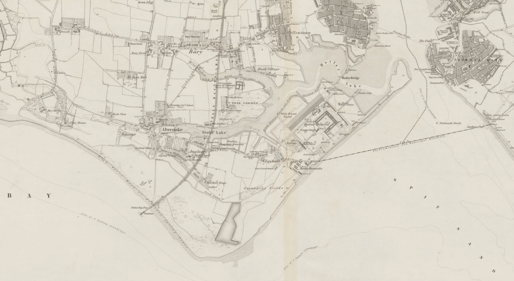

# The Duel at Gosport, 1845


TO DO

```{admonition} TO DO
:class: dropdown

In *Devizes and Wiltshire Gazette*, [Thursday, 22 May 1845](https://www.britishnewspaperarchive.com/image-viewer?issue=BL%2F0000360%2F18450522&page=3&article=012).

A duel was fought last night near Gosport, under the following circumstances:—

The combatants were Mr. Seton, late of the 11th Hussars, and Second Lieutenant H. C. M. Hawkey, of the Royal Marines; the former residing at Queen's terrace, and the latter at King's-terrace, Southsea.

From all we can glean, it appears that at a *soirée* held at the King's rooms, on Southsea-beach, on Monday evening last, Mr. Seaton paid somewhat marked attention to the wife of Lieutenant Hawkey, and was afterwards, in the public rooms, insulted by Mr. Hawkey, who called him a blackguard and a villain, and told him if he would not fight him, he would horsewhip him down the High-street of Portsmouth. A the time these words were used Mr. Seaton was endeavouring to leave the ball-room when Lieutenant Hawkey, who was sitting upon a sofa, rose, and attempted to kick him as he passed. The consequence may be anticipated. A meeting was arranged, and at 5 o'clock last evening the combatants met at Stokes-bay, near Fort Monckton, opposite Ryde, on the Gosport shore. Lieut. G. Rowles, R.N., acted as second to Mr. Seaton; and Lieut. Edward Pym, of the Royal Marines, was second to Lieutenant Hawkey.

The combatants having arrived, the ground (15 paces) was measured, and the principals having been placed, the word was given, when Mr. Seton fired and missed his antagonist. The pistol of Lieutenant Hawkey was placed his hand by his second at half-cock, and consequently Lieutenant Hawkey did not have his shot. Other pistols were, however, supplied to the combatants, the word was again given, and both fired. Mr. Seton immediately fell. Lieutenant Hawkey, without waiting to see the result, of his fire, or going up to his antagonist, immediately fled with his second, saying, "I'm off to France." Mr. Seton was conveyed on a shutter on board a yacht in waiting, and brought about half-past 9 o'clock last night to the Quebec hotel, on the water's edge. Surgical assistance was called in, and it was discovered that Mr. Seton had been wounded dangerously on the right side of the abdomen, the ball passing through and coming out on the left side. Whether the wound is mortal or not, the surgeons (Messrs. Mortimer and Jenkins, of Gosport) have not given opinion, but the patient has had a night of agonizing pain, accompanied by frequent vomitings. Mr. Seton is married, and has four children.

It appeared that the seconds never interfered after the first fire to adjust the cause of quarrel.

Mr. Seton is a very fine-looking man, aged 28; Lieutenant Hawkey is about 26. Mr. Seton has retired from the 11th Hussars about eight years.

Lieutenant Hawkey and his second (Lieut. Pym) are said to have practised about an hour before the duel at Sherwood's Shooting-gallery, in High-street, Portsmouth.
```

TO DO
WIDELY SYNDICATED, ALTHOUGH A SLIGHTLY DIFFERENT ENDINGS would also appear elsewhere, slightly adding to, and even challenging, the details, as in the following example.

```{admonition} TO DO
:class: dropdown

In *Saint James's Chronicle*, [Thursday, 22 May 1845](https://www.britishnewspaperarchive.com/image-viewer?issue=BL%2F0002193%2F18450522&page=4&article=026&).

LAMENTABLE DUEL NEAR GOSPORT.

PORTSMOUTH, WEDNESDAY.

A duel was fought last night, near Gosport; the combatants were ...

... about eight years.

Mr. Hills, chemist, of Broad-street, Portsmouth, sat up with Mr. Seton the whole of last night. The flow of blood was very great. Mrs. Seton has been with her husband whole of the day.

At five o'clock this evening Mr. Seton was pronounced rather easier, although but slight hopes are entertained of his recovery. He was at that time lying in a very dangerous state.

We believe we may take it upon ourselves to offer a decide contradiction to the statement of a morning contemporary, that Lieutenant Hawkey and his second, Lieutenant practised about an hour before the duel at Sherwood's Shooting Gallery, in High-street, Portsmouth.

```


```{admonition} TO DO
:class: dropdown
In *The Era*, [Sunday 01 June 1845](https://britishnewspaperarchive.co.uk/viewer/bl/0000053/18450601/004/0002).

THE LATE DUEL AT GOSPORT.-On inquiry at the Quebec Hotel on Sunday morning, it was said that Mr. Seton's symptoms were improving. The swelling was gradually subsiding, and Mr. Seton had partaken of a little light food. Drs. Stewart, Mortimer, and Jenkins held a consultation at ten o'clock, and pronounced their patient better, but still in imminent danger. Mr. Hawkey, and Lieutenants Rowles and Pym, are still at large, although warrants are out against them. It is notorious that Messrs. Hawkey and Pym were at Southsea at least two days and two nights after the duel, yet no steps were taken to apprehend them. The Colonel Commandant of the Portsmouth division of Royal Marines, in his weekly return to the Admiralty on Saturday, sent up the name of Lieutenants Hawkey and Pym as absent without leave. The following letter respecting this unfortunate affair has been sent by Mrs. Hawkey, with a request fer its publication. So many rumours are going about regarding the cause of quarrel between Mr. Hawkey and Mr. Seton, that it seems almost impossible to arrive at anything like the truth. We, therefore, refrain from saying a single word on the subject, leaving it to the parties interested to tell their own story, and we suppose, as Mr. Seton is nearly out of danger, the truth will soon be ascertained:- 

Mrs. Hawkey presents her compliments to the editor, and begs to inform him that the productions issued by the press at large hitherto on this subject have been conceived in utter ignorance of the facts of the case, and founded on statements set forth by Mr. Seton's friends, and which statements are in many important particulars erroneous, not to say *false*. The first of these productions is the article set forth in the Times of last Thursday, headed "Sanguinary Duel near Gosport", which article is ascribed and believed here to have come from the pen of Mrs. Seton. That whenever Mrs. Hawkey shall have any communication with Mr. Hawkey, or his friend, and to receive from then the authentic matters ot fact, a counter statement will be given, which will, perhaps, alter materially the character of the affair.

"Meanwhile the press and the public at large should, in common justice, suspend their opinion, and not pass a verdict of condemnation on two unfortunate gentlemen, who by their necessary and unavoidable absence are penniless, and not able to defend themselves. The original and real cause of the quarrel is known but to three individuals, excepting by the way to the conscience of Mr. Seton, himself, and these three individuals are Mr. Hawkey, Mr. Pyem, and myself.

3, King's-terrace, Southsea, May 25th, 1843.

Mr. Seton, for the last two days, has remained nearly the same; indeed, it is said the appearance of the wound hsa not been quite so quite so satisfactory; still the surgeons have great hopes of his ultimate recovery. Mr. Pym, Second Lieutenant of Marines, who was the friend of Lieutenant Hawkey, is only 21 years of age; his father is now a Lieutenant commanding the Spider, 6 (schooner), on the coast of South America. These parties, as well as Lieutenant Rowles, the other second, are said to be on the Continent.

```

TO DO

```{admonition} TO DO
:class: dropdown

In *Bedfordshire Mercury*, [Saturday 31 May 1845](https://britishnewspaperarchive.co.uk/viewer/bl/0001289/18450531/005/0001).

THE LATE DUEL AT GOSPORT.

Gosport, May, 29— On inquiry yesterday morning at the Quebec Hotel, it was said that Mr. Seton had passed a good night, but was otherwise in the same state as to danger as yesterday. The effusion of blood had been most copious. The wounds were kept continually bathed. Messrs. Mortimer and Jenkins have resigned their patient into the hands of Dr. Stewart, of Portsmouth, who has now the principal charge of the wounded gentleman. From him (Dr. Stewart) we learn that Mr. Seton is not out of danger; the extent of the injury sustained by the ball cannot at present be accurately ascertained. He still lies at the Quebec Hotel.

The following copy of a note sent by the second of Mr. Seton, to a friend, will throw some light upon one side of the subject:—

"Show this anywhere. "Southsea, Tuesday.  
"My dear Ward—Ere you will receive this you will have heard of the tragical termination to the affair between Mr. Seton and Mr. Hawkey. I write to you as a friend, trusting that you will remember, should you hear the affair spoken of, the excessively bad conduct of your brother officer. It was through him that the meeting was rendered unavoidable. His language was such as no man could stand, for, without the least provocation, and merely because he imagined Mr. Seton to be too particular in his attentions to Mrs. Hawkey, at least that is the only interpretation I can put upon it, being quite in the dark. Mr. Hawkey called Mr. Seton to the side room at the soiree, called him a blackguard and a villain, and said that "if you (Mr. Seton) do not fight me, I will horsewhip you through the town to-morrow," and tried to kick Mr. Seton. I tried to settle the affair quietly, but Mr. Hawkey's conduct was too gross, and we were forced into the duel which has ended so unfortunately. Trusting to you not to hear us run down at the mess,  
"Believe me, very truly yours,  
"H. Ward "Byron G. Rawles."

This is all that has at present come to light, in any authentic shape, to point out the origin of the quarrel.

Neither Mr. Hawkey nor the seconds have been seen or heard of since the night of the duel. The county magistrates have, however, issued their warrant to apprehend them, which is placed in the hands of an active officer. It is believed they are all on the continent.

Mr. Seton has only one child, not four, as was stated. Mr. Hawkey is the first lieutenant, not second lieutenant, in the Royal Marines.—

Further Particulars.—The cause of this lamentable affair, which has excited so much sensation, was Mrs. Hawkey's going to dance twice with Mr. Seton, contrary to her husband's desires. It is true that Mr. Hawkey, and his second, Mr. Pym, practised at Sherwood's shooting gallery before they went out, but they did so solely with a view of trying the pistols, and not, as has been so industriously asserted, to improve their skill in the use of the weapon. The report of the Times' correspondent was full of exaggerations, and evidently proceeded from a party hostile to Mr. Hawkey. By virtue of the recent regulations of duelling in the army and navy, the commissions of Lieutenants Hawkey, Pym and Rowles, are all forfeited. It must be a subject of deep regret, that Lieutenant Hawkey did not select a civilian as a second, instead of a young officer, as he must have been aware that his accepting such an office would have involved his commission. As the insult offered to Mr. Seton by Mr. Hawkey, was so public, it seems surprising, and reflects little credit on the proper authorities, that the parties were not prevented meeting, especially as the duel did not take place until five o'clock the following afternoon. —*Sun*. The *Hampshire Telegraph* of Saturday says— "Mr. Seton was in favourable progress at the period of our going to press."
```

TO DO

```{admonition} TO DO
:class: dropdown
In *Cambridge Independent Press*, [Saturday 31 May 1845](https://britishnewspaperarchive.co.uk/viewer/bl/0000418/18450531/031/0004).

The Late Duel Near Portsmouth.— Mrs. Seton, the lady of the unfortunate gentleman who was wounded, as mentioned in our last, stated in explanation of the duel, that about 11 o’clock on the night of Monday, whilst at a *soiree*, Mr. Seton was most grossly insulted by Mr. Hawkey, who called Mr. Seton a blackguard and a villain, and told him if he would not fight him, be would horsewhip him down the High-street of Portsmouth, at the same time kicking at Mr. Seton as he passed him. This conduct compelled Mr. Seton to seek an explanation but Mr. Hawkey would not give one, and repeated his language; upon which a meeting was resolved upon. At the first fire Mr. Hawkey’s pistol missed, upon which he demanded another shot, which was not opposed by the seconds. At the second fire Mr. Seton fell wounded. He was immediately conveyed on a shutter oo board a yacht near the spot and taken to the Quebec Hotel, where he has since lain in a dangerous state. Mrs. Seton further says that Mr. Hawkey behaved in a most ungentlemanly manner, although he bas been hospitably entertained on several occasions by Mr. Seton. To this statement Mrs. Hawkey gives an unequivocal denial, and states that Mr. Seton had grossly insulted her (Mrs. Hawkey), Mr. Hawkey, and bis profession, which will be fully proved should a trial take place. Mr. Seton is recovering.

```

TO DO




atlas vol xx, 1845 duel between Lieut. Hawkey and Mr. Seaton at Gosport, death of the latter, 326, 341*, 357*, 389* : Mrs. Hawkey's letter of explanation, 405*: 

```{admonition} TO DO
:class: dropdown
In *Atlas*, Saturday 24 May 1845, [p326](https://britishnewspaperarchive.co.uk/viewer/BL/0002115/18450524/022/0006?browse=true).

SANGUINARY DUEL.— A duel was fought on Tuesday night, near Gosport, under the following circumstances:— The combatants were Mr. Seton, late of the 11th Hussars, and Second Lieutenant H. C. M. Hawkey, of the Royal Marines; the former residing at Queen's-terrace, and the latter at King's-terrace, Southsea. It appears that at a *soirée*, held at the King's-rooms, on Southsea-beach, on Monday evening last, Mr. Seton paid somewhat marked attention to the wife of Lieut. Hawkey, and was afterwards, in the public room, most grossly insulted by Mr. Hawkey, who called him a blackguard and a villain, and told him if he would not fight him, he would horsewhip him down the High-street of Portsmouth. At the time these words were used Mr. Seton was endeavouring to leave the ball-room, when Lieutenant Hawkey, who was sitting upon a sofa, rose, and attempted to kick him as he passed. The consequence may be anticipated. A meeting was arranged, and at 5 o'clock on Tuesday evening the combatants met at Stokes-bay, near Fort Monckton, opposite Ryde, on the Gosport shore. Lieutenant Byron G. Rowles, R.N., acted as second to Mr. Seton; and Lieutenant Edward L. Pym, of the Royal Marines, was second to Lieut. Hawkey. The combatants having arrived, the ground (fifteen paces) was measured, and the principals having been placed, the word was given, when Mr. Seton fired and missed his antagonist. The pistol of Lieutenant Hawkey was placed in his hand by his second at half-cock, and consequently Lieutenant Hawkey did not have his shot. Other pistols were, however, supplied to the combatants, the word was again given, and both fired. Mr. Seton immediately fell. Lieutenant Hawkey, without waiting to see the result of his fire, or going up to his antagonist, immediately fled with his second, saying, "I'm off to France." Mr. Seton was conveyed on a shutter on board a yacht in waiting, and brought, about half-past 9 o'clock, to the Quebec Hotel, on the water's edge. Surgical assistance was called in, and it was discovered that Mr. Seton had been wounded dangerously on the right side of the abdomen, the ball passing through and coming out on the left side. Whether the wound is mortal or not, the surgeons (Messrs. Mortimer and Jenkins, of Gosport) have not yet given an opinion, but the patient has had a night of agonising pain, accompanied by frequent vomitings. Mr. Seton is married, and has four children. It appeared that the seconds never interfered after the first fire to adjust the cause of quarrel. Mr. Seton is a very fine-looking man, aged 28; Lieutenant Hawkey is about 26. Mr. Seton has retired from the 11th Hussars about eight years. Lieut. Hawkey and his second (Lieut. Pym) are said to have practised about an hour before the duel at Sherwood's Shooting Gallery, in High-street, Portsmouth. Mr. Hills, chemist, of Bread-street, Portsmouth, sat up with Mr. Seton the whole of Tuesday night. The flow of blood was very great. Mrs. Seton was with her husband the whole of the next day. At five o'clock on Wednesday evening Mr. Seton was pronounced rather easier, although but slight hopes are entertained of his recovery. He was at that time lying in a very dangerous state. Thursday was passed by Mr. Seton much in the same condition. 
```


```{admonition} TO DO
:class: dropdown
In *Morning Post*, [Friday 06 June 1845](http://britishnewspaperarchive.co.uk/viewer/bl/0000174/18450606/019/0005).

THE LATE DUEL AT GOSPORT. INQUEST ON THE BODY OF Mr. SETON.

Portsmouth, Wednesday Evening. — To-day a Jury was impanelled by John William Cooper, Esq., Coroner for the borough of Portsmouth, at the Guildhall, for the purpose of inquiring into the death of James Alexander Seton, late of the 11th Hussars, alleged to have died from wounds received in a duel with Lieutenant Hawkey of the Royal Marines. The body presented a very ghastly appearance, and was in a very decomposed state.

Mr. Joab Bates Wakefield, of Hampstead-road. solicitor, was the first witness examined — I knew the deceased. I married a sister of his and he married a sister of mine. His age is twenty-eight or twenty-nine. He has been lately residing at 4, Queen's-terrace, Southsea. He was of no profession. He was in the army a short time, I think in the 11th Dragoons, but he left it about six years since. The last time I saw him alive was on the 23d ult. He was then at the Quebec Hotel, where the body now lies. He was lying in bed, suffering from a wound. I saw it. It was from the right hip, passing over the lower part of the belly, and terminating in the opposite groin. No operation had then been performed on him.

Henry Hollingsworth was the next witness examined. He said— I am one of the proprietors of the King's Rooms, Southsea. I know the deceased, James Alexander Seton. He was a subscriber to my rooms. He was a constant attendant there. I last saw him in these rooms on the night of Monday, the 19th ult. The usual *soirée* was taking place, which is held there every Monday evening. Dancing was going on. Nothing particular occurred to my knowledge in the rooms that evening. I am not aware that any dispute occurred on that occasion. On the contrary, Mr. Seton and Mr. Hawkey, a lieutenant of the Marines, who was present, on the same occasion, appeared to be very good friends. Mr. Hawkey and Mr. Seton were on very friendly terms before then. They were almost every day at the rooms together in company. I have not seen Mr. Hawkey at the rooms since. I do not know who left the rooms first that night, but to the best of my belief Mr. Seton did, and Mr Hawkey left about five minutes past twelve. He left my room alone, but I believe he went into the cloak room to fetch Mrs. Hawkey and put her into the carriage. There was no one with Mr. Seton when he left the room. Mr. Hawkey asked me if the intended ball was to take place on the Tuesday following, aad said he had passed a vary pleasant evening. It had been a very agreeable *soirée*. There is a card-room on the premises. Several persona who were present that night went into that room. Mr. Seton was among them. It is used as a card-room, but cards were not played that night. There were never more than two or three in the room at a time. Among those parties were Mr. Hawkey and deceased. They were together, and were left by themselves. I cannot speak with any degree of certainty as to the time, but I think they were in that room about one o'clock. They were not interrupted there at all. I remained close to that room all that evening, and while Mr. Seton and Mr. Hawkey were there I do not know that any one joined them. The room is partitioned off from the public room by lath and plaster. The door is a thick solid one. The door was closed at the time. Mr. Seton and Mr. Hawkey were in conversation. They were there ten minutes, and I was present when they left the room. I heard no remark on their leaving. They did not speak to each other. At the time Mr. Seton left the public room, Mr. Hawkey was seated on a sofa near the exit door. Mr. Seton addressed some words to Mr. Hawkey as he left the room, which I could not catch. They were very low. I do not think Mr. Hawkey spoke. Mr. Pym was seated by Mr. Hawkey at that time. I have not seen Mr. Pym since that evening. Mrs. Hawkey was present on that night. I did not see Mrs. Hawkey dancing. My room is managed by stewards, one is appointed for each evening. Lieut. Savage, Adjutant of the Royal Marine Artillery, was the steward for the night of the 19th ult. I did not observe Lieut. Savage in communication with either Mr. Hawkey or Mr. Seton that evening. Mrs. Seton, wife of deceased, was there. I saw Mr. Seton dance several times, but I cannot remember with whom. I am not sure Mrs. Hawkey was not dancing with the deceased. I have seen Mr. Seton frequently dance with Mrs. Hawkey. I did not hear any quarrel whatever with Mr. Hawkey and the deceased that night.

A Juror — I think you stated you observed Mr. Hawkey and deceased go into the same room together. Did you see any hostile bearing?

Witness — No, I did not. They seemed very friendly at that time, and when they returned to the ball room.

By the Coroner — Mr. Rowles was at the *soirée*. He is a subscriber. I have not seen Dr. Rowles since that time. I know Mr. Maugin. He was present at the *soirée*. I have not seen him since. These gentlemen were constant frequenters of the room before. Mr. Rowles went into the side room that evening alone, and remained about ten minutes. I don't remember Mr. Maugin's going in. I don't remember Mr. Pym being there with Mr. Maugin. I don't know when he went in.

Coroner — What grounds had you for believing Mr. Hawkey and Mr. Seton were on friendly terms on leaving the card room?

Witness— On leaving the card room Mr. Hawkey and Mr. Seton went into the ball room together. Mr. Seton crossed the ball room to where Mrs. Hawkey was seated, and brought her to her husband (Mr. Hawkey), who remained near my table. They all entered into con versa: lon together, and appeared to me to be laughing.

Andrew Roger Savage— I hold the rank of lieutenant of the Royal Marine Artillery. I am acting adjutant, and reside in the Gunwharf Barracks, Portsmouth. I was present at the rooms on Monday, the 19th of May last. I do not know upon what terms Mr. Hawkey and Mr. Seton were on that evening. I was not a witness to any quarrel between them. I did not know that they returned from the ball-room. I had communication with Mr. Hawkey that evening. I took Mr. Hawkey out of the ball-room, in consequence of what Mr. Rowles said to us, into the card-room.

Mr. Field objected to the admissibility of this evidence, Mr. Hawkey not being present when Lieutenant Rowles addressed the witness.

Lieutenant Savage— Mr. Hawkey was not present when the communication was made to me by Mr. Rowles. I told Mr. Hawkey that Mr. Rowles had informed me that he (Mr. Hawkey) had called Mr. Seton a blackguard and a scoundrel, and that Mr. Rowles had wished me to give him my advice, and to know whether I would advise him to refer it to his commanding officer, Colonel Jones, or not. I told him I should not mix myself up with his affairs. I was then asked, as I was steward of the rooms, whether I would speak to Mr. Hawkey upon the subject. I said I had no objection as steward of the rooms to do so. Mr. Hawkey, in reply, told me the business could not be arranged there (the rooms); that he had received an injury, not an insult. This is the subject of the communication I had with Mr. Hawkey. I did not see Mr. Hawkey and Mr. Seton afterwards. I left the room soon after my conversation with Mr. Hawkey. I left them all there. I was alone with Mr. Hawkey in the card room. Mr. Hawkey told me that Mr. Seton had told him that he would not meet him, as a light cavalry man could not meet an infantry man. Mr. Hawkey told me this in the card room. I did not know they had been iv the card room together; it must have been afterwards.

By a Juror— Mr. Hawkey wished to state the affair to me, but I did not wish to hear anything about it. I understood him to say that he had received the injury from Mr. Seton.

By the Coroner— I saw Mr. Hawkey next morning, about nine o'clock. He said Mr. Rowles had been to him that morning to arrange a meeting between him and Mr. Seton. He told me he was then going to look for pistols, and then we parted.

The Coroner— Did he make any allusion to seconds?

Witness— He said he had chosen a friend.

Coroner— Did he say who that friend was?

Witness— Mr. Hawkey stated that his friend was Mr. Pym. Ir. marked to him that I was very sorry he had chosen so young and inexperienced a person, when he said he did not know who else to ask.

A Juror— Did you observe Mr. Seton dance with Mrs. Hawkey while at the ball?

Witness— Twice.

A Juror— After the communication you had with Lieut. Hawkey, did you make any report to Colonel Jones, your commanding officer, respecting the affair, and that there was likely to be a breach of the peace?

Witness-No.

Mr. Minchin— Did you see Mr. Hawkey and Mr Seton together after the communication of Mr. Hawkey with you?

Witness— No.

Mr. Jenkins, surgeon, of High-street, Gosport— On Tuesday evening, the 20th of May last, at seven o'clock, a carriage stopped at my door, in which was a messenger, who stated that my attendance was required at Browndown, where a gentleman was bleeding to death. Browndown is about three miles from Gosport, in the parish of Alverstoke. The carriage was a fly belonging to Mr. Rogers, of Stoke. The messenger was riding on the box. I went up stairs immediately, got my instruments, and stepped into the fly. This was, to the best of my recollection, about seven o'clock in the evening. On my road to Browndown, I stopped the carriage in the bay, in consequence of seeing people looking out for me, as I supposed. This was near Dr. Burney's cottage at Stokes Bay. On walking a little distance, I observed a small boat approaching the shore, signalling one in that direction. I went to the boat, and was requested to go on board a small yacht which was lying off. I must have heard some conversation previous to this, for I heard that a duel had taken place. It had become generally known in the neighbourhood. When I went on board the yacht I found Mr. Seton, the deceased, lying on a board on his back. I had known Mr. Seton before. I observed the name "Dream" painted on the yacht; I do not know to whom it belongs. Two gentlemen were on board the yacht with the deceased; I do not know them. I found Mr. Seton in a state of extreme weakness and faintness from loss of blood. The gentlemen on board were endeavouring to keep him up by throwing water in his face. I inquired the nature and situation of the wound, and by what means it had been inflicted. The gentleman told me it was inflicted by a pistol ball. I said to Mr. Seton I was very sorry to see him there, and Mr. Seton told me himself that his wound was from a pistol ball. His pulse was scarcely perceptible; blood was about the board, and running from the deck. They had placed a strong ligature around the hip, binding both extremities of the wound, especially the one on the right thigh. I found the bleeding quite stopped, which is to be attributed to the fastenings. I did not at that time examine the wound. The yacht was very small, and as tha bleeding was stopped, I thought it improper to remove the ligature. I administered a little brandy and water, and the yacht sailed on. The gentlemen on board expressed the greatest desire that the patient should be taken to Haslar. I expressed my doubts regarding his eligibility for admission to that establishment, he not being a naval man. After soma little time, and the patient had somewhat recovered, I went on shore again and drove to Haslar, to see Captain Carter, the superintendent, who at once informed me it was contrary to regulation to receive him, and he could not be admitted. I then returned to the yacht, the boat of which was in waiting near Haslar barracks, having, previous to leaving the shore, directed a servant to call on Dr. Mortimer to meet us at the Quebec hotel, Portsmouth. Having neared the Quebec, the patient was removed in a boat, upon a board on which he was lying, to that tavern. Dr. Mortimer arrived there before the patient was undressed. Immediately the deceased was undressed and placed in a bed, I removed the bandage in the presence of Dr. Mortimer, and examined the wound. I have no doubt the wound was inflicted by a pistol ball. It was immediately above the projection of the bone above the right hip, commencing at the great trochanter. It passed across the lower part of the belly, through the walls of it. It had not entered the cavity of the abdomen. It made its passage out at the left groin, where there was another wound. There was a very considerable degree of swelling, extravasation of fluid in the right groin, about the spermatic cord, and scrotum. The ball entered on the right side. There was no bleeding at that time. Having made the necessary examination, with the assistance of Dr. Mortimer, washed the wounds. Having made him comfortable, we retired to another room for consultation, and then returned and dressed the wounds with simple adhesive plaster. We then prescribed some applications to the bruised part, in a tepid state, and stopped to watch the effects of it. Administered nourishment necessary, and remained until half past ten. I arrived at the Quebec at half-past eight. By the time I left the circulation was sufficiently established to satisfy us that the patient was doing well, and it enabled me to leave him with safety. An intelligent person was then assisting, whom I understood to be : Mr Hill, a druggist. Mr. Hill consented to remain for the purpose of making the applications. I revisited the patient at half-past eleven the same night. The circulation had become re-established with a fair passage by that time, but the skin had not recovered its usual temperature. There was no bleeding from the wound from the time I first saw him to the last, except at the operation performed by Mr. Liston. I visited him daily. The next day (Wednesday) the temperature of the skin was completely restored, and a complete reaction had taken place. I considered the deceased to be in a dangerous state, from the large quantity of blood he had lost previously to my seeing him. I did not see the blood he had lost, only upon the board and his clothes. It was arterial blood, which led me to infer that some artery of importance had been wounded. On Wednesday I met Dr. Stewart on the bridge, and related what had happened. He told me he had been in the habit of attending the family, and I then said, "Since that is the case, you had better attend Mr. Seton, and I and Dr. Mortimer will come over the water once a day. I will mention it to the patient, and let you know the result. I spoke to Mr. Seton that he should have some medical men on this side of the water. The deceased mentioned Mr. Stewart's name as attending the family, and said he had no objection to him. I afterwards visited the patient regularly once a day, in consultation with Dr. Mortimer and Dr. Stewart. The patient went on pretty well, considering his habit of body and the nature of his wounds. He was a very stout man. Still he had much constitutional disturbance, great pain and suffering. Deceased was going on pretty fairly during the whole of the period up to the Tuesday following, the 27th ult., when we discovered a pulsation in the tumour of the groin, which had not existed before that visit. The tumour was formed at first. I considered the case much more important when this pulsation took place. The rupture of an artery at the time of the accident produced it. I consider the tumour to be a false aneurism produced by the communication of an artery with the tumour. We directed ice and the coldest applications that could be applied, and lowered the diet of the patient. It would depend on the progress of the tumour whether the life of the deceased was in danger. The tumour remained nearly stationary. It was rather less at the end of twenty-four hours. The surgeons then conferred as to the means to be adopted to stop the progress of the false tumour, and we arrived at the conclusion that an artery of considerable magnitude had been wounded, and determined in consequence that since it was possible that such a degree of bleeding might come on as might destroy the patient's life at once, it was necessary to cut off the supply of blood to the limb, and to tie a large artery above the seat of the injury, the external iliac artery. The more time that elapsed the greater the probability of sudden change. We explained the state of the case to the patient, and told him that an operation was necessary, and that that operation was a serious one. The patient expressed his willingness to submit to any operation rendered necessary by his position. We then wrote a letter to each of his relatives in town, saying that it would be more satisfactory if a consultation could be held with Sir B. Brodie and Mr. Listen.

By a Juror— Forty-eight hours elapsed from the time pulsation was discovered to the time when the operation was proposed.

By the Coroner— In consequence of the communication to the friends of the deceased in town, Mr. Liston came down on Friday, the 30th, and we immediately held a consultation. Mr. Liston was of opinion that the operation of tying the external iliac artery was absolutely necessary, but that there was no immediate hurry for it. We therefore left the patient, and met again the next morning at eight o'clock, when we re-examined the patient, and were of opinion that the operation was called for, from the probability of the bleeding of the wounded artery becoming so extensive as to destroy life. The patient requested to have a little time, and then the operation was performed by Mr. Liston, in the presence of ourselves and two additional surgeons from London, Messrs. Sampson and Potter. The operation was performed with ordinary skill and care, and with the greatest judgment and nicety; but it was attended with unusual difficulty, on account of the fatness of the patient. He did not lose more than a dessert spoonful of blood. The operation I considered was actually necessary to give the deceased a chance of life. I am not prepared to say that death would have been the inevitable consequence of the original wound if that operation had not been performed. The operation performed by Dr. Liston is a formidable one — a very serious one. After the operation the patient suffered considerable pain in the right leg.

By a Juror— It would have been unnecessary and uncalled for to have tied the artery immediately after the wound. It would have been madness, because if before the pulsation appeared in the tumour it was not known but that the artery might have healed as well as other parts. He suffered a great deal the night after the operation. I considered deceased in danger from the first time of my meeting him. The next morning after the day of the operation he had more constitutional disturbance and thirst, and his cough became more troublesome, and some slight degree of tenderness in the abdomen came on on Sunday night, with frequent vomiting, which induced me to fear peritoneum inflammation had taken place. Those symptoms continued until night, with a very languid circulation, until Monday night, when he expired.

The Foreman— Did you understand from Mr. Seton from whom he received his wound?

Witness— I took care not to know any thing about it. I merely attended as a surgeon.

The Coroner— Did you believe that the operation killed him?

Witness— I am not prepared to answer that question, not having examined him since death.

Mr. Field— Would there not have been a greater probability of the patient's recovery, if the operation had been performed sooner after the pulsation had been discovered?

Witness— Certainly not. It would have been injudicious not to have waited until the patient had recovered the shock of the original wound. Unless any immediate necessity had arisen, it did the patient no injury to wait.

Mr. Field— Was it necessary to wait until the 31st ult.?

Witness— Yes; you might have waited until to-day, supposing the patient was going on well, and no fresh bleeding. The reason for the operation was that the patient was not likely to live or go on safely with an aneurism of the artery in such a place. My opinion is deceased died of peritoneum inflammation following the operation.

Mr. Field— As you did not observe any inflammation connected with the wound made by the pistol bullet, would death, in your opinion, have ensued if the operation had not been performed?

Witness— It is quite impossible to answer that question. I cannot say that death would have ensued if the operation had not been performed.

Mr. Field— Can you at all account for the inflammation having been connected with the operation, as you state that operation was performed in a very skilful manner?

Witness—  It is not unusual for such inflammations to follow such a formidable operation. It is one of the most formidable in surgery.

By the Coroner— The peritoneum was not injured by the pistol ball. Dr. Mortimer and Dr. Stewart were both present at the *post mortem* examination of the body of deceased.

After the examination of Dr. Allen, the inquest was adjourned till the next day (Thursday), at two o'clock.

The Jury sat until half-past nine o'clock.— *Evening Paper.*
```


```{admonition} TO DO
:class: dropdown
In *Morning Post*, [Saturday 07 June 1845](https://britishnewspaperarchive.co.uk/viewer/bl/0000174/18450607/003/0002).

THE LATE DUEL AT GOSPORT.— INQUEST ON THE BODY OF MR. SETON.

Second Day.

PORTSMOUTH, Thursday.— The adjourned inquiry was resumed this day at two o'clock.

Dr. John Mortimer, M.D., was the first witness examined. He said— I did not know the deceased until I saw him wounded. On Tuesday evening, the 20th of May, I received a message from Mr. Jenkins, requesting I would meet him at the Quebec Hotel, to visit a gentleman who had been wounded at Browndown. I proceeded thither immediately, and on my arrival found that he had been landed from a vessel a few minutes before. In consequence of his having been placed on a bier for the more easy transition from the vessel, and it being too wide to admit of his being carried at once into the bedroom, I saw him at the top of the stairs, and found, from the shock given to his whole frame, partly by the influence of the wound he had received, and the supposed bleeding that had superseded, he was in a state of great bodily prostration. It seemed to me to be necessary that I should inquire immediately into the situation of tho wound, its extent, and the injury that might have been inflicted. Before doing so I thought it right to examine where the foreign body had entered. I looked as well to where the foreign body had entered as to where it made its exit, and I assumed, from experience in similar cases, that the ball, or whatever the foreign body was, had passed with great velocity, and without any interruption, entering low down the coverings of the belly, and passing through outwards without any obstruction. It had entered the right side. Having done this, Mr. Jenkins and myself assisted in carrying Mr. Seton and placing him on the bed in which he died. There was no bleeding, but the cellury texture was loaded with blood. The scrotum and organs of generation were equally so, and deeply discoloured. We recommended a little hot brandy and water, and applied blankets to the extremities, which were cold, and he soon revived. At this stage I said to him, "Sir, you must have stood well up to your man or else you must have been shot dead." There was an oblong tumour on the right of the symphasis pubis. We waited a considerable time to watch if there was any recurrence of bleeding, and when the natural warmth of the extremities appeared to be restored, we united in thinking that a tepid application would be comfortable and soothing to him. Finding a Mr. Hills living close by who could bring at once the application we recommended, we desired him to see that it was applied; and if there was no objection on his part, that he would stay and see it repeated during the night. Mr. Jenkins renewed his visit about half-past twelve that night, and found him as we left him — comfortable and recovering gradually from the shock. It was a clear understanding that Mr. Jenkins should see him at that time. On the following morning we met at eleven o'clock at the Quebec Tavern, and found that the patient had passed the night free from other disorders but that uneasiness which is inseparable from such a condition. We left, and met again at eight o'clock. The patient was doing well up to Monday evening, the 26th May. There had been no hemorrhage up to that time. On Tuesday morning following, the 27th, I met Dr. Stewart and Mr. Jenkins at eleven o'clock. My mind, naturally alive to the probability of a recurrence of bleeding from the wound, in consequence of the report of his having lost much blood on the ground, I anxiously surveyed the oblong tumour, when I saw a slight pulsating movement in it. I made the observation, that nearly seven complete days having passed since the reception of the wound, in all probability a vessel had been torn, and that it had communication with that tumour. I did not consider him in a safe state when I first perceived the pulsation.

The Coroner— Did you consider him, before the time of pulsation being discovered, in a state of danger?

TO DO BELOW

Witness— I did not consider him in a state of danger prior to the pulsation, always with reference to the possibility, nay, the probability of a recurrence of bleeding We united in opinion that continued attention should be paid to this pulsatory action, and I was deputed to name, as well to the wife as to the suffering patient, the probable consequence attendant upon this change, knowing from experience that such a pulsation once commenced would increase. On Thursday, the 29th, finding the tumour with a greater impetus pervading the whole, I then for the first time named to the patient, as well as to his wife, that further measures would soon be necessary for his relief and safety. On the same morning there came a letter from Mr. Wakefield, a connection of the deceased, requiring from Dr. Stewart a candid opinion, whether it would add to the consolation of the sufferer if a person were added to us in consultation, from London. Under such circumstances, Dr. Stewart and Mr. Jenkins wrote, unknown to each other, requesting Mr Wakefield would send down Sir B. Brodie or Mr. Liston' Mr. Listou arrived by the nine o'clock train on Friday even- ing, and having, with his usual skill and attention, examined the seats of injury, gave it as his opinion that the safety of the patient required a ligature to be placed on the external iliac artery, in order to intercept the communication between the pulsating tumour and the heart. We coincided iv that opinion.

The Coroner— Do you consider that operation was imperatively required for the safety of the patient?

Witness— Decidedly. Mr. Potter, formerly house surgeon to the London University, and formerly his pupil, was with Mr. Liston; Mr. Sampson also was present, and the operation was performed the following morning by Mr. Liston, who is considered in his profession as a pre-eminent surgeon; and he performed the operation with a simplicity and a confidence in his own tact and judgment which may be equalled but never can be excelled- On the instant the artery was occluded, the pulsation in the tumor ceased. The operation might have been better accomplished if it had been postponed for a few days longer; but, ultimately it was actually necessary to the security of the patient's life.

Coroner— Do you believe the original wound was produced by a pistol bullet?

Witness— By a foreign body. I cannot say positively whether it was a pistol bullet. I have no doubt that it was a gun-shot wound.

Coroner— Was it possible for the deceased to have inflicted such a wound upon himself?

Witness— I examined the aperture by putting my finger in. There was no mark of burning nor powder It had the appearance of a bullet wound, I should conceive that it was impossible that the wound could have been self-inflicted.

The Foreman of the Jury— Did you ascertain from Mr Seton how he received the wound?

Witness— He was the most perfect gentleman I ever met I remarked to him that he must have stood up nobly to his' man from the position of the wound. Mr. Seton said he did He never hinted at the cause of the wound, or how he obtained it, during the whole time I attended him.

The Coroner— Did you consider the first day you examined the wound of the deceased that it was mortal?

Witness— I considered the wound to be one which it was possible might be fatal.

The Coroner— Was the rupture of the artery produced by a foreign body?

Witness— No doubt; and the rupture of that artery made it necessary that ultimately the external iliac should be tied. I attended the *post mortem* examination; it was performed by Dr. James Allen, who had not seen the patient during life.

The Coroner— What is you opinion from the *post mortem* examination, as to the cause of the death of the deceased?

Witness— The cause of the deceased's death was the torn condition of an artery, which had become a false aneurism, and into which, if blood had not been intercepted, an aneurism of any extent might have followed. The operation, admirably performed, was followed by a peritonoal inflammation, which, I believe, caused the patient's death. The operation was necessary to his life. Ultimately he would have died, if the operation had not been performed.

By Mr Field (who attended again on behalf of Lieut. Hawkey and the seconds)— The torn artery was not the immediate cause of death.

Mr. Field asked some questions with regard to the arteries nd their names, saying he had an object in view. The Jury murmured at the course the cross-examination was taking, and the Coroner said he must not have an anatomical examination.

Witness— The artery discovered to be wounded was a vessel emanating from the femoral artery. It was not a small artery. It was quite sufficient to cause death.

In answer to Mr. field's question, whether the deceased would have died if the operation had not taken place, witness declined to answer as to the inevitable result.

Dr. James Stewart, M.D.— I knew the deceased, James Alexander Seton. I visited him on the 21st of May last, at eight o'clock in the evening. He appeared exhausted from loss of blood, caused, I believe, by a ball, or something else. I have no doubt it was a gun-shot wound. I have seen too many during my life to be mistaken. From my professional knowledge, I consider the wound must have been inflicted at a distance of from fifteen to twenty paces, the wound was so clean. The patient went on as well as could be expected until Tuesday, the 27th. On that morning we discovered a pulsating tumour, no doubt caused by the injury of an artery. There was no immediate necessity, from the state of the tumour, for an operation; but it was rendered necesary ultimately. If that tumour had been allowed to proceed, he must have inevitably died, but not for a considerable time. A man had lived eight months with a pulsating tumour. An operation was performed. He lived about sixty hours after the operation. I attended the *post mortem* examination. The primary cause of death was the effect of a ball passing through his body; the secondary cause was, from peritoneal inflammation, which set in after the operation.

Coroner— Did the deceased many `[sic]` any Statement to you?

Dr. Stewart— Yes; the second day, the 22d, he said to me, "Do you think I am in danger?" I said "Yes." He said, "I am aware of my danger, from your opinion as well as that of the other medical gentlemen, and were I to die to-morrow, I know not why I was shot." This was made voluntarily, and he repeated this four days after. I sat up with him on Sunday evening, the 1st of June, and on several occasions during that night he talked with me on this unpleasant subject. He told me he saw Lieutenant Hawkey present the pistol, which did not go off. He stated that he was then standing in his position as the opponent to Mr. Hawkey, somewhere in Stokes Bay. He said he distinctly saw Lieut. Hawkey present the pistol the second time, the ball of which passed through his body. I asked him if he had any doubt in the world. He answered, "Certainly none." This was the morning of the day on which he died, and it was his last statement. He was aware that he was much worse, and in a dying state.

By a Juror— The deceased told me that he had fired also at his opponent, and connected with that said, "Had w* stood at the distance Mr. Hawkey first wished, which was six paces, he would now have been in my place, and I in his."

By a Juror— He also stated that he himself fired twice.

By the Foreman— He made no allusion as to the fairness or unfairness of the affair

Mr. Minahin— Do you know from the state of dang. - that he was in on the morning of the operation, that the sacrament was administered to him by Mr. M'Ghee?

Witness— It was administered to him on Saturday morning before the operation by the Rev. Mr. M'Ohee thi rector of the parish, who remained with the widow during the operation.

Mr. Field— Did the deceased state that Lieut. Hawkey fired at him more than twice?

Witness— No, he said Mr. Hawkey fired once, t*hi pistol did not go off, and once when it did.

Mr. Field— Did he state whether he challenged Mr. Hawkey or Mr. Hawkey him?

Witness— He did not state who gave the challenge.

Foreman of the Jury— Did you hear the deceased . IV i any remonstrance was made by the seconds, after the h r ?? tire ?

Witness— I did not.

The Coroner— Was Mr. Seton in sound health before he had his wound?

Witness— I have attended him professionally: before the accident he was in sound health, and had no organic disease whatever tending to shorten life.

Colonel George Jones, the commandant of the Portsmouth division of the Royal Marines, was next sworn. He said— There is an officer of the name of Hawkey belonging to the Portsmouth division of Royal Marines, he holds the rank of First Lieutenant. There is an officer in in my corps also, named Pym, belonging to the Portsmouth division. Two officers were reported absent from the morning parade on Wednesday, May 21. Their names are Hawkey md Pym. I have not seen them since.

Mrs. Mary Ann Stanmore, of 8, King's terrace, Southsea. I keep a lodging-house. Lieutenant Hawkey lodged at my house. I saw Lieutenant Hawkey last on the Tuesday that the duel was fought. Mr. Hawkey came home from drill on Tuesday at four o'clock in the afternoon, and I led him into the house. He asked where Mrs. Hawkey was. I told him she was gone down to the Rooms, and that she had left word that when he came home he was to ao and meet her. He did not go. He pulled off his sash in the parlour and went up stairs to his dressing-roam. Then he came to me in his bed-room, where I was engaged at that time removing some things, and I remarked to him what i bustle moving made. I said in another month I shall have to remove your things again, as he was going on leave He was then dressed in plain clothes, in a black satin stock with spots in it. When I talked to him of removing the tiling again, he looked very solemnly, and said very seriously "Mrs. Stanmore, you will have to match i»e up the road in less time than that," I did not understand his meaning I went into another bed-room which he used to occupy. He came in, went to the looking-glass and arranged his handkerchief. I said, "You are come, Sir, to *;sh the room good-bye." He said, "Good-bye;" then left the house at twenty minutes past four. He got to the door, and turned round and again said, "Good-bye," and looked at the servant, as if he wanted to say something if the servant had no- been there. I said, "Good-bye, I hope you will meet Mrs. Hawkey." He had not given me notice to leave my lodgings. I have never seen him since. The day before he left he called me into the parlour, and said, "Mr. Stanmore, I want to beg a favour of you." I replied, "What is it, Sir?" He said, "Do you know Captain Seton think this was between ten and eleven, before he went to the gun drill exercise). I said, " Yes, Sir, I have seen hue once." He said, "I expect he will call here; should he do so, you will be kind enough to come in and out of this room frequently, and don't leave Mrs. Hawkey and him long, for he has insulted her very much, and she is ilrcu fully afraid of him." I told him if Captain Seton came, and Mrs. Hawkey rang the bell, I should immediately come to her assistance. He said, "You can manage to come in and out without that (pointing to the piano and sideboard) as if you wanted something." His man servant, William Beerman, came into the room, and our conversation ended only as he left the room he said, "Mrs. Stanmore, bear w bat I have said in mind." When he had dispatched his nai servant, he came again to me. I was then in the garden. I made a remark to him about a plant that I held in my hand. He said, "Mrs. Stanmore, bear what I have said in mind. Take care of my plant Mrs. Hawkey." That was all he said, and he then dressed for drill. Mr. Seton did not come. I have seen him but once in the house; but he has been repeatedly there, as I have heard my servant say. The time he did come I was desired to go to the door by Mrs. Hawkey, and deny her (Mrs. Hawkey) to him (Mr Seton). Mrs. Hawkey saw him passing the window,and she said, "There goes that horrible old Seton." I do not know that Mrs. Hawkey was in the habit of denying herself to morning visitors. I did not answer the door. Mr. and Mrs. Seton were at my house the week before with his child. I know Mr. Pym; he was a frequent visitor. He was there once or twice a day. The last time I saw him at my house was on Monday, the 19th of May, when he dined there and accompanied Mr. and Mrs. Hawkey to the *soiree*. Mr. Pym was in conversation with Mrs. Hawkey that day. A gentleman came in disguise between nine and ten o'clock in the evening of Tuesday the 20th of May. I let him in, and did not know him, but I was inquisitive to know who he was, as Mrs. Hawkey had told me that I was not to let Mr. Seton or any of his family in if they called. I asked his name. He said that did not matter, Mrs. Hawkey would see him.

By the Juror— Mrs. Hawkey told him first that was fought.

By the Coroner— Mrs. Hawkey went away that night with the gentleman. Mrs. Hawkey returned and stayed a week. I was surprised that Mr. Hawkey left so and more surprised that he did not return to dinner that day. I saw no other gentleman that day.

The Coroner— Have you ever seen any pistols in your house, or a pistol case? Witness— No, Sir, I do not believe any were in my house.

Mr. John Lewis Towne, merchant, residing at Elm Grove, Southsea, sworn— The only testimony I can give you is relative to a conversation I heard on Tuesday morning the 20th of May, in Green-road, between Lieut Hawkey and another gentleman; I think it was between ten and eleven o'clock. The other gentleman was a good looking, and of a light complexion. I look particular notice of them, and was about to pass them, when Lieut. Hawkey drew his arm from that of his friend, and with much emphasis said, "I will shoot him as I would a partridge." I heard no name mentioned.

Thomas Hammond Fiske, silversmith, High-street Portsmouth.— I know Lieutenant Hawkey. I last saw him on Monday, the 20th of May, in my shop. He came in and asked for a pair of pistols. It was between the hours of eleven and two. He was alone; he did not ask for any particular description of pistols. I showed him some, and he purchased a pair of pistols in a case, the barrels about nine inches long. They were twisted barrels, patent breeches and hair triggers, usual to pistols of that size. He did not take them away. I locked the case, and gave Mr. Hawkey the key, and a boy in the shop took them down the street to Mr. Sherwood's, where he desired them to be sent. I have not seen the pistols since. When he came in I showed him two or three pairs of pistols, and he selected a pair and said they were the sort he wanted. He then asked me me to lend them to him. I said I could not do that, as they were new ones. He then agreed to give ten guineas for them. He stated that on the previous evening he had made a fool of himself at the rooms; that he had laid a wager with Mr. Pym to shoot with him for 5*l*. He then asked if I had any place where he could try the pistols, and I said I had not. He then said, "I will take them down to Sherwood's." I said, "Sherwood will lend you a pair, perhaps,if you will go down there;" but he replied, "Sherwood had none good enough for him." That is the whole conversation.

It was now half-past six, and the Coroner adjourned the inquest until two o'clock next day, when it is likely to be concluded.

The Coroner issued his warrant for the burial of the body of Mr. Seton last night, and the interment will take place at Fordingbridge, Hants, in the family vault, on Tuesday next. The remains were removed to the late residence of the deceased. Queen's terrace, Southsea, this morning.

Lieut. Hawkey and the seconds have not been heard of up to the present time.—*Evening Paper.*

```

```{admonition} TO DO
:class: dropdown
In *Atlas*, Saturday 31 May 1845, [p341](https://britishnewspaperarchive.co.uk/viewer/BL/0002115/18450531/018/0005?browse=true).

THE LATE DUEL AT GOSPORT.— On Sunday last Mr. Seton's symptoms were improving. The swelling was gradually subsiding, and Mr. Seton had partaken of a little light food. Mr. Hawkey and Lieutenants Rowles and Pym were then at large, although warrants were out against them. It is notorious that Messrs. Hawkey and Pym were at Southsea at least two days and two nights after the duel, yet no steps were taken to apprehend them. The Colonel-Commandant of the Portsmouth division of Royal Marines, in his weekly return to the Admiralty, sent up the names of Lieutenants Hawkey and Pym as absent without leave. In addition to the particulars which had previously appeared, the *Hampshire Advertiser* contains the following:— "We are informed that some improper expressions respecting Mrs. Hawkey were made use of by Mr. Seton at the *soirée*, which were overheard by a gentleman of the navy, and which being communicated to Lieutenant Hawkey caused the language used to be applied to Mr. Seton. We have been favoured with accounts of the cause of quarrel by those alone capable of yielding the desired information, and make them public in justice to all parties. Mrs. Seton states, that about eleven o'clock on the night of Monday, whilst at the *soirée* at the King's Rooms, Mr. Seton was most grossly insulted by Mr. Hawkey, who called Mr. Seton a blackguard and a villain, and told him if he would not fight him, he would horsewhip him down the High-street of Portsmouth, at the same time kicking at Mr. Seton as he passed him. This conduct compelled Mr. Seton to seek an explanation, but Mr. Hawkey would not give one, and repeated his language; upon which a meeting was resolved upon. Mrs. Seton further states that Lieutenant Pym was second to Mr. Hawkey; that at the first fire Mr. Hawkey's pistol missed, upon which he demanded another shot, which wag not opposed by the seconds. At the second fire Mr. Seton fell dangerously wounded. Mrs. Seton further says that Mr. Hawkey behaved in a most ungentlemanly manner, although he has been hospitably entertained on several occasions by Mr. Seton. To this statement Mrs. Hawkey gives an unequivocal denial, and states that Mr. Seton had grossly insulted her (Mrs. Hawkey), Mr. Hawkey, and his profession, which will be fully proved should a trial take place. These are the statements of the two ladies. We give them without comment." On Monday morning Mr. Seton was not so well as was expected. He complained of a numbness from the hip downwards ou one side, and was in great pain. The surgeons, however, did not interpret these symptoms unfavourably, but at their subsequent consultation pronounced their patient to be progressing favourably. On Tuesday Mr. Scion was no better, and still in danger.

```

```{admonition} TO DO
:class: dropdown
In *Morning Post*, [Thursday 05 June 1845](https://britishnewspaperarchive.co.uk/viewer/bl/0000174/18450605/012/0005).

THE LATE DUEL AT GOSPORT.

*Death of Mr. Seton.* — Portsmouth, Tuesday. —Mr Seton, the unfortunate gentleman wounded in the sad affair with Lieutenant Hawkey, of the Royal Marines, has terminated his earthly career. He died last evening at thirty-five minutes past seven. Early in the day it was ascertained by his surgical attendants that he was gradually sinking, and that his wound exhibited the very worst appearance. It was communicated to Mr. Seton that there was no longer hope, and he bore it with resignation. He had some days previous settled his worldly affairs, and made his will. The sacrament had also been administered to him by the Rev. Mr. M'Ghie. In the afternoon of yesterday he took an affectionate and eternal farewell of his near relatives—his mother, his sisters, and his wife, whose deep grief and affliction it was painful to witness. For an hour and upwards before his decease he was free from pain, and talked tranquilly and resignedly to his attendants. Dr. Stewart was with him in his last moments; and Mrs. Seton had been indefatigable in her attentions to her husband ever since he had been lying wounded at the Quebec Hotel. Mr. Seton has frequently talked over the sad affair with his medical attendants, and had to the last persisted that he gave Lieutenant Hawkey no real cause for his very violent conduct, and that he was innocent of any cause for the duel. He (Mr Seton) is also said to have stated that when the parties met on the field, Mr. Hawkey and his second wished to place the men to fire at a very short distance from each other, to which he and his second, Mr. Rowles, objected, and they finally arranged fifteen paces. A *post-mortem *examination of the body took place this day, in presence of a number of the medical men of this neighbourhood, viz., Drs Mortimer Stewart, Jinkins, Rudle, Rolph, Slade, &c. Dr. James Allen, deputy medical inspector of Haslar Hospital, was the operator. It was found that a branch of the femoral artery had been wounded. The report will be read to the Coroner and Jury. — *Evening Paper.*
```

```{admonition} TO DO
:class: dropdown
In *Atlas*, Saturday 07 June 1845, [p357](https://britishnewspaperarchive.co.uk/viewer/BL/0002115/18450607/018/0005?browse=true).

LATE DUEL AT PORTSMOUTH.

Mr. Seton is dead. As a last resource Mr. Liston was called in. He arrived (with two other medical men from London) at Portsmouth on Friday week, when a consultation between the whole of the medical gentlemen took place, and which resulted in a determination to take up the external iliac artery. On Saturday this very difficult operation was performed by Mr. Liston in spite of the great obstacles presented to its performance by the patient's obesity; so serious was the obstacle front this cause, that Mr. Liston, at one moment, doubted whether he would succeed.

The ball fired by Mr. Seton's antagonist, Lieutenant Hawkey, entered at the top of the right thigh of that gentleman, passing over the large vessels, not entering the abdomen, but glancing round to the opposite quarter where it effected its exit, in its progress wounding either the trunk of the femoral artery or a large branch near its origin, causing a hemorrhage very profuse and nearly fatal. On examination by Mr. Liston the wounds had healed up, and they were stated to have done so a day or two after the duel, and that to all appearance the patient was progressing favourably. On Tuesday last, however, dangerous symptoms set in owing to the formation of a kind of tumour in the groin, arising from extravasation. These symptoms were accompanied by a severe fevered pulse and terminating in a circumscribed aneurism, which was found to be increasing rapidly. To prevent this it was deemed necessary that the external iliac artery should be tied, and this Mr. Liston was sent for from London to perform. Immediately after the operation, which is described as an exceedingly painful one, and which Mr. Seton bore with astonishing fortitude, the results exhibited in his condition were a subsidence of the pulsation in the tumour and an abatement of all the unfavourable symptoms. At the conclusion of the operation Mr. Seton shook hands with Mr. Liston, and expressed himself in the following terms:— "Doctor, the moment I get well I will come to London and see you; if, however, on the contrary, it shall be my misfortune to die, I am quite prepared, but, by ———, I am ignorant of the cause of my being called out and shot at in the way I have been."

Some time after the operation, Mr. Seton complained of a disagreeable and painful sensation down the muscles of the thigh, which made him very restless and uneasy, and it was found necessary to administer opiates, which had the effect of procuring him some sleep. He continued under the influence of this medicine on Sunday.

On Monday morning, about two o'clock, a decided change for the worse took place. About five o'clock some castor oil was administered by Dr. Stewart, who had remained with Mr. Seton the whole of the previous night, but the patient afterwards frequently vomited more or less the whole day. It soon became evident that he could not long survive, and about seven o'clock on Sunday evening Mrs. Seton took leave of him, as also did his sister and mother. He appeared quite sensible until within five minutes of his death, which took place without struggle at twenty-five minutes to eight o'clock on Tuesday evening.

On Wednesday an inquest was held on the body, which presented a very ghastly appearance, and was in a very decomposed state. Amongst the witnesses examined was H. Hollingsworth, the proprietor of the rooms in which the *soirées* are held. On the evening when the quarrel took place Mr. Seton and Mr. Hawkey appeared to be very good friends; he did not hear any discussion between, though he knew they had a private conversation together in a withdrawing-room, and that Mr. Seton whispered to Lieutenant Hawkey as he left the public room. There had been a *soirée* and a ball at the rooms since the duel, but they were poorly attended. On the evening in question Mr. Seton and Mr. and Mrs. Hawkey seemed to be particularly friendly. On leaving the card-room Mr. Hawkey and Mr. Seton went into the ball-room together. Mr. Seton crossed the ball-room to where Mrs. Hawkey was seated, and brought her to her husband (Mr. Hawkey), who remained near my table. They all entered into conversation together and appeared to be laughing.

Lieut. Savage, was the next witness examined. He had acted as steward of the *soirée* on the night in question. Having been told that Lieut. Hawkey had called Mr. Seton a blackguard and a scoundrel, he spoke to Lieut. Hawkey, who told him "that the business could not be arranged then, as he had received an injury, not an insult," and that Mr. Seton had refused to meet him, as "light cavalry never meet infantry." He saw Lieut. Hawkey next morning, and expressed his regret that the Lieutenant had selected so young and inexperienced a man as Mr. Pym to act as his friend. Lieut. Hawkey replied, he did not know who else to get. Mr. Seton danced twice with Mrs. Hawkey. Witness did not report the circumstances to Colonel Jones, in order to prevent a breach of the peace.

Three of the medical men who attended Mr. Seton were called.— They proved that from the first his life was in danger; indeed, one of them (Dr. Mortimer) remarked, on the first day, to their patient, "Sir, you must have stood well up to your man, or you would have been shot dead." Gradually, however, Mr. Seton improved until Tuesday, when they discovered the pulsation in the tumour which had been formed in the groin, and at once decided that it was a most dangerous symptom, being, they thought, caused by a false aneurism produced by the communication of an artery with the tumour, which, if allowed to increase, would inevitably produce death. On a consultation, they decided on an operation, and to inform Mr. Seton of his danger. In consequence, the deceased's friends sent Mr. Liston down from London, and he was accompanied by Mr. Sampson and Mr. Potter. These three additional medical men agreed with the three ordinary attendants, and Mr. Liston performed with his usual skill the operation of tying the internal iliac artery. The deceased suffered greatly under it. Peritoneal inflammation ensued, from which the patient died. The medical attendants all agreed in stating that the delay which took place between the discovery of the pulsation and the operation was judicious; that without the operation Mr. Seton must have died, but that he died from the consequences of the operation.

Dr. Allan, of Haslar Hospital, who made the *post mortem* examination, also thought the operation absolutely necessary; but would not say that death must have ensued if the operation had not been performed, as such aneurisms frequently heal themselves.

To two of his ordinary medical attendants Mr. Seton seems to have been silent as to the duel; the third (Dr. Stewart), however, gave the following account of conversations referring to it:—"The deceased, on the second day I saw him, put this question to me—'Do you consider me in a state of danger?' I replied, 'I do.' He (deceased) then made a statement to me relative to the infliction of the wound. Deceased said— 'I am aware of my danger, from your opinion as well as that of the other medical gentlemen, and were I to die to-morrow I know not why I was shot;' and this he repeated several days after. I sat up with deceased on Sunday night, the 1st of June, and on several occasions during that night I conversed with him on this unpleasant affair. He (deceased) told me he saw Lieut. Hawkey present the pistol, which did not go off the first time. He was then standing in his proper position as an opponent, somewhat near Stoke's-bay. He (deceased) distinctly saw Lieut. Hawkey present the pistol the second time, the ball from which pistol went through his (deceased's) body. I asked him if he had any doubt? Deceased said—'Certainly none.' That was on the morning of the day on which he died. He was then aware that he was much worse, and this was his last statement. Deceased said he fired at his opponent, and, connected with that, deceased said—'Had we stood at the distance my opponent wished — namely, six paces, he would now have been in my place, and I in his.' Deceased also stated that he had fired twice. Deceased made no statement as to the fairness or unfairness of the duel".

Mrs. Stansmore, at whose house Lt. Hawkey lodged, examined.— The last she saw of her lodger was on the Tuesday before she beard of the "affair" on Wednesday. The day prior she said he called me into the parlour, and said, "Mrs. Stansmore, I want to beg a favour of you." I replied, "What is it, sir?" He said " Mrs. Stansmore, do you know Captain Seton?" (the deceased gentleman). This was between ten and eleven in the morning. I said "Yes, sir, I have seen him (Captain Seton) once," when he said "I expect he will call here; should he call, you'll be kind enough to come in and out of this room often, and don't leave him and Mrs. Hawkey alone long, for he has insulted her very much, and she is dreadfully afeard of him." That was on the Monday morning. I told him that if Captain Seton came, and Mrs. Hawkey rang the bell, I would instantly come to her assistance. He said, "You can manage to come in and out without that, and (pointing to the piano and sideboard) as if you wanted something there." His man-servant then came into the room, and prevented any more conversation, only as I left the room he said, "Mrs. Stansmore, you'll bear what I have said in mind." When he had despatched his man-servant he came to me again in the garden. I made a remark to him about a plant that I held in my hand. He said, "Mrs. Stansmore, bear in mind what I have said— take care of my plant, Mrs. Hawkey." That was all he said. Mr. Seton did not come. I have seen him but once at the house, when I was desired by Mrs. Hawkey to go to the door and deny her (Mrs. Hawkey) to Mr. Seton. She saw him passing the window, and said, "There goes that horrible old Seton." I was not in the habit of answering the door.

Mr. Towne, a merchant, stated that on Tuesday he overheard Lieutenant Hawkey say to another gentleman, "I will shoot him as I would a partridge." Mr. Fisher proved that Lieutenant Hawkey bought a pair of pistols of him, and asked if he knew where he could try them; witness recommended Sherwood's; that person and his man, George Powell, proved that on Tuesday morning Lieutenant Hawkey practised pistol shooting in his gallery; he was not a good shot; he left after having fired a few shots, then returned and practised again. The last time he fired he said, "That's a d———d good pistol," and marked it with a cross. Neither master nor man ever saw Lieutenant Hawkey at the gallery before. The servants of Lieutenant Hawkey and Lieutenant Pym proved the fact of their masters' going to Gosport on the day of the duel; but the despatch which brought the report to town left the latter's servant still under examination. 

```


```{admonition} TO DO
:class: dropdown
In *Newcastle Journal*, [Saturday 21 June 1845](https://britishnewspaperarchive.co.uk/viewer/bl/0000243/18450621/026/0004).

THE LATE FATAL DUEL AT GOSPORT.

The jury empannelled to inquire into the cause of the death of the late Mr. James Alexander Seton, who was wounded in a duel at Gosport with Lieutenant Henry Hawkey, of the Royal Marines, re-assembled Tuesday last. On the opening the court was speedily thronged with naval, military, and medical gentlemen, the borough and county magistrates, and other highly respectable individuals. Mr. Minchin attended, as before, to watch the proceedings on behalf of the widow and executors of the deceased, and Mr. Field, also, on the part of Lieutenant Hawkey and his friend. After the Coroner had opened the day's proceedings, Mr. Payne, barrister-at-law, Coroner of the city London, addressing the Coroner, said, he took the liberty of stating that he attended there as counsel, and as there could be no parties in the case, he had some difficulty to say whom he represented; but, he would state his object, and that was, to bring before the court, at a proper time, Mrs. Hawkey, to give evidence in this matter. After some conversation it was agreed to take the evidence of that lady first.

Isabella Frances Hawkey, being sworn, deposed, in answer to questions put by Mr. Payne— I am the wife of Mr. Charles Moorehead Hawkey. I knew Mr. Seton. I saw him first about the month of April last, and was introduced to him in the month of May. In introducing me to him (Mr. Seton) my husband said all Mr. seton's acquaintances had left the room, and he wished Mr. Hawkey to introduce me to him. My husband introduced me to him, and danced with Mr. Seton. I afterwards met Mr. and Mrs. Seton in the street, but I did not then know Mrs. Seton. On visiting our house a few nights subsequently, on leaving, Mr. Seton said to me, aside— "I am going into Elm-grove." On the night of the ball Mr. Seton expressed a wish for me to be introduced to Mrs. Seton. I saw Mr. Seton once afterwards, when I went to hear the band play. On a Monday soon after that I went over to Gosport with Mr. Hawkey, and on our return we met Mr. Seton, who crossed over from the club, and said he had called upon me with his friend Mr. Pitt and left a music book; he said he would call again in half an hour. My husband was going out for a ride, but did not go, wishing to be at home when Mr. Seton called. We were under an engagement to visit Mr. Seton's house after that, at eight o'clock in the evening. On that occasion, as I was sitting on a chair near a sofa, Mr. Seton opened a desk (this was between a week and a fortnight after my first introduction him), and showed Mr. Hawkey some dice. Mr. Seton showed me a ring, but I forget what he said in doing so: he stayed and spent the evening there, and in handing me a glass of wine, he (Mr. Seton) asked me if I would be at home the next day at twelve o'clock, when he would bring the book. I was always at home until two o'clock, as until that hour Mr. Hawkey was out at drill. Mr. Seton asked my husband to let me go and see the drill on the next day. My husband consented. On the next day Mr. Seton called at my house, about half-past one or two o'clock, and remained nearly an hour before I went to the drill with him. This was a Thursday, but I cannot tell the date. I made an observation to (Mr. Seton) as to Mrs. Seton's being waiting for us. His reply to that was, he did not care. I never took Mr. Seton's arm. It came on to rain, and I returned instead of going to the drill. They engaged me to dine with them on the following Saturday. On meeting Mr. Seton on the Thursday he offered me his arm; I declined it: when he said, "If one lady takes it, another may. You see my wife is walking with Mr. Maugin." I said my husband did not like it. I know Mr. Tattnall and Mr. Cleaveland. When I met those two gentlemen, Mr. Seton left us, because there was not room for us all to walk together. He said nothing. I cannot recollect seeing Mr. Seton the next morning, but I believe I saw him on the following afternoon at my own house. He said then he had been quizzing, and that he ought not to be turned out, much less by a naval man, by which I imagine he alluded to my speaking to Mr. Tattnall. A day after the last transaction Mr. Seton came to our house, but I did not see him. On the Monday following he came in while Mr. Hawkey was on the Common. He said he knew my husband was out, but did not say what his object was in coming; at that time Mr. Tattnall came in, when Mr. Seton told him he was not wanted there, he might go. They soon after left, and my husband came home. On Sunday (the date of which I cannot tell) Mr. Seton met me going to church, and said something I cannot recollect. On the Tuesday Mr. Seton asked me if my husband was going to Somerton races? I said "Yes." He said he intended to go, but if Mr. Hawkey went, he should not go; he had a great deal to say to me, and he would come that day. The races were to have taken place on the Thursday; it rained, and my husband did not go out. Mr. Pym came and lunched with us on the day of the races. Mr. Seton came in whilst my husband and Mr. Pym were in the room. The servant did not announce him before he entered. At that time Mr. Hawkey and Mr. Pym were sitting behind the door. I don't think Mr. Seton saw them when he entered. When Mr. Seton perceived them he started back, which circumstance I think attracted my husband's and Mr. Pym's notice,. I saw Seton on the following Monday at the *soirée* (at the King's Rooms), where he presented me with a bouquet of beautiful flowers, for which my husband thanked him. On that evening nothing particular occurred. On the following Monday Mr. Hawkey was at drill, when Mr. Seton called, and said, "It's no use humbugging with you any longer—do you mean to give me an opportunity or not?" He said he knew Mr. Hawkey to be s quarrelsome fellow, and said he knew he should have it out with Mr. Hawkey in the end, and added he should not go out on the common for nothing. He said, if he gained his point, he would not mind it. I cannot tell the date. A knock at the door occurred at the time Mr. Seton was talking to me, when he exclaimed, "Good God, here's Hawkey!" He ran to the table for his hat, and said, "Can't you let me out?" It was not Mr. Hawkey who came in at that time, but Mr. Pym. On that afternoon my husband asked me if Mr. Seton had annoyed me, seeing me depressed. On the next occasion of my seeing Mr. Seton he offered me something in his hand which I could not see, and said, if I did not accept what he offered me, he should not have any tie upon me. He said. "Perhaps you do not think it sufficiently valuable." I told him not to insult me any more by such offers. He mentioned the name of Lord Cardigan, and said, "Place yourself in the position of (some one whom I do not know) and the Colonel of our regiment;" and added, that he had given that person £1000 worth of jewellery, and further said, "Would that be any inducement to you?" I said "No." Then he said, "If those are your ideas, a man has no chance." I remonstrated with him about his being a married man, when he said, "I don't care about her, nor she about me; we both please ourselves." I forget whether I did not mention this to my husband when he came in. I told Mr. Pym. I told Mr. Seton if he persisted in that conduct, I should go home (meaning my mother's), at Rochester. He (Mr. Seton) said, "I wish you would; it's all on my road to Maidstone." I knew my husband was very "tenacious," and therefore I did not tell him. I afterwards saw Mr. Seton at my house, when Mrs. Seton was gone to London. He told me he had been seeing Mrs. Seton off. There was a *soirée* on that evening to which I went. Mr. Seton was there, and said to me he was very unhappy, and if nothing else would make me like him, sympathy ought. I saw Mr. Seton the day but one following the *soirée*, when he called at my house with Mrs. Seton. I recollect going to the rooms with Mr. and Mrs. Seton. Mr. Hawkey and Mr. Pym joined us there, when my husband was much displeased at seeing me with them. I did not know husband was acquainted with Mr. Seton's attentions to me until the Sunday preceding the day on which the duel was fought, when my husband said he had something to say to me. I went to Anglesey with my husband in the afternoon (Sunday), when he told me he was very angry at my not telling him what I told Mr Pym, and said if I would tell him all, he would not take any notice of it. I consequently told him several things about Mr. Seton's conduct towards me. He did not say much to me, and did not seem at all pleased, and went to Mr. Pym. On the day following (Monday, the 19th of May), I met Mr. Seton, when I was walking with my husband; I bowed to him, and he offered to speak to me, but my husband would not let him. I afterwards saw Mr. Seton at the *soirée* on the evening of the same day. A week before that I had promised to dance with Mr. Seton, and on the above evening Mr. Seton wished me to fulfil my promise. I said I could not. He said, "Then it must be Hawkey's fault," and he should seek an explanation. I replied, he (my husband) would give him one. I went afterwards to my husband, and asked him what I should do; when he said I might dance a quadrille. I did, accordingly, dance one quadrille with Mr. Seton. He asked me why I passed without noticing Mrs. Seton. and said, "If you don't know her, you don't know me." On that occasion, Mr. Seton said, "Whatever your husband does to me, I shall not go out with him; it's quite impossible a light cavalry man can ever mix himself with an infantry man." After dancing that quadrille with Mr. Seton, I sat down, when my husband came and wished to sit down by me; but Mr. Seton would not move, when my husband said to him "I should like to have a few private words with you," when Mr. Seton said, "An explanation I have long wished." They went into a private room, and on his coming out, Mr. Seton asked me to take his arm, and said "For God's sake settle this matter, or there will be such an exposure." I went away with Mr. Pym. I recollect being present at a review of the 59th Regiment, when Colonel Jones offered me his arm. Mr. Seton came up and said I was under his protection. I said "It's such thing." I then went home with Mr. Pym, a friend of my husband. On the occasion of mentioning about the £1,000 worth of jewels, Mr. Seton never took hold of me. He said he should like to drive me in a cab in London, and asked me if there was any chance of such a thing. My object in not telling my husband was because I was afraid of the consequences. When my husband gave me permission to dance with Mr. Seton it was distinctly understood I was not to dance a polka, only a quadrille.

Mr. Ellis, Hope Cottage, Gosport, stated that Lieut. Hawkey and Lieut. Pym came to his residence on the evening of the day on which the duel had been fought, when they told him an "unfortunate affair" had occurred, and that Mr. Seton was wounded in Stokes Bay, and requested he would give any assistance hr could to the wounded gentleman. They remained till twelve o'clock; they then went to their lodgings, but returned the following morning, and took breakfast; after which they again left, and witness had not seen them since. George Mackett, a labourer, John Daniells, a superannuated carpenter of the Royal Navy, and Mr. Hills, the chemist, who attended Mr. Seton, were next examined. After which the Coroner summed up, pointing out the malice which he stated was shown in the pistol practice, and the jury retired to consider their verdict. At the expiration of half hour they returned, when the foreman, Mr. Grant, read the following:—

"We find that the immediate cause of Seton's death was the result of a surgical operation, rendered imperatively necessary by the imminent danger in which he was placed by the infliction of a gun-shot wound, which he received on the 20th of May last, in a duel with Lieutenant Henry Charles Moorehead Hawkey, of the Royal Marines; we therefore find the said Lieutenant Hawkey and Edward Laws Pym, of the Royal Marines, as well as all the parties concerned in the said duel GUILTY OF WILFUL MURDER. The Jury should further express their unanimous conviction that everything which the best professional skill, the greatest attention, and the utmost kindness could suggest, was rendered to Mr. Seton by his respective medical attendants."

The inquest was then adjourned until the following day, to arrange the necessary forms for the completion of the inquest. The jury were unanimous in their verdict.
```

After giving a similar report of the inquest, the *Atlas* provided further commentary takin from the *Times* regarding the attempt to save Seton's life.

```{admonition} TO DO
:class: dropdown

In *Atlas*, Saturday 21 June 1845, [p389](https://britishnewspaperarchive.co.uk/viewer/BL/0002115/18450621/018/0005?).

LATE DUEL AT GOSPORT.

...

The *Times* is dissatisfied with that part of the verdict which justifies the surgical treatment. The operation, it contends, "was premature; if not fur twelve months, or for one month, or even fur a single week, still for a day at least, its performance might have been safely postponed. Why was not that day, at any rate, devoted to the employment of some less dangerous remedial treatment? The tumour, as was stated in evidence, had already in some measure yielded to the application of ice. Why was not this persevered in? Why was not pressure, which is now so constantly made use of in the treatment of aneurism, resorted to in preference to the scalpel? Not only did the life of Mr. Seton, but the lives of his antagonist and the other parties implicated possibly may, depend on the questions whether or not the 'pure surgery' treatment of the deceased was right, and whether or not, if he had been treated according to the rules of medical surgery,' he might not have survived till at least a year and a day after the duel. Had he done so, Lieut. Hawkey would, as the law stands, have been safe. As he did not, the survivors, if the coroner be right in his law, are now liable to be tried for their lives, and if found guilty to be executed."

The *Times* then skilfully applies its objection to the new medical and surgery bill. "Dexterity with the knife," it remarks, "the coolness and skill required for cutting a hole in a man's body six inches long and five inches deep, and tying at the bottom of that hole a piece of silk round a blood vessel of the size of a quill, to which the knife has penetrated in the dark with such precision as to lay it bare without indicting on it the slightest injury, is without dispute a triumph of pure surgery, which the most expert might envy; but unless such a piece of carving, and its dreadful anguish, were absolutely essential for the saving of life or limb, it is one of which a butcher might be ashamed. As the evidence now stands, we are left almost in the dark as to the reasons why the operation was performed at the time when it took place, and *why nothing else was tried*. Possibly the fact that a first-rate London operator, with two assistants, had travelled nearly 100 miles to the scene of action, and could not spare the time for watching the slow progress of the case, may not have been without its influence on the decision which was come to. That, when an operation of the most difficult nature is indisputably the best thing for a patient, nothing could be more judicious than to have it performed by Mr. Liston, may be candidly admitted; but, without detracting in the least degree from that gentleman's just fame as the most skilful of living operators. we may fairly say that the present uncertainty as to the reasons which induced him to take the pure surgical course in preference to that which medical surgery would have pointed out requires explanation; and that, so far as an opinion can now be formed, if Mr. Seton had been left in the hands of those general practitioners whose surgery the council of the College of Surgeons affect to regard with contempt, he might still have been living. The wider the range of acquaintance with his profession which a medical man is required to have, the less will be the risk to his patients of deciding incorrectly as to the treatment which is best for them, and hence the vast importance of requiring the education of the surgeon to include far more than mere surgery, and to be put on a totally different footing from that which the council has adopted for the avowed object of fostering' pure surgeons." 
```


```{admonition} TO DO
:class: dropdown
In *Atlas*, Saturday 28 June 1845, [p405](https://britishnewspaperarchive.co.uk/viewer/BL/0002115/18450628/021/0005?browse=true).

LATE DUEL AT GOSPORT.— Mrs. Hawkey has addressed a letter to the papers, in which she states:— "1. That the challenge emanated from Mr. Seton (and not from Mr. Hawkey), in consequence of the latter having, while the former was quitting the ball-room on the Monday night preceding, administered a kick (or something very like one) to him, for having told him (Mr. Hawkey) 'That a light cavalry man could never give satisfaction, or mix himself up with an infantry one;' or words to that effect. 2. That the challenge was brought to Mr. Hawkey at half-past seven the following morning by Lieutenant Rowles, Royal Navy, who on the following evening addressed at letter on the subject to Lieut. Ward, Royal Marines, which was speedily got hold of and sent to the press by a certain attending medical man of Mr. Seton's party, and has been already before the public. This production Mrs. Hawkey leaves to the opinion and judgment of every candid and impartial reader. 3. That on the ground Mr. Seton's antagonist received, but did not return that gentleman's first fire. Notwithstanding which, a second pistol was put into the hands of both principals, and discharged without any effort being made to arrest the affair. The effect of the second fire was the wound to Mr. Seton, which, after the lapse of a fortnight, and a display of chirurgical skill on the part of the attendant medical men (which by some professionals of the faculty is pronounced as good, and by many as bad), followed by an operation the most formidable in surgery,' by one of the most eminent operators in London' terminated fatally on the instant. Mrs. Hawkey leaves it to those gentlemen who are conversant in such affairs to determine how far the second of Mr. Setup was, by the understood laws of duelling, justified in permitting his friend to deliver a second shot after his first shot had been received and not returned by his antagonist, who thereby received two shots but delivered only one. According to the opinions of many officers with whom she has conversed on the paint, it seems certain that Mr. Seton's second, instead of allowing the second shot, ought to have immediately withdrawn his friend from the ground, and that by his failing to do so he was guilty of a dereliction of his duty as a second, which has brought upon him the awful responsibility of having been himself, in truth, the cause of the fatal termination of the duel. The coroner's inquest having returned a verdict of 'wilful murder' against Lieutenants Hawkey and Pym (by which verdict Mr. Rowles is left for the moment untouched), the case will of course, go to trial before a higher tribunal. Mrs. Hawkey will, therefore, abstain from commenting on the malignant manner in which these two unfortunate gentlemen have been pursued in their absence by certain persons of this place, and on the various means (due and undue) which have been resorted to for the object of procuring witnesses for their prosecution—matters which will be hereafter commented on by abler and more competent pens than hers, and at a proper time and in the proper place be exposed to public animadversion by able counsel. She will merely say that, in case of an 'affair of honour,' she believes such proceedings are without the authority of example or precedent of any description." 
 ```


```{admonition} TO DO
:class: dropdown
In *Glasgow Chronicle*, [Friday 04 July 1845](https://britishnewspaperarchive.co.uk/viewer/bl/0003088/18450704/016/0001).

THE LATE DUEL. Mrs Hawkey has addressed a letter to the Morning Post on the subject of the late fatal duel at Portsmouth, in which her husband shot Mr Seton. Of course, her object is to absolve Mr Hawkey from as much blame as possible. She says that the evidence at the inquest was very one-sided; and urges facts in her husband's favour. The challenge emanated from Mr Seton (and not from Mr Hawkey), in consequence of the latter while the former was quitting the ball-room on the Monday night preceding, administered a kick (or something very like one) to him, for having told him (Mr Hawkey) 'that a light cavalry man could never give satisfaction, or mix himself up with an infantry one,' or words to that effect." The challenge was brought to Mr Hawkey by Lieut. Bowles; who on the same evening published a letter injurious to Hawkey. "Mr Seton's antagonist received but did not return that gentleman's first fire. Notwithstanding which, a second pistol was put into the hands of both principals, and discharged, without any effort being made to arrest the affair." "Mrs. Hawkey leaves it to those gentleman who are conversant with such affairs to determine how far the second of Mr Seton was, by the understood laws of duelling, justified in permitting his friend to deliver a second shot after his first shot had been received and not returned by his antagonist, who thereby received two shots but delivered only one." Mrs Hawkey then enlarges on the "malignant manner in which her husband and his second have been pursued in their absence by certain persons" at Portsmouth; both "due and undue" means having been employed to procure witnesses for the prosecution.

```

```{admonition} TO DO
:class: dropdown

In *Morning Post*, [Monday 23 June 1845](https://britishnewspaperarchive.co.uk/viewer/bl/0000174/18450623/009/0004).

THE LATE DUEL AT GOSPORT.

The following note has been addressed to us by Mrs. Hawkey; and we willingly print it, because it appears to us very essential that all the particulars of the late unfortunate affair should be before the public:—

Mrs Hawkey presents her compliments to the editor of the *Morning Post*, and in reference to a recent promise of hers to him of returning to this subject at a fitting opportunity, she now, in performance thereof, begs, in the first place, to refer him to her statement, which, by the advice and direction of her counsel in the law, she made on Tuesday last before the Coroner's inquest, wherein the great original causes of the melancholy occurrence are put forth upon oath, with the most strict impartiality.

In the second place, and with respect to the circumstances that attended the duel (of which the evidence before the inquest gives only a very partial and imperfect account, derived entirely from the adverse party), Mrs. Hawkey begs further to inform the editor on the most competent authority:—

1 That the challenge emanated from Mr. Seton (and not from Mr Hawke ), in consequence of the latter having, while the former was quitting the ball-room on the Monday night preceding, administered a kick (or something very like one) to him, for having told him (Mr. Hawkey) "That a light cavalry man could never give satisfaction, or mix himself up with a infantry one;" or words to that effect.

2 That the challenge was brought to Mr. Hawkey at half-past seven the following morning by Lieut. Rowles, Royal Navy, who on the following evening addressed a letter on the subject to Lieut. Ward, Royal Marines, which was speedily got hold of and sent to the press by a certain attending medical man of Mr. Seton's party, and has been already before the public. This production Mrs. Hawkey leaves to the opinion and judgment of every candid and impartial reader.

3 That on the ground Mr. Seton's antagonist *received, but did not return* that gentleman's first fire. Notwithstanding which a second pistol was put into the hands of both principals, and discharged, without any effort being made to arrest the affair; the effect of the second fire was the wound to Mr Seton, which, after the lapse of a fortnight, and a display of chirurgical skill on the part of the attending medical men (which by some professionals of the faculty is pronounced as *good* and by many *bad*), followed hy an operation "the most formidable in surgery," by one of the most eminent operators in London, terminated fatally on the 2d instant.

Mrs. Hawkey leaves it to those gentlemen who are conversant ins such affairs to determine how far the second of Mr Seton was, by the understood laws of duelling, justified in permitting his friend to deliver a second shot after his first shot had been received and not returned by his antagonist, *who thereby* received two shots but delivered only one. According to the opinions of many officers with whom she has conversed on the point, it seems certain that Mr. Seton's second, instead of allowing the second shot, ought to have immediately withdrawn his friend from the ground; and that by his failing to do so, he was guilty of a dereliction of his duty as a second, which has brought upon him the awful responsibility of having been himself, in truth, the cause of the fatal termination of the duel.

The Coroner's inquest having returned a verdict of "Wilful murder" against Lieutenants Hawkey and Pym. (by which verdict Mr. Rowles is left for the moment untouched), the case will of course go to trial before a higher tribunal. Mrs Hawkey will, therefore, abstain from commenting on the malignant manner in which these two unfortunate gentlemen have been pursued in their absence by certain persons of this place, and on the various means (*due* and *undue*), which have been resorted to for the object of procuring witnesses for their prosecution— matters which will be hereafter commented on by abler and more competent pens than hers, and at a proper time and in the proper place be exposed to public animadversion by able counsel. She will merely say that, in a case of an "affair of honour," she believes such proceedings are without the authority of example or precedent of any description.

3, King's-terrace, Southsea, June 19, 1845. 

```


```{admonition} TO DO
:class: dropdown

In *Taunton Courier and Western Advertiser*, [Wednesday 02 July 1845](https://britishnewspaperarchive.co.uk/viewer/bl/0000348/18450702/021/0006).

CONTEMPORARY PRESS. 

EXCLUSION OF EVIDENCE.

(From The Examiner.)

The propriety of receiving Mrs. Hawkey's evidence as to the causes of Mr. Seton's death has been the subject of much discussion. We concur in the view taken by the *Morning Chronicle*.

"No doubt Mrs. Hawkey's evidence could not be received on the trial of her husband. But there can be as little doubt that as Mr. Hawkey was not a party before the coroner's inquest, there was no rule of law to prevent his wife's evidence being received for the purpose of exculpating him. There being no such rule, we cannot conceive how the coroner could have rejected any evidence tending to throw any light on the transaction. Mrs. Hawkey's evidence might have made all the difference as to whether the verdict of the inquest should send her husband to trial for murder or not.

"It is objected that the reception of this evidence before the coroner's inquest gives circulation to story which cannot hereafter be received in evidence, and thus will tend to bias the minds of the jury before whom the prisoner is to be tried. *The question then arises, whether it is for the interests of substantial justice that the story of Mrs. Hawkey should be suppressed; whether her husband ought io be deprived of the benefit of it by any rule of law; and whether when such rule of law interferes prevent a Jury from knowing the material truth of a case, it is not better that their minds should be biassed by having that truth irregularly brought them?* And without expressing an opinion against the general policy of that rule of law which prevents husband and wife from appearing witnesses for or against each other, we feel very confident that no one can look at the circumstances of this case without agreeing that a monstrous injustice will be inflicted by depriving Mr. Hawkey of the benefit of his wife's evidence.

"No doubt there is something to be said for the rule of our law, which, for the peace of families, prevents husband and wife from being witnesses for or against each other. But it is carried a preposterous extent. What can be more monstrous than the cases of Smithies and of Bartlett, reported in our law books, within the last ten or twelve years, where part of the evidence against the prisoners was some accusation, apparently made by the wife against her husband? Evidence was given of these hasty accusations as having been uttered in the presence of the respective prisoners. The prisoner in one case wanted to call his wife to explain the erroneous impression under which she had made the charge. But the wife's evidence could not be received! Her rash words were adduced as evidence to hang her husband, but her deliberate explanation was not to be heard in his exculpation!"

We have always been opposed to any exclusion of evidence, and have had the satisfaction of seeing the bad rule abrogated in many cases. Admit all evidence, and leave it to the judge and jury to decide on its credibility. The evidences excluded are justly liable to suspicion they may be supposed to be prejudiced or influenced, and if received the jury would therefore be prepared to distrust them, and not to credit them unless they should carry marks of truth strong enough to bear down the adverse prepossession.

It is impossible to suppose that all the evidence excluded by law would be bad if admitted; and if some would be good, why are truth and justice to lose the benefit of it?

The law puts juries absurdly in leading strings as to certain evidence. It will not allow them to hear testimony because it is so likely to be prejudiced or influenced. But if the jury be incompetent to judge of evidence so obnoxious to suspicion, and so likely to be bad, can it be fit to judge of other evidence less liable to suspicion, and therefore more likely to impose. The more suspicious the evidence may be the more safely it may be left to the acumen of the jury. They are supposed qualified to decide upon the nicest shades of evidence where they have clues to the influences that may have shaped or coloured it; but they are treated as likely to be misled exactly where the alarm to suspicion is given by the known interests of the witness. There are things which cease to be dangerous because the danger is so obvious; people don't walk over cliffs though they tumble down unfastened coal-holes. The path of evidence being as beset with traps as the bridge the vision of Mirza, the law kindly and carefully builds up lofty parapet on each side, where none but fool could walk into danger, so that the traveller may not even see the water into which there are so many chances of his tumbling by the secret and hidden traps.

It is against our rule to notice evidence pending legal proceedings, but the testimony of Mrs. Hawkey has been so generally discussed that would now be a mere prudery to abstain from remark on it, especially as the point to which we would direct attention does not involve the question criminally at issue.

Mrs. Hawkey's account of the language and conduct of Mr. Seton may be true or it may be false; but if true, it presents a curious instance of the vice of example, for in the impertinent airs and insolences attributed to him we trace much of the pattern he had before him in the 11th Hussars, which he last served.

Here are specimens— 

"He mentioned the name of Lord Cardigan, and said 'Place yourself in the position of (some one whom I do not know) and the Colonel of our regiment;' and added, that he had given that person 1,000*l.* worth of jewellery, and further said, 'Would that be any inducement to you?' I said, 'No.' Then he said, 'If those are your ideas, a man has no chance.'"

Mr. Seton thought it beneath an 11th Hussar to fight an officer of Marines unless it was made worth while by the seduction of his wife.

"Seton called, and said, 'It's no use humbugging with you any longer—do you mean to give me an opportunity or not?' He said he knew Mr. Hawkey to be a quarrelsome fellow, and said he knew he should have to go out with Mr. Hawkey in the end, and added he should not go out on the Common for nothing. He said, *if he gained his point he would not mind it*. I cannot tell the date. A knock at the door occurred at the time Mr. Seton was talking to me, when he exclaimed, 'Good God, here's Hawkey!' He ran to the table for his hat, and said, 'Can't you let me out?'"

On another occasion,

"Seton said, 'Whatever your husband does to me, I shall not go out with him; it's quite impossible a light cavalry man can ever mix himself up with an infantry man.'"

The utterance of the same impertinence (in the true "black-bottle" spirit) was deposed to on the inquest by another witness.

Yet upon another occasion, according to Mrs. Hawkey's evidence (on the trustworthiness of which, we repeat we can give opinion), Mr. Seton held out the threat to the wife that he would demand an explanation of her husband, she refused to dance with him!—after his coarse, licentious solicitations. Yet at other times he appears, by the same evidence, to have been by no means eager for a quarrel.

"After dancing a quadrille with Mr. Seton, I sat down, when my husband came and wished to sit down bv me: but Mr. Seton would not move, when my husband said to him 'I should like to have few private words with you,' when Mr Seton said, 'An explanation I have long wished.' They went into a private room, and on his coming out, Mr Seton asked me to take his arm, and said, *'For God sake settle this matter, or there will be such an exposure.'* I went away with Mr. Pym. I recollect being present at a review of the 59th Regiment, when Col. Jones offered me his arm. Mr Seton came up and said I was under his protection. I said, 'It's no such thing.' I then went home with Mr. Pym, a friend of my husband. On the occasion of mentioning about the 1,000*l.* worth of jewels, Mr. Seton never took hold of me. He said he should like to drive in a cab in London, and asked me if there was any chance of such a thing."

To what grave events the airs and impertinences tend which are treated so lightly when exhibited about trifles, black battles or such nonsenses. A habit of insolence and presumption is produced which ends in such catastrophe as this. In the same instance, too, we may also trace the effect of moral example in another respect. 

```

```{admonition} TO DO
:class: dropdown

In *Morning Post*, [Friday 11 July 1845](https://britishnewspaperarchive.co.uk/viewer/bl/0000174/18450711/006/0004).

THE LATE FATAL DUEL AT GOSPORT.

(From our Correspondent.)

WINCHESTER, Thursday.

A report has been in circulation for some days past that Lieutenants Hawkey and Pym would surrender themselves for trial at the assizes for this county, which commenced here this day. This report, as might naturally be expected, has created some considerable degree of interest in this locality, from the extraordinary nature of the case, and from the peculiar circumstances connected with the duel. Whatever foundation there might have been for this report at the time it was first put in circulation, and whatever intention these gentlemen might have had of surrendering themselves to take their trials at the present assizes, we can state upon competent authority that there is no probability that such will be the case just yet. The unfortunate event is of so recent and so fresh a date that a considerable portion of the public are not suitably prepared to view the case in the calm and dispassionate manner which it requires, and which is essential to the furtherance of justice to all parties, and especially to the accused, so that a prosecution may not become a persecution. If Lieutenants Hawkey and Pym had it in contemplation to surrender, and that they had such intention may be inferred from the fact that Mr. Cockburn has been retained on their behalf, they have postponed doing so, at all events until the next assizes. In this no doubt they have acted wisely; for there are many persons who at first were disposed to condemn these gentlemen, and however much opposed to the system of duelling, have since taken a more favourable view of the case, and find so many extenuating circumstances daily becoming known, that if they cannot altogether acquit, they at least do not condemn them. The interval between the present and the next assizes will in all probability add considerably to this list; for there are abundant explanatory circumstances, which, as they transpire, will tend to remove the erroneous impressions on various points, which some portion of the public have entertained ; and as facts are made apparent, even the most strenuous anti-duellist will be disposed to view this as a case in which, if anything can justify duelling at all, there was ample provocation here to do so. In fact, no greater provocation could be given to any man, where the law does not give to the injured party the slightest redress. If both the principals engaged in this unfortunate affair had been officers, then there might have been an appeal to the officer in command, under the recent orders from the Admiralty and the Horse Guards. But in this case only Lieutenant Hawkey was in the service, Mr. Seton having retired from it some years ago; consequently no such appeal could be made; and it is the general opinion amongst those who are best acquainted with the case, that Lieut. Hawkey had no either alternative than that which he adopted, for he must have forfeited his position in society, and consequently given up his commission, if he had not vindicated his own honour, and resented the insult offered to his wife.

It is understood that a consultation has been held between Sir Thomas Wilde and Mr. Cockburn, with respect to the circumstances of the case, tho result of which was, the expression of an opinion favourable to the accused parties; and it is thought, that when these gentlemen do surrender to take their trials, facts which will be adduced will fully vindicate them in public estimation at least, if not in the strict eye of the law.

Mr. Crowder has been retained on the part of Lieutenant Bowles, the second of Mr. Seton; but, from what can be gathered, that gentleman has no intention of surrendering to take his trial at present. 

```

```{admonition} TO DO
:class: dropdown
In *Leicester Journal*, [Friday 11 July 1845](https://britishnewspaperarchive.co.uk/viewer/bl/0000205/18450711/012/0002).

Independent of the prosecution of Lieutenants Hawkey and Pym, on the part of the Crown, by Mr. John Howard, and clerk of the peace of Portsmouth, for the late fatal duel at Gosport, those gentlemen will also be prosecuted by Mr. James Hoskins, attorney, of Gosport, on behalf of the widow and executors of the late Mr. Seton. The trial is not expected to come on before Monday next. The friends of Lieutenants Hawkey and Pym are confident of a favorable result to the trial. 
```


```{admonition} TO DO
:class: dropdown
In *Dorset County Chronicle*, [Thursday 17 July 1845](https://britishnewspaperarchive.co.uk/viewer/bl/0000408/18450717/044/0003).

HAMPSHIRE SUMMER ASSIZES.

Her Majesty's Judges on the Western Circuit, Sir William Erle and Mr. Baron Platt, arrived in Winchester on Thursday afternoon, and were met, at the railway station, by Sir Richard Godin Simeon, Bart,, the High Sheriff, whose handsome state carriages their lordships entered, and were conveyed, under the usual escort, to the Castle, where the Commission was opened with the usual forms. ...

Mr. Baron PLATT, his Charge to the Grand Jury, although it was known that the parties concerned in the late fatal duel at Portsmouth would not surrender for trial at this Assize, alluded to the case, which his lordship said would come before them. His lordship observed that the law upon the subject of duelling was extremely clear, and had been distinctly laid down in the several text books upon the subject. He then proceeded to read from "Russell upon Crimes," the several principles upon the subject which were applicable to the present case; and the general effect of which was, that a party who had caused the death of another, under circumstances which disclosed a deliberate purpose upon the part of the slayer to gratify a feeling of revenge, by inflicting grievous bodily mischief with a deadly weapon, was guilty of murder.

On Saturday the Grand Jury found true bills against Lieuts. Hawkey and Pym, for the wilful murder of Mr. Seton. 

```


https://archive.org/details/atreatiseoncrim06russgoog/page/274/mode/2up?q=duel
A treatise on crimes and indictable misdemeanors , vol 1
by Russell, William Oldnall, 1785-1833

Publication date 1831

pp. 275-7

CHAPTER THE TWENTY-SEVENTH.

OF CHALLENGING TO FIGHT.

It is a very high offence to challenge another, either by word or letter, to fight a duel, or to be the messenger of such a challenge, or even barely to endeavour to provoke another to send a challenge, or to fight; as by dispersing letters, for that purpose, full of reflections, and insinuating a desire to fight, `[1 Hawk. P. C. c. 63. s. 3. 3 Inst. 158. 4 Blac. Com. 150. Hicks's case, Hob. 215]` And it will be no excuse for a party so offending, that he has received provocation: for as, if one person should kill another, in a deliberate duel, under the provocation of charges against his character and conduct ever so grievous, it will be murder in him and his second: the bare incitement to fight, though under such provocation, is in itself a very high misdemeanor, though no consequence ensue thereon against the peace, `[Rex v. Rice, 3 East. 581]`.

The offence of endeavouring to provoke another to send a challenge to fight was much considered in a modern case, in which was held to be an indictable misdemeanor: and more especially as such provocation was given m a letter containing libellous matter, and as the prefatory part of the indictment alleged that the defendant intended to do the party bodily harm, and to break the king's peace, `[Rex v. Phillips, 6 East. 464. The letter was "Sir— It will, I conclude, from the description you gave ofyour feelings and ideas with respect to insult, in a letter to Mr. *Jones*, of last Monday's date, be sufficient for me to tell you, that in the whole of the Carmarthenshire election business, as far as it relates to me, you have behaved like a blackguard. I shall expect to hear from you on this subject, and will punctually attend to any appointment you may think proper to make.]` And the sending such letter was held to be an act done towards the procuring the commission of the misdemeanor meant to be accomplished, `[See *ante*, 44, 45]` In this case, with respect to the *intent* of the defendant, the rule was adopted that where an evil intent accompanying an act is necessary to constitute such act a crime, the intent must be alleged in the indictment and proved; though it is sufficient to allege it in the prefatory part of the indictment: but that where the act is in itself unlawful, the law infers an evil intent; and the allegation of such intent is merely matter of form, and need not be proved by extrinsic evidence on the part of the prosecution. `[Rex v. Phillips, 6 East. 470 to 475.]`

It has been considered that mere words of provocation, as "liar" and "knave," though motives and *mediate* provocation for a breach of the peace, yet do not tend *immediately* to the breach of the peace, like a challenge to fight, or a threatening to beat another. `[Kings case, 4 Inst. 181.]` But words which directly tend to a breach of the peace may be indictable; as if one man challenges another by words; `[Regin. v. Langley, 6 Mod. 125. S. C. S Lord Raym. 1031.]` and if it can be proved that the words used were intended to provoke the party, to whom they were addressed, to give a challenge, the case would seem to fall within the same rule. `[The rule given in 3 Inst. 158. is *Quando aliquid prohibetur, prohibetur et omne per quod devenitur ad illud.*]`

With respect to challenges given on account of money won by gaming, it is enacted by 9 Ann. c. 14, s. 8, that whoever shall challenge or provoke to fight any other person or persons whatsoever upon account of any money won by gaming, playing, or betting, at any of the games mentioned in the act, `[In the first section of the act, the words are "cards, dice, tables, tennis, bowls, or other game or games whatsoever.]` shall, upon conviction by indictment or information, forfeit all their goods, chattels, and personal estate, and suffer imprisonment without bail, in the county prison, for two years.

In a case where a person wrote a letter with intent to provoke a challenge, sealed it up, and put it into the twopenny post-office in a street in *Westminster*, addressed to the prosecutor in the city of *London*, by whom it was there received; Lord Ellenborough, C.J. held that the defendant might be indicted in *Middlesex*, as there was a sufficient publication in that county by putting the letter into the post-office there, with the intent that it should be delivered to the prosecutor elsewhere; and that if the letter had never been delivered, the defendant's offence would have been the same. `[Rex v. Williams, 2 Campb, 506.]`

It may be observed, before this subject is concluded, that sending a challenge is an offence for which the court of King's Bench will grant a criminal information: but in a case where it appeared, upon the affidavits, that the party applying for an information had himself given the first challenge, the court refused to proceed against the other party by way of information; and left the prosecutor to his ordinary remedy by action or indictment. `[Rex v. Hankey, 1 Burr. 316. where it is said that the court held that it might have been right to have granted *cross-informuations* in case each party had applied for an information against the other.]` A rule to shew cause why such an information should not be granted has been made, upon producing copies only of the letters in which the challenge was contained, such copies being sufficiently verified. `[Rex v. Chappel, 1 Burr. 402.]`

The punishment for this offence, as a misdemeanor, is discretionary, and must be guided by such circumstances of aggravation or mitigation as are to be found in each particular case. `[Rex v. Rice, 3 East 584. in which case the defendant (though he had undergone some imprisonment, and though there were several circumstances tending materially to mitigate his offence,) was sentenced to pay a fine of 100l. and to be imprisoned for one calendar month, and at the expiration of that time to give security to keep the peace for three years, himself in 1000l. and two sureties in 250l. each, and to be further imprisoned till such fine was paid and such securities given. Hawkins, speaking  of the pernicious consequences of duelling, says, "upon which considerations persons convicted of barely sending a challenge have been adjudged to pay a fine of 100l. and to be imprisoned for one month without bail, and also to make a public acknowledgment of their offence, and to be bound to their good behaviour." 1 Hawk. P. C. c.63, s.21.

https://archive.org/details/atreatiseoncrim06russgoog/page/443/mode/1up?q=duel
A treatise on crimes and indictable misdemeanors
by Russell, William Oldnall, 1785-1833

Publication date 1831 vol 1

p443-4


SECT. II.

Cases of Mutual Combat.

When words of reproach or other sudden provocations have led to blows and mutual combat, and death has ensued, the important enquiry will be, whether the occasion was altogether sudden, and not the result of preconceived anger or malice: for in no case will the killing, though in mutual combat, admit of alleviation, if the fighting were upon malice. `[1 East. P. C. c.5. s.24. p.241]`

Thus a party killing another in a deliberate duel is guilty of murder: for wherever two persons in cold blood meet and fight on a precedent quarrel, and one of them is killed, the other is guilty of murder, and cannot help himself by alleging that he was first struck by the deceased; or that he had often declined to meet him, and was prevailed upon to do it by his importunity; or that it was his intent only to vindicate his reputation; `[As where be had been threatened that he should be posted for a coward. 1 Hale 452. and see Rex v. Rice. 3 East. R. 581.]` or that he meant not to kill, but only to disarm his adversary. `[1 Hawk. P. C. c.31. s.21]` He has deliberately engaged in an act, highly unlawful, in defiance of the laws, and he must at his peril abide the consequences: and upon this principle, wherever two persons quarrel over night and appoint to fight the next day, or quarrel in the morning and agree to fight in the afternoon, or at any time afterwards so considerable that in common intendment it must be presumed that the blood was cooled, the person killing will be guilty of murder. `[1 Hawk. P. C. c 31. s. 22. 1 Hale453.]` And in a case where, upon a quarrel happening at a tavern, Lord Morley objected to fighting at that time, on account of the disadvantage he should have by reason of the height of his shoes, and presently afterwards went into a field and fought; the circumstance was relied on as shewing that he did not fight in the first passion. `[Bromwick's case, 1 Lev. 180, 1 Sid. 277. 7 St Tr. 42. Bromwick was indicted for aiding and abetting Lord Morley in the murder of Hastings.]` So wherever there is an act of deliberation, and a meeting by compact, such mutual combat will not excuse the  party killing from the guilt of murder; as where B. challenged A., and A. refused to meet him, but in order to evade the law, told B. that he should go the next day to a certain town about his business, and accordingly B. met him the next day in the road to the same town and assaulted him, whereupon they fought, and A. killed B., it is said that A. seems guilty of murder: but the same conclusion would not follow if it should appear by the whole circumstances that he gave B. such information accidentally, and not with a design to give him an opportunity of fighting. `[1 Hawk. P. C. c.31. s.25 ]` Upon the same principle, if A. and B. meet deliberately to fight, and A. strike fi., and pursue B. so closely that B., in safeguard of his own life, kills A., this is murder in B,; because their meeting was a compact, and an act of deliberation, in pursuance of which all that follows is presumed to be done. `[1 Hale 452. 480. who says, 'Thus is Mr. Dalton, cap. 93. p. 241. (new edit c. 145. p. 471.) to be understood." But a *qu.* is added in  Hale 452. whether, if B. had really and truly declined the fight, ran away as far as he could, and offered to yield, and yet A. refusing to decline it had  attempted his death, and B. after this had killed A. in his own defence, it  would excuse him from the guilt of murder; admitting clearly that if the running away were only a pretence to  save his own life, but was really designed to draw out A. to kill him, it would be murder. This *quare* of Lord Hale's is discussed in 1 East P. C. c.5. s.54. p. 233. *et sequ.* and it is observed that Mr. J. Blackstone (4 Blac. Com. 185.) expressly puts the same case of a duel as Lord Hale, but without subjoining the same doubt; and that it was considered as settled law by the chief justice, in Oneby's case (Lord Raym. 1489). Mr. East, after reasoning in favour of the extenuation of Uie crime of the duellist so declining to fight, proceeds thus: "Yet still it may be doubtful whether, admitting the full force of this reasoning, the offence can be less than manslaughter, or whether in such case the party can altogether excuse himself upon the foot of necessity in self-defence, because the necessity which was induced from his own faulty and illegal act, namely, the agreement to fight, was in the first instance deliberately foreseen and resolved upon, in defiance of the law." 1 East P. C. c 5. s. 54. p. 285.]`
And the law so far abhors all duelling in cold blood, that not only the principal who actually kills the other, but also his second, is guilty of murder; `[1 Hale 442. 452. 1 Hawk. P. C. c. 31. s. SI.]` and it has been held that the second also of the person killed is equally guilty by reason of the countenance given to the principal, and of the compact : but this has been considered* as a severe construction bv Lord Hale, who thinks that the law in that case was too far strained. `[]`

1 Hale 442. where he says, that the book of 22 E. 3. Coron. 262. was relied upon: but, as he thinks, the law was too far strained in that case; and in page 452, he says, "some have thought it to be murder also in the second of the party killed, because done by compact and agreement 22 E. 3. 262. *Sed qu. de hoc.*"


```{admonition} TO DO
:class: dropdown
In *Morning Herald (London)*, [Friday 15 August 1845](https://britishnewspaperarchive.co.uk/viewer/bl/0002408/18450815/025/0005).

ROYAL MARINES.

First Lieutenant Henry Charles M. Hawkey (1840), the principal, and Second Lieutenant Edward Lawes Pym (1843), the second of Lieut. Hawkey, in the late fatal duel at Gosport, both of the Portsmouth division, have been removed from the list of officers of the Royal Marine Corps. Second Lieutenant Charles M'Arthur (1841), of the Woolwich division, has been promoted to the rank of first lieutenant, and appointed to the Portsmouth division, vice Hawkey. 
```
