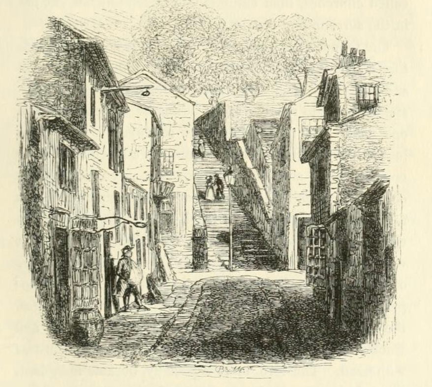

# Other Church Tales

The legend associated with Godshill Church is not particularly unusual to the Island. For example, Halliwell-Phillips' *Popular Rhymes and Nursery Tales*, 1849, includes a rhyme associated with the village of Leyland, in Lancashire, where a "supernatural agency" was responsible for relocating the church following its construction:  

> LEYLAND.
>
> A village in Lancashire, not far from Chorley. There is, or was sixty years since, a tradition current here, to the effect that the church, on the night following the day in which the building was completed, was removed some distance by supernatural agency, and the astonished inhabitants, on entering the sacred edifice the following morning, found the following metrical command written on a marble tablet on the wall:
>
> Here thou shalt be,  
> And here thou shalt stand,  
> And thou shalt be called  
> The church of Ley-land.
>
> Leyland church stands on an eminence at the east side of the village. The ancient tower is still standing, but the body of the church is modern.

Writing in *Popular rhymes of Scotland: original poems*, 1858, a Scottish equivalent to Halliwell-Phillips' volume, Robert Chambers identifies several related Scottish legends, as well as tales from over the border in England.

```{admonition} Superstitions Regarding the Building of Ancient Structures, 1858
:class: dropdown

Popular rhymes of Scotland : original poems
by Chambers, Robert, 1802-1871

Publication date 1858

pp. 117-120

SUPERSTITIOUS STORIES REGARDING THE BUILDING OF CERTAIN ANCIENT STRUCTURES.

'The Scottish vulgar, without having any very defined notion of their attributes, believe in the existence of an intermediate class of spirits residing in the air or in the waters; to whose agency they ascribe floods, storms, and all such phenomena as their own philosophy cannot readily explain. They are supposed to interfere in the affairs of mortals, sometimes with a malevolent purpose, and sometimes with milder views, . . . When the workmen were engaged in erecting the ancient church of Old Deer in Aberdeenshire, upon a small hill called Bissau, they were surprised to find that the work was impeded by supernatural obstacles. At length the Spirit of the River was heard to say—

"It is not here, it is not here,  
That ye shall build the church of Deer;  
But on Taptillery,  
Where many a corpse shall lie."

The site of the edifice was accordingly transferred to Taptillery, an eminence at some distance from the place where the building had been commenced.' — *Notes to Lay of Last Minstrel.*

The superstition here alluded to is general over Scotland. In Lanarkshire, they relate that, in building Mauldslie Castle in a former situation, the work was regularly razed every night, till, a watch being set, a voice was heard to enunciate from the foundations —

'Big the house where it should be,  
Big it on Maul's Lee.'

To which spot the building was accordingly transferred.

Near Carnwath stands Cowthally, Cowdaily, or Quodaily Castle, an early residence of the noble family of Somerville. The first Somerville, as tradition reports, came from France, and dispossessed the former proprietor of Cowthally, some of whose vassals he subjected to his authority, though, it appears, without succeeding in attaching them very faithfully to his interests. Somerville demolished the outer walls of the castle, and a good part of the castle itself, before he could make himself master of it; and he afterwards saw fit to rebuild it in a different place. But against this design he found circumstances in strong opposition. As the country people say, 'what of the wall he got built during the day, was regularly *dung down* at night.' Suspecting the fidelity of his watchmen, he undertook to wake the castle in person. It would appear that this had no effect in saving the building; for who should come to demolish it but the Evil One himself, with four or five of his principal servants, who, without heeding Somerville's expostulations, or even his active resistance, fell to and undid the work of the day, chanting all the while, in unearthly articulation, the following rhyme:—

' 'Tween the Eae Hill and Loriburnshaw,  
There ye'll find Cowdaily wa',  
And the foundations laid on em.'

It is added that, in compliance with this hint, Somerville was obliged to rebuild the castle of Cowdaily on its original foundations, which were of iron. Rational persons telling this story, express a shrewd suspicion that some of the vassals of the former lord personated the demons; and that, while the French watchmen were thereby terrified out of their wits, the Scottish men, whom Somerville had pressed into his service, considered the whole transaction as a piece of good sport, and connived at it out of secret enmity to their new master.

A somewhat similar tale is told regarding the castle of Melgund, in Forfarshire, the ancient and now ruined seat of a branch of the family of Maule. The situation of this building is remarkably low, and perhaps it is to this circumstance, setting the wits of the vulgar to account for it, that we are to ascribe the existence of the legend. It is said that the site originally chosen was a spot upon a neighbouring hill, but that, as the work was proceeding there, the labours of the builders were regularly undone every night, till at length, on a watch being set, a voice was heard to exclaim —

'Big it in a bog,  
Whare 'twill neither shake nor shog.'

The order was obeyed; and behold the castle standing; in the morass accordingly! It is of course easy to conceive reasons in human prudence for adopting this situation, as being the more defensible.

A similar example of the agency of this class of spirits is cited with respect to the church of Fordoun, in Kincardineshire. The recently-existing structure was of great antiquity, though not perhaps what the monks represented it — namely, the chapel of Palladius, the early Christian missionary. The country people say that the site originally chosen for the building was the top of the Knock Hill, about a mile north-east from the village. After, as in the former case, the walls had been for some time regularly undone every night by unseen spirits, a voice was heard to cry —

'Gang farther down,  
To Fordoun's town.'

It is added that the new site was chosen by the throwing at random of a mason's hammer.

We now cross the Border, and find the same superstition. The church of Rochdale, in Yorkshire, stands on a height. 'The materials laid for the building on the spot fixed upon by Gamel the Saxon thane, are said to have been removed by supernatural agency. This Gamel, it appears, held two ludis — Recedham or Rochdale — under Edward the Confessor. . . . The necessary preparations were made; the banks of the river groaned under the huge beams and massy stones; and all seemed to promise a speedy and successful termination. But there were those — not the less powerful because invisible to eyes of flesh and blood — who did not approve of the site, having resolved that the edifice should raise its head on the neighbouring hill. Accordingly, in one night all was transferred to its summit. The spectacle was beheld in the morning with universal dismay! But the lord was not a man to be easily foiled: at his command the materials were brought down to their former station. A watch was set; and now all appeared safe. In the morning, however, the ground was once more bare! Another attempt was rewarded by another failure. The spirits had conquered. One who knew more about them than he should have done made his appearance; and after detailing what he chose of the doings of the spirits, presented to the lord a massy ring, bearing an inscription to this purport —

The Norman shall rule on the Saxon's hall,  
And the stranger shall rule o'er England's weal;  
Through castle and hall, by night and by day,  
The stranger shall thrive for ever and aye;  
But in Racheds above the rest,  
The stranger shall thrive the best!

In accordance with this ratiocination runs the old and now nearly obsolete remark, that "strangers prosper, but natives are unfortunate."' — *England in the Nineteenth Century, quoting Roby's Traditions of Lancashire*.

The existence of legends bearing so near a resemblance in distant parts of the country, and applicable to different objects, affords curious matter of speculation.

```

A more complete telling of the tale of "The Goblin Builders of Rached" can be found in John Roby's *Traditions of Lancashire*.

```{admonition} The Goblin Builders of Rached, 1829
:class: dropdown

https://archive.org/details/traditionsoflanc01roby/page/22/mode/2up?q=%22stranger+shall+thrive%22
Traditions of Lancashire (in two volumes; volume I)
by Roby, John, 1793-1850

Publication date 1829

pp. 23-41

TO DO

THE GOBLIN BUILDERS.



TOWARDS the latter end of the reign of William, the Norman conqueror, Gamel, the Saxon Thane, Lord of Recedham or "Rached," being left in the quiet possession of his lands and privileges by the usurper, "minded," — as the phrase then was, — "for the fear of God and the salvation of his immortal soul, to build a chapel unto St. Chadde," nigh to the banks of the Rache or Roach. For this pious use, a convenient place was set apart, lying on the north bank of the river, in a low and sheltered spot, now called "The Newgate." Piles of timber and huge stones were gathered thither in the most unwonted profusion; insomuch, that the building seemed destined for some more ambitious display than the humble edifices, called churches, then exhibited, of which but few existed in the surrounding districts.

The foundations were laid. The loose and spongy nature of the soil required heavy stakes to be driven, upon and between which were laid several courses of rubblestone, ready to receive the grouting or cement. Yet in one night was the whole mass conveyed, without the loss of a single stone, to the summit of a steep hill on the opposite bank, and apparently without any visible marks or signs betokening the agents or means employed for its removal. It did seem as though their pathway had been the viewless air, so silently was all track obliterated. Great was the consternation that spread among the indwellers of the four several clusters of cabins, dignified by the appellation of villages, and bearing, with their appendages, the names of Castletown, Spoddenland, Honorsfield, and Buckland. With dismay and horror this profanation was witnessed. The lord, more especially, became indignant. This daring presumption — this wilful outrage, so like bidding defiance to his power, bearding the lion even in his den, was deemed an offence calling for signal vengeance upon the perpetrators.

At the cross in Honorsfield a proclamation was recited, to the intent, that unless the offending parties were forthwith given up to meet the punishment that might be awarded to their misdeeds, a heavy mulct would follow, and the unfortunate villains and *bordarii* be subject to such farther infliction as might still seem wanting to assuage their lord's displeasure. Now this was a grievous disaster to the unhappy vassals, seeing that none could safely or truly accuse his neighbour. All were agreed that human agency had no share in the work. The wiser part threw out a shrewd suspicion, that the old deities, whom their forefathers had worshipped, and whose altars had been thrown down, and their sacrifices forbidden, had burst the thraldom in which they were aforetime held by the Christian priests, and were now brooding a fearful revenge for the many insults they had endured. But the decree from the lord was hasty, and the command urgent; so that a council was holden for the devising of some plan for their relief.

Hugh de Chadwycke and John de Spotland were subordinate lords, or feudataries, holding fortified dwellings, castelets or peels, in the manor of Rochdale; the former had builded his rude mansion of massive timber, for the double purpose of habitation and defence, on a bold eminence, forming a steep bank of the river, about a mile from the Thane's castle. Claiming a relationship to the lord, he was, in some measure, privileged above his friend de Spotland, yet was the latter a personage of considerable power and influence at the manor court. To these men, when their aid was necessary, either as counsellors or intercessors, did the inhabitants generally repair.

Hugh de Chadwycke was a man of mild and grave deportment, but politic withal, and wary of counsel. John de Spotland was of a more bold and open temper. De Chadwycke suggested a submissive application to the Thane, with a pledge that all possible diligence should be used for the fulfilment of his demands. John urged the removal of the materials with all expedition to their original site, a watch being set to discover the delinquents, should they again presume to lay hands on the stuff. The wisdom and propriety of the latter precaution was undisputed; but no one seemed willing to undergo the terrible ordeal, each declining the office in deference to his more privileged neighbour. No wonder at their reluctance to so unequal a contest. To be strangled or torn limb from limb, was the slightest punishment that could be expected for this daring profanation, yet, unless they had witnesses, bodily, to these diabolical exploits, it were needless to attempt excusing themselves before the haughty chieftain. He would visit with fearful severity all their endeavours to deceive, nor would he credit their belief, unless it were confirmed by the testimony of an eye-witness. How to procure this desirable source of intelligence, was a question that was hourly becoming more difficult to solve.

Slow and melancholy was their return, while with fear and hesitation they communicated the result.

"Now, shame befall thee, Adam of Will's!" said a stout woman, to one of the speakers; "thou wert ever a tough fighter; and the cudgel and ragged staff were as glib in thine hands, as a beggar's pouch on alms-days. Show thy mettle, man. I'll spice thee a jug of barley-drink, an' thou be for the bout this time."

"Nay," returned Adam, "I'll fight Beelzebub if he be aught I can hit; but these same boggarts, they say, a blow falls on 'em like rain-drops on a mist, or like beating the wind with a corn-flail. I cannot fight with naught, as it were."

"Shame on thee, Hal!" said a shrill-tongued, crooked little body, arrayed in a coarse grey hood, and holding a stick, like unto a one-handed crutch, of enormous dimensions. "Shame on thee! I would watch myself, but the night-wind sits indifferently on my stomach, and I am too old now for these moonshine lifts."

She cast her little bleared eyes, half shut, and distilling contempt, on the cowardly bystanders.

"Now, if there be not old Cicely," — first went round in a whisper; — then a deep silence gradually pervaded the assembly.

She had just hobbled down to the cross, and the audience seemed to watch her looks with awe and suspicion.

"What, none o' ye? Come, Uctred, thou shalt shame these big-tongued, wide-mouthed boasters."

A short swarthy-looking boy, with a leering and unfavourable countenance, here stepped forward, taking his station upon one of the steps beside his mother. A notion had gone abroad, that the boy was the fruit of some unhallowed intercourse with an immortal of the fairy or pixy kind, whose illicit amours the old woman had wickedly indulged. She too, was thought to bear, in some degree, a charmed life, and to hold communion with intelligences not of the most holy or reputable order. The boy was dumb. His lips had however, at times, a slight and tremulous movement, which strongly impressed the beholders that some discourse was then carrying on between "the dummy," as he was generally railed, and his invisible relatives. His whole aspect was singularly painful and forbidding. No wonder, in these times of debasing superstition, that his person should be looked on with abhorrence, and even a touch from him be accounted an evil of no slight import. His mother alone had the power of communicating with him, or of understanding his grimaces.

"Now, what will ye give me for the use of his pretty eyes this lucky night? The Thane will have regard to his testimony, though all that have free use of the tongue he holds to be liars and dishonest Never lied this youth by sign or token!"

A buzz went through the company, and the dame and her boy again sat down to await the issue. All eyes were directed towards them, timidly and by stealth, as the consultation grew louder and more continuous.

A pause at length ensued. Some three or four of the group drew towards the crone, who sat almost double, her chin resting on the neb of her crutch.

"Now will we give thee two changes of raiment, together with a mess of barley-pottage; and every year thou shalt have a penny at Easter, and a fat hen at Shrovetide."

"Good," said the greedy beldame; "but I'll have a sheep-skin cap for the boy, and a horn spoon." This demand was also granted; after which she made signs to the lad, who swung his head to and fro, at the same time distorting his features with a wild and terrible rapidity. It was evident that he understood the nature of these proceedings. A glance, like that of mockery and derision, he cast towards the crowd; and, when Mother Cicely was returning, he threw back upon them a look of scorn and malignity which made the beholders shrink aside with horror.

The people now addressed themselves to the task of replacing the heavy materials, and ere night the greater part were withdrawn, ready to begin with the foundations again on the morrow.

A sort of rude shelter was constructed, wherein Uctred was to keep watch until day-light.

The morning came, calm and beautiful over the grey hills; and the anxious inhabitants, awake betimes, did each turn his first steps towards the river's brink. With horror and amazement they again beheld the ground bare. Not a vestige remained, nor was there any trace of the boy.

"He is gone to his own," said they, as a general shudder went through the crowd; "and the fairies have gotten him at last."

Every heart seemed quailing with some hidden fear; nor could any means, at that moment, be suggested for their emancipation.

The stones and timber were again found, as before, on the opposite hill. Fifty stout men had with difficulty contrived to fetch them from thence the day preceding, and twice that number would hardly have sufficed to transport them thither. It was not to be gainsayed that a power superior to their own was the agent in removals so mysterious. Nothing now remained but to acquaint their lord with this second interruption; and their diligence in performing this duty, they hoped, might exculpate them from the heavy doom they had incurred. Some of the wiser and more stout-hearted were chosen to carry these tidings to the Thane, hoping to clear themselves from the ban, as well as to return with commands for their future proceedings.

Gamel de Recedham, or Rochdale, had his dwelling in the ancient castle built by the Romans on the verge of a steep hill jutting into the valley of the Roach. It was a place difficult of access, save on the southern side, where a wide ditch formed an effectual defence, and over which a narrow bridge admitted only two abreast in front of the outer gate. It was now, in some places, fast going to decay, but enough remained out of its vast bulk to form a dwelling for the Saxon and his followers. It had been once fortified throughout; the castle, or keep, being four square, flanked at the corners with stone towers. The lower part of the walls was composed of large pebbles mixed with brick, and held together by a firm cement. Higher up, and continued to the summit, were alternate rows of brick and freestone. The corners were faced with stone, making a very formidable appearance when guarded by slingers and throwers of darts, who were stationed there only in times of great peril.

Passing the vallum, or outer defence, they ascended a narrow staircase outside the keep, where the cringing serfs were admitted by four of the lord's Norman bowmen, who ushered them into the audience-chamber. Some of the Thane's men were habited in coats of mail, made of small pieces of iron, cut round at the bottom and set on a leathern garment, so as to fold over each other like fish-scales, the whole bending with the greatest ease, and yet affording a sufficient protection to the wearer.

The chamber of audience was situated at the uppermost part of the keep, and great was the apprehension of the intruders, whilst following their guides through the winding passages and gloomy staircases leading to the inner cell occupied by their chief. The disposition of the armed men, — their warlike habiliments, and the various and uncouth weapons, which seemed to threaten terror and defiance, were all objects, to them, of apprehension and distrust. The walls of this gloomy apartment were lined with thin bricks, ornamentally disposed in herring-bone work, after the fashion of the time. The windows, though narrow on the outside, were broad and arched within, displaying a rude sort of taste in their construction. Round the walls were groups of weapons, ostentatiously displayed; two-edged broad swords; long spears, some barbed and others flat and broad; shields, the oldest of which were large, and had a sharp point projecting from the centre; others, of the Norman and more recent fashion, were smaller, and of an oval shape. Battle-axes, lances, and javelins, were strewn about in formidable profusion. Hauberks, or chain-mail, hung at intervals from the walls, looking grim and stalwart from their repose, like the headless trunks of the warriors they had once encompassed.

A broad curtain, curiously embroidered, covered one end of the room, from behind which crept a page or henchman, in gay attire, his tunic glistening with his lord's device.

The serfs bowed with the most abject submission to this representative of their lord, who lived in the customary style of barbarous and feudal pomp, which the manners of their Norman invaders had rather contributed to increase than to diminish.

"Tell thy master," said their companion, "that some of the folk would speak with him, touching the matter by which they are in jeopardy."

Smoothing his locks and trimming down his garments, the boy departed. It was long or ere the audience was granted; in the mean time, they stood trembling and oppressed with an evil foreboding for the result, the known hasty and impetuous temper of the Saxon rendering it a matter of some doubt, and no small hazard, as to what might be the issue of their conference. Suddenly was heard the clanking of armour, and the tramp of nailed feet, announcing his approach; the heavy arras was uplifted, and Gamel the Thane stood before them. He was richly attired, in a loose coat reaching down to his ancles; over this was a long robe, fastened, over both shoulders and on the breast, with a silver buckle. The edges were trimmed with gold and knots of flowers interwoven with pearls and rare stones. On his head he wore a coronet, or rim of gold, enriched with jewels; and his bushy hair and grizzled beard looked still more grim and forbidding beneath these glittering ornaments. His eyes were quick and piercing; his cheeks pale and slightly furrowed. A narrow and retreating mouth, firmly drawn in, showed the bent of his disposition to be fierce and choleric, and his wrath not easily turned aside. He was accompanied by his billmen, together with some half dozen attendants, clad in shirts of chain mail and helmets fitting close to the head. These bore lances after the Norman fashion then prevailing over the ruder customs of their Saxon predecessors.

The more polished manners of the Norman's court had early pervaded the ranks of the nobles; and even the few hereditary Saxon chiefs, left in possession of their ancient sovereignties, thought their domains cheaply purchased by this obsequious show of homage to their king.

The Thane's chief henchman occupied the post of honour, whilst a little footpage stood by his master's elbow.

The villains prostrated themselves.

"How now! — Where are the caitiffs I commanded of ye? I vow to the Virgin and St. Chadde, your own necks shall swing from the tower in their stead, should ye fail in that which I require at your hands."

The trembling hearers were afraid to answer — their lips quivered, and each tongue seemed to refuse its office, Gamel proceeded:—

"What! come ye to fawn and whine out my purpose? Now will I make your chastisement ten times hotter for this intent. — Lodge these knaves, Nicholas, i' the further dungeon, till they be replevied by the rogues who are yet at large, and defying our power: — they hold it somewhat cheap, methinks, when they value it less than the pampering of their own wantonness and sport."

Nicholas was herald, bedellus, or chief crier, to the lord of the manor, his office being to make proclamations at the court and the cross, where the use of his capacious lungs was oft m request. He was hangman, too, upon occasion, being never so well pleased as when employed in the due chastisement of his master's lieges. He was, moreover, a man of infinite humour, generally consoling his dear unfortunates under their visitations by some coarse and galling jest.

"Now, Adam of Hunersfield, art thou at thy prayers already? — I'll shrive thee quick. Master, shall I give the rogues any victuals? They'll not keep else till hanging time; — best finish now — needless to waste provender."

"Give them the prison allowance. But, hark thee, no stripes, Nicholas," said the chief, well aware of his flagellant propensities

"Eh!" replied he; "but black cake and dried beans don't mix well i' the stomach without riddling."

"Peace, sirrah!" replied the chieftain with a frown. Nicholas, though a licensed jester, and in especial favour, knew there was a boundary beyond which he durst not pass; he became silent, therefore, at this command. The lamentations of the unwary hostages were loud but unavailing. Nicholas prepared his manacles, and was leading them from the chamber, when the page whispered in his master's ear.

"Stop," cried the Thane: "know ye aught of the boy who was a-watching yesternight?"

"We know nothing of the lad, as we hope for deliverance," said the terrified rustics.

"Bring in the woman!"

The command was followed by the entrance of Cicely. Leaning on her crutch, she bent lowly before the chief.

"Hast thou any suit or accusation to prefer against these men, as touching thy boy?"

"Oh! my lord," said the dame, weeping, "I never aforetime knew him missing; and he has slept i' the Killer Dane, where the great battle was fought, below the castle. He has watched i' the 'Thrutch,' where the black dog haunts from sunset till cock-crow. He has leaped over the fairies' ring and run through the old house at Gozlewood, and no harm has befallen him; but he is now ta'en from me, — cast out, may be, into some noisome pit. The timbers and stones are leapt on to the hill again, — but my boy is not there!"

She wept, and wrung her withered hands.

"Hast thou any witness against these men?"

"Oh! my lord, they bribed me with their gifts that I should suffer the boy to watch; and I am poor, and I thought he wore a charmed life, and the little hoard would be a comfort and a stay in my old age."

"Thou hast done wickedly in this," said the lord: "howbeit, I will keep them in the stocks; peradventure it may quicken the wits of their outdoor friends, to find out the mover of these scurvy pranks. The posts and timbers would not go up hill unless some knave had holpen to lift them."

Nicholas was departing to the indulgence of his favourite pastime, when a loud hubbub was heard without, and presently a fellow was pushed in by the pressure of the crowd upon his shoulders; but they drew back, on finding the immediate presence of their chief.

This man was accounted the most notorious idler in the neighbourhood, hight "Barnulf with the nose." His eyes looked red and swollen, and his senses had become muddled and obtuse with long steeping. Silence was immediately enforced, while the assembly anxiously awaited the interrogation of this intolerable coveter of barley-drink.

"Art thou again at thy freaks?" said the Thane, angrily: "thou hast soon forgotten the stocks and the whipping-post on Easter-day. It were well that Nicholas should refresh thy memory in this matter."

At this dreaded name the poor wretch fell on his face.

"Please ye, my lord," said he, hardly raising his head from the floor, "I am here but for a witness beliken. I am breeding of no broil, save an' my gossip o'yesternight drew me into a tusle with old Split-Feet and his company."

He groaned, but not without considerable effort, and his face puckered in a heap at the recollection.

"What! — the foul fiend helped thee to thy liquor, I trow?" said Gamel, hastily "Think not to foist thy fooleries upon me. Should I find thee with a lie on thy tongue, the hide were as well oft' thy shoulders. To thy speech — quick, what sawest thou?"

"I will give it all, withouten a word but what the blessed saints would avouch," said the terrified supplicant, whose once fiery face was now blanched, or rather dyed of a dull and various blue.

"I was wending home from Merland, where I had been helping Dan the smith to his luckpenny, when, as I took the path-road down yonder unlucky hill to the ford, not thinking of the de'il's workmen that had flown off M'ith the church the night before, I was whistling, or, it mayhap, singing, — or — or I am not just particular to know how it was, for the matter of it; but, at any rate, I was getting up, having tumbled down the steep almost nigh to the bottom, and I thought my eyes had strucken fire, for I saw lights frisking and frolicking up and down the hill. Then I sat down to watch, and, sure enough, such a puck-fisted rabble, without cloak or hosen, I never beheld — all hurry-scurry up the hill, and some of the like were on the gallop down again. They were shouting, and mocking, and laughing, like so many starkmad fools at a May-feast. They strid twenty paces at a jump, with burdens that two of the best oxen about the manor had not shifted the length of my thumb-nail. 'Tis some unlucky dream, said I, rubbing the corners of my eyes, and tr3qng to pinch myself awake. Just then I saw a crowd of the busiest of 'em running up from the river, and making directly towards the steep bank, below where I sat. They were hurrying a great log of timber, which they threw down, close beside me, as if to rest ere they mounted. 'My friends,' — what should ail me to talk to 'em I cannot tell, — 'My friends, but ye seem to have more work in your hands than wit in your noddles — ye might have spared yourselves the labour, I trow.' With that the whole rout turned upon me with a shout and a chattering that would have dumb-founded the shrillest tongue in the whole hundred — the millwheel was nothing to it. I would have escaped, but my feet were holden, like as they had been i'the stocks. One, the foremost of the crew, — I do think he had a long tail and gaping hoofs, but I was over frightened to see very clear, — came with a mocking, malicious grin, his tongue lolling out, and his eyes glaring and fiend-like.

"'Pray, good friend,' said he, pulling off a little black bonnet, 'be compassionate enough to help us with our load to the hill-top.' Now was I terrified beyond measure, insomuch that I made a desperate tug, whereby loosening myself, I ran like the wind, the wicked fiends following, and roaring after me with loud and bitter curses. I jumped into the river, in my hurry having missed the ford, and I heard 'em still shouting, and, as I thought, pursuing me; but the Virgin and St. Chadde were my helpers, for, when Biddy opened the door in the morning, I lay there in a great swoon, with my head bruised, and a hole in my good grey cloak."

"And so thou comest here a boasting of thy drunken discoveries," said the Thane. "Thou shalt wish thou hadst not gotten thee so soon from the fiend's clutches. A spice of old Nicholas's vocation may not be amiss, yet, by way of relish to thy tale —"

The agony of the culprit was loud and appalling, but the chief was inexorable, until his denunciations were interrupted by a stranger, who craved a short respite for the groaning supplicant.

He was meanly clad:— a coarse cloak, stained and threadbare, was thrown open, showing a close habit of the most ordinary fabric; yet a natural and graceful bearing imparted a dignity even to his poor and worthless habiliments.

"I am a stranger, and sore oppressed with long travel. Penury and misfortune have been my lot, and I am driven from place to place without a home or a morsel of bread. Last night, long after the curfew, I came hither, but no *hospitium* or religious house being near, I sat down by the hill-side yonder, until morning should enable me to crave help for my hopeless journey. The morning had not dawned ere I awoke — a loud trampling, and the rush of many voices, had broken in upon my slumbers. I beheld crowds of strange-looking men, laden with terrific burdens. They seemed to be eagerly and earnestly at work, under heavier loads than I thought mortal man could sustain; the whole space, too, as far as the eye might carry, seemed alive with them, the flickering of their torches forming a scene of almost unimaginable splendour. Right before me were a number of these labourers, hauling up a heavy beam from the river; others were apparently crossing, laden with materials no less bulky and intractable. All were in motion, wriggling along like so many ants on a hillock. The party just before me stayed immediately below where I sat, watching their proceedings with no little curiosity and amazement. They threw down their load, — then, pausing, appeared to view, with some hesitation, the steep bank above them. The foremost of the group now came softly towards me. PulHng off his bonnet, with a grave and beseeching aspect he craved help to accomplish the ascent. Not then dreaming of goblins and their deceitful glamour, I put my shoulder to the work with a right good will, and truly it were a marvel to watch the tough beam, how it seemed to obey the impulse. I worked with all the might I could muster, but it appeared as though little were needful; and in a trice we scrambled to the top, when the whole party scampered off, leaving me to follow or not, as I chose. I saw something tossed towards me, which glistened as it lay at my feet. Stooping, I found a silver ring, beauteously bedecked with one glowing crystal. Round the rim is formed a quaint legend, bearing a fair device, which some learned clerk may perchance decipher."

The stranger drew from his finger a massy ring. A little ferret- eyed monk, a transcriber of saints' legends and Saxon chronicles, was immediately called. He pronounced the writing heathenish, and of the Runic form. A sort of free translation may be given as follows:—

"The Norman shall tread on the Saxon's heel,  
And the stranger shall rule o'er England's weal;  
Through castle and hall, by night or by day,  
The stranger shall thrive for ever and aye;  
But in Rached, above the rest,  
The stranger shall thrive best."

Gamel was troubled and perplexed. The words were prophetic, evidently pointing to his own and his country's fate, as well as to the destiny of the stranger. He knit his brows, and his very beard coiled upwards with the conflict. He appeared loth to allow of a supernatural agency in the affair, and yet the testimony and its witness were not to be gainsayed.

"I had not believed the tale, stranger, if this token had not confirmed thy speech:— verily thou hast a better witness than a fool's tongue to thy story. That illomened losel may depart. See thou fall not hastily into the like offence, else shalt thou smart from Childermas to All-hallowtide. Hence! to thy place." Barnulf awaited not farther dismissal, glad to escape the scrutiny of Nicholas with a whole skin.

A loud shriek was heard from the court-yard.

"My boy! — Oh, my boy!" cried the almost frantic mother, as she rushed into the chamber, leading in Uctred. He had been discovered on removing some of the huge piles of timber again from the hill, where, under a curiously-supported covering of beams and other rude materials, he lay, seemingly asleep. The urchin looked as malicious and froward as ever, even when standing before his chief.

"And where hast thou been, my pretty bird?" said the old woman, as she began her vocabulary of signs. But the boy looked surly, and would not answer to the signal: he drew down his black swarthy brows, looking eagerly and fiercely from behind their bushy curtains. Suddenly, and with a fearful yell, he sprang forward, snatching the ring which Gamel was then giving back to the stranger. With a wild and hideous laugh, which sent a shudder through the assembly, he drew it on his finger. At this moment the expression of his countenance began to change, and some of the bystanders, over whom fear had probably waved the wand of the enchanter, saw his form dilate, and his whole figure expand into almost gigantic proportions. A thick haze rolled through the apartment, — then was heard a wild unearthly shout, — and the vision had disappeared.

"Seize him!" cried Gamel.

The guards, trembling, prepared to execute his commands, but, on gaining the outworks of the castle, no vestige remained of his appearance, save a slight whirlwind of dust, like a mist-wreath curling down the valley, which, to their terrified apprehensions, became the chariot of the departing demon. Nothing could shake this belief; and, in after-ages, the boy was spoken of as a changeling, left by some fairy, whose appointed sojourn had been then accomplished, the means for his release being fulfilled. Old Cicely became nigh crazed with the loss of her son; but Gamel, seriously pondering on these events, sought counsel from the "Holy Church." It was therein resolved, that the intended site should be removed, and the "unknown" by such removal appeased. The chapel of St. Chadde was accordingly built on the hill-top, where the church now stands, and unto which the foundations had been so marvellously conveyed. One hundred and twenty-four steps were dug to accomplish the ascent, and enable the good people to go to prayers. Connected with these, the tradition still exists; and unto this day it is here observed, that *"Strangers prosper in the town of Rochdale; but the natives are generally unfortunate in their undertakings."*
```

A précised version of the tale was also included in a review of the same work (*Traditions of Lancashire. By J. Roby, M.R.S.L, 2 vols, 8 vo. Longman, Rees, and Co.*) in *The Gentleman's Magazine*, vol. C, April 1830, [pp. 329-331](https://archive.org/details/in.ernet.dli.2015.21198/page/n353/mode/2up):

```{admonition} THe Goblin Builders (précised), 1830
:class: dropdown

*The Gentleman's Magazine*, vol. C, April 1830, [pp. 329-331](https://archive.org/details/in.ernet.dli.2015.21198/page/n353/mode/2up):

...

The Goblin Builders" is in a different vein, and is told in a way that Mr. Crofton Croker himself might be proud of.

Towards the latter end of the reign of William, the Norman Conqueror, Gamel, the Saxon Thane, Lord of Recedham or Rached (Rochdale), minded, as the phrase was, "for the fear of God, and the salvation of his immortal soul, to build a chapel unto St. Chadde." The site was chosen on the north bank of a river. The piles were driven, and the foundations laid; but in one night the whole work was removed, silently and mysteriously, to a hill on the opposite bank. The founder was indignant, and threatened summary vengeance. He was only appeased by the assurance of two feudal Lords of the Manor of Rochedale, that the materials should be removed with all possible expedition to their original site. It was also determined that a watch should be set to discover the delinquents; but in the general suspicion that the sacrilege was not the work of human hands, it was difficult to find a person bold enough to undertake the office of watchman; until at length a boy by the name of Uctred, who was suspected to be the fruit of an illicit intercourse with some dreaded fairy, on account of his repulsive appearance, volunteered to keep watch on the occasion.

The morning came, again the place was bare; ihe stones and timber were removed to the opposite hill, and the boy was gone. There was nothing to be done but to inform the Thane of this second interruption, and the serfs proceeded to the castle. They were admitted to the hall of audience, trembling and oppressed with a fearful foreboding, when suddenly Gamel the Thane stood before them.

"He was richly attired in a loose coat, reaching down to his ancles; over this was a long robe fastened over both shoulders and on the breast with a silver buckle; the edges were trimmed with gold, and knots of flowers interwoven with pearls and rare stones. On his head he wore a coronet or rim of gold, enriched with jewels; and his bushy hair and grisled heard looked still more grim and forbidding beneath these glittering ornaments. His eyes were quick and piercing, his cheeks pale, and slightly furrowed. A narrow and retreating mouth firmly drawn in, showed the bent of his disposition to be fierce and choleric."

Before this awful personage the villains prostrated themselves; but articulation was suppressed by fear; and the Thane, deeming their silence to be an attempt to cajole him, consigns them to the discipline of the dungeon. After much characteristic colloquy, a witness of drunken notoriety is ushered in, as being able to give some account of the mysterious migration of the wood and stone. His version of the story is worthy of "Barnulf with the nose," by which appellation he is distinguished.

"'What! — the foul fiend helped thee to thy liquor, I trow?" said Gamel, hastily. — 'Think not to foist thy fooleries upon me. Should I find thee with a lie on thy tongue, the hide were as well off thy shoulders. To thy speech — quick, what sawest thou?'

"'I will give it all, withouten a word but what the blessed saints would avouch,' said the terrified supplicant, whose once fiery face was now blanched, or rather dyed of a dull and various blue.

"'I was wending home from Merland, where I had been helping Dan the smith to his luckpenny, when, as I took the path-road down yonder unlucky hill to the ford, not thinking of the de'il's workmen that had flown off with the church the night before, I was whistling, or, it mayhap, singing, — or— or —— I am not just particular to know how it was, for the matter of it; but, at any rate, I was getting up, having tumbled down the steep almost nigh to the bottom, and I thought my eyes had strucken fire, for I saw lights frisking and frolicking up and down the hill. Then I sat down to watch, and, sure enough, such a puck-fisted rabble, without cloak or hosen, I never beheld — all hurry-scurry up the hill, and some of the like were on the gallop down again. They were shouting, and mocking, and laughing, like so many stark-naked fools at a Mayfeast. They strid twenty paces at a jump, with burdens that two of the best oxen about the manor had not shifted the length of my thumb-nail. 'Tis some unlucky dream, said I, rubbing the corners of my eyes, and trying to pinch myself awake. Just then I saw a crowd of the busiest of 'em running up from the river, and making directly towards the steep bank, below where I sat. They were hurrying a great log of timber, which they threw down, close beside me, as if to rest ere they mounted. 'My friends,' — what should ail me to talk to 'em I cannot tell, — 'My friends, but ye seem to have more work in your hands than wit in your noddles — ye might have spared yourselves the labour, I trow.' With that the whole rout turned upon me with a shout and a chattering that would have dumb-founded the shrillest tongue in the whole hundred — the mill-wheel was nothing to it. I would have escaped, but my feet were holden, like at they had been i'the stocks. One, the foremost of the crew, — I do think he had a long tail and gaping hoofs, but I was over frightened to see very clear, — came with a mocking, malicious grin, his tongue lolling out, and his eyes glaring and fiend-like.

"'Pray, good friend,' said he, pulling off a little black bonnet, 'be compassionate enough to help us with our load to the hilltop.' Now was I terrified beyond measure, insomuch that I made a desperate tug, whereby loosening myself, I ran like the wind, the wicked fiends following, and roaring after me with loud and bitter curses. I jumped into the river, in my hurry having missed the ford, and I heard 'em still shouting, and, as I thought, pursuing me; but the Virgin and St. Chadde were my helpers, for, when Biddy opened the door in the morning, I lay there in a great swoon, with my head bruised, and a hole in my good grey cloak'." — pp. 36, 37.

The evidence of him "with the nose," is however more gravely confirmed by a stranger.

"He was meanly clad: — a coarse cloak, stained and threadbare, was thrown open, showing a close habit of the most ordinary fabric; yet a natural and graceful bearing imparted a dignity even to his poor and worthless habiliments.

"I am a stranger, and sore oppressed with long travel. Penury and misfortune have been my lot, and I am driven from place to place without a home or a morsel of bread. Last night, long after the curfew, I came hither, but no hospitium or religious house being near, I sat down by the hill-side yonder, until morning should enable me to crave help for my hopeless journey. The morning had not dawned ere I awoke — a loud trampling, and the rush of many voices, had broken in upon my slumbers. I beheld crowds of strange-looking men, laden with terrific burdens. They seemed to be eagerly and earnestly at work, under heavier loads than I thought mortal man could sustain; the whole space, too, as far as the eye might carry, seemed alive with them, the flickering of their torches forming a scene of almost unimaginable splendour. Right before me were a number of these labourers, hauling up a heavy beam from the river; others were apparently crossing, laden with materials no less bulky and intractable. All were in motion, wriggling along like so many ants on a hillock. The party just before me stayed immediately below where I sat, watching their proceedings with no little curiosity and amazement. They threw down their load, — then, pausing, appeared to view, with some hesitation, the steep bank above them. The foremost of the group now came softly towards me. Pulling off his bonnet, with a grave and beseeching aspect he craved help to accomplish the ascent. Not then dreaming of goblins and their deceitful glamour, I put my shoulder to the work with a right good will, and truly it were a marvel to watch the tough beam, how it seemed to obey the impulse. I worked with all the might I could muster, but it appeared as though little were needful; and in a trice we scrambled to the top, when the whole party scampered off, leaving me to follow or not, as I chose. I saw something tossed towards me, which glistened as it lay at my feet. Stooping, I found a silver ring, beauteously bedecked with one glowing crystal. Round the rim is formed a quaint legend, bearing a fair device, which some learned clerk may perchance decipher."

"The stranger drew from his finger a massy ring. A little ferret-eyed monk, a transcriber of saints' legends and Saxon chronicles, was immediately called. He pronounced the writing heathenish, and of the Runic form. A sort of free translation may be given as follows:—

"The Norman shall tread on the Saxon's heel,  
And the stranger shall rule o'er England's weal;  
Through castle and hall, by night or by day,  
The stranger shall thrive for ever and aye;  
But in Rached, above the rest,  
The stranger shall thrive best."  
pp. 38, 39.

Gamel was troubled and perplexed, and slowly and reluctantly admitted the supernatural agency. The lost boy was discovered in the building seemingly asleep: on being brought forward he maintained his old malicious look, and snatching the ring which Gamel was returning to the stranger, he disappeared amidst the terror of the spectators. Gamel sought counsel of the church; the Chapel of St. Chadde was built upon the hill where it now stands, and one hundred and twentyfour steps were dug to accomplish the ascent. Connected with these the tradition still exists, and unto this day it is here observed, that *"Strangers prosper in the town of Rochdale, but the natives are generally unfortunate in their undertakings."*

...

```


---


https://archive.org/details/dialectandfolkl03stergoog/page/n158/mode/2up

The dialect and folk-lore of Northamptonshire
by Sternberg, Thomas

Publication date 1851

pp.138-141


...

[The Bogie]


Among other characteristics of this spirit, was that of superior strength, a quality which he also holds in common with his German and Scandinavian brethren. It is to a being of this class that the village of Stowe, near Daventry, is said to derive its adjunct of "Nine-churches." In days of yore, say the villagers, a lord of the manor was desirous of raising a church in his native place, at that time known by the simple appellation of Stowe. A hill was chosen for the site, cunning workmen procured, and the foundation laid; but on the following morning, when the labour was to be resumed, no traces of the yesterday's work were visible. Trenches, stones, and tools had all vanished. After a long search they were discovered, some distance beyond, on the spot where the present church now stands. The lord, however, was stubborn, and was not to be so easily baffled. Nine times did he renew his attempt, and each time were they frustrated by the spirit, who continued to remove in the night what the workmen had raised during the day. With great difficulty a man was induced to watch these midnight proceedings: and who does the reader imagine were the unseen opponents of the church builders? The tiny legions of Queen Mab, perhaps, as in the case of God's Hill, in the Isle of Wight. But, alas! for the poetry of our rustics, the watchman reported the aggressor as an ol "summet bigger nor a hog." After this the attempt was given up in despair, and the present church on the site so marvellously selected.

`[Note p. 195-6: A similar tradition attaches itself to the origin of many other buildings throughout Great Britain. Mr. Chambers, in his Popular Rhymes, records many instances of its occurrence in Scotland; and in England we may point out the church of Bughton, in Sussex; Ambrosden Church, in Buckinghamshire; and that of Rochdale, in Yorkshire. Similar legends are also related of the churches of Great Brington and Oxendon, in this county, both of which, it is said, were originally intended to have been built on sites some distance from the present edifices.`

`Baker assigns a more matter-of-fact origin for the appellation "Nine Churches." **Stowe," he says, "received its adjunct of 'Nine Churches' because there was nine advowsons appendant to the manor."`

...