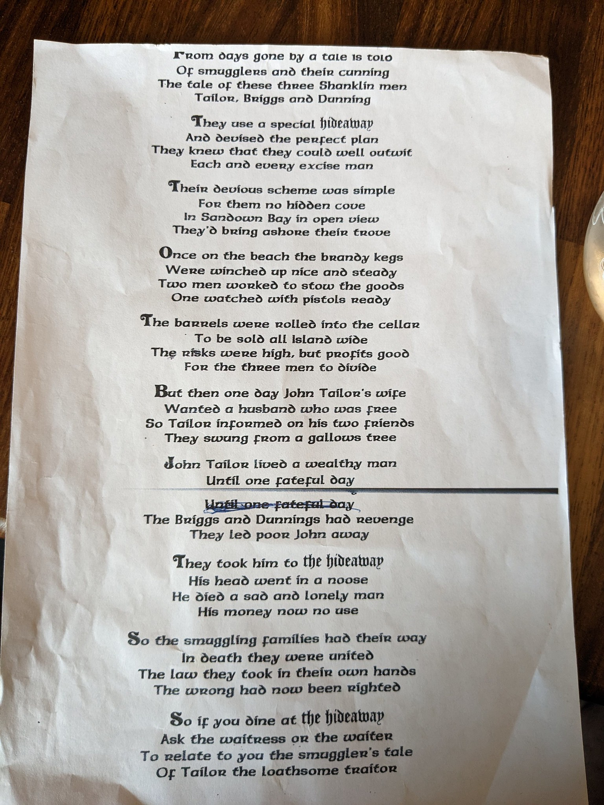

# Hideaway Smuggler Song

FROM days gone by a tale is told  
OF smugglers and their cunning  
The tale of these theee Shanklin men  
Tailorr, Briggs and Dunning

They use a special hideaway  
And devised the perfect plan  
They knew that they could well outwit  
Each one every excise man

Their devious scheme was simple  
Foe them no hidden cove  
In Sandown Bay in open view  
They'd being ashore their trove

Once on the beach the brandy kegs  
Were winched up nice and steady  
Two men worked to stow the goods  
One watched with pistols ready

The barrels were rolled into the cellar  
To be sold all island wide  
The risks were high, but profits good  
For the these men to divide

But then one day John Tailor's wife  
Wanted a husband who was free  
So Tailor informed on his two friends  
They swung From a gallows tree.

John Tailor lived a wealthy man  
Until one fateful day  
The Briggs and Dunnings had revenge  
They led poor John away

They took him to the hideaway  
His head went in a noose  
He was a sad and lonely man  
His money now no use 

So the smuggling families had their way  
In death they were united  
The law they took in their own hands  
The wrong had now been righted

So if you dine at the hideawy,  
Ask the waitress or the waiter  
To relate to you the smuggler's tale  
Of Tailor the loathsome traitor

41111111111111111111111k 

