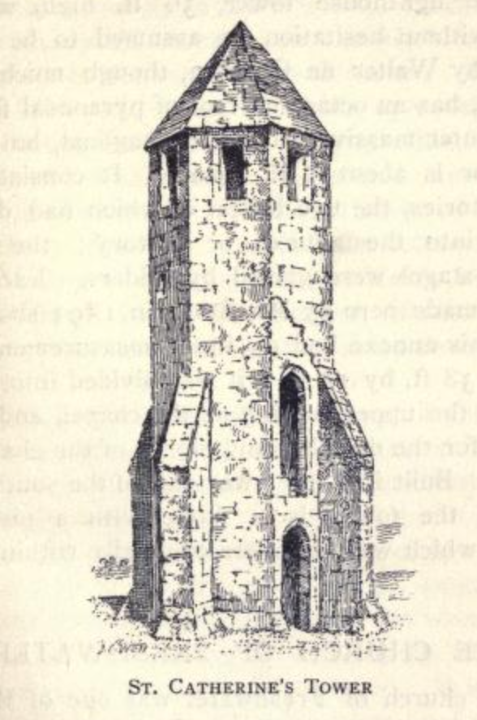
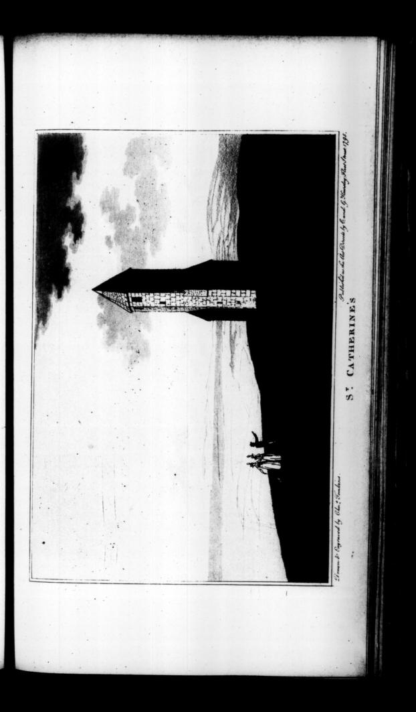
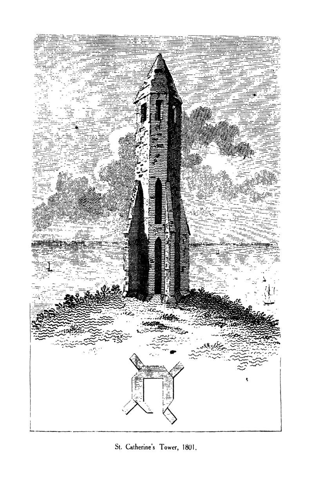

# A History of the Pepperpot

If you look at map of the Isle of Wight, you'll see it takes the form of a diamond sitting just off the south coast of the Big Island, mainland England, across the Solent from Portsmouth and Southampton.

The southernmost tip is known as St Catherine's Point; it's flanked by the village of Niton to the East, and Blackgang Chine to the West.

Looking inland, you'll see St Catherine's Hill looming in front of you, topped off by St Catherine's Oratory, commonly known as *the Pepperpot*.


TO DO - was well known as a sea mark - change: The declining state of the Pepperpot was remarked upon in correspondence to *The Gentleman's Magazine* in 1757, along with illustrations of the building, noting that it played an important role as a sea mark, and it's loss would be keenly felt by those mariners who relied upon it.

```{admonition} The Tower of St Catharines, 1957
:class: dropdown

https://archive.org/details/sim_gentlemans-magazine_1757-04_27_4/mode/2up?q=chale
The Gentleman's Magazine  1757-04: Vol 27 Iss 4

Mr Urban,

I Send you four views of the tower of *St Catharine's* which stands upon the summit of *St Catharine's Hill Down*, on the back of the *Isle of Wight*, about 750 feet higher than high-water mark, and about half a mile from the sea, commanding the most extensive view, both by sea and land, of any place in Britain. It is part of a consecrated building of great antiquity, as appears by the Winchester register, in which there is this entry:

*"Walter de Langsterell, admissus ad Hermitorium supra montem de Chale in insula Vectis, Idil. Octobris A.D. 1312."*

The figure of this tower within, is quadrangular, and without octagonal; each side both of the oétagon and quadrangle is just four feet, its height to the roof is 27 feet, and the perpendicular height of the roof is two feet.

It seems to be a Gothic imitation of the Temple of the eight winds at *Athens*, which was built by *Azdronicus*, whom *Vitruvius* calls *Cyrrhastes*, at *Athens*.

I have added a view of this temple, which was of marble; on each side was carved, in bass relief, a representation of the wind of that quarter which it fronted; and on the point of the roof, which was a pyramid of marble, a brazen Triton was placed, as a weathercock, holding a small rod in his right hand, which pointed to the quarter from which the wind blew.

The tower of *St Catharine* has been long a sea mark, and has been of the most important service by directing our mariners to avoid the adjacent rocky shores in navigating the channel, and it would therefore have been thought very strange in any time less negligent of the public interest, and less improvident for the morrow, than the present, that it should have been suffered to go to ruin. You will see by the south view, that it must very soon fall at once into rubbish if it is not effectually repaired; and the sudden disappearance of it, before the accident can be known at sea, will probably occasion the loss of more vessels and lives than the most dreadful hurricane that ever happened. I hope, Mr *Urban*, that those whose inattention has suffered service to be delayed, will now see it performed, as they must after this memorial incur more severe censure by neglecting it.  
*I am Yours, &c.* A. B.


```

The view from the down is a majestic one, and includes a tale, of Week Down, although I will save that for later..

```{admonition} "Infinitely rich, and almost unbounded", 1836
:class: dropdown

In Thomas Barber, *Barber's picturesque illustrations, of the Isle of Wight, comprising views of every object of interest on the island*, 1834, [pp.84-6](https://archive.org/details/barberspicturesq00barbiala/page/84/mode/2up)

The traveller's carriage is supposed to have proceeded empty from the Sand-rock Hotel to Chale, at which village half a miles' walk from the Chine will enable him to rejoin it. Or, if he has returned to the Spring, he may continue his pedestrian excursion over the cliff, and by the preventive look-out, crossing the stream which runs into Black-gang Chine near its source, and enjoying the aspects of the ocean, and the grand objects all around. This too is his opportunity for ascending to the top of St. Catherine's Hill, the most elevated point of the Island, the prospect from which, when the weather is favourable, is "infinitely rich, and almost unbounded" indeed, it takes in the whole circuit of the Wight, except in a single direction, where the view is broken by the Brixton Downs. On a clear day, even the highest part of the French coast, adjoining Cherbourg, may be sometimes perceived; while, to the west, the isles of Portland and Purbeck are plainly distinguishable. The Hampshire coast, near Lymington, appears almost to unite with the Island, the intervening Solent being scarcely seen. As the eye ranges to the north and west, the New Forest, Southampton Water, Portsdown Hill, the Sussex hills, and Beachy Head, beyond Brighton, are successively visible.

The Chine we lately described, is a fissure in the south side of this stupendous hill. Its extreme height is nearly nine hundred feet above the level of the sea. Originally, it was called Chale Down; the appellation of St. Catherine's having been bestowed on it from the circumstances thus narrated by Sir Richard Worsley. In the year 1323, Walter de Godyton built a chapel here, and dedicated it to St. Catherine, assigning certain rents for a chantry priest to sing mass, and also to provide lights for the safety of such vessels as might chance to come on this dangerous coast during the night. At the dissolution of chantries, it was perhaps found impracticable to divide the useful from the superstitious part of the institution; so that the whole fell together, the chantry involving the lighthouse in its ruin. By an entry in the registers of the diocese, it appears that, eleven years before the erection of this chapel, there was a hermitage standing on the same spot: the entry is as follows: "Walter de Langstrell admissus ad hermitorium supra mortem de Chale, in insula Vectis, Id. Octobris, A.D. 1312." St. Catherine's Tower, on the summit of the down, is a remain of the ancient religious institution, having been substantially repaired by the lord of the manor, in consideration of its essential service as a landmark. It is of octangular form, finished pyramidically at top ; its height thirty-five feet and a half. On its reparation, says Sir Richard Worsley, "the foundation of the whole chapel was also cleared and levelled ; by which, not only its figure was discovered, but also the floor and stone hearth of the priest's little cell at the south-west comer." In addition to the tower, a light-house was erected here a few years back ; but the idea of rendering it serviceable by night is now abandoned, the mists by which the hill is so frequently obscured having been found to render it useless.

```


```{admonition} The view from the summit, 1876
:class: dropdown

In Henry I. Jenkinson, *Jenkinson's practical guide to the Isle of Wight*, 1876, [p114-5](https://archive.org/details/jenkinsonspract00jenkgoog/page/n208/mode/2up).

The view from the summit of the down is extensive, and although most beautiful, perhaps not equal to that which is obtained from some other heights. The village of Niton appears within a stone's throw, and a little farther distant is Whitwell, both pleasantly situated in a quiet and secluded, but open and high part of the downs, from 1 to 2 miles distant from the sea. Beyond these villages are the hills which hide Ventnor, and run from Steephill and St. Boniface downs, by Wroxall and Week downs to the Worsley obelisk. A wide valley, with Godshill church prominent in the centre, stretches from the spectator to the north-eastern chalk range, including St. George's, Arreton, Messly, Ashey, and Brading downs. To the right of these hills is the Brading Haven, and on the left may be seen the towers of Osborne, the tops of the houses at Newport, the smoke rising from the Medina cement works, and part of West Cowes, and the Medina estuary. More distant is the long silvery streak of the Solent, with the opposite coasts of Sussex, Hampshire, and Dorsetshire, from Selsey Bill to St. Alban's Head. To the west are the downs of Chillerton, Brixton, and Afton, ending with High Down; the white cliffs at Freshwater and the Needles present a noble appearance* At the feet of these hills there is an extensive cultivated plain, bounded by the beautiful line of coast which includes the Chale, Brixton, Brook, Compton, and Freshwater bays. To the south, close below the spectator, is the English Channel, the waters of which form a broad expanse of ocean, bounded only by the horizon. It is said, probably without foundation, that in clear weather the opposite coast of France near Cherbourg may be discerned.

Miss Sewell, in 'Ursula,' when describing the view westward from St. Catherine's, says: "The coast forms part of a great bay indented by smaller ones. The shore is closed in with red sandcliffs, rather low, broken, and jagged; but away to the west the red sand changes into chalk, and the cliffs become very steep, and rise to a great height; standing out against the sky when the sun shines on them, until they almost dazzle the eye ; and at other times covering themselves, as it were, with a bluish veil of mist, and looking out proudly from behind it. I always liked the white cliffs very much, yet my eye never rested upon them long, but wandered still farther, to a distant stretch of grey land looking like a cloud, which could be seen just where the sea and sky met."

```

TO DO - Mackerel


Not surprisingly, there is a story behind the origin of the Pepperpot. It's the early 1300s, in the reign of Edward II, and the sea provides as much of an income to the Islanders living thereabouts as the farming.

But not just from fishing...

On the Sunday after Easter, 1313, the Saint Mary, of Bayonne, went down on Atherfield Ledge in Chale Bay. Carrying 174 tuns [large casks, each containing approximately 252 gallons] of white wine from France, the majority of the crew survived, and many of the barrels were washed ashore.

Local architect, archaeologist, and writer, Percy Stone, a resident of Merstone, related the tale of what happened next in his collection of poems, *Legends and lays of the Wight*, published in 1912.

```{admonition} *St. Catherine's*, Percy Stone, 1912 
:class: dropdown

https://archive.org/details/legendslaysofwig00ston/page/30/mode/2up?ref=ol
Legends and lays of the Wight
by Stone, Percy Goddard

Publication date 1912

pp. 31-37

ST. CATHERINE'S (1314)
On a stormy night in the winter of 1314, one of a fleet of ships chartered by merchants of Aquitaine to convey a consignment of wine to England, struck on the treacherous Atherfield ledge with the result told in the legend. An account is given — in the Abbreviation of Pleas, Hilary Term, 1315 — of the merchants' claim for redress against Walter de Godyton, urging the cargo was no 'wreck of the sea.' Certain it is that De Godyton built the oratory and pharos on the down, as an inquisition as to its endowment, held in August 1328, states that he was the founder and that it was built 'to give light to those sailing these perilous seas by night.' The amount of wine in question was considerable, being one hundred and seventy-four casks, each of the value of five marks, of which De Godyton had fifty-three. How Holy Church came in is not so plain, but a Papal Bull threatening excommunication was fulminated against the delinquent unless due restitution and penance was made. The rest is legend.

Wild sweeps the wrack from the gates of the West.  
Loud roars the rage of the sea;  
Bitter the edge of the Atherfield-ledge,  
From the which God keep us free!  
White gleam the teeth of the surges high  
And glisten the rocks for their toll;  
Black race the clouds o'er the face of the sky  
Like fiends in pursuit of a soul.  
Go, all who have kin on the sea this night  
And pray on your bended knee  
That, while you sleep, the good Lord will keep  
Those who sail on this storm-swept sea.

The 'Bon Venture' of the Abbot of Quarr  
Is home from the land of France,  
Deep lade with cloth and the good red wine  
That makes the red blood dance.  
The leadsman checks the knotted line  
That guides the helmsman's hand,  
The look-out's beard is stiff with rime  
As he strains his eyes for land.  
'I cannot the narrowing coast descry,  
Nor the Abbey's beacon see.  
*Christ's body! We've missed the Needle's eye,*  
*And there's broken water a-lee.*

'Now, lady of Whitwell, be our aid —  
We vow thee an altar light.  
Good Nicholas, saint of shipmen bold,  
Preserve us all this night.'  
But the pitiless wind and the treacherous tide  
Hold the good ship in their sway;  
In vain the anchor is cast — it drags.  
She strikes ere break of day.  
And it's, oh! the crash of timbers rent,  
By the grim rocks' savage edge,  
And it's, ah! the shrieks of drowning men  
Who for want of a light must perish this night  
By the curséd Atherfield-ledge.

Sir Walter de Godyton sits in hall  
And makes him right good cheer:  
'A stormy night on the shores of Wight  
Should drive the wreckage here.  
Good ship oak to mend the hearth,  
Rich stores that may not sink,  
And, if perchance she hail from France,  
Good Gascon wine to drink.  
So haste ye down by morrow's dawn  
And search along the bay  
For flotsam and jetsam — 'Tis my right,  
Which none shall me gainsay.'

The Abbot of Quarr in his chapter-house  
Reclines in his oaken stall,  
And the monks sit round on the narrow bench  
That skirts the pillared wall.  
They weigh the convent's state full well  
And deal with the good and ill,  
And reckon the rents of the broad fat lands  
They own in dale and hill.  
Anon they 're aware of a hatless man  
At the arch of the cloister door.  
'Father Abbot,' he cries, 'a wreck she lies,  
Your ship, on the southern shore.'

'She drove on the teeth of the Atherfield-ledge,  
In the storm of yesternight;  
Between the rocks and the waters' swirl  
She was gone ere morning light,  
And her cargo lies scattered along the shore  
From Chale to Compton-chine —  
Corded bales of broidered cloth  
And casks of Gascon wine.  
And, good Father Abbot, alack-a-day,  
The worst is yet to tell:  
The lord of Gotten hath seized the whole  
And defies you, book and bell.'

The Abbot starts from his cushioned seat  
And his brow grows black with wrath.  
'By our Lady of Quarr, I'll have the law  
Of the rogue!' he thunders forth.  
'With ruffled plumes and ratings sharp  
I'll send this hawk to perch.  
Who dares to lay his greedy claws  
On goods of Holy Church.  
Haste, Brother Gervase, warn him well  
Who would with abbots cope.  
An he refuse, we'll bear the news  
To His Holiness the Pope.

The lord of Gotten he laughed aloud  
When the message he received.  
'So it's leaving home on a journey to Rome  
Is your master. News, indeed!  
For the empty threats of a greasy monk  
I care not a *maravedi*.  
I'll hold to my right like a gallant knight —  
All else may go hang for me.  
Possession's nine points of the law, I've heard,  
So tell this abbot of thine  
I'll clothe my men in his dornix cloth  
And drink his Gascon wine.'

The Abbot has sought his father the Pope  
And unfolded his tale of woe.  
And the Pope has sworn by his triple crown  
That the matter shall not rest so.  
'The scurvy knight shall feel the might  
Of Holy Church,' quoth he;  
'Go, bring me candle, book, and bell,  
I here pronounce decree.  
Be he living or be he dead,  
Be it early or late,  
No prayers for him shall hence be said —  
Be he excommunicate,'

The Abbot he hies him home again  
And gathers his chapter round.  
'I've here,' said he, 'the Pope's decree,  
'Twill bring this knave to ground.  
I'll teach him pious monks to flout  
And Holy Church defy.  
This robber Knight, despite his boast,  
*Peccavi* soon shall cry.  
Go wide proclaim him now without  
The Church's pale to be.  
Who'll win the fight 'twixt Church and might,  
We'll see right speedily.'

So Gotten's lord ere long doth feel  
The weight of Church's hand.  
For none will bring him bite or sup  
And none will till his land.  
All Church's rites from him withheld,  
He's now in parlous way;  
Of all he meets, there's none that greets  
Or gives him e'en good day.  
'Alas! my deeds on me recoil,  
My sins I here declare;  
I will ere too late to the Abbey gate,  
And crave for mercy there.'

Sir Walter had saddled his hackney stout  
And sought the Convent gate,  
But the doors are shut against the face  
Of the excommunicate.  
'I have sinned, I have sinned, Father Abbot,' he cried;  
'Take pity — take pity on me.  
I here repent of a life misspent,  
Annul this fell decree.  
Remove this ban from me and mine;  
I'll restitution make,  
And any penance Mother Church  
Doth set, will undertake.'

Whereat the oaken gates swing back,  
And he falls on bended knee  
As the Abbot, with chant and incense sweet,  
Comes forth to set him free.  
'Of a life misspent, an thou true repent,  
This shall thy penance be —  
On Catherine's height shalt burn a light  
And pray for those at sea.  
A beacon fair of goodly stone  
Shalt rear on the cliff's steep edge,  
That never again in the annals of Wight  
A vessel be lost for need of a light  
On the deadly Atherfield-ledge.'

So he rose from his knees all humble wise  
And led his horse within,  
And he took the vows of the brotherhood,  
Salvation's crown to win.  
'Thy blessing, my father, thy blessing I crave.'  
'My son, *Benedicite*.  
Sir Walter de Godyton erst thou wast,  
Brother Walter henceforth shalt be.'  
So he builded the Tower of Island stone  
And he set the lamp therein,  
And ever at night he tended the light  
And thus atoned for sin.

By day he prays for all mankind,  
By night he trims the lamp  
On the lonely crown of Catherine's Down,  
Where the mists hang chill and damp.  
In storm and stress that beacon bears  
A welcome message far,  
And shipmen call a blessing down  
Upon its guiding star.  
And the good monk vows at the altar's step,  
As the flame shines clear and bright,  
'No vessel more on that treacherous shore  
Shall be lost for want of a light.'

```

The following is a typical retelling of the story, in prose:

```{admonition} The ancient lighthouse of St. Catherine's, 1895
:class: dropdown

In William John Hardy, *Lighthouses: Their History and Romance* 1895, [pp101-3](https://archive.org/details/lighthousesthei00hardgoog/page/n104/mode/2up).

CHAPTER X

ST. CATHERINE'S POINT TO THE EDDYSTONE

THERE is not much to say about the lighthouses along our southern coast between Dungeness and St. Catherine's, in the Isle of Wight; but the lighthouse at this latter place has an interesting history.

What now remains of the ancient building is a stone tower, octagonal without but square within, which consists of four distinct stories; the two lower were entered from an annexe building, whilst the two upper were mere stages reached by ladders. The beamholes may still be seen, and they show that this was the arrangement. Two entrances to the tower remain — low and narrow doorways, one exactly over the other; the upper being the narrower of the two. The basement is lit by a couple of square-headed windows, not very wide, with arched lintels in the inner face.

Such is the ancient lighthouse of St. Catherine's as we see it to-day; certainly a picturesque ruin, and certainly possessed of interesting and romantic associations. The spot was already a hermit's cell in the year 1312, when the Bishop of Winchester admitted Walter de Langeberewe to the hermitage on the hill of Chale, dedicated to St. Catherine the Virgin. Whether or not it was then part of the hermit's duty to light and trim a lamp in his hermitage to warn vessels of the presence of St. Catherine's Point, hard by, we do not learn; but we know, now, that this was no%inusual task for the occupant of a hermitage.

Two years after Walter's admission, that is, in the winter of 1314, a ship — one of a f!eet chartered by some merchants of Aquitaine to bring over a consignment of wine into England from the vineyard of a monastery in Picardy — went ashore near the hermitage, and soon the ferce of the waves dashed her to pieces, scattering her cargo, which was, most of it, washed ashore. Her crew escaped safely to land, and then gathierdd together as many of the casks as they could, which — thinking that the owners would imagine all had been lost with the ship — they proceeded to dispose of, for the best terms they were able to make, to the inhabitants round about.

But in process of time the true story of the wreck travelled over the Channel and reached the ears of the merchants of Aquitaine, who forthwith brought an action in the English courts against the sailors and those who had bought the shipwrecked cargo. In the end damages were awarded to the merchants, and the incautious purchasers supposed that the matter had been brought to a conclusion. But it was not so; the Church— the monks in Picardy — had been wronged, for the wine really belonged to them; the merchants had only the consignment of it; and so the pope interfered and held that the purchasers must atone for their illicit trading. He decided what form the atonement should take: Walter de Godeton, one of the largest buyers, was to establish in the hermitage of St. Catherine a priest who would offer continual prayer for those perished at sea, and he was also to build a tower adjoining the hermitage, from which a light should nightly be displayed to warn passing ships of the danger of St. Catherine's Point The ruin which we see to-day is evidence that this part of the papal direction was duly carried out. What was the subsequent history of this lighthouse, we do not know; but at the general sweeping away of hermitages and oratories this useful light seems no longer to have been maintained.

```

## Along the Coastline

TO DO

```{admonition} The dangerous coast of Chale, 1795
:class: dropdown

In John Albin, *A new, correct, and much-improved history of the Isle of Wight*, 1795, [pp. 612-3](https://archive.org/details/bim_eighteenth-century_a-new-correct-and-much_albin-john_1795/page/612/mode/2up).

PERHAPS we ought not to leave this pariſh without mentioning the dangerous coaſt of Chale Bay, which abounds with rocks juſt lurking under the water's ſurface. With a ſouth or ſouth weſt wind, and a ſtrong tide, theſe occaſion very heavy ſwells, and a good offing to the ſouthward is neceſſary for a ſhip or veſſel to weather the point of Old Caſtle to the ſouth of St. Catherine's. This bay, though it has a fine broad beach at low water, annually occaſions the loſs of veſſels driven into it, and frequently the loſs of many lives; and, unhappily, the inhabitants are uſually more intent on plunder than on affording aſſiſtance to the diſtreſſed and ſhipwrecked mariner or paſſenger. We cannot help thinking with a recent touriſt, that ſome premium ſhould be offered and honour beſtowed upon thoſe who are inſtrumental in ſaving the lives of perſons in ſuch ſituations, in proportion to the danger and hazard incurred; and, in caſes where the circumſtances warrant, a ſociety might be formed to give bounties to individuals for guarding from plunder ſuch merchandize as might be ſaved, excluſive of the ſalvage commonly allowed.

BLACKGANG CHINE, to the ſouth of Chale village, is the uſual way down to the ſtrand. But the vaſt maſſes of broken ground and disjointed rocks, among which you muſt paſs through an immenſe gully, the ruins of the country above it render it extremely awful. The ſides of this chaſm are little ſhort of five hundred feet high, but ſhelving; and a ſpring, which has its riſe on the ſummit, winds flowly down to the ſea. It appears to contain particles of iron, of a ſulphureous ſmell, and, if drank, operates as a gentle aperient. Many copperas ſtones lay about it in a native ſtate, and there are ſome pieces of rock allum, but not in ſuch plenty as at Allum Bay. It is ſaid to have received its name from a gang of pirates, who formerly made it their place of reſidence. Be that as it may, it is certain that this has a more ſavage and barbarous appearance than Shanklin Chine, and not a buſh is to be ſeen on any part of the mouldered or mouldering precipices, to ſoften its terrific aſpect. But it is moſt awful from the ſhore below.
```

TO DO It seems...

```{admonition} Taking a Barbarous Advantage, 1759
:class: dropdown
In Benjamin Martin, *The natural history of England; or, a description of each particular county*, 1759, [p122](https://archive.org/details/bim_eighteenth-century_the-natural-history-of-e_martin-benjamin-optici_1759_1/mode/2up).

Mention has already been made of the Difficulty of Landing upon almoſt any of the Southern, or exterior Parts of this Coaſt, which indeed is often very fatal to Sailors; particularly in one Part of it, called *Chale Bay*, there is ſuch an Eddy, as makes it extremely difficult, upon a Lee Shore, to keep a ſufficient Offing to eſcape the Danger. The Country People, of the meaner Sort, have for many Years been too much, accuſtomed to make a barbarous Advantage of theſe Misfortunes, plundering and carrying off the Merchants Effects in a moſt unjuſt and infamous Manner. But of late this ſavage Practice has been ſo much ſuppreſſed, that whenever ſuch unfortunate Accidents have happened, they have ſell under the Direction of Gentlemen of Honour and Humanity, who have taken effectual Care to prevent theſe Outrages, which are ſo great and juſt a Reproach to any Country where they are in the leaſt Degree encouraged or ſuffered.

```


Tomkins also hinted at a dark side to the customs around Chale Bay in the first volume of his tour to the Isle of Wight:

```{admonition} An inhuman stratagem, 1796
:class: dropdown

In Charles Tomkins, *A tour to the Isle of Wight, illustrated with eighty views, drawn and engraved in aquatinta. By Charles Tomkins. In two volumes*, 1796, Vol 1, 1796, [pp126-8](https://archive.org/details/bim_eighteenth-century_a-tour-to-the-isle-of-wi_tomkins-charles_1796_1/page/n153/mode/2up).

We now ſtood into the Channel, to avoid the lurking rocks which abound in Chale Bay. The dangers which theſe occaſion to the unſuſpecting mariner, though a ſubject not the moſt pleaſing to contemplate, are nevertheleſs ſo beautifully and aptly delineated in the following lines, by an inimitable authoreſs, that I cannot forbear introducing them here.

"Oft in this Bay—the dark o'erwhelming deep  
Mocks the poor pilot's ſkill, and braves his ſighs;  
O'er the high deck the frothy billows ſweep,  
And the fierce tempeſt drowns the ſea boy's cries."

"The madd'ning ocean ſwells with furious roar:  
See the devoted bark, the ſhatter'd maſt,  
The ſplitting bulk, daſh'd on the rocky ſhore,  
Rolls midſt the howlings of the direful blaſt."

"Over the vex d deep the vivid ſulphur flies,  
The jarring elements their clamours blend,  
The deaf ning thunder roars along the ſkies,  
And whiſtling winds from lurid clouds deſcend."

"The lab'ring wreck, contending with the wave,  
Mounts to the blaſt, or plunges in the main;  
The trembling wretch, ſuſpended o'er his grave,  
Clings to the tatter d ſhrouds, the pouring rain

Chills his fad breaſt, methinks I ſee him weep,  
I hear his fearful groan, his mutter'd pray'r,  
O, ceaſe to mourn, behold the yawning deep  
Where ſoon thy weary ſoul ſhall mock Deſpair,  
Yes, ſoon thy aching heart ſhall reſt in peace,  
For in the arms of Death all human ſorrows ceaſe."

Here our ſailors told us of an inhuman ſtratagem, ſaid to have been practiſed on this coaſt for a number of years; but it has too much the air of fiction and improbability to be ſeriouſly credited. On every ſtormy night, the inhabitants of the coaſt of Chale are ſaid to have allured the unwary mariner to his deſtruction, by fixing a lanthorn to the head of an old horſe, one of whoſe fore legs had been previouſly tied up. The limping gait of the animal, gave the lanthorn a kind of motion exactly ſimilar to that of a ſhip's lanthorn, and led the deceived pilot on theſe fatal rocks, a prey to mercileſs plunderers, who, it is ſaid, would not even ſcruple to diſpatch any unfortunate individual that ſurvived the wreck, in order to ſecure their booty more compleatly.

On the high down of St.Catherine's, ſtands an ancient ſea mark, which is perceived at a conſiderable diſtance out at ſea. The cliffs under theſe downs, as you view them *en paſſant*, have the appearance of an immenſe fortification; and on the ſhore is a cavity, which, though viewed at a diſtance, ſtrikes the mind with horror at its dark and ſable aſpect. This is called *Black gang Chine*, but from whence it derived that name, our ſeamen were unable to inform us. ö

```

## Archaeological and Ecclesiastical History

The history of the Pepperpot was described by Sir Richard Worsley in his [History of the Isle of Wight](https://books.google.co.uk/books?id=wOZWAAAAcAAJ&printsec=frontcover&source=gbs_ge_summary_r&cad=0#v=onepage&q&f=false), and quoted in the first volume of Richard Warner's *Collections for the history of Hampshire, and the bishopric of Winchester*, of 1795.

```{admonition} Chale, 1795 [1781]
:class: dropdown

In Richard Warner, *Collections for the history of Hampshire, and the bishopric of Winchester: including the Isles of Wight, Jersey, Guernsey, and Sarke. With the original Domesday of the county, and an accurate English translation*, 1795, [pp125-8](https://archive.org/details/bim_eighteenth-century_collections-for-the-hist_d-y_1795_1/page/124/mode/2up)

CHALE `[Sir Richard Worsley's Isle of Wight, p. 244.]`

IN the Iſle of Wight, below Sandown Caſtle.

The pariſh of Chale has Niton, Whitwell, and Godſhill, on the eaſt; Godſhill and Kingſton on the north; Shorwell and Brixton on the north-weſt; and the ſea on the ſouth; which forms the dangerous bay, that takes its name from the pariſh. In Domeſday-book it is called Cela, and there claſſed among the large poſſeſſions of Willlam Fitz-Stur: it was rated at one hide, but contained only one carucate of land. In the reign of Henry I. Chale belonged to Hugh Vernun, who built the church, upon which it became a pariſh diſtint from Cariſbrook. This appears from the cartulary of Cariſbrook `[ Cart. xiv.]`, where William Gifford, Biſhop of Wincheſter, confirms an agreement made between the church of St. Mary, of Cariſbrook, the Miniſter of that church, and Hugh Vernun, founder of the church of St. Andrew, of Chale, on the day of the dedication of the ſaid church. The Prieſt of Cariſbrook claimed the church of Chale, as belonging to his pariſh: whereas Hugh Vernun alleged that his tenants did not belong to the church of Cariſbrook; but, by ancient uſage, could go to what church they pleaſed, when living, and bury their dead with equal liberty. In order, however, to terminate all animoſity, he aſſigned to the church of Cariſbrook a moiety of the glebe land and tithes of burials and oblations, excepting thoſe of his own houſe, which he reſerved entire, for maintaining the ſervice and repairs of the church of Chale. The parſon of Chale was bound to perform the whole ſervice of his church; and, on theſe conſiderations, the Prieſt of Cariſbrook teſtified his conſent to the new church having a cemetery; which agreement the Biſhop confirmed under his anathema.

In the 21ſt year of Edward I. Richard Barnevyle, with the aſſent of Adam Barnevyle, granted certain lands in Chale, with common paſture in Chale down, to Richard, the ſon of Sir Richard de Langford; `[Cart. penes Rd. W. Bart.]` and, in the 2d year of Edward II. Barnevyle, granted all his other lands in Chale, to John Langford, chief Lord of Chale. In the reign of Edward III. Sir John de Langford, then Lord of Chale, was appointed Conſtable of Cariſbrook caſtle; and was one of the three wardens of the iſland, elected by the inhabitants. The frequent alarms occaſioned by the French, who often threatened, and had ſeveral times actually made deſcents on the iſland, cauſed the family of Langford, with many others of good eſtimation, to ſeek more ſecure and quiet habitations: and Sir Thomas Langford is, after this removal, found at Bradfield, in Berkſhire, having leaſed out the manor of Chale. `[Alia cart. in ead. man.]` Reſervation is made in this leaſe of wards, marriages, reliefs, eſcheats, wrecks of the ſea, &c. with the advowſon of the church of Chale. The tenant was to pay a rent of ſixteen marks, at his manor of Bradfield, and to furniſh a hobler, or horſeman, whenever the King's ſervice required. Chale continued in the Langford family, till the Iſt year of Henry VIII. when Sir John Langford dying, left an only daughter, Anne, his heireſs, who married Thomas Pound, Eſq. of Southwick, in the county of Southampton. The manor was ſold by them to Captain Richard Worſley, and ſtill remains in the family of Worſley of Appuldurcombe.

The manor of Godyton, in this pariſh, gave name to its ancient poſſeſſors. Walter de Godyton, in the year 1323, built a chapel on Chale down, dedicated to St. Catharine, aſſigning certain rents for a chantry Prieſt to ſing maſs, and alſo to provide lights, for the ſafety of ſuch veſſels as chanced to come on that dangerous coaſt during the night. `[Regiſt, Winton, 1323.]` At the diſſolution of chantries, it was, perhaps, found impracticable to divide the uſeful from the ſuperſtitious part of the inſtitution; ſo that the whole fell together, the chantry involving the light-houſe in its ruin.

By an entry in the regiſters of this dioceſe, it appears, that eleven years before the erection of this chapel, there was an hermitage ſtanding on the ſame ſpot: the entry is as follows: *Walter de Langſtrell, admiſſus ad hermitorium ſupra montem de Chale, in inſula Vectis, Idil. Octobris, A. D. 1312.*

The ſituation pointed it out for a ſea mark; it being about 750 feet above high water level, half a mile from the ſhore, and commanding a moſt extenſive view. The tower of the chapel is yet ſtanding, and is known by the name of St. Catharine's Tower: it is thirty-five feet ſix inches high; octangular without, and quadrangular within, finiſhed with a pyramidical roof; each ſide, interior as well as exterior, being exactly four feet. From this conſtruction, the curious have found out ſome reſemblance to the temple of the eight winds at Athens—a building, it is more than probable the architect never ſaw, or ever heard of. `[In an ancient ſurvey, belonging to Sir Richard Worſley, Bart. there is a ſmall rude drawing of this chapel; from which, it appears that it had only a body, without a tranſept. The tower ſtood at the weſt end. A deſcription of this tower, with four views of it, in its decayed ſtate, are ſeen in the Gent. Mag. vol. xxvii. p. 176.]`

St. Catharine's tower ſtill remains of moſt eſſential uſe, by day, to veſſels navigating the channel: but having become extremely ruinous, its fall was to be apprehended; and, as it ſudden diſappearance might have been attended with fatal conſequences, it was ſubſtantially repaired, and its angles ſtrengthened with buttreſſes, at the expence of the lord of the manor. The foundation of the whole chapel is alſo cleared and levelled; by which, not only its figure was diſcovered, but alſo the floor and ſtone hearth of the Prieſt's little cell, at the ſouth-weſt corner, cloſe to the tower.

Looking eaſtward, from the elevated ſpot where the tower ſtands, two other hills are to be ſeen; the neareſt, which is about three miles diſtant, is called Week down, over which, about a mile and a half farther, appears that called Shanklin down. Concerning theſe downs, a ſingular circumſtance is remarked, by the inhabitants of Chale, that may be mentioned, for the gratification of thoſe who are curious in natural enquiries, as the evidence of it ſeems unobjectionable. Shanklin down may now be gueſſed to ſtand about an hundred feet higher than the ſummit of Week down; yet old perſons, ſtill living, affirm, that within their remembrance, Shanklin down was barely viſible from St. Catharine's. They declare, moreover, that, in their youth, old men have told them, they knew the time when Shanklin down could not be ſeen from Chale down, but only from the top of the beacon; the old poſt of which ſtands near the chapel. This teſtimony, if allowed, argues either a ſinking of the intermediate down, or a riſing of one of the other hills; the cauſes of which are left for philoſophical inveſtigation.

Chale Bay, which opens from the moſt ſouthern point of the iſland, weſtward from the ſhore called Underway, is about three miles in extent, and has, at low water, a fine broad beach, ſeparated from the high country above, by a continued range of perpendicular cliffs, extremely dangerous to ſhips. The way down to the ſtrand, at Black Gang, is very awful; the deſcent being through an immenſe gully, amongſt vaſt maſſes of broken ground, and disjointed rocks, the ruins of the land above. In an arched excavation at the bottom, under the projecting rock, from whence water is continually dripping, there iſſues a ſpring, ſtrongly impregnated with copperas. The ſurrounding ſcene, from this depth, is truly majeſtic.

Some years ago it was diſcovered, that the ſand under the cliffs was mixed with gold duſt: this, for a while, engaged the country people to waſh it in bowls and pans, as is practiſed in Africa, and South America; but, from a number of dollars occaſionally found there, it appears likely that both were the contents of ſome Spaniſh ſhip, wrecked in this dangerous bay, and, in ſtormy weather, thrown up by the violence of the waves.

```

```{admonition} The Oratory and Lighthouse of Chale
:class: dropdown

In J. Charles Cox, *Isle of Wight: its churches and religious houses*, 1911, [pp. 75-80](https://archive.org/details/isleofwightitsch00coxjuoft/page/n97/mode/2up).

THE ORATORY AND LIGHTHOUSE OF CHALE

Mr. Stone, the Island's historian of the present generation, has done no better work than in rescuing from strange neglect the outline of the story of the mediaeval pharos on the southernmost heights of England's coast, kept burning through the nights of centuries by the faithful guardianship of vowed religious. This merciful provision for the safety of mariners, carried out by a succession of prayerful men, was probably a far greater boon to humanity and saved infinitely more lives than the rescue from snowdrifts of travellers over an Alpine pass; and yet for every thousand who know much of the monks of St. Bernard, there is probably scarcely a single one who has ever heard of the lighthouse-keeper of St. Catherine, on the dreary downs of Chale, 800 ft. above the sea.

From the Winchester register of Bishop Woodlock, it is manifest that a hermitage existed on the high grounds of Chale prior to 1312. In that year one Walter Langeberewe was admitted by the bishop to the *hermitorium super Montem de Chale in Insula Vecta nostre diocesis in honorem S. Katerine Virginis construendum et reperandum*. Walter was evidently a priest, for he was licensed to perform Divine Service in the chapel. It is impossible to say and idle to conjecture for how long before this date a hermitage and chapel, with a beacon light attached to it, had existed on these lonely downs; but it seems clear that one had existed here sufficiently long to require rebuilding, and that it had been endowed by a pious founder with some slender stipend. Had it been a mere hermitage dependent on alms the entry would not have appeared in this form in the diocesan register. Had it at that date been first endowed, some record of the founder, however brief, would doubtless have appeared.

For the account of the wreck of a vessel laden with wine on a spur of Chale Down in 1314, and of the illegal sale by the shipwrecked sailors of 174 casks, worth 227 1/2 marks to the Islanders, in which Walter de Godston *`[sic]`* played a leading part, reference must be made to Mr. Stone's pages (vol. ii. pp. 27—8). One version of the story — but this part has not been as yet authenticated — states that the wine belonged to the monastery of Livers, in Picardy, who lodged a complaint in France against Walter for what amounted to sacrilege, and to expiate the offence by founding a lighthouse near the site of the disaster, with an oratory attached for a priest to say masses for the souls of those lost at sea.

At this point the invaluable contemporary record of the Winchester registers again intervenes. On August 17, 1328, Bishop Stratford, in a communication to the Archdeacon of the Isle of Wight, enters the fact that Walter de Godston had assigned certain rents for the sustentation of the oratory on Chale Downs, for the maintaining of a clear light on every night on those dangerous parts of the sea-board, whereby divers perils to those navigating the seas might be avoided, and had also provided a sufficient endowment for the other uses of the oratory. The rights of the mother church of Chale were to be duly safeguarded.

The strange surmise has been offered that there were two small establishments on these desolate downs, the one a hermitage and the other this lighthouse and oratory of Godston's founding, both dedicated to St. Catherine. But to my mind, having seen the original entries at Winchester, and having studied at first hand the entries as to hermitages in a score or two of cases in the early diocesan records, there is no doubt whatever that the 1328 entry refers to the same establishment as that of 1312; and that Godston reconstructed the lighthouse and oratory, and put the endowment on a more satisfactory footing. A hermitage of mediaeval England differed *in toto* from an ankerhold or dwelling for a recluse. I know of no case of a hermitage where the hermit had not some definite practical work assigned to him, usually the repair of a bridge, the mending of a causeway leading thereto, or the guarding of a ford.

The light remained burning, in all probability, night by night, until the accession of the boy-king Edward VI. The reckless scheme of the dissolution of the monasteries by that avaricious spendthrift Henry VIII. had put out the light maintained by the monks of Quarr for the help of mariners north of the Island, and the Council of his son following this policy of greed crippled religion and summarily suppressed a variety of good works by the seizing of the chantry endowments under the plea of "superstition." Among other results, such as the extinguishing of schools, came about the loss of this beacon light.



A survey of 1566, of which Mr. Stone supplies a facsimile, shows the lighthouse tower and the adjoining oratory (though disused) still standing. Near by two curious pyramidal piles are depicted, which represent beacons ready stacked for burning, not for saving the life of mariners, but for giving warning of the approach of enemies. By the i8th century, and probably long before, the oratory had ceased to exist, for a plate in the *Gentleman's Magazine* of 1757 shows the dilapidated tower standing by itself. In 1785, the Trinity Board, recognising the value of the ancient tower as a landmark and desiring to re-establish the light, undertook the substantial repair of the tower, and began the construction of another pharos by its side; but the latter was never completed, for it began to be recognised that fogs and mists frequently render lofty lighthouses on lofty sites useless. `[Since 1840, the Trinity Board have maintained a lighthouse on St. Catherine's point at the extreme south of the Island. Recent improvements have rendered this the most powerful coast light in the world, whilst the syren or foghorn attached to it has no rival for resonance.]`

The lighthouse tower, 36 ft. high, which may without hesitation be assumed to be that built by Walter de Godston, though much repaired, has an octagonal roof of pyramidal form. The outer massive walls are octagonal, but the interior is about 5 ft. square. It consists of four stories, the two lowest of which had doorways into the annexe or oratory; the two upper stages were gained by ladders. Excavations made here by Mr. Stone in 1891 showed that this annexe had an inner measurement of about 38 ft. by 15 ft.; it was divided into two floors, the upper serving as the chapel, and the lower for the dwelling and stores of the chantry priest. Built into the lower part of the southern fall of the tower is a stone with a piscina drain, which was doubtless originally within the chapel.
```

TO DO A different opinion? more fabulous?

```{admonition} A *Lanterne des Mortes*? 1871
:class: dropdown

In *Oxfordshire Weekly News*, Wednesday 22nd November, 1871, [p6](https://www.britishnewspaperarchive.co.uk/viewer/bl/0002304/18711122/049/0006).

Oxford Architectural and Historical Society

Mr. JAMES PARKER (treasurer), read two letters which he had received on behalf of the society. The first letter from Mr. Hodder M. Westropp of Ventnor, Isle of Wight, dated Nov. 13th. It called the attention of the society to a small lighthouse about 7 miles from Ventnor, on St. Catherine Down, which the writer believed to be a *Lanterne des Mortes*, it being in connection with a sepulchral chapel The fanal and chapel were supposed to have been erected in 1323, by Walter de Godyton, who endowed the chapel.

...

On the subject raised by Mr. Wastropp's communication, the CHAIRMAN observed that the Lanterns on St. Catherine's Down were very interesting, as they probably bore some connection with the Round Towers of Ireland. The situation was very high, and it seemed likely that they were first erected for the use of a lighthouse. He himself had no doubt the Round Towers of Ireland were to a certain extent lighthouses, as well as treasure-houses for the valuables of the church, and a sort of refuge for the monks to go to in times of trouble. These *Lanterns des Mortes* were common enough in France but rare in England.

Mr. J. H. Parker did not see much connection between the lighthouses under discussion and the Round Towers; they both, standing in burial grounds, probably served to light funeral processions. The form and height were so very different.

Mr.James Parker said that as far as he remembered he did not see any vestige of a burial ground anywhere near the place in question, though the building near the town was said to have been a chapel. In his opinion the erection in question was merely a light-house, several of which might be found in connection with small chapels along the south coast.

```

TO DO https://en.wikipedia.org/wiki/Lanterns_of_the_Dead

TO DO. Another impression of the Pepperpot, from 1796, appears in the second volume of Tomkins' *A tour to the Isle of Wight*.

```{admonition} Obscuring vapours, 1796
:class: dropdown

In Charles Tomkins, *A tour to the Isle of Wight, illustrated with eighty views, drawn and engraved in aquatinta. In two volumes*, 1796, volume 2, [p112](https://archive.org/details/bim_eighteenth-century_a-tour-to-the-isle-of-wi_tomkins-charles_1796_2/mode/2up).

One of the ſignal-houſes is erected on St. Catherine's, and there is likewiſe a lighthouſe; but owing to the vapours that obſcure the top of the down, the latter is rendered uſeleſs. In 1323, Walter de Godyton erected a chantry in this place, and dedicated it to St. Catherine: ſome remains of it appear in the annexed plate.

This chantry was originally intended to anſwer the double purpoſe of a light-houſe, and a place of worſhip. The following entry in the regiſter of the dioceſe of Wincheſter, clearly proves, that there was ſome religious houſe on this ſpot, prior to the erection of the chantry.

*Walter de Langſtrell, admiſſus ad hermitorium ſupra montem de Chale, in inſula Vectis, Idil. Octobris A D. 1312.*



```


In 1891, Percy Stone published his two volume work *The Architectural Antiquities of the Isle of Wight from the XIth to the XVIIth Centuries Inclusive* ([vol 1](https://books.google.co.uk/books/about/The_Architectural_Antiquities_of_the_Isl.html?id=LuEwAQAAMAAJ&redir_esc=y), including references to the Pepperpot in *volume 2* `[I have not yet located an openly licensed online version of this work.]`


```{admonition} Merited attention, 1892
:class: dropdown

In *THE ANTIQUARY*, November 1892, "ARCHITECTURAL ANTIQUITIES OF THE ISLE OF WIGHT", [pp202-4](https://archive.org/details/antiquary26slsniala/mode/2up).

In a review of *The Architectural Antiquities of the Isle of Wight* `[The Architectural Antiquities of the Isle of Wight: from the Eleventh to the Seventeenth Centuries. Collected and drawn by Percy G. Stone, F.R.I.B.A. Published by him at 16, Great Marlborough Street, London. Large 4to., two vols., pp. 132 and 206. Plates cxlvi., text illustrations clxxi. Price £2 3s.]`

...

The oratory and lighthouse of St. Catherine at Chale receive in this volume the attention they merit, and which hitherto they have almost altogether escaped. Mr. Stone shows that there was an anchorage or hermit's cell on Chale Down previous to 131 2, in which year the Bishop of Winchester admitted one Walter de Langeberowe to the hermitage of St. Catherine at Chale, then being repaired, and licensed him to say Mass in the chapel there then in course of construction. At that time there was no lighthouse nor beacon tower on the lonely down, but a year or two later, namely, in the winter of 1314, a vessel laden with a large consignment of white wine from the merchants of the King's Duchy of Aquitaine, drove ashore and became a wreck on Atherfield Ledge. The sailors, however, escaped, and sold 174 casks of the cargo to the islanders. Not being " flotsam and jetsam " the wine still belonged to the consignees. After an interval the merchants obtained information, and lodged a complaint in the King's Court. One of the evil-doers was Walter de Godeton, and against him and two others indictments were laid. The local empanelled jury returned a verdict that the wine had been taken by these three and others, but they had bought it from the sailors, who had no right to sell, not being the owners, and so practically acquitted the islanders. This finding was disputed by the plaintiffs, who were looking for reimbursement, and at a second trial another jury returned that Walter and his companions having unlawfully received fifty-four casks of wine must pay for the same the sum of 227 1/2 marks. Thus ended civil justice. But now the Church stepped in; for the wine, it appeared, belonged to the religious community of Livers, in Picardy, who had lodged a complaint against De Godeton in the Roman court. "His sins apparently were to be visited somewhat heavily upon his head, for the next thing we hear of is a Bull from the Pope threatening excommunication, and bidding him, in expiation of his crime against holy Church, to build on the down above the scene of the disaster a lighthouse to warn ships in future off the dangerous coast, and to found an oratory for a priest to chant Masses for the souls of those lost at sea, and to trim the light as occasion required." A letter from the Episcopal Act Books, dated 1328, shows that Walter de Godeton had by then built the oratory and lighthouse, probably pulling down the earlier chapel and hermitage. Of this oratory only the lighthouse remains, but the adjoining chapel was certainly standing at the end of the sixteenth century. The lighthouse is a stone structure, octagonal without and square within, consisting of four distinct stories. The roof of the pharos gathers together at the top, forming an octagonal cone.

```

Stone's remarks from that work are quoted in *A pictorial and descriptive guide to the Isle of Wight*, 1900:

```{admonition} Some interesting particulars, 1900 [1892]
:class: dropdown

*A pictorial and descriptive guide to the Isle of Wight in six sections: with excursions, and cycling and pedestrian routes from each centre; upwards of seventy illustrations, map of the Island*, 1900, [pp129-30](https://archive.org/details/guidetoisleofwig00ward/mode/2up).

Mr. Percy Stone, in his Architectural Antiquities of the Isle of Wight, gives some interesting particulars of its history. A hermitage appears to have been founded early in the fourteenth century:

> "Three years after the foundation of this isolated chapel a circumstance occurred . . . explaining very clearly the *raison d'être* of the still existing lighthouse. One stormy night in the winter of a.d. 1314, a vessel — one of a fleet chartered by sundry merchants of the King's Duchy of Aquitaine to convey a large consignment of white wine to England — drove ashore on Atherfield Ledge. The sailors escaped . . . and sold the cargo to the island folk — 174 casks of wine, each worth five marks. The merchants took proceedings against the receivers of the stolen cargo, for it clearly did not belong to the sailors, who were, however, apparently not deemed worth prosecuting, even if they could have been traced. One island landowner, Walter de Godeton, was found guilty of receiving 53 casks, and had to pay 227 1/2 marks. But another party besides the merchants had to be reckoned with, namely, the Church, for the wine, it appeared, belonged to the religious community of Livers, in Picardy, who had lodged a complaint against De Godeton in the Roman Court. This resulted in the culprit having to build, on the Down above the scene of the disaster, a lighthouse to warn ships, and to found an oratory for a priest to say masses for the souls of those lost at sea, and to trim the light. De Godeton, before 1328, did as he was required, and the existing ruin, repaired at the end of the 18th century, is the relic of his work."

At the Reformation, the trifling revenues were sequestrated ; the poor monk ceased his mass, and his lamps no longer shone across the sea where rocks and shoals threatened destruction to the night-faring skiff. For nearly three centuries the spot was unmarked by any friendly light : and we can readily believe that the number of wrecks during that period was appalling. For the beautiful coast, so pleasant to travel along in line weather, is cruel and treacherous, pitilessly exacting year by year its tale of seamen's lives. At certain seasons a dense and impenetrable mist arises, obscuring both lights and landmarks ; while, without a breath of wind to fill his sails, and all unconscious of danger, the hapless navigator is borne on the rapid inshore current (so powerful that even a Newfoundland dog cannot swim against it) towards the jagged and cruel rocks. These considerations moved the Trinity Board, in 1785, to rekindle the old light, and to commence the erection of a new pharos (the shell of which still stands), but which was never finished, experience showing that the fogs and mists rendered it almost useless. The present St. Catherine's Lighthouse (see p. 124) was therefore erected on St. Catherine's Point.
```


```{admonition}

In Percy Goddard Stone, *The Architectural Antiquities of the Isle of Wight, Part II, THe West Medine*, 1891, pp. 27-31. `[Thanks to Sasha Ford for providing scans of tha pages.]`

CHALE

The Oratory of S. Catherine.

HITHERTO scant attention paid to this interesting relic of mediaeval times is somewhat surprising. All we can gather from Worsley's History is a bare record of its foundation in the early part of the 14th century, but the reason for its existence has never been discussed. On this it is hoped the author may be able to throw a little light. By the Winchester Registers of Bishop Woodlock (A.D. 1305—16) it is evident an anchorage existed previous to A.D. 1312, as in that year one Walter de Langeberewe `[Longbarrow?]` was admitted to the "hermitorium `[a TO DO]` super Montem de Chale in Insula Vecta nostrae diocesis" in honore Sanctae Katerinae Virginis construendum et reparandum," being licensed to perform divine service "in capella ibidem construenda." Previous to the construction of the chapel it would appear to have been but a hermit's cell, and, in point of fact, the addition of a chapel, and that too in the gift of the bishop, remains somewhat of a mystery. At present no Pharos or lighthouse had been erected upon the lonely down, though we may conjecture that a beacon-light had from time to time blazed from its lofty summit in the days of the early marauders. Three years however after the foundation of this isolated chapel, a circumstance occurred in the history of this bleak and rugged part of the Island seaboard, throwing an interesting side-light on the manners and customs of the middle ages, and explaining very clearly the *raison d'être* of the still existing lighthouse. One stormy night in the winter of A.D. 1314, a vessel—one of a fleet chartered by sundry merchants of the King's Duchy of Aquitaine to convey a large consignment of white wine to the realm of England—drove ashore on Atherfield Ledge, and, as many a good ship before and since, soon became a wreck. The sailors however escaped to shore, and on the subsidence of the storm appear to have on their own account, and contrary to all right and justice, sold the shipwrecked cargo to the Island folk, probably hoping no more would be heard of the matter, and that the owners would surmise that all the lading had perished in the violence of the tempest. It must be clearly understood that the cargo, not being "flotsam and jetsam," still belonged to the consignees. Altogether one hundred and seventy-four casks of wine were so disposed of, and, each cask being of the value of five marks, the sum taken was a large one. In due course, as luck would have it, the merchants were apprised of their loss—probably by some one who had not got his due share of the plunder—and speedily took measures to recover their lost cargo, by lodging a complaint `[b TO DO] in the King's Court against the seizure of their goods by certain "malefactores de Comitatu "Suthanton," `[The seamen probably put the blame on the Island folk, to shield themselves, the real transgressors.]` as appears in the Abbreviation of Pleas, Hilary Term, A.D. 1315, putting forward the plea that the cargo formed no "wreck of the sea." Among the lesser evil-doers, who perhaps were not so much to blame, were sundry Island landowners of standing, who ought to have known better; one of whom, Walter de Godeton, `[Godeton, Goditone, Godyton, under its modern name of Gotten, lies under the north spur of Chale Down. A William de Godyton appears as a witness to the Charter of Foundation of the Oratory of the Holy Trinity at Barton, dated A.D. 1275.]` is mentioned by name in the indictment. In due course he and two others of his associates had to appear and answer to the charge preferred against them. The justices appointed by the Crown, and the jury empanelled, being not improbably kinsfolk of the defendants, returned a verdict that the wine had indubitably been taken by divers people of the Isle of Wight, and especially by Walter de Godeton and three others, but that they declared they had only bought it from the sailors, who however had no right to have sold it, as they had no interest in the cargo; and so that practically the Islanders were not to blame. `[They bought the wine, in good faith apparently, from the sailors, and they only in the end suffered by the transaction, for the merchants recouped themselves.]` This finding not being satisfactory to the plaintiffs, who were looking for reimbursement, another jury was sworn, who, perhaps more justly, gave it as their opinion that the said Walter and two of his companions, having unlawfully received fifty-three casks of wine, must pay for the same the sum of 227 1/2 marks, the equivalent value thereof. And so, as far as human justice was concerned, the matter ended. But another party had to be reckoned with, namely the Church; for the wine, it appeared, belonged to the religious community of Livers, in Picardy, who had lodged a complaint or charge of sacrilege against De Godeton in the Roman court. `[This account must be taken cum grano salis, as my information was not obtainable at first hand, vide Note C; and the alternative solution of the raison d'être of the lighthouse is that Walter de Godyton, irritated at having to pay twice over for the casks of wine, resolved a wreck should not occur again if he could help it, and so founded the oratory and lighthouse.]` His sins apparently were to be visited somewhat heavily on his head, for the next thing we hear of is a bull from the Pope `[c TO DO]` threatening excommunication, and bidding him, in expiation of his crime against holy Church, to build on the down `[The bull was said to have been addressed to the lord of Wydcombe, though what he could have had to do with Chale Down I know not, unless he held land there.]` above the scene of the disaster, a lighthouse to warn ships in future off the dangerous coast, and to found an oratory for a priest to chant masses for the souls of those lost at sea, and to trim the light as occasion required. And so finally ends the little history of the foundation of the Pharos on Chale Down.

By a letter addressed by Bishop Stratford to the Archdeacon of the Isle of Wight, `[d TO DO]` on August 17, A.D. 1328, it is evident that De Godeton built an oratory and lighthouse on the down a few years later, in all probability pulling down the earlier chapel and hermitage, or, it may be, building them on a site nearer the sea. `[I cannot help thinking that the hermitage of Walter de Langeberewe and the oratory of Walter de Godeton were two distinct buildings on distinctly different sites. The one is always called hermitorium, the other in contradistinction, oratorium. Both, it is true, were dedicated to S. Catherine, but then she is the patroness of hills.]` A chantry priest was to attend to the light, which was to serve as a beacon to warn mariners sailing by night "in illis periculosis" partibus maris," and to sing masses for the souls of those lost at sea. Of this oratory only the lighthouse remains, but the chapel was evidently standing at the end of the 16th century, as a survey made in 1566 `[e TO DO]` clearly shows the lighthouse with the building attached. `[This survey is given in facsimile on page 30. A north door is shewn to the chapel, and the curious pyramidal piles are beacons stacked for burning.]` When it fell to final decay is not known, but it had certainly ceased to exist by the 18th century, as, in a plate in the *Gentleman's Magazine*, vol. xxvii. p. 176, the tower is shewn standing by itself, and in a very dilapidated state. Towards the close of the century this was substantially repaired, and the buttresses made good again.

Turning to the lighthouse as it now stands we will examine it in detail. It is a stone structure, octagonal without, square within, and consists of four distinct stories, the two lower entered from the annexe building, the two upper, mere stages reached by ladders, as is very clearly shewn by the position of the beam-holes, allowing between them a space of 18 inches, sufficient for a man to pass through to attend to the lamps. The curious way in which the two-light windows on each side of the upper story become single-lights in the faces of the octagon, is worthy of notice, and the Pharos generally must have been a very elementary affair in the way of lighthouses. The two entrances still remaining are low and narrow, with four-centred arched heads, and are exactly over one another, the upper opening being the narrower by two or three inches. The basement was probably used as a store, and is lighted by two narrow square-headed windows, with arched lintels in the inner face. A piscina or drain—it may be, from the chapel—is inserted in the southern wall of this lower story. A sketch of this forms the heading of the chapter.

The annexe building we may pretty confidently affirm to have been the oratory founded by Walter de Godeton, which, from the two entrances to the tower, was evidently of two stories, the upper the chapel, the lower the living and store-room of the chantry priest. `[I came across no appearance of a cross-wall in my excavations.]` The entrance to it, if we may take the 16th-century drawing as anything like a true representation of the building, was through a door in the north wall, the side sheltered most from the rough southerly winds. The east wall is thicker than the others, it may be as a bed to the stone altar, and has two shallow buttresses on its outer face. The edifice was roofed at either end with a gable; the western one abutting against the tower, where the lines of its weathering are still apparent, cutting through the weathering of the buttresses, which are placed at the alternate angles of the tower. The roof of the Pharos gathers over at the top, forming an octagonal cone. Though the tower bears evidence of modern repair, the repair has been made in a commendably conservative manner. The one puzzling thing about the edifice is the jointing and facing-stone, which certainly seems no earlier than the 16th century; but in judging this the "restoration" must be borne in mind, and also the fact that the Pharos formed a valuable mark from the sea, and would, even on the destruction of the chantry in the reign of Edward VI., have been kept and repaired from time to time. Worsley in his History speaks of "the hermit's little cell . . . to the south-west of the tower." This, in my excavations undertaken in the summer of the present year (1891), I tried in vain for, but could find no traces of; so must conclude Worsley was wrong in his bearings, and meant the walls of the oratory, which I successfully uncovered without finding anything of interest beyond the mere foundations. I certainly came across signs of fire, charcoal and solder mixed with clay, and the foot of a bronze melting-pot, but put these down to the builders of the modern lighthouse now abandoned, which was taken down to the lowest stage about twenty years after its erection at the beginning of the present century. Until I came across the Elizabethan survey, I was inclined also to attribute the enclosing turf wall to the lighthouse keeper's industry, but in this survey it is clearly shewn, and probably formed the fence of the monk's garden allotment sloping to the south-west, the only spot suitable for such a purpose on the summit of the bleak down eight hundred feet above the level of the sea.

```

## The Wine Trade

```{admonition} The wine trade in England

In André Louis Simon, *The History of the Wine Trade in England*, 1906, [pp. 180-5](https://archive.org/details/historywinetrad01simogoog/page/n196/mode/2up).

The reign of Edward II. `[1307-1327]`, like that of every weak monarch, was characterised by a recrudescence of outrages at sea.

No fact in the naval history of the 13th and early part of the 14th centuries is more remarkable than the piratical habits of the sailors of this and other countries. During a truce or peace, ships were boarded, plundered, and captured by vessels of a friendly power, as if there had been actual war. Even English merchant-ships were attacked and robbed, as well in port as at sea, by English vessels, and especially by those of the Cinque Ports, which seem to have been nests of robbers. Judging from the numerous complaints recorded, it would appear that a general system of piracy existed which no Government was strong enough to restrain. Remonstrances and demands for satisfaction were constantly made by one sovereign or another, for some aggression committed against his subjects at sea; and when justice was not obtained, letters of marque and reprisals were granted, which were, in fact, permission for individuals to take the law into their own hands, and to obtain compensation for their own private injuries from any innocent countryman of the aggressor. `[Nicolas, Hist, of the Royal Navy, vol. I., p. 357.]` Many of these lawless proceedings were directed against wine merchants.

In 1308, a complaint was lodged by Luke Stuyit, merchant of Southampton, that certain Spaniards, some of whom he asserted were staying in the town of Southampton, had attacked his ship laden with wines, when on the high seas on a voyage from Gascony to Southampton, and having plundered the cargo, had scuttled the ship, which was worth £100 sterling. `[Commission of oyer and torminer to John Randolph and Thomas de Warblington, respecting this complaint, 8th August 1308. Cal. of Pat. Rolls, 2 Ed. II., part I. m. 20d.]`

In 1313, another complaint was made by some merchants of Aquitaine who had laden a ship, the *St. Mary of Bayonne* with 174 tuns of white wine at the town of Tonnay, upon the river Charente, in Poitou, for export to England, and whose ship was wrecked on the Isle of Wight; their wine being cast ashore at divers places in the island, it was seized and carried away by some men of the county of Southampton, although it could not be considered as wreck of sea, since many mariners of the said ship had escaped alive to the land. `[8th June, 1313. Calend. Pat. Rolls, 6 Ed. II. m. 5 d.]`

In 1314, William de Forbernard, a merchant of Gascony, was coming to England with a cargo of wine, when he was boarded off the foreland of St. Botolph by Peter Bert, of Sandwich, Gervays Alard, of Winchelsea, and Robert Cleves, of Greenwich; the first took six tuns of wine, the second took two tuns and a pipe, and the third was satisfied with a pipe. As these three men were officers of the King, the merchant petitioned Edward to obtain redress of this robbery, but he was simply told to apply to the common law. `[Rot. Parl. Vol. I. p. 327, a.d. 1314.]`

A still more flagrant instance of violence and contempt for law and justice happened about 1314. A ship called the *Blessed Mary*, of Fontarabie, near Bayonne, belonging to the King's subjects, with a cargo worth £2,200, was driven on shore on the coast of Angoumois. The wreck was immediately plundered by sailors belonging to Winchelsea, Rye, and Romney; and when an inquiry to discover the perpetrators of the robbery was ordered to be held at Winchelsea by Robert de Kendale, Warden of the Cinque Ports, the people of that town. Rye and Romney, most probably the thieves themselves, interfered, and by force and violence, prevented the investigation from taking place. The King's Council decided that, as nothing had been done by Robert de Kendale, an inquiry should be made by Henry de Cobham, the present Warden of the Cinque Ports, who was to do full and speedy justice in the matter. `[Rot. Parl. 15 & 16 Ed. II. Vol. I, p. 239). Nicolas, Hist. of the Royal Navy, T. I., p. 360.]`

In 1316, a ship called *La Hynde*, of Ipswich, freighted by a merchant of Bazas with eighty-four tuns and four pipes of wine, was seized by some English ships at the entance of the Humber, opposite Kingston-upon-Hull. `[Calend. of Pat. Rolls. 10 Ed. II. Part I., memb. 36 d.]`

In 1317, *La Cogge Ste. Marie*, of Winchelsea, was captured by some English ships, off Calais, and her cargo of ninety-three tuns of Rochelle wines, to the value of 930 marks, was plundered. `[Calend. of Pat. Rolls. 10 Ed. II., Part II., memb. 18 d.]`

Towards the close of the same year, or early in 1318, John Domynges and Peter Domynges, merchants of Portugal, on their way to Flanders with a ship laden with wine and other goods, anchored on account of contrary winds in the port of Patristowe, in Cornwall; their ship was cast ashore owing to the cables having parted, and the inhabitants, whom one feels inclined to accuse of having caused the mishap, immediately carried away the wine and other goods as being wreck of sea. `[Calend. of Pat. Rolls. 11 Ed. II., Part II., memb. 37 d. and 13 Ed. II., memb. 27.]`

This incident is all the more interesting that it furnishes the earliest absolutely definite evidence of the existence of the wine trade of Portugal, and although, in this instance, the wines of these Portuguese merchants were destined to Flanders, there are many proofs of the commercial relations existing at the time between their country and England.

On November 22nd, 1318, for instance, a complaint was lodged by Martin de Bek, merchant of *Oporto in Portugal* (*Tortus de Portynggale*) and his fellow merchants of the same place, that whereas they had laden a ship, called the *Ship of Jesus Christ of Oporto* (*navis Jehsu Christi de Portu*) in that port with goods for conveyance to England, and the ship was driven ashore at Brighteston, in the Isle of Wight, their merchandise was carried away by John de Presford and others. `[Calend. of Pat. Rolls, 12 Ed. II., Part. I., memb. 14 d.; 14 Ed. II., Part I, memb. 20 d. and 8d.]`

On March 8th, 1321, two other *merchants of Portugal*, Alfonsus Piers and Gonsalinus Piers, complained that whereas they had laden a ship called the *Ship of St. Anthony* with their goods at Lisbon (*Lychebon*) in the kingdom of Portugal, for conveyance to England to trade with, some men of the county of Cornwall boarded and captured their ship off the coast of Cornwall, and seized their goods, which they took to Penryn in the said county. `[Calend. of Pat. Rolls, 14 Ed. II., Part II., memb. 20 d. and 5 d.]`

Some merchants of La Rochelle had an even worse experience than this; they loaded a ship, the *St. James*, of Bayonne, with 200 casks of white wine at Tonnay, Charente, in the Kingdom of France, for conveyance to Calais to trade with there, and their ship was taken by the Scots, who killed some of the mariners, but, afterwards, the mariners who had remained on board managed to retake the vessel from its captors and they brought her to Great Yarmouth. On their arrival in that port, the unfortunate survivors were unable to prevent "divers malefactors of the counties of Norfolk and Suffolk" from boarding the ship and carrying away the wine ; touching which outrage Louis, King of France, wrote to Edward asking him to grant redress to the Rochelle merchants. `[ Calend. of Pat. Rolls, 111 Ed. II., Part II., memb. 1 d.]`

The crew of a captured ship were sometimes slain, if they offered any resistance to their captors, as appears from a commission of oyer and terminer issued on the 4th August, 1320, to enquire touching the persons who plundered a ship of Normandy, laden with wine of the price of 200 marks, and other goods belonging to Reymund de Caberok, of Moissac, John Dallayre, of Moissac, Bartholomew de la Roque, of Rabastens, and Bartholomew de Quarrers, of Villedieu (*de Villa Dei*), merchants of Gascony. It appears that this ship had been laden at Bordeaux, and was bound for Dieppe (*Depe*), in Normandy, when she was driven by a tempest to Sully in the said duchy, where she was boarded by divers persons, who carried away her cargo to Falmouth (*Falemewe*) and Fowey (*Fauwyke*) killed the men on board her and threw them into the sea. `[Calend. of Pat. Rolls, 14 Edward II., Part I., memb. 21 d.]`

```

## Concerning Wrecks of the Sea

According to [chapter IV](https://babel.hathitrust.org/cgi/pt?id=pst.000017915496&view=1up&seq=206) of Edward I's Statute of Westminster of 1275, *CONCERNING Wrecks of the Sea*, it was agreed "That where a Man, a Dog, or a Cat escape quick out of the Ship, that such Ship nor Barge, nor any thing within them, shall be adjudged Wreck"; any goods washing ashore from them would be held for a year and a day so that the owner could reclaim them.

Some stories have it that the survivors proceeded to sell the wrecked barrels at a discount rate; but whatever happened that night, the barrels made their way into the hands of the Islanders.

The merchants who had lost their goods were, unsurprisingly, not very happy about it, and took the case to court in Southampton at the start of June; they appealed their £1000 loss, perhaps three quarters of a million pounds in today's money, perhaps more, with charges laid against those who ended up receiving the goods.

The case dragged on in further sessions until a hearing in the first week of Lent the following year, February 1314. Islander Walter de Godeton, of Gotten Manor, was charged with receiving over fifty barrels of the salvaged wine and fined a considerable sum: 150 pounds or so in the money of the time. To compel the payment of such a hefty amount, much of his goods and lands were seized until payment could be made.

The fine does not appear to have changed his attitudes much though: his name appears again court records of 1323 regarding receiving goods from the wreck of the Jesus Christ, a Portuguese cargo vessel wrecked off Brighstone in 1318.
  
But the story doesn't stop there for de Godeton. At least some of the cargo that had been lost from the St Mary had been destined for a monastery in Northern France; to plunder it was sacrilege. According to [web legend](https://h2g2.com/edited_entry/A87770334) / some accounts, the Pope summoned de Godeton to the ecclesiastical court in Rome, where he was told that he would be "excommunicated from the church and his soul would be damned to burn in Hell for all eternity" unless he performed an act of penance. To atone for his sin, he agreed to provide a 'chaunting priest' to say masses for his soul, for those of his ancestors, and for all those souls lost at sea, along with 'a light for the benefit of mariners, to be lit every night for ever'. The site was to be on Chale Down, where a smaller hermitage had been established the previous year. Although only the foundations of the oratory have survived as earthworks still visible today (??), the lighthouse remains in the form of the 35 foot high tower known locally as "the Pepper Pot", Britain's only surviving medieval lighthouse. (Only the Roman lighthouse at Dover is older.)

The old lighthouse itself has an eight-sided pyramid shaped roof with eight rectangular openings, unglazed windows, you might say, to allow the light from a fire set at the top of the tower to be seen at sea. The four buttresses that strengthen the lower part of the tower were not part of the original lighthouse, but were added in the 18th century.

## The Wreck of the St Mary

The most comprehensive report regarding the historical tale of Walter de Godeton's dealings with the shipwrecked wine from the St. Mary can be found in John Whitehead's *The Undercliff Of The Isle Of Wight Past And Present*:

```{admonition} Oft in this bay, 1911
:class: dropdown

In John L. Whitehead's *The Undercliff Of The Isle Of Wight Past And Present*, 1911, Chapter XII, [p327-334](https://archive.org/details/in.ernet.dli.2015.502008/page/n439/mode/2up).



"Oft in this bay — the dark o'erwhelming deep  
Mocks the poor pilot's skill, and braves his sighs;  
O'er the high deck the frothy billows sweep,  
And the fierce tempest drowns the sea-boys cries." — *Old Song.*

OF LIGHTHOUSES—WRECKS OF THE SEA, SMUGGLING, Etc.

The southern coast of the Isle of Wight must always have been very dangerous to mariners, owing to the conformation of the coast line, the many hidden reefs, and the existence of strong currents—"The high lands of St. Albans, in Dorsetshire, and St. Catherine's Point, in the Isle of Wight, form a great bay, and in blowing weather, with the wind to the south-west, hardly any vessel that gets within it escapes without coming ashore." `[Pennants, I. of W., vol. ii, p. 188.]`

Numerous stories are told of the shipwrecks that have taken place off this coast, and a winter seldom passed without a number of vessels being wrecked in Chale Bay.

The earliest intimation of any preventive measures having been taken to provide a light for warning ships from approaching too near to the dangerous coast off St. Catherine's Point is given in the Winchester register of Bishop Woodlock. It records the admission of one Walter de Langeberewe to the hermitorium situated on the top of Chale Down:

"dominum Walterum de Langeberewe ad hermitorium super Montem de Chale in insula Vecta nostrae diocesis in honore Sanctae Katerinae Virginis construendum et reparandum, quantum in nobis est, admisimus et quod in capella ibidem construenda divinia celebrare poterit, etc., i d. Oct. 1312." [*We have admitted Lord Walter de Langeberewe to the hermitage on the Mount of Chale in the Isle of Wight of our diocese, to be built and repaired in honor of Saint Catherine the Virgin, as far as it lies in our power, and that he may celebrate divine services in the chapel to be constructed there.*] `[Woodlock Bishop, Wynton Reg.]`

"It is thus manifest," writes the Rev. Charles Cox, "that a hermitage existed on the high grounds of Chale prior to 1312. It is impossible to say and idle to conjecture for how long before this date a hermitage and chapel, with a beacon light attached to it, had existed on these lonely downs; but it seems clear that one had existed here sufficiently long to require rebuilding, and that it had been endowed by a pious founder with some slender stipend. Had it been a mere hermitage dependent on alms the entry would not have appeared in this form in the diocesan register. Had it at that date been first endowed, some record of the founder, however brief, would doubtless have appeared." `[Cox, County Churches I. of W., p. 76.]`

Two years elapse ere the next phase relating to the primitive light thus referred to is entered upon and is connected with a shipwreck occurring off this coast. The story runs that a ship of Bayonne freighted with white wines of the duchy of Acquitaine sailing to the coast of Flanders, was wrecked on the hidden reef known as Atherfield Ledge in Chale Bay. Many of the sailors, however, escaped and came ashore. What then occurred is not clear. The story goes that certain persons would appear to have conspired together to dispute the ownership of the wines, with the result that one, Remigius de Depe, the claimant, was lodged in Winchester Gaol to await his trial. The particulars appear on a Patent Roll, 7 Edward II:—

\1313. July 24. Westminster  
"Association of John Randolph, with Thomas de Warblinton, John de Grymstede, and John le Flemyng, in a Commission of Westminster, oyer and terminer issued touching a complaint by Elias Biger, Frederick Campanare, and Bernard de Columers, merchants of the Duchy of [Aquitaine]. They had freighted a ship called the St. Mary of Bayonne, with 174 tuns of white wine at the town of Tormay, on the river Charrante, in Poitou, for conveyance to England, and on the voyage the vessel was driven ashore on the coast of the Isle of Wight, where the wine was seized as *wreck of sea* by divers men of the county of Southampton, notwithstanding that many of the mariners escaped alive to the land." `[Cal. Pat. R., 7 Edw. II, p. 55.]`

The other side of the story is related ten months later in the same series of Rolls:—

\1314. May 26. Newcastle-on-Tyne.  
"Commission of Oyer and Terminer to Master John de Everesdon and John de Westecote, on complaint by John Besecu that, whereas a ship of Remigius de Depe, merchant of Bayonne, freighted with white wines in the duchy of [Aquitaine] to be carried to the ports of Flanders by the said Remigius de Depe and his men, was driven ashore by tempest near Chale, in the Isle of Wight, and wrecked, by which a great part of the wine was endangered, and the said Remigius de Depe proved that the ship and wines were his, and afterwards obtained that proof and made his profit therein. Robert de Harslade, John le Walshe, and Reynum Arnold having made a plot to injure him and conspired with certain others, at Newport, in the same island, that Elias Byger, Fretheric de Campane and Bernard de Columeners, unknown men, should lay claim to the ship and wines, and that the said John Besecu should be indicted of having committed a theft of the wines from them, as if the wines had been their property when they were not, and as if Remigius de Depe had not proved that the ship and wines were his; procured his capture and detention for a long time, in prison at Winchester, until according to the law and custom of the realm he was acquitted: The justices are to enquire fully into these allegations, by oath of good men of the county of Southampton." `[Ibid., p. 149.]`

In the meantime the 174 casks of wine had been sold, and since each cask was valued at five marks (a mark's value was 13s. 4d.) the amount taken was considerable. With reference to the allegation that the wine was seized as "wreck of the sea" by divers men of the county, it may be said, in explanation thereof, that from the earliest times lords of manors abutting on the sea front claimed "wreck of sea" as belonging to them. Sir Thomas Langford, having leased out his manor of Chale, specially reserved the rights and emoluments coming from this source. `[W., Hist., p. 245.]` It was shown, however, at the inquiry, that the cargo formed no "wreck of the sea." Further particulars appear in the Abbreviation of Pleas, 8 Edward II, giving an abstract of the pleadings in the King's Bench:—

"Ex gravi querela quorundem mercatorum ducatus domini Regis Aquitanise quod ipsi carcaverunt diversa dolea vini albi pro Anglia in quibusdam navibus unde una navis in veniendo versus Angliam super mare in costera Insule de Wight per venti contrarietatem et marls intemperiem ibidem ad terram projecta fuit et confracta vinaque predicta ad terram in diversis partibus in insula predicta devenerunt et quod quidam malefatores de com. Suth' vina predicta licet plures marinarii... Per quod dominus Rex assignavit justiciarios quod inde inquierunt per legates homines... Qui retornaverunt quod dicta Vina surrepta fuere per diversos homines de insula predicta set precipue per Waiterum de Godeton et iij alii usque ad numeram centum lx et xiiij doleorum vini albi plenorum et semiplenorum precii dolei v marcas... Set per alium juratorem computatum est quod predictus Walterus et duo alii liij dolea vinorum predictorum precii dolei v marcas, etc. `[From the serious complaint of certain merchants of the duchy of the lord King of Aquitaine, that they had loaded various casks of white wine for England into certain ships, of which one ship, while sailing towards England, was by contrary winds and the roughness of the sea cast ashore and wrecked on the coast of the Isle of Wight, and the aforementioned wines came ashore in various places on the said island. And that certain wrongdoers from the county of Southampton took the said wines, even though there were many sailors [present]... Whereupon the lord King assigned justices to investigate the matter by sworn men... who returned that the said wines were stolen by various men from the said island, but especially by Walter de Godeton and three others, to the number of 100 and 60 and 14 (=174) casks of white wine, full and half-full, each cask valued at 5 marks... But according to another juror's account, the aforesaid Walter and two others [had] 53 casks of the said wine, each valued at 5 marks,]` `[Abbrev. Placitor, Hill. Term, 8 Edw. II, [1315] 1195—1327.]`

It appears, therefore, that Walter de Godeton and other local land-owners were involved, either in the seizure or by purchasing the wine. Ultimately the jurors returned a verdict to the effect that since Walter, with others, had unlawfully received fifty-three casks of the wine, they must pay for them the sum of 227 1/2 marks, etc. Here the matter should have terminated, but, inasmuch as the wine appears to have belonged to a religious community — the monastery of Livers, in Picardy, a further charge of sacrilege was preferred against De Godeton. For his misdeeds it is stated that he was threatened by the Pope with divers pains and penalties. In expiation, and as a token of contrition, he was ordered to build, on the down above the scene of the disaster, a lighthouse to warn ships off the dangerous coast, and further to assign certain rents for a chaunting priest to sing masses for the repose of the souls of Walter, his ancestors, and those lost at sea.

A further record appears in the Winchester registers of Bishop Stratford, having reference to the foregoing. "In a communication to the Archdeacon of the Isle of Wight, the Bishop mentions the fact that Walter de Godston (Godeton) had assigned certain rents for the sustentation of the oratory on Chale Downs, for the maintaining of a clear light on every night on those dangerous parts of the sea-board, whereby divers perils to those navigating the seas might be avoided, and also provided a sufficient endowment for the other uses of the oratory." `[Cox, County Churches, I. W., p. 77.]` The writer goes on to discuss the surmise as to there being "two small establishments on these desolate downs, the one a hermitage and the other this lighthouse and oratory of Godeton's founding, both dedicated to St. Catherine. Having seen the original entries, and having studied at first hand the entries as to hermitages in a score of cases in the early diocesan records, Mr. Cox says:—"There is no doubt whatever that the 1328 entry refers to the same establishment as that of 1312, and that Walter de Godeton reconstructed the lighthouse and oratory, putting the endowment on a more satisfactory footing. A hermitage of mediaeval England differed *in toto* from an ankerhold or dwelling for a recluse. I know of no case," he adds, "of a hermitage where the hermit had not some definite practical work assigned to him, the repair of a bridge, the mending of a causeway leading thereto, or the guarding of a ford " `[Ibid., p. 78.]`

These duties were performed and the light continued to shine till the Reformation when at the dissolution of the chantries, *temp.* Henry VIII, the prayers of the priest, and the more efficacious security derived from the light-house, were involved in one common ruin, and both light and chantry disappeared. It was perhaps found impracticable to divide the useful from the superstitious part of the foundation, so that the whole fell together, the chantry involving the primitive light-house in its ruin. Neither of them was ever restored, yet the little tower, still called St. Catherine's, survived and continued to serve as a guide to mariners
by day.

Of the building erected by Walter de Godyton the foundations only remain. These were excavated, in 1757, by Sir Richard Worsley, and the form of the chapel was disclosed. The tower of the chapel stood at the west end, having four distinct storeys, and was 35ft. 6in. high, octangular without and quadrangular within, finished with a pyramidal roof, each side, interior as well as exterior, being four feet square. "The lower part was perhaps used as a belfry to the chapel of the Hermitage. Its upper story was evidently constructed as a lighthouse for the direction of mariners. It is of plain, but neat masonry. Just beneath the roof it is pierced with eight small windows, whose openings diminish inwards, and all tend to the centre of the building. This construction, which would have been ill calculated for the admission of light from without, is perfectly well contrived for its diffusion from within." The tower—towards the close of the i8th century—was again put into a state of thorough repair, so that it appears capable of withstanding, for another century, the stormy blasts which rage at this elevation. Worsley speaks of the priests' little cell, being found at the south-west corner close to the tower. Mr. Percy Stone, in his excavations undertaken in 1891, says he could find no trace of it, so must conclude Worsley was wrong in his bearings, and meant the walls of the oratory, which I successfully uncovered without finding anything of interest beyond the mere foundations. `[Stone, Percy, Archit Ant. I. of W,, vol. ii, p. 29.]`

The tower stood on the summit of St. Catherine's Down, 781 feet above sea level. "When standing on this airy summit it is impossible not to picture to the mind the venerable inhabitant of this cell lifted almost out of the habitable world, and only recalled to it by the charitable care of his friendly lamp; mingling his nightly orisons with the howling of the storm, and pouring forth prayers for the safety of those whose anxious eyes were strained with watching for its welcome ray, twinkling by fits through the sweeping clouds."

"The view from the hill," writes Mr. Thorne (*The Land we live in*), "is of wondrous extent, reaching over, by far the larger part of the island, and including the New Forest, the hills of Hampshire, and the south coast as far as Beachy Head."

The ancestors of Walter de Godyton are found mentioned in the feodary, 8 Edward I:— "Will'us de Godditon tenet dimidium feodi apud Hale," and a later reference to the same manor is entered in a Close Roll, under date July 26th, 1352:

\1352. July 26.  
The King appointed William de Ryngebourn, Theobald de Gorges, and John de Kyngesdon, to take an inquisition and it is found that a manor called Hale was lately half a Knight's fee, that William de Godyton now held it entire of the manor of Gatecombe in demesne... that the manor was not divided after the death of William de Hale and that Richard atte Hale held the messuage and land of Robert de Godyton by the service of a fourth part of a Knight's fee," etc. `[Cal Cl R., 1349—1354.]`

The manor of Godyton is found under its modern name of "Gotten," as a farm situated on the north-east slope of Chale Down. In 1780 the Trinity Board, recognising the value of the ancient tower as a landmark, and desiring to re-establish the light, substantially repaired the tower, and, at an expense of £7,000, erected another pharos by its side. This light was soon found to be useless in bad weather when most wanted, for the high hills are almost always enveloped in clouds, and of course the lanthorns invisible at any little distance. Pennant, from whom the quotation is taken, mentions that "From mistaking this light for the Portland lights, a Dutch frigate of 36 guns and 250 men came bump ashore and was beat to pieces, and though most of the crew were saved at last, the surf ran so high it was one night and two days before they could be brought off." "I was," he adds, "the means of saving eight men, by bribing a desperate smuggler to go off to them in his boat." `[Pennants, Journey to the I. W., vol. ii, p. 189.]`

In bygone days the south side of the island obtained an unenviable notoriety from the behaviour on these occasions of the people living on the coast strip. The ingenious Mr. J. Sturch, of Newport, writing on the Isle of Wight in 1756, says:—

"The Country People, of the meaner Sort, have for many years been too much accustomed to make a barbarous Advantage of these Misfortunes, plundering and carrying off the Merchants Effects in a most unjust and infamous Manner," adding — "of late this savage Practice has been much suppressed." `[The General Magazine of Arts and Sciences, p. 122.]`

Albin, writing in 1795, tells us "The inhabitants are usually more intent on plundering than on affording assistance to the distressed and shipwrecked mariner." A year later, Tomkins, in his *Tour of the Island*, refers "to an inhuman stratagem practised by the inhabitants of Chale" — adding that it has too much the air of fiction to be seriously credited — "on every stormy night the unwary mariner is allured to his destruction by fixing a lantern to the head of an old horse, one of whose legs had been previously tied up. The limping gait of the animal gave the lantern a kind of motion, exactly similar to that of a ship's light, and led the deceived pilot on these fatal rocks, to fall a prey to merciless plunderers."

In consequence of this atrocious behaviour — whether here or elsewhere — it was enacted in the reign of George II "That death was to be the punishment for hanging out false lights, also for stealing goods from a wreck."

Behaviour of this kind could not have been notorious here, or very general, since we find Gilpin, in 1798, writing:— "There is another picturesque circumstance frequently seen on the coasts of the Isle of Wight, which may be mentioned, though it is a dreadful one. A winter seldom passes in which the inhabitants of these dangerous coasts are not called together to see some dreadful event (a wreck) of this kind. Long experience has taught them to judge when the mischief is inevitable. They see that every wave which beats over the perishing vessel drives her nearer some reef of rocks, well known to them, though the seaman knows it not; signals can be of no use; yet they make what signals they can to point out the danger. In a short moment the dreadful crash arrives. The labouring vessel, now beating among the rocks, gives way in every part, and the hospitable islanders, very unlike their neighbours on the Cornish Coast, have nothing left but to do everything in their power to save the miserable people, and recover what they can from the wreck."

From the earliest period "wreck of the sea, waifs and estrays," pertained to the lordship of the island. At an inquisition taken on the death of Baldwin de Redvers, 47 Henry III (1263), "the jurors also say that wreck of the sea belonging to the lord of the castle is worth 4s. per annum." During the countess Isabella's tenure the claim was contested by the abbot of Quarr, by John de Insula, owning Bonchurch and other Undercliff estates, by Sir Thomas de Aula, of St. Lawrence, and the lady Matilda de Estur, of Old Park, in Whitwell parish, on the plea that each of them was entitled to one-half of whatever should be wrecked on their respective lands, as a compensation or salvage for preserving the other half for the use of the lord." The trial took place before the Justices Itinerant, at Winchester, 8 Edward I (1280), when "Isabella, countess of Albermarl, was summoned to show to the Lord the King, by what warrant she thus claimed to have wreck of the sea, and Isabella comes and saith that she and all her ancestors, from the time of king Richard, and also before that time always unto the present time have had their wreck of the sea in her fee of the Isle of Wight without any interruption." The story is given in Hillier's unfinished *History of the Isle of Wight*, and "The jury being chosen, say upon oath, 'that the aforesaid Countess and also all her ancestors, from the time whereof memory doth not exist, had such wreck of sea in her fee,' etc., and by an order of the Itinerant Justices the rights of the Countess were confirmed. `[Hillier, Hist. and Antiq, I. W., pt. ii, p. 95.]`

In 1416, 3 Henry V, is entered the following:—

"Edwardus Dux Ebor'.

Insula de Wight et Caresbrok Castr' infra eundem et totum dominium addict' insulam et castrum pertinens cum wrecco maris..." `[Cal. Inq., p.m., vol. iv.]`

The "revenue of wrecks" was granted as a royal franchise to lords of manors, and the Wardens of the Island claimed this privilege. Worsley writes:— "When the Lordship was in Prince Edward, Sir Henry Tyeys was Warden under him, a petition was exhibited against him to the Parliament by Ralph de Gorges (of Knighton, I. of W.), complaining that he (Sir Henry Tyeys) had defrauded the lord of part of the salvage of a wreck," etc. `[Worsley, Hist., p. 88.]` The lords of the manor of Ashey, which included the sub-manor of Knyghton, claimed to have all wrecks of the sea on the north side of the island between Ryde and Binstead, as far beyond low water mark as a man could reach the ground with an oar, 18 ft. long, as their property.

The result of the inquiry is entered on a Patent Roll:—

1320 Nov. 15 Westminster  
"Commission of Oyer and Terminer to John de Bello Campo of Somersete (and others), touching the petition, exhibited before the King's Council, of Ralph de Gorges, alleging that divers trespasses and other malpractices under colour of office had been committed as well against the King, Edward, earl of Chester and lord of the Isle of Wight, his son, as against men of the county of Southampton and of the said Island, by Henry le Tyeys and John de Burton and other ministers of the said Henry during the time the same Henry was Constable of the said Island. " `[Cal. Pat. R., 1317-1321, Edw. II. p. 546.]`

And later, in the same series of Rolls, is entered:—

1321. July 2. Westminster.  
"Grant to Ralph de Gorges, lately taken prisoner while on the King's service and ransomed afterwards, of 500 marks towards his ransom, to be received out of the first money accruing from the £1000 by which Henry Tyeys lately made fine for trespasses against the King, Edward, earl of Chester, in the Isle of Wight of which he was convicted..." `[Ibid, p. 596.]`

As the commerce between the continent and the mainland increased in volume this asset must have become much more valuable. It possibly explains the effort the early manorial lords seem to have made to secure a sea-frontage on the exposed south side of the Island, however contracted the area might be.

The phrase "flotsam and jetsam" is often used, but the true meaning is not always fully understood. In order to constitute a legal wreck the goods must come to land. If they continue at sea the law distinguishes them by the above terms. "Jetsam " is applied where goods are cast into the sea, and there sink and remain under water; "flotsam," where the goods continue floating on the surface of the waves, and a third term, "ligan," where they are sunk in the sea, but tied to a cork or buoy to be found again, a mode of procedure endeared to the heart of many a bygone smuggler.

The following deed is of interest, as showing that some of the rights claimed by the "Lords of the Island" in early days still appertained to the later governorship:—

"An agreement between Richard Worsley, Captaine of the Isle of Wight, and certyn Merchaunts of London, concerning Goods wrecked on the Island, 35 Henry VIII (1544).

> This Indenture made the vijth day of March in the xxxvth year of the Reign of our Sovereigne Lord Henry 8th by the Grace of God of Ingland, Fraunce and Ireland, Kyng, Defender of the Faith and on Erth immediately under God suppreme Hed of the Church of Ingland and Ireland. Betweene Richard Worsleye, Esqyer, Captaine of the Isle of Wight in the Countie of Sutht' of the one partie and us as well the Merchaunts and Laders as Factors, attourneys, and Deputies for the Merchauntts Laders of the Citie of London of and in a Ship namyed the 'Concepcion of Castric' lately perished and lost at a place called the Donne-Nose within the said Isle of Wight of the other partie. Witnesseth that the saide Merchauntts, Laders, Factors, Attorneys and Deputies for and in behalfe of the Merchauntts and Owners of al the Goods and Merchaundises conteyned within the saide Ship by these Presents hath covenanted concluded and fully agreed to and with the said Richard Worsleye in manner and forme followinge that is to say the seyd Richard Worsleye to have for the Recovery and Savying of all such merchaundises as yu the seyd Ship was laden and styvyn from hensforth as well brode Clothes, Screytes, Dosens, Kersies and Cottons as also Hides, Calf Skynnes, Tallowe, Pewter and other Marchandises wherewith the seyd Ship was laden as the saide Richard Worsleye shall save and recover or by any manner of meanes bring into his possession or Custodie as wel in hole clothes as Remnants and Pieces to the Behoof and Profit of us the seyd Merchauntts and Laders the fourthe part for his paines and i:harges of all the seyd Wares so hereafter by him savid and recovered. The saide Richard Worsleye delyveryng or causyng to be delyvered to uss the seyd Merchauntts or to owre assignes the other three partes clere of all manner of Costs and Charges which he shall do or cause to be done about the sayvng and recoveryng off the same. And the saide Richard shall also cause the saide Clothes as well hole as in pecys to be washyd, driyd, and d'elyverid to the seide Merchauntts or to theire assignes the seide three parts clere at the Key of the Town of Newporte within the seide He at his ppre Costs and Charges. In Witness whereof the parties aforesaide to these present Indentures have interchangeably set their Seales.  
Per me Rolandu Stap. (L.S.)

Dunnose, where the disaster happened, is a well-known and dangerous point on the coast near Luccombe, and here, in recent years, several shipping disasters have occurred, notably the wreck of H.M.S. Eurydice,

From a note entered in a Calendar of State Papers it would seem attention had been drawn to the dangerous coast near by Dunnose:—

"1661. Nov. 16. Reference to the Trinity House of the Petition of Edward Penruddock, for setting up a light house on the western coast and Dunnose Point on the south of the Isle of Wight." `[Cal, S. P. Dom, Ser., 1661—1663, p. 149.]`

The foregoing "Notes" may very fitly conclude with a brief description of the well-known lighthouse situated at St. Catherine's Point, in the parish of Niton.

ST. CATHERINE'S LIGHTHOUSE

After the primitive light disappeared in consequence of the chantry endowments having been taken away in the reign of Henry VIII, no further attempt to lessen the dangers of navigation was made until the year 1780. In this year the Brethren of the Trinity House erected a lighthouse on the top of the down near to the western boundary of the parish of Niton. This, however, proved useless on account of the misty vapours which so frequently obscured the summit of the hill, when the mariners had most need of the lights' friendly aid.

...

```

## The Court Case


TO DO

```{admonition} Two court cases?
:class: dropdown

http://iwhistory.co.uk/The%20pepper%20box.doc  Alan F Champion

... one stormy night in 1314 a vessel, the 'Mary of Bayonne', laden with 174 tuns (barrels) of white wine foundered in Atherfield Bay. She was part of a fleet belonging to some merchants of the King's Duchy of Aquitaine all carrying wine, loaded in Tormay, on the River Charrante in Poitou to England. The wine was consumed by the locals or sold as 'wrecks of the sea' `[Whitehead J.L. The Undercliff of the Isle of Wight, p. 333 See: Wrecks of the Sea, Flotsam, Jetsom and Ligan]` but the owners took action to recover their loss in the King's Court-Malefactiones de Comittatu de Suthanton `[Abbrev. Placitor, Hilary 8 Edward II AD 1315]` mentioning one Walter de Godeton. His defence that he had bought the wine in good faith from the survivors of the wreck was successful in spite of the fact that as 'Flotsam' it still belonged to the shippers. Another jury however found the Islanders to blame and they had to pay for 53 casks of wine some 227 marks. `[Abbrev. Placitor, Hilary 20 Edward II AD 1327.]` The Church were not satisfied with this as the wine was said to belong to the Monastery of Livers in Picardy so they then took action in a Papal Court and a Bull was issued ordering Walter, in reparation and expiation, 'to make good their losses and build the present oratory and lighthouse in penance or to prevent further shipwreck'; (see Percy Stone p28. Vol. n.). A visit to the tower was recorded in the 'Gentleman's Magazine' [Gentleman's Magazine. Vol. xxvii, 1757.] Percy Stone thought that the anchorite's chapel and the oratory were different buildings. Both were dedicated to St Catherine but she was patron saint of hills.
```

Abbrev. Placitor.  Abbreviation of Pleas,

```{admonition} Use as a Beacon, 1927
:class: dropdown

In G. Dunning, "Excavation of a Barrow on St Catherine Hill, Niton, Isle of Wight", *Proc. Hants Field Club*. 1927, Vol. 10. [pp 12-24](https://www.hantsfieldclub.org.uk/publications/hampshirestudies/digital/1920s/vol10/Dunning.pdf):
 
During August and September, 1925, I made some examination of a barrow on the summit (781 feet above sea level) of St. Catherine's Hill, near Niton, Isle of Wight. 

...

That beacons formerly existed on the higher parts of the Isle of Wight is clearly shown in the Inquisition, held at Shide Bridge, in July, 1324. There were 29 beacons in all—13 in the East Medine, 16 in the West Medine, the latter including a beacon on Chale Down, watched daily by four men and nightly by two. It is uncertain whether the pit excavated is really the beacon referred to in the Inquisition. 

In a small Survey of the down made in 1566, part of which is reproduced in Fig. 16, two conical wood stacks are shown north-east of the Oratory and well over on the Niton side of the boundary fence, each with a circular trench round its base. It seems very likely that the beacon pit was supplied from these two stacks.
```

TO DO

```{admonition} Miscarriage of justice, 1894
:class: dropdown

In Reginald G Marsden, *Select Pleas in the Court of Admiralty*, 1894, [p. xxi](https://archive.org/details/selectpleasinco01marsgoog/page/n23/mode/2up)

1315. Miscarriage of justice in a case of spoil of wreck.

In 1315 a commission issued to John de Grymstede, J., and others to try Walter de Godyton for spoiling a ship  of one Byger which had gone ashore on the Isle of Wight. The indictment was quashed apparently upon the ground that the presentment was by a jury not drawn from the Isle of Wight. Subsequently the accused men were tried before a jury of the island, and judgment was given for restitution of the goods and for damages. There was a writ of error, upon which, however, no further proceedings appear to have been taken; but there was a difficulty in getting execution owing to misfeasance of the sheriffs. `[Cor. Reg. Hil. 8 Ed. II. rot. 88; ib. rotuli 20 and 111]`
```


[https://archive.org/details/calendarofpaten01grea/page/604/mode/2up p604, Membrane 5d]

'1313. June 8, Westminster. The like to Thomas de Warblinton, John de Grimestede and John le Flemyng, on complaint by Elias Biger, Frederick Campanare and Bernard de Columers, merchants of the duchy [of Aquitaine], who had laden a ship, the *st. Mary* of Bayonne, with 174 tuns of white wine at Tonnay, upon the River Charrante, in Poitou, for export to England, and whose ship was wrecked on the Isle of Wyght, and the wine was cast ashore at divers places in the island, that divers men of the county of southampton seized and carried away the wine, although it was not wreck of sea, as many of the mariners of the ship had escaped alive to the land. Witness: J Bishop of Bath and Wells. By the Bishop of Worcester.'

[https://archive.org/details/calendarofpaten02grea/page/54/mode/2up p55, Membrane 18d]
'1313. July 24. Westminster. Association of John Randolf with Thomas de Warblinton, John de Grymstede, and John le Flemyng in a commission of oyer and terminer issued touching a complaint by Elias Biger, Frederick Campanare, and Bernard de Columers, merchants of the duchy [of Aquitaine]. They had freighted a ship called the *st. Mary* of Bayonne with 174 tuns of white wine at the town of Tormay on the river Charrante in Poitou for conveyance to England, and on the voyage the ship was driven ashore on the coast of the Isle of Wight, where the wine was seized as wreck of sea by divers men of the county of southampton, notwithstanding that many of the mariners escaped alive to land.'


https://archive.org/details/calendarofpatent02grea_0/page/54/mode/2up

Calendar of the patent rolls preserved in the Public Record Office: Edward II, A.D. 1313-1317
by Great Britain. Public Record Office

Publication date 1894

p. 114

Membrane 11.

1314 May 16. Durham.

Protection for Elias Byger, Frederick Campanare, and Bernard de Columbers, merchants of the king's duchy [of Aquitaine], who are prosecuting a suit for the recovery of their wines before Thomas de Warblynton and his fellows, justices of oyer and terminer touching trespasses committed by divers persons of the county of Southampton, who had carried away their wines.

[https://archive.org/details/calendarofpaten02grea/page/148/mode/2up pp. 149-50, Membrane 9d.]
'1314, May 26, Newcastle-upon-Tyne. The like `[commission of oyer and terminer]` to Master John de Everesdon and John de Westecote, on complaint by John Besecu that, whereas a ship of Remigius de Depe, merchant of Bayonne, freighted with white wines in the duchy [of Aquitaine] to be carried to the ports of Flanders by the said Remigius de Depe and his men, was driven ashore by tempest near Chale in the Isle of Wight and wrecked, by which a great part of the wine was endangered, and the said Remigius de Depe proved that the ship and wines were his, and afterwards obtained that proof and made his profit therein, Robert de Harslade, John le Walshe and Reymund Arnald having made a plot to injure him, and conspired with certain others at Newport in the same island that Elias Byger, Fretheric de Campane and Bernard de Columiners, unknown men, should lay claim to the ship and wines, and that the said John Besecu should be indicted of having committed a theft of these wines from them, as if those wines had been their property when they were not, and as if Remigius de Depe had not proved that the ship and wines were his, procured his capture and detention for a long time in prison at Winchester until according to the law and custom of the realm he was acquitte: the justices are to enquire fully into these allegations by oath of good men of the county of southampton. By fine of 40s.'


TH: for the May 1314, was this the same as the 1313 ship, or a fraudulent claim made on another having lost on the firsT?

## A Second Wreck

As Simon's *The History of the Wine Trade in England*, described, just a few years later there was another delivery of "distressed wine" to the shores of the back of the Wight, this time carried away by *"John de Presford and others"*.

> On November 22nd, 1318, for instance, a complaint was lodged by Martin de Bek, merchant of *Oporto in Portugal* (*Tortus de Portynggale*) and his fellow merchants of the same place, that whereas they had laden a ship, called the *Ship of Jesus Christ of Oporto* (*navis Jehsu Christi de Portu*) in that port with goods for conveyance to England, and the ship was driven ashore at Brighteston, in the Isle of Wight, their merchandise was carried away by John de Presford and others. `[Calend. of Pat. Rolls, 12 Ed. II., Part. I., memb. 14 d.; 14 Ed. II., Part I, memb. 20 d. and 8d.]`


[https://archive.org/details/calendarofpatent03grea_0/page/296/mode/2up, p296, Membrane 14d.]
'1318. Nov. 22. York. The like [commission of oyer and terminer] to William de Hardenne, Richard de Byflet and John de Burton on complaint by Martin de Bek, merchant of Oporto in Portynggale (*Portus de Portynggale*) and of his fellows, merchants of the same place, that whereas they had laden a ship, called *The ship of Jesus Christ of Oporto* (*navis Jehsu Christi De Portu*) in that port with goods for conveyance to England and the ship was driven ashore at Brighteston in the Isle of Wight and wrecked, John de Presford, John son of William Gilberd, Robert le Hagger, Robert stille and Adam stille of Ermewe, with others, took and carried away their merchandise. By K.


[https://archive.org/details/calendarofpaten03grea/page/485/ pp.484-5, Membrane 6d]
May 8 [1320] Fulmer. Commission of oyer and terminer to John de Foxle, Richard Damory, John de stonore and Ralph de Bereford on complaint by Francis de Pymont, merchant, that, whereas he had laden a ship, called *Navis sancti Marie de sancto Andero*, in spain with divers wares to bring into the realm to trade with and the ship was driven ashore at Hanemouth in the Isle of Wight, although many of her men escaped ashore alive, William stonhard, William le Bakere, Alice la Moue, John de la Chaumbro, Walter atte Pyle, William le skynner, Alice la Coule, Alice atte Asshe, sibyl atte Wello, William le Yonge, Roger le Taillour, William Maundeville, Geoffrey Michel, William son of Felicia atte Welle, Robert atte Brugge, John atte Brugge, Roger atte Wyche, John atte Wyche, William le Fevre, John atte Wode, Richard atte Wode, John le Yonge, Robert le Erle, William sebod, Henry Michel, William Peynyng, William Foket, Adam le Taillour, William le Charetter, William Cacchefrensh, Geoffrey Berewyne, Geoffrey le Yonge of Chestele, Ralph atte Brugge, James le Yonge, John Jolyf, Hugh Thomas, John le Longe of Chestele, Hugh le Launge, Henry le skynnere, William Frankeleyn, Nicholas le Glide, Thomas atte Forde, William Leoun, Robert Wyron, John le Bole, William Glot, John stokard, Richard Burgeys, William le Glide, William le Moue, William Fynamour, John atte Yate, simon Polespote, Ivo Pantrich, Henry Hanecok, Richard le Chapeleyn, Hugh le Clerk, Robert Maugor, Robert Wythelee, John son of William Gilbert, Robert atte Gate, William Freke, William atte Mor, Richard Jolif, William Elilond, Adam atte Lone, Nicholas Hassok, John atte Forde and Ralph his brother, Henry la, Persone of Moterston, Adam Gilbert, Henry le Erle, William stokard, Philip Randolf, John le Bole, Nicholas Tadewelle, William Ude, Adam Gilbert, Richard de la strede, Peter Pedon, Robert Manewode, William le Yonge, John saunte (or sauute), Richard Billyng, John le Yonge, Robert le Yonge, John de Pydele, Adam Gilbert, Roger Pollespete, William Maundeville, Nicholas Baxmon, William Tassel, Walter atte Ride, Robert de stok, William Pelter, Robert Furci, John Bolde, Henry le Lange of Hamelehouk and John Cobele of Houk, with others, took and carried away the goods.

[https://archive.org/details/calendarofpatent03grea_0/page/538/mode/2up p538-9, Membrane 20d.]
August 5th 1320 Westminster, The like `[commission of oyer and terminer]` to John de Foxle, John de Stonore and John de Tycheburn on complaint by Martin Bek, merchant of Portyngall, and his fellows, that, whereas they had laden a ship called the ship of *Jesus Christ* of Portyngall with merchandise for conveyance to England and the ship had been driven ashore on the coast by Brighteston in the Isle of Wight (*Insula Vecta*), and all on board her had escaped to land, whereby the ship and merchandise ought not to be deemed wreck of sea, John, prior of saresbrok (Caresbrok), John de Presford, John son of William Gilberd, Robert le Haggere, Robert stille, Adam stulle (stille) of the Isle of Wight, Philip Aubyn, John Gabriel, John de Notlye, 'spicer,' Roger atte Chirche, Ralph Fraunceys, John Fraunceys, Peter le Mercer, Walter de Bury, John de Holtham, Walter de suthewyk, Thomas Clouere, Alexander le Lef, William Yde, William Cuppyng, Richard de Colmeston, William atte Hurst, John de Istone, Robert de Chastesbury, John le Frenche and Robert le Ysmongere of Winchester took and carried away their goods, as if wreck of sea, when such was not the case. By K.


https://archive.org/details/calendarofpatent03grea_0/page/546/mode/1up, p548, Membrane 8d

'1320. Nov. 21. Westminster. The like [commission of oyer and terminer] to John de Foxle, John de stonore and John de Tycheburn on complaint by Martin de Bek, merchant of the kingdom of Portingall, and his fellows merchants of that kingdom, that, they having laden a ship called the ship of "JEsUs CHRIsT" [navis de Jehsu Christi] of Portugal with merchandise for conveyance to England, and the ship having been driven ashore on the coast by Brighteston in the Isle of Wight and the said merchants and others having escaped alive to land, whereby the ship and goods did not become wreck of sea, John, Prior of Caresbrok, John de Presford, John son of William Gilberd, Robert le Haggere, Robert stille, Adam stille of the Isle of Wight, Philip Auby [sic], John Gabriel, John de Notlye, "spicer", Roger atte Cherche, Alexander le Lef, William Yde, William Cuppyng, Richard de Colmeston, William atte Hurst, John de Istone, Robert de Chastesbury, John le Frenche, Robert le Ysmongere of Winchester, Hugh Tuterich of Crischerche and John Cobin of Crischerche, with others, took and carried away their goods, as if the same were wreck of sea, when such was not the case.' 

[https://archive.org/details/calendarofpatent03grea_0/page/604/mode/2up p264, membrane 22d.]
February 28 1321 Westminster. The like `[commission of oyer and terminer]` to John de Foxle, John de Stonore and John de Tycheburn on complaint by Martin de Bek, merchant of Portyngal, and his fellows of the same country, that whereas they had laden a ship called the 'ship of *Jesus Christ*' in Portyngal with wares to the value of 5,000*l.* to convey into England to trade with and the ship was driven ashore at Brighteston in the Isle of Wight, and they and all on board escaped alive to land, the cargo also being brought ashore, whereby it was not wreck of sea, John de Presford, John son of William Gilbert, Robert le Haggere, Robert stille of the Isle of Wight, Roger atte Cherche, Ralph Fraunceys, John Fraunceys, Peter le Mercere, Walter de Bury, John de Holtham, Walter de suthewyk, Thomas Colmere, Alexander le Lef, William Yde, William Coppyng, Richard de Colmeston, William atte Hurst, John de Istone, Robert de Chastesbury, John le French of Wynton, Hugh Toterich of Lemynton, John Cobyn, William Borgage, William Litelcave of Lemynton, Thomas le Coliare of Christchurch, Henry le Tannare, John de Warham, Henry le Muleward of Christchurch, Peter Miffitte (Misfitte), Henry le Chaundeler, Richard le sust, Richard de Norhampton, John Trice, John Osbarn, John le Brut, Henry le sutere, William atte Croche, Henry Aylham, William le Corch, Thamas 'of Holle,' John 'of Holle,' and William de Achlyng, with others took and carried away their goods under colour of wreck of sea.


https://archive.org/details/calendarofpatent04grea_0/page/315/mode/1up p315 membrane 12d

May 3.
York.

Commission of oyer and terminer to John de Foxle, James de Norton and John de Tycheburn, on complaint by Martin de Bek, merchant of Portyngall, and his fellows, merchants of the same kingdom, that whereas they had laded a ship called The ship of Jesus Christ of that realm with merchandise for conveyance to England, on the voyage the ship was driven ashore on the sea coast near Brighteston in the Isle of Wight, but they and all in the ship escaped alive to land, and they brought all the goods in the ship safely to land, so that the ship and goods were not wreck of sea, John de Presford, John son of William Gilberd, Robert le Haggere, Robert Stille, Adam Stille of the Isle of Wight, Hugh Tuterich of Lemynton, John Cobyn, William Borgage, William Litelcave, of Lemynton, Thomas le Colicre of Christchurch, Henry le Tannere, John de Warham, Henry MuUeward of Christchurch, Peter Misfote, Henry le Chaundeler, Richard le Sust', Richard de Northt', John Tr'iche, John Osbarn, John le Brut', Henry le Sutere, William atte Crouche, Henry Aylkam, William le Corch, Thomas OfhoUe, John Ofholle, William de Achlyng, John de Holt, clerk, Ralph deElveye, Ralph deWolferton, Walter Norreys, Michael Chivaler, Roger le AMiite, John de Weyvill, ^Valter de Todynton, Walter atte Strete, Thomas le Haywiird of Ferchewatere, Roger le White, the younger, Nicholas atte Forthe, William Algard', John Ayardely, Walter Tudrich, John Baroun, Henry Huspynne, John de Crudelmor, Robert de Lymcrston, Henry 'in the Felde,' Robert de Gardyn of Ferchewatere, 'clerk,' Henry Humphrey, Richard Franwell of 13riceston, Roger Piligrymo, John Philippe of Mulleford and others, under pretence that the said goods were wreck of sea, took and carried them away.


https://archive.org/details/calendarofpatent04grea_0/page/380/mode/1up p 380, membrane 13d

'1323. Oct. 7. Ightenhill. Commission of oyer and terminer to John de Foxle, James de Norton and John de Tycheburn, on complaint by Martin de Bek, merchant of the realm of Portyngall, and his fellows, merchants of that realm, that whereas they had laded in that realm a ship called THE SHIP OF JESUS CHRIST of that realm with merchandise to take to England, and the said ship was cast ashore near Brighteston in the Isle of Wight and the merchants and others in her escaped alive and brought the goods in her safely to land, whereby the ship and goods could not be called wreck, John de Presford, John son of William Gilberd, Robert le Hagger, Robert stille, Adam stille of the Isle of Wight, John Cobyn, William Liteleave of Lemyngton, Thomas le Colyer of Christchurch, Henry le Tannere, John de Warham, Henry le Muleward of Christchurch, Peter Miffyt, Henry le Chaundeler, Richard le Gust, Richard de Norhampton, John Tryce, John Osbarn, John le Brut of Portesmuth, Henry le souter, William atte Cruche, Henry Aylham, William le Corche, Thomas "of Holle", John "of Holle", William de Achelyng, John de Holte, clerk, Ralph de Elneye, Roger le White, John de Weyvill, Walter de Godynton, Walter atte strete, Thomas le Hayward of Ferchewatere, Roger le White the younger, Nicholas atte Forde, William Algar, John Ardeby, Walter Thudrich, John Baroun, Henry Huppyne, John de Cruddemor, Robert de Limerston, Henry "in the Felde", Robert de Gardyn of Ferchewater, clerk, Henry Hunfrey, Richard Farnewell of Briceston, Roger Pylegrym, John Philyp of Muleford, and others, carried away the said goods under colour that they were wreck when they were not: the jury to be of the county of southampton.'


https://babel.hathitrust.org/cgi/pt?id=mdp.39015011275826&seq=310 mambrane 1d p208 Calendar of the patent rolls preserved in the Public record office / prepared under the superintendence of the deputy keeper of the records 1334-1338 Edward III v.3
'1336. July 1. Berwick-on-Tweed. The like `[commission of oyer and terminer]` to John de stonore, John de Hampton and John de Tichebourn, on complaint by Martin de Bek, merchant of the kingdom of Portingale, and his fellows, merchants of the same, that whereas they had freighted in Portugal a ship, called the ship of JEsUs CHRIsT, with goods for England, and the ship was driven ashore by a storm by Brighteston in the Isle of Wight, and whereas they and all others in the ship got safely to land with the goods, whereby the ship and goods should not be accounted wreck, John de Presford, John son of William Gilberd, Robert le Haggere, Robert stille, Adam stille of the Isle of Wight, John Gobyn, William Litelcane of Leymnton, Thomas le Coliare of Christchurch, Henry le Tannere, John de Warham, Henry le Muleward of Christchurch, Peter Miffit, Henry le Chaundeler, Richard le Guster, Richard de Norhampton, John Tryce, John Osbarn, John le Brut of Portsmouth, Henry suter, William atte Crouche, Henry Aylham, William le Corche, Thomas "of Holle", William de Arthelyng, John de Holte, clerk, Ralph de Olneye, Roger le White, John de Weyvill, Walter de Godyngton, Walter atte strete, Thomas le Hayward of Ferchewatere, Roger le White, the younger, Nicholas atte Forde, William Algar, John Hardele, Walter Thudrith, John Baroun, Henry Hurpynne, John de Crudelmor, Robert de Limerston, Henry "in the Felde", Robert de Gardyn of Ferchewatere, clerk, Henry Hymfrey, Richard Farnwell of Briteston, Roger Pilegrym, John Felippe of Muleford, and others carried away the goods as wreck. By C.[ouncil], because sealed at another time.'

---


https://archive.org/details/abd4709.0001.001.umich.edu/mode/2up?q=%22de+godyton%22
Calendar of the Close rolls preserved in the Pulic record ofice
by Great Britain. Public Record Office; Lyte, H. C. Maxwell, Sir

Publication date 1896

p167

I EDWARD III PART II.

Membrane 12

1327. Sept 20. To the sheriff of Southampton. Order to cause a coroner for that county to be elected in place of Walter de Godyton, deceased.
