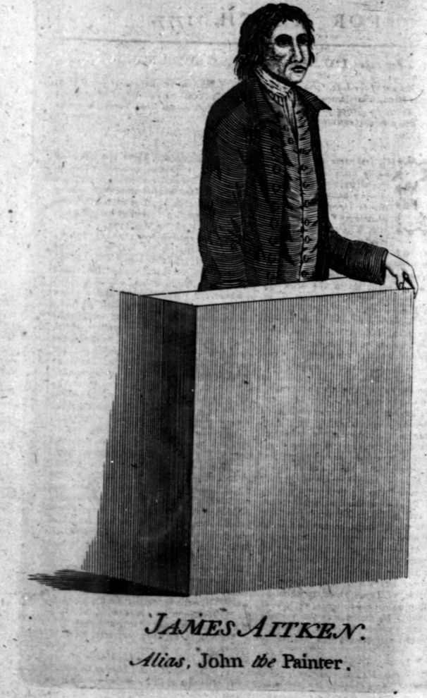
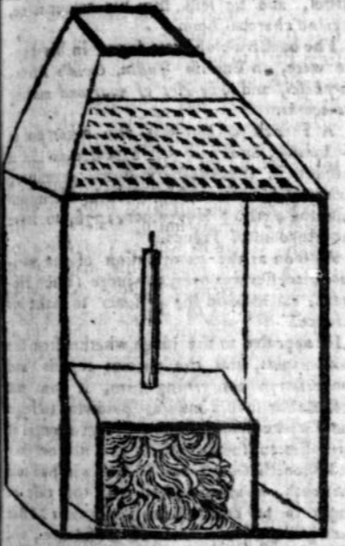

# John the Painter

Jim ??, Nottingham
Festival at the Edge story circle

(facts are actually misremembered)

William James ("peter the painter") 1776

Royal timber yard

 The ship. scotsman. American war; plan to burn fleet. hanged from yard arm, hanged in chains at tide level. Bodyparts stolen. Head in ship.  Haunted upstairs bedroom (hourly rate). Priest. Bishop. ?Old Bob (sold winds; bag tied with wind, open by sailor end of outbound leg, favourable wind back; (survivor bias/wald)). Get rid of ghost. Through keyhole. Don't believe, get into bottle. stoppered. (bottle walled up, rediscovered, keepsake, Titanic)

 

https://en.m.wikipedia.org/wiki/Arson_in_royal_dockyards

https://en.m.wikipedia.org/wiki/John_the_Painter

It's 1776, and Britain is at war with America, but not, for now at least, with France.

His Majesty's dockyards, at Portsmouth, Plymouth, and elsewhere provision and maintain the ships that project British power across the Atlantic.

The dockyards are defended from attack from land and sea. Sea defences guard entry to the ports from the sea; defensive walls protect the yards from land attacks.

At Portsmouth, there's one main gate into the dockyard, near the Hard, where there's still an entrance to this day.

It's winter time. December. Several ships are in Dock, laden with gunpowder to feed their guns. The ships are still sailing ships, which means a large part of the dockyard is concerned with keeping the rigging in order. The long rope house, where ropes are made to feed the rigging, and store houses for hemp from which the ropes are made.

---

On Saturday, December 7th, 1776, a fire broke out in the rope house in Portsmouth dock yard. Over the following couple of weeks, reports appeared in the regional press suggesting that foul play was suspected and that two men had been taken up on suspicion.

https://britishnewspaperarchive.co.uk/viewer/bl/0000189/17761206/013/0003
Derby Mercury - Friday 13 December 1776 (incorrectly given as December 06 by the BNA.)

*Extract of a Letter from Portsmouth, `[Sunday]` Dec. 8.*

"Yesterday Afternoon, about Half past Four o'Clock, a Fire broke out in the upper Loft of the Rope-House in the Dock-Yard at this Place, which entirely consumed that Building, of 364 Yards in length, and about 21 in breadth. Fortunately it stopped there, and did no other Damage. A great Part of the Riggings, Cables, and other stores, deposited in it were saved. There is great Reason to believe it was maliciously set on Fire, as it was perceived to break out at each End, and in the Center, at the same Time; two Men are taken up and secured on suspicion of being privy to the Mischief.

"The Albion, a Brig, with 2000 Barrels of Gunpowder on board, was in Portsmouth Harbour at the Time the Fire broke out; but the Tide being high, was ordered out, and in a few Minutes got quite clear off the Harbour, otherwise it might have proved very fatal to the Town."

https://britishnewspaperarchive.co.uk/viewer/bl/0000230/17761216/004/0003
Hampshire Chronicle - Monday 16 December 1776

PORTSMOUTH, saturday, Dec. 14.

...

saturday night `[i.e. December 7th]`, about a quarter before five o'clock, the inhabitants of this place, Gosport and the Common, were greatly alarmed by fire breaking out in his Majesty's dock-yard here, in three different places in the rope-house, which is occasionally used for the rigging house. The fire was so fierce that in a few minutes the said house, which was four hundred yards in length, and twenty-one broad, was on fire from one end to the other, and the whole building is entirely consumed; the dock-men were all in the yard, when this shocking accident happened; and had it not been for the immediate assistance given by the workmen, and the marines and invalids of this garrison, the different store-houses, particularly one almost adjacent to it, which is full of hemp, must have shared the same fate. How the accident happened is not yet come to light; but by its breaking out in three different places almost in an instant, gives great room for suspicion.

As there was but little wind, and that to the northward, no other damage was done.

An express was sent off immediately to the Admiralty, and on Monday Commissioners suckling and Bratt arrived here in order to enquire into the particulars; but we do not hear that any particular discoveries have yet been made.

It is somewhat remarkable that this building has been burnt down three times within about sixteen years past, and the fires were discovered to break out each time near about the same places of each other, and it is supposed to have been done intentionally. Had it reached the town, which it had like to have done in the year 1770, God only knows what would have been the consequence, the town abounds with faggot piles, particularly the King's bakehouse, where sometimes very great quantities are deposited; and there is often two thousand barrels of gunpowder in the grand magazine, which is situated at the lower end of the High-street: happy for us that but very few were there at this time, and we hope that, through the interposition of the principal inhabitants, before it is too late, these dangerous things, especially the public ones, will be speedily removed out of the town. There was a vessel in the harbour, and very near to the dockyard, with about two thousand barrels of gunpowder on board, at the time of the fire, which was brought from London for the use of this port; but no accident happened from hence, as she was towed out of the harbour by the men of wars boats. If danger was expected from this gunpowder *a-float* what a situation must the town be in when such amazing quantities are in it, and surrounded with fires, chimnies, &c. day and night?

...

A party of the dragoon guards arrived here with 50,000*l.* sterling, to pay the artificers and labourers at this dock yard.

---

https://britishnewspaperarchive.co.uk/viewer/bl/0000235/17761218/010/0003
Kentish Gazette - Wednesday 18 December 1776

COUNTRY NEWS.

*Portsmouth, Dec. 13.* The Comptroller, and several of the Commissioners of the Navy, having been for several days past examining into the state of the Dock-yard in consequence of the late fire, and of persons on whom the slightest suspicions had fallen, but had not been able to detain any one, the suspicions appearing to be groundless. The damage sustained is the rope-house, and a few stores, and rigging to the Princess Amelia, now fitting out, and the workmen's tools. The greatest loss is the want of the rope-house, for now the ropemakers and spinners are going to the other Dock-yards to work until a temporary place can be built for them here, which will take up a considerable time.

--

Further confusion about dates?

http://britishnewspaperarchive.co.uk/viewer/bl/0001407/17761224/007/0002
Kentish Weekly Post or Canterbury Journal - Tuesday 24 December 1776

*Extract of a letter from Gosport, Dec. 15.*

"Last night the Dock-yard had like to have been set on fire again; it had caught fire, but by timely assistance it was got out. Two men were taken plundering, and endeavoured to make their escape, but were prevented."

--

Around the country, 

https://britishnewspaperarchive.co.uk/viewer/bl/0000204/17761214/002/0002
Leicester Journal - saturday 14 December 1776

...

Yesterday several of sir John Fielding's men were dispatched from the Public Office in Bow-street to Portsmouth, in order to apprehend several suspicious persons that are imagined to have had some hand in setting fire to the Dock-yard.

...

---
The following also included the news item that appeared in he Kentish Gazette of December 18th, 1776.

https://britishnewspaperarchive.co.uk/viewer/bl/0000254/17761219/011/0002
stamford Mercury - Thursday 19 December 1776

...

A letter from Portsmouth says, "The late disaster there has put as upon our guard: No person whatever are in future to be admitted into our Dock yard without a proper person to attend them both at coming in and going out, by Order of the Commissioners."

...

A letter from Portsmouth, Dec. 12, says, "The workmen have begun clearing away the rubbish in the Dock-yard, which was occasion'd by the late fire; and the Ropehouse will be rebuilt as soon as possible."

https://britishnewspaperarchive.co.uk/viewer/bl/0000230/17770120/004/0003
Hampshire Chronicle - Monday 20 January 1777

PORTSMOUTH, SATURDAY, Jan. 18.

...

On Wednesday was found in the hemp-house belonging to the dock-yard, (in which is deposited several hundred, tons of hemp) a piece of wood about a foot long, hollowed out and filed with gunpowder, with a tin box at the end about the size of a pound cannister, filled with combustibles, and the top punched full of holes; it was found under a large body of hemp, and appeared to have been set on fire, but had not the effect the perpetrator intended; which, it is supposed, was to have set that room on fire at the time the ropehouse was. From the above circumstances, there cannot remain a doubt but the different fires which have happened in the dock-yard were done by design, and not by accident. The box was on Thursday sent up to the Admiralty.

https://britishnewspaperarchive.co.uk/viewer/bl/0000235/17770122/015/0003
Kentish Gazette - Wednesday 22 January 1777

A letter from Bristol, dated January 6, says,

Last night, or early this morning, a diabolical scheme was discovered for destroying the whole shippings and greatest part of this city, but, thank God, it proved abortive. Combustibles were laid in four ships, at a great distance from each other, and supposed intended to take effect at the same time; only one of them however got to any head, and that was very miraculously put out; at the same time a box of combustibles was conveyed into an oil warehouse, but that also missed of the desired effect. The whole city are in great consternation, and God only knows where it will end. Five hundred guineas are offered for the discovery the incendiaries."

A letter from Portsmouth, dated Jan. 16. says,

"Yesterday was very fortunately discovered, by the removal of some hemp, in the great hemp storehouse, in the Dock-yard, at this Port, a piece of wood hollowed out and filled with combustible matter, which was covered with tin, full of holes, to admit air, and a tube and match to each end. This instrument had been secretly conveyed under some refuse of hemp, with evident intention to set fire thereto. There is reason to believe, the match had been lighted, but providentially went out before the machine took fire. This discovery may tend to convince the Public, that the three late fires in the Dock-yard, which by many were imputed to accident, were perpetrated by some incendiaries. It is to be hoped that such measures will now be taken as may effectually prevent these great calamities in future, and that such enquiries will be made as may lead to conviction and punishment of the offenders. If this contrivance had taken place, it would have happened at a period when many persons are inclined to think we are at the eve of a foreign war; and so considerable is the present stock of hemp, that if the discovery had not been timely made, the consequences might have been fatal."

---

The previous "letter from Portsmouth, dated Jan. 16." was preceded in the following by an additional commentary:

https://britishnewspaperarchive.co.uk/viewer/bl/0000239/17770121/003/0004
Manchester Mercury - Tuesday 21 January 1777

It now appears that the late Fire which happened at Portsmouth Dock Yard was premeditated and malicious, and although it had not the desired Effect of our Enemies most ardent Wishes, yet nothing is more certain than their diabolical Intentions; for on Wednesday Morning, in clearing away the Ruins of the Rope-walk, to begin its rebuilding, a Tin Box, curiously constructed, holding Matches, and a Vial of spirits of Wine, was found. The Matches were in a great Measure burnt out, and too great a Quantity of Flax and other stuff thrown upon it, not given it sufficient Air, had extinguished it before the expected Explosion of the spirits took Place; to whom we are indebted to for this Time and a suitable Reward are the only likely Means of discovering; but it is generally supposed some Persons connected with the American Rebels.

https://britishnewspaperarchive.co.uk/viewer/bl/0000246/17770125/005/0002
Norfolk Chronicle - Saturday 25 January 1777

A private letter this day from Bristol says; that last Monday night another attempt was made to burn that city; that a fire broke out near Wells's sugarhouse; and another in a hay-loft; that a candle was found lighted at both ends amongst some shavings, and some combustible matters lay near both places.

...

By a letter from Bristol we learn, that as the Constables were conveying a man to Bridewell on suspicion of the late horrid attempt to fire that city, he told them that if they would let him back to the Council-house, he would discover something of moment; when he came there, he took out of his pocket a tinder-box and some gunpowder, and said that it was intended to set fire to an Alderman's house.

https://britishnewspaperarchive.co.uk/viewer/bl/0000230/17770127/009/0002
Hampshire Chronicle - Monday 27 January 1777

FIFTY POUNDS REWARD

WHEREAS there is strong reason to suspect that the Ropehouse in his Majesty's Dock-yard at Portsmouth was, on the 7th of December wickedly and maliciously set on fire, and whereas several attempts (some of which have taken effect) have been made to set fire to the city of Bristol, and there is reason to suppose the incendiary or incendiaries may have been the same in both cases, the following description of a person who was seen in the Ropehouse in Portsmouth yard on the day the said fire happened, and whose conduct was suspicious, is now published, in hopes that, on his apprehension, some light may thrown on these two dreadful transactions:— He was called JOHN, and is a PAINTER, said he worked as such last summer with one Golding, at Titchfield, in Hampshire; he is about twenty-five or twenty-six years of age, about five feet seven inches high, rather thin in person and thin visaged, smooth faced, of a fair complexion, with whitish eye-lids, wore his own hair, which is of a light sandy colour, neither tied nor curled, he had on a chocolate coloured surtout coat faded, a rusty hat, rather smartly cocked, with a fantail behind.

Whoever will apprehend the said JOHN, and bring him before a magistrate, or give such notice as may be the means of his being apprehended, so that he may be produced to his Majesty's Commissioners of the Navy or to the Commissioners his Majesty's Navy in London, shall receive FIFTY POUNDs Reward, to be paid by the said Commissioners; or if the said person, knowing himself to be innocent, will voluntarily appear before Commissioner Gambier at Portsmouth, or the Commissioners of London, he shall himself be entitled to the same reward.

https://britishnewspaperarchive.co.uk/viewer/bl/0000230/17770127/006/0003
Hampshire Chronicle - Monday 27 January 1777

*Letter from Bristol, to the Printers of the Hampshire Chronicle, dated Jan. 22, 1777.*

"A discovery was made on Thursday morning last of a most wicked and diabolical plot, which might have terminated in the general conflagration of this city, the loss of many lives, and the total ruin of thousands. Early in the morning a fire broke out on the deck of the Savannah La Mar, a vessel belonging to Messrs. Meyler and Maxse, lying at the quay, and bound for Jamaica, which, before it could be extinguished, communicated itself to the mizen mast, and did other damage. It evidently appeared to have been designedly done. This opinion was soon after confirmed by the discovery of some combustible materials placed on board the Fame, lying a distance from the Savannah La Mar, and destined for the same voyage, which fortunately did not take the like effect. A third attempt was made on the Hibernia, Capt. Knethell, a Corke trader, situate at another part the quay, on board of which was found a bottle of turpentine besides other inflammable matters. The intended wickedness of those villains did not stop here, for they broke open a warehouse of Messrs. Morgan and Sons, druggists, in Cypher-lane, Corn-street, and therein set fire to a box, in which they had also put some combustibles, which happily went out. Several pieces of touch paper were found just by.

"Their first attempt having proved abortive, on Sunday morning a second was made to burn the town, which proved rather more successful than the first; for about seven o'clock the most dreadful fire known here for many years broke out in the warehouse belonging to Mr. A. Brown, bookseller, in Quay-lane, which communicated itself to several others, and in about four hours three large warehouses, containing a great quantity of Spanish wool, belonging to Messrs. Lewsly and Co. and some oats, value 240*l.* belonging to Mr. Naish, were entirely consumed.

"Before eight o'clock Quay-lane seemed all in a blaze; six warehouses are destroyed; and the Bell, in Broad-street, where Mr. Ferguson used to read his lectures, was five times on fire, and was as often providentially extinguished, otherwise Broad-street and Small-street would probably have been destroyed. A malt-house adjoining to St. John's Church was pulled down to preserve the church, the lead of which was melted.

"Matches and other Combustibles were found in warehouses, which it is imagined were placed there in the night; and there remains not any doubt of its being maliciously done, as the occupiers never suffer a candle to be carried into the buildings; and what is very extraordinary, the watchmen went their rounds by this place at six o'clock, when there was neither the appearance of fire nor smoke, or even the least smell of it, and yet by seven o'clock the flames were got to such height as to leave no hopes of preserving the buildings then on fire.

"About the time the fire broke out, a quantity of combustibles were found on the quay, among a number of barrels of oil, but providentially the match put thereto did not take effect. I saw some of the combustibles, which seem to be a compound of rosin, pitch, gunpowder, oil, and other inflammable matter.

"The city was in an uproar the whole day, and the magistrates attended in the council chamber to require informations, and devise matters for our future safety. The several inhabitants in the different wards met last night, when it was agreed, that a certain number of reputable tradesmen should patrole the city the whole night, and it was my lot to be of the number; and I have the satisfaction of saying, that gentlemen of the first fortune amongst us, cheerfully engaged in the office, without trusting their clerks or servant. This method is to be continued every night for some time.

"The damage cannot at present be certainly ascertained, but it is estimated at least to be 15,000l. The fire was totally extinguished about one o'clock.

"I do not hear of any discoveries made of the wretches concerned in the above diabolical plot; but it is hoped it will be brought out, as the following ample rewards are offered, viz. one thousand pounds by his Majesty; one hundred guineas by the Mayor and Aldermen Bristol; one hundred guineas by the society of Merchants Venturers; one hundred guineas by Messrs. Meyler, Maxse, Davis and Prothroe; fifty guineas by Messrs. Morgan and Sons; one hundred and fifty guineas from the Fire  Office in Bristol, and his Majesty's pardon to an accomplice."

https://britishnewspaperarchive.co.uk/viewer/bl/0000230/17770210/002/0002
Hampshire Chronicle - Monday 10 February 1777

Friday 3000 marines marched into Woolwich, who are to guard the dock and rope-yards. This appears necessary, because it is easier to prevent evil, than to remedy it.

The Lords of the Admiralty have ordered detachments of marines to march immediately lo all the King's dock-yards throughout the kingdom.

...

We are informed, that letters have been received from Harwich, purporting an attempt to set the dock-yard there on fire, which was happily prevented.

https://britishnewspaperarchive.co.uk/viewer/BL/0000230/17770203/006/0001?browse=true
Hampshire Chronicle - Monday 03 February 1777

A few days previous to the eruption of the fire at Bristol, a person came there who was at first perfectly a stranger. He took lodgings in the city, and while he was burning one of his shirts to tinder in his room, he was seen by the husband of the woman of whom he had hired his lodgings, who recognised him, and remembered to have seen him at Portsmouth previous to the fire which broke out in the dock-yard of that place. The man, after this, took the earliest opportunity of leaving the house, and has not since been heard of. On searching his lodging, it appeared that he left behind him the consumed shirt, a quantity of combustibles, and tin cases and his little library, which consisted of all the pamphlets respecting America, written and published by Doctor Price, and a volume of Voltaire's works, with the leaf turned down, in one the pages of which the account the massacre of Paris began.—Extraordinary as this article may appear, we fear there is too much reason to believe it is founded in fact.

https://britishnewspaperarchive.co.uk/viewer/bl/0000230/17770203/004/0003
Hampshire Chronicle - Monday 03 February 1777

A letter from Bristol, dated Wednesday morning, says, "The Mayor's officers are now in pursuit of a person that answers the description of the man who set fire to Portsmouth-dock. And last night a great quantity of combustibles were discovered in old house upon the Butts (on st. Augustine's-back). You see they are determined to do the mischief near the shipping. Wind to the northward at that time."

...

It is said that the person described in the advertisement from Portsmouth (see the first page as suspected of being concerned in setting fire to the dock-yard, is taken up in the Isle of Wight.

TH: Widely syndicated below, a report of the following form. The Isle of Wight reference is suspect?

https://britishnewspaperarchive.co.uk/viewer/bl/0000071/17770201/006/0002
Ipswich Journal - saturday 01 February 1777

E. Country News

Portsmouth, Jan. 27. A man, advertised by the name of John the Painter, and supposed to have been concerned in setting fire to the dock-yard rope-house, was sent from hence under a guard for London. He was taken in the Isle of Wight.

https://britishnewspaperarchive.co.uk/viewer/bl/0000230/17770210/003/0003
Hampshire Chronicle - Monday 10 February 1777

Portsmouth, saturday, Feb. 8.

...

The man advertised by the name of John the Painter, on suspicions of setting fire to Portsmouth dock, was last week apprehended and committed, to Odiham goal in this county, from whence he was taken on Monday by sir John Fielding's men and examined on Tuesday at the Public-office in Bow-street, before sir John Fielding, and several Lords of the Admiralty. Two or three gentlemen from Bristol also attended. The man says his name is James Hill. He behaved in a very artful and reserved manner during the whole time, and refused to answer many questions which were put to him. He was re-examined yesterday before sir John Fielding and several Lords of the Admiralty, when the woman in whose house he lodged at Portsmouth, a short time previous to the setting fire to the dock-yard, appeared, and gave the following information:— that the prisoner hired lodgings from her a fortnight or three weeks, but the day after his coming into her house, she discovered a great deal of smoke, attended with a disagreeable smell, which she apprehended to proceed from turpentine, frequently to come out of his room, which greatly alarmed her; that she once went up to his room, but could find nothing that could lead to a discovery; but the next day, the smell continuing, she abruptly entered his chamber, where the smoke was very violent, when she found a tin box, something in the form of a cannister, which contained combustibles; likewise a tinder box, matches, and other things, which so alarmed her, that she insisted on his instantly quitting the house. A tin-box was shewn to her, which was found in the rope-house, which she said was the one she saw in the prisoner's room, or as like it as one thing could be like another: her evidence was very clear, and seemed to be delivered with great candour and honesty. Many other presumptive proofs were adduced, to suspect him to be the principal agent in this infernal business. He appeared very sullen, and refused giving any satisfactory answers, though often applied to by sir John, and the Lords of the Admiralty, who attended the examination. As other proofs are daily expected, the prisoner was remanded for another examination.— He was committed to Odiham Jail, in Hampshire, on positive charge of a burglary in Calne Wiltshire, and from thence transmitted to London to be examined on the above charge, which was discovered on his apprehension from his answering the description, and some combustibles found on him.

...

*Extract of a letter from Gosport, Feb. 2.*

"The Southampton, Captain Garnier, commander, is fitting with all expedition. In her passage home she met with a vessel which appeared to be Dutch; but the sea running very high could not board her; only spoke to her, and she giving a very good account left her; but the Thetis met with her since, and has taken her. she proves to be a very good prize, and has a great many dollars on board.

"The following discovery has been made: A man belonging to Mr. Pike's brewhouse of Portsmouth letting lodgings, a man went to lodge at his house, and there always being a great smoke, and strong smell of turpentine, they could not bear it, and often told the man of it, but to no purpose, and they looked upon him to be a quack doctor. He being out one day, and a great smoke arising, the landlady thought the room was fire, and went up stairs, and let the smoak out; but going to open the window, saw the cannister with matches that was lately found in the Ropehouse, but did not know then what use it was for. However, after mentioning it to her neighbours since the fire, they persuaded her to go and look at the cannister in the dock-yard, which she did, and has taken her oath that it is the same which was in her chamber where the man lodged. she likewise says that the man left her house the very morning before the fire broke out at the dock-yard. The man answers the description given of him in the dock. The woman says he changed his cloaths everyday.

https://britishnewspaperarchive.co.uk/viewer/bl/0000230/17770217/003/0003
Hampshire Chronicle - Monday 17 February 1777

Tuesday John Hill, the painter, charged with setting fire to Portsmouth dock, and Bristol, and likewise with a burglary at Calne, in Wiltshire, underwent a private examination before sir John Fielding, in Bow-street, and some gentlemen from the Admiralty; he was allowed to sit on a stool. He was asked,

Was you ever at southampton?

I don't chuse to make any answer to that question.

Was you ever at Titchfield?

No.—

Did you paint a gentleman's house there (mentioning the name.)

I know nothing of the gentleman.

Did you ever hold a conversation or correspondence with an Aid de Camp to Mr. Washington?

I don't know Mr. Washington.

Do you know a man called General Washington?

I have heard of General Washington.

Then you know General Washington, but you don't know Mr. Washington?

I don't chuse to answer that question.—

I am here personally to suffer upon proof of any crime brought against me, but I don't understand the law.— I am poor, and have nobody to advise with.

If you want counsel you shall have it. Is there any body, or any counsel in particular you could wish to advise you?

Yes.

Who is it?

The best.

Two or three more questions of very little importance were asked him; but a gentleman from the Admiralty not arriving in town as was expected, Hill was remanded to Clerkenwell prison. It appears that he is a very sober man, does not mix with the prisoners, and confines himself to his own apartment. He is a scotchman, and, by his accent, from the North-west part.

Wednesday at the Public Office Bow-street, John Hill, alias John the Painter, was examined; a letter from Mr. Brothers, at Fairford, in Gloucestershire, dated the 9th instant, was read, giving an account of his shop having been broke open some time ago, and robbed of hosiery and handkerchiefs; that he had traced some of the things stolen far as Tetbury, in the said county, where they had been disposed of by a man who went by the name of John Hynes, and who answered the description given of Hill, in the Gazette; and that the person who had disposed of the stolen property, had a wound in his right breast, near his shoulder, as if by bullet. Jennings, who had examined the prisoner in Tothill Fields Bridewell, at the desire of the Justices, deposed, that he had a wound similar to that mentioned by Mr. Brothers; the prisoner very freely shewed his breast in the office, and the wound appeared there as Jennings had related. Another letter, dated from Exeter the 7th inst. signed James Carrington, was read, which stated, that a person, who answered the description of Hill, came to that town the 28th of December last, and worked there as a painter; that he lodged with ———— Payne, in that city, and went from thence on the 31st of December, staid away till January 8, and then returned to his lodging; that he then said he had been in Plymouth dock for three days, and had set up there three nights; that he afterwards set out from Exeter for London, and told Payne, in confidence, that unless he was imprisoned, he should hear *from* him, and even if so, should hear *of* him shortly, with some other ambiguous expressions. The Magistrates gave orders, that the parties should be sent for from Gloucester, Tetbury, and Exeter, and Hill was remanded for further examination.

https://britishnewspaperarchive.co.uk/viewer/bl/0000230/17770303/004/0003
Hampshire Chronicle - Monday 03 March 1777

WINCHESTER, saturday, March 1.

Tuesday night, arrived, here, under the care of four of sir John Fielding's men, the noted John Hill, alias John the Painter. He is strongly guarded, and loaded with heavy irons; no one is permitted to converse with him, and he is constantly attended by one of the above men. His trial for setting fire to the dock-yard at Portsmouth will come on early in the assizes, which begin on Tuesday next. Much information is expected on this important trial, and a very great concourse of people will be drawn here on this event. Lodgings are already provided for Lord sandwich and the rest of the Lords of the Admiralty, sir John Fielding, &c.

He hath appeared on his several examinations, an artful, hardened, fellow, —one instance need only be recited as a confirmation of it, and which, we are assured, is true. Being closely urged to discover his accomplices in those dark schemes, and accept his Majesty's pardon, he replied, *that hi did not desire to receive mercy from such a King and such a Government*.

If John the Painter should not be convicted at our assizes, for the fire at Portsmouth, he will be removed to salisbury, to take his trial, for a burglary, at Calne, in Wilts; and if then cleared, is to be tried at Gloucester, for a burglary at Fairford.

https://archive.org/details/bim_eighteenth-century_the-life-of-james-aitken_aitken-james_1777_0
The life of James Aitken, commonly called John the Painter, an incendiary, who was tried at the castle of Winchester, on Thursday the 7th day of March, 1777, and convicted of setting fire to His Majesty's dock-yard, at Portsmouth ... taken down from
by Aitken, James

Publication date 1777

https://archive.org/details/bim_eighteenth-century_the-whole-trial-of-john-_aitken-james_1777
The whole trial of John the Painter, for setting fire to the rope-house at Portsmouth, which came on at the assizes held at Winchester, on Thursday last, the 6th of March, 1777.  1777
by Aitken, James

Publication date 1777

https://archive.org/details/bim_eighteenth-century_the-trial-at-large-of-ja_aitken-james_1777/mode/1up
The trial at large of James Hill, otherwise James Hind, otherwise James Aitken, commonly known by the name of John the Painter, who was tried and convicted at the assizes held at Winchester, on Thursday March 6, 1777, ... for setting fire to the rope-house in His Majesty's dock-yard at Portsmouth, ... together with the confession ... also the particulars of his life, ...  1777
by Aitken, James

Publication date 1777

https://archive.org/details/bim_eighteenth-century_a-short-account-of-the-m_aitken-james_1777

A short account of the motives which determined the man, called John the Painter; and a justification of his conduct; written by himself, and sent to his friend, Mr. A. Tomkins, with a request to publish it after his execution.  1777
by Aitken, James

Publication date 1777

A SHORT ACCOUNT, &c.

Was born to no fortune. My parents, who were honeſt, induſtrious tradesfolk, did not however ſuffer me grow up without ſome education. The maſter of a neighbouring country ſchool taught me to read and write, and my own inclination led me to ſtudy all the books which fell in my way, and were not above my comprehenſion.

I thought it neceſſary to mention this much, to pret any ſurprize in the learned reader, who will find in few following pages ſome marks of hiſtorical and er reading The reaſoning he will meet is ſuch as man in ſuch circumſtances as mine muſt have uſed to give him courage enough to undertake. the boldeſt attempt that has been made for many years.

And before I enter upon the motives which determined me to this great action, I would beg the people of England, to lay down their prejudices for a moment. My blood is ſome attonement for my crime, if it was one. If not, (and I hope I ſhall be able to ſhew it was not) though the Courts of Law have condemned my body to death, the people ought not to paſs a like ſentence on my fame.

Being born an American, I conſidered America and England, whilſt they were united, as my native country; and from the time I firſt began to think the love of my country was my ruling paſſion, I would have run any riſque, faced any danger, to do my country a ſervice. Had there been a war between England and France upon juſt grounds, I am perſuaded I would as ſoon, nay ſooner, have entered Breſt and Toulon, to do our natural enemies a miſchief, than I did Portſmouth to burn the Dock; and that I would on ſuch an occaſion as little dread the *French* wheel as before my trial I feared the *Engliſh* gallows.

And in this ſpirit of ſerving my country, all the good books I ever read confirmed me. To be accounted an hero after one's death, ſeemed to me to be better than to wear a crown during one's life. For as the wiſe man ſaith, "The things of this world paſs away quickly."  What ſignifies worldly grandeur, when ſuch vile men as Nero, and Domitian, and Caligula, in old Rome, or as Henry the 8th, or James the 1ſt, or Richard the 3d, of England, wore purple garments, and were called Kings and Emperors? Who would not rather be old Codrus, or Cato, or ſuch a man as our Mr. Sydney, who bled upon Tower-hill for defending Liberty and the Proteſtant Religion, than any one of that naſty groupe? To be ſure the Kings ſlept upon ſofter beds, and fed upon richer neats, and drunk better wine, and more of it, than the Patriots, but then mankind do not look up to them now, andbleſs them, as their guardians and benefactors.

So that a good name appeared to me to be better an riches. To get this good name in a very high degree I thought we muſt render ſome very great ſervice to our country. No opportunity offered till the breaking out of the war between *America* and *England*.

Before I bound myſelf to either ſide, I endeavoured to examine (as the merry Mr. Stephens begs us) both ſides of the queſtion, I thought it hard of the government here to tax the Americans (my countrymen) without their conſent, particularly as they did not refuſe to tax themſelves. I thought it ſtill harder, inſtead of hearth money collectors, exciſe and cuſtom-houſe officers, and the other people who gather government money, that ſoldiers ſhould be ſent acroſs, to turn their pockets inſide out, and ſhake all the money there into the —--s. And what was ſtill the hardeſt of all, goverment ſhut up their harbours, took away their fiſheries, and ſent twenty or forty thouſand innocent people to beg or ſtarve.

As my countrymen were Engliſhmen in every ſenſe of the word, they reſolved to loſe all their blood ſooner than any of their liberties. They took up arms. And they were on the right ſide, and had Justice with them. I declared for the liberties of the Colonies, and determined to die free, ſooner than live a ſlave.

TO DO

As ſoon as the armies on both Shen came to action, a In I ſaw the havock of my countrymen, my blood boil

= 7 . 2

Within me. Poor Jack Turner, who was both good an

FT 

1 wy

+ <1"

YL F
1

charitable, who had married a wife he loved, and had five young children, I ſaw him with his ſkull broken, and his brains knocked out with a Heſſian muſquet.

To mention all I ſaw, to reckon up all the brave men who periſhed on both ſides, would make any good Chriſtian's heart ache. God forgive the men who begun this war, and begin every war without good reaſon! To ſee the poor people flying from the coaſt to the back ſettlements, and turning every now and then to ſee their houſes in a flame, to ſee the ſteeples and churches, the market-place, the ſquares and ſtreets of the cities they dwelt ſo long in, ſet on fire by the ſoldiers, and blazing at once up to Heaven ---I ſay again, God forgive thoſe who can deal ſo inhumanly with their fellow creatures!

I conſeſs I was not at that time ſo charitable in my wiſhes for the enemies of America. Our ſufferings enraged me. I determined to do ſome notable action, that would ſhew how much I loved my country. I even then determined, as the force of England conſiſts chiefly in their ſhipping, to ſtrike them to the very heart, by burning the ſtores at Portſmouth.

How I miſcarried in my attempt---how I was tried for it, and was convicted of it, would be needleſs 0 mention here, as the public papers have already ſpreadf the account through England, Ireland, Scotland, and]

America.

9 It is natural for the people here to condemn the ; action; but not more juſt than in the followers of Porſenna, King of ſome little territory in 1zaly, to blame the] gallant Roman who entered Porſenna's camp in aifuiſe with an intention of aſſaſſinating him. Our motive, were the ſame. He attacked the King, who was an enemy . to Rome. I attempted to burn the magazine, that” would be ruinous to America. Love of country was the motive of both; of me, FJobn Moxam ; of him, Mutiu Scavola. And they who approve the a& of that great. | minded Roman, cannot, without inconſiſtency, condemu} L mine. | | | I I.

r It is eertlin to any one who conſiders without preju}

dice, that my motives muſt be as pure, and my reſolution as fixed and heroic, as thoſe of any of the great men of

1

antiquity. Curtius, who rode down the gulph, did nof

go to more certain deſtruction than I. Codrus, whom

a

1 1 4

1 L

f 123 the enemy's centinel to ſtab him, did not court deſtruction more ſurely. They were victims offered up for their country's good---noble ones indeed! and ſo

o N ad was I. But with this difference. dl 3 . ON: 1 When Curtius entered the gulph, a crowd of Romans

F ſtood on the brink of the precipice, applauding the ſpirit

hf Pf the young hero, and panting for a ſhare in his glory. 74 How muſt his heart have ſwelled with honeſt pride to

hl pontemplate his great ſuperiority over ſuch a nation as ie, the Roman! and to conſider, if he had time in that moent of ſelf-congratulation, that he would be propoſed, as model of generous patriotiſm, not only to the youth of

hat Þis own country, but to men of all ranks i in all quarters

It the world |

ves

This was a reward I had not. No one ſtood by to 5 pplaud my act. I was in the country of an enemy. The people of this country too heated againſt me and my 9 Puntrymen. No favour, no affection, either to the part Wrformed, or the principles upon which 1 acted. On eju'Y Re contrary, I muſt be eſteemed and puniſhed as a crition Wnal by the laws of this country. The people would

| 4

n o hor me for an attempt to in their navy. I had no lace to look for claifort but in my own heart. That [

| danger, for the ſake of advancing the freedom of my country, and checking the power that would take our li- 1

Whatever injury they offered the Continent, we e had a

9 — 1 5 a

4 » ? « CE

indeed told me I was a lover of my country, and an he- ; roic one; that I underwent much fatigue, expence, ahd 4

berties from us.

Ca which whe not a Kundatioe of 5 If bo Miniſtry here burned our harbours, we could not be! wrong in doing an harm to theirs. If they burned our towns, and ſlaughtered our people, we had an equal right to burn their cities, and ſlaughter their inhabitants.

right to retaliate on Great Britain.

I know ave are many who will make a fooliſh diſtinction between the act of armies, and of a ſingle many as one. They will ſay it was baſe and treacherous to come into their country privily, with an intention of doing it an Injury ; ; — a great deal more of the ſame 4 kind. # | 3

12

To „ ehiofe I will abbr, that the world has judged ways wrongly in this point. Do beating drums, and colours, purge a band of robbers and murderers of guilt? Does it ſignify as to the nature of the crime, whether he who commits it wears a red coat or a brown?

Whether he holds a painter's bruſh in his hand, or a ge2 Feral s truncheon? An army may be called an army; but if this army fights in an juft cauſe, cuts the throats,

plunders the houſes of a people, every man in this ng chess my who aſſiſts in this unjuſt cauſe, is not more or leſs an a murderer and a robber. A reaſonable Fudge) oui pth ſufficient power, would — up c_ man of Dem.

wal 5

Ats * 3 „ 1 As to my coming privily into the country, it ſhews

id © 3 Has

Wat our fade cannot do things openly and above board, as he Miniſtry do. Why can they not? Becauſe they are 

 ſtrong enough. Their weakneſs ſhews very evidently Ichink that they would not give the firſt ſtroke in this

n ar, (Anglici rebellion) but that they were boxed and pro-

” * pked before they would venture to return the blow. Now

they did not give the firſt blow, and were not ſtrong

enough to reſent it in the field, what were they to do? Were they to fit quiet and ſay, Do, gentlemen, demoiſh our towns, burn or take our ſhips, kill our people,

ſeize our grounds, and do with us what you pleaſe. We 1 57 

Would I, when I knew him to be a much ſtronger man, better armed, and more expert in the management of hig

nor ſo well armed or diſciplined as the Engliſb, and thei

down, and ſuffer our throats to be cut tamely ? Everj

+ a |

cannot meet you *fairly* in the field, and we will take no other method of redreſſing ourselves."

If a robber broke into my houſe, with an intent to plunder it, and kill all my family, would I make it a point of honour to call this robber out as a gentleman? Would I, when I knew him to be a much ſtronger man, better armed, and more expert in the management of his weapons, give him a *fair* chance? I ſhould be thought a madman if I did not take any advantage of him; if I did not ſtab him in the dark, when an opportunity preſented itſelf.

TO DO ABOVE

And now, when America is invaded, as it appears to me, (and to many of *the greateft men in England* beſides me) unjuſtly, are we, becauſe our armies are not ſo large, nor so well armed or diſciplined as the English, and their clean-handed friends the *Heſſians*---are we, I ſay, to ſit down, and suffer our throats to be cut tamely, Every American, who believes his cauſe to be a juſt one, ought to exert himſelf in whatever way he can be ſerviceable to his country. If in the field, let him carry arms; if not let him light a torch. His enemies ſurround him. If he cannot deſtroy them by open force, he muſt by ſtratagem.

And now, ſince this world is almoſt paſt, and another approaches, may I be received according to deſerts. I have meant honeſtly, and acted in my own apprehenſion gloriouſly. If my heart acquits me, I value at very little the verdict of a jury. My generous countrymen will weep blood over me. My name will be famous in their annals to all eternity. My ſoul will be ſhortly in the hand of him who made it. Let the executors of the law wreak what vengeance they pleaſe on my body, I am ſatisfied in my own conſcience, and in that perſuaſion leave the world whenever it ſhall pleaſe God to call me out of it. May he be merciful to me! as my intentions were upright.

*Amen.*

Thus I hope I have anſwered people who would have found no fault in me, had I fought in America, and died a common ſoldier. But they think it monſtrous, and riſible, and I do not know what, to attempt to burn oy Dock at Portſmouth, not conſidering how many docks, and towns, and ſhips of ours, have been burned by their ſoldiers in America.

The more I think upon what I have done, the better am I pleaſed. I die, as the greateſt men have died, in attempting, without ſucceſs, to ſerve my country. My death gives me very little trouble. Life is at beſt but ſhort. A fit of the gravel, a fever, a fall from an horſe, the moſt vulgar diſorder, the moſt common accident, may end it. Beſide, what was life to ſuch a man as me, without ſomething to diſtinguish it?

The gentleman of the Houſe of Commons, who thinks he does wonders when he raiſes the price of his conſcience a few pounds more than he could in reaſon expect for it, may laugh at me for ſuch notions. So no doubt will the merchant, who ſpends his whole life in cheating and over-reaching, not in ſerving and benefiting the country to which he belongs. I do not care a rum for the opinions of ſuch men. Let the courtier go on and lick up the ſpittle of the Miniſter or his uncerlings. Let the rich Alderman doze over his accounts in the morning, and his turtle at night. I would rather die on the gallows for ſuch a crime, (as it will perhaps be called) than live like ſuch poor creatures, to die at laſt of a p?? or a ſurfeit.

The people of England may perhaps condemn my action as a very vile one. The Americans will extol it as very noble. I may be curſed here as a very bold, infamous fellow. There I ſhall be ſung about through the towns and villages, as a martyr to my country. Here I may be gibbeted and frighten crows; there a grateful people will erect ſtatues to their PATRIOT, and remember my name with honour. I do not value the reproaches of the people here, becauſe they are the reproaches of a people ſliding into -------; I would wiſh to have the praiſes of the Americans, becauſe they love freedom.

Beſide, if people find fault with the TREACHERY, as I know ſome will, let them conſider that treachery and underhand dealing did not begin on our ſide; let them reember a certain LORD who acted the firſt deceit practiſed on either fide; him I mean who forged the notes of the Congreſs. His treachery was as great, nay greater, than mine, as I can prove very clearly.

For what could I burn at Portſmouth, which ſome caſh could not repair? Had I forged a draught or draughts on the Bank of England to the amount of the ſtores in Portſmouth, the loſs to the nation muſt be as great as if thoſe ſtores were burned. I do not know, upon a nice calculation, whether it would not be greater.

But the right honourable and the right honeſt Lord who forged the paper money of America, might have held on his hand to the higheſt amount, if he had not been detected in time. The loſs to America muſt have been greater, as they are more poor and more unprovided than the Engliſh in all things. The forgery was more baſe and more cowardly than the attempt to fire the Docks. He ran no riſque. But the burning of Portſmouth could not be done without the greateſt danger.

But if, inſtead of burning Portſmouth, we were at war with France, and I had ſet fire to the magazines at Breſt, what a glorious fellow people would think me! There is not a porter or punch houſe in London where my health would not be toaſted. Brave John the Painter would be the word! and all England would ring with it.

Now that I have attempted to ſerve my country truly, and after the example of the greateſt men in hiſtory, a few of whom I have mentioned, and many more I could mention, the *Engliſh* will curſe me as a traitor. So should the *Puritans* have curſed Colonel Rumſey (I think that's his name) if he had attempted to aſſinate *Oliver Cromwell*; and ſo would the *Etrurians* haved curſed *Scaevola* if he had ſucceeded in killing their King *Porſenna*. Why? Becauſe Cromwell was a convenience to his party -*Porſenna* to his kingdom. But REASON, that has nothing to win or loſe, will ſpeak without prejudice, and ſay, that the acts of thoſe two men were heroic. Why? Becauſe the attempt was made in favour of their country. This ſame REASON will likewiſe ſay, that my attmpt, however diſagreeable and inconvenient to the *Engliſh*, will ſhine as much as either in hiſtory. The *Engliſh* cannot be impartial judges of my conduct. Their intereſt is a ſtumbling block to their reaſon. They ſtand in the ſame point of view as the Puritans and the *Etrurians* above-mentioned.

https://britishnewspaperarchive.co.uk/viewer/bl/0000532/17770120/003/0003
Gloucester Journal - Monday 20 January 1777

TO DO

GLOCESTER, January 20.

*Bristol, January 18.* Tuesday last a general meeting of the citizens was held at Guildhall, pursuant to a public advertisement, to consider of an address to the King, on the late success of his Majesty's arms against the rebels in America, Alderman Mugleworth in the chair.—The business was opened by George Daubney, Esq; in a sensible, judicious and well connected speech; in which the occasion of the meeting and the propriety of an address at this time were shewn;—and whilst he pathetically lamented the unhappy delusion of our fellow subjects, and the fatal necessity of our having recourse to arms to vindicate the rights of Britain, he fully and firmly supported the measures made use of, as the only one left us to reduce those rebellious people to their allegiance and subordination to the British government. The speech was so well received by the assembly present, as numerous and respectable as was ever known on a like occasion, that on putting the question, whether an address should be presented or no, not a dissenting voice was heard. An address was then produced and read aloud twice, it was submitted to the approbation of the meeting, when only one person at the lower part of the hall opposed it, who giving no reason for it, he was turned out by some near him, and it was then unanimously agreed to and signed.—The following citizens, were proposed... Esqrs. It was then agreed that sir James ..Esqr. .., B. Chester and Rich. Combe, Esqrs. members of parliament, be desired to attend the deputation—and that his Grace the Duke of Beaufort, and Lord Clifford, be visited upon by the gentlemen deputed, to request the honour of their attendance also on the occasion.—It was ordered, that the address should remain at the Taylor's-hall 'till saturday evening for signing.

Thursday morning a providential discovery was made of a most diabolical plot, which might have terminated in the general conflagration of this city, the loss of many lives, and perhaps the ruin of thousands.—Early that morning a fire was perceived on the deck of the savanna La Mar, a vessel belonging to Messrs. Meyler and Maxse, lying at the Quay, and bound for Jamaica, which, before it could be extinguished, communicated itself to the mizen mast, and did other damage. It evidently appeared to have been designedly done. This opinion was soon after confirmed by the discovery of some combustible materials placed on board the same, lying at a distance from the savanna La Mar, and destined for the same voyage, which fortunately did not take the like effect. A third attempt was made on the Hibernia, Capt. Knethell, a Cork trader, situated at another part of the Quay; on board this vessel was found a bottle of turpentine, besides other inflammable matters. The intended wickedness of those villains did not stop here, for they broke open a warehouse of Messrs. Morgan and sons, druggists, in Cypher-lane, Corn-street, and therein set fire to a box, in which they had also put some combustibles, which happily went out. several pieces of touch-paper were found just by. As liberal rewards are offered for apprehending those daring offenders, 'tis to be hoped they will be speedily brought to justice.

The following Advertisement appears in saturday night's Gazette.

*st. James's, Jan. 18.* Whereas it has been humbly represented to the King, that in the night of Wednesday last the 15th instant, or early in the morning of Thursday last the 16th instant, the ship savannah La Mar, lying near the Crane No. 8, at Bristol Quay, and also the ship Fame, lying at another part of the said Quay, were wilfully and maliciously set on fire, whereby not only those vessels, but likewise the other ships and vessels at the Quay, and all that part of the town, were in the most imminent danger of being totally burnt and destroyed; and also that at the same time the ship Hibernia, lying at the said Quay, was attempted to be set on fire; and likewise that at the same time a warehouse, situate in Cypher-lane near Corn-street, the property of Mess. James Morgan and sons, was attempted to be burnt, the said warehouse having been broken open, and a box therein, containing several combustible materials, set on fire; his Majesty, for the better discovering and bringing to Justice the persons concerned in the said atrocious offences, is hereby pleased to grant his most gracious pardon to any of the offenders, (except the person or persons who actually set fire to the said ship or warehouse) who shall discover his or her accomplice or accomplices therein, so that he, she, or they, may be apprehended and convicted thereof. SUFFOLK.

And, as a further encouragement for bringing to punishment the person or persons who committed the atrocious crime of setting the said ships on fire, the Mayor and Aldermen of the city of Bristol do hereby promise a reward of One Hundred Guineas, the society of Merchants-Venturers of the city of Bristol One Hundred Guineas, Mess. Meyler and Maxse and Davis and Protheroe, Merchants, One Hundred Guineas, Mess. Morgan and sons, Fifty Guineas, and the Proprietors of the several Fire-offices, One Hundred and Fifty Guineas.

*Just as our paper was going to press, we received an Express from Bristol, with the following melancholy intelligence. Our correspondent's letter is dated, sunday morning 12 o'clock:*

"The city of Bristol seems threatened with destruction. This morning about six o'clock a fire, the most dreadful known for many years in this city, broke out in the warehouse of Mr. A. Brown, bookseller, and communicated to those of Mr. Lewsley, in Bell-lane, which were almost all full of spanish wool. Matches and other combustibles were discovered in the warehouses; which, it is imagined, were placed there in the night, tho' the fire did not appear 'till the hour above-mentioned. Most of the wool, &c. was saved, though greatly damaged; but the warehouses, which form one side of Bell-lane are entirely consumed. The Bell tavern, on the other side the lane, caught fire three or four times, but by the assistance of the engines, which were well supplied with water, it was prevented from spreading farther; which had it done, in all probability not only that lane, but the greatest part of Broad-street and small-street must have been destroyed.

"About the time that the fire broke out, a quantity of combustibles were found on the Key, among a number of barrels of oil, to which the villains had attempted to set fire, but providentially were disappointed in their diabolical scheme.

"These alarming circumstances have determined the principal inhabitants to patrole the city every night:

"*Postscript,—One o'clock.* I am just returned from the Council-house where several persons have been examined; most of whom were discharged. Two however, I am informed, are sent to Bridewell:

"Thank God, the fire is now extinguished."

https://britishnewspaperarchive.co.uk/viewer/bl/0000236/17770128/001/0001
Leeds Intelligencer - Tuesday 28 January 1777

An evening paper says, that an express arrived early yesterday morning at the secretary of state's office from Bristol, which place he left on saturday morning at nine o'clock, and brings the very serious and alarming intelligence, "That the town had been wickedly and maliciously set on fire on Friday night, in several different places at the same time; that very considerable damage had been done in Corn-street, Cypher-lane, and the buildings along the Quay; that the fire continued to rage furiously when the express left Bristol, and that they had sent to Gloucester for a regiment of dragoons." These advices add, "That some violent Americans in that city were suspected of being incendiaries, in revenge for the Address to his Majesty, which was voted on Tuesday last, congratulating him on the success of his arms against the American rebels."

...

It is evident from the accounts received from Portsmouth and Bristol, that there are in this kingdom some desparate partisans of the American Rebels, who finding that Great Britain is likely to gain a decisive victory in the field, are endeavouring, by the most hellish plots, to undermine her glory, and prevent her success. Of all bad characters an incendiary is the foulest. He acts as an assassin armed with the most dreadful of mischiefs, and in executing his diabolical purposes, he involves the innocent and the guilty in the same remedyless ruin. May every being so lost to humanity live an object of conscience-goading pain, and die an object of universal contempt.

https://britishnewspaperarchive.co.uk/viewer/bl/0000236/17770128/003/0002
Leeds Intelligencer - Tuesday 28 January 1777

*Extract of a letter from Bristol, Jan. 19.*

We are all in uproar; for this morning Key-lane was all in a blaze, but happily it did not burn above six warehouses; and the Bell in Broad-street, where Mr. Ferguson used to read his Lectures, was five times on fire, but received little damage. As the people were about the fire, they found some of the combustibles, which I saw; they seemed to be a compound of rosin, pitch, gunpowder, oil, and other inflammable matter. several people are taken up on suspicion. I am told, that as one man was going to Bridewell, he said to the Constables, that if they would let him go back to the Council-house, he would discover something of moment; when he came there, he took out of his pocket tinder-box, and some gunpowder, and said that it was intended to set fire to an Alderman's house."

It having been represented to his Majesty, that on sunday morning last, the 19th instant, about seven o'clock, a dreadful fire broke out in a range of warehouses, in a place called Quay-lane, in the city of Bristol, whereby the whole range of warehouses, with the several dwelling adjoining, and opposite to the said warehouses, were immediately in flames; and as there is the greatest reason to suspect that the said warehouses were wilfully and maliciously set on fire by some evil disposed persons, at present unknown; his Majesty's pardon for the discovering and bringing to justice the persons concerned in the above atrocious offence, is promised to any one of the said offenders (except the person or persons who actually set fire to the said warehouses) who shall discover his or her accomplice or accomplices in the offence. And his Majesty also promises a reward of One Thousand Pounds unto or amongst fuch person or persons who shall discover his or her accomplice or accomplices in the said offence. And his Majesty also promises a reward of One Thousand Pounds unto or amongst such person or persons who shall, within three months, from this time, discover any of the offenders.

It is very warmly, as well as very rationally conjectured, that the *virtuous* Americans have many emissaries in the sea-ports of this kingdom, to devise every base, every cowardly method of destroying our shipping, or firing our habitations. The barbarous attempt to burn the city of New-York, and the horrible improvements in cruelty for which the *persecuted saints* are so eminently conspicuous, render an idea of this nature too probable; but it is to be hoped that the vigilance of Government will equal the wickedness of its enemies, and that striking examples will be made of such miscreants as shall be convicted of these diabolical attacks upon the welfare of their country.

The fire at New-York, the fire at Portsmouth, the fire at Bristol, and the burning of the hemp warehouses on Monday night in southwark, have changed the opinions of many people in this country, who before were disposed to favour the Americans;—in short, all these fires have served to cool these mistaken Zealots, who had espoused the unnatural cause of ungrateful Children, against a too indulgent Parent.

https://britishnewspaperarchive.co.uk/viewer/bl/0000532/17770127/003/0003
Gloucester Journal - Monday 27 January 1777

The following appears in this night's Gazette.

Navy-Office, January 23.

*Whereas there is strong reason to suspect that the Rope-house in the Dock yard at Portsmouth, was, on the 7th of December last, most wickedly and maliciosly set on fire; and whereas several attempts (some of which have taken effect) have been made to set fire to the city of Bristol; and as there is reason to suppose, that the incendiary or incendiaries may have been the same in both cases, the following description of a person who seen in the Rope-store in Portsmouth yard on the day the said fire happened, and whose conduct was suspicious, is now published in hopes that on his apprehension some light may be thrown on these two dreadful transactions.*

*He was called John, and is a painter, said he worked as such with one Golding at Titchfield, in Hampshire; he appeared to be about 25 or 26 years of age, is about five feet seven inches high, his complexion fair, with a smooth face and whitish eye-lids, said to have a sort of stammering in his speech; had his own hair of a sandy colour, neither tied up nor curled; thinnish in body, and thin faced; he had on a surtout coat, chocolate coloured, but faded; his hat smartly cocked with a fan-tailed flap.*

*Whoever will apprehend the said John the painter, and bring him before any Magistrate, or give such notice as may be the means of his being apprehended, so that he be produced to his Majesty's Commissioner of Portsmouth Dockyard, or to the Commissioners of his Majesty's Navy, in London, shall receive FIFTY POUNDs reward to be paid by the Commissioners of the Navy; or if the said person knowing himself to be innocent will voluntarily appear before Commissioner Gambier, at Portsmouth, or the Commissioner of his Majesty's Navy, in London, he shall himself be entitled to the reward.

https://britishnewspaperarchive.co.uk/viewer/bl/0001407/17770304/014/0003
Kentish Weekly Post or Canterbury Journal - Tuesday 04 March 1777

Friday, Feb. 28.

COUNTRY NEWS.

Winchester, Feb, 26.

LAST night James Hill, called John the Painter, arrived at our gaol from London, under a guard of sir John Fielding's men, in order to take his trial at our assizes for setting fire to the Dock-yard at Portsmouth.

https://britishnewspaperarchive.co.uk/viewer/bl/0000038/17770311/020/0002
Belfast News-Letter - Tuesday 11 March 1777

*Winchester March 1.* Tuesday evening James Hill commonly called John the Painter, was brought, under a strong guard, from New Prison, Clerkenwell, to our county gaol, to take his trial at the ensuing assize, for wilfully and maliciously setting fire to the rope-house in hs Majesty's dock-yard at Portsmouth, which consumed the same, together with a large quantity of naval stores therein. He is kept under close confinement in the dungeon, with remarkable strong irons, attended with a strong guard — Lodgings are taken for Lord sandwich, sir John Fielding, and a number of other gentlemen, who are to attend his trial; also for several gentlemen of Portsmouth, Gosport, Bristol, salisbury, Devizes, &c. &c.

https://britishnewspaperarchive.co.uk/viewer/BL/0000235/17770312/006/0002?browse=true
Kentish Gazette - Wednesday 12 March 1777

The late Fire in the Dock Yard at Portsmouth happened at such an alarming crisis, and threatened consequences so dreadful to the welfare of this country that every man who feels himself a Briton will naturally be glad to know every circumstance likely to point out the authors and perpetrators of a Deed which might have involved the whole Nation in immediate ruin. We therefore take the earliest opportunity of presenting our readers with the following Circumstantial Account of the TRIAL of JOHN the PAINTER, which came on last Thursday at the Castle of Winchester.

As the Court had the preceding evening adjourned to seven in the morning, by six on Thursday the streets of Winchester were as full of people as if it had been noon-day, and the greatest part of the company crowded up to the Castle, the doors of which were thrown open at seven, and the Court almost entirely filled in a quarter of hour. At eight o'clock sir William Henry Ashurst, Knt. and sir Beaumond Hotham, Knt. came into Court, and silence being proclaimed, the prisoner was set to the bar, and arraigned by the name of James Hill, alias James Hinde, alias John Hinde, alias James Axsan, commonly called John the Painter. Having his indictment read over, he pleaded *Not Guilty*, and put himself on God and his Country.

Mr. Fielding, the junior Counsel for the Crown, then shortly stated the indictment to the Jury, which consisted of three counts:

The first charging the prisoner with being violently suspected of having "feloniously, wilfully and maliciously set fire to certain out-house and building, called the Rope-house, in his Majesty's Dock-yard at Portsmouth."

The second, with "feloniously, wilfully, and maliciously setting on fire, burning and destroying a certain building called the Rope-house, belonging to his Majesty's Dock-yard at Portsmouth."

The third, with feloniously, wilfully, and maliciously setting on fire, burning, and destroying quantity of his Majesty's naval stores, value z200*l.* kept, placed, and deposited the said Rope-house, against the statute, &c."

Serjeant Davy next rose, and entered into an ample discussion of the question before the Jury, stating the fact of the fire, which was well known so have burst out on the 7th of December last, and dwelling for a considerable time on the dreadful consequences which might have followed, and pointing out the mischiefs which must inevitably have fallen us as a people, had the scheme of burning all the dock-yards taken place at this crisis. After for some time holding up a picture of national horror, the serjeant took a view of the evidence which would be given in support of the indictment, and shewed that the whole of the charge, enormous as it was, would be impossible for the Jury to entertain a doubt of the guilt the prisoner. He declared, that the hand of Providence was apparent, and that it was owing to a most unexpected and happy discovery that it had come light whom this country was indebted for the attempt to destroy her natural strength, and render her an easy prey to her enemies; in order to prove this, he that by mere accident, one of the witnesses, whose name was Baldwin, had got acquainted with the prisoner, while he was in prison; and that the prisoner had in the fullest manner acknowledged his guilt to him, stating every minute circumstance of his conduct, from his interview with Silas Deane, in Paris, to the moment of his being apprehended. The serjeant took great pains to shew that Baldwin's testimony was unimpeachable; that it stood on the fairest and most honourable grounds; and that it was most clearly genuine and well founded; because that every assertion made by Baldwin, which related to a fact ascertained by the testimony of other witnesses, was supported by the strongest and most indubitable collateral proofs.— After going through the whole of the intended evidence, the serjeant held up in a new point of view the danger this country had escaped, from the failure of the scheme; he appealed to the Jury, whether men, so totally lost to every sense of national honour and interest, men who could become the instruments of such wretches as Mr. Silas Deane (whose day of retribution was, he hoped near at hand) ought not to be made dreadful examples of the justice of an injured nation. He concluded with hoping, that the prisoner would be able to deny and refute would be against him; but if he failed in so doing, he repeated, that it would be impossible for the Jury, acting on principles of conscience, honour, and honesty, to acquit him. —The serjeant then preceded to examine the witnesses.

James Russel deposed, that he was Clerk the Rope-house in Portsmouth Dock-yard, and that a fire burst out in the Rope-house on saturday the 7th of December last, soon after four in the afternoon. He described the situation of the Rope-house, the position of the stores it contained, and the quantity consumed by the fire; and further deposed, that on the 15th of January, in searching the hemp store-house, he found a tin cannister of a singular construction, and at a small distance a wooden bottom, which fitted the cannister, and which contained a candle stuck in the centre, and a quantity of pitch, tar, and turpentine, in a receptacle or hollow in the middle it; this machine, he said, appeared to have been flung over the hemp, and by striking against something the parts had separated. [The instrument was produced, and the witness, after carefully viewing it, swore it was the same which he found the Rope-house, and delivered to Commissioner Gambier.]

William Tench deposed, that was apprentice to a tin-man at Canterbury; that the prisoner, whose person he recognized, came to his master's ship about a month or six weeks before Christmas, and bespoke a tin machine; that he made it, the prisoner standing by him, and explaining as he went on, what manner he meant it to be formed.—-[The machine was handed to him and he swore that it was the instrument made by him for the prisoner.]

The prisoner cross-examined him, and pushed him hard to fix the time of his being at Canterbury more exactly. The witness declared he could not to a day. The prisoner then questioned him as to the identity of the cannister, and asked if one piece of tin did not resemble another, and how he could swear that the instrument produced was the identical instrument he made; the witness replied, he knew it by the seam and the solder, that the solder was remarkably bad, and he could very safely swear to it.

Elizabeth Boxell deposed, that the prisoner came and lodged at her house in Portsmouth on the 6th of December, the day preceding the fire; that he had not been long there before she was assailed by a violent sulphureous smell; that she went up into his room, and opening his door, saw him at work with gunpowder and other combustibles; that she immediately asked him if he was going to set her house on fire; that he put her off with some excuse, and enquired if she had ever suffered by fire; that he went out, and she seeing his bundle, opened it, and there perceiving the tin cannister, was much surprized; that she took down a candle out of his room, and perceived it was not the candle she had given him up; that on his return she insisted on his quitting her house; that he did quit it in the morning, first expressing his anger at her having presumed to open his bundle, and demanding the candle she had carried down from his garret.
  
James Gambier Esq., Commissioner of Portsmouth Dock-yard, produced a bundle, tied in a bluish handkerchief, which he deposed was delivered to him by his Clerk, Mr. John Jeffery, in consequence of his having ordered a search to he made throughout Common for such a bundle.

John Jeffery swore that he found the bundle produced, on the 15th of January, in the house of Mrs. Cole, North street, Common.

Mary Cole deposed, that the bundle produced was the identical bundle left by the prisoner at her house, when he engaged her lodgings on the 7th of December last, (the morning that the fire happened) and which she delivered into the hand of Mr. Jeffery.

William Abram, a blacksmith, deposed, that he lodged at the house of Elizabeth Boxell; that on Friday, the 6th of December last, the prisoner was there, and entered into a conversation with him; that the prisoner asked him if the press was not hot Portsmouth; and on hearing that they took all persons who could not give a good account of themselves, he said, what then must he do if they took him, as he had nothing to shew who he was, but some writings in his pocket? The witness further deposed, that the prisoner particularly enquired what chance there was for an escape, if he was taken, and what sort of a prison there was in the town? and on being told by the witness, that it had very high walls, he asked if those walls could not be climed over?

John Baldwin `[On this witness appearing in Court, the prisoner said, "He could not embrace then as cordially as he  did some time since."]` deposed, that he was a painter, and having been in America, he was sent by Lord Temple to the office in Bow-street, to hear the examination of the prisoner, and see if he recognized his person; that sir John Fielding asked him the question, and he replied in the negative; that the prisoner instantly bowed to him from the bar; that he followed the prisoner after the examination into another room, when the latter returned him thanks for his behaviour, and he could make him satisfaction; [Here the prisoner hastily said, *satisfaction!— for what?* but the Court desiring him not to interrupt the witness, but that as soon as he had finished his evidence, he should ask any question he chose, he accorded, and the witness pursued the thread of his testimony, declaring that the prisoner told him] that he was a gentleman, but that there had been other persons questioned about him, who had spoke what they were entirely ignorant of, and had even gone so far as to say, he could change the colour of his hair if he chose, just as if he was a cameleon; that in the course of conversation, the prisoner asked him come and see him in New-prison; that he took the advice of Lord Temple on the subject, and went at four in the afternoon to New-prison, where he and the prisoner, between the two gates, talked together; that America was the subject, and that he mentioned the names of several persons there, and had much conversation about his family, having married his wife at Perth Amboy, and having worked at New York and Philadelphia; that a kind of intimacy subsisted between them, insomuch that he visited the prisoner daily, and frequently twice a day, till the 15th of February; that in the course of that time their conversation often turned upon America, of which country, and its concerns, the prisoner spoke in general terms, and appeared to be very urgent to know if General Cornwallis had keen worsted; that he asked him if he knew Deane, and upon his replying in the negative, the prisoner replied,"Not know Deane, silas Deane@ Oh, he's a fine fellow, he's employed by the Congress at Paris: I believe Benjamin Franklin is also employed there on the same account." `[At the mention of Deane's name, the prisoner checked the witness, and said, "Beware of perjury; take care what you say of Mr. Deane; there's a righteous God above, who deals out righteous judgements, and in whose presence we are at this moment."]` That the prisoner asked him what countryman he was; that he replied, a Welchman; that the prisoner said he saw clearly he was nevertheless in the interest of America, and was an American by principle; that he therefore talked to him very freely, saying, that he knew General Washington; that he was much abler than General Howe; that the former would perplex and harrass the latter during the winter, but the grand campaign was to be in the summer; that America would certainly be victorious; that she had plenty of pitch, tar, and turpentine, and that the back country would furnish stores; and that all her army wanted was a few officers, and that France would supply them. On the 15th of February the witness declared that the prisoner fully revealed his criminality, telling him that he had been to Paris to silas Deane, and had carried him an account of the several garrisons in this kingdom, their prefec?t state, the number of guns and men at each, and also an account of the quantity of shipping in the service of the navy, their tonnage, guns, &c. That silas Deane much applauded his zeal; that he then proposed to him the important scheme of setting fire to the Dock-yards, and offered to return and execute it; that Deane was amazed, and thought it too great matter to be carried into execution one man; that he said he could execute more than either he or any person on the face of the earth, could imagine; that Deane asked him what money he'd have; that he replied, not much, he only desired to be rewarded according to his merit. That Deane gave him a letter on the great man in the city, a merchant, with bills drawn on the same merchant to the amount of 300*l.*. That he in consequence came over to England, and at Canterbury applied to a tinman to make him a machine of his own contriving, somewhat like a cannister, and stood by him whilst he finished what he wanted; that he put it under the breast of his coat, and went to an alehouse, where he was interrupted by two dragoons, and had an affray with them; that he got the wooden part of the cannister also made at Canterbury, and that it fitted so close that no person could see a light was in it, after it was shut in; that he ordered two more of the same kind of cannisters to be made at another tinman's, but that he left them behind him, they not being finished in time; that he made the best of his way to Portsmouth, and there hired a lodging at the house of Mrs. Boxell; that he instantly set about his preparations; that his mode of making matches was to fold paper double, and cut it into slips; that after grinding charcoal on painter's colour-stone, quite fine, and breaking gunpowder with a knife, as painters do vermillion, to mix the two in clear water till it came to the consistency of new milk, and then to cover the matches with it; that when so prepared, they would last, according to their length, any given time after they were alight. That Mrs. Boxell was an imprudent woman, for that she had opened his bundle in his absence, and that she had come and seen him at work, and being alarmed, had obliged him to quit her lodgings. That Friday he had got into the hemp-house, and found the hemp so closely packed, that it took him a considerable time to loosen it; that he pulled off his coat to do it, and sprinkled a quantity of turpentine all about the hemp, laying also trains of gunpowder upon the floor, and lightly throwing hemp over them. That he had some difficulty to find his coat, and after he had found it, he perceived a good deal of hemp upon it, which he took off; that when he attempted to go out, he found the door fastened; that he pulled off his shoes, and got up in the loft, hoping to get out that way, but that he found it impracticable; that he then returned below, and hearing a person at one of the doors, he cried halloa! and was asked what he did there; That he replied, that he went in from motives of curiosity, and was locked in; that the person at first said he must stay there all night, but at length he was let out; that he found his matches would not do, that he bought a halfpennyworth of others, of a woman who lived on Common; that on saturday morning he took two lodgings on Common, and picked such houses as had most wood in them, intending to set them on fire, that the engines might be employed in extinguishing them while the Dock-yard was burning. That on saturday got into the Rope-house again, and renewed his labour there, cutting his matches into short pieces; that he wasted a whole box of tinder in trying to make his matches light, and almost burnt his lips in blowing the sparks; that he was so vexed at the last matches not succeeding, that he was almost ready to fire in at the windows of the woman he bought them of; that after firing the Rope-House, and burning the letter to the merchant in London, and the bills for 300l. for fear Mrs. Boxell's having opened his bundle should lead to a discovery of him, he set off to escape, and, as he was running along the road, overtook a market-woman's cart; that got up in it, and begged the woman to drive fast, wanting to get by the centinels, who are posted four miles round Portsmouth; that the woman drove pretty briskly, but had occasion to stop to purchase something; that he begged she would not, but that she said she must, and would not stay; that when she stopped, what she bought came to a shilling, that he got out of the cart, threw down 6d and made the best of his way towards London; that after going some way, he turned round and saw the flames of the rope-house, and that it appeared as if the element itself was on fire. That he walked all night, and two dogs barking at him, fired a pistol at one of them, that he believes he either killed or wounded him; that he reached Kingston about ten in the morning, staid there till evening, when he went to town in the stage, and on his arrival called on the merchant for whom the letter had been directed; that he informed that he came from Paris, and what had passed between him and silas Deane, and mentioned the bills; that the merchant received him very coldly, and said he had no advices from Paris which adverted to the matter; that he then told him, he had fired the Dock-yard at Portsmouth, as he would see by the Monday's newspapers; that after this he accompanied the merchant to a coffee-house, and observing a person there eye him in a very particular manner, he went away, and walked to Hamersmith; that he was exceedingly vexed at the merchant's reception of him, and wrote him a letter that night, in which he told him he was going Bristol, where he would soon hear of his *handy works*; that he went accordingly; [Here, upon a volunteer motion of a Counsel who sat at the table, the Counsel objected to the witness being examined as to the circumstance which happened at Bristol, the facts there not being in question before the Court. It was agreed by the Counsel for the Crown to go[?] no further into the matter, than just as far as was necessary to confirm the truth of Baldwin's testimony by the assistance of collateral proofs; he was therefore suffered to go on, and he further said] that the prisoner told him, that on his arrival there he applied to a painter in or nead Bristol, and borrowed his colour-stone to ground some charcoal upon. The witness added, that the prisoner lamented much having left his bundle [at?] Portsmouth, and said it contained and English Justin, Ovid's Metamorphoses, and the Art of War and of making Fireworks, according the manner practiced last war by the military of the King of France, with a French passport, a pistol, a pair of buckles, a piece of an old shirt, &c. But what grieved him most was the passport's being there, as it contained his real name; it was some comfort it was in French, and probably those who found it would not be able to read it. The witness concluded with declaring, that he had parted to Lord Temple and Lord George G[??]maine all that the prisoner had told him.

The Prisoner having several times offered to object to particular parts of Baldwin's testimony, the Judge, as soon as it was ended, told him it was then his time to offer his cross examine. He declared he could not tell what passages to object, unless he heard the [?] again. The Judge, therefore, very distinctly [?] recited the whole from his notes, which were exceedingly accurate; the prisoner, instead of objecting, barely remarked on the little de[??] of credit due to Baldwin; he was therefore [?] the Court, that had better reserve his observations till he made his defence. The [?] then went on, and

Evans and Wilson, two dragoons, deposed that they were at Canterbury on or about the 20th of November, and that they recollected that one of them had an affray at an alehouse with a person, whom they verily believed to be the prisoner, and that on his coat flying back, one of them (Wilson) perceived something tucked [in?] his breast, which glistened like tin.

John Fisher, apprentice to Mr. Tuck, a [?] man, deposed, that the prisoner came to his master's shop, and ordered two tin cannisters to be made after the fashion of one which he produced; that they made them accordingly, but not finishing them early enough, they were [left?] on their hands. [This witness produced two cannisters, and they closely resembled those found by Russel in the Rope-house.]

William Baldy deposed, that he worked in the Dock-yard, that he saw the prisoner in or by the east end of the Rope-house on the 6th of December, and that he also saw him there on the 7th, a few hours before the fire broke out, when he picked up a smooth stone, and came and asked him if they used that in making ropes; that he answered in the negative; and that presently afterwards William Weston coming down from the loft, the prisoner went up and shook hands with him, and thinking they were in acquaintance, he left them.

William Weston confirmed this, and added, that he had seen the prisoner in Portsmouth some considerable time before the fire happened.

——— Cary deposed, that on the 6th of December he heard somebody cry halloa in the Ropehouse, and that he let the prisoner out.

Ann Hopkins deposed, that as she was driving her cart from market on the 7th of December, the prisoner overtook her on the road, was quite out of breath by running, and got up to ride, that he begged her drive fast and not to stop, but that being obliged to buy something, he threw down sixpence and ran away.

Elizabeth Gentel deposed, that she sold the prisoner a halfpennyworth of matches at the Common, on the 7th of December.

John Illenden, apprentice to Mr. Williamson[?], surgeon and apothecary at Canterbury, deposed that within a month, or thereabouts, of Christmas, he sold the prisoner some nitre and vitriol.

Mary Bishop deposed, that she kept and alehouse at Canterbury; that some time between the 20th of November and the first week in December, the prisoner came to her house; that he complained of having been interrupted at another public-house by two dragoons; that to her knowledge he got the wooden part of his machine now produced, made by the apprentice to Mr. Hommersham, but that the apprentice was since dead.

——— Dalby, a peace-officer, deposed, that he apprehended the prisoner, and read a lost of what he found upon him.

William Mason deposed, that he lived in and near Bristol, and that just previous to the fire at Bristol, the prisoner came there and borrowed his colour stone to grind some charcoal, and that he lent it accordingly.

The passport `[The prisoner objected to the reading of it and appealed to the Court upon the propriety of it.]` found in the bundle left by the prisoner at Mrs. Cole's, was next produced, and being faithfully translated, was read to the Jury. It was a common passport for a month, dated the 13th of November.

The books, &c. in the bundle were exactly the same as described by Baldwin in his evidence.

This over, the Judge told the prisoner it was then time to make his defence.

He began with observing, that the passport had been lately obtained and made evidence against him; and said, that the news-papers had published so much about him, and there had been such a number of reports circulated concerning him, that he appealed to the Court whether it was not an easy matter for such man as Baldwin to feign the story he had told, and for a number of witnesses to be collected to give it support. He further declared, that God alone knew whether he was or was not the person who set fire to the Dock-yard of his Britannick Majesty, at Portsmouth; but he begged it might be attended to, how far Mr. Baldwin ought to be credited; that if he had art enough by lies to *insinuate* any thing *out* of him, his giving it to the knowledge of others was a breach of confidence, and if would speak falsely to deceive him, he might also impose on the Jury. This he dwelt upon for some time, but ended with begging the judge to say it in proper terms to the Jury, declaring that he was not endowed with the gift of oratory, as the Court might have perceived.

The prisoner called no witnesses.

Baron Hotham went through the evidence with the utmost precision, and was above hour in reciting it. He made a variety of observations as they occurred to him, some for, and some against the prisoner, and in particular remarked, that the prisoner's objections to Baldwin's evidence were not legal objections. The law knew nothing of that high point of honour on which the prisoner rested his defence; if indeed the confession had been obtained under the promise or bargain of safety, or in any delusive manner, tending to injure the prisoner, Courts of Justice always gave such a circumstance due weight in favour of the party accused; but here the case was widely different; there was not a pretence set up that Baldwin had made any offer, or proposed any conditions. It appeared clearly, that the prisoner had, of his own accord, and altogether unsolicited, acknowledged what Baldwin had given in evidence; he could not therefore consider Baldwin as a confessional evidence so produced was not admissible, a door would be opened for the escape of the most atrocious offenders, who would in many cases be enabled to set the law at defiance. The Judge, after having with rigid impartiality given each circumstance that arose in favour of the prisoner its full force, made a kind of general appeal to the jury, and told them that it was their duty in the present case to consider the fact only, and how far the circumstances given in evidence went towards a proof of it. That the horrid consequences which might have followed were not to be adverted to, but the single question with them was,— Is the prisoner *Guilty* or *Not Guilty*? The great number of circumstances, he remarked, which they had heard from the witnesses. formed a strong body of evidence, and he had frequently found that a long chain of circumstances, supported by the concurring testimony of  many witnesses, and closely connected, was more satisfactory than the positive evidence of two or three witnesses as to fact. That however was a matter for their consideration, and he did not doubt but that they would properly discharge their consciences.

The Jury just asked each other's opinion, and instantly pronounced the prisoner GUILTY.

The Clerk of the Arraigns then asked the prisoner what he had to say why sentence of death should not be pronounced against him, when he said alod, *Nothing*.

Baron Hotham immediately put on his cap, and told the prisoner that he had had a long and a fair trial; that he had been found guilty of the crime alledged against him, on the fullest and clearest evidence; that he could not have any thing to complain of in the candour of the Court; and that his Crime was of a nature so enormous, that it was not in the power of words to aggravate it; that he did not mean, in his present moments, to heighten his distress, but he was sorry to say that he felt, he feared, much less than he felt for him. He begged him, therefore, properly to consider his case, and prepare to meet his God, for that he was bound, and it was by much the most disagreeable part of his duty, to pass the sentence of the law upon him, and he did accordingly judge him to be hung by the neck until he was dead; the Judge further told him, that he thought it right to advise him, that as his offence might not only have been fatal to every person present, but might have involved the whole British nation in immediate ruin, there was not any probability of his receiving mercy, he therefore earnestly intreated him to spend the few hours he had to live in preparing himself for eternity, and by a due repentance endeavour to obtain that pardon in the next world which could not be given here.

The Counsel for the Crown were serjeant Davy, Mr. Mansfield, Mr, Missing, Mr. Buller and Mr. Fielding.

The prisoner had no Counsel.

The trial lasted near seven hours, and during the whole time the prisoner seemed little, if at all, affected with his situation. While one of the Counsel was examining an evidence, he stopped him short, and asked "if he was Counsel for his Britannick Majesty?"— He also once controverted serjeant Davy, and appealed to the Court whether a question put by Mr. Mansfield ought to be put?— Upon the whole, his behaviour was not insolent, though confident, and apparently careless of danger; he shewed some signs of a clear head, but more of a fixed enthusiasm; and before sentence was passed, declared, "He was totally indifferent with regard to his fate, and was willing to live or die, as the laws and justice required."

The regular and exact manner in which the witnesses were called upon, and the compact form in which the evidence was adduced, did Mr. Dyson, the solicitor to the Admiralty, and sir John Fielding (by the industry of the first of whom, and by the advice of the second, the whole business of this important national prosecution was conducted) infinite credit.

https://britishnewspaperarchive.co.uk/viewer/bl/0000071/17770315/070/0004
Ipswich Journal - Saturday 15 March 1777

[another long report]

https://britishnewspaperarchive.co.uk/viewer/bl/0000045/17770315/008/0002
Caledonian Mercury - Saturday 15 March 1777

*Extract of a letter from Portsmouth, dated yesterday, one o'clock.*

John the Painter ss this instant executed on a gallows sited on purpose, opposite the Dock-gates. He was drawn in a cart from Portsmouth, had round the Dock-yard, and particulalry round the ruins of fire. It is said he made a full confession of his whole life. A gibbet is fixed at Brockhouse foot, where he will be carried this afternoon, and hanged in chains."

We havee just received from another correspondent at Portsmouth the following intelligence: before the execution of John the Painter, he was drawn in a cart, pinioned, round the dockyard;on his passing the house of Mr Gambier, he desired to speak with him; on the Commissioner's coming to him, he expressed a penitence for his crime, acknowledged the justness of his sentence, and advised him to be particularly cautious who was admitted in the docks, as he had reason to think other attempts would be made. "I intended (added he) to have given a stab in the side, but it las only been a slight scratch in the hand." He also remarked, of all the docks, Plymouth was the most easy to carry such attempts into execution. He desired his intelligence might be given to the Lords of the Admiralty, and concluded, "I have been a very wicked fellow, but H hope, through the merits of Christ, to be forgiven." He was executed on a gibbet fifty feet high, in view of all the shipping.— The gaoler says he has given a more ample account to him.

https://britishnewspaperarchive.co.uk/viewer/bl/0000230/17770324/013/0004
Hampshire Chronicle - Monday 24 March 1777

FIRE AT PORTSMOUTH

*This day is published, by Authority,  price ??*

THE authentic TRIAL of JAMES HILL, alias JOHN the PAINTER, for firing his Majesty's stores at Portsmouth; containing the arguments verbatim, examination of evidence, the charge to the jury, and sentence of death.

The whole the above genuine trial was taken in short hand by the accurate Mr. W. Blanchard, of Dean-street.

Printed for J. Wenman, No. 144, Fleet-street, London; and sold by Linden and Hodson, southampton; J. Hodson, salisbury; and may be had of the Newsmen.

N.B. As there are various publications of this trial, be careful ask for that printed for Wenman, it being quite correct.

ALSO,  
By AUTHORITY of the COURT,  
*in a few days will published,*

THE EVIDENCE verbatim, with the Arguments of the Counsel, and of the Court, on the TRIAL of JAMEs HILL, alias JAMEs HIND, alias JOHN the PAINTER, for wilfully and maliciously setting fire to the Rope-house in his Majesty's Dock-yard at Portsmouth; before the Hon. sir William Henry Ashurst, and sir Beaumont Hotham, the Assize at Winchester, on Thursday the 6th inst. Taken in short hand by Joseph Gurney.

Printed for G. Kearsly, at No, 46, near serjeant's Inn, Fleet-street, London and sold by Linden and Hodson, southampton; J. Hodson, salisbury; Mrs. Whiting, Romsey; by the persons mentioned at the bottom of this paper, and the Newsmen.

https://britishnewspaperarchive.co.uk/viewer/bl/0000230/17770317/005/0003
Hampshire Chronicle - Monday 17 March 1777

Confession of John the Painter.

TO DO - see if it differs to below

Confession of JOHN the PAINTER

On the morning after his condemnation he seemed very desirous of laying before the public the whole circumstances of his life, and particularly that part of it which has been engaged in an earnest endeavour to injure his country. This being made known to the Judge, Sir John Fielding was directed to send his clerk to the prison, who took down his confesion in writing; the heads of which, we are assured by a correspondent, were as follow:

"His real name is Actzen, he was born in Scotland, where he received a tolerable education, and was put out apprentice to a painter; but being naturally of a roving and wicked disposition, he left Scotland at an early period, and went to America, where, at the breaking out of the present troubles, he formed the diabolical scheme of setting fire the shipping and dockyards of Great Britain. It was entirely a child of his own brain, and the more he thought of it the more practicable it appeared, he therefore set out for England to take a view of all the dock-yards and shipping, when by his own art and through the carelessness of the centinels at the dock-yards he found means to get an exact account of the several garrisons in this kingdom, their present state, the number of guns and men at each, and also an account of the quantity of shipping in the service of the navy, their tonnage, guns, &c. and laid down his plan of operations; with which he embarked for France where he waited on Silas Deane, to whom he presented his account of the garrisons, &c. in this kingdom. Mr. Deane greatly applauded his zeal; and he then proposed to him the important scheme he had planned for setting fire to the dock-yards, and offered to return and execute it. Deane at first would not listen to him, as he thought it too great a matter to be carried into execution by any one man; upon which he said, he could execute more than he (Deane) or any person on the face of the earth could imagine, and laid his plan of operations before him. Deane was amazed, and was so fully convinced of the probability of his scheme, that he promised him a commission in the American service if he succeeded, and asked, what money he would have; to which he replied, "Not much; he only desired to be rewarded according to his merit." Dean then gave him a letter to a person in London, with drafts to tne amount 300*l.* and obtained a passport for him from the French King, of which the following is a translation:

*The Office of Marine, at Calais. By the KING.*  
*To all Governors and Lieutenant Generals of our provinces and Governors particulars and Commanders of our towns, places, and troops, and to all other our officers justiciary and subjects to whom it may or shall belong, health.*  
'We will and command you very expressly to let pass safely and freely, Mr. James Actzen, going to England, without giving him or suffering him to have hindrance; but, on the contrary, every aid and assistance that he shall want, or have occasion for.—This present passport to be valid for one month only, for such is our pleasure.  
Given at Fontainbleau,  
By the KING. The 13th of November, 1776.  
*De Vergennes.* LOUIS.'

"With this passport he sailed from France, and landed at Dover, from whence he proceeded to Canterbury, at which place he applyed to a tinman to make him a machine of his own contriving, somewhat like a cannister; he stood by the tinman's apprentice while he finished what he wanted, when he put it under his coat and went to an alehouse, where he was interrupted by two dragoons, and had an affray with them. He also got the wooden part of the cannister made at Canterbury, which fitted so close that no person could see a light was in it after it was shut in; he ordered two more of the same kind to be made at another tinman's, but he left them behind him, the man not finishing them in time. From Canterbury he proceeded to Plymouth, where he got two cannisters made but by the vigilance of the centinels he was prevented executing any of his diabolical plots. He then made the best of his way to Portsmouth, and there hired a lodging at the house of Mrs. Boxell, where he instantly set about making his preparations. His method of making matches was to fold paper double and cut it into slips, and after grinding charcoal on a painter's colour-stone, quite fine, and breaking gunpowder with a knife, as painters do vermillion to mix the two in clear water till it came to the consistency of new milk and then to cover the matches with it. The smell of the preparations had alarmed Mrs. Boxell, who went up suddenly one day and opened his room door, when she discovered him at work; during his absence she had opened his bundle, and insisted on his quitting her lodgings. He visited the dock-yard two or three times daily, and was continually asking questions of some of the workmen. On Friday the 6th of December he got into the hemphouse, and found the hemp so closely packed that it took him a long time to loosen it, and he was obliged to pull off his coat to effect it. He sprinkled turpentine all about the hemp, laying also trains of gunpowder upon the flour, lightly strewing hemp over them. It was with great difficulty that he found his coat, and when he did find it, perceived a good deal of hemp upon it, which he took off, and attempted to go out, but found the door fastened; upon which he pulled off his shoes, and got up into the loft, hoping to get out that way, but found it impracticable. He then returned below, and hearing a person at one of the doors, he cried Halloo! and was asked what he did there? He replied, that he went in from motives of curiosity, and was locked in; upon which he was released. Finding his marches would not do, he bought a halfpenny worth of others of woman who lives on Portsmouth Common.

"On Saturday morning, Dec. 7, he left Mrs. Boxell's and took two lodgings on Common, and picked out such houses as had most wood in them, intending to set them on fire, that the engines might be employed in extinguishing them while the dockyard was burning. Saturday he got into the rope house again, and renewed his labour there, cutting his matches into small pieces; that he wasted a whole box of tinder trying to make his matches light, and almost burnt his lips with blowing the sparks. He was so much vexed at the matches not succeeding, that he was almost ready fire in at the windows of the old woman, of whom he purchased them. After he had fired the rope house, for fear Mrs. Boxell having opened his box should lead to discovery of him, he burnt Silas Deane's letter to the gentleman in London, together with the notes for 300*l.* and set off immediately to escape. He overtook a market woman in her cart as he was running along the road, he got into the cart, and begged the woman drive fast, wanting to get by the centinels who are posted four miles round Portsmouth. The woman drove pretty briskly but at Kingston had occasion to purchase a pair of pattens; he begged she would not; she replied, She must, but would not stay. When she stopped, what she bought came to a shiiling, six-pence of which he threw down, and a little beyond Kingston he jumped out of the cart, and made the best of his way to London. After going some way he turned and saw the flames of the rope house, which appeared as if the element was itself on fire. He walked all night, and two dogs barking at him, he fired a pistol at one and he believes killed or wounded it. On his arrival in London he waited on the gentleman to whom the letter was directed and on whom the bills were drawn, informed him of his business in Englahd, and of his having had drafts on him from Silas Deane, which he had been obliged to destroy to prevent suspicion. The gentleman treated him very cooly, said he had no advices of this nature from Mr. Deane, but desired to meet him at a certain coffee-house; he said the Gentleman might look upon him as he pleased, for that he was an enemy to Great Britain, and a friend to America; and that he had set fire to Portsmouth dockyard, accounts of which would appear in the Newspapers of Monday. The gentleman met him at the coffee-house, and still treated him a distance; but Actzen observing another gentleman take particular notice of him, he left the coffee-house and went to Hammersmith that night, from whence he wrote to the gentleman, informing him, that he would shortly hear from Paris on his account; that in the mean time he was going to Bristol, where he would hear more of his handy work.

"He then went to Bristol, where he took lodgings and began to prepare for the execution of his wicked design. He applied to a painter at Bristol for leave to grind some charcoal upon his colour-stone, which was granted, and it took him up near two hours in grinding.—As he was making some tinder in a room at his lodgings, he was seen by a person whom he remembered to have seen at Portsmouth; upon which he changed his lodgings.

"He had none of his cannisters at Bristol; but found means to convey combustibles on board three vessels, viz. the Savannah La Mar, the Fame, and the Hibernia. He also placed box of combustibles in a warehouse in Cypher-lane, which he intended should be on fire first, in order to draw the attention of the people from the vessels in the river; but by some accident none of them had the intended effect, except on the Savannah La Mar, on board of which a fire broke out early in the morning of Jan. 16. This scheme failing, he made a second attempt, by placing a parcel of combustibies amongst some barrels of oil, &c. on the quay and setting fire to a warehouse in Quay-lane, which immediately set the whole lane on fire." *(The particulars of which were inserted in this paper, as have the particulars of his being apprehended, committed, and his several examinations before Sir John Fielding and the Lords of the Admiralty.)*

He also declares, that had he not been taken as he was, the consequences must have been fatal to the kingdom, as his activity would have been forthwith engaged on other objects still more important than the demolition of the stores at Portsmouth.

On Monday last, pursuant to his sentence, he was sent from Winchester in a coach to the common gaol at Portsmouth, from whence he was taken in a cart about one o'clock, and drawn in procession round the dock-yard, that, before he appeared before the awful tribunal of a just and tremendous God, he might behold the devastation he had occasioned. From his trial till this time he displayed the most intrepid firmness, mixed with scorn, though with some degree of humour, and shewed no concern but for the failure of his enterprise: But now the scene was changed;—he beheld, with horror, the ruin he had made, and seemed sincerely penitent for the crime he had committed. As he was passing the Commissioner's house, he desired to speak with him; upon which Mr. Gambier came to him, when he advised him to be very cautious who was admitted into the dock, as he had reason to think other attempts would be made. "I intended, said he, to have given a stab in the side, but it proved only a scratch in the hand:" He likewise recommended, in the strongest manner, that the rope-house in Plymouth should be inspected into, and every precaution taken to secure it against attempts of fire and incendiaries, as, of all the docks, Plymouth was the most easy to carry such designs into execution.

The gallows, which was the mizen mast of the Arethusa man of war, was erected on the Hard, near the dock-gates, and was about sixty-five feet high. The concourse of people assembled to see him executed was incredible: It is computed there were at least twenty thousand.

At the PLACE OF EXECUTION,

He appeared to be very penitent, but had no clergyman with him, which gave many people reason to believe he was a Roman Catholic. He harangued the populace for a long time, acknowledged the heinousness of his crime, and the justness of his sentence, concluding with saying he had been wicked, but he hoped, through the merits of Christ, to be forgiven. He then spent a long time in prayer, in which he seemed very earnest, particularly for the welfare of his Majesty, his dying prayer being that he might overcome his enemies. The signal being given, the executioner drew him up, and he was launched into eternity.

After hanging the usual time, his body was lowered down, put into irons, and afterwards carried over to Blackhouse Point, where it was hung on a new erected gibbet, pursuant to his sentence.

When the above incendiary was informed that the peace officers were waiting in order to conduct him to Winchester, he shewed the greatest chearfulness, and alacrity in making the necessary preparations for his journey, and expressed the fullest confidence of an honourable acquittal; but when he had arrived within six miles of the place where his judges were to be assembled, the apprehension of his deplorable fate seemed to strike him with peculiar force, he trembled exceedingly, and for some time appeared to be in a state of stupefaction. When he reached the gaol, he had recovered his intrepidity, which he maintained till the awful sentence had been pronounced upon him; and so circumspect was he in all his actions, that an inflexible obstinacy was, by many, considered as a proof of conscious innocence. The expence of his removal from New Prison to Winchester gaol amounted to thirty-three pounds nine shillings and nine pence.

It is desired that the public will suspend any conclusion from the above, to the disadvantage of the people of America in general, or of Mr. Deane in particular, until that gentleman shall have had time to justify himself, as it is expected he will do. From Mr. Deane's unblemished character, and known integrity, it may be presumed, that this story, as far it relates to that gentleman, will in the end be found to have been invented by the offender, in hopes of obtaining a pardon.

We have authority to assure the public, that the gentleman to whom John the Painter applied in London, never saw the fellow but once, and then only for a few minutes in the middle of a public coffee room, and within the hearing of people. He did not pretend to have received any letters or bills from Mr. Deane, but, on the contrary, owned that nothing more had been given him than a verbal direction to the gentleman's place residence. He dropt several vague and obscure insinuations of having mischievous purposes, but said nothing which could discover either their nature, or whether they were already effected not. He asked for no money, but only desired the gentleman to allow him a private conference, which was positively refused; the gentleman telling him, that he would have nothing to do with him; Neither did the gentleman in any degree conceal this extraordinay application, but on the contrary mentioned all the circumstances of it to several very respectable persons of different sides in the American controversy.

It would doubtless be unpleasing to any person of decent character, to be brought into public view as connected with a matter df this nature; and we therefore omit the name of the gentleman in question; to mention it, would only gratify an idle, and, in this case, a culpable curiosity. It may suffice, that he is known to the King's Ministers, and that even in their judgment his conduct has been blameless.

*[The trial at large of the above-mentioned James Hill, is this day published by J. Wilkes in Winchester, price sixpence, illustrated with a plate of the cannister, and containing the whole of his confession after condemnation. Sold by Linden and Hodsen in Southampton, by all other booksellers, and may be had of the newsmen.*

https://britishnewspaperarchive.co.uk/viewer/bl/0000230/17770324/007/0004
Hampshire Chronicle - Monday 24 March 1777

The following is the GENUINE CONFESSION OF JOHN the PAINTER.

As published by Authority.

City of Winchester. The voluntary confession of James Aitkin, commonly called John the Painter, now a prisoner in the county gaol of southampton, and under sentence of death for burning the Dock-Yard at Portsmouth, taken this 7th of March, 1777.

SAITH,— That he was born at Edinburgh, the 28th of sept. 1752, his mother now living as he believes, curiosity led him to Virginia in America at the age of 21, as an adventurer to seek his fortune, left America March 1775.

In October, 1775, the name of James Boswell, enlisted as a private soldier in 32d reg. at Gravesend, marched to Chatham next day from whence he soon deserted; was not concerned in the fire in Temple-street, Bristol, nor privy to it.— Broke into Mr. Morgan's warehouse at Bristol alone, no person concerned with him in that or any other accident that ensued in that city.—He intended to set fire to two houses at Portsmouth in order employ the engines, while the fire might spread in the rope-yard.—Broke into Mr. Morgan's warehouse at Bristol in order to burn it, that the engines might be there employed whilst the shipping were burning and the quay, for which purpose he left a lighted candle burning in the said warehouse, and because that fire did not take effect, he afterwards set fire to the warehouses, Quay-lane, by getting over the top of the door.— Mr. Deane told him when the work was done (meaning the burning dock-yards at Portsmouth and Woolwich and Bristol harbour) he should make his escape and come if possible to him at Paris and he should be rewarded.—As a reward his own expectations prompted him to hope that he should be preferred to a Commission in the American army.

When after setting fire to the dock-yard he left Portsmouth (to wit) the next night being Sunday, he reached London and went to Dr. Bancroft, in Downing-street, Westminster, to whom he had a verbal recommendation from Mr. Deane, who gave him at Paris the Doctor's name in writing and place of abode, but the Doctor would give him no countenance, and therefore did not relate the particulars of the mischief he had done, to him, but hinted to him, that he would soon see or hear by the papers of an extraordinary accident that had happened, and he afterwards wrote such an account in a letter to him which he himself at the Doctor's house with a person who came to the door, which for the truth he relates and without intention of casting any slur on the character of an innocent man. That he saw the Doctor the following day in the Salopian Coffee-house and told him that he would do all the prejudice he could to this kingdom, to which the Doctor replied, he could not be of opinion with him in that respect for that he got his bread in this kingdom and therefore would not be concerned with him—and seeing that the Doctor did not approve of his conduct he hoped he would not inform against him, to which the Doctor said, he did not like to inform against any man.

When at Paris he was assisted by Mr. Deane with 12 six livre pieces, he asked for more, neither did he receive from him any bank bill, draft or note whatever.

After leaving London (to wit) at High Wycombe, he broke into a house and took away a few linens, consisting of caps, handkerchiefs, but nothing of value; he then went to Oxford, from thence to Abingdon where he attempted to break into two houses, silversmith or watchmakers, but without effect; from thence he went to  Fairford, where he broke into a house and took from thence a number of stockings and handkerchiefs, and metal watch and near 50s, in silver and halfpence.—The watch he pledged in the name of James Hill, as a pawnbroker's in Castle-street, Bristol.— After this, without attempting any thing, but having prepared some of his ingredients, he went from Bristol to Plymouth with intent to set fire to the dock-yard there, twice he reached the top of the wall but the watchmen being near, he could hear them talk together, especially the last night, therefore he desisted; he never committed attempted to commit any robbery but when he was like to be drove short of money.

After leaving Plymouth he returned once more to Bristol with a determined resolution then to set fire to the shipping in that harbour, and in his way to Bristol, at Taunton, he attempted to break into the house of a silversmith or watch maker without effect.

He attempted the shipping a second time, but on account of the vigilance and strictness of the watch then kept upon the quay and in the ships his attempt proved abortive, he likewise attempted on the Saturday morning, but in vain, to get into a stable or coach-house on the quay in order to set fire to it, but seeing a man lying in a cart near the place he desisted.

On Sunday morning he set fire to the warehouse in Bristol, in Quay-lane, which he effected in the following manner (to wit) he bought some coarse flax on the quay and some turpentine at another place, but where he cannot remember, and with those and charcoal, matches and gunpowder, and striking a spark of light on tinder to which he set a piper match, he effected his purpose—the match was made of touch paper, and as that consumed to the end, the powder being laid and wrapt up likewise in touch paper it of course took fire, and so he presumes it instantly mounted in a blaze. — Then he left the town, but seeing no fire behind he returned back part of the way, till at last hearing the city was on fire, he then went on to Sodbury and so crossing the country to Marshfield and to Chippenham and Calne; but the first night after the fire he slept at Sodbury, the second night he broke open the door of an outhouse near it where he slept, and left behind him in the morning a dark lanthorn—on the Wednesday night went to Calne, and being near short of money broke open Mr. Lowe's house, which robbery as is known, he has no occasion to enlarge upon it. He left a parcel in the church porch of Calne.

At Bristol he first broke into Mr. Morgan's warehouse and there prepared the combustibles for setting fire to the shipping.

He never was in the 45th regiment neither did he go to America in any regiment.

He never said that one Brooks or any other prisoner in Newgate would be hanged as was sworn against him upon his trial, neither does he know any man the name of Brooks.

His father was a blacksmith at Edinburgh and he was apprenticed to a painter there, served his time out, and had his indentures delivered up which he usually carried about in his pocket and afterwards burnt them, which gave rise to the story of his destroying papers to the value of three hundred pounds.—those were the things of value which he meant to express by what he had burnt.

As to any merchant in London or any other person except Dr. Bancroft he had no recommendation to, or conversation with, respecting the many unhappy accidents before related.

That he stopt a port chaise between Portsmouth and Petersfield with a gentleman and lady in it some considerable time before the fire, and robbed them of nine shillings and six-pence, of which he returned two shillings.

The latter end of December, 1775, he enlisted at Chard into the 13th regiment with a recruiting serjeant, and a few days after deserted.

At Tichfield as has been publicly mentioned he followed the trade of a painter, also at Birmingham, with Mr. Robinson, at Warrington, and many other places.

That he had committed and attempted to commit several other robberies and burglaries, but of no material account to mention.

Declares that all the acts herein mentioned of a public as well as of a private nature were of his own notion, and that he was not advised or instigated thereto by any person whatever, except what is before related, and that he had no accomplice.

One other circumstance strikes his present recollection which he is desirous to mention, and which happened in the city of Norwich at the house of Mr. Mark, where he stole two silver table spoons and a pair of silver buckles in the spring of 1776.

JAMES AITKIN.

Signed James Aitkin and protested by him to contain the truth only, in the presence of us, this 7th day March, 1777.

GEORGE DURNFORD,  N. P. SMITH,  Two of his Majesty's Justices of the peace in and for the city of *Winchester*.  
T. LAWRENCE, of the Bear inn, Devizes.

Mr. Lawrence of Devizes, who attended the unhappy criminal at Winchester, in consequence of a letter received from him, and who was present at, and attested his above confession, has favoured us with the following letter which he received from him since by post. 'Tis in his own hand writing, dated from Winchester immediately after receiving the sacrament Sunday the 9th inst. and witnessed by George Durnford, Esq.

Dear Mr. Lawrence,  
I HAVE you inclosed a further confession of some particulars, which with the other I humbly desire you will regulate into a proper stile and publish them, for the satisfaction of the world and the clearing of the innocent.

I humbly beg for the compassion you have for me as a dying man, that you will write to my sorrowful mother concerning my unhappy fate; but in the softest terms possible, as her grief I know will be very great on hearing of it. — Dear sir, may the peace of God abide with you always. — Amen.

I James Aitkin, was born in the city of Edinburgh, was brought up from the 9th to the 15th year of my age in Heriot's hospital, then was put apprentice to a painter for seven years, which time I served out, after that I came to London, and from thence to America as an indented servant with Captain John Robertson, but when there, I made a verbal agreement with him, to pay him the 28l. Virginia money for my liberty, but after paying some of it to him, and a little more of it to a Mr. Graham, I left that province without paying the rest of it, and went to North Carolina, from whence I sailed to England, landed at Liverpool, May the 5th or 6th, 1775, where I have committed many enormous crimes since, many of which I have told you. Amongst others, I stopt a chaise or litter near Cambridge, and took from the man a bad shilling, I think sometime about the month of August, 1776.— Sometime after I broke into a house a few miles from Warrington, viz. between that and Holmes chapel, and took from thence handkerchiefs and other things of money something less than 20 shillings I think. After that I broke into a house in a town a few miles from Coventry, and there took away a great quantity of handkerchiefs, six-pence in silver, and some halfpence, I believe this was in the beginning of October, 1776. After that in a few days and a few miles from Basingstoke I committed a rape upon a girl that was keeping of sheep, to my shame be it said.

I likewise committed a burglary the house of Mr. Newman, glazier in Romsey, and stole a few things out of it, among which were two diamonds such as glaziers use.

Besides these I have committed great number of crimes of a more petty nature (that may less concern the general world both now and in my unhappy life) but I beg forgiveness of all the world as they would wish to be forgiven of God. And I for my part freely forgive all mankind, none excepted, even as I wish myself to be forgiven of God.

---

Re below: date in BNA wrong - listed as March 7 but is actually From March 7 to March 14

https://britishnewspaperarchive.co.uk/viewer/bl/0000189/17770307/016/0004
Derby Mercury - Friday 14 March 1777

*Extract of a Letter from Portsmouth, March 10.*

"This Day, at eight Minutes before One o'Clock, John the Painter, as he is called, who was tried at Winchester last Thursday, and convicted of having set Fire to his Majesty's Rope-House in this Dock-Yard, was hanged near the Hardway on the Common, on a Gallows near 60 Feet high, which I believe is the highest ever erected in England, being the mizen Mast of the Arethusa Man of War; and after hanging the usual Time, was lowered down, and put into Irons, and afterwards carried over to Blockhouse Point, where he was hung up on a new Gibbet, created for this Purpose, pursuant to his sentence, amidst a vast Concourse of People, who assembled on the Occasion.

"He was brought in a Coach from Winchester to the common Gaol, and from thence to the Dock, drawn in a Cart round the Buildings which he set on Fire, and from thence to the Place of Execution. He made a long speech, but what he said I have not as yet heard."

We have just received from another Correspondent at Portsmouth the following Intelligence: Before the Execution of John the Painter, he was drawn in a Cart, pinioned, round the Dock-Yard; on his passing the House of Mr. Gambier, he desired to speak with him; on the Commissioner's coming to him, he expressed a Penitence for his Crime, acknowledged the Justness of his sentence, and advised him to be particularly cautious who was admitted into the Docks, as he had Reason to think other Attempts would be made. "I intended (added he) to have given a stab in the side, but it has only been a slight scratch in the Hand." He also remarked, of all the Docks, Plymouth was the most easy to carry such attempts into Execution. He desired this Intelligence might be given to the Lords of the Admiralty, and concluded, "I have been a very wicked Fellow, but hope, through the Merits of Christ to be forgiven." He was executed on a Gibbet fifty Feet high, in view of all the shipping. — The Gaoler says he has given a more ample Account to him.

https://britishnewspaperarchive.co.uk/viewer/bl/0000230/17770317/005/0003
Hampshire Chronicle - Monday 17 March 1777

ANECDOTE of JOHN THE PAINTER.

About half a year ago, John the Painter worked with Mr. smith, glazier and painter, at Hungerford, where, having a set of chairs to paint, he did his work so slowly, that Mr. smith reproved him for his indolence, which so irritated him, that the same night he broke open a bureau of his master's and took out four guineas, with which he made off. Mr. smith suspected he was the same person who worked for him when he heard of his being at Winchester for trial, went thither, just in time enough to see him brought back to prison after his condemnation. Mr. smith stepped from the crowd, and touching the prisoner on the shoulder, asked him if he knew him? He seemed surprized, and said, he knew him very well, and begged him to come into the prison with him, where he asked his pardon for robbing him, and told him he did it more out of revenge for the affair of the chairs than for want, but hoped that God and he would forgive him. He seemed not all affected with his fate or with the guilt of the fact for which he was condemned; but he complained of unfair treatment in having treacherous fellows sent to visit him, to sift him before his trial; and said, they could not have convicted him, had not such *inquisitorial* proceedings been made use of. He was calm in his mind, that he recollected owing a young man sixpence at Hungerford, which he requested Mr. smith to take and pay for him; and seemed exceedingly happy being seen and forgiven by his old master.

https://babel.hathitrust.org/cgi/pt?id=mdp.39015021715654&seq=158&q1=%22john+the+painter%22

The Universal magazine v.60-61 1777

p159

summary of execution aftermath by Gambier

---

Gale
Monday,  Dec. 9, 1776
Publication: Morning Chronicle (1770) (London, England)
Issue: 2357

Morning Chronicle, London Dec. 9. 1776

By an express which arrived yesterday morning at the General Post-Office, from Portsmouth, we hear that a fire burst out in the Dock-yard there, at five o'clock on Saturday afternoon, and was burning furiously when the express came away. It is somewhat remarkable, that it burst out in the very same place in which the dreadful fire in the Dock-yeard about four years since began; it is threfore imagined to be wickedly caused by some interested incendiaries.

Morning Chronicle, London Dec. 11. 1776

*Extract of a Letter from Portsmouth, Dec. 9th.*

...

"Two men who were apprehended here on suspicion of setting fire to the rope house, &c. of the dock-yard on Saturday evening last, have been examined, and from what has already been drawn from them, it seems pretty clear, that they were certainly the instruments set on to do this desparate deed, by some more interested agents."

It was yesterday morning reported, that three persons had been taken into custody, for setting fire to the Dock-yeard at Portsmouth.

An anonymous letter has been sent to a distinguished personage, which it is thought may lead to a discovery of the incendiaries who fired Portsmouth dock-yeard. Messengers have been dispatched to make enquiries mentioned in the letter.

---
New Morning Post or General Advertiser, Dec. 12, 1776

*Articles of Intelligence from the Daily Papers of Yesterday.

...

The poor man that was confined for getting out of the window of the spinning-loft after the fire began, in Portsmouth dock-yard, proves to be a house-carper, who has for many years worked constantly in the rope-house, and who, after the fire was discovered, went up in order to save his working-tools, but the fire followed him so close, that he could neither save them, or get down the stairs again, and was obliged to hang by the frame of one of the windows, until the people could get a ladder for him to descend by; and he was so much frightened when he got down, that he was in a manner speechless and insensible, which was the reason they confined him , until he gave a satisfacory account of his actions.

---

General Evening Post, December 7-10, 1776

p1

On Sunday morning at three o'clock, an express arrived at the Admiralty from Portsmouth, with advice that a fire broke out in the dock-yard there on Saturday (supposed to have been maliciously done) which consumed a range of buildings, and did other considerable damage.

p2.

London.

*Admiralty Office, Dec. 9, 1776.* Advice was yesterday received by express, that a fire broke out in the ropehouse in his Majesty's yard at Portsmouth, about half an hour after four o'clock, on Saturday in the afternoon, which burnt with great violence and consumed the same, except the outer walls, which are standing; but by the timely assistance and vigorous efforts of the workmen of the yard, the seamen of his Majesty's ships, the marines quartered at Portsmouth, and the men belonging to the ordnance, with their respective officers, it was happily prevented from extendign to any other of the buildings in the yard, and was totally got under at ten o'clock last night, nothing but embers being left burning. The loss sustained by this accident, except the damage done to the ropehouse, is not considerable, consisting chiefly of part of the Princess Amelia's and Deal-Castle's rigging, the implements belonging to the rope-makers and rigging-house, a small quantity of cordage, and some toppings of hemp. It is not discovered by what means the accident happened.

p3.

*Extract of a letter from Portsmouth, Dec. 8.*

"THe Albion, a brig, with 2000 barrels of gunpowder on board, was in Portsmouth harbour at the time th efire broke out; but the tide being high, was ordered out, and in a few minutes got quite clear of the harbour, otherwise it might have proved very fatal to the town."

...

Yesterday several of Sir John Fielding's men were dispatched form he Public Office in Bow-streeet to Portsmouth, in order to apprehend several suspicious persons that are imagined to have had some hand in setting fire to the dock-yard.

p4.

*Extract of a Letter from Portsmouth, Dec. 9.*

"The loss by the fire in the dock-yard is but inconsiderable, to what it might have been, had the evening been windy, as, through Providence, it was not. The most valuable part of the goods, which were in the store-house that was burnt, are saved. An officer of the yard informed me this morning, that the loss does not exceed 500l. exclusive of the building. It is generally supposed this fire was maliciously occasioned, and was not to have happened so early, but intended to break out some time in the night, and then the consequences might have been dreadful indeed! A man, said to be at or near the fire at the first discovery of it, is taken into custody; but what proof they can get of his setting it on fire, time will discover. Through the general confusion and hurry this must cause, I do not hear of the loss of any man's life, nor any particular accident of any kind."

Two men who were apprehended at Portsmouth on suspicion of setting fire to the rope-house, &c. of that dock-yard on Saturday evening last, have been examined, and from what has been already drawn from them, it seems pretty clear, that they were certainly the instruments set on to do this depsaerate deed, by some more interested agents.

Yesterday morning summonses were issued to all the Lords of the Admiralty for a Board to be held at one o'clock, on account of the late fire at the rope-yeard at Portsmouth; at the breaking up of which a messenger was dispathced to Portsmouth.

---

https://babel.hathitrust.org/cgi/pt?id=njp.32101076879749&seq=4&q1=%22john+the+painter%22

The gentleman's magazine, and historical chronicle vol. 47 (1777)

Vol XLVII, 1777

Historical Chronicle

February 1777

Monday 3.

A man who calls himself

Monday 10.

..

March 1777.

TO DO large narrative account

March 1777.

Thursday 6.

..

p609 ?? Wednesday 24. insurance fraud??

p614, 617 no hanging for firing merchant ships?

https://babel.hathitrust.org/cgi/pt?id=hvd.hxkmtj&seq=127&q1=%22john+the+painter%22
The Westminster magazine :or, The Pantheon of taste v.5:1 (1777)

Duplicates of elsewhere?

https://babel.hathitrust.org/cgi/pt?id=mdp.39015088246494&seq=9

A narrative of the objects and proceedings of silas Deane, as commissioner of the United Colonies to France; made to the British government in 1776 / by Edward Bancroft. Ed. by Paul Leicester Ford

Published 1891

The gibbeted body appears to have been something of a tourist attraction.

https://archive.org/details/in.ernet.dli.2015.43052/page/n181/mode/2up?q=%22john+the+painter%22
Journey From London To The Isle Of Wight.  Vol. 2
by Pennant, Thomas

Publication date 1801

p146-7

From Gosport we passed to the vast hospital at *Haslar*, a little to the west, lying on the side of the narrow bay to the east; *Alverstoke* stands on the head of this water. Near the shore, suspended on a gibbet, were the remains of John the Painter. The hospital is a vast plain building, or rather several ranges of buildings, capable of receiving between two and three thousand patients; but at this time had no more than one hundred and fifty. The date is 1762; but the ground was bought by Government in 1745.

[The tour was made in 1787]

--

https://archive.org/details/sim_london-magazine-enlarged-and-improved_1777-03_46/page/n3/mode/2up
London Magazine

Vol. XLVI, March 1777

p115-119

A summary Account of the Life, Trial, and Confession of John the Painter, alias James Hill, alias
James Hind, alias James Actzen, alias James Aitken, tried at Winchester Assize, March 6, 1777, for setting fire to the Rope-House in Portsmouth Dock-Yard, December 7, 1776, and who was executed March 10, 1777.

(With an accurate Likeness,)

THE real name of this unhappy man and resolute incendiary, was Aitken; he was the only son of David Aitken, a whitesmith `[In his confession before the justices, he said his father was a blacksmith.]`, in the Cowgate, Edinburgh, and his mother is still living there. He was born at Edinburgh, the 28th of September, 1752, had the advantage of a liberal education in Herriot's hospital, and was brought up in the Kirk of Scotland. He was bound apprentice to a painter in Edinburgh, and served his whole time to his master's satisfaction. From his youth, by reading history, and the valorous exploits of brave men, he had the desire of accomplishing some great achievement himself: Voltaire was his favourite author, and anti-monarchical writers.

As soon as his apprenticeship was expired, his thoughts were for a commission in the army; but losing his father by death, and his mother and other friends not being able to serve him in this particular, he set off for London to seek his fortune; there, by vice, he soon spent all he had; and to supply his wants he determined to rob. On Finchley Common he began his felonies, and the first night committed several robberies with great success. By his connection with bad companions and prostitutes, he was again soon reduced to want, which he supplied with highway robberies, private thefts and house-breaking. At last, fearing detection, he, in 1771, indented himself to the captain of a Virginia ship for a passage to that province of America, and was consigned over to a Mr. Graham of James Town, to whom he had 24 pounds currency, or serve it out in labour. He soon quitted that person's service, and went to Maryland, Philadelphia, Amboy, and New-York, occasionally working as a painter. From the last place he removed to Boston, and was active in sinking the East-India company's tea; but on hearing of the English armaments coming to Boston, he took a passage to North Carolina, and from thence worked his passage in a thip to Liverpool, in May 1775.

There he enlisted for a soldier, and received 26 shillings, but soon deserted, and to supply his returning wants took to robbing and housebreaking again. He visited Shrewsbury, Birmingham, and Coventry; at which last place he again enlisted with a recruiting party, and received half a guinea, but at three o'clock the next morning he marched off, leaving his comrades asleep. He took the rout for London, robbing as he went, and thus supported himself for four months in London. Then he went to Cambridge and to Colchester, where he enlisted a third time in the 13th regiment `[According to this other confession, "in October 1775 he enlisted as a soldier at Gravesend in the name of James Boswell, and in December 1775 he enlisted at Chard in Somersetshire into the 13th regiment, but deserted a few days afterwards."]`, thinking that the change of clothes would prevent his being known and apprehended for the innumerable robberies he had committed. He deserted from this regiment in August 1776, and made for London, from thence to Chichester, Portsmouth, Southampton, Romsey, Winchester, and Basingstoke, robbing as he went, and near the last place he committed a rape upon a poor girl who was watching some sheep. From this he directed his wicked steps to Oxford, and from a conversation one night there on the American war, and the importance of the fleet and dock-yards, he first embraced and formed the design of destroying them, considering it as an heroic enterprize, as what would entitle him to the first rank in America, and make him become the admiration of the world—like the incendiary Erostratus, who, to become immortal in history, set fire to the famous temple of Diana, at Ephesus.

With these flattering prospects, he set of for Portsmouth to inform himself of all the stores, situation, &c, and hence, to prevent suspicions, he entered into the employ of a painter at Titchfield. After fully acquainting himself with that yard, he went to Plymouth, Chatham, Woolwich and Deptford, and surveyed every thing material to his intended project. Me first designed to go and lay his plans before the American Congress, but the hazard and difficulty of getting a passage prevented. Then he resolved to go to Mr. Silas Deane, at Paris, and accordingly went to Dover, and hired a small sailing boat to take him to Calais, He arrived at Paris, and with some difficulty, obtained at first a private interview. To make himself the more important to him, he said he had a plantation in America, which he feared would be wasted by the British army, and at length opened his scheme, produced his plans, and assured him of the facility of setting all the yards on fire, if attempted by an active person; adding, he would undertake it himself, if ne was assured of being properly rewarded. Mr. Deane looked upon the enterprize as bordering on madness, and started a number of difficulties: the consequences he said of a detection would be fatal, and if it should appear that America was privy to it, 'twould much injure their cause. In a second interview, Mr. Deane still looked upon it as a desperate scheme, and discouraged it, but said if he dared to attempt it, he might rely on his assistance. On this Aitken shewed him a plan of his machine, and entered into the manner of effecting the design, and desired to know, in case of success (for at present he only wanted a little money to carry him to England) what kind of reward be might expect, intimating his desire of a commission in the American army. Mr. Deane thought his expectations moderate—gave him about three pound—procured him a passport—enjoined him caution and secrecy, and gave him a direction to one whom he called his friend in London for further assistance,

With this he set off for Calais, got to Dover and to Canterbury; here he prepared his apparatus, which will be particularly noticed in the trial. From thence he visited Chatham and London, and the 5th of December he arrived at Portsmouth, to begin his black and mischievous operations. He walked over the town all that night to pitch upon such houses for firing at the same time with the Dock-yard, as would do the most damage, and the next day took one of them for his lodgings, He slept till five o'clock in the morning of Saturday, the day of the fire, when he got up aad prepared his combustibles, the smell of which brought up his landlady, the consequences of which will also fully appear in our account of his trial, 

For these particulars of this incendiary's life, we are obliged to a late publication which was ordered to be printed at the request of the convict, and attested with his name as *truth*. But a careful observer will find several material differences between that account and the confession signed by him before the justices. For further information we refer to the pamphlet itself—only there shall we trace him from the fire at Portsmouth to his apprehension.

Having perpetrated in part his design at Portsmouth, he hastened to London where he arrived on the Sunday evening following. He presently sought out Dr. Bancroft the gentleman to whom he was directed by Silas Deane, and according to the account before us, he says, that he told the doctor at once, that "he was the person sent by Mr. Deane from Paris to burn and destroy the dock yards and shipping belonging to government, that he had set Portsmouth dock on fire, and which was then in flames." In his other confession, he attests the contrary, declaring that "he did *not relate* to him the mischief he had done." The doctor disapproving the conversation and slighting him, he went in disgust to Hammersmith, Oxford, and Hungerford, where he worked 10 days as a painter, and then robbed his master of four guineas and went to Bristol. After making observations on the shipping, &c, there, he set off for Plymouth, and got there the 27th of December. He made several attempts to fire different parts of that dock yard, but the vigilance of the watchmen prevented him, and he was very near being discovered in the place, over the walls of which he got by a rope ladder.

With vexation he abandoned Plymouth, and hastened to Bristol where he arrived the 13th of January, in hope of better success as he stiled it. And indeed was too successful in some of his attempts, though his trains failed in many of the ships and places where he laid them, For he intended to set the whole town, quays, and shipping in a general blaze. Finding the patrole too vigilant for him to complete his atrocious purposes, he determined to make the best of his way to Paris. In his rout he came to Calne, where he broke open a haberdasher's shop, and stole to the amount of 20l. At Odiham, he was taken up by Mr. Dalby the keeper of the Andover Bridewell, and was committed on suspicion of breaking open the above; but answering the description of *John the painter*, he was removed to Clerkenwell prison, and notwithstanding his usual reservedness and subtlety, he fell into a trap that was set for him, and to a mere stranger he disclosed his whole proceedings, and put his life into the hands of Baldwin a painter, by whose information, instead of being conveyed to Salisbury to be tried for house breaking, he was carried to Winchester to be tried for setting fire to the dock-yard at Portsmouth.

HIS TRIAL

*James Russel*, clerk to the clerk of the rope-yard, deposed that the rope-house was consumed by fire on Saturday the 7th of Dec, and which was first perceived at half after four in the afternoon—that on the 15th of January following he found a *tin case* or canister in the hemp-house—a machine which had a piece of wood inside, hollowed out, and a thin piece of wood nailed at the top of it—there was a wooden box also which was fitted to go into the canister, in which there were matches, tar, and oil; and which when put together had the appearance of a dark lantern.

When he found them, the canister and the box were separate, their situation was in center of a mow of hemp, and some cuttings of hemp were under them; by the side of the box she found also some matches, and a bottle which had spirits of turpentine in it, and there was also some brown paper laying near, and from the appearance, it seemed to have been all thrown in together over the bundle of hemp, and by falling against the mow had separated.

*William Tench* deposed, that about a month or six weeks before Christmas, he made that tin machine for the prisoner; and he knew it to be the same by the badness of the solder in the seam, as well as the prisoner by his person; his hair and his coat were as then appeared.

*Elizabeth Bexell* deposed, that the prisoner lodged at her house the very night before the fire; that smelling during the night and the next morning a sulphorous smell, she went up the Saturday morning, and found the room full of smoke; he had been burning something by the fire side and on the hearth. She was so alarmed that she ordered him immediately out of her house, and he went, taking with him a candle, and also his bundle, in which the preceding day was part of an old shirt, and a pair of leather breeches upon a *tin case*, as much like the case found in the hemp-house as any thing could be.

*Mr. Commissioner Gambier* produced the above-mentioned bundle, but no canister in it.

*John Jefferies*, his first clerk, deposed, that he found the bundle February a1y ata Mss. Cole's im North fircet.

*Mrs. Cole*, deposed, that the prisoner came to her house in the forenoon un the day of the fire, took a lodging there, staid about a quarter of an hour, and went out about eleven or twelve o'clock.

*William Abram* deposed, that he lodged in the same room with the prisoner at Mrs, Boxell's, and that he had then yellow buckles in his shoes, of the same pattern with those found in the above-mentioned bundle,

*John Baldwin* deposed, that he first saw the prisoner on the 7th of February at Sir John Fielding's, having been sent there by *Lord Temple*, as he thought he might know the prisoner, being a painter, and having lived in America, as the prisoner was thought to have done. That the prisoner, after hearing him tell Sir John that he had never before seen him, beckoned to him to sit down by him in another room, and said he should be glad to see him in New Prison. That at 4 o'clock he went there, and they talked much about America, when the prisoner invited him to come again the next day; that in consequence of this lord Temple sent him to *Lord George Germaine*, and both thought it material he should constantly visit him. That in subsequent conversations to the 24th of February, the prisoner concluding him by his discourse to be interested for America, told him that Mr. *Silas Deane* was pleased with the plan he had communicated to him at Paris of destroying the dockyards in England, and said that he gave him bills to the amount of 300*l.*, and letters to a great man, a considerable merchant in London. That on the 15th of February the prisoner first began to unbosom himself, and opened every particular to him, of his coming to Dover from Paris, and from thence to Canterbury, where he had the tin machine made; of a quarrel with a dragoon there; of his proceeding from thence to Portsmouth; of his manner of preparing the combustibles; of his conduct after his plan was ripe; of his quitting Portsmouth in the cart of a market woman, and leaving behind him a parcel in which was a French passport with his real name; of his coming to London—and from thence going to Bristol to commence his handy works there. These particulars the evidence mentioned as he received them from day to day, to lord Temple ond lord George Germaine.

As soon as this evidence was sworn, the prisoner said to him, "I cannot embrace you now, Mr. Baldwin, as I did last Monday sennight," and when he mentioned the name of Silas Deane, the prisoner interrupted, saying, "I remark to the witness, that there is  righteous judge who also giveth righteous judgement; beware of what you say concerning that Mr. Deane; perjure not yourself, you are in the sight of God, and all this company is." On the counsel for the crown saying, "Silas Deane will be hanged in due time," the prisoner replied, "I hope not, he is a very honest man," and of Dr. Franklin, that "he was the honesteth man in the world."

To corroborate Baldwin's testimony,  
*Edward Ewans*, and *James Wilson*, two dragoons, deposed, that they believed they saw the prisoner at Canterbury about the end of October, or beginning of November; that the former had a quarrel with him, and the latter observed something under his coat, which glistened like tin.

*John Fisher* deposed, that he saw the prisoner in his master's shop at Canterbury, about six or seven weeks before Christmas, and that he ordered two tin canisters to be made of a long square shape; that he called once for them, but not being finished in time, he left them behind.

*William Baldy*, and *William Weston*, deposed, that they saw the prisoner in the ropehouse of the dock-yard on the day of the fire, between eleven and twelve o'clock; and that the latter saw him about seven weeks before walking about in the dock.

*Edward Carey* deposed, that a person was shut up in the rope-house the night before the fire, which was a circumstance that Baldwin said the prisoner had mentioned to him.

*Ann Hopkins* deposed, that the saw the prisoner the day of the fire about 4 o'clock, between the Bull and Corsham, and that she drove him in her cart some way, and when she stopped to let her horse drink, he jumped out and ran along the London road.

*Elizabeth Gentell* deposed, that she sold him a halfpenny-worth of matches the day before the fire, and he was anxious to know whether they would light quick,

*John Illenden* deposed, that he believed the prisoner to be the man to whom he sold two ounces of spirits of turpentine and a quarter of a pound of saltpetre, three or four days before or after the 20th of November.

*Mary Bishop* deposed, that the prisoner was at her house at Canterbury between Michaelmas and Christmas; that he told her he had a quarrel with a dragoon at the White Horse; that she at his desire recommended him to a person to get a wooden thing made, which was accordingly brought to him, an which was, as near as the could guess, like that found in the rope-house.

*Jobn Dalby*, who took the prisoner, deposed, that he found upon him a pistol primed and loaded with shot, a pistol tinder box primed, a snuff box full of tinder, and two bundles of matches.

*Thomas Mason* deposed, that the prisoner called on him the 26h of December, at Bristol, and he lent him his colour stone, to grind charcoal upon,

The books which were found in his bundle were, an English *Justin*, *Ovid's Metamorphoses*, and *The Art of war and making fire-works*.

A French passport was also taken out of his bundle, and read; it appeared to be a passport in the ordinary form, permitting *James Acksen*, at any time within one month from the 13th of November 1776, to leave the kingdom of France.

As soon as the examination of the various witnesses was over, the judge (baron Hotham) called upon the prisoner to make his defence.

He appealed to the judge, whether from the news-papers, and the various reports and conversation concerning him, it was not possible for such a man as Baldwin to feigs the story he had told, and collect a parcel of witnesses to support it in the manner they had done that day; and if Baldwin had told the truth, he asked whether in that case he ought to be credited, as it was clear he had been guilty of a breach of confidence; ai if he had the art to deceive him by lies, was it not also likely that he would play false with others, and impose on a jury?

"He that may have been able to betray me, and speak things in the dark of me, to insinuate himself into me, and daily to come and go, and give information to Lord George Germain, he is able also, I think, to give the lie to any man, through motives of gain, or any other motives whatsoever; your Lordship can consider that in your own mind much better than I can speak it, as I am not endowed with oratory."

He remarked also, that some evidence had contradicted others as to the time of his being at Canterbury, &c, and with the date of his passport—When asked whether he would call any witnesses, he replied, "For what end? till something is proved positive against me, I intend no defence in the world. I am ready to live or die according to justice."

*Baron Hotham* summoned up the evidence with great precision, and the jury almost immediately pronounced the prisoner *guilty*. When he was asked why sentence of death should not be pronounced upon him? He replied, "I have nothing to say." The judge then passed judgment upon him with great feelings of humanity, and saying, "I can give you no hope of pardon." The prisoner said, "I do not look for it, my lord." And the judge calling it the painful sentence of the law, he stiled it "joyful". And at the conclusion of the judge's address and sentence, "My Lord, I am exceedingly well satisfied."

HIS CONFESSION

Taken the 7th of March,

Before the justices, which in some particulars differs from that made to the keeper of Winchester gaol:

THAT after setting fire to the rope-yard, and leaving Portsmouth, the Sunday night he reached London, and waited on Doctor Bancroft, to whom he had a verbal recommendation from Mr. Silas Deane, but finding the Doctor shy, and not disposed to countenance then, he did not relate to him the mischief he had done—That he saw the Doctor the day following at the Salopian coffee-house, and told him, he would do this kingdom all the prejudice he could; but the Doctor disapproving his spirit and conduct, he desired him not to inform against him.

That when he was at Paris, Mr. Deane assisted him with only twelve 6 livre pieces, and that he did not receive from him any bank bill, ar draft, or note whatever, but Mr. Deane told him, when the work was done (meaning, firing the dock-yards at Portsmouth and Woolwich, and Bristol harbour, but not the houses) he should escape and come to Paris to him, and he should be rewarded; and that his expectations were a commission in the American army—That as to any merchant in London, or any other except Doctor Bancroft, he had no recommendation to, or conversation with on these subjects.

That after leaving London, he broke open a house at High Wycomb, and took away some caps, handkerchiefs, &c,.—thence he went to Oxford, and to Abingdon, where he attempted to rob houses, but without effect; from thence to Fairford, where he succeeded in a burglary, and afterwards came to Bristol, but attempting nothing there, he set off for Plymouth with intent to set fire to the dock yard, but could not succeed. That on his return from thence to Bristol, at Taunton he attempted to break into the safe of a silversmith, or watchmaker, but in vain.

That at Bristol he first broke into Mr. Morgan's warehouse, and there prepared his combustibles for setting fire to the shipping, and designed to burn the warehouse, leaving a lighted candle burning in it for the purpose, that the engines might be there employed, while the shipping and the quay were burning; but that fire not taking effect, he set fire to the warehouse in Quay lane by getting over the top of the door—that he made another attempt on the shipping, and on a stable or coach house on the quay, and succeeded on the Sunday morning following, in a warehouse in Quay lane. He presently left the city, and the first night he slept at Sdobury `[sic]`—the second night he slept in an outhouse, the door of which he forced, and there !eft behind him a dark lantern; and on the third night he broke open a house at Calne, and left a pistol and other things in a parcel, in a church porch there.

That before the fire at Portsmouth, he robbed a post chaise near Petersfield, and had committed and attempted to commit several other robberies and burglaries, but was not concerned in the fire in Temple street, Bristol, and had no accomplice, or instigator to any of those public or private acts, except as before related; and that he never said that one Brooks, or any other prisoner now in Newgate would be hanged, as was sworn against him at his trial by Baldwin; he knew not any man of that name, And as to his destroying papers to the value of 300l. his burning his indentures which he usually carried in his pocket, gave rise to that story. These were the things of value which he meant as having burned.

The prisoner being ordered to be executed at the dock gate, was taken from Winchester March 10, to Portsmouth, carried in an open cart by the hemp-house and round the ruins of the rope-house: on passing by the commissioner's house, he desired to speak with him, and then acknowledged his crime, and recommended more vigilance and care to all the commissioners of the dock-yards throughout England. Just before he was turned off, he said, "I am now going to suffer for a crime, the heinousness of which deserves a more severe punishment than is going to be inflicted. My life has been long forfeited by the innumerable felonies I have formerly committed, but I hope God in his great mercy will forgive me, and I hope the public will carry their resentment no farther, but forgive me, as I freely forgive all the world, and pray for me that I may have forgiveness above."

He prayed earnestly a few minutes, when giving the signal, he was drawn up to the top of the gibbet made of the Arethusa's mizen mast, 64 feet high; and afterwards was taken down and hung in chains on Block house point, at the mouth of the harbour.

---

still hanging in chains a couple of years later

https://britishnewspaperarchive.co.uk/viewer/bl/0000230/17790628/004/0003
Hampshire Chronicle - Monday 28 June 1779

TO SO

HOME NEWS. PORTSMOUTH, Saturday, June 26. 

...

We had a very hot press on Wednesday night: 300 men were taken at this port.

On Tuesday was executed on board the Culloden man of war in the harbour, one Murphy an American, who was taken into the service at New-York, and on account of his abilities as a good seaman was some time afterwards promoted to the rank of midshipman. When the was her passage home, he formed a plot with several of the ships crew, to murder the Captain and the officers, and run the ship into the American service, which plot was just going to be put in execution, when the whole was discovered by a servant, who was one of the conspirators. Since the ship has been in harbour, and while under sentence of death, he found means to get off his irons, and made his escape through one of the port holes, and attempted to swim on shore; but his heart failed him when he had got a little way from the ship, so that he returned again to the place of confinement undiscovered.— Before he was executed, he said he had only one regret, which was, that he had not set the on fire, after he found he could not run away with her. He was buried directly under the gibbet of John the Painter at Blockhouse Point.

https://britishnewspaperarchive.co.uk/viewer/bl/0000085/17790703/004/0002
Newcastle Courant - Saturday 03 July 1779

*Portsmouth, June 22.* This morning Murphey, the midshipman, was executed on board his majesty's ship the Culloden, agreeable to the sentence of a Court-martial for mutiny board the said ship. He made a short speech to the sailors, advising them never to attempt to turn against their Kmg and country. He was buried under the gibbet where John the Painter hangs in chains.

--

https://imageonline.io/black-and-white/

https://babel.hathitrust.org/cgi/pt?id=osu.32435022012611&seq=32&q1=%22john+the+painter%22

The parliamentary debates: official reports 1777-1778 v.19 1777-1778

p11

Debate on suspending habeas corpus\

p235 Bill for securing dockyards

https://babel.hathitrust.org/cgi/pt?id=hvd.hxh1an&seq=186&q1=%22john+the+painter%22
The Parliamentary register : or, History of the proceedings and debates of the House of Commons 14th:v.7 (1777)

https://babel.hathitrust.org/cgi/pt?id=nyp.33433075952782&seq=260&q1=%22john+the+painter%22
The New Newgate calendar : or, Malefactor's bloody register : containing authentic and circumstantial accounts of the lives transactions, exploits, trials, executions, dying speeches, confessions, and other curious particulars, relating to all the most notorious criminals (of both sexes) and violators of the laws of their country, who have suffered death and other exemplary punishments, in England, scotland, and Ireland, from the commencement of the year 1700, to the present time v. 5

p228

An Authentic account of James Hill, otherwise John Hind, otherwise James Hind,,

https://archive.org/details/bim_eighteenth-century_john-the-painters-ghost_1777
John the painter's ghost: how he appeared on the night of his execution to Lord Temple; and how his lordship did communicate the same at full court, to the astonishment of all present: ...  1777

PREFACE

The scotch hang their heads, and endeavour to blush for the disgrace which John the Painter hath brought upon. them; and tho' the man was born in Edinboro', and educated in Herriot's Hospital, yet they say—it might be—but he went so young to America, that he imbibed new tenets and sentiments, by the transmarine expedition. This subterfuge is evaded, by proving, that he was bound apprentice to a Painter at fifteen, served seven years, and two years after the expiration of his apprenticeship, he went to James Town, in Virginia, at the full age of twenty-five. — Now, the scotch blush for the conduct of their countryman; yet, I think, they blush without occasion, when we reflect, that the natural disposition. of a scotsman, is, cunning—duplicity—rapine—and rebellion. The earliest times of these kingdoms have proved these assertions; the civil war in America confirms it; and the deposing of Lord Pigot, in India, puts it beyond a doubt. But where the scotch condemn, I acquit: and I rather look on James Aitken to have been an honour to his race, than a disgrace.—He was a fellow of penetration, sense, and observation—prone to commit every violent deed to aggrandize his wealth, or sate his passions, a strong republican in principle, an Enthusiast in religion, and a Quixote in romance. His robberies were committed on the antient plan of Clanism, which formerly taught every Scot to strip his neighbour for his convenience, if he was the strongest.—I must contradict one circumstance relative to this daring robber, and *inflammitist*, who wished to be made immortal, like him that burnt the Temple of Ephesus. Mr. James Gambier, the Commissioner of Portsmouth Yard, gives you more new dying speeches of John the Painter,—tho' these were his last nervous, and pathetick expressions.—"I left England with a desire of seeing foreign countries. I fixed on America, and I liked its people; but when England, the Parent state, grew unnatural in her persecutions, I resolved to achieve some great mischief in revenge to her & barbarity; and as she had brought fire, sword, rapine, murder, rapes, and ruin among her Colonies, I determined, individually, to burn the Docks of Plymouth and Portsmouth, for by crippling the fleet, I should prevent a further progress against America, — such were my determinations. In principle, I am a Republican. I hate all Kings of all nations and denominations."—These were the concluding words in the life of James Aitken; and when the man and his motives are considered, people may determine those opinions as strike their senses; for my part, I think he acted like a Scot, and with more reputation, than many who have appeared with fair characters. But he is hanged, and his Ghost is unappeased; but why, I leave the *Cardinal* Prelate, the A---b---- of C, to determine.

JOHN

JOHN THE PAINTER'S GHOST.

"'Twas at the silent solemn hour,  
"When Midnight takes her seat;  
"In glided John the Painter's Ghost,  
"And stood at *Temple's* feet."

`[Lord Temple was the Nobleman who brought James Aitken to trial, by employing one Baldwin, a Painter, who worked at his house at Stowe, to pretend to be an accomplice, by which means, he got a confession of the whole business from him.]`

His meagre face was black as night,  
As one devoid of hope;  
And clay-cold was his shrivell'd hand,  
Which held the fatal rope.

A man so spiritless and wan,  
(If ancient story's true)  
Presag'd the fall of mighty Troy,  
And *Priam's* curtains drew.

`[A man so pale, so wan, so spiritless,`  
`Drew Priam's curtains in the dead of night;`  
`And would have told him half his Troy was burnt,`  
`But Priam found the fire—ere he his tongue.`  
`SHAKESPEARE.]`

So shall each traitor's face appear,  
When youth and years are flown;  
Such was the visage *Lovet* wore,  
The foe of England's Crown.

`[Lord Lovet, beheaded on Tower-Hill, when a very old man, for being concerned in the Scotch Rebellion of 1745 against the brave, honest, and illustrious George the Second. He endeavoured to impeach his own son to save himself. The present Gen. F————— is lineally descended from his august loins.]`

Malice had, like the canker-worm,  
Consum'd his early prime:  
The chord he wore around his neck,  
Had kill'd him ere his time.

Awake, he cried, *Lord Temple* wake!  
I, from the midnight grave,  
Am come to break thy hours of rest,  
And make thee madly rave.

This is the dark and solemn hour,  
When injur'd Ghosts complain;  
When yawning tombs resign their dead,  
To haunt the sons of Cain.

`[The Ghost is supposed to have used the race of Cain in this part of his speech, as being a profligate and flagitious people.]`

Bethink thee, *Temple*, of thy crime,  
Who could ignobly see  
A menial `[Baldwin worked as a Painter with Lord Temple.]` servant, to untwine  
My thread of destiny.

But thou hast all thy venom spent,  
And reak'd thy vengeance dire,  
Upon a dull and mortal corse,  
Whose soul defies thy ire.  

For tho' my body hangs in chains  
Exalted in the air;  
Yet shalt thou, *Temple*, nightly meet  
With hours of sad despair.

Thee will I haunt for seven sad weeks,  
Thee will I grieve in dream;  
And *John the Painter's* woes shall be  
Thy ever waking theme.

O hadst thou turn'd thy wayward thoughts  
To culprits of the State,  
An hundred gibbets thou had'st grac'd,  
With Courtiers small: and great.

Is there not ancient *John of B————*,  
Who boasts of lineage high;  
*"Not us from Kings `[The Motto of the Earl of Bute's Arms.]`—but Kings from us,"*  
So fam'd in ancestry.

Is he not sprung from *Stuart* blood,  
The tutor of thy King?  
And for those precepts he instill'd,  
Should not the caitiss swing?

Is there not S-------, wicked wight,  
Who rul'st the sea and storms;  
Who has destroy'd the English fleet,  
More than her deadliest worms.

Has he not promis'd love and truth,  
Nor did his promise keep;  
Has he not sworn a thousand oaths,  
Then left the Dame to weep?

Has he not ruin'd many maids,
Seduc'd the loving wife  
Has he not damn'd the widow's peace,  
To ev'ry grief of life?

Has not the tenour of his days  
Been One infernal blot?  
Then since his vice on record stands,  
A gallows be his lot!

Say, shall lank L------n escape,  
So emulous to sin?  
Who with his *Sancho Panza* `[The flashing author of the Diaboliad, makes the translator of Semiramis his Lordship's pimp and parasite, but without any propriety or truth, for he is certainly too green and raw a youth to be so initiated in vice, tho' he may have studied under so great and able a master.]` wades,  
To crimes---through thick and thin.

Shall he---because his stains are deep,    
Receive the royal smile;  
And plead the measures of the Court,  
To blast this flow'ry isle?

Shall all this be---and all escape,  
And wretched I---your theme;
While vices blossom in the Sun,  
And glide like Thames his stream.

Shall he wits risk'd Old England's fame,  
On Minden's bloody plain,  
Bear honours thick upon his breast,  
And for them call'd *Germain*.

Now, *Temple*, pray attend this truth,  
Which *Durnford* `[Mr. Durnford, one of the Justices of the Peace to whom John the Painter made his confession. But he declared he made no prayer for the Royal Family, as afterwards related by James Gambier, Esq; for he thus expressed himself,---"I early in my life went to America, and when I found that England was exercising such unnatural oppressions on her Colonies, I came over individually, resolved to perpetrate every evil against the kingdom. I am a Republican in sentiment, and I hate all Kings of all denominations."]` can't deny;  
No vows for *George* escap'd my mouth,  
I died---without one lie.

I'm a Republican in mind,  
All Monarchs bear my hate;  
I never blest in prayer a King,  
Or Minister of State.

But hark! the Cock has warn'd me hence,  
I smell the morning air!---
*Temple* awake, thy pillow turn,  
For thorns are planted there.

Now through the streets the milk-maids scream'd,  
And *Temple* rais'd his head;  
Pale was the Wight, and his long limbs  
Shook as he left the bed.

He hy'd him to the glittering Court,  
On legs as small as canes;  
And in the circle to the King,  
Pour'd out these dolefull strains.

"Forgive the tremour of my tongue,  
"But o, my gracious Liege,  
"I have a tale will wound your ear,  
"And all your soul besiege.

"Cause your lank hairs to stand on end,  
"Like fretful Porcupine  
"Freeze all the Courtiers of your ring,  
"Make Maids of Honour pine.

"If there's a creature round your throne  
"Who fears nor God or law,  
"I beg your Majesty's commands,  
"May bid him to withdraw."

*Sir Clement Cotterell* `[The Master of the Ceremonies]` by command,  
Two wicked Lords addresss'd;  
S------- snd L--------, says he,  
Retreat---be not depressed.

Such pointed satire at these Peers,  
Made their warm to blood to rise;  
Says L-------n, we pray to stay,  
We' ve God before our eyes.

Then *Temple* thus the Throne address'd  
Low bowing to the earth:  
"Most Gracious sovereign, wise and good,  
"Great enemy of mirth.

"Last night about the midnight hour,  
"When all my household slept;  
"Not crook'd-back Richard tost in dream,  
"Not half so sorely wept.

"I wak'd--- and heard a hollow groan---  
"When lo! my curtains drew;  
"And *John the Painter's* palid form,  
"Conspicuous stood to view."

At this the Maids of Honour scream'd,  
The virtuous Queen `[It hath ever been, a custom with the world to speak highly of this amiable Princess.]` withdrew;  
And every lady of her train,  
Was chill'd with deadly dew.

Excepting one of mettle high,  
And *T------e* `[A lady celebrated for her wit and prowess, and no ways inferior in either to the Pucelle D'Orleans. Une beautè douce comme un mulon; Mais Jeanne D'Arc eut un Coeur de Lion. Et le plus grand de ses rares travaux, Fut degarder un an son pucelage.]` is her name;  
Says she, shall I from Goblins fly,  
I not not fear or shame.

At that, Lord *Temple* turn 'd around,  
And made a lengthen'd bend;
"I do rejoice--- sweet *Bridget* fair.  
"That you've no cause to mend."

His Lordship then his tale renew'd:  
"My Lond blue, red, and green,  
"Ye all had look'd as pale as me  
"Had ye the goblin seen.

"'Twas in the dead and darksome hour,  
"My Lady by my side;  
"When, lo! the spectre did appear,  
"And thus it mournfull cried:

"*America* shall victor be  
"What hath your Counsels done?  
"You've blighted now the fairest Ile,  
"That bloom'd beneath the Sun.

"For a poor shrub of *China's* `[Tea, a native of China, which the Engliah P--------t endeavoured to make the people of America drink, first making them pay a tax of two shillings in the pound. This tax would have produced 32,000l. a year, out of which 16,000l. would have been swallowed up by the gatherers; therefore, to inforce this tax, Britain had recourse to arms, and after a sea of blood had been spilt, 25,000 men destroyed, 24 millions of money expended, in the month of March 1777, she found herself in possession of Long Island, New York Isle, and about 25 miles of Continent. Now, if the rest of the thirteen Provinces cost as much money, and as many men to conquer them, in what condition will the constitution of England be in?---As certain as light succeeds to dark, America will establish her point, and sing Te-Deum, in spite of the tax on Tea.]` clime,  
"A civil discord raise:  
"England, those whither'd roll'd up leaves,  
"Will make no wreath of bays.

"Ah *Temple*, fly to *Goerge* thy King,  
"Tell him the fates resolve;---  
"Unless he breaks the P--------,  
"His kingdoms will dissolve.

"*George* `[His excellent Bill for preventing Bribery at Elections,--- but tho' it hath hitherto failed in its effects, yet it shewed the good intention of that able Statesman.]` *Grenville* wise,---thy brother true,  
"Stands on my pale right hand;  
"And sure a wholesome Bill he drew,  
"To purge this venal land.

"*Lord Chancellor York*, `[The fatal end of this good man, is a stain to the annals of the times in which it happened. He sunk under the sting of remorse, having accepted a place, at the peculiar solicitations of a certain great man, contrary to the avowed promise he had made his friends.]` with gaping wounds,  
"Makes a sad trio here:  
"Oh on your knees implore the King,  
"To lend a yielding ear---!

"Or France or Spain in dreadful leaguie,  
"The Colonies will join:  
"And then, ye ne'er will see the face  
"Of George upon a coin.

"All like a vision's baseless form,  
"Shall vanish into air;  
"Nor leave one wreck behind to prove,  
"One city great or fair."

At this---in one tremendous groan  
The Courtiers sunk to earth;  
His M------ maintain'd his state,  
And showed his usual mirth.

Awhile---in sullen fear repos'd,  
Like Bayes's `[Bayes's Troops, have a sort of suppleness fitted to the disposition of Courtiers.]` troops they lay:  
Then as electrified they rose,  
And adverse ran away.

The vacant Chief was left alone  
To talk to vacant air---  
He turn'd upon his royal heel,  
Big with the clouds of care.

At that, gay Lady Bridget flounc'd,  
To see the men such Bears `[A familiar expression of her Ladyship's to men who are rude in manners, and Inattentive to her wit and charms.]`.  
When a white-powder'd Page `[There are diminutive, tiny things about the Palace, called Pages, which are employed to run about the town, and glean entertaining fables for the amusement of their master. These Pages are made up of powder, pomatum, and silk; and they laugh, and smile, and can say yes, or no, but never to the purpose. They are early instructed in fables, and they deal in no other art or science.]` appear'd,  
And handed her down stairs.
