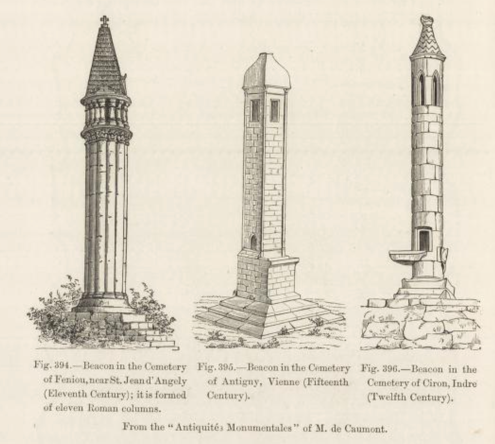
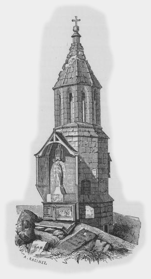

# Lanterns of the Dead

As a brief aside, in *The book of Hallowe'en*, 1919, [p112](https://archive.org/details/bookofhalloween00kelliala/page/112/mode/2up), Ruth Edna Kelley wrote of *lanternes des morts* in the following terms:

> In France from the twelfth to the fourteenth century stone buildings like lighthouses were erected in cemeteries. They were twenty or thirty feet high, with lanterns on top. On Hallowe'en they were kept burning to safeguard the people from the fear of night-wandering spirits and the dead, so they were called "lanternes des morts".

with the Encyclopedia Brittanica of 1875 describing them as *"curious small slender towers, found chiefly in the centre and west of France, having apertures at the top, where a light was exhibited at night to mark the place of a cemetery. Some have supposed that the round towers in Ireland may have served for this purpose."

P. L. Jacob's *Military and religious life in the Middle Ages and at the period of the Renaissance*, 1870, also reviews the hostory of these structures, as well as providing several illustrations:

```{admonition} *En vogue*, 1870
:class: dropdown

In P. L. Jacob's *Military and religious life in the Middle Ages and at the period of the Renaissance*, 1870, [p481-4 (p486)](https://archive.org/details/gri_33125008050011/page/486/mode/1up)

After this period `[14th c. France]` came into vogue a small lantern, built in the shape of a very narrow tower, like a hollow column, from twenty-six to forty feet high, the summit of which was surmounted by arcades, through which glimmered the faint light of a suspended lamp. This small building was called "the lantern of the dead"; it was also termed a beacon (*fanal*), a lighthouse (*phare*), and a little tower (*tourniele*). These beacon-towers, intended to indicate from afar during night-time the presence of a cemetery, generally had a door somewhat above the ground, which was reached by a ladder or flight of steps.



Upon the side opposite to the door, an altar jutted out at the base of the tower. This altar was never consecrated, as the canons forbid any celebration to be held upon those which were in the open air (*sub dio*). There are many monuments of this kind in Maine, Berry, Angoumois, and Gascony; they are all of Roman architecture, or of Gothic bordering upon Roman, and, consequently, do not date back further than the eleventh century.

There was a tower of this kind in the Cemetery of the Innocents, at Paris, but of larger dimensions than any of those alluded to above. It was a kind of octagon chapel, about forty feet high, and Gilbert de Metz, who speaks of it, says that he was told it was the tomb of a rich nobleman who had given orders that he himself should be buried beneath it in order ‘to save his remains from being profaned by dogs and vagabonds.



In the fourteenth century the lanterns of the dead, instead of being isolated and inaccessible columns, were built in the form of open chapels, in which a lamp was kept constantly burning. Previous to the erection of these chapels in the cemeteries, there existed others which have often been taken for pagan temples. We know, through writings of the ninth century, that in the cemeteries of the Carlovingian abbeys there were chapels of this kind, with two stories and a crypt; that these funeral chapels were of the same shape as the ancient baptisteries, without the surroundings. They were octagonal buildings, the vaults of which rested upon the boundary-walls of the cemetery. There are still extant two belonging to the Roman epoch, one at Montmorillon, in Poitou; the other, enclosed in the citadel of Metz, was a dependency of the Abbey of St. Arnold.
```

A note in *Notes and Queries* in 1864 makes a comparison between the irish round towers and the French lanterns of the dead:

```{admonition} Lanterns of the dead, round towers of Ireland, 1864
:class: dropdown
In *Notes and Queries*, 1864-02-06, Vol 5 Iss 110 (3rd. S. V. Feb. 6, '64.), In [p115-6](https://archive.org/details/sim_notes-and-queries_1864-02-06_5_110/page/114/mode/2up).

LANTERNS OF THE DEAD: ROUND TOWERS OF IRELAND.— In the admirable dictionary of M. Viollet le Due (vol. vi. p. 155) is a very curious account of certain towers which are found in cemeteries in the centre and west of France, and in which formerly lights were burned at night to indicate the proximity to the last resting-places of the dead. He states they are also called *fanal*, *tournièle*,and *phare*. The earliest notice he gives is from an old chronicle of the Crusades, which states:—

“Then died Saladin (Salahedins), the greatest prince that there was in Pagandom, and was buried in the cemetery of St. Nicholas of Acre near his mother, who was there very richly interred; and over them a beautiful and grand tower (une tournièle bièle et grant) where is night and day a lamp full of olive oil, and the hospital of St. John of Acre pays, and causes it to be lighted, who hold great rents which Saladin and his mother left them.”

The author says, however, there is a tradition that they were "menhirs," or erections of stone, consecrated to the Sun in Druidical times. He gives illustrations of three of these lanterns of the dead.

They have all a small door raised some distance above the ground, and an opening or window at the top, where the lighted lamp was exhibited. One is from Celfrouin (Charente), and is like a pier surrounded by clustered columns about six feet in diameter, and including a sort of conical top or spire about forty feet high. The mouldings, &c., show it to be the work of the thirteenth century. The second exists at Ciron (Indre), has a similar door, and six lancet windows at the top, and is not more than twenty-five feet high. The third is at Antigny (Vienne), and is square with small jamb-shafts at the angles, and is about thirty-five feet high, and seems also to be of the thirteenth century. They all stand on flights of steps.

Is it possible that the round towers of Ireland were intended to serve as cemetery lights or lanterns of the dead? In France these fanals seem to be confined to the Celtic districts, and it is not impossible that the Celtic races in Ireland may have seen and copied them. They have the same entrances a little above ordinary reach, the same windows at top, and the same conical caps. Could any among the French antiquaries who peruse "N. & Q." favour us with some further information with regard to these curious towers? It is not impossible after all that they may be the means of dispelling the mystery which has hung so long over the far-famed round towers of Ireland. A. A.
```

In a correspondence exchange almost fifty years later, a question regarding *Poor Souls' lights* ("totenlanterne") reintroduced mention of "lanterns of the dead" to the pages of *Notes and Queries*:

```{admonition} Poor Souls' Light (Totenlanterne), 1910
:class: dropdown
In *Notes and Queries*, 1910-12-03: Vol 2 Iss 49 (11 S. II. Dec. 3, 1910), [p448](https://archive.org/details/sim_notes-and-queries_1910-12-03_2_49/mode/2up).

Poor Souls' Light: "TOTENLATERNE." —At the private Roman Catholic church at Postlip, near Winchcombe, there is an opening high up in the south wall called "Poor Souls' Light." In Detwang Church, near Rothenburg, is a curious window, low down in the south wall, into which is built a stone lantern, called "totenlaterne." What purpose did these lights serve, and are there other instances of such openings? J. D.
```

```{admonition} A very interesting subject, 1911
:class: dropdown

In *Notes and Queries*, 1911-01-14: Vol 3 Iss 55 (11 S. III. Jan. 14, 1911), 
[p30-1](https://archive.org/details/sim_notes-and-queries_1911-01-14_3_55/page/30/mode/2up):

POOR SOULS' LIGHT: "TOTENLATERNE." (11 S. ii. 448.)

THE query by J. D. refers to a very interesting subject, on which there is plenty of literature, with about fifteen theories of explanation, but no single one is satisfactory in every case. I have a large quantity of material, but I want what is often difficult, and in many cases impossible, to get — evidence on certain points to elucidate a certain theory. In this respect J. D., while giving — to me at all events — something new, omits what is important evidence, probably from want of knowledge of the literature on the subject, which has engaged my attention for some years. ... A. RHODES.

[We cannot afford space for the further discussion of such a wide subject, but will forward any letters to Mr. RHODES.]

When I was visiting Garway Church in Herefordshire several years ago, an opening high up in the wall of the part connecting the church with the tower was pointed out to me as an example of a "poor souls' light." R. B--r. South Shields.

Father Thurston, S.J., in 'The Catholic Encyclopedia,' iii. 507, writes:—

> "A curious feature found in many churchyards from the twelfth to the fourteenth century, especially in France, is the so-called lanterne des morts, a stone erection sometimes 20 or 30 feet high, surmounted by a lantern, and presenting a general resemblance to a small lighthouse. The lantern seems to have been lighted only on certain feasts or vigils, and in particular on All Souls' Day. An altar is commonly found at the foot of the column. Various theories have been suggested to explain these remarkable objects, but no one of them can be considered satisfactory."

One may compare the French and Italian custom of putting lighted candles on graves on All Souls' Eve.

Mr. Leopold Wagner, in his 'Manners, Customs, and Observances,' p. 270, states that in the time of the Druids the ancient Trish prayed to Saman, the Lord of Death, in front of their lighted candles, for the souls of their departed relatives. Father Thurston in 'The Catholic Encyclopedia,' iii. 247, says: "St. Cyprian in 258 was buried *praelucentibus ceris*."

At the present day, at all solemn Requiem Masses, lighted tapers are held in the hands of some or all of those who assist, both among those who follow the Byzantine Rite and among those who follow the Latin. JOHN B. WAINEWRIGHT.

Mueller and Mothes in their (German) 'Archeological Dictionary,' *s.v.* 'Todtenleuchte,' quote the following passage from Petrus Venerabilis (died 1156) to explain the use of these lights:—

> "Obtinet medium cimeterii locum structura quaedam lapidea, habens in summitate sua quantitatem unius lampadis coparum que ob reverentiam fidelium ibi quiescentium totis noctibus fulgore suo locum illum sacratum illustrat."

According to the same authors, such lights were either burnt on isolated columns or in stone lamps attached to church walls. Examples of the former kind are still extant in France (12th century) and Germany (13th to 16th centuries). In Germany their use was abandoned about the latter date.

Illustrations are given in the book of an isolated light in Freistadt (Upper Austria) dating from about a.p. 1488, and of an attached lantern against the wall of St. Stephen's Cathedral in Vienna (A.D. 1502).

Other examples mentioned are those at Schulpforta (13th century), Regensburg (Cathedral, 14th century), and Klosterneuburg (A.D. 1381), the last being about 30 feet high. Others are to be found in Austria and Westphalia, but the localities are not given.

Tapers and lamps are nowadays st'll burnt on graves in Roman Catholic cemeteries on the Continent, but only on one evening in the year, viz., on All Souls' Eve. L.L.K.

In a very few remote Roman Catholic villages in Germany, e.g., in Westphalia, a "Totenlaterne" is lighted when a child dies. At the funeral the "Totenlaterne" is carried before the coffin to the graveside. When the burial service is over, the "Totenlaterne" is brought back to its place in the church and then extinguished. The Roman Catholic priest to whom I owe this information thought that nothing definite was known of the origin of this rare and almost forgotten rural usage.

A "Totenlaterne" is to be distinguished from an "Ewige Lampe." An "Ewige Lampe" is lighted and placed before the picture of a deceased near relation. The praying before the "Eternal Lamp" has the same object as the reading of masses for the souls of the departed, i.e., the hope of shortening the time the departed has to spend in Purgatory. H. G. Ward. Aachen.

In June last, when looking at some of the old tombstones in the cemetery of Linz, a picturesque little town on the Rhine near the Drachenfels, I noticed small lamps burning before some of the graves. J. R. THORNE.
```

```{admonition} Some further notes in response, 1911
:class: dropdown

In *Notes and Queries*, 1911-04-29: Vol 3 Iss 70 (11 S. III. Apr. 29, 1911), [p.336](https://archive.org/details/sim_notes-and-queries_1911-04-29_3_70/mode/2up):

POOR SOULS' LIGHT: "TOTENLATERNE" (11 S. ii. 448; iii. 30). — In the cemetery of Kloster Neuberg, near Vienna, there is an elegant cross or *Todtenleuchte*, *lanterne des morts*. Its height is about 30 ft.; the date engraved upon it is 1381. There is a small door about 5 ft. from the ground, and near the summit a chamber with six glazed windows, in which the light was exhibited. In France some ten or twelve of these lanterns have been found and described in Germany about as many.

M. Lecointre, "Archeologue de Poitiers," remarks —

> "The hollow columns or *janaux* were specially raised in the cemeteries in order to protect the living from the fear of those returning and from the spirits of darkness, and to safeguard them from this terror of the night — this affair that walketh in the darkness, of which the Psalmist speaks, finally, to invite the living to pray for the dead."

Viollet-le-Duc observes:—

> "As to the idea attaching to these monuments, in the twelfth century, for example, M. Lecointre appears to us to be right, but nevertheless we are disposed to think that these columns belong, by tradition, to the usages or superstitions of a very remote antiquity. We can only regret that we have no lanterns of the dead, prior to the twelfth century, remaining. We cannot doubt of their existence since they are mentioned several times, amongst other instances, in the battle waged between Clovis and Alaric, but we do not know the form of these first Christian monuments."

TOM JONES.
```
