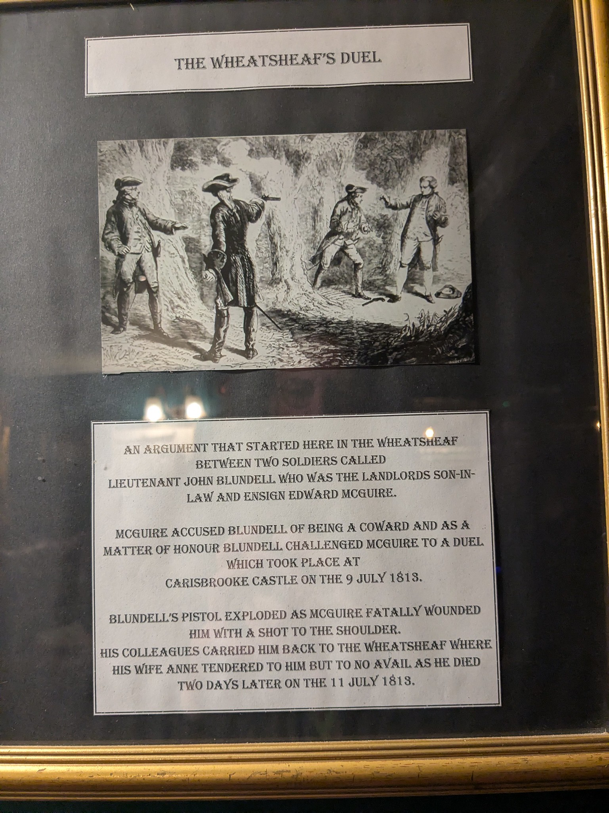
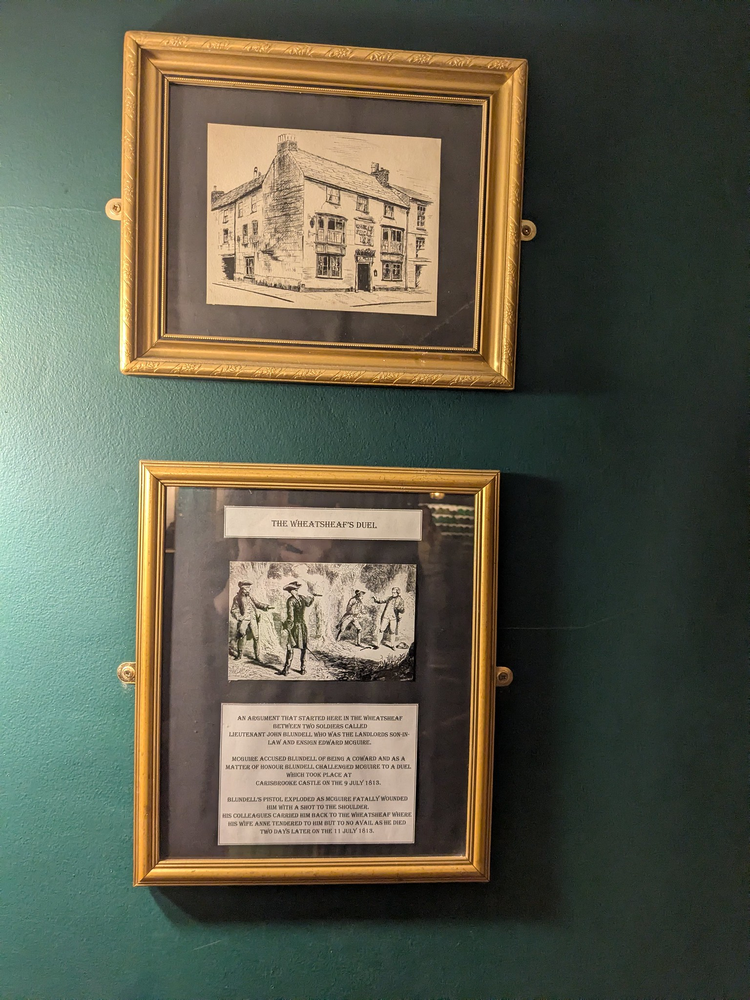
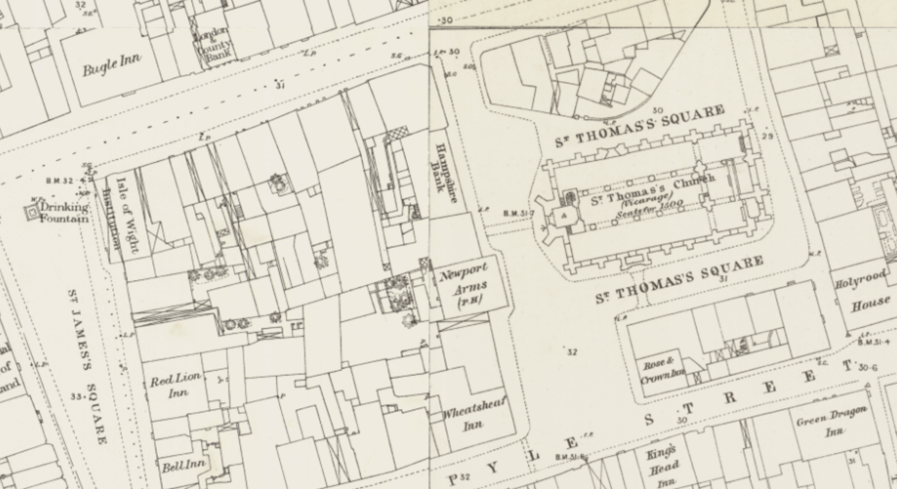

# The Last Pistol Duel on the Island

Several years ago, someone made mention to me of the last duel on the island that had taken place at Northwood in Cowes. I didn't chase it up at the time, but it was more recently brought to my mind when I heard contemporary folk duo Jess Leigh Ong and Al Watson, aka *Berlingo Flick*, singing their song *The Final Duel* on the Acoustic Stage at Kashmir Fringe Festival (2026) at Quay Arts in Newport.

Berlingo Flick (Jess Leigh Ong + Al Watson)
https://www.youtube.com/watch?v=sEMrK2p7peU

Wind blows cold on a winters night 1817  
The good ship Grace on the Solent she waits  
The men to shore they leave.

Bound for South America, boys  
To join the fight with Spain  
Sailors walk the streets of Cowes  
And one won't leave again

John, what is your pleasure  
For a life of adventure  

Spirits are high on this night  
Billiards winnings in wine  
We'll roll through the door of the Dolphin Inn  
Just gone 9

Young tongues pickled by drink speak ill  
And say things that aren't meant  
"You're bound for South America boys  
For to escape your debt"

"We're all in debt to God!" He cried  
"I meant no offence, mate!"  
But the challenge has been laid down lad  
And now it is too late  

Oh bravado and ale  
Are the cause of this sad tale

In morning mist on a cold hill top  
Distance was measured and  
2 men turn to face each other  
Pistol in hand

A shot rang out it echoed loud  
A young life ends too soon  
Lt John Sutton dropped to the ground  
The Final Duel

Jess - "That's most of the lyrics, certainly the factual ones, the ship and where it was headed, what he is purported to have said, that John Sutton had been playing billiards elsewhere earlier and had taken his winnings in wine, and was already well away when he arrived at the dolphin inn about 9pm..."

Lockyer buried in St mary's Cowes graveyard. west wall?

---

https://academic.oup.com/book/45624/chapter/394884888?login=false
Artisans Abroad: British Migrant Workers in Industrialising Europe, 1815-1870
Fabrice Bensimon

https://www.jstor.org/stable/3112919?seq=1
Damming the Flood: British Government Efforts to Check the Outflow of Technicians and Machinery, 1780-1843
David I. Jeremy
The Business History Review, Vol. 51, No. 1 (Spring, 1977), pp. 1-34 (36 pages)

...  No artisans at all were licensed by the Privy Council to emigrate between 1814 and 1824. And in the period 1780-1824, apart from the three permits to steam engine erectors, the Board of Trade allowed only one skilled worker, Richard Smith, to go abroad. Halted at the Liverpool Customs in 1817, he admitted that he had once been a master spinner, was presently assistant to a Staffordshire land surveyor, and was going to Philadelphia to recover unspecified property taken thence by James Slater, late of Cheadle. `[P.C. 2/205 pp. 420-421. B.T. 1/119, ff. 8-10. B.T. 5/26, p. 140]` ...

https://britishnewspaperarchive.co.uk/viewer/bl/0000082/18170929/011/0003
Morning Chronicle - Monday 29 September 1817

A CASE OF UNCOMMON VILLAINY.

*Mansion-house.*—Three or four persons of respectable appearance applied on Saturday to the Lord Mayor, in consequence of the conduct of a person named Fitzgerald, a resident in this city, who has raised considerable sums by the means which we shall represent to our readers.

On the 28th June, 1817, the barque Caledonia, Thomas Armstrong, Master, owned by James and Thomas Fitzgerald, wharfingers, near the Tower, London, was advertised as a vessel for passengers from Liverpool to New York and Philadelphia. It was stated the vessel would positively sail on or about the 10th July; and, as an additional inducement for persons to engage with the vessel, it was also stated that a Mr. Ross was going out in the ship, who would settle in Philadelphia, connected with a house of the first respectability in London, and do all in his power to procure employment for such as might be in want thereof, on their arrival in America. In consequence of this advertisement, and the terms of passage being deemed cheap, about one hundred and thirty persons entered themselves as passengers on board the Caledonia, several of those persons having wives and families. From these persons James Fitzgerald, then in Liverpool, received money on account of their passage, and from some of them the whole amount. It is estimated, that in the whole he received the sum of 500l. The Caledonia did not sail on the 10th July; and in the course of the month, Thomas Armstrong, the Master, was arrested for a debt contracted by him on account of the vessel. James Fitzgerald was himself arrested; and, to procure his liberty, deposited the ship's register with the creditor as a pledge for the debt. On the 14th of August, he set out, as alleged, for London, leaving the vessel under the command of the chief mate, to whom he addressed a note, stating he should return to Liverpool in four days, and requesting, in the interim, the mate would study the comfort of the passengers. The mate having no money or credit, the steerage passengers and himself and crew might have starved, had not the cabin passengers permitted them, from charitable motives, to participate in their sea-stores and provisions, until the whole was consumed. James Fitzgerald has not yet returned to Liverpool; but, in consequence of representations made on behalf of the distressed passengers to one of the Fitzgeralds in London, a person was sent down to Liverpool to take the command of the vessel. This person, on his arrival in Liverpool, sent a day's provision on board for the almost famished passengers and crew, and continued thus to supply them for a few days; but suddenly ceased, alleging that he had spent all his own money. At length dispatches arrived; the present Captain assumed the command of the vessel, redeemed the register from pledge, and instantly discharged the mate and crew, refusing to pay them one shilling on account of wages. The vessel is now repairing, and, to the astonishment of the passengers, they are told she will not proceed either to New York or Philadelphia, but will clear out for St. John's, New Brunswick. The Captain has offered to replace the sea-stores and provisions which belonged to the cabin passengers, and were consumed aboard the vessel by themselves, the steerage passengers, and mate and crew, provided the passengers will consent to proceed with the vessel to St. John's; but this proposal has been (in general) declined, as only offering to the passengers the prospect of perishing amidst the snows of Canada.

It is almost impossible to describe the miseries endured by the passengers who are now on board the vessel. It is to be recollected that she has for nearly three months been the only place of shelter for 130 human beings, and not the slightest attention has ever been paid by any person on behalf of the owners, either to the cleanliness or comfort of the births. To most of those unfortunate passengers it is a matter of strict necessity to abide by the vessel whatever may be the result, having no other place in which to shelter their heads from the damps of night. One of them, a respectable tradesman, sent his few goods to America by another vessel (the Caledonia, taking passengers only) in the hope that he should reach the United States in time personally to receive them.— After payment of the passage money for himself, his wife, and children, he was robbed on board the Caledonia of what little money he then possessed. And to complete his misfortunes, he has lately received intelligence of the failure of a person in America indebted to him in a sum of money which was to have formed the capital for his future pursuits across the Atlantic. This passenger is now therefore completely destitute, not possessed of one shilling to purchase his children bread. Another poor man, a native of Ireland, having paid for his passage, and spent the remainder of the small sum of money with which he had set out upon his journey, in supporting life, determined upon the singular expedient of travelling back to his native country, (at one of the most distant parts of which his friends resided), for the purpose of obtaining from them the means of laying in a stock for the voyage, which he was sanguine enough to suppose was not in the air. In poverty he travelled to Ireland, and in poverty he returned; but he brought a fever which he had contracted in his journey through the diseased districts. He now lies in his hammock under the influence of the disorder, which may extend its ravages amongst the whole of the passengers, who are compelled to remain on board the vessel, in the apprehension of a more certain evil which awaits them on shore. Several of the poor passengers who have been so fortunate as to be still in possession of a little money, have proceeded to America, leaving authority with their friends to proceed against Fitzgerald for the recovery of their money. The mate and seamen have arrested the vessel by warrant out of the Court of Admiralty, to recover their wages.—The Lord Mayor, at this statement, asked whether application had been made to any authorities at Liverpool upon the subject?—The complainants replied, that although the case had excited the utmost horror in Liverpool, there seemed to be a doubt whether it came within the view of criminal prosecution.

The Lord Mayor recollected some complaint of a description, the atrocity of which nearly resembled that he had just paid attention to. It occurred on Tower-hill, and the plan seemed to have been arranged upon the same system, and nearly to the same effect. The persons employed in the deception, however, evaded the pursuit of justice. It was a case, his Lordship said, upon which the best judgment should be taken. He apprehended the failure of a criminal proceeding, but recommended that legal advice should be immediately resorted to.

The complainants begged to know whether the process of the Court of Admiralty could not be extended to the case of the unfortunate passengers. If so, their claims might be speedily adjusted, but at present they were without any effectual remedy in the midst of disasters.

The Lord Mayor again recommended application to the best legal authorities, and expressed his promptitude to assist in obtaining satisfaction for the poor creatures who were labouring under such privations.

https://britishnewspaperarchive.co.uk/viewer/bl/0000082/18170930/010/0003
Morning Chronicle - Tuesday 30 September 1817

THE SHIP CALEDONIA.

We readily give insertion to the following letter and accompanying documents, respecting the case mentioned in our Paper of yesterday, to have occurred at the at Mansion House. We copied, in common with all the other Papers of yesterday, the statement referred to (with some curtailment), from a Sunday Paper, which we find, however, in this instance as in others, is not in the least to be relied upon:

TO THE EDITOR OF THE MORNING CHRONICLE.

Sir,

There having appeared in your Paper of this day a long paragraph, entitled "A case of uncommon Villany," evidently taken from *The Observer* paper of yesterday, which is by no means true, I beg that you will cause the under-written statement of what occurred before the Lord Mayor to be published in your Paper of to-morrow, as the least amends you can make for the great injury that such paragraph must occasion to me in my mercantile pursuits. I am, Sir, your obedient servant, - JAMES FITZGERALD, Joint Owner of the Ship Caledonia.

On Saturday the 20th inst. Mr. Michael Wall applied to the Lord Mayor for a summons against James Fitzgerald, as owner of the Caledonia, in order to obtain from him a return of 22l. paid by Mr. Wall for his passage to New York and Philadelphia. This summons was attended on Tuesday by Mr. Fitzgerald, who stated to his Lordship the unfortunate cause which had detained that vessel at Liverpool, and that she was undergoing repairs, from the circumstance of her having been run foul of by another vessel, and greatly injured; and Mr. Fitzgerald offered to make Mr. Wall any remuneration in his power, for the inconvenience he had sustained, and which he had since done to Mr. Wall's satisfaction. On Friday last Mrs. Ann Boyle went before the Lord Mayor (not having seen Mr. Fitzgerald in the first instance), with a clerk of Messrs. Dacie and John, of Gray's Inn, in order to make a similar complaint to that which had been preferred by Mr. Wall; and upon shewing to his Lordship a letter, stating that she was a passenger by the Caledonia, his Lordship said, that the owner had been summoned before him a few days ago, by a Mr. Wall, and that he had made a satisfactory arrangement with Mr. Wall, and his conduct had been very liberal; and his Lordship recommended Mrs. Boyle to call on Mr. Fitzgerald, and that he had no doubt but that Mr. Fitzgerald would satisfy her; his Lordship stated also that he could not do any thing for her. Mrs. Boyle took the advice of the worthy Chief Magistrate, and has been amply recompenced by Mr. Fitzgerald for the inconvenience she has experienced, and is perfectly satisfied with his conduct in every respect; and she declares that when she left the vessel on Wednesday last there was not any fever on board, nor at that time more than 12 grown persons and a few children; and the ship is of the burthen of 336 tons register measurement.

London to wit,

We, Michael Wall and Ann Boyle, do hereby severally make oath that the above statement of facts, as far as respects us individually is perfectly true, and we believe that the reason why the ship Caledonia did not proceed to sea was, that several of the passengers were not prepared with the certificates required by the Custom-house at Liverpool to prove that they were not mechanics MICH. WALL. A BOYLE. Sworn at the Guildhall this 29th day of September 1817, before me, M. Wood, Mayor.

https://britishnewspaperarchive.co.uk/viewer/bl/0002646/18171213/011/0003
Star (London) - Saturday 13 December 1817

Thursday the ship Grace of London, DAVEY Master, with eighty Officers on board, bound to St. Thomas's, on the South American Expedition, was seized in Cowes roadstead, by John WARD, Esq. Collector of Customs at that port, for having received on board many of the said Officers in a clandestine manner, contrary to the Passengers' Act; and also for having no papers on board, to prove the ship's identity and character. The Grace is reported to be owned by a Mr. FITZGERALD, who some time since was examined before the LORD MAYOR, for engaging to convey passengers out of the kingdom, in a ship called the Caledonia, the circumstances of which must be in the remembrance of many of our Readers.

On the day preceding the seizure of the above vessel, Mr. SUTTON, a volunteer Officer for South America, was shot in a duel, at West Cowes, by Major LOCKYER, a British Officer, about to depart on the same enterprise. An inquest being held on the body, a Verdict of Wilful Murder was given against Major Lockyer, and Lieutenants Hand and Redesdale, the seconds, all of whom have absconded.

https://britishnewspaperarchive.co.uk/viewer/bl/0002408/18171216/018/0003
Morning Herald (London) - Tuesday 16 December 1817

FATAL DUEL. The following extract gives a further account of this transaction:

"ISLE OF WIGHT, DEC. 13.— On Wednesday last an inquest was taken at the Dolphin Inn, in West Cowes, before THOMAS SEWELL, Esq. Coroner of the Isle of Wight, on view of the body of a gentleman of the name of John Sutton, who was killed in a duel, in Northwood Park, that morning. It appeared in evidence, that the deceased was one of the passengers about to proceed to St. Thomas's in the ship Grace, now lying in Cowes Roads; that the preceding evening, the deceased, a Major Lockyer, a Mr. Redesdale, and a Air. Hand, and other passengers, were in company together at the Dolphin; that Major Lockyer took offence at some expression made use of by the deceased, and in consequence challenged him. The parties met the next morning, Mr. Redesdale attending as second to Major Lockyer, and Mr. Hand as second to the deceased. Major Lockyer only fired at the appointed signal; the ball entered the deceased's body between the third and fourth ribs on the right side, passed through the ventricle of the heart, lodged in the integuments on the left side, and occasioned, of course, instant death. The principal and seconds immediately fled. The Jury, without hesitation, returned a verdict of *Wilful Murder* against Major Lockyer and Messrs. Redesdale and Hand, and the Coroner issued his warrant for their apprehension. Mr. Hand was apprehended by Allen, (the Newport constable) at Portsmouth, on Thursday; the others are still at large.

https://britishnewspaperarchive.co.uk/viewer/bl/0000156/18171217/003/0002
Bury and Norwich Post - Wednesday 17 December 1817

The ship Grace, from London to St. Thomas, with 80 officers on board, going to join the Spanish Patriots, put into Cowes last week, and was there seized for receiving persons on board contrary to the Passenger Act, and having no papers to prove the ship's identity. — Major Lockyer and Lieut. Cochrane Sutton, two of the Grace's passengers, fought a duel near West Cowes on Thursday: the latter was shot through the heart, and immediately expired. —Verdict, Wilful Murder.

https://britishnewspaperarchive.co.uk/viewer/bl/0001316/18171217/017/0004
Evening Mail - Wednesday 17 December 1817

Also in Morning Herald (London) - Thursday 18 December 1817 https://britishnewspaperarchive.co.uk/viewer/bl/0002408/18171218/008/0001 and widely appears elsewhere

FATAL DUEL.

WEST COWES, (Isle of Wight,) Dec. 14.

The most melancholy occurrence has taken place on this island. The actors were, Major Lockyer and his frend, Captain Redsdale `[sic]`; Lieutenant Cochrane Sutton, and his second, Mr. Hands; all passengers on board the ship *Grace*, now in these roads, cleared out for St. Thomas’s, but ultimately destined for the South Amencan coast, and freighted expressly with about 60 adventurers for the Spanish Patriot cause.

On Tuesday, the 9th inst. the parties above mentoned came on shore, intending to pass the day in a social manner, and never dreaming that any of quarrel could arise among men who had previously lived on terms the most remote from jealousy or strife. In the course of the afternoon they accidentally separated; Sutton and Hands repaired to a billiard-table, where, with others they played for wine for a considerable time; and Lockyer and Redsdale retired to the Dolphin, and there remained till Sutton and Hands had joined them; which was not, however, till Sutton had drank sufficient to lose the steady control of his mind.

The hour was nine. The conversation, as natural to adventurers, turned upon the subject of their voyage. Some advanced one opinion, and some another; at length, the motive for sailing, and the necessity of continuing it, began to be investigated with some degree of warmth; this drew the following remark from Sutton:— "We are all idle, and in debt at home; can there be stronger motives for seeking activity and bread abroad?" Major Locker indignantly replied, "Sir, I am not in debt; and I desire you to be more particular in my company." Sutton retorted: "I can prove that we are all in debt." "It is false," exclaimed his opponent. Sutton now, with an expression of archness and jocularity, is said to have observed, "Why, Lockyer, if we are not in debt to any human being, you will still allow that weare all in debt our Creator."

The time was now one in the morning. The conversation ceased; Lockyer left the room, sent in for his friend Redsdale, who, instantly after, returned to the room, and whispered a message from his principal in Sutton's ear. Lockyer next hired a boat, in which he went to the *Grace* for his case of pistols and, returning to the Dolphin, retired to rest. Sutton and his friends, after drinking some time longer, perambulated the town.

At eight the parties met at the Dolphin; walked at no great distance from each other to a field adjacent to the town. The seconds attended and a doctor was at hand. Twelve paces were measured, and the combatants took each his ground. On the delivery of the pistols, Sutton instructed his second to say to Major Lockyer, that he never intended to give him offence, and that he was willing to make that confession as an apology; but could not think of offering one framed in humbler terms; also, that he would not return the fire, presuming that to be shot at like a post would expiate his unintentional offence, and that he possessed the courage wil which the name of had ever before been allied. In consequence, he never unstopped his pistol.

Major Lockyer called for the signal to fire, which was given by the dropping of a handkerchief; and Sutton fell, being shot through the heart. Lockyer, Redsdale, and Hands instantly fled; the doctor remained with the body, but it was of no avail; the ball entered by the right breast, penetrated both ventricles of the heart, and burrowed itself in the integuments of the left side.

The inquest has returned a verdict of *Wilful Murder* against the principal and both seconds. Sutton's second is in custody, and hopes are entertained that the two others cannot escape. The above particulars are on the Coroner's record, and may be published without reproach.

https://britishnewspaperarchive.co.uk/viewer/bl/0000230/18180209/047/0006
Hampshire Chronicle - Monday 09 February 1818

Major Lockyer, who shot Mr. S. Cochrane in duel a few weeks ago in the Isle of Wight, was apprehended, on Wednesday last, by Webber and another, constables, at a small public-house. Called the Waterman's Arms, in Hawk Street, Portsea, where, it appears, he had been staying ever since the unfortunate circumstance occurred. He was taken to Newport, in the Isle of Wight, on Thursday, for the purpose of being committed to Winchester Gaol to take his trial at the next Assizes.

Yesterday morning a ship called the Grace, lying at St. Helen's, with a number of adventurers on board for South America, in the absence of the Master, who was on shore with one of the passengers procuring necessaries for the voyage, was taken possession of the passengers remaining on board, who, availing themselves of a favourable wind, turned the pilot out of the ship, and proceeded to sea.

https://britishnewspaperarchive.co.uk/viewer/bl/0000420/18180313/004/0002
Cambridge Chronicle and Journal - Friday 13 March 1818

Winchester Assizes.— *Orlando Lockyer* and *Robert Hand*, charged with the murder of John Sutton, at Northwood, in the Isle of Wight. John Holding, a surgeon, was going to South America with the prisoners on the ship Grace. On the 9th of December he was with them at the Dolphin inn, West Cowes; they sat together for two hours, when Sutten `(sic)` remarked, that all the company were in debt. Major Lockyer replied, "Do you mean to say that I am in debt?" Sutton said, he did. Major Lockyer answered, "Whoever is in debt, I am not." Sutton replied, "We are in debt to our Creator." Major Lockyer left the room, and messages passed between them and a Mr. Redesdale, another passenger. Sutton said, if he (Major Lockyer) called him out, he would meet him. Next morning they met to settle the dispute by fighting a duel. Hand and. Redesdale measured the ground. Hand called Sutton and gave him a pistol, when he and Major Lockyer took their ground. Major Lockyer fired, and Sutton clapped his hand on his breast, staggered forward two or three paces and held out his hand; Major Lockyer advanced and took it. He immediately fell, and the prisoners ran away. Sutton soon after expired, Mr. Fitzgerald (brother to the owner of the vessel) deposed, that Hand seriously pressed Sutton to settle the affair, when they were going to the field; all was said that could be said to induce him to make concession for the words he had used, and not fight: this admonition he repeated several times. Several other witnesses were examined, but their testimony added no new fact to those already known. Major Lockyer and Mr. Hand both read along and very able defence. The judge, in summing up the evidence, told the jury they must not listen to the appeals from the prisoners, nor let any reports or statements before known to them prejudice the case—they must judge according to the evidence then given.. Verdict—Manslaughter.—Three months' imprisonment each.

https://britishnewspaperarchive.co.uk/viewer/bl/0000230/18180309/006/0003
Hampshire Chronicle - Monday 09 March 1818

Hants Lent Aasizes

...

Crown Bar.  — The following prisoners were tried and received sentence as under:—

*Orlando Lockyer* and *Robert Hands*, were indicted for the wilful murder of John Sutton, at Northwood, in the Isle of Wight, on the 10th Dec. last. On the part of the prosecution, a person named Haldane, deposed, that he was a surgeon, and passenger on board a vessel named the Grace, bound for the island of St. Thomas, in which the prisoners, the deceased, and himself had taken their passage to South America. On the night of the 9th of Dec. they were in the company of several others (among whom were the prisoners and the deceased), at the Dolphin Inn, at Cowes. About 11 o'clock he heard the deceased say they were all in debt. Major Lockyer inquired if the deceased meant to say that he was in debt. The deceased replied, that he did. To which Major Lockyer then said, "whoever is in debt, I am not." The deceased answered, "we are all in debt, if not to man, to our Creator." Major Lockyer left the room immediately, and some person came in, and told Mr. Redesdale (Major Lockyer's second), that a gentleman wished to speak to him.— Immediately on Redesdale's quitting the room, Sutton said, "I will meet him if he calls me out;" and addressing the prisoner (Hands), asked if he would be his second? to which he consented. Witness saw Sutton and Hands the next morning, a few minutes before eight o'clock; they wished each other good morrow.— Redesdale looked in at the door, and asked them to walk up to the church, to which Sutton assented, and requested witness to accompany them. He went in company with Mr. Hands. On their way, they overtook Major Lockyer Mr. Redesdale, who carried a box. They walked on before witness, deceased and Mr. Hands; witness objected to going further, because he saw they were going to fight. Sutton said, "we shall go on the ground, but we will not fight". They then followed Lockyer and Redesdale into the field where the duel took place; the deceased and Hands separated from witness, and had some conversation together, after which he went up to Major L.— Hands and Redesdale measured the distances, and they took their ground, Redesdale standing *equidistant* between both, with a handkerchief in his hand, which was dropped, and the prisoner (Lockyer) fired. The deceased paused for a second or two, threw away his pistol, and staggering forward, held out his hand to the prisoner, who instantly ran up to him and caught hold of it; they appeared to be shaking hands. He shortly after expired. In his cross-examination he said that Mr. Hands and the deceased were intimate friends, but that to Major Lockyer he was not even known till on board the Grace. Many other words might have passed more than he could recollect; it was between two and three o'clock before Hands endeavoured to convince the deceased that his conduct was wrong, and repeatedly persuaded him to make a concession, which he refused to do. These are the principal facts which transpired in the evidence for the prosecution.— Mr. C. Day, a surgeon, examined the body of the deceased, and found a wound on the right breast; and on opening the body, to trace the ball, found it had penetrated between the third and fourth ribs, passed through the lungs and the ventricles of the heart, and lodged in the integuments on the opposite side.— On being called upon for his defence, Major L. said he had committed to writing what he had to offer in extenuation, as in consequence of the awful situation in which he stood, he might not be so collected in his defence as was perhaps necessary. But as the laws of his country would not permit him to verify on oath what he had committed to paper, he would most solemnly aver, in the presence of that God who knoweth our inmost thoughts, that the whole was true. He then read his defence, which was very long; it stated, that the provocations he had received were of a more aggravated nature than had been mentioned, and that by a repetition of them he had been actually driven to adopt the course that led to the unfortunate catastrophe for which he was arraigned. He disclaimed all malice against the deceased, to whom he was an utter stranger, and whose intemperance had led to the melancholy event. He trusted the jury would divest themselves of every idea on the subject which they might have imbibed, from the misrepresentations published in the different newspapers respecting this case, and that they would decide upon the evidence alone.— He had been a soldier from his youth, and from the age of 15 had been in the service of his country; was present at Buenos Ayres, the battles of Roleia, Vimiera, Corunna, Badajoz, Busaco, Roderigo, and Salamanca, at the last of which he was severely wounded.— He had escaped all these dangers, and it would now depend on their verdict whether he survived this. He was a husband and a father, and on them would depend his restoration to his family and friends; and he relied with confidence on the laws of his country, which in all cases of doubt leant to the side of mercy.— Mr. Hand then read an able defence, in which he solemnly attested his own innocence, and feelingly deplored this fatal event which had deprived him of a friend whom he respected, but whose perverse temper, he was sorry to say, had caused his fall, and involved him in the unfortunate transaction for which he was now arraigned. Colonel King, of the 5th regiment, had known Mr. Lockyer several years. He had been a Captain in the 5th regiment, where he was always considered a good tempered man, and by no means of a quarrelsome disposition. No other witnesses were called; the 5th regiment being in France, the officers could not conveniently attend.— The Learned Judge (Holroyd) having recapitulated the evidence at length, and pointed out the law on the subject, the jury returned a verdict of *Manslaughter* against both prisoners; and they were sentenced to *three months imprisonment in the County Gaol, and then to be discharged*.— This trial excited much interest, and the Court was crowded to excess.

https://trove.nla.gov.au/newspaper/article/2178338
The Sydney Gazette and New South Wales Advertiser (NSW : 1803 - 1842) View title info Sat 14 Nov 1818 
 Page 3 
 BRITISH EXTRACTS.

FATAL DUEL.—West Cowes, Isle of Wight, Dec 14.—The most melancholy occurrence has taken place on this island. The actors were Major Lockyer and his friend, Capt. Redesdale; Lieut. Cochrane Sutton, and his second Mr. Hands; all passengers on board the ship Grace, now in these roads, cleared out for St. Thomas's, but ultimately destined for the South American coast, and freighted expressly with about sixty adventurers for the Spanish Patriot cause.

On Tuesday, the 9th instant, the parties above mentioned came on shore, intending to pass the day in a social manner, and never dreaming that any subject of quarrel could arise among men who had previously lived on terms the most remote from jealously or strife. In the course of the afternoon they accidently separated; Sutton and Hands repaired to a tavern, where, with others, they played for wine for a considerable time; & Lockyer and Redesdale retired to the Dolphin, and there remained till Sutton and Hands had insulted them; which was not, however, till Sutton had drank sufficient to lose the steady control of his mind.

The hour was nine. The conversation, as natural to adventurers, turned upon the subject of their voyage. Some advanced one opinion, and some another; at length the motive for sailing, and the necessity of continuing it, began to be investigated with some degree
of warmth; this drew the following remark from Sutton:—" We are all idle, and in debt at home; can there be stronger motives for seeking activity and bread abroad?" Major Lockyer indignantly replied, "Sir, I am not in debt; and I desire you to be more particular in my company." Sutton retorted, "I can prove that we are all in debt."—"It is false," exclaimed his opponent. Sutton now, with an expression of archness and jocularity, is said to have observed, "Why, Lockyer, if we are not in debt to any human being, you will still allow that we are all in debt to our Creator."

The time was now one in the morning. The conversation ceased; Lockyer left the room, sent in for his friend Redesdale, who, instantly after, returned to the room, and whispered a message from his principal in Sutton's ear. Lockyer next hired a boat, in which he went to the Grace for his case of pistols; and, returning to the Dolphin, retired to rest. Sutton and his friends, after drinking some time longer, perambulated the town.

At eight o'clock the parties met at the Dolphin; walked at no great distance from each other, to a field adjacent to the town. The seconds attended, and a doctor was at hand. Twelve paces were measured, and the combatants took each his ground. On the delivery of the pistols, Sutton instructed his second to say to Major Lockyer, that he never intended to give him offence, and that he was willing to make that confession as an apology, but could not think of offering one framed in humbler terms; also, that he would not return the Major's fire, presuming that standing to be shot at like a post would expiate his unintentional offence, and that he possessed the courage with which
the name of Cochrane had ever before been allied.

Major Lockyer called for the signal to fire, which was given by the dropping of a handkerchief, and Sutton fell, being shot through the heart. Lockyer, Redsdale, and Hands instantly fled; the doctor remained with the body, but it was of no avail; the ball entered by the right breast, penetrated both ventricles of the heart, and burrowed itself in the integuments of the left side.

The Coroner's Inquest has returned a verdict of *Wilful Murder* against the principal and both seconds. Sutton's second is in custody, and hopes are entertained that the two others cannot escape. The above particulars are on the Coroner's record, and may be published without reproach.

DUEL.—APPREHENSION OF MAJOR LOCKYER.— Extract of a letter, dated Newport, Isle of Wight, 5th February, 1818:— "Yesterday was apprehended at Portsmouth, Major Lockyer, who was brought here this morning, & afterwards taken before T. Sewell, Esq. the Coroner, who immediately committed him to Winchester Gaol to take his trial at the next assizes. It may be recollected, that Major Lockyer killed Mr. John Sutton in a duel at West Cowes, on the 10th of December. The Major shot him through the heart the first fire, and Mr. Sutton did not discharge his pistol, which was found on the half cock lying near him, after Major Lockyer and the two seconds had absconded, which they did immediately Mr. Sutton fell.— On the following day Mr. Hand, the second of Mr. Sutton, was apprehended at Portsmouth by a constable of West Cowes, Major Lockyer, and Mr. Redesdale, his second, had the address to deceive the officer, and made their escape from him; and it was not till yesterday that Major Lockyer was taken, but Mr. Redesdale it still at large.

---

1813

TH there was a Red Lion and a Wheatsheaf Inn in 1826

https://britishnewspaperarchive.co.uk/viewer/bl/0000231/18261218/026/0003
Hampshire Chronicle - Monday 18 December 1826

TO BREWERS, INN KEEPERS, AND OTHERS.

Capital Free and Old-established Public-House, in one of the best situations in the town of Newport.

TO SOLD by AUCTION, by Mr FRANCIS PITTIS, by order and under the direction of the Executors of the late Mr. F. Kiddle, on Tuesday the 19th of December, 1826, at the Wheat-sheaf Inn, Newport, Isle of Wight, all that Good Accustomed PUBLIC HOUSE, known the name of the *Red Lion*, situated in the centre of St. James's Square, where the cattle market is held, and now in the occupation of Mr George Pedder. The house is very substantially brick built, and comprises on the ground floor, three sitting rooms in front, two back ditto, a good cellar, large stables, and stores; the second floor, two large rooms in front, and three back bed rooms the attic, six sleeping rooms. The whole of the rooms are well arranged, and the premises are front thirty-seven feet.

*The Sale to commence precisely at Six o'Clock in the Evening.*

The Wheatsheaf's Duel

An argument that started here in the Wheatsheaf between two soldiers called Lieutenant John Blundell who was the landlord's son-in-law and Ensign Edward McGuire.

McGuire accused Blundell of being a coward and as a matter of honour Blundell challenged McGuire to a duel which took place at Carisbrooke Castle on the 9 July 1813.

Blundell's pistol exploded as McGuire fatally wounded him with a shot to the shoulder.

His colleagues carried him back to the Wheatsheaf where his wife Anne tendered to him but to no avail as he died two days later on the 11 July 1813.

[Interactive map, Ordnance Survey, Newport, Isle of Wight, OS 1:500, 1861-4](https://maps.nls.uk/geo/explore/#zoom=19.0&lat=50.69984&lon=-1.29473&layers=117746211&b=1&o=100), *via National Library of Scotland*; includes many pub names; surveyed 1862, published 1865.

https://britishnewspaperarchive.co.uk/viewer/bl/0002647/18130712/009/0002
Statesman (London) - Monday 12 July 1813

Duel.—We are concerned to hear that a duel took place on Friday, near Carisbrooke, in the Isle of Wight, between Lieutenant Blundell, and Lieutenant M'Gregor, of the 101st Regiment, in which the former received a wound, which is considered likely to prove fatal to him. Liet. B was lately married to the daughter of H. White, Esq. of Portsmouth; and what is remarkable, his adversary in this unfortunate dispute gave the Lady away.

https://britishnewspaperarchive.co.uk/viewer/bl/0000420/18130723/019/0004
Cambridge Chronicle and Journal - Friday 23 July 1813

FATAL DUEL.— The duel which look place Friday se'nnight, near Newport, Isle of Wight, between Lieutenant Blundell, 101st regiment, and Liet. Maguire (not M'Gregor,) of the 6th West-India regiment, has terminated fatally. Lieutenant Blundell died the Sunday following. The ball entered the right shoulder, in an oblique direction, crossed the back, taking part of the vertebrae, and lodged near the arm-pit; mortification, delirium, and death, were the consequences. The deceased was the son of J. Blundell, Esq. merchant in London.—A Coroner's Jury has been held on the body, and a verdict of Wilful Murder returned against Lieutenant M'Guire, and several other persons who were present, the whole of whom have absconded.

https://britishnewspaperarchive.co.uk/viewer/bl/0000082/18130720/007/0003
Morning Chronicle - Tuesday 20 July 1813

*Fatal Duel.*— The duel which took place on Friday se’nnight near Newport, between Lieut. Blundell of the 101st regiment, and Lieut. M'Guire (not M'Gregor) of the 6th West-India regt. has terminated fatally. Lieut. Blundell died on Sunday noon last. The ball entered the right shoulder, in an oblique direction, crossed the back, taking part of the vertebrae, and lodged near the arm-pit; mortification, delirium, and death, were the consequences. The deceased was the son of J. Blundell, Esq. merchant in London.

On Monday and Tuesday an Inquest was taken on the case by Thomas Sewel, Esq. the Coroner for the Island, and a most respectable jury; after a full and minute investigation of the circumstances, and an impartial sunning up of the evidence by the Coroner, the Jury returned a verdict of Wilful Murder against Ensign Maguire, as a principal in the first degree; against Ensign Gilchrist, of the 6th West India regiment, and Liet. Hemmings, of the 101st regiment (the seconds), as principals in the second degree; and against Lietentant Kinsley and Ensign Slater, of the 101st regiment, as accessories before the fact.

The principals and seconds absconded immediately after the duel.

https://britishnewspaperarchive.co.uk/viewer/bl/0000230/18130802/014/0004
Hampshire Chronicle - Monday 02 August 1813

WINCHESTER, Saturday, July 31. HAMPSHIRE ASSIZES.

*Edward M'Guire*, aged 28, and *James Gilchrist*, for the murder of John Blundell, in a duel, at Carisbrook, in the Isle of Wight.

*Anthony Dillon*, aged 26, and *David O'Brien*, aged 17, for having incited, counselled, and instigated Edward M'Guire to murder the said John Blundell. The particulars this unfortunate catastrophe are follows:—

Lieut. Blundell took a young officer of his corps, to a cottage in Niton, to dine with him. Ensign M'Guire, belonging the West India Regiment, who was stationed with Lieut. Blundell, took offence at this circumstance, perhaps thinking it a partiality which reflected on him. Lieut. Blundell treating the observations made by M'Guire, on this occasion, with disregard, the latter became so enraged, that he wrote to the officers of the 101st Regiment, to which the deceased belonged, calling him a rascal and a ruffian. On the receipt of this letter, the officers waited on Lieut. Blundell, stated the calumny uttered against him, and gave it as their opinion that he must fight him. Lieut. Blundell for some time evaded coming to this crisis, but, at last, he gave these gentlemen a challenge for Ensign M'Guire, and the parties met near Carisbrook, very early the next morning, without having taken repose. Lieut. Blundell's first pistol burst; his second handed him another, but never proposed a reconciliation. Another shot was fired, Lieut. Blundell fell; he was taken in blanket to the Wheat Sheaf Inn, Newport, where died. The ball, it seems, entered sideways into the right shoulder, crossed the back, taking a part of the vertebrae, and broke a rib. He died the day after the wound was received. Two servants, one belonging to each of the duellists, were on the spot during the whole time.

https://britishnewspaperarchive.co.uk/viewer/bl/0002646/18130803/020/0004
Star (London) - Tuesday 03 August 1813

Assizes, Winchester, July 31.

These Assizes terminated this day. The following were among the cases tried:

...

Ensign *M'Guire*, Ensign *Gilchrist*, Lieutenant *Dillon*, and Lieutenant *Daniel O'Brien*, the principals and accessaries in the late fatal duel at Newport, were tried for the murder of Lieutenant Blundell, of the 100th regiment. (Lieutenant *Heming* did not surrender himself). The principal circumstances in this case, besides those already given in this Paper, were comprised in the following evidence:

James Fitzgerald, a private in the 69th regiment, stated, that he was a servant to Ensign Gilchrist, that he was so on the 9th of the month, and stationed in Parkhurst Barracks; that by order of his master he took to Newport a case, but did not know its contents; afterwards went with his master to where the duel was fought, at the back of Carisbrook Castle. Mr. M'Guire was with his master soon after they were there. Mr. Blundell and Mr. Heming came to the spot; they then proceeded to the back of Carisbrook Castle, and Mr. Heming measured out the ground, taking either 12 or 13 paces. Mr. Herring asked Gilchrist for a pistol: Gilchrist answered, if you have it, it shall be without my consent, and it was against his wish that they should be used on that day. On this Mr. Heming was desired by Mr. Blundell to get one of his own, and the pistol was produced and loaded. Witness retired .about 15 or 20 yards, and Mr. Heming gave the word, either "make ready, present, fire,"—or, " make ready, fire;" and they both fired together. Blundell stood his ground, and handed his pistol to Fleming, who said it was burst, and Blundell asked to borrow another of Gilchrist, as he wished to have another shot. Then Gilchrist and Fleming went to Blundell, and afterwards to M'Guire, but he did not hear what had passed. After this they loaded M'Guire's pistols, and each took one, and then Mr. Heming gave the word again, and they fired, and Mr. Blundell fell. Then M'Guire, Fleming, and Gilchrist, came up to him; Blundell said—"My dear M'Guire, I am dying, but I forgive you from my heart and soul." Then Gilchrist shook hands with him, and said—"Are you satisfied that we have behaved as Gentlemen to-day?"— He replied, "Yes, my dear Gilchrist, I die in peace with you all." Witness was sent for a Doctor, who he met coming out, and when be returned the parties were all gone.

Thomas Rayles, Captain and Adjutant at the Army Depot, in the Isle of Wight, on the 9th was in company with the deceased J. Blundell. In consequence of a letter, witness waited on the deceased, who told him he was mortally wounded. Witness told him he was sent by General Taylor to inquire into the circumstances, and requested him to inform him who were the seconds: he replied Henning was his second, Gilchrist the other's. He said that M‘Guire and he had an altercation, but that it was not his wish to meet M'Guire if he could have helped it, but that he was in a manner compelled to it. On asking him in what way he was compelled, he said several Officers had been to him; among them were O'Brien and Dillon; that he did not owe M'Guire any animosity. It was between four and five in the afternoon when he went down to Blundell. He understood on the same day the duel took plo.ce, there were several person's in the room when he went there, but did not particularly observe any one; he went to Blundell, for the purpose of collecting the particulars: he told him it was not his intention to have fought if he could have avoided it; that he had the Adjutant-General's permission to go to London; that he intended to let the business pass over, and to have got on the half-pay, and that he was going off on that day; O'Brien and Dillon told him if he did not meet M'Guire, he should be discarded.— Witness did not hear from the deceased how the dispute originated.

Henry White is father-in-law to the deceased ; saw him on the 10th instant, and was told by him that he had received a wound, which he supposed to be mortal: said he was sorry to see him in such a situation; that it was not his fault; it was a malicious business—that he could not help it—and that he did not wish to fight—that O'Brien, Dillon and others, had come down to the White Lion, the evening before, and he was obliged to do it by the Officers he had been conversing with.

Mr. Dillon said, in his defence, he was not aware of being implicated in this charge, till yesterday morning; from the shortness of the notice, he could not procure his witnesses.

Mr. M'Guire said he was a native of Ireland, and a stranger in this country—that he was challenged by the deceased, and as a Gentleman was obliged tq accept it.

Mr. Gilchrist said, he was a native of Scotland; from the shortness of the time since the transaction he had not sufficient time to obtain witnesses to his character.

Mr. O'Brien was a native of Ireland, and there was not time to acquaint his connections with his situation.

The prisoners severally received good characters from some of their brother officers, who were well acquainted with them at the depot.

The four prisoners were all sentenced to suffer Death on Monday next, but were afterwards reprieved until the 21st of August.

https://britishnewspaperarchive.co.uk/viewer/bl/0001659/18130716/042/0004
Drakard's Stamford News - Friday 16 July 1813

A duel took place near Carisbrooke, in the Isle of Wight, between Lieut. Blundell and Lieut. M'Gregor, of the 101st regiment, in which the former was severely wounded. Lieut. B. was lately married to the daughter of H. White, Esq. of Portsmouth; and what is remarkable, his adversary in this unfortunate dispute gave the lady away.

To shew with what justice we are proud of *duelling,* we translate a passage from Voltaire, *des Turks*, v. 6 p. 243. "The Turks are brave, but duelling is unknown to them: this is a virtue common to them with all the Asiatics, and it arises from the custom of never going armed, except in war. Such was also the usage of the Greeks and Romans; and opposite manners did not introduce themselves amongst Christians, until the days of *barbarism and chivalry*, when it was counted a duty and an honour to walk about with spurs at their heels, and to sit down at table, or to offer up prayers to God, with a long sword by their side. —The christian nobility distinguished themselves by this custom, soon followed by the common people, and at length ranked amongst those absurdities, the folly and wickedness of which are not perceived, because they are of every day's occurrence."

https://britishnewspaperarchive.co.uk/viewer/bl/0002193/18130805/013/0003
Saint James's Chronicle - Thursday 05 August 1813

Also in https://britishnewspaperarchive.co.uk/viewer/bl/0001476/18130803/011/0004
London Courier and Evening Gazette - Tuesday 03 August 1813 with come presentation al differences

HAMPSHIRE ASSIZES

DUELLING.

Edward McGuire, Andrew Dillon, Joseph Gilchrist, and Daniel O'Brien, were charged with the wilful murder of Lieutenant Blundell, in a duel in the Isle of Wight.

The Rev. Jon Barwis is a Magistrate residing at Niton, in the Isle of Wight. — On the 8th of July, about eight in the evening, was informed that Mrs. White, mother-in-law to Lieutenant Blundell the deceased, wished to see him; he went to her about dusk; in consequence of what she said, he went to the White Lion, and asked the landlord for Mr. McGuire, who came to him, and they walked backward and forward near the inn. He told Mr. McGuire, in consequence of information, he must bind him to keep the peace. Mr. McGuire replied, he was a peaceable man, and that he had been ill used; that Blundell had raised a report that he had supplied McGuire with clothes. Witness said he must do his duty, if he persisted in his intention of fighting, and requested him to go to the barracks immediately. He replied he should be happy to oblige him, and he repeated his request, and required his word and honour that he would not fight Blundell: McGuire replied, I give you my word of honour that I will not challenge Blundell; on which they parted, and McGuire went towards the barracks. Witness returned to the White Lion, and desired Blundell might be brought to him: he waited a considerable time, but he did not come; went to the house where he was, and saw Blundell with Lieuts. Dillon and A. O'Brien. Mr. Blundell came to him, and they had some conversation. Mr. Blundell returned, and so did the witness, addressing himself to the company, Lieut. Dillon, sitting at the head of the table, he said he feared they were there at no good, that he was a magistrate, and that he came to keep the peace; that if there was any disposition to a duel he should bind them over. Mr. Blundell then took the lead in the conversation, and said, in certain situations, Gentlemen in the army were obliged to fight duels. Dillon observed, if any officer in his regiment refused to fight, he should feel it his duty to inform the commanding officer. The rest, with the exception of Blundell, followed, but did not say so much about it. Witness then repeated that he would have no fighting, and asked if there was no intermediate course; he was told by Mr. Dillon, that fighting there must be, in some situations. After a little more conversation, he retired, saying there should be no fighting; Mr. Dillon said to him, "there should be no fighting in your district." They were then eating and drinking freely. Witness then went home.

The Judge censured Mr. Barwis for not acting more promptly.

`[In London Courier and Evening Gazette bit not Saint James's Chronicle]` *Cross examined* — is quite certain Mr. Dillon and Mr. O'Brien were at the Red Lion. When he saw them before the Coroner recognised them. O'Brien did not say much, but what he said accorded with Dillon.

James Fitzgerald, private in the 96th regiment of foot, is servant to Gilchrist, was so on the 9th of this month, was in Parkhurst Barracks on that morning. By order of his master, he took to Newport a box; did not at that time know its contents; went to Mr. Webb's for a hat for him, and afterwards went with his master to where the duel was fought, at the back of Carisbrook Castle. Mr. McGuire was with his master. Soon after they were there, Mr. Blundell and Mr. Hemmings came to the spot; when they met they proceeded to the back of the castle, and Mr. Hemmings measured out the ground, taking either 12 or 13 paces. Hemmings asked Mr. Gilchrist for a pistol; Gilchrist answered if you have it it shall be without my consent, and against my wishes that they should be used on that day; on which Mr. Hemmings was desired by Mr. Blundell to get one of his own, and the pistol was produced and loaded. Mr. Hemmings gave the word, and both fired together. Blundell stood his ground, and handed his pistol to Hemmings. Hemmings said the pistol was burst, and Blundell was asked to borrow one of Gilchrist, as he wished to have another shot. Then Gilchrist and Hemmings went to Blundell and afterwards to McGuire, but he did not hear what passed. After this they loaded McGuire's pistols, and each took one. Hemmings gave the word, they fired, and Mr. Blundell fell. McGuire, Gilchrist, and Hemmings came up to him. Blundell said, my dear McGuire, I am dying, but I forgive you from my heart and soul; then Gilchrist shook hands with him, and said, are you satisfied that we have behaved as Gentlemen to-day: he replied yes, my dear Gilchrist, I die in peace with you all. Witness was sent for a Doctor, who he met coming out, and when he returned the parties were all gone.

Mr. Wm. Dunlop is surgeon of the 98th regiment; on the 9th inst he was called on to attend Mr. Blundell about one o'clock, at Newport; he was lying on his back, his clothes taken off, and a medical gentleman attending. The ball had entered between the back bone and shoulder blade, had passed through the lungs, and struck the sixth rib on the left side, and lodged under the arm pit.

`[In London Courier and Evening Gazette bit not Saint James's Chronicle]` T. Raylis, Captain and Adjutant at the Army Depot, in the Isle of Wight, on the 9th was in company with the deceased, Blundell; in consequence of a letter witness waited on the deceased, who told him he was mortally wounded, witness told him he was sent by Gen. Taylor to enquire into the circumstances, and requested him to inform him who were the seconds, he replied Hemmings was his second, Gilchrist the other's, he said that Mr. McGuire and he had had an altercation, but that it was not his wish to meet Mr. McGuire, he would have settled it, but that he was in a manner compelled; he said several officers had been to him, their names were O'Brien, Dillon, and several others, that he did not owe Mr. McGuire any animosity. It was between four and five in the afternoon when he went down to Blundell, he understood on the same day the duel took place, there were several persons in the room when he went there, but did not particularly observe any one. He went to Blundell for the purpose of collecting the particulars; he told him it was not his intention to have fought if he could have avoided it, that he had the Adjutant General's permission to go to London, that he intended to let the business pass over, and to have got on the half-pay, and that he was going off on that day. O'Brien and Dillon told him if he did not meet McGuire he should be discarded. Witness could not learn how dispute originated.

Henry White is father in law to the deceased; saw him on the 10th instant, and was told by him he had received a wound, which he supposed would be mortal; said he was sorry to see him in such a situation; that it was not his fault. It was a malicious business; that he could not help it, and that he did not wish to fight. That O'Brien and Dillon, and others, had come down to the White Lion, the evening before, and was obliged to do it by the officers he had been conversing with.

Mr. Dillon, in his defence said, he was not aware of being implicated in this charge till yesterday morning, and from the shortness of the notice he could not procure the witnesses he could have procured if the time had been longer.

Mr. McGuire said, he was a native of Ireland, and a stranger to this country; that he was challenged by the deceased, and as a Gentleman, was obliged to accept it.

Mr. Gilchrist said, he was a natice of Scotland, that from the shortness of the time since the transaction, he had not sufficient time to obtain his witnesses to his character.

Mr. O'Brien, who is a native of Ireland, said there had not been time to acquaint his connections with his situation.

McGuire received a good character from Capt. Davis, and the Rev. Mr. Barwis.— Mr. Dutch, the Surgeon, knows McGuire; he has borne a very good character. Capt. Rayles [Roylis in other reports?] gave McGuire a favourable character. Lieut. J. Husom, of the 89th, knows Mr. Gilchrist, since the year 1809, since that period he has borne the best possible character. Dr. Dunlop has known Gilchrist since he has been at the Depot, his conduct and character has been most gentlemanly.

Guilty — Death; but respited till the 21st of August.

https://britishnewspaperarchive.co.uk/viewer/bl/0000082/18130823/010/0003
Morning Chronicle - Monday 23 August 1813

The four officers sentenced to be executed at Winchester, for the murder of Lietenant Blundell, in a duel, have received a further respite until the 2d of September.

https://britishnewspaperarchive.co.uk/viewer/bl/0002647/18130803/016/0004
Statesman (London) - Tuesday 03 August 1813

TO DO - also a previous report?

https://britishnewspaperarchive.co.uk/viewer/bl/0000082/18130804/014/0004
Wednesday 04 August 1813

Winchester Assizes

These Assizes terminated on Saturday. The following were among the cases tried:—

...

TO DO but a duplicate?

https://britishnewspaperarchive.co.uk/viewer/bl/0000348/18130812/026/0007
Taunton Courier and Western Advertiser - Thursday 12 August 1813

ASSIZE INTELLIGENCE. At Winchester Assizes

...

The last trial at the Hampshire assizes was that of the young men who were concerned in the duel at Carisbrook, in the Isle Wight, and which took place on the 9th ult. between Lieut. Blundell and Ensign M'Guire, the former of whom was killed.—M'Guire, with his second, J. Gilchrist, and A. Dillon and D. O’Brien, who were deemed accessories, surrendered themselves on Friday. They were all four convicted of murder, and sentence of death was passed on them, but they were respited till the 21st inst.

https://britishnewspaperarchive.co.uk/viewer/bl/0000230/18130920/015/0004
Hampshire Chronicle - Monday 20 September 1813

The following General Orders have been issued respecting the four Officers who were convicted, at our last Assizes, of murder of Lieutenant Blundell, in duel, the Isle of Wight:—

Horse Guards, Sept. 13, 1813.

The Commander in Chief is persuaded, that the late trial of Ensign Edw. M'Guire, 6th West India Regiment; Lieut. Anthony Dillon, 101st Regiment Ensign Daniel O'Brien, 101st Regiment, for the heinous crime of murder, has excited the liveliest interest and anxiety throughout the Army. His Royal Highness `[Prince Frederick, Duke of York, Commander in Chief of the Army]` has therefore been pleased to direct, that the following Letter, which he has received from the Lord Viscount Sidmouth, one of his Majesty's Principal Secretaries of State, shall be published in General Orders.

"Whitehall, Sept. 8. 1813.  
"In obedience to the command of the Prince Regent, I have the honour of acquainting your Royal Highness, that it is his Royal Highness's gracious intention not to order the sentence upon the four Officers of the army, who were capitally convicted at the last Assizes at Winchester, of the murder of Lieutenant Blundell, of the 101st Regiment of Foot, to be carried into execution; but to grant them the Royal Pardon.

"I think it incumbent upon me at the same time, to lay before your Royal Highness a copy of the evidence, adduced upon the trial of those Officers; from which it appears, that the original disagreement between Lieutenant Blundell and Ensign M'Guire, arose from a trivial cause; that no attempt was made to reconcile the parties, but on the contrary, that instead of those efforts, which, if properly and seasonably exerted, might have had the happy effect of preventing the meeting, which led to the fatal result, great pains were most unwarrantably taken to instigate and promote it. This observation, I am bound to state, refers more especially to Lieut. Dillon, who, from his rank in the regiment, and his standing in the army, was peculiarly called upon exercise his influence and authority for a purpose very different from that to which they were applied.

"I deem it my indispensable duty, to submit this representation to your Royal Highness, and I do so in the full persuasion, that your Royal Highness will be pleased to cause such steps to be taken upon this painful occasion as the circumstances of the case shall, upon consideration, be found to require.

(Signed) "Sidmouth".

While the awful sentence of the law was pending, the Commander in Chief abstained from expressing any opinion on this most distressing occasion. His Royal Highness now feels it incumbent on him to take that part which a due regard to the discipline and character the Army demands.

The Commander in Chief is sincerely rejoiced, that the clemency of his Royal Highness the Prince Regent, acting in the name and on behalf of his Majesty, has been graciously extended to these Officers, and has prevented their suffering an ignominious death.

The offence of which they have been guilty, cannot, however, in a military point view, remain unnoticed.

On a due consideration of all the circumstances attending this transaction, the Commander in Chief is induced to think, that of all the parties concerned, the unfortunate Officer who lost his life, and the yet more unfortunate one by whose hand his comrade fell, are the least culpable; they appear not have been actuated by any personal animosity, but to have been instigated and governed by the advice of others.

The Commander Chief is greatly concerned to observe, that no such palliation can be adduced in the cases of Lieutenant Dillon. Ensign Gilchrist, and Ensign O'Brien.

Their interference was equally uncalled for and unnecessary, and tended, not as might have been expected, to settle the trivia! differences which existed between their brother Officers, but to magnify its importance, and instigate them to the measure which has led to so fatal a result.

The Commander Chief, therefore, has it in command to convey to all these Officers the highest displeasure of the Prince Regent, for conduct so unmilitary and disgraceful; and to notify to them, that they are no longer Officers in his Majesty's service; but his Royal Highness being disposed, in this decision, to attend to the distinction which appears in their conduct, and observing that Lieutenant Dillon, who, from his rank and standing in the army, ought to have set a different example, has throughout taken the most prominent part in these outrageous proceedings, and greatly influenced the conduct of Ensigns Gilchrist and O'Brien, is pleased to limit the declaration of being incapable of ever serving his Majesty in any military capacity to Anthony Dillon, late Lieutenant in the 101st Regiment.

https://britishnewspaperarchive.co.uk/viewer/bl/0001100/18130924/026/0003
Nottingham Review - Friday 24 September 1813

*Duelling.*—The Commander in Chief has signified, in General Orders, dated Horse-Guards, Sept. 10, 1813, the Prince Regent's declaration of pardon to Lieut. Dillon, and Ensigns Gilchrist, and O'Brien, found guilty, at the Winchester Assizes, of the murder of Lieut. Blundell, who fell in a duel by the hand of Ensign M'Guire, the others acting as Seconds.—The Commander in Chief, however, expresses his high disapprobation of the conduct of Lieut. Dillon and Ensigns Gilchrist and O'Brien, who, instead of endeavouring to settle the trivial difference which existed between their brother Officers, magnified its importance, and instigated them to the measure whhich led to the fatal result—In consequence, the Prince Regent has ordered that the three last named Officers be *dismissed the service*; but as Lieut. Dillon, who "from his rank and standing in the army, ought to have set a different example, has throughout taken the most prominent part in these outrageous proceedings, and greatly influenced the conduct of Ensigns Gilchrist and O'Brien," his Royal Highness limits to *him* the sentence of being incapable of *ever* again serving his Majesty in any capacity.—This Order his Royal Highness orders to be read at the head of every regiment; and "he hopes it will prove an useful and impressive lesson to the young officers of the army, and a warning to them of the fatal consequences of allowing themselves to be misled by erroneous notions and false principles of honor; which, when rightly understood, and leading to its legitimate object, is the highest gem in the character of a soldier."

https://britishnewspaperarchive.co.uk/viewer/bl/0002644/18130919/032/0015
National Register (London) - Sunday 19 September 1813

ACCIDENTS AND OFFENCES.

The four Officers found guilty of murder, and sentenced to death for the part they had severally taken in the late duel in the Isle of Wight, in which Lieut. Blundell, of the 101st regiment was killed, have been pardoned. A special representation on the subject, from the Civil Administration to the Commander in Chief, having, however, been thought proper; and the Commander in Chief having, in consequence made a special military case for the decision of the Prince, in which it is declared, on a full consideration of all the circumstances, that the officer who lost his life, and the officer by whose hand he fell (Ensign M'Guire, 6th West India regiment), are the least guilty; but no such palliation appearing on. the part of Lieut. Dillon, 101st; Ensign O'Brien, 101st; or Ensign Gilchrist, 6th West India regiment, these three are dismissed his Majesty's service. Lieut. Dillon being declared incapable of serving his Majesty again, for not having used the influence of his superior rank over inexperienced minds, for the purpose of conciliating rather than inflaming. Ensigns Gilchrist and O'Brien are left open to restoration. Ensign M'Guire is pardoned without condition.

https://britishnewspaperarchive.co.uk/viewer/bl/0000230/18140620/018/0004
Hampshire Chronicle - Monday 20 June 1814

On Monday last was married at Portsmouth, James Andrews, Esq. of Funtington, Sussex, to Mrs. Blundell, widow  of Lieut. Blundell, of the 101st regiment, who unfortunately fell in a duel, at Carisbrook, in the Isle of Wight, and daughter of Henry White, Esq. Mayor of Portsmouth.

---

last duel in Britain where a British person died - a solent tale

https://britishnewspaperarchive.co.uk/viewer/bl/0000243/18450621/026/0004
Newcastle Journal - Saturday 21 June 1845

THE LATE FATAL DUEL AT GOSPORT.

The jury empannelled to inquire into the cause of the death of the late Mr. James Alexander Seton, who was wounded in a duel at Gosport with Lieutenant Henry Hawkey, of the Royal Marines, re-assembled Tuesday last. On the opening the court was speedily thronged with naval, military, and medical gentlemen, the borough and county magistrates, and other highly respectable individuals. Mr. Minchin attended, as before, to watch the proceedings on behalf of the widow and executors of the deceased, and Mr. Field, also, on the part of Lieutenant Hawkey and his friend. After the Coroner had opened the day's proceedings, Mr. Payne, barrister-at-law, Coroner of the city London, addressing the Coroner, said, he took the liberty of stating that he attended there as counsel, and as there could be no parties in the case, he had some difficulty to say whom he represented; but, he would state his object, and that was, to bring before the court, at a proper time, Mrs. Hawkey, to give evidence in this matter. After some conversation it was agreed to take the evidence of that lady first.

Isabella Frances Hawkey, being sworn, deposed, in answer to questions put by Mr. Payne— I am the wife of Mr. Charles Moorehead Hawkey. I knew Mr. Seton. I saw him first about the month of April last, and was introduced to him in the month of May. In introducing me to him (Mr. Seton) my husband said all Mr. seton's acquaintances had left the room, and he wished Mr. Hawkey to introduce me to him. My husband introduced me to him, and danced with Mr. Seton. I afterwards met Mr. and Mrs. Seton in the street, but I did not then know Mrs. Seton. On visiting our house a few nights subsequently, on leaving, Mr. Seton said to me, aside— "I am going into Elm-grove." On the night of the ball Mr. Seton expressed a wish for me to be introduced to Mrs. Seton. I saw Mr. Seton once afterwards, when I went to hear the band play. On a Monday soon after that I went over to Gosport with Mr. Hawkey, and on our return we met Mr. Seton, who crossed over from the club, and said he had called upon me with his friend Mr. Pitt and left a music book; he said he would call again in half an hour. My husband was going out for a ride, but did not go, wishing to be at home when Mr. Seton called. We were under an engagement to visit Mr. Seton's house after that, at eight o'clock in the evening. On that occasion, as I was sitting on a chair near a sofa, Mr. Seton opened a desk (this was between a week and a fortnight after my first introduction him), and showed Mr. Hawkey some dice. Mr. Seton showed me a ring, but I forget what he said in doing so: he stayed and spent the evening there, and in handing me a glass of wine, he (Mr. Seton) asked me if I would be at home the next day at twelve o'clock, when he would bring the book. I was always at home until two o'clock, as until that hour Mr. Hawkey was out at drill. Mr. Seton asked my husband to let me go and see the drill on the next day. My husband consented. On the next day Mr. Seton called at my house, about half-past one or two o'clock, and remained nearly an hour before I went to the drill with him. This was a Thursday, but I cannot tell the date. I made an observation to (Mr. Seton) as to Mrs. Seton's being waiting for us. His reply to that was, he did not care. I never took Mr. Seton's arm. It came on to rain, and I returned instead of going to the drill. They engaged me to dine with them on the following Saturday. On meeting Mr. Seton on the Thursday he offered me his arm; I declined it: when he said, "If one lady takes it, another may. You see my wife is walking with Mr. Mauginn." I said my husband did not like it. I know Mr. Tattnall and Mr. Cleaveland. When I met those two gentlemen, Mr. Seton left us, because there was not room for us all to walk together. He said nothing. I cannot recollect seeing Mr. Seton the next morning, but I believe I saw him on the following afternoon at my own house. He said then he had been quizzing, and that he ought not to be turned out, much less by a naval man, by which I imagine he alluded to my speaking to Mr. Tattnall. A day after the last transaction Mr. Seton came to our house, but I did not see him. On the Monday following he came in while Mr. Hawkey was on the Common. He said he knew my husband was out, but did not say what his object was in coming; at that time Mr. Tattnall came in, when Mr. Seton told him he was not wanted there, he might go. They soon after left, and my husband came home. On Sunday (the date of which I cannot tell) Mr. Seton met me going to church, and said something I cannot recollect. On the Tuesday Mr. Seton asked me if my husband was going to Somerton racess? I said "Yes." He said he intended to go, but if Mr. Hawkey went, he should not go; he had a great deal to say to me, and he would come that day. The races were to have taken place on the Thursday; it rained, and my husband did not go out. Mr. Pym came and lunched with us on the day of the races. Mr. Seton came in whilst my husband and Mr. Pym were in the room. The servant did not announce him before he entered. At that time Mr. Hawkey and Mr. Pym were sitting behind the door. I don't think Mr. Seton saw them when he entered. When Mr. Seton perceived them he started back, which circumstance I think attracted my husband's and Mr. Pym's notice,. I saw Seton on the following Monday at the *soirée* (at the King's Rooms), where he presented me with a bouquet of beautiful flowers, for which my husband thanked him. On that evening nothing particular occurred. On the following Monday Mr. Hawkey was at drill, when Mr. Seton called, and said, "It's no use humbugging with you any longer—do you mean to give me an opportunity or not?" He said he knew Mr. Hawkey to be s quarrelsome fellow, and said he knew he should have it out with Mr. Hawkey in the end, and added he should not go out on the common for nothing. He said, if he gained his point, he would not mind it. I cannot tell the date. A knock at the door occurred at the time Mr. Seton was talking to me, when he exclaimed, "Good God. here's Hawkey!" He ran to the table for his hat, and said, "Can't you let me out?" It was not Mr. Hawkey who came in at that time, but Mr. Pym. On that afternoon my husband asked me if Mr. Seton had annoyed me, seeing me depressed. On the next occasion of my seeing Mr. Seton he offered me something in his hand which I could not see, and said, if I did not accept what he offered me, he should not have any tie upon me. He said. "Perhaps you do not think it sufficiently valuable." I told him not to insult me any more by such offers. He mentioned the name of Lord Cardigan, and said, "Place yourself in the position of (some one whom I do not know) and the Colonel of our regiment;" and added, that he had given that person  £1000 worth of jewellery, and further said, "Would that be any inducement to you?" I said "No." Then he said, "If those are your ideas, a man has no chance." I remonstrated with him about his being a married man, when he said, "I don't care about her, nor she about me; we both please ourselves." I forget whether I did not mention this to my husband when he came in. I told Mr. Pym. I told Mr. Seton if he persisted in that conduct, I should go home (meaning my mother's), at Rochester. He (Mr. Seton) said, "I wish you would; it's all on my road to Maidstone." I knew my husband was very "tenacious," and therefore I did not tell him. I afterwards saw Mr. Seton at my house, when Mrs. Seton was gone to London. He told me he had been seeing Mrs. Seton off. There was a *soirée* on that evening to which I went. Mr. Seton was there, and said to me he was very unhappy, and if nothing else would make me like him, sympathy ought. I saw Mr. Seton the day but one following the *soirée*, when he called at my house with Mrs. Seton. I recollect going to the rooms with Mr. and Mrs. Seton. Mr. Hawkey and Mr. Pym joined us there, when my husband was much displeased at seeing me with them. I did not know husband was acquainted with Mr. Seton's attentions to me until the Sunday preceding the day on which the duel was fought, when my husband said he had something to say to me. I went to Anglesey with my husband in the afternoon (Sunday), when he told me he was very angry at my not telling him what I told Mr Pym, and said if I would tell him all, he would not take any notice of it. I consequently told him several things about Mr. Seton's conduct towards me. He did not say much to me, and did not seem at all pleased, and went to Mr. Pym. On the day following (Monday, the 19th of May), I met Mr. Seton, when I was walking with my husband; I bowed to him, and he offered to speak to me, but my husband would not let him. I afterwards saw Mr. Seton at the *soirée* on the evening of the same day. A week before that I had promised to dance with Mr. Seton, and on the above evening Mr. Seton wished me to fulfil my promise. I said I could not. He said, "Then it must be Hawkey's fault," and he should seek an explanation. I replied, he (my husband) would give him one. I went afterwards to my husband, and asked him what I should do; when he said I might dance a quadrille. I did, accordingly, dance one quadrille with Mr. Seton. He asked me why I passed without noticing Mrs. Seton. and said, "If you don't know her, you don't know me." On that occasion, Mr. Seton said, "Whatever your husband does to me, I shall not go out with him; it's quite impossible a light cavalry man can ever mix himself with an infantry man." After dancing that quadrille with Mr. Seton, I sat down, when my husband came and wished to sit down by me; but Mr. Seton would not move, when my husband said to him "I should like to have a few private words with you," when Mr. Seton said, "An explanation I have long wished." They went into a private room, and on his coming out, Mr. Seton asked me to take his arm, and said "For God's sake settle this matter, or there will be such an exposure." I went away with Mr. Pym. I recollect being present at a review of the 59th Regiment, when Colonel Jones offered me his arm. Mr. Seton came up and said I was under his protection. I said "It's such thing." I then went home with Mr. Pym, a friend of my husband. On the occasion of mentioning about the £1,000 worth of jewels, Mr. Seton never took hold of me. He said he should like to drive me in a cab in London, and asked me if there was any chance of such a thing. My object in not telling my husband was because I was afraid of the consequences. When my husband gave me permission to dance with Mr. Seton it was distinctly understood I was not to dance a polka, only a quadrille.

Mr. Ellis, Hope Cottage, Gosport, stated that Lieut. Hawkey and Lieut. Pym came to his residence on the evening of the day on which the duel had been fought, when they told him an "unfortunate affair" had occurred, and that Mr. Seton was wounded in Stokes Bay, and requested he would give any assistance hr could to the wounded gentleman. They remained till twelve o'clock; they then went to their lodgings, but returned the following morning, and took breakfast; after which they again left, and witness had not seen them since. George Mackett, a labourer, John Daniells, a superannuated carpenter of the Royal Navy, and Mr. Hills, the chemist, who attended Mr. Seton, were next examined. After which the Coroner summed up, pointing out the malice which he stated was shown in the pistol practice, and the jury retired to consider their verdict. At the expiration of half hour they returned, when the foreman, Mr. Grant, read the following:—

"We find that the immediate cause of Seton's death was the result of a surgical operation, rendered imperatively necessary by the imminent danger in which he was placed by the infliction of a gun-shot wound, which he received on the 20th of May last, in a duel with Lieutenant Henry Charles Moorehead Hawkey, of the Royal Marines; we therefore find the said Lieutenant Hawkey and Edward Laws Pym, of the Royal Marines, as well as all the parties concerned in the said duel GUILTY OF WILFUL MURDER. The Jury should further express their unanimous conviction that everything which the best professional skill, the greatest attention, and the utmost kindness could suggest, was rendered to Mr. Seton by his respective medical attendants."

The inquest was then adjourned until the following day, to arrange the necessary forms for the completion of the inquest. The jury were unanimous in their verdict.
