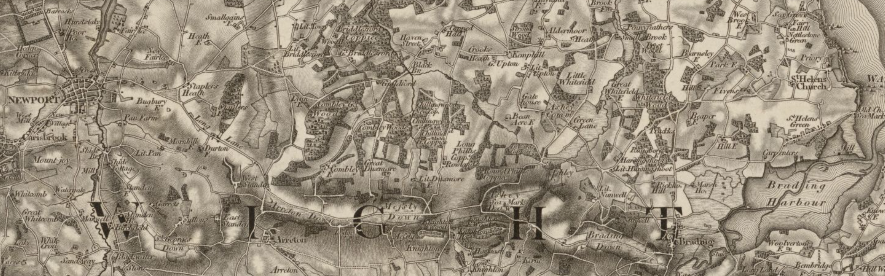
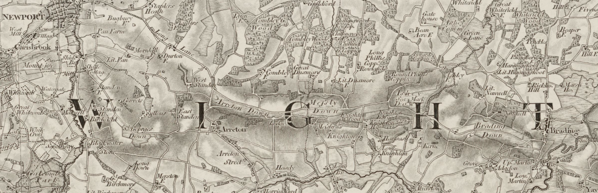

Hanging in Chains

https://api.parliament.uk/historic-hansard/commons/1834/mar/13/hanging-murderers-in-chains

https://maps.nls.uk/geo/explore/side-by-side/#zoom=14.322926465111756&lat=50.68283&lon=-1.27140&layers=6&right=OSAPI

https://www.historyextra.com/period/modern/a-brief-history-of-capital-punishment-in-britain/

https://archive.org/details/acollectionpubl05britgoog/page/n102/mode/2up?q=executed

https://maps.nls.uk/view-full/257576525#zoom=5.9&lat=8350&lon=15719&layers=BT

https://maps.nls.uk/view/257576936
Surveyed: 1797 to 1809, Published: 1810, Railways: 1841, Source mapping to: ca. 1848, Printed: 1863

up from Sullens to Arreton Down then along the Downs road.

Copse shown at East Standen

---
https://archive.org/details/bim_eighteenth-century_a-description-of-england_1769_4/mode/2up?q=brading
A description of England and Wales. Containing a particular account of each county ... Embellished with two hundred and forty copper plates, of palaces, castles, cathedrals; ...  1769: Vol 4
Publication date 1769

p215

BRADING, which lies to the ſouth-weſt of St. Helen's, is alſo an inconſiderable place. It has been a market town, and has ſtill two fairs, which are held on the 12th of May, and the 2d of October, for toys.

---
https://archive.org/details/bim_eighteenth-century_a-new-tour-thro-england_beaumont-george-travel_1768/page/n45/mode/2up?q=brading
A new tour thro' England, perform'd in the summers of 1765, 1766, and 1767, by George Beaumont, Esq; and Capt. Henry Disney. ... With a new map of England, by Kitchen, ...  1768
by Beaumont, George, traveller.

Publication date 1768

p43

NEWPORT, the principal Town in the Iſland, about 5M. from Cowes, is a very antient Borough, and a large populous Town, greatly enriched by its Plenty and Commerce, which the Inhabitants have not failed to improve, The Genius of the People is very much turned that Way, and as they are of late grown very polite, they have, at a prodigious Expence levelled and new pitched the Town; poſted and paved it with broad Stone, about 5 Feet from the Houſes, for Paſſengers; for being the only Market Town, it is often very much crowded, the Corn being generally brought to Market and not ſold by Sample. Cowes River is navigable by Barges to Newport Key, which extends itſelf round good Part of the Town, which renders their ſhipping off Goods from the Storehouſes very commodious: The Streets are regular and uniform, meeting at right Angles, The Corn, Beaſt, and Butter Markets are kept in diſtinct Squares, very large and commodious. The Buildings are greatly improved, but neither grand nor regular. The Church is a large Building, with a ſquare Tower, and the Inhabitants have lately erected a very curious Organ, and otherwiſe greatly decorated it: Yet this Church is but a Chapel or Eaſe to Cariſbrook, a ſmall Village ſituated on a very lofty Eminence, about a M. from Newport, and is famous for a Caſtle, now greatly decayed by Time; but the Intrenchment without the Walls, the many Curioſisties within, and the extenſive Proſpect it affords, renfer it one of the grreateſt Curioſities in the iſland. Here King Charles I, was confined 'till removed to Hurſt Caſtle,

About two Miles from Newport, near St. George's Down, are large Rocks, from whence Water continually drops; in the Road to which is Shidebridge a remarkable pleaſant Walk, and famous for a conſtant Spring of prodigiouſly fine Water.

Beſides Newport there are two Boroughs, viz. Yarmouth and Newtown, the latter the moſt ancient, but at preſent only a ſmall Place.

---

Acc to Golden Age of the W 02/03/1737, execution Sat 19/03/1737 also http://www.capitalpunishmentuk.org/hants.html

Brading

https://archive.org/details/bim_eighteenth-century_a-new-correct-and-much_albin-john_1795/page/468/mode/2up?q=niton

A new, correct, and much-improved history of the Isle of Wight, ...  1795
by [Albin, John].

Publication date 1795

pp.468-

Or the town of Brading, it is neceſſary to obſerve that it is ſituated at the eaſt end of the iſland, at the diſtance nearly of eight miles from the town of Newport. The ſea flows to the quay on the ſeawall at the neareſt part of the haven, about a quarter of a mile diſtant, to which veſſels of thirty or forty tons burden approach to receive or deliver their cargoes. On this quay are ſuitable ſtorchouſes for corn or merchandize, and a conſtant depoſit of coals for ſale.

Pars town which has only one long ſtreet, of irregular buildings, and about five hundred inhabitants, has a market for corn on Mondays, and a good ſupply of that article by ſamples; and great quantities are ſhipped off here for the various mills of the iſland, or ſent coaſtways on commiſſion. From theſe mills vaſt quantities of flour are carried to the weſtern coaſts, or to the iſlands of Jerſey, Guernſey, and Alderney.

Tur original grant for the market of this town, was, that it ſhould be held on Wedneſdays, with two fairs annually on the feaſt of St. Philip and St. James, the day before and after, with the eve and day of St. Matthew. Theſe are now kept on the 12th of May and 2d of October. They have alſo a power to hold a court of pie powder, for doing juſtice to buyers and ſellers on the ſpot.

We find from the ancient record, called domeſday book, that William Fitz Azor, held lands in Berardinz (Brading) of the king, which were then and in the time of Edward the Confeſſor aſſeſſed for three parts of a yard land. In the time of Iſabella de Fortibus, John Kene held half a fee of the lords of Yaverland, as parcel of her poſſeſſions; and by a roll of the 13th of Edward the Third, the church (meaning the impropriation) of Brading was to furniſh two men at arms for defence of the iiland, and the vicarage one bowman.

From reſpectable ms. authority we are informed that king Charles the Second landed here in his way to Sandown fort in 1665; and we ſhall ſee under Niton an authority no leſs authentic, that he landed in that pariſh in 1675. Ho to rec

TO DO albin story oysters  oyster beds Brading
https://archive.org/details/bim_eighteenth-century_a-new-correct-and-much_albin-john_1795/page/474/mode/2up?q=niton

---

"A 1755 travellers' guide to London explains to foreign visitors that gibbets were situated on the highway "near the Place where the Fact was done, to perpetuate the Villainy of the Crime, and to serve as an Example" https://link.springer.com/chapter/10.1057%2F978-1-137-60089-9_2 citing Anon (1755) London in Miniature (London: C. Corbett), p. 217.

Micheal Morey, Assize date W 2 March, executed Saturday, 19 March, 1737, Gallows Hill, Winchester http://www.capitalpunishmentuk.org/hants.html
http://www.britishexecutions.co.uk/execution-content.php?key=7922&termRef=Michael%20Morey
But "Given that the start of assizes is likely to be before the date of conviction in many cases (assize sittings could take up to a week in this period)" https://link.springer.com/chapter/10.1057%2F978-1-137-60089-9_2

"The poles from which the cages were hung were often very high — 10 metres or more, which discouraged attempts to rescue the body or to steal the gibbet — and supported chains which comprised a substantial quantity of iron. The post was also sometimes fitted with spikes around the bottom to make it hard to scale. The gibbet post of Adam Graham, executed in 1748 and hung in chains on Kingmoor, Carlisle, was apparently 12 yards high and had 12,000 nails in it to prevent it being scaled or cut down to remove the body." must contain the body and prevent it from either falling out or being removed, while at the same time still maximising its visibility. In order to do this, most gibbet cages were designed to fit closely to the body, allowing as much as possible of the body to be seen, while ensuring that the gaps between bars were too small to remove it. When possible, the prisoner was measured for his irons before execution, but there were other means of ensuring a close fit, notably construction with punched straps and hoops that could be adjusted to size by riveting ... small pieces of the body could easily be removed by animals or birds ... the gibbet cage had to be durable. The body was supposed to remain up there until it had decayed, and as there was no particular time for taking it down, many gibbets remained in their location for decades ... a gibbet was needed so infrequently that it was not a form within the learned repertoire of most blacksmiths. Moreover, it was needed almost immediately and so left the blacksmith little time to experiment or research other models. Therefore, each blacksmith needed to design a gibbet effectively from scratch https://link.springer.com/chapter/10.1057%2F978-1-137-60089-9_2 citing .
Hartshorne Hanging in Chains, pp. 66–67.

https://link.springer.com/chapter/10.1057%2F978-1-137-60089-9_2 "The Murder Act specifies that capital sentences for murder should be carried out on the second day after conviction." but "Typically, the body of a criminal was gibbeted within a day or two of being executed, but sometimes there were longer intervals, especially when the body had to be transported some distance to the place appointed for gibbeting." [? what is date of Murder Act? Rooks and Ravens says execution was immediately following sentence? Murder Act 1751? https://en.wikipedia.org/wiki/Murder_Act_1751 

---
