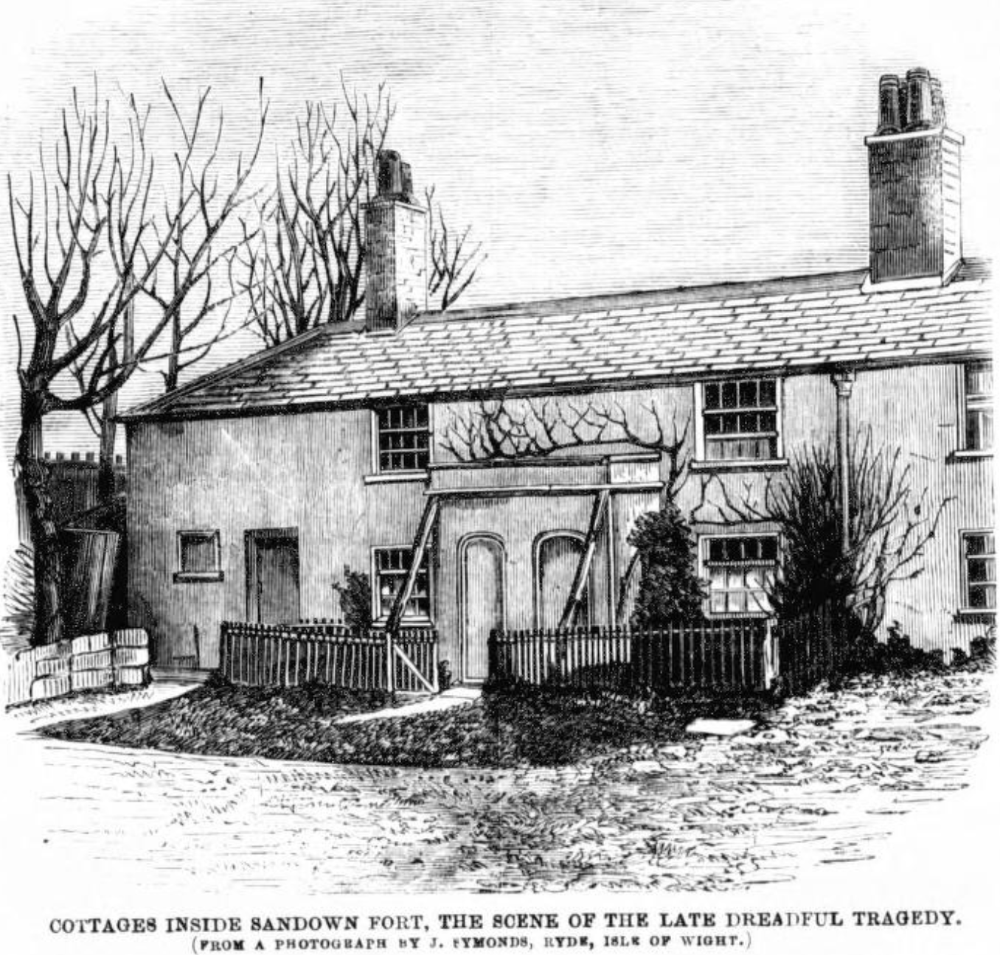
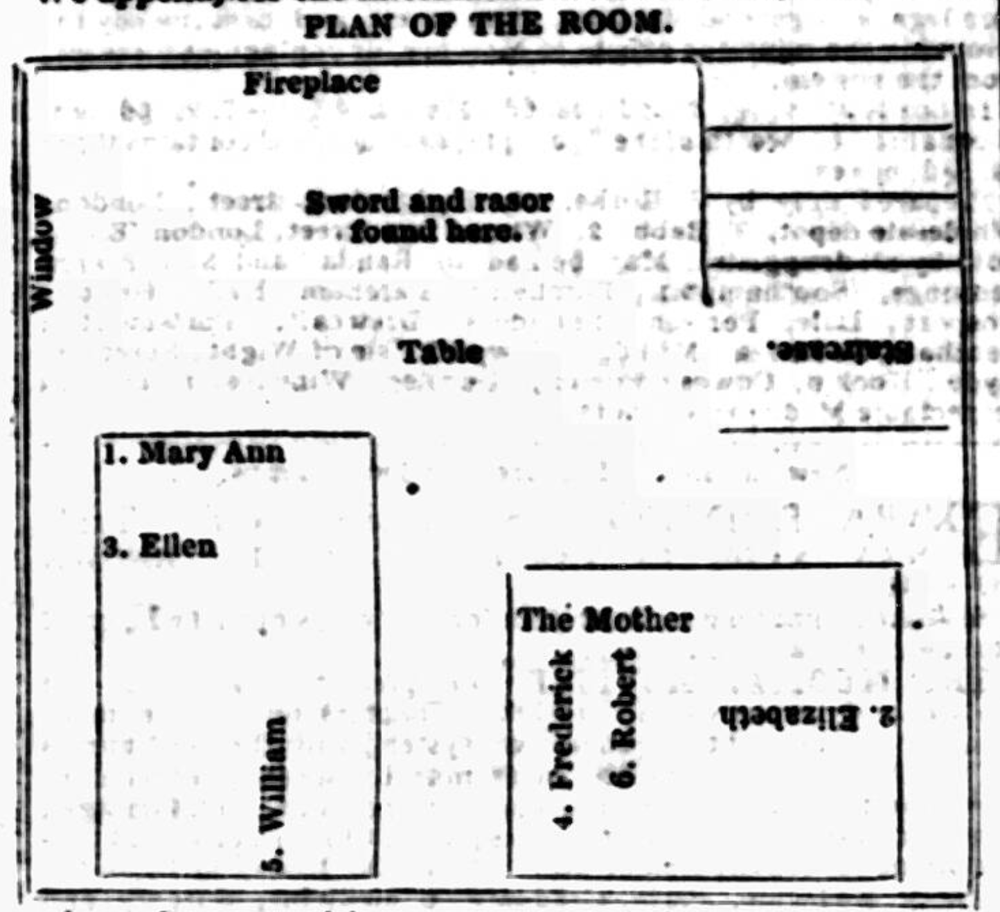
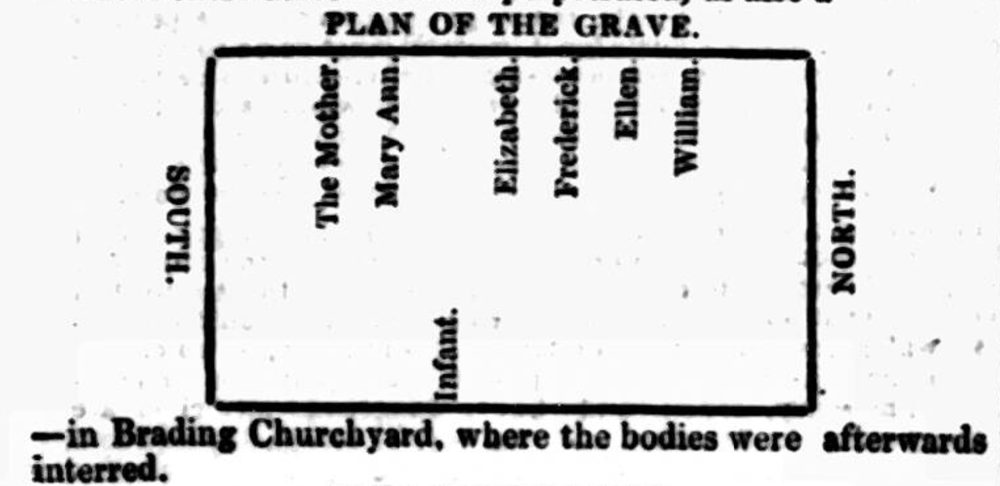
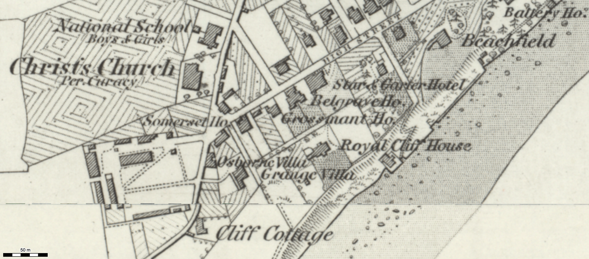
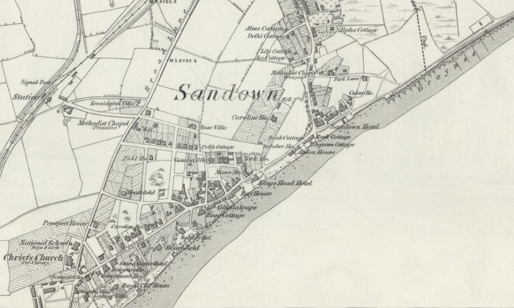

# Family Murdered at Sandown

Part of my motivation for (re)discovering local historical tales is to get a sense of the stories which everyone knew at the time, which might have been passed from one generation to the next because they were notable, and which are all but lost or forgotten today.

I first came across this harrowing tale whilst searching for an original version of the the *Michael Morey* rhyme. I eventually found a variant of the rhyme in the *Isle of Wight Observer* of [Saturday 09 March 1861](https://britishnewspaperarchive.co.uk/viewer/bl/0000170/18610309/003/0003) in an article entitled *"Murder in the Isle of Wight*. That article also included the intriguing sentence: *As to the Sandown tragedy of last year, it was committed by a Leeds soldier who might have been quartered in Canterbury or Dublin just likely as where be was; and even he was a maniac, and never tried.*  Needless to say, I was curious as to what that tragedy might have been...

The tale also brings to my mind the story of Gunner Haines, which I came across in the form of a song by Gaz Brookfield. If ever the opportunity arises, I would quite like to tell the tales alongside each other in some way.

SEE ELSEWHERE SANDOWN HISTORY

## Sandown (Sandham) Fort

See also *The Sandown Barracks Master Affair, 1806*

https://archive.org/details/bim_eighteenth-century_a-new-correct-and-much_albin-john_1795/page/114/mode/2up?q=plundering
A new, correct, and much-improved history of the Isle of Wight, ...  1795
by [Albin, John].

Publication date 1795

pp114-6

SANDOWN FORT.

When the neceſſity of fortifying the coaſts of this iſland was found neceſſary, and the ſyſtem of defence progreſſively advanced towards a ſtate of maturity, to guard againſt the marauding and plundering expeditions of the common enemy, and to afford protection and ſecurity to the lives and poſſeſſions of the iſlanders; the ſituation of this ſpot, which is almoſt the only acceſſible part of the ſouthern coaſt, ſtrikes the eye as an object for military operations. Hence it was one of the firſt objects to fortify and defend this natural inroad into the iſland, in the time of Henry the Eighth; and the demolition of the religious houſes, which was then rendered compleat, afforded ample materials for theſe purpoſes.

THIS fort is on the ſouth-eaſt ſide of the iſland, and has the command of a bay, in which there is a good landing place. The building is very low, and of a quadrangular form; it is flanked alfo by four baſtions, and the whole is encompaſſed with a ditch. It had formerly an eſtabliſhment of a maſter gunner and thirty ſoldiers, being juſtly eſteemed from its fituation to be of the greateſt importance of any fort in the iſland. But this eſtabliſhment has been conſiderably leſſened ſince that time; and the pay of twenty-two of the ſoldiers applied to increaſe the ſalaries of the maſter gunners of the other forts, where the military eſtabliſhments are ſtill maintained. `[In the ſecond year of queen Elizabeth we only meet with the eſtabliſhment of a porter at eight pence a day, and three gunners at ſix pence a day each, as we have already mentioned under Yarmouth and Freſhwater or Sharpnode.]`

Fox ſome time this fort had been very much neglected; but government have repaired it at a very conſiderable expence, and have refitted the apartments into a comfortable ſummer reſidence for the captain. It now ſupports a captain at half a crown per day, twelve warders at eight pence a day each, a maſter gunner at two ſhillings a day, and three other gunners at one ſhilling a day each; making an annual eſtabliſhment of two hundred and eighty-two pounds ſeventeen ſhillings and fix Pence.

https://britishnewspaperarchive.co.uk/viewer/bl/0000230/18051014/014/0004
Hampshire Chronicle - Monday 14 October 1805

*Cowes, Oct. 9.*

...

The 3d battalion of the 60th regiment landed here, this day, from Hilsea Barracks, and marched to Sandown Fort.

---

https://archive.org/details/illustrated-times/1860/Illustrated%20Times%20%230270%20%281860-06-09%29%20%28BNA%29/page/359/mode/1up
Illustrated Times - Saturday 09 June 1860

SERGEANT WHITWORTH'S COTTAGE INSIDE SANDOWN FORT.

The cottage in the annexed View to the left hand of the spectator was recently the residence of Sergeant Whitworth, master-gunner in Sandown Fort, and the scene of the fearful tragedy which was reported in our columns a fortnight since.

Sandown Fort is a low quadrangular fortification, flanked with a bastion at each angle, and surrounded by a ditch. It was constructed as far back as the reign of Henry VIII., when the Isle of Wight was constantly subjected to piratical depredations, and is still kept in a good state of repair.

COTTAGES INSIDE SANDOWN FORT, THE SCENE OF THE LATE DREADFUL TRAGEDY. (FROM A PHOTOGRAPH bY J. SYMONDS, RYDE, ISLE OF WIGHT.)

---

https://britishnewspaperarchive.co.uk/viewer/bl/0000069/18600519/024/0006
Hampshire Telegraph - Saturday 19 May 1860

BOROUGH SESSIONS, MONDAY.—Before the Mayor, E. Way and R. M. Wavell, Esqrs.—Corporal Kimber, of the Isle of Wight Artillery Militia, now stationed at Sandown Fort, was charged with having assaulted Elizabeth Dove, the landlady of the White Horse, in Nodehill, because she interfered to prevent a fight between him and a stranger, whom he had knocked down because the man had challenged him to dance. Defendant denied the charge, and on being fined 17s. 6d. he refused to pay it, and was committed for one month. Captain Manners came forward, and said that as the prisoner bore a very good character in the regiment he would pay the money for him—an offer which restored him to liberty.

https://britishnewspaperarchive.co.uk/viewer/bl/0000231/18600519/066/0008
Hampshire Chronicle - Saturday 19 May 1860

Dreadful Occurrence.—A report reached Portsmouth yesterday that Sergeant Whitworth, of the Coast Brigade of Royal Artillery, stationed at Sandown Fort, Isle of Wight, destroyed his wife and five children that morning by nearly severing their heads from their bodies, and afterwards attempted to cut his own throat, but failed to do this effectually. He afterwards rushed into the presence of the commanding officer, and made declaration of having committed these dreadful deeds. Three non-commissioned officers were despatched to the man's quarters, on entering which the unfortunate wife and five children were found quite dead, one of the children's heads being severed from the body, and all presenting a horrible spectacle from the dreadful nature of their wounds. Whitworth was at once made a prisoner, and the last news from the Island states that he is likely to recover. He is supposed to be insane.

https://britishnewspaperarchive.co.uk/viewer/bl/0000069/18600519/012/0004
Hampshire Telegraph - Saturday 19 May 1860

WIFE AND SIX CHILDREN MURDERED BY A MADMAN AT SANDOWN.

The little village of Sandown has been thrown into a state of the utmost consternation by a horrible tragedy which has taken place at the fort in that neighbourhood. The villagers "with white lips" stand at the corners of the streets deploring the untimely end of a mother and six children who have or all been murdered in cold blood by a maniac husband  and father, and it is even said by one authority, though with what truth we cannot say, that the stout-hearted soldiers of the fort had deserted their quarters for other and more congenial dwelling places.

The dreadful affair would appear to have taken place some time during the night of Thursday, probably early on Friday morning, but nothing was known of it until a short time after noon on Friday. At about that time Sergeant Whitworth, the master-gunner in charge of the Fort, was observed by a coast-guardsman on duty in one of the lanes adjacent to the Fort, walking towards the parade ground, with his hand to his neck. He enquired he what was the matter with it, and received for reply that it was nothing — only a scratch. He further told the Coastguardsman that during the night a man or men had got in down the chimney, and had shot his wife and children, with a pistol. As Whitworth's conduct had been recently somewhat strange, and had been generally noticed by his neighbours as not quite consistent with soundness of intellect, the Coastguardsman took no notice of the observation and passed on; the sergeant went in the direction of the fort. Shortly afterwards,i consequence of the unfortunate maniac's assertion with respect to the men coming down the chimney and murdering his wife and children, two non-commissioned officers went to his house, which is situated within the precincts of the fort, and an entrance having been effected, a most dreadful scene presented itself. The wife of the gunner and the whole of his children had been deliberately murdered, their throats having been cut with a razor. On making the horrible discovery, the non-commissioned officers, leaving the place undisturbed, immediately communicated with the police, and they shortly afterwards proceeded to the spot. They found the floor of the house saturated with blood, and the odour which arose from its commencing decomposition gave rise to the remark that it smelt like a slaughter-house. At the foot of the bed was found lying Mrs. Harris, partly undressed, with her youngest babe in her arms. On her right hand lay another child, and at the foot of the bed a third, the ages of the three being respectively about four months, four or five years, and 11 or 12 years. The whole of these had their throats cut, and were lying in a pool of coagulated blood. On a second bed were found the other three children in a similar condition. One of these was about I8 months old, the others were the two eldest. The whole of the bodies were quite cold, and their condition, as well as the state of the blood around them, showed that the dreadful deed must have been committed some hours previously.

The unfortunate maniac, for it was evident that he could receive no other designation, as, although no thought was entertained of his being capable of committing such a deed, his manner had been for sone time previously remarked as strange, appears, after destroying the lives of his wife and children to have made an attempt upon his own. The wound he inflicted upon himself was, however, very slight, and he will soon recover from its effects. He was taken into custody as soon as the fact of the murders was made known, and he gave into the hands of one of the sergeants of the fort a letter from himself addressed to the adjutant. He is stated to be about the age of 35, and to have belonged to Leeds, and amongst other rumours as to the cause of his insanity, is one alleging that complaints having been made to head-quarters respecting him, and that his removal from his position was imminent. His accounts appear to have been accurately kept, and have found to balance correctly. He had no pecuniary embarrassments, and his wife was a woman much esteemed about the fort, and was considered to have made the miserable man's home comfortable, and, so far as was in her power, happy. The children are stated to have been well-behaved.

It is stated that since Whitworth has been at the hospital he has confessed having murdered his wife and six children, and also that it was his intention to have blown up the fort, but that having lost the key he was unable to do so. Had he been enabled to carry out his intention the consequences might have been very serious, as the village itself might have suffered.

An inquest is being held to-day on the body of the murdered woman and children.

---

The *Hereford Journal* lifted the *Hampshire Telegraph* of Saturday 19 May 1860, and added an additional report on the burial of the bodies taken from the *Morning Post*. (The same extended report appeared in the *Illustrated Times* of [Saturday 26 May 1860](https://archive.org/details/illustrated-times/1860/Illustrated%20Times%20%230268%20%281860-05-26%29%20%28BNA%29/page/332/mode/2up).)

https://britishnewspaperarchive.co.uk/viewer/bl/0000398/18600523/041/0008
Hereford Journal - Wednesday 23 May 1860

Shocking Murder of a Wife and Children at Sandown.

...

The board guardians of the Newport Union were applied to by the police to bury the bodies. The *Morning Post* says, "They sent over seven boxes— scarcely to be designated coffins— into which the gory remains of the unfortunate sufferers were indecently forced by some of the pauper officials soon after their arrival. There was not the slightest attempt made to perform any of the usual cleanly offices; and some of the c coffins not being large enough, the bodies were actually crushed into their narrow prisons, with most sacrilegious indecency, and without the smallest article of funeral clothing upon them. The lids of the coffins were merely secured by a few common nails, and in this condition the whole seven were huddled together in a kind of taxed cart, and sent over at one o'clock to Brading Church for interment. So deficient were all the arrangements, that but for the volunteer service of a small party of men belonging to the Isle of Wight Militia Artillery, who had come over to Brading from feelings of curiosity, the bodies could not have been removed into the church. Their aid having been accepted, the coffins were deposited in the centre aisle, where they presented oneof the most painful exhibitions that can be imagined. The service was read by the vicar, the Rev. Isidore Heath. The church was densely crowded, but neither relative nor friend of the deceased's family was present. The interment took place in a square grave, scarcely three feet deep—in king with the indecency marking all the arrangements of the funeral. It is a disagreeable duty to allude to the short-comings of any public body, but in this case silence would be inexcusable on the part of the reporter, who was an eyewitness of the painful facts he has endeavoured to describe."

https://britishnewspaperarchive.co.uk/viewer/bl/0002941/18600526/097/0010
Hampshire Independent - Saturday 26 May 1860

[We were enabled to publish a portion of the subjoined in a special edition of last week's issue.]

A more painful tragedy than the appalling murder committed on Friday last in the quiet and romantic village of Sandown, as briefly recorded in our special issue of Saturday, has, perhaps, never been known in the Isle of Wight within the memory of any living person, either as it regards its terrible minutiae or the novel sensation it created. When the first floating rumours of the sad occurrence, with its many and increasing exaggerations, flew from town to town, from village to village, from house to house, and from lip to lip, persons refused to credit the horrid fact, and when the real truth became, alas, too painfully apparent, the consternation of the public may be far more easily imagined than pictured. Persons of all classes and ages in the Island are alike roused into an excitement which will not easily be quelled.

Murder, presented in any shape or in any locality, and even under only what may be termed ordinary circumstances, always carries with it a certain amount of fascinating attraction which the most stolid cannot resist; but when the event and something far above the average amount of horror, and when that event transpires in the heart of the most rural part of England's southern borders, we are not surprised, as we record the fact of the excitement to which we now allude.

Hitherto the name of Sandown has been associated with holiday happiness, craggy undercliff, and summer glories; now the tourist will be made acquainted with a tale of horror, and Sandown will, in future be pointed out as the place from whence the innocent spirits of six young children, with their loved parent, were hurried into the presence of their Maker by the frenzied act of him who was their nearest and dearest earthly friend.

The scene of this transaction is the Sandown Fort, where, for the time being, the Isle of Wight Artillery are stationed. The fort in itself is not of very extensive dimensions, and commands the bay to which the town owes its chief celebrity. As some of our readers are perhaps aware, this building is situated at some distance from the main road, and in a field somewhat near the sea-shore, which is reached by the left hand turning which deviates from the Ventnor high road. After crossing the moat bridge which forms the approach to the fort, a gate is entered, which conducts to a moderate-sized court. On the right and left are situated the dwelling-houses of a more humble character, in which the non-commissioned officers, with their families, reside. In the buildings facing the gateway are the officers' quarters and other erections constituting the fortification. The house which has now obtained so unenviable a notoriety is on the left side of the court, and of small dimensions. It is a two storied cottage, and is in a very dilapidated condition, the apartments being exceedingly small. There are two small apartments or rooms, on the ground floor, one of which contains a front door leading into the court, and another leading to a garden at the back of the premises. Two stair cases on the right and left from the entrance conduct to the bedrooms, the room on the right being, apparently, the only one occupied as a sleeping apartment for the family. The unhappy beings who, until Thursday night or Friday morning, were its mortal occupants, were eight in number, consisting of Sergeant William Whitworth, his wife and family, the members of which were named respectively Ellen, Lizzie, Molly, Frederick, William, and Robert, another member living away from home.

Some considerable amount of difficulty has been, and still is, felt in ascertaining the ages of the various deceased individuals, the perpetrator of the deed himself being too ill to afford the necessary information, and the brother officers and companions of the murderer being quite ignorant of these family details. Whitworth himself states that the eldest girl is 12 years old, the youngest being about 12 months. From their appearance this is, doubtless, correct, and, probably, the ages of the intervening children may vary about two years the one from the other.

It appears that Whitworth was appointed master-gunner of Sandown Fort, in July last, since which time he has, according to the custom of the service, lived in separate apartments therein, his principal duties being of a light nature and connected with the stores. It is said that he has seen some hard service in foreign countries, where he had been wounded in the head. During the time of his residence in Sandown Fort, his actions have been uniformly quiet and reserved. Indeed, the wife, as well as the husband, was marked out as being averse to gossip or free communication with the neighbours, who, accordingly, held but little intercourse with them. Perfectly harmless and peaceable in their habits, they interfered with none, and, in return, they, too, were unmolested. Amongst his officers and comrades, Whitworth always passed as being an "odd man." He seemed to have entertained an especial grudge against a certain class of engineer officers, and, on one occasion he told his captain that he had them in his power, by reason of certain forged letters in his possession. Although, strictly speaking, this was a military offence, the captain very justly declined to notice the observations, knowing the tendency of veteran soldiers to adopt this particular line of conduct, and grumble at the conduct of their superiors. Things went on in their usual course until Friday last, when the residents of an opposite cottage, observing no signs of life in Whitworth's habitation, remarked thereon some time during the morning. There was no smoke to be seen coming from the chimney, as usual, and the blinds remained closed. At portion of the Whitworth family had been seen alive on the previous day (Thursday), and the head of the household, although considered "odd," was not thought the be sufficiently unsound to be at all dangerous, especially to his own family, who were, to all human appearances, united and affectionate.

From the information we gathered on the spot, it appears that Whitworth was walking down a lane shortly after noon on Friday, when he met a Coastguardsman, to whom, in the course of a very rambling and incoherent conversation, he imparted the remarkable and startling information that two men had come down his (Whitworth's) chimney, and, with a pistol, shot five of his children. Alarmed at this statement, the Coastguardsman proceeded to the Fort, and made the lamentable discovery we are called upon to recount. From the statement of the witnesses, whose evidence was taken at inquest, and which we give more fully below, it also transpired that Whitworth made his appearance on the parade ground about two o'clock, just as the men were falling into rank, as is the daily custom.

The barracks at Sandown, where another portion of the Isle of Wight Artillery are now stationed, is apart from the fort, and some distance farther up the village, and, at stated periods of the day, the different companies of Artillerymen meet to drill and perform other military duties. On the present occasion, the bugle sounded about two o'clock, and the men, in answer to the summons, had assembled in rank with their officers, when Whitworth, clothed in his soldier's overcoat, the collar of which covered his neck, was perceived rushing towards Captains Robinson and Manners, who were present. He there fell down upon his knees before them, and his wild actions and hurried expressions were of such a nature that suspicion was at once aroused, and some of the officers and men immediately running away to the fort, arrived there, when they ascended the left-hand stairs of Whitworth's house, and upon opening the shutters, threw the cheerful light of day upon one of the most sickly spectacles that sunshine ever revealed to human gaze. The room is very small, perhaps 16 feet square, and contains, beside other smaller furniture, two bedsteads of equal size, the one farthest from the window being placed in a longitudinal direction, and the other in the opposite position. When the staff sergeant, Daish, entered the room, the shutters, which were made of three or four folding leaves, were closed, and these obstructions being speedily removed, the real facts of the case, written in glaring crimson letters, were but too distinctly evident. On the bed nearest the window lay the second eldest daughter, a small boy, and a little child. The latter was lying on the pillow, with eyes half opened and in a most placid attitude. The pleasing countenance of the child, upon which rested a kind of smile, scarcely gave any indication of the absence of life, and but for the little marble hand which lay stiffened and clenched by the side, one would at first imagine that the poor little fellow was in a peaceful slumber; but the gashed throat and blood stained night dress and pillow soon dispelled the idea. The wound inflicted, although quite sufficient to cause death, was not very large or deep.

The girl was lying across the bed, near the foot, and her clenched hands and convulsed features spoke of the terrible struggle the poor child had gone through in her last moments. Her stockings' feet were dyed with blood, as if she had run about after the infliction of the first wound, and, after a careful examination of the footprints on the stairs and kitchen floor, it would seem that she must have run down stairs and crouched under a deal table at the further end of the room, but, being pursued by her father, was again forced up stairs to die with her brothers and sisters and mother. Of course this is only surmise, and the entire quietude which seems to have prevailed in the court during this period is one of the chief mysteries of the affair.

From the blood stains on the floor this was undoubtedly the case. The other child was also lying partly across the the bed, in its night clothes, and with its throat cut. On the other bed lay the mother, in an oblique position, her arm hanging over the outer edge of the bed, her feet bare, and with a sickening wound in the throat. She was wearing a dark blue dress, but without stockings or cap. At her feet lay the eldest girl, with her head half severed from the body. A little child between the mother and daughter lay curled up in its own blood, while the baby at the breast appeared to have been suffocated and thus destroyed. With the exception of the mother, the whole of the family were in their night clothes, and from the general aspect of the room, as well as from the evidence of the witnesses, we are of opinion that the deed was done while the unsuspecting children were slumbering the sleep of confiding innocence. The floor was saturated with gory blood, the chamber wall was sprinkled with the same awful stain, and the horrid traces of the murderer's hand were to be seen everywhere. Never before have we seen such a fearful chamber of horrors, and a true description baffles the powers of any pen.

We have seen death under many appalling and heart-rending circumstances; but, as was the expression of policemen, soldiers, coroner, reporters, jurors, and all who witnessed the Sandown tragedy, "This is the most horrible of all." Perhaps the calm sunshine of a bright May day, the vernal beauty of a budding spring, and the influence exercised upon the mind by the mingled associations of season and situation, rendered the contrast between the external landscape and the internal appearance of the room all the more striking; but the effects of the visit there made on Saturday upon the Jury and others connected with the public were imprinted upon the countenances of each and all.

Some of the jurymen, as they came from the room, were weeping manly tears, and the heart that could have contemplated the harrowing scene, and still remain untouched, must have been indeed as hard as the nether mill-stone. In the lower room of the house, and on the stairs communicating thereto, the floor was literally covered with bloodstains, imprinted by human feet, two sizes being visible; one that of a full-grown adult, and the other that of a child, about 10 or 11 years old. The latch of the front door was secured by a piece of wood being inserted above it, and the official papers strewn about the place, stained with the same red colouring as dyed the bed clothes and garments in the upper room, denoted the confusion of the unhappy Whitworth, who, by his own hand, made himself childless and wifeless, and who, as long as his wretched life shall last, will be haunted by the blackest and most undying remorse that can agitate the mind of mortal man.

When he appeared upon the muster ground, it was seen that he had inflicted a severe wound upon his own throat, which, however, was not deep enough to cause instantaneous death. He now lies in the hospital in a precarious state, and at times his mind is wandering. He occasionally adverts to his wife in affectionate and touching terms, remarking that she was a good woman and wife. His children are also at times the subject of his conversation.

There can be but one opinion upon this truly melancholy affair—a parallel to which we have never before recorded, the like of which may we never again witness or describe. Every action of the murderer is the action of a maniac, and this conviction makes the act all the more unhappy. It is rumoured that Whitworth intended to blow up the magazine of the fort, and we shudder to think that he had the power to do even this, had he felt so inclined. Too much care cannot be taken by the governing powers of such places, to secure those servants who can at all times be *entirely* trusted, and, while acquitting the authorities of Sandown Fort of even the shadow of a blame, we hope this dreadful tragedy will act in a salutary manner upon all who are in any way connected with persons of a suspicious sanity.

THE INQUEST

was held in the entrance hall of the fort on Saturday, at one o'clock, before the Coroner, F. Blake, in. A respectable jury having been empanelled, the Rev. C. Bury was elected foreman. Captain Cainers attended to watch the case on behalf of the service to which Whitworth belonged. The bodies having been viewed,

The Coroner, after remarking upon the appalling circumstances of the case, the like of which he had never seen, remarked that it was quite unnecessary for them to trouble themselves as to the state of mind of the person whom they suspected to be the murderer; that would be for the decision of those before whom the case was tried. He begged them to dismiss from their minds any facts or information they had heard out of doors, and judge the case from the evidence which would be brought before them. After reminding them of the great importance of the enquiry, the following evidence was given:—

John Daish deposed: I am a staff sargeant in the Isle of Wight Artillery, and am now stationed at Sandown. Having seen the bodies which the Jury have just viewed, I can identify the woman and the eldest two children. The woman, whose surname I do not know, was the wife of Sergeant Whitworth, who was in the Royal Artillery, and master gunner at Sandown Fort. The two eldest girls are the daughters of Sergeant Whitworth. The eldest girl is named Ellen, and 12 years of age. I know neither the age nor name of the second. I saw the mother and one of the smaller children on Tuesday last. There are seven children in the family, one of whom is absent from home. There are three boys and three girls dead. Whitworth and his family occupied a separate tenement in the fort. I have known Whitworth since last July, since which time he has been the master gunner at this fort. I saw Whitworth on Tuesday, but not sufficiently to speak as to the terms existing between him and his wife. This was about half an hour after I saw Mrs. Whitworth. I talked with him about the gun drill and other things, but did not observe anything strange in his manner. I saw Whitworth in the afternoon yesterday on the Barrack Parade, about twenty minutes past two. While on the Parade I saw him coming towards the Parade, near thé Star and Garter Hotel. He very hurried and almost staggering, as he walked along across the parade ground, towards the officer's quarters. Several officers were standing round the door steps. He went up to Captain Robinson, of the Isle of Wight Artillery, and fell on his knees before him. He talked in a very excited manner, but I could not distinguish the words he spoke. He also put both hands up to his throat, and, putting his right hand in his pocket, took out some papers and gave to the Captain, and then followed the officers to their quarters, from whence he soon returned with the Officers. On Major Gordon calling for some one to take Whitworth to the hospital, I and others accompanied him there. His face and hands were bloody, but as his soldier's overcoat was buttoned close up to the chin, I did not see his throat. By direction of Capt. Worsley, I then came to the fort to look after his wife and children. I ran to Whitworth's house, where I saw Corporal Eastly of the Royal Engineers, and his wife, standing in the court-yard of the fort, and opposite the house. They knew nothing of what had occurred. When about to enter the house, I saw one of the Coastguard (Hoare) come out of the house. I asked him what was amiss, and he did not know. On going up-stairs, I observed footmarks of blood on the floor of lower rooms, and in the passage, and there were similar marks on the stairs. When I got up-stairs, I went into the bedroom, but it was dark, the windows being closed, and the shitters covering them. The right hand shutter was open about six inches. I opened the shutter, and the first thing I saw was an old sword lying almost in the centre of the floor. There were also lots of papers, and pools of blood around them. The sword itself was lying among the papers, and bloody. There were two beds in the room, and the first thing which caught my attention was the glitter of the ring on the woman's finger. After opening the shutters, I went to the bed, and there saw the body of Mrs. Whitworth and three children, the eldest girl and the baby (a boy), and the body of another child. I went to the other bed, and there found the bodies of three other children, the second girl, a small boy apparently two years old, and another child. All their throats were cut, and they were cold and stiff. Mrs. Whitworth was dressed as she generally is, excepting her boots and cap. All the children were in their night dresses, and five of them had on socks. It appeared to me that they had been murdered without being previously disturbed, as they were all covered up,—Mrs. W. more than the others. A large quantity of blood had soaked into the beds. The socks of the second girl were covered with blood, as if she had been walking about. The bodies had more the appearance of having been lying on the bed, rather than thrown on after they had been murdered. The clothes of each bed were much disordered, part of them being on the floor. I found one open razor lying on the floor almost close to the sword, about 18 inches or two feet from Mrs. Whitworth's bed, and opposite her head. The razor, which was white handled, was covered with blood. As soon as I found out what was the matter I called for assistance, and three men came up, a corporal, a gunner, and the coastguardsman Hoare. There was blood on the walls and bed-post, and a large spot on the window sill, as if it had spirted there. I saw marks of blood on the latch of the front door, and also on the right jamb, as though the hand had rested there. Footmarks of naked feet were also visible from the stairs to the door. The naked footmark appeared to be much larger than the others, which, so far as I could judge, belonged to the  girl who had on the stockings. I did not see Whitworth any more till the evening, when I saw him about 6 o'clock lying in bed in the hospital. I was in the room again at 12 o'clock last night, when he was speaking to the person in charge. He asked him what he was doing there, to which a reply was made "Keeping you company." A few seconds after this Whitworth said to the same man "Poor little Bobby is gone." The man then asked him the names of his children, and he replied that, the eldest was Ellen, then there was Lizzie, Molly, Freddy, Willie, and Bobby. The man asked him the age of tho eldest, and he said 12 years, and the youngest about twelve months. He talked in a rambling way, when not in conversation, about the duties of the fort and the condition of his garden etc. In the room where the bodies were found there were several keys, a large one and small ones attached. The other tenements in the court-yard are occupied by Corporal Eastley and his family, opposite, and some officers' servants also reside there.

By the foreman: The blade of the sword did not appear as if it had been used, but it was spattered with blood. The razor, being deeply stained with blood, appeared to have been used. A part of the edge was turned as if it had come in contact with something hard.

Emma Jane Eastley, wife of Corporal William Eastley, said: My husband is corporal of engineers, attached to this fort. We came into the fort last Thursday week, and our quarters are on the opposite side of the Fort. I spoke to Sergeant William Whitworth once during that time. I have seen the bodies of the deceased woman and children, and can identify them all as being the wife and children of Sergeant Whitworth. They were always very quiet people, and I never heard a word of disagreement between them. Mrs. Whitworth was very close, and I know scarcely anything about her. I last saw Sergeant Whitworth on Thursday, but did not see him on Friday. I last saw Mrs. Whitworth alive on Wednesday evening, when she was standing at the door of her house. I noticed on Thursday and Friday that there was no smoke coming from the chimney, but on Wednesday evening I could see a fire through the window of the bed-room where the bodies are now lying. I saw all the children on Wednesday evening, looking through the downstair window, and Mrs. Whitworth had the baby in her arms, and about ten o'clock on Thursday morning I saw the second girl, Elizabeth, going through the yard to go out of the fort, and she was putting on her shawl at the time. I did not see her afterwards. The window blinds of the bed-room were down the whole of Thursday, and apparently had not been moved. On Friday morning I observed the shutters closed, but about a quarter to two, while my husband and I were standing at the window, wondering why there was no smoke coming from Whitworth's house, my husband remarked "that they were getting up, for he saw the shutter moved." I looked and saw that a small portion of the shutter (the middle leaf) was being opened. On Wednesday last an itinerant razor-grinder came to the fort, and I saw him at Whitworth's door. I took my scissors across to be ground, and the man was sharpening and setting a white-handled razor, which he afterwards took into the house. I think Whitworth was at home at the time, and the parties seemed to be dealing together. Whitworth was always known to have a very peculiar manner, and when I saw him on Thursday, his trousers were put on in a curious way.

By the Foreman: I and my husband went to bed a little before ten o'clock on Thursday, and we remarked that we had seen no light the whole of that evening. Whitworth and his wife were very reserved, and scarcely any person knew anything about them. There is a back way out of Whitworth's house, but he could not leave the fort without coming out of the big gates.

William Whichcot Manners, captain in charge of the fort, said he had known Whitworth about three weeks, who appeared to be a very odd man, and had some continual grievance or other against some persons or other, especially the engineers. He had on one occasion said that he had in his possession that which would transport some of the colonels or generals of engineers. Whitworth seemed very anxious to remain at Sandown Fort, as he had eight or nine months to complete his pension term, and he seemed to be in trouble lest another sergeant should turn him out. Witness had seen Whitworth in the fort on Thursday morning last, and was on the barrack parade on Friday, just after two. The men were just about to fall in, when Whitworth ran across the square in a very excited state. Captain Robinson was a few paces in front of witness. Whitworth came up to Captain Robinson, threw himself on his knees, threw up his hands in an imploring manner, and said, "For God's sake, sir, preserve me!" He further said, "There has been awful work down there, gentlemen; do go down." He then jumped upon his feet, and gave Captain Robinson his watch, an envelope with some papers, and some money. Whitworth then said, "He has used me shamefully, and has held a pistol at my head, and swore he would shoot me if I did not cut my throat." At the same time he pulled down the collar of his coat and showed his throat, which was cut and bloody. He then pushed his way into the mess room, and was afterwards sent to the hospital. Some person present then said, "He has murdered the whole family," or "no doubt he has." This was merely a surmise excited by Whitworth's extraordinary manner. Witness then went down to the house where he found out the dreadful occurrence which had taken place. A portion of the evidence given by Capt. Manners was merely corroborative of the facts before given. He also said that since Whitworth had been in the hospital he had said that his wife was a good woman, and he had nursed her for a fortnight once night and day, and she had nursed him, and he had nursed the children, and he then went off into a rambling story, and talked about ships coming to attack the fort. When the doctor asked him if a bandage which had been put on his head was comfortable, Whitworth replied "Yes, ah my poor wife used to put a great many bandages on. She was a good woman." Witness left the Star and Garter Hotel, where he had been dining on Thursday evening, about half-past ten, and returned to the fort. Whitworth's house was perfectly quiet, and there was no light there. Witness went to bed about twelve o'clock, but there was no noise.

Robert Hoel examined: I am the chief boatman of the Sandown Coastguard Station. I saw Sergeant Whitworth coming up the road yesterday, shortly after two o'clock. He was then between the King's Head and Mr. Walkyier's; I stopped him, and asked what was the matter. He put his hands to his head, and said, "Oh, horrid; they've murdered my six children." I said, "Nonsense." He said, "Yes they have, and I've been watching these men two or three nights, and there was a man standing down there with a pistol in each hand, and they are all dead—my poor wife and all my children." I then asked what was the matter with *him*, as he was covered with blood about the neck. He said he was going to the barracks, but he would see me when he came down again. I made the best of my way to the fort, where I saw Corporal Eastley, and asked him if he had seen the gunner, and he said "Yes, he has just passed." We went into his quarters, and I asked which was the gunner's quarters, and he showed me, and I went in. The doors were closed, but not locked. I looked round the room, and observed tracks of blood on the floor and on the stairs. I didn't go up them, but went out and raised an alarm, when I met Sergeant Daish and two of his comrades, and told them what I'd seen, and he ran up stairs, and I followed, and found the room as he has described it.

The Coroner remarked that there was no evidence whatever to show where Whitworth was, or what he was doing, from the afternoon of Thursday, to the afternoon of Friday.

George Bevis deposed that he was a servant to Captain Manners, and occupied the house next to Whitworth, he could identify the bodies as his wife and children, but could not tell their names. He saw Whitworth on Thursday afternoon and spoke to him about the weather, and that was all. He did not appear excited then, and witness saw no more of him till he came on the parade yesterday. He also saw the eldest girl on Thursday afternoon, when she came into the Fort, but not since. Witness had charge of the Fort-gate on Thursday night, till it closed at half-past nine. At 11 he went to his quarters. He let in Captain Manners at 11 o'clock, and then went to bed. There was no light in any part of Whitworth's house after that time he saw. He was about the place yesterday till he went to Parade, and saw no one either go in or come out of the house, and they all wondered about it, and witness remarked that perhaps the master man had made away with himself and all his family, and he had a good mind to go and rap at his door, and ask for something, in order to see if any one would appear. He had no particular reason for saying so, or for supposing that he had done so. Whitworth was always at home at night, and no one ever annoyed him that he knew of.

P.C. Elson described the state of the room, and produced a sword (a long naval cutlass), and the razor, which he found lying on the floor, covered with blood, in which was a lot of keys, and various papers. The mother and two of the children had socks or stockings on, and some of them appeared as if the persons had been walking about in the blood, and he found corresponding foot prints down stairs. The larger ones were those of a man, with naked feet. Witness could find no papers to throw a light upon it. Whitworth himself was not in a fit state to be brought before the Jury.

The Coroner said he had heard that a paper had come into the possession of Mr. Campbell, where Whitworth had applied to the commanding officer to let him stay there till his term of service had expired.

The shirt and stockings taken from Whitworth at the Hospital, were then produced, and created one universal shudder, being saturated with blood.

Robert Henry Leeson, Esq., surgeon, having been sworn, related the following tale of horror, during which, one of the jurymen fainted away, the evidence being given with considerable manifestations of feeling from the spectators. I saw Sergeant Whitworth yesterday afternoon, between two and three o'clock, at the barrack hospital, and found that he had wounded his throat very severely, with a somewhat blunt instrument. The razor now produced, which has a rough edge, may account for the appearances. It was done with the right hand, and there were two gashes, self inflicted. One was a mere scratch through the skin, but the second was a deep cut, as if done in desperation, but it had not separated any important vessels. It would occasion much loss of blood, but not loss of life immediately. I took no notice of what he said, and only asked a question or two of him, in order to see if there was any internal injury in the throat. He appeared quite unconscious of his actions, and had been very excited, but he was then partially collapsed, from the injuries he had inflicted, and his words were very incoherent. I afterwards saw, and examined in this fort, the bodies of the six children and their mother. The woman's windpipe was completely severed with the large vessels and nerves, the wound was six inches long, very deep, and down to the bones on both sides. There was no appearance of struggling, and I believe she was asleep when the crime was perpetrated, her clothes were on, all except her boots, and I could find no other wound or bruise about her. This wound was no doubt inflicted by the razor, and not the sword, and she must have been dead in two minutes or less. I found, in the same bed, a boy about two or three years old, but he was in such a doubled up position that it is difficult to say how he got so; he might have been carried there by some one, and thrown on the bed, as there was a great quantity of blood in the centre of the room, as well as in the bed, which was absorbed by the bed clothes. That child's throat was cut from ear to ear (dividing all the large vessels), with a jagged instrument, the edge of it having no doubt been taken off, by cutting down to the bone in some other case, and it appeared to me that in two cases the sword had actually hacked the wounds forwards and backwards. One of the other children on the bed was a girl about eleven years old; she had her head on a pillow at the end of the bed, and her throat was cut to a larger extent than any other, the wound being eight inches in length. That was also hacked, and did immense injury to the integuments, which were much cut and slashed about. The other child was a male, about a year old, with a cut in its throat, which extended from side to side, separating all the larger vessels. This also appeared to be done by the sword, and I think the person who did it must have held the child up by the hair of its head at the time, from the way in which the wound was inflicted. The eldest girl of these three had blood on her naked feet: I next examined the bodies of the children on the other bed, one of which was a girl of 12 or thirteen, lying on her side, as if she had been thrown on the bed. Her windpipe had been severed by a severe blow from a blunt instrument, either the razor or the sword: it was a mutilated wound, the instrument being forcibly drawn across the throat, and the stockings on her feet were completely saturated with blood. I have seen the footmarks down the stairs, and they correspond exactly. On the same bed lay a boy of about two years old, with a slight wound as regards length, but deep, and dividing the main arteries. This was most likely done with the razor, and might have been one of the first cases, and was inflicted in its sleep; but I think that the man who did it, when they struggled, placed the pillows over their mouths, and strangled them. Another girl, about 8 or 10, lay there with a similar cut across her throat, dividing the larger vessels; this was a jagged wound. She lay on her back, with her legs drawn up, and the wounds in her case, as well as all the others, were sufficient to, and did cause death, and I do not believe that any of them were self-inflicted. I observed a man's foot-marks down stairs: and on the left foot of Whitworth I found a large bunion when I examined him in the hospital, and on both feet, on the outside, I found protuberances of an unnatural appearance, and the naked foot-marks, all of them corresponded exactly with it. There are also appearances of his having had his stockings on at one period, and the marks of the web are also apparent on the stairs, and distinctly marked, and the same kind of web is to be seen on the stockings now produced; in one heel the fibres running in a circular direction, and the other from side to side. The witness vividly described the picture of this chamber of horrors, and added that he was of opinion that the sufferers had been dead from 15 to 16 hours when he first saw them. The sword proved to be one of six, over which Whitworth had charge, and to which, in store, no one else had access.

Thomas Fleming, a private in the Artillery Militia, said he saw Whitworth in the hospital, and took from him the shirt and socks now produced, in the same state as they then were. His feet were in a gore of blood, though there was no wound about them.

Superintendent Campbell produced a document which he found in the room that morning, on the floor. It was written in pencil, and a pencil lay on the mantle-shelf, and as far as it could be deciphered through the stains of blood which nearly covered it, it appeared to have been written after the time these wholesale murders had been perpetrated. It was very unconnected as regarded the matter, and we could only glean a report of it as follows "Some plot.—Sandown Fort, 1860, 17 May. Sergeant Whitworth and his wife and six children murdered." Lieut. Davis R.E., Dr. Mears, rascals under cloaks as friends, Captain ————— worse. Col. Ogle, Captain Royan, Corporal Eastley, all bad, Mr. Roberts shocking." Another document appeared to contain an appeal dated 13th May, to the Colonel commanding the Royal Artillery, to let him remain at Sandown Fort till the completion of his twenty-one years' service, which would be in about nine months' time, explaining that he was put to considerable expense in removing his goods from Gomer Fort.

Corporal Eastley, R.E., identified both documents as the master gunner's Sergeant Whitworth's own handwriting.

The evidence having occupied more than six hours in the hearing, the Jury expressed their opinion that it was useless to hear any more witnesses, and

The Coroner then summed up at great length, occupying nearly another hour, principally directing the attention of the jurors to the necessity of leaving out of their consideration the fact that Whitworth himself, when he committed these dreadful acts—and there could be no doubt that he was the murderer— was insane at the time; that was a question to be decided by a Jury at the next Assizes, to which he was bound to commit him to take his trial, provided their verdict was to that effect, and they alone would have to judge of the prisoner's faculties. The only duty of the Jury then present was to say whether they believed the unfortunate man was innocent or guilty of these horrible acts.

The Jury then retired to consider their verdict, and just before nine o'clock returned, and gave it as their unanimous opinion that William Henry Whitworth had been guilty of WILFUL MURDER, and thus ended the second act of this horrible tragedy.

There were not less than nine reporters present for different journals!

The prisoner was then formally handed over to the civil power, under the Coroner's warrant, to take his trial at the next assizes in July, but whether he will live to reach there is another question, as we understood before we left the fort that his recovery was very doubtful.

After our report of the above particulars was forwarded, the police discovered, amongst other documents, a written permission from the commanding officer for Bombardier William Henry Whitworth (the prisoner) to marry one Mary Beach, and it appears, by the accompanying certificate of registration, that the parties were afterwards married at St. James's Church, Streatville, Kingston, in Canada, on the 20th of July, 1847, to which are attached the baptismal certificates of Mary Whitworth, born at Stanwick, York, April 29, 1849; Elizabeth, ditto, January 8, 1851; Frederick, born at Mount Edgcombe, September 24, 1854; Ellen, born at St. Johns, Plymouth, March 13, 1856; William, ditto, ditto, December 3, 1857; and Robert (the baby), at Alverstoke, April 13, 1859. No mention whatever is made of a *seventh* child, and probably the family consisted of six children only.

THE FUNERAL

took place on Sunday afternoon last, at two o'clock, when a vast number of persons from all the surrounding neighbourhood were assembled in the ancient town of Brading, in order to view the mournful *cortege* pass into the church. The bodies, after having been deposited at the Fort in seven coffins, provided by the parish (the mother's stained black, and her children's white), were conveyed to the entrance of the burial ground in the House of Industry van, from whence they were taken, and placed on three biers in the following order, resting on the shoulders of the privates of the Isle of Wight Artillery and others, the Rev. D. J. Heath preceding the corpses, and commencing the service with the declaration that "Whoever liveth and believeth in Me. shall never die." First bier, the coffins containing the mother and her baby; second bier, the two eldest sisters, side by side; third bier, three coffins, containing the two other boys and the girl. The church was crammed full, and hundreds came who could not obtain admission; and the solemn service having been concluded, the procession reformed, and proceeded to the grave, a vast hole of eight feet in width, five feet in depth, and seven feet in length, where the remaining rites of the church were performed, and the bodies were then lowered into their last resting-place, amidst the involuntary and unrestrained weepings and wailings of the thousands of people there assembled, the great majority of whom could have no knowledge of the sufferers beyond the notoriety the horrible catastrophe had occasioned. It was an honest tribute of sympathy for the murdered household, and cold must have been that heart, and tearless those eyes, which could have looked on unmoved at the sad effects of this unheard-of massacre. The grave was dug very near that of "Little Jane, the Young Cottager," which has immortalised the spot, and contiguous to that of Mrs. Berry, the epitaph on whose headstone—

Forgive, blest shade, the tributary tear—

has been rendered universally known by the admirable music of Dr. Calcott, who, sensibly alive to the pathos so happily expressed, conferred an immortality on the unknown poet's verse, by enshrining it in one of the emanations of his own refined and creative genius. At the conclusion of the awful proceedings, the Vicar addressed the multitude about him on the necessity of controlling their tempers, and resisting temptation; and there were some points in his discourse which elicited a few condemnatory remarks from an individual present, whose course of conduct was considered so indecorous, and out of place, that his reverence prudently declined to enter into any discussion or controversy on the subject. A Mr. Beresford, an Independent minister, also endeavoured to improve the occasion by addressing the crowd from the steps in the market-place, and we hope that his effort were successful. The prisoner and his wife, never having cultivated any acquaintances in the neighbourhood, and being almost or quite strangers to all around them, and the residences of their relatives (if they have any) not being at that time ascertained, there were no followers to the grave except those who came to witness the solemn termination of another act of this terrible tragedy. We understand that a penny subscription has been suggested for the purpose of erecting a memorial over this unfortunate family, and we hope to see it carried into effect.

THE INQUEST.

The Coroner, F. Blake, Esq., met the Jury again on Monday at Sandown, for the purpose of signing the inquisitions, which were of very great length, the Court having been adjourned from the previous Saturday, owing to the lateness of the hour, when the verdict was returned of *guilty*—"with a wish to add, if the jurors were allowed to do so, for the sake of their *neighbours*(!) and the *locality*(!) that it was their opinion that the murderer was of unsound mind at the time he did it." The Coroner, on this occasion, as on the last, invited the Rev. Mr Bury and the jury that their recommendation could have no possible effect. They had not been assembled to express their opinions upon the state of the prisoner's brains; but whether or no, he had committed the crime of murder, or any other crime, the Jury at Winchester, to which he had been committed, would try that point, and, by them he would be judged accordingly.

At the conclusion of these proceedings, which lasted nearly two hours, the Jurors withdrew their recommendation, and signed a simple verdict of WILFUL MURDER. It was the universal feeling of all around, from several circumstances which have transpired since the inquest was held, that the unfortunate wife, who has gained the character of being a hard working, honest kind of woman, and a careful mother, went to her bed that night under the apprehension that some dreadful infliction was like to befal her or her children, whom she clustered round her in one room, whereas, at other times, they occupied the two; and that, in order to be ready to prevent any attack on herself or them, she lay down with her clothes on, but that, falling into a doze, "the evil that she greatly feared came upon her," and she fell the first victim to the grim destroyer, who had sworn to cherish and protect her. It is also surmised that a stick which was found under her body, was taken there for her own protection.

We append for the information of our readers, the

PLAN OF THE ROOM

where these atrocities were perpetrated, also a

PLAN OF THE GRAVE

— in Brading Churchyard, where the bodies were afterwards interred.

THE COMMITTAL

The prisoner having being pronounce by his medical attendant as having sufficiently recovered from his self-inflicted wounds, which are not likely to terminate fatally, he was delivered over to Superintendent Campbell and a posse of the County police, early on the morning of Tuesday last and conveyed to Winchester gaol, there to await his trial at the next assizes. We are informed that he appeared very sullen, and, though conscious of the dreadful acts he had committed, entirely insensible to the consequences. Thus ends another act in this eventful drama, but the last is yet to come.

https://britishnewspaperarchive.co.uk/viewer/bl/0000231/18600526/054/0007
Hampshire Chronicle - Saturday 26 May 1860

THE MURDERS AT SANDOWN.

The frightful series of murders perpetrated at the little village of Sandown (Isle of Wight) during the night of Thursday week were briefly alluded to in our impression of Saturday last. Fuller information is now supplied. Mr. Wm. Blake held an inquest on the dead bodies on Saturday, when the circumstances were testified to numerous witnesses:—

Whitworth, a sergeant, and the master gunner in charge of the Fort, was observed on Friday, at about noon, walking towards the parade-ground, with his hand to his neck. He was asked what was the matter with it, and he replied that it was nothing—only a scratch. He further told the coastguardsman that during the night a man or men had got down the chimney, and had shot his wife and children with a pistol. As Whitworth's conduct had been recently somewhat strange, and had been generally noticed by his neighbours as not quite consistent with soundness of intellect, the coast-guardsman took no notice of the observation and passed on; the sergeant went in the direction of the Fort. Shortly afterwards, in consequence of the unfortunate maniac's assertion with respect to the men coming down the chimney and murdering his wife and children, two noncommissioned officers went to his house, which is situated within the precincts of the Fort, and an entrance having been effected, a most dreadful scene presented itself. The wife of the gunner and the whole of his children had been deliberately murdered, their throats having been cut with a razor. Rousing the police they examined the place more closely. At the foot of the bed Mrs. Whitworth was lying partly undressed, with her baby in her arms. On her right band lay another child, and at the foot of the bed a third, the ages of the three being respectively about four months, four or five years, and eleven or twelve years. The whole of these had their throats cut, and were lying a pool of coagulated blood. second bed were found the other three children in a similar condition. One of these was about 18 months old the others were the two eldest. The whole of the bodies were quite cold, and their condition, as well as the state of the blood around them, showed that the dreadful deed must have been committed some hours previously.

The wretched madman, for it is evident that he was insane, appears, after destroying the lives of his children, to have made attempt upon his own. The wound he inflicted upon himself was, however, very slight, and he will soon recover from its effects. He is now in custody, and has confessed having murdered his wife and children, and also that it was his intention to have blown up the fort, but that, having lost the key, he was unable do so.

These are the main facts of the story which was elicited by degrees at the inquest held on the bodies on Saturday. At this inquest, Capt. Manners, of the Isle of Wight Militia Artillery, deposed—I was on the barrack parade-ground yesterday, about two p.m. when I saw Whitworth coming running across it in great excitement. Capt. Robinson was a few paces in front, and Whitworth threw himself on his knees before him, and holding his hands exclaimed, "For God'a sake. Sir, save me!" He then gave Capt. Robinson his watch, an envelope with some papers, and some money, and said, "He's used me dreadfully; he's held pistol at my head, and swore he'd shoot me if I didn't cut my throat;" pulling down at the same time the collar of his coat and showing his throat covered with blood. He then added, "There's awful work down there, pray go down." He was sent to the hospital, walking there himself. Some one then present on the parade said, "He has murdered his family," and I then immediately ran down to the fort.

A paper was found in the room where the shocking tragedy was perpetrated. It was in Whitworth's handwriting, and ran as follows, the blanks representing blood marks:—

Sandown Fort, 1860, 17 May, 1860.  
Infern plot ----- murdered ----- Sergeant Whitworth's wife ----- and six children. ----- Lieut. ————, R.E.  
Dr. ——— the rascall under a cloak as a friend. ----- Shocking work -----Captain ----- Corporal ——— Captain ———

The verdict was one of wilful murder against Sergeant Whitworth, accompanied by an expression of opinion that at the time the murder was committed he was of unsound mind. The prisoner's insanity was clearly established. It appears extraordinary that in so short a space of time seven human beings should have been murdered without any alarm having been given. Nothing was stated in the evidence with reference to the magazine, nor to anything which the prisoner was reported to have said at the hospital, but the village of Sandown is full of all kinds of startling rumours. The key of the magazine was found in the room with the bodies. It would appear that the children were all driven into one room, there murdered on the floor, and afterwards thrown upon the beds.

The Board of Guardians of the Newport Union were applied to by the police to bury the bodies. The Morning Post says,—" They sent over seven boxes—scarcely to be designated coffins—into which the gory remains of the unfortunate sufferers were indecently forced by some of the pauper officials soon after their arrival. There was not the slightest attempt made to perform any of the usual cleanly offices; and some of the coffins not being large enough, the bodies were actually crushed into their narrow prisons, with most sacriligeous indecency, and without the smallest article of funeral clothing upon them. The lids of the coffins were merely secured by a few common nails, and in this condition the whole seven were huddled together in a kind of taxed cart, and sent over one o'clock to Brading Church for interment. deficient were all the arrangements, that but for the volunteer service of a small party of men belonging to the Isle of Wight Militia Artillery, who had come over to from feelings of curiosity, the bodies could not have been removed into the church. Their aid having been accepted, the coffins were deposited in the centre aisle, where they presented one of the most painful exhibitions that can be imagined. The service was read by the vicar, the Rev. Isidore Heath. The church was densely crowded, but neither relative nor friend of the deceased's family was present. The interment took place in a square grave, scarcely three feet deep—in keeping with the indecency marking all the arrangements of the funeral. It is disagreeable duty allude to the short-comings of a public body, but in this case silence would be inexcusable on the part of the reporter, who was an eye-witness of the painful facts he has endeavoured to describe." 

https://britishnewspaperarchive.co.uk/viewer/bl/0000170/18600526/013/0003
Isle of Wight Observer - Saturday 26 May 1860

HORRIBLE MURDER OF A WIFE AND SIX CHILDREN AT SANDOWN.

If there be one thing more than another which calls for further observation on this melancholy affair from a "Free Press," it is the revolting and inhuman manner in which the bodies were "boxed up" into cases, yclept parish coffins. Into such receptacles the gory remains of the maniac's victims were indecently forced in, and then nailed up; the coffin of the mother being blackened over, and those of the innocents whitewashed. Not the slightest attempt was made to perform any of the usual cleanly offices; and some of the coffins not being large enough, the mutilated remains were actually crushed into their narrow tenements with disgraceful indecency, and without the smallest article of funereal clothing upon them. They were then hurriedly packed into the cart belonging the Isle of Wight House of Industry, and thus conveyed to the Church gate without any other mourners than the multitude. Nor do we learn that any post mortem examination was made to ascertain the extent of injuries the victims may have received, beyond the mere inspection of the bodies as they were found laying in their gory beds. There can nothing, therefore, to deny or confirm one of the thousand rumours which waf circulation, that two of the bodies had been run through with the sword. An eye-witness of the spectacle, previous to the inquest, accords with us that it would appear impossible that these unparalleled murders could have been committed in silence; as it was evident from the imprints of the feet of the eldest child, also, apparently, those of a smaller one, were distinctly visible at the foot of the staircase and in the rooms below, where, no doubt, they had run down stairs and attempted to escape from their maniacal parent; and by him again taken up stairs to be sacrificed with their mother, brothers, and sisters. Were there no cries for help? We, therefore, repeat that it is impossible to credit that quietude prevailed in the house while such deeds were being committed; and the more extraordinary still, that, as has been deposed by the witnesses, no noise was heard in the fort, even by the occupants of the adjoining tenements. This renders the mystery more mysterious. We would not for moment be thought to throw a censure on the inmates of the fort; but the public do not think it right for the general safety that the keys of one of Her Majesty's fortifications should be confided to the custody and care of an officer's servant, with orders that no inmate should have ingress or egress to the fort, after tattoo roll, but the officers themselves: and then an admission obtained with no other "countersign" than that of "kicking at the door." This may be all very well — it may be part and parcel of the red-tape system of the circumlocution office. But here is a fort—one of the many forts built by Henry VIII. for the protection of the coast, in which there is a magazine— the key of  which, as it appeared evidence, has been solely in the care of a maniac, who, had it not been for the providential act of having accidentally dropped the same, might have rendered the tragedy still more appalling to the whole village, and Her Majesty's lieges therein.

Since writing the above few observations, we have again calmly perused the evidence given at the inquest, and have drawn a few inferences therefrom. It is admitted by the testimony of Mrs. Eastley that "the master gunner was strange in his manner;" yet it would appear that no further notice was taken of the same. How is that he was not watched? "No smoke had been seen to come from the chimney for two days previous to the tragedy, and the window blinds were down the whole of Thursday," yet no neighbour made enquiry as to the condition of the inmates. This evidence was also confirmed by Bevis, the servant. Another report in the village was that the eldest girl had stated that she was afraid to go home, yet the party to whom she had spoken was not produced. Captain Manners, who had only known Whitworth about three weeks, said, "he appeared be a very odd man, and had stated to him that he had in his possession that which would transport some of the colonels or generals of Engineers," to which the foreman of the jury inquired whether such language was not contrary to military discipline? Yet, all seems to have passed unnoticed, beyond "that he was odd and strange his manner." We are here forcibly reminded of the old adage of "a stitch in time saves nine;" and if notice had been taken of the expressions and demeanour of the man, a proper vigilance would have been exercised over him, and the fatal result might have been averted. However, from the testimony before us, as also that obtained since the inquest, the precise facts and date of the occurrence in all probability will never be cleared up. During the confinement of Whitworth in the hospital, we learn that nothing has been gleaned from him beyond a few rambling and incoherent expressions, and it is evident that was laboring under some delusion, referred to in  the paper which was picked up. The night before his removal to Winchester appears to have been the same; he slept not, and when a reference was made to him of the affair, he appears to have stated "that that old ——— was standing in the corner of the room with a slouched hat on, with a loaded pistol in his hand, and said, if you don't cut all their throats directly, I will shoot you, and I will not long about it. I had been watching some two or three nights, and there had been a nasty disagreeable smell down the chimney, and I had set up to watch it, and I had got my wife to watch too." This latest circumstance leads us to infer that from the position in which the wife was found, lying on the edge or side of the bed with all her clothes on, excepting her boots, that the woman had suspicions of him and endeavoured to relieve his impressions by watching, as stated by him; but probably worn out, with fatigue form the want of rest, had laid down and there fallen asleep  to wake no more.

REMOVAL OF THE PRISONER.

On Tuesday morning the prisoner, William Henry Whitworth, being sufficiently recovered from his wounds to enable him to be removed, was taken from the hospital, at Sandown, and placed in a fly under charge of the constables, Ingram and Edson, and conveyed to Winchester gaol. He appears to have been in a very feeble state. On his arrival at Ryde he was placed in a Bath chair and conveyed along the pier and put on board the steam packet for Portsmouth—thence conveyed to Winchester; every precaution having been taken for his safety during his removal by his being handcuffed. He has been committed to Winchester assizes tor trial under the Coroner's warrant, it not having been thought necessary to have any farther hearing in the matter.

The following appeared in our second edition of Saturday last:—

In this Island an event has occurred which has, within few hours, cast gloom over every household within it. In the records of our police courts we have been accustomed to pride ourselves in the absence of great crimes; and it has not been our misfortune to have our soil stained with blood, even by a maniac's hand, within the remembrance of any man living. The event which occurred yesterday at Sandown is one which will be long remembered in the Island; and, in fact, the short chapter of horrors which we now lay before our readers has but few parallels.  

Yesterday, about 2 o'clock in the afternoon, Sergeant Whitworth, a gunner at Sandown Fort, was seen by the Coastguardsman on duty walking towards the parade ground with his hand to his neck; and the Coastguardsman naturally inquired what was the matter with his neck, to which Whitworth replied, "I have got a scratch there; but," he continued, "some one has got down the chimney in my house, and murdered my wife and children." Of this the Coastguardsman does not appear to have taken much notice, and the wretched man proceeded to the parade ground, when it was found that he had inflicted a severe injury on himself; and he again repeated the story of the man descending the chimney and murdering his children. He at the same time gave to Sergeant Dash, of the Isle of Wight Militia, a letter and the key of his house. The contents of the letter are not yet generally known. Sergeant Dash and his corporal once proceeded to the residence of Whitworth, one of the houses in the fort, and to their horror found that the man's wife and six children had all been deliberately murdered. Ascertaining this awful fact, the sergeant considered it his duty not to interfere with the bodies, but to leave them in the position they were. The police authorities were at once communicated with, and the sergeant was sent over to Portsmouth to apprise the military authorities there of the crime that had been committed within the precincts of the fort.

Yesterday afternoon the police entered the house, the floor of which they found be literally saturated with blood; in fact, as one of the policemen remarked, it smelt more like a slaughterhouse than anything else. The appearance of the house would seem to indicate that the wretched man had possessed a good wife, who had striven hard to make for him and his children as comfortable a home as their humble means would allow. At the foot of the bed the mother and her infant child were found lying dead with their throats cut. The poor woman was dressed, and had evidently had a struggle with her murderer. The child, which could not have been more than four months old, was lying across the mother's breast. On the right hand of the mother lay a child apparently about four or five years of age, and at the foot of the bed another about eleven or twelve, both with their throats cut. On the second bed, in the centre of the room, there lay, as if asleep, another dear child, apparently about 18 months old; the throat of this child wss cut, but the wound was so low down, that it was not apparent to the looker-on. At the head of the same bed were the two eldest children, lying side by side. All the children were in their bed dresses, and there is no doubt but the murders were committed shortly after the mother had dressed herself, and that the wretched murderer intended to commit self-destruction.

The letter Whitworth addressed to the adjutant will be produced to-day before the coroner, and may throw some additional light on this tragedy, respecting which all sorts of rumours are afloat. It is said that Whitworth was an exceedingly sullen man, and was not much liked, and that complaints had been sent to headquarters, in consequence of which he was about to be removed—that he considered this a degradation, and has allowed it to prey upon his mind for some weeks. One of his children is said to have expressed fear of going home, as her father had threatened to murder her.

Whitworth's books have been examined and found to correct, and it is evident that no pecuniary embarrassment led to the commission of this dreadful act. His age is stated to be 35, and he is a Leeds man. Amongst other rumours it is said that since Whitworth has been in the hospital he has made a confession, not merely of the murders, but of his intention to blow up the fort, and that he would have done so, but he had lost the key of the magazine. It very evident that a man with his mind in a state that enabled him to murder his wife and children would have been equally aa capable of doing the act we have just referred to; and as there is vast quantity of gunpowder at Sandown, it is not improbable that the inhabitants there may have providentially escaped a greater calamity than even the one it has been our painful duty to record.

On further inquiry we have found that Whitworth, although acting as a sergeant of the Royal Artillery at Sandown, had not in reality attained that rank; and it is therefore more than probable that the prospect of being reduced preyed upon the mind of the wretched man.

The poor people of Sandown, unaccustomed to such dreadful deeds, are in a sad state; sorrow is depicted upon the countenance of every individual seen in the streets. The fort is completely forsaken, no one caring to remain there, after the commission of such crimes. The murderer lies in the hospital, and it is much questioned whether he will ever recover from the effects of the wound he inflicted on himself. The murdered woman is spoken of as an exemplary wife and mother, and the children as well behaved and intelligent beyond their years. A coroner's inquest will be held this day.

The following appeared in our third edition of Monday last:—

The above particulars will be found substantiated, in almost every respect, by the following depositions taken before the coroner. There are a few minor circumstances connected with the case, to which it may be as well to refer, as no mention was made of them at the inquest. A wedged piece of wood was found in the house which had evidently been used to secure the door, and which in all probability prevented one or more of the children from making their escape; and on a further examination of one body it became painfully evident from the expression of its countenance that its death must have been far more agonising than that of the others. That Whitworth intended to blow ap the magazine there can be no doubt; and the rumour that one of the children had expressed dread of the father has been confirmed but not at the inquest.

THE INQUEST.

The jury assembled in the mess room of the officer's house in the fort at 1 o'clock p.m. of Saturday; and, after being worn in, proceeded to view the body. The Rev. Charles Bury, of Sandown, was the foreman of the jury.

John Dash, staff sergeant in the Isle of Wight Artillery, stationed at Sandown, in answer to questions from the Coroner, deposed that he had seen the bodies now seen by the jury. Identified the woman the wife of Sergeant Whitworth, master gunner in Royal Artillery, also their two elder girls, but did not know the other children. Last saw the mother at 11 o'clock on Tuesday morning, at the door. They had six children here and one away. There were three boys and three girls here. They lived in the fort and occupied a tenement therein. He had known Sergeant Whitworth since last July. He had no opportunity of seeing on what terms he lived with his wife. Never saw them together. Was talking with him on Tuesday. Saw nothing in particular in his manner. Conversation was as usual, talking about drill and guns. Witness was aware Sergeant Whitworth was ordered away. About twenty minutes past 2 of yesterday afternoon (Friday) witness was on the barrack parade at Sandown, and saw Sergeant Whitworth coming towards the parade. He was then near the Star and Garter hotel. He seemed very hurried, and almost staggered as he walked across the parade towards the officers' quarters. Several officers were standing on the steps at their doors. Whitworth went up to Captain Robinson, of the Isle of Wight Artillery, and kneeled down before him: heard him talk in a very excited manner, putting both hands together up to his throat. He saw him take some papers from his breast pocket and and give them to Captain Robinson. He then went with the officers to their quarters; he then was taken to the hospital in his (witness's) presence. Saw his face and hands covered with blood. He had an overcoat on closely buttoned up to the chin. Could not see his throat. By direction of Captain Worsley, witness proceeded to the fort to see about his (Whitworth's) wife and children. I ran to the house. Saw Corporal Eastley of the R.E. standing outside of the pailings of Whitworth's house in the court yard. I went in first, saw one of the Coastguards (Hoar) and asked what was the matter. I asked him if he knew how Whitworth's family were. I went in and saw footmarks of blood in both the lower rooms and [?] similar marks on the stairs. I went up stairs and found the windows closed and the right side of shutter open six inches. I opened the shutters, and the first thing I saw was an old sword lying almost in the centre of the room, and lots of papers and pools of blood around them. There were two bedsteads in the room. After opening the shutters, my attention was drawn to the woman on one of the beds. I found there the body of Mrs. Whitworth and three children. In the other bed was the eldest girl and another girl, and a boy about two years of age. I saw the throats of all them were cut. They were all dead, cold, and stiff. The mother was dressed, but had not her boots or cap on. All the children were in their night dresses, with their socks on, except the eldest girl, who had her stockings on. All were more or less covered with bed clothes, Mrs. Whitworth more than the rest. There was a great quantity of blood on the bed, and the pillows were particularly soaked. The eldest girl had much blood on her stockings, as if she had walked in it. My opinion is that the bodies had more the appearance of lying asleep in bed rather than having been placed there afterwards. I found an open razor lying on the floor, almost close to the sword, about 18 inches or two feet from the bed where Mrs. Whitworth was lying. I afterwards went down stairs in company with the police and found another razor in case. As soon as I got into the house I called out of the window, and William Corney, corporal, and a gunner came, also a Coastguardman, and they followed me up. Saw blood on the walls and bed posts as if it had spirted there, and one large spot on the window shelf. The policeman took charge of the sword and razor. There were marks of blood on door jam and latch, and footstep marks of blood downstairs — one naked foot, much larger in print, and another smaller foot. As far as I could judge, it was that of the second girl. I did not see Whitworth again until about 7 o'clock last evening, he was then lying in bed at the hospital. I merely looked through the door, and heard him ask one of the men who was watching him, what he was doing there? He told him he was keeping him company. Soon after I heard him say "Poor little Bobby is gone." Whitworth spoke of his children. He said, the eldest is Ellen; there's Lizzy, Molly, Teddy, Willy, and Bobby. The man asked him how old they were. He said the eldest was 12, and youngest 12 months. After this, he was continually talking to himself in a rambling way. I found in the room where the dead bodies were, a large key attached to several smaller keys, which were covered with papers. The other tenements are occupied by Corporal Eastley and family, across the way, and officers of the Isle of Wight Artillery quartered there. The sword was covered with blood, but not as if it had been used. The razor appeared to have been used. It was covered with blood, and its edge was turned.

Emma Jane, wife of Corporal William Eastley, of Engineers, stationed at the fort, said—We came into fort last Thursday week. Our quarters are nearly opposite—the other side of the court yard. We were in the fort in December last; think we were here 10 weeks. Sergeant Whitworth was there then. His christian name is William Henry. Had identified the body of Mrs. Whitworth and the faces of all the children of Sergeant Whitworth. Eldest was always called Molly, and the second was called Elisabeth, but she did not know the names of the others than as William, Robert, and Frederick. Don't know which was which. Never heard a word between them—always very quiet. Last time she saw Sergeant Whitworth was on Thursday afternoon, about 2 p.m. Saw him come out of the house and walk to the gate. Not seen him since. Last saw Mrs. Whitworth the previous evening of Wednesday. I saw a light in the bedroom, where the bodies now are, on Wednesday evening. Never seen any smoke from the house since. Saw all the children on Wednesday evening looking through the window downstairs. The baby was in its mother's arms. Saw the second girl (Elizabeth) about 10 on Thursday morning. She had her bonnet and shawl on, and went out of the fort gate. Did not see her return, nor any of the other children. When I got up on Thursday morning I found something like soapsuds mixed with water in the cistern in the court yard. I remarked upon it, and found they (the children) did not come after that. The blinds of the bedroom were down the whole of Thursday. They did not appear to have been moved. On Friday morning (yesterday) observed the shutters closed. Yesterday afternoon, at a quarter to 2, as my husband and I were standing at our window we saw a small portion of the shutters slightly opened in Whitworth's house, and called attention to the same, and said, "they are moving." Never saw any one come out of the house. Last Wednesday a razor-grinder came to the fort. I don't know name. He came from Newport. I saw him at the door of Whitworth's house. I took across my scissors to be ground, and the man had a razor with a white handle in his hand setting it; rubbing it on stone. (In answer to questions from coroner and jury on this subject, witness repeated the circumstance, and continued.) Saw the man take the razor into Whitworth's house. Saw it was a razor of the description as that produced. Don't think all the children slept in the same room, as I had seen some of the children at the other room in their night clothes. Whitworth is generally a strange man in his manner. When he came out on Thursday I observed that his trowsers were not pulled down over his boots. We (husband and I) went to bed a little before 10 on Thursday evening. We remarked that there had been no light the whole of the evening. We had very little intercourse with them. It seemed strange to me not to have seen anything of them (the family) on Thursday afternoon. He (Whitworth) came out on Thursday in a hurried manner. There is a back way out of his house on to the ramparts, but there is no way out of the fort but through the large gate. [This witness gave her evidence in a clear and intelligible manner.]

Capt. William Whichcote Manners deposed that he has charge of the fort. Has known Whitworth since I have been here—three weeks. 

He appeared to be an odd man—he always seems to have had some grievances against some one or the other, particularly the engineers. He said he had forged documents in his possession which would transport some of the Generals and Colonels. was very anxious to remain here (in the fort), and he said he had eight or nine months to serve to complete his term of service for pension. I saw him last in the fort on Wednesday or Thursday. He passed my window. I was on barrack parade yesterday about quarter-past 2. When he came there we were going to fall in. I saw this man running along in excited state. Capt. Robinson was a few paces in front of me, and Whitworth came up to him, fell to his knees, threw up his hands imploringly and said, "for God's sake preserve me, or save me." He put his hand in his breast and handed Capt. Robertson his watch and an envelope with papers and money; I did not see how much. He then said, "he has used me shamefully; he held a pistol at my head, and swore he would shoot me if I did not cut my throat;" and at the same time pulled down the collar of his coat. At all events could see it was bloody. He then pushed his way into the barracks, and was then sent to the hospital. Somebody who was present, said "no doubt he has murdered the whole family." It struck me it might be so, and I came down to the fort and found Sergeant Dash and some one else outside of the fort door of Whitworth's house. Dash told witness it was an awful business, and I went into the house and then upstairs. Saw a woman and three children in one bed and three children in the other. Their countenances appeared quite placid; the woman's left hand hanging over the bed side. I noticed her wedding ring. I had seen her once. I returned to barracks, and the doctors were just washing his throat and putting on the lint: it was cut on both sides. In the evening Whitworth said at the hospital, she was a good wife, or a woman; that he had nursed her and she nursed him, and he nursed the children and they nursed him; and then went off in a rambling talk. He then began to talk about some ships coming in and attacking the fort; and wanted to know whether the fort was to be condemned. When he first came into the barracks, on his knees, he said "There has been awful work down there," and prayed that some of us would go down—meaning to the fort, and from that some one said he had murdered his family. And when in the hospital he asked for a cold bandage, and then alluded to his poor wife; she had, he said, "put many bandage on his forehead—she was a good woman." Doctor asked him if he was comfortable. Occupiers of the fort are myself, Lieut. Puckle, Lieut. Brigstocke, three officers' servants, Corporal Bastley and family, Whitworth and family. My orders as to the gate of the fort are that it is to be shut at tattoo roll call, half-past 9. The key are left with the servants till the officers come in. No person can go in or out without the servants' knowledge. On Thursday evening I left the Star and Garter hotel, where I had been dining. About half-past 10 I found the door of the fort shut, and after calling once or twice and kicking at the door, a servant came. I asked him if Mr. Puckle was in; he said yes. I said shut the door, then, and go to bed. The place was perfectly quiet, and there was no light at Whitworth's; only in our servants' room.

Robert Hoar, commissioned boatman in the Coastguards of Sandown station.—Yesterday afternoon, as near as I can guess, shortly after 2 o'clock., I was on duty in the road between King's Head and Star and Garter Hotel. Saw Whitworth running up the road towards barracks. I stopped him and him what was the matter? He put out his hand, and said, "Horrid! they have murdered my six children and poor wife." I said, nonsense! "Yes," he said, "they have. I have been watching out two or three nights, and there is a man standing down there with two pistols—one in each hand." He said, "they are all dead." I asked him what was the matter with him? I could see blood round his ears and neck. He said, "I am going up to the barracks; I will see you when I come down." I then made the best of my way to the fort. I saw Corporal Eastley outside the fort. I asked him if had seen the gunner? He said, "Yes, he has just passed up along." I then went with the corporal into the fort, into his quarters, and asked him where the gunner's quarters were. I went to it, the door was closed, but not locked. I went inside and looked round the lower room. Saw tracks of blood on the floor, and also on the stairs. I then went out to give the alarm. I met Serjeant Dash and two of his comrades. I told him what I had seen, and then went upstairs. Found the bodies in the same state as described by Serjeant Dash. I have heard his evidence. The Whitworths are strangers to me.

George Bevis, officer's servant.—Is a private in Royal Artillery, occupying premises adjoining. There is no internal communication between our quarters. I have seen all the bodies: they are those of Sergeant Whitworth's wife and six children. I saw him last Thursday afternoon, about 3 o'clock, at his own quarters. He went across the square on to the ramparts. I spoke to him. I said the weather was clearing up now. We made observations about the weather, and that's all of the conversation. About ten minutes afterwards, I saw the second girl; she came into the fort, and then went to her house. Witness said he had charge of the gate and had the key. It was closed at half-past 9 of an evening. During the night never heard any noise from Whitworth's quarters. When I shut the gate at half-past 9 that evening, I saw a light downstairs, just at the corner of the blind. When I went to let the officers in there was no light there.

Cross-questioned as to seeing any one go out or come into Whitworth's quarters.—He said he saw no one. His fellow servants were James Chatfield and Racket. All of them went to bed together on Thursday night. About 11 o'clock, I was talking with my fellow servants in consequence of not hearing of Whitworth's family, I said, I have good mind to go and knock at the house and asked for something to see if they were up. "I should not wonder," said I, "that the master man had made away with himself and his family," because we had seen nothing of them. The jury asked why he said so, witness said, in joke, it came up in my mind at the moment; and I thought nothing more of it until I saw Whitworth come on the barrack ground. Never knew him to stop out all night.

James Edson, H.C. No. 38, said, —When I was on duty yesterday afternoon at Sandown, about half-past 2, I heard of the occurrence. I saw Serjeant Dash. He gave me a key the house. I went in and found the house in the state described. I took possession of the sword and razor, which were found on the floor, and the keys altogether. They were all produced. Described the dress of the children as they were. Had never seen Whitworth outside of the fort at night.

Robert Henry Leeson, surgeon, practising at Sandown. —Saw Whitworth first between 2 and 3 in the barracks hospital. He had a very severe cut across his throat, by a somewhat blunt instrument. It may have been by the razor, as its edge is blunt. It was evidently done by his right hand. There were two gashes. There were two incisions; first, merely a scratch; second, a deep cut, but it did not separate any very important vessels. He must have lost a considerable quantity of blood. He muttered several sentences, but I paid no particular notice, only to make him speak to ascertain the extent of injury he had sustained. He seemed quite unconscious of his actions. He seemed in a state of partial collapse from the extent of the injury sustained. I saw him about an hour and a half afterwards still in a state of collapse. I have since seen the bodies now viewed; the woman and the six children. I found the woman with the windpipe completely severed, together with the large vessels and nerves; length of wound six inches, and both sides of the windpipe severed. Saw no other wounds upon her. Her hands were not cut and signs of resistance. I should say the wound in the mother's throat was done with that razor when asleep. She could hardly have awoke. From the nature of the wound death was likely to ensue in two minutes. Quite sufficient to cause death, and one minute after it was inflicted she would be incapable of resistance. I did not feel it to be necessary to make a post mortem examination. The wound seen was sufficient. In the same bed, a child two or three years old, the body of a boy in a doubled-up position, not in a natural position, his throat cut from ear ear with an instrument that had lost its edge. By cutting to the bone of the woman, it probably may have jagged the razor. On the same bed a girl of 10 or 11 years old, lying with her head on a pillow. Her head was at the opposite end of the bed. Her throat was cut 7 or 8 inches—the longest cut of any. That was evidently hacked, and all the large vessels separated. It had been cut several times. Also an infant male child about 12 months old, a very severe cut across, from side to side, behind the angle of the jaw, extending to the condyle; all the large vessels were separated. That child gives one an impression that it had been held up by the hair of its head! and sawed to and fro with such a sword. Examined the sword produced. The eldest of the three children on this bed had blood on its naked feet. In the other bed I found the eldest girl, 12 or 13 years of age, lying on her side, leading one to suppose that she had thrown herself on the bed. Very severe cut, separating the windpipe. Throat was cut with a blunt instrument, either sword or razor, and the instrument more than once drawn across. She had stockings on her feet saturated with blood, and the toes protruding through the stockings. Also saw bloody footmarks corresponding in shape and size with her foot, distinctly shewing the web or fabric of the stocking. On same bed a child of about a year or two old. Deep wound in the throat, and probably the first from not being hacked, evidently done when asleep from its placid countenance. The other, girl on same bed 9 or 10 years of age had similar cut of about six inches across the throat. Very jagged wound. She was lying on her back, her legs thrown up. In every case the wounds were the cause of death, none of them self-inflicted. Of the footmarks downstairs I observed those of a man's foot, and by the conformation it was that of Whitworth's foot. Since he has been in hospital I have examined his foot, and on the ball of left foot there is a bunion. On both feet, on the outer side of each, there is a somewhat unnatural protuberance. We also saw the larger footmarks to correspond with the appearances described on his feet. Some appear to have been made by naked feet, from the imprint of the toes, and some with stockings on. The fabric of stocking taken from Whitworth corresponds, particularly the heel marks, the fibres being peculiar, the woof of one sort runs in a circular direction about the heel and in the other from side to side. There were other cutlasses in the store similar to the one produced, to which he could have access.

Thomas Fleming, gunner, Isle of Wight Artillery, deposed he saw Whitworth when he came into the hospital; he undressed himself. Witness here produced the shirt he had pulled off, which was saturated with blood (supposed from his own wounds), also the socks. He took charge of the same, and they were in the same state as now produced. His feet were bloody then. Witness washed the feet; there were no wounds on them. I saw Whitworth take them off and put them by the side of the bed. I then took charge of them.

Inspector Campbell, superintendent of the police, produced a paper found on the floor of Whitworth's room that morning, upstairs. The following iS a copy, as far it could be made out. It was written in pencil. A pencil was found on the mantelpiece, and produced.

"Infernal Plot. Sandown Fort, 1860.  
Murdered 17 May, 1860.  
Sergt. Whitworth, wife, and 6 children.  
Lieut. Davis, R.E.  
.......... the Rascall under a cloak as a friend.  
several....... Capt. Regan.  
Shocking Work.  
Corpl. Eastley. Captn. Ogle."

The Coroner read a letter which was found addressed to Captain Rogan, R.A., from Whitworth. It was a request that the captain would forward to the authorities to allow him to remain in the fort nine months longer to complete his term for a pension.

Corporal Eastley, stationed at Sandown fort, said he knew Sergeant Whitworth, the master gunner of the fort. He had seen him write on several occasions. He swore to the handwriting of the letter and paper produced as that of Sergeant Whitworth.

The Coroner, (F. Blake, esq.,) at 7 p.m., summed up and drew the attention of the jury to the evidence, which occupied 40 minutes. The jury then retired, and at 8 p.m. returned and gave the following verdict:— "Wilful murder against William Henry Whitworth of his wife and six children;" and the foreman said, "we wish to add, if we may be allowed to do so, for the sake of our neighbours and the locality, that it is our opinion he was of unsound mind at the time."

The Coroner again assured the rev. foreman and jury that the recommendation would have no effect. They were not assembled to express opinions of sanity or insanity. It would be the duty of the Coroner to issue his warrant and commit Whitworth to Winchester for a jury there to decide that point.

Since the inquest the police have among the papers in the prisoner's room the license from the commanding officer for the marriage; also the marriage certificate and baptismal certificates of the children, the substance of which is as follows:—

Bombardier William Henry Whitworth, 5 company, 3 battalion, Royal Artillery, has permission to marry Martha Beech. D. W. Paynter, Captn.—Kingston, 17 July, 1847.

---

Today there are three locations - the Palmerston fort (Wildheart animal sanctuary, Sandown Barrack Battery, National Poo Museum, barracks used at the site of the Heights ); the barracks also had a hospital.
Heights - Sandown heath

Location? Battery Gardens Park, where the national Poo Museum is located; but that wasn't built until 1861-3? Sandown Fort is where the Wildheart Sanctuary is now, but that was also built in 1861? Sandham Fort where Sandham Gardens is now.

The *Royal Commission on the Defence of the United Kingdom*, 1859, recommended the construction of a new fort in Sandown, as well as the construction of a cliff-top battery (The Sandown Barracks battery), the location of the Sandown Battery gardens and national Poo Museum, but in 1860, construction work had not begin. Rather, the setting for this tale is the old fort on the site of today's Sandham gardens, and the barracks, on the site of the Heights Leisure centre.

https://britishnewspaperarchive.co.uk/viewer/bl/0001443/18600526/017/0003
Weston-super-Mare Gazette, and General Advertiser - Saturday 26 May 1860

SATURDAY, MAY 26, 1860.

HORRIBLE MURDER OF A WIFE AND SIX CHILDREN.

One of the moat frightful murders which we have had to record for years past was committed in the Isle of Wight on Friday morning. It would appear that a man named named Whitworth had been for some years in the army, and had seen much service during that time, and on various occasions had been wounded, once rather severely in the head. On account of his general good conduct and the useful service he had rendered, he was appointed head-gunner at Sandown Fort about the middle of last year. He had a residence in the fort, and lived with his wife and family, which consisted of six children. The whole of these have been murdered by him while in a state of insanity, under the circumstances detailed below. The *Times* reporter describes the scene presented on the discovery of the catastrophe: The flooring of an upper room, occupied by the murderer and his unfortunate wife acts family, was covered with bloody footprints of naked feet and feet with stockings on, two of the footprints being those of children of different ages, and others those of a man, the latter in some places with the mark of the stocking on the foot plainly impressed on the floor, and in other parts of the naked foot, as distinctly marked on the boarded flooring. These footprints crossed and recrossed each other, and led into the entrance to the kitchen, the only chance of escape from the house, but there took back an abrupt turn towards the stairs in the room leading to a second sleeping room above. One these stairs the footprints were thicker and more intermingled with blood. From the marks in the rooms below and on the stairs, it would appear that some of the children had escaped from the room, and had been pursued by the murderer and driven upstairs again, where he completed his horrible work. On going upstairs and entering the room the sight was indescribably dreadful. Opposite the door was the window, with folding wooden shutters inside. At the right hand side of the room was the fireplace, and on the mantel above it were two prayer-books, with other little family articles. The floor of the room was covered with blood, papers, and articles of children's clothing, and also an overturned bedchamber candlestick, and from this floor ware taken the razor and cutlass with which the murders were perpetrated. At the left side of the room stand two bedsteads in a line with each other. On the outer edge of that nearest door lay Mrs. Whitworth, dressed, with the exception of her boots, and her throat gashed in a horrible manner, and showing the vertebrae of the neck. The wounds of the mother and her six children were all of the same shocking character. An infant lay across the mother's lap, and had been placed at the breast, in which position the mother had evidently fallen asleep, and had been deprived of life before she awoke. On this same bed were the bodies of the second girl and eldest boy, which had both been thrown on the bed after being murdered. On the bed nearest the window lay the eldest girl and another one, both of whose countenances bore the impress of the deepest horror. They had their stockings on, and the soles of them were saturated with blood. At the head of the same bed lay a little boy, about two years old. The marks on some of the pillows would appear to indicate that the murderer used them to stifle his victims cries while he deprived them of life. A back door led from the house along the foot of the earthen rampart, and and where there was a piece of garden which had been tended with great care. Many rumours have been current in the village concerning remarks which are said to have fallen from the children for some days previous to the murder, and also respecting the murderer's intention to have fired the magazine in the fort, but nothing was adduced at the inquest with reference to any of these rumours, with the exception that the key of the magazine was found in the room with the bodies, and that the powder in the magazine was all piled together in its centre. The most unaccountable part of the whole of this wretched affair is that in the small block of buildings of Sandown Fort consists, with only thirty-five paces between them, seven out of sixteen human beings should have been murdered without any cry or noise of any kind being heard.

THE INQUEST.

On Saturday an inquest was hold by the coroner of the Isle of Wight. The jury, after being sworn in, proceeded to view the bodies. They then proceeded to examine witnesses.

John Dash, being sworn, deposed: I am a staff sergeant in the Isle of Wight Militia Artillery, stationed at Sandown. I identity three bodies. Saw Whitworth yesterday (Friday), about twenty minutes past two. I was on the barrack parade (this is in the village at some distance from the fort), when I saw Whitworth coming across the parade ground. He was hurried and staggering in his step as he crossed over towards the officers' quarters. Several of the officers were standing on the steps, and when Whitworth approached Captain Robinson he fell on his knees before him with his hands lifted up towards his own throat, and began speaking in an excited manner. He then put his hand into the breast of his coat, and gave Captain Robinson some papers. He then went into the officers' quarters. He shortly came out again, and Major Gordon called out for some men to take Whitworth to the hospital. I and others went with him, and I saw that his hands and face were covered with blood. He wore a great coat buttoned up to the chin, so that his neck could not be plainly seen. I then, by the directions of Captain Worsley, went to the fort to see if anything had happened to Whitworth's wife and children. On going into the bedroom I found the room was nearly in darkness, the right-hand shutter being open about six inches. I opened them, and the first thing I saw was an old sword lying in the centre of the floor, in the midst of bloody papers and pools of blood. I next saw the ring on the woman's left hand glittering as her left hand hung over the side of the bed. I then opened the shutters and went to the bed, where I saw the body of Mrs. Whitworth and those of three of three of the children— the eldest girl, the baby, and one other child. On the next bed, nearest the window. at the foot, lay the body of the second eldest girl, a boy about two years of age, and one other child. The throats of Mrs. Whitworth and all the children were cut, and all the children were quite dead. On the floor, near the sword, I saw lying an open white-handled razor, about two feet from where the body of Mrs, Whitworth was lying. Last night at the hospital I saw Whitworth there in bed and heard him say to one of the men who was watching him, "Poor little Bobby is gone." The man then asked him what the names of his children were. He said, "The eldest was Ellen; and there's Lizzy, Molly, Freddy, Willy, and Bobby." The man then asked him what their ages were; and he replied that the eldest was twelve years, and the youngest twelve months.

Emma Jane Eastley; I am the wife of Corporal William Eastley, of the Royal Engineers. I have seen the bodies in Sergeant Whitworth's quarters, and identify that of Mrs. Whitworth, and also all of the children. Whitworth and his wife were very quiet people. I never knew them to quarrel or disagree in any manner.

Captain W. H. Manners, of the Isle of Wight Militia Artillery, being sworn, deposed: I have charge of Sandown Fort, and Whitworth is my master gunner. I had only been there three weeks, but thought him a very odd man, as he always appeared to have some grievance against persons. He was very anxious to remain in the fort, as he said he had only eight or nine months to complete his time for pension. He appeared in great trouble about it. I was on the barrack parade ground yesterday, about two p.m., when I saw Whitworth coming running across it in great excitement. Captain Robinson was a few paces in front, and Whitworth threw himself on his knees before him, and holding up his hands, exclaimed, "For God's sake, sir, save me!" He then gave Captain Robinson his watch, an envelope with some papers, and some money, and said, "He's used me dreadfully; he's held a pistol at my head, and swore he'd shoot me if I didn't cut my throat;" pulling down at the same time the collar of his coat and showing his throat covered with blood. He then added, "There's awful work down there; pray go down." He was sent to the hospital, walking there himself. Some one then present on the parade said, "He has murdered his family," and I then immediately ran down to the fort.

Robert Hoar, commissioned boatman, sworn and examined, deposed: Yesterday (Friday), shortly after two p.m., I was on the road between the fort and the barracks, when I saw Sergeant Whitworth running towards the barracks. I stopped him, and asked him what was the matter, when he replied. "Horrid! They've murdered my six children and my poor wife." I said, "Nonsense!" and he said "Yes, they have; and I've been watching out two or three nights, and there's a man standing down there with two pistols, one in each hand." (The further evidence of this witness was corroborative of that already given.)

George Bevis, private in the Hampshire Militia Artillery, and servant to Captain Manners, being next sworn, deposed: I and two other private soldiers, officers' servants, occupy the house adjoining Serjeant Whitworth's. There is no internal communication between the two houses. On Thursday evening I had charge of the fore gate and had the key in my own quarters. I went to bed about eleven o clock.During that night heard no noise in Whitworth's quarters or any part of the fort. Yesterday morning, about eleven o'clock, we had seen nothing of Whitworth or his family, and I said to my fellow servants that I had a good mind to knock at the door to ask for something, to see if they were up, as the master might have made away with himself and his family. Said this in joke, but had no meaning in it.

James Easton, constable in the Hampshire County Constabulary, produced the sword, razor, and keys which were found on the floor of the room where the bodies were lying, also the clothes taken off Whitworth in the hospital. The shirt and other parts of the clothes were very bloody, and the feet of the socks were stiff with blood, which must have been caused by his walking about the room in them. Evidence was then taken to prove that the clothes were those worn by Whitworth when received into the hospital and that his feet were there washed to cleanse the blood from them.

Dr. Robert Leeson was next sworn, and being examined deposed: I am in practice at Sandown. Saw Whitworth in the hospital yesterday morning with wounds in his neck; such wounds might been caused by the razor produced, with its jagged edge. None of the larger vessels were injured. He seemed perfectly unconscious of his actions, but was then in a state of partial collapse from the loss of blood. I then went to the fort and saw the bodes. All were quite dead, and I should judge they had been so about fifteen hours. The woman's windpipe was completely severed on both sides, together with the large vessels and nerves. I consider the wounds to have been made while she slept, as there were no cuts on her hands nor any signs of a resistance being made. Three children were in the same bed, all with their throats cut in the same manner as the mother's, but with jagged wounds, from the edge of the razor having been taken off in cutting into the woman's throat so deeply. On the bed near the window one girl was lying on her side as thrown there, or haying thrown herself there in despair. A severe cut, several times repeated, had severed the windpipe. She had stockings on saturated with blood, and in the room downstairs were footmarks of the size of the feet and distinctly showing the web of the stockings. In the same bed were the bodies of another girl and a boy. It appeared from the pillows that they had been used to stifle the children's cries while the wounds were inflicted. The wounds were not clean cut wounds, but had evidently been cut and haggled at. Among the footprints on the stairs and in the room downstairs were those of an adult. Whitworth's feet were of peculiar formation. The footprints of the naked foot on the boarding of the floor downstairs gave the peculiar conformation of the foot distinctly.

Inspector Campbell, superintendent of the police, sworn I found the payers I now produce on the floor of the room where the bodies are lying.

One of these papers was a copy of a letter to Captain Rogan, of the Royal Artillery, signed by Whitworth, and stating that, having been informed that he would be removed from Sandown Fort next month, he respectfully requested that his application might be forwarded to the authorities to be allowed to remain at Sandown until the expiration of his time for pension—about nine months.

The other document was written on a piece of paper with a lead pencil. This last paper was covered will blood, and from that cause was partly illegible. The words that could be made out ran thus:—

"Sandown Fort. 1860, 17 May. 1860. 
"Infern plot murdered Sergeant Whitworth's wife and six children. Lieut. ———— R.E. Dr. ———— the rascall under a cloak as a friend. Shocking work Captain  
Corporal ———  ———  Captain ————

Corporal Eastley swore that the papers produced were in Whitworth's handwriting.

The coroner having summed up, the jury returned the following verdict: "We are agreed to a verdict that William Whitworth is guilty of the wilful murder of his wife and six children; and the jury at the same time wish to add, if they may be allowed to do so, for the sake of their neighbours and the locality, that they are of opinion that the man was insane at that time."

Whitworth was on Monday committed on the coroner's warrant for trial at the ensuing assizes at Winchester.

The bodies of the unfortunate Mrs. Whitworth and her children were interred on Sunday, in the churchyard of Brading.

--
?? sandham fort up fo sale in 1831?

https://britishnewspaperarchive.co.uk/viewer/bl/0002408/18310716/015/0001
Morning Herald (London) - Saturday 16 July 1831

Sandown Fort, Isle of Wight. By STEVENS and BRENCHLEY, at the Auction Mart, in the City of London, on Wednesday, Aug. 24, at Twelve at noon, in One Lot, by order of the Right Hon. and Hon. the Principal Officers of his Majesty's Ordnance.

THE ancient Fortress, called Sandown or Sandham Fort, in the Isle of Wight, together with the Governor's house, quarters, barracks, magazine, and appurtenances; the whole comprising about seven acres; three miles distant from the beautiful and romantic village of Shanklin, six from Ryde, and 10 from Newport. Also a piece of ground at the south-side of the Fort, having a frontage to the sea of about 500 feet. The Fortress is constructed of massive stone, is of a quadrangular form, with a bastion at each angle, and is surrounded oy lunette, forming an excellent fishery, and in the ditch are good gardens, with an extensive assortment of fruit trees. A large wooden drawbridge is constructed across the ditch to lead to the interior of the fort. The edifice, overlooking the bay of Sandown, commands a bold and uninterrupted view of the sea, as well as of the picturesque scenery towards Shanklin, and the adjacent country. The unusual circumstance of each a property being submitted for public sale must immediately attract the observation of the Nobility and Gentry —to these its unique and singular character, and interesting localities, combine to render the property a peculiarly enviable and delightful marine or summer residence, as it embraces opportunities of sailing and sporting, for the constant enjoyment of which this favourite coast affords eminent advantages, there being a Spacious roadstead for yachts in the fine bay of Sandown. The materials of which the fortifications are constructed would also amply repay a speculator in the improbable event of his not obtaining a tenant at a handsome rental. The Governor's house is a substantial stone building, two stories high, besides the basement, with a roof covered with lead. In the basement are a large kitchen, with range, smoke jack, iron oven, &c.; servants' hall, scullery, pantry, wine and beer cellars, &c. On the ground floor are a spacious entrance hall, dining room, breakfast parlour, and butler's pantry; on the first floor is a drawing room, commanding a fine prospect of the bay, and five bed rooms. There are also, detached, two extensive wings, substantially built, and covered with slates, with lead ridges. Adjoining the buildings are four leaden cisterns, a well of water, and two pumps. The wing No. 2 consists of two rooms on the ground floor and two good bed rooms over them, also another inferior room on the ground floor, with one above, adapted for servants; together with a brewhouse and an engine or carriage house, with a large store house over both. The wing No. 3 consists of four rooms en the ground floor, and the same number above, adapted for servants, and a two-stall stable and a loft over; the whole of the rooms are fitted with chimney pieces and grates, suited for immediate occupation. Adjoining the Governor's house is a carriage house, and detached are a cow house, pig sties, &c. The magazine is a brick and stone building, two stories high, arched and covered with lead. The proposed sale presents a favourable opportunity for a gentleman to become possessed, at a comparatively small expense, of a property so unique, novel, and singularly-interesting, as perhaps has, in no former instance, occurred, and is therefore deserving attention, and particularly of the landholders on the island.— May be viewed on application to the Master Gunner, at the Fort, of whom particulars may be had; also at the place of sale; at the Bugle inn, Newport; Fountain, Cowes; Pier Hotel, Ryde; Dolphin, Southampton; at the Royal Engineers' Office, Portsmouth; at the Ordnance Office, London; of James Smith, Esq., Ordnance solicitor, 18, Austin-friars; and of Stevens and Brenchley, 36, Old Jewry.

https://britishnewspaperarchive.co.uk/viewer/bl/0002408/18310716/015/0001

https://britishnewspaperarchive.co.uk/viewer/bl/0000170/18600609/020/0004
Isle of Wight Observer - Saturday 09 June 1860

THE SANDOWN TRAGEDY.

*To the Editor of the Isle of Wight Observer.*

Sir, —I do not at all sympathise with those of your correspondents who wish to perpetuate the remembrance of the awful event that has recently filled every household in the Island with sorrow, by erecting a monument over the remains of the poor murdered creatures, who are now where the "wicked cease from troubling." A bloody leaf is added to the hitherto unsullied history of our Island, and it cannot be effaced; but why disturb the holy feelings which occupy the mind of a visitor when near the grave of "Jane, the Young Cottager," by calling to his or her remembrance that in another grave close by sleep children whom the devil prompted their father to murder? "Poor little Bobby," with his mother, and his brothers and sisters are all gone, and let us pray God that the earth may never be cursed by a similar crime to the one that brought them to their untimely end. Let them rest in peace. To cover them with a stone could not benefit the dead, but would, in my humble opinion, give unnecessary pain to the living.  
Sandown, June 1860. A PARENT.

THE SANDOWN TRAGEDY & THE BRADING TABLET.

*To the Editor of the Isle of Wight Observer,*

Dear Sir,—The remarks of your benevolent correspondent, "An Islander," do him great honor, and I hope the admirable proposition will be carried out at once. It is due from the Islanders as a manifestation of that deep sorrow which they all must so necessarily feel.  
I have the honor to be, dear Sir,  
Your faithful servant, FREDERICK AUGUSTUS LEWIS.  
Trafalgar-place, Hackney-road, London.

EPITAPH ON THE POOR VICTIMS.

PITY.

P oor mother! and poor children! *sleep on still!*  
I n *waking*, with another world you'll rise!  
T hough all now rest, by God's Almighty will,—  
Y et shall you wake to Heaven in the skies!

F. A. Lewis.

https://britishnewspaperarchive.co.uk/viewer/BL/0000170/18600616/022/0004?browse=true
Isle of Wight Observer - Saturday 16 June 1860

THE PROPOSED TABLET.

"The recent Tragedy at Sandown Fort.—The ladies of Sandown are raising a subscription in postage stamps, with a view to erect a monument in commemoration of the poor children who, with their mother, were recently murdered, under such tragical circumstances, at Sandown Fort. This expression of sympathy cannot fail, under the circumstances, to elicit cordial support, proportioned to the horror excited by the recital of the sanguinary occurrence."—*Daily Telegraph*, June 9.

To the Ladies of SANDOWN.

S hall man forbear when woman points the way?  
A sweeter sense than his the fair possess.  
N ot yield the trifle for the murdered clay?  
D are men presume if women choose to bless?  
O wn ye, creation, for 'tis woman's due,—  
W oman's the fountain of the good and true:  
N ever can man her heavenly counsels rue!

Frederick Augustus Lewis. Hackney-road, London.

https://britishnewspaperarchive.co.uk/viewer/bl/0000170/18600623/015/0003
Isle of Wight Observer - Saturday 23 June 1860

THE LATE SANDOWN TRAGEDY, AND THE PROPOSED MONUMENT IN MEMORY OF THE VICTIMS.

*To the Editor of the Isle of Wight Observer.*

Sir, —It was much to be desired that the well-timed remarks of "A Parent," in a recent impression of your paper, should have induced those morbid minds whose sympathies, in common with all others, have been excited in connection with the recent terrible affair at Sandown, to abandon their intention of raising funds to enable them to erect a tablet expressive of their sympathy for the unfortunate sufferers; but your correspondent, Mr. F. A. Lewis, in your last *Observer*, informs your readers, on the authority of the *Daily Telegraph*, that "the ladies of Sandown are raising a subscription in postage stamps, with a view to erect a monument in commemoration of the poor children," &c.

I cannot dispossess myself of the impression that the ladies of Sandown are either cruelly slandered in this matter, or that they have not recovered from the shock which doubtless made tremble many a thoughtful mind in masculine frame. It would be well for those who are anxious to raise funds for such a purpose to pause and consider whether it is necessary or desirable to raise a monument which, while expressive of sympathies all of us must alike feel, will at the same time perpetuate the history of one of the most dreadful calamities that can befall the human mind. Surely there can be no supposed similarity between the circumstances attending the Sandown tragedy and those which induce a nation to raise memorials worthy of the heroes or of the victims of a patriotic war, or those which induce individuals to erect in the humble sea-side church-yard, graceful memorials of those unfortunates whom a treacherous sea throws lifeless upon our coast.

Allow me, Sir, to ask, in still more direct terms, "the ladies of Sandown" and their champion, the author of the acrostic *written in such bad taste*, why they wish to perpetuate, as such a monument must do, the recollection of so fearful a catastrophe. Can it have any healthy, religious, or moral tendency? It is well that we should be occasionally reminded of the uncertainty of life; but is it well, is it charitable, is it just to publish in our cemeteries the horrible actions of those on whom applications have fallen far more terrible to contemplate than death in any form?

I think it must be patent to all observers that if the public mind is allowed to dwell long and painfully on frightful passages of human history, it invariably leads to appalling repetitions.

I remain, Sir, your's obediently, F. N. B.

https://britishnewspaperarchive.co.uk/viewer/BL/0000170/18600714/010/0003?browse=true
Isle of Wight Observer - Saturday 14 July 1860

The Sandown Murders.— The grand jury have found a true bill against Whitworth, and his trial comers on tomorrow (Saturday). We understand that the wretched man has quite recovered from the injuries he inflicted on himself. The brother of Whitworth is at Winchester, and will in all probability give evidence to prove his insanity.

https://britishnewspaperarchive.co.uk/viewer/bl/0000170/18600721/026/0004
Isle of Wight Observer - Saturday 21 July 1860

WINCHESTER SUMMER ASSIZES, July 17.

THE SANDOWN MURDERS.

*William Henry Whitworth*, a soldier, aged 39, was indicted for the wilful murder of Martha, his wife, and Frederick, William, Robert, Mary Ann, Elizabeth, and Ellen Whitworth, his six children, at Sandown, in the parish of Brading, Isle of Wight.

Mr. W. M. Cooke appeared for the prosecution; Mr. Cole for the defence.

It will be remembered that Whitworth, who was a sergeant of the Royal Artillery, was the master gunner at Sandown Fort, in which his quarters were situated, there residing with him his wife and six of his children, the seventh being absent. On the 13th May Whitworth ran across the parade ground, about half a mile distant from the fort, and threw himself upon his knees before Capt. Robinson, and exclaimed, "For God's sake, sir, save me!" He handed to Capt. Robinson his watch, some papers and money, and added, "He's used me dreadfully! He's held a pistol at my head and swore he'd shoot me if I didn't cut my throat!" then opened the collar of his coat, exhibited his throat cut and covered with blood, and said, "There's awful work down there; pray go down." He was sent to the hospital. On entering the house, bloody footprints—some, the unfortunate children's; others, those of Whitworth's stockings—were observed to cover the floor, showing that the children had escaped from the bedroom and been pursued down stairs, and driven up again by the murderer. The floor of the upper room was covered with blood, papers, clothing—and among other articles found were the razor and cutlass with which the murders had been perpetrated. There were two beds in the room. On the out side of that nearest the door was the body of Mrs. Whitworth, dressed, with the exception of her boots, and her neck so horrible gashed that the vertebrae of the neck were plainly visible. The wounds of the six children were all of the same character. Across the mother lay an infant, which had evidently been at the breast; and had clearly been murdered before it awoke. Near them were a boy and girl, whose bodies had been thrown upon the bed after their murder. On the bed nearest the window were two girls, and at the head of it a little boy; all were quite dead. The pillows show that they had been used to stifle the cries of the unfortunate victims.

The prisoner, when placed the bar, stared vacantly about the court, muttered some incoherent sentences, and was apparently eating something.

A jury was empanelled to try the question whether the prisoner could understand the pleadings to an indictment, and Dr. Lyford, the surgeon to the county gaol at Winchester, stated that the prisoner's mental powers were almost extinct, arising from the softening of the brain, a disease which had apparently been going on for some time.

The prisoner, who had placed his arm around the neck of the turnkey who had him charge, smiled at and pointed to his lordship, and appeared to be much amused at the appearance of the court.

After an explanatory address from his lordship, the jury found that the prisoner was unable to plead.

His lordship said, then he should direct the usual order to be made.

The gaoler motioned to the prisoner to leave the bar but he appeared quite unable to comprehend the meaning, and when at length he was led away by the arm, he exclaimed in a loud tone of voice, "Gracious God, look down upon you all, miserable sinners."

https://britishnewspaperarchive.co.uk/viewer/bl/0000231/18600721/050/0003
Hampshire Chronicle - Saturday 21 July 1860

THE SANDOWN Murder.—*Wm. Henry Whitworth*, 39, was indicted for the wilful murder of Martha his wife, and Frederick, William, Robert, Mary Ann, Elizabeth, and Ellen Whitworth, his six children, at Brading, Isle of Wight, in May last.

The dreadful details of this sanguinary affair have already been published. The prisoner was placed at the bar, in the care of the warders, on the opening of the Court, but he was not arraigned, it being quite evident that the unfortunate man was bereft of all reason.

Dr. Lyford, the medical officer of the County Prison, was sworn, and gave evidence to the mental state of the prisoner, expressing his confident opinion that the man was insane. The prisoner had been in his charge from the time he entered the gaol till the present moment, and he considered him entirely unable to plead. The calamity under which the prisoner was labouring he deemed to be softening of the brain; the disease had been gradually increasing to the present time, and there was a probability of its being permanent.

Upon this the prisoner was not called upon. He was a tall man, of much greater apparent age than described in the calendar, being very grey. He had a wild and vacant look, and it was necessary that he should be closely guarded.

The Judge explained the effect of this evidence to the jury, and said no doubt they were satisfied the prisoner was totally unable to plead. If the jury thought so, the effect would be that the accused would be confined during her Majesty's pleasure, and taken proper care of.

The jury assented, and his lordship then directed the necessary orders for the confinement of the prisoner.

The prisoner was beckoned to withdraw from the dock, but he appeared to be quite lost to what was going on. He was gently led away, and on going out of Court he loudly exclaimed, "Gracious God, look down upon you all, miserable sinners!"

https://britishnewspaperarchive.co.uk/viewer/bl/0002941/18600721/103/0012
Hampshire Independent - Saturday 21 July 1860

CROWN COURT

TUESDAY

THE SANDOWN MURDER.

*William Henry Whitworth*, aged 39, soldier, was brought up on an indictment of the wilful murder of Martha, his wife, and Frederick, William, Robert, Mary Ann, Elizabeth, and Ellen Whitworth, his six children, at Sandown, in the Isle of Wight.—Mr. W. M. Cooke appeared for the prosecution, and Mr. Cole the defence.

When placed at the bar, the prisoner stared wildly about the Court, and muttered some incoherent observations, employing himself apparently in eating something.

Dr. Lyford, being sworn, said he was surgeon of the gaol, and was so when the unhappy man at the bar was brought there in custody. His attention was called to him from the very first moment of his coming into the gaol.

His Lordship: Do you consider him in a fit state to understand the pleadings to an indictment?

Dr. Lyford: Decidedly not, my lord.

His Lordship: Then I will impannel a jury to try that question.

The Jury were sworn accordingly, and 
Mr. Cooke said: Gentlemen, you are now impanelled in order to try whether the unhappy man placed at the bar is in a fit state to understand the proceedings that are about to be taken against him, that is, whether he is in a fit state to plead to the indictment against him. I shall call before you the surgeon of the gaol, and after you have heard what he has to state, it will be for you to say whether or not he is in a fit condition to plead to the indictment.

Dr. Lyford was again sworn, and said he had been in daily and constant attendance on the prisoner since he was admitted to the gaol some time in May last.

Mr. Cooke: And having been so, will you state to the Jury whether, in your opinion, he is in a fit state to plead to any indictment?

Dr. Lyford: Decidedly not. The mind is at the present moment almost in a state of extinction of the mental faculties.

The prisoner at this time had placed his arm around the neck of the gaol warden who had him in charge, and, with a hearty smile, pointed to his Lordship, appearing much amused with the scene the Court presented.

His Lordship: He clearly would not know the difference between guilty, and not guilty.

Dr. Lyford: I do not believe he would, my lord.

His Lordship: Does it appear to be of a permanent character, Dr. Lyford.

Dr. Lyford: I quite think so, my lord. It apparently arises from a disease which has been going on for some time. No doubt it arises from softening of the brain which has been in existence for some considerable time previous to his coming into the prison.

His Lordship: Gentlemen of the Jury, you are at present impanelled to try simply the question as to whether the prisoner at the bar is in a fit state of mind to plead to the indictment which has been found against him—an indictment of a most melancholy character, for it is for the murder of his wife, and, I think, six children. It is a most melancholy and unfortunate case, but the question simply here, is whether he has really understanding sufficient to be able to plead. Now, Dr. Lyford, the medical attendant at the gaol, has had him under his charge from the time when he first came into the prison, which was in May last, up to the present time, and you see Dr. Lyford has not the least hesitation in saying that he is totally unable to plead. He describes the mental faculties as quite extinct. He says it is even likely to be permanent. It proceeds from the softening of the brain which goes on gradually increasing, that it existed previously to his coming into the prison, and that it has gone on to such an extent that his mental faculties are now almost extinguished. You will, probably, under these circumstances, entertain little doubt that the prisoner is unable to plead to this indictment. The effect of your finding that he is unable to plead, on the ground of insanity or aberration of mind, or a deficiency of mental intelligence, will be that he will be ordered to be confined during Her Majesty's pleasure, in order to see what the result will be. He will not, of course, as you may suppose, be allowed to go at large, for his doing so would be extremely dangerous. He will remain in safe custody during Her Majesty's pleasure, and be properly treated for the disease under which he labours. You will say whether in your judgment he is fit to plead to this indictment.

The Jury found that he was unable to plead.

His Lordship: Then I shall direct the usual order to be made.

The gaoler then motioned to the prisoner to leave the bar, but he appeared quite unable to comprehend his meaning. At length the warder took him by the arm and led him away. As he left, he exclaimed in a loud tone of voice, "Gracious God, look down upon you all, miserable sinners."

---

https://britishnewspaperarchive.co.uk/viewer/bl/0004735/18780111/009/0003
Spiritualist - Friday 11 January 1878

VARIOUS MANIFESTATIONS, AND SPECULATIONS THEREON.

BY WILLIAM H. HARRISON.

Much has been printed of late in these pages about the philosophy of form manifestations, and as I wish to say a little upon this point, as well as to describe a variety of phenomena, the above title has been selected, because it affords wide scope for utterance in all directions.

SEANCES WITH MISS K. COOK.

Last Sunday night, at one of my recent *séances* with Miss K. Cook, sister of the well-known medium, Florence Cook (Mrs. Elgie Corner), Mrs. Cook, Mr. G. R. Tapp, Miss Edith Cook, and Master Donald Cook, were the other sitters present. The circle was held at the residence of the parents of the medium, and began with manifestations in the dark.

A minute or so after we had seated ourselves, some of the usual dark-circle manifestations began, such as the floating of playing musical instruments and of small articles over the heads of the sitters, but these soon ceased. We were touched by hands which were much colder than those of the medium, as materialised hands usually, if not invariably, are, at the beginning of a *séance*. They then gradually grow warmer as the vital energy in them increases, and when research is made into these points, probably it will be found that the average temperature of the body of the medium, and perhaps that of some of the sitters, sinks a little while supplying the energy.

A voice demanded a pencil, which Mr. Tapp held out in the dark. It was snatched from his hands, the sound of hurried writing was heard, the writing was placed in my hands by a hand, and the voice of Lillie Gordon, the spirit, asked for a light. We then found scrawled upon the paper:—

*"I killed mysef and six children, and commted suicide. Ma May 1860."*

After some words of commiseration, I asked him who he was, and why he came. In the dark (a light was struck to read each communication) he wrote:—

*"I was a sergeant my name is Walworth."*

I asked him where the deed was committed. He wrote:—

*"I was living in the Ile of wite I was mad Vilworth."*

The above is not necessarily bad spelling from want of knowledge. There is apparently a shortening of the words to economise power, and the "V" in Vilworth looks in the original like half a "W."

I remarked that if such a terrible tragedy had taken Place, the details he had given must have been published; would he, therefore, for the sake of his friends, tell us something about his private affairs, which no stranger could know, to convince his relatives of his identity? He then wrote:

*"The inquest was held Sandown* [Sandown ?] *fort, I saw the girl other—date May 19."*

I again asked him to tell me something not of a public nature, to identify him to his friends. He wrote:—

*"I only came here because I feel better near this girl. I have no friend. I was mad."*

Here the power for writing failed, and in answers by "Yes" and "No" raps to leading questions he said that the medium was harmed rather than otherwise by his proximity, and that he had been near her for three years. I asked him if he did not regret that his nearness to the medium was injurious to her, and an angry "No" was the response. In answer to other questions, he said that her being a medium had nothing to do with his presence with her; that all persons had both high and low spirits linked to them in the same way; and that he would tell more another time. Lillie, the guardian spirit of the medium, said that this man had been at several previous *séances* wishing to communicate, and that on this occasion she had given him permission to do so.

...

https://britishnewspaperarchive.co.uk/viewer/bl/0004735/18780125/017/0010
Spiritualist - Friday 25 January 1878

THE SANDOWN MURDERER.

SIR,—Seeing in *The Spiritualist* paper of the 11th Jan. a statement made at a *séance* regarding a murder committed in Sandown in 1860, I have made some inquiry as to whether the circumstance was true. It appears quite true, and the man was a sergeant, or what some say a gunner. His name was Whitworth (not Walworth). He killed his wife and six children in the Fort, and afterwards cut his throat, falling down in the room, where he remained till about twelve o'clock the next day, when he left the Fort, and met a man of the name of Robert Hoar, to whom he stated that some one had killed his wife and children. He was bleeding, but Hoar thought he had been fighting. Whitworth then went to the Barracks at the upper end of the town, where he reported himself, and stated he had committed the deed. He was afterwards sent to Winchester for trial, but being in an unsound state of mind was sent to a lunatic asylum. Robert Hoar, who has given the above statement, thinks he died about six months afterwards. Other parties think he was living till very recently. He was considered a sober man.

see also lacey ryde, whadden apse heath murder, hallet ryde murder, which referenced the above

---
