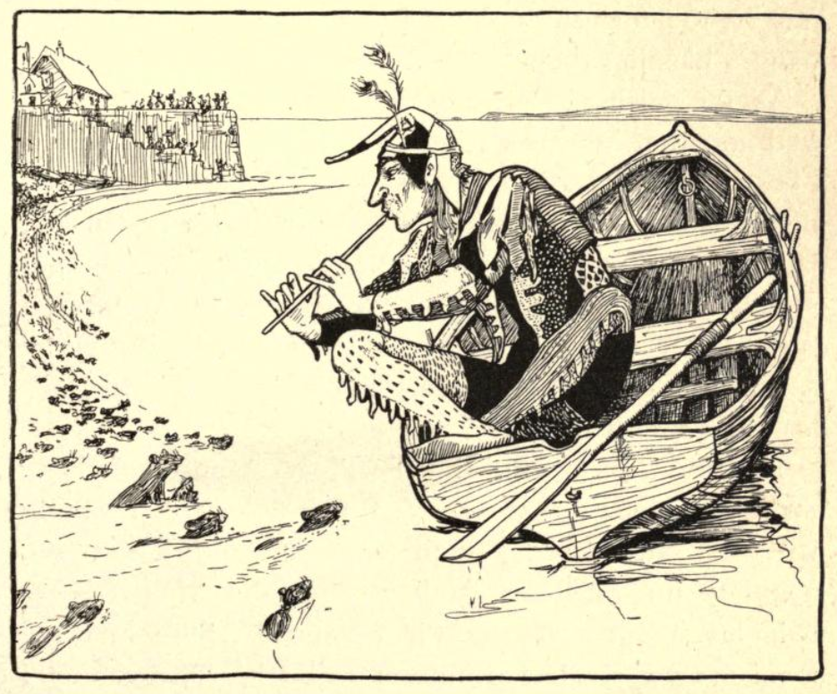

# Abraham Elder and The Pied Piper of Newtown

You will have heard, no doubt, of the strange tale of the Pied Piper of Hamelin? Yes? No? No matter either way, for here is an equally curious tale of another piper, another *pied* paper, or perhaps it was the same one, who visited the then prosperous harbour town of Newtown on the Isle of Wight back in the days of once.

Oh, what a prosperous place it was. The names the tell us so live on today — Silver Street and Gold Street – even if the town does not. But what of the *story*? What of the story that is claimed to be older in the telling that even the Hamelin tale? And what of its origins?

## The Mysterious Mr Elder

The story seems to come to us, rather unusually, from a single source, [*Tales and legends of the Isle of Wight*](https://archive.org/details/talesandlegends00eldegoog) (_"with the adventures of the author in search of them"_). This work, authored by the pseudonymous Abraham Elder, Esq., was first published in 1839, in London, by Simpkin, Marshall & Co., Stationers, Hall Court, perhaps under the direction of Mr French, bookseller, of Newport, on the Isle of Wight. It was later popularised in Joseph Jacobs' *More English Fairy Tales* first published in 1894.

The preface to Elders' work, on pp. v-viii, sets the scene for his discovery of the tale:

> PREFACE.
>
> It may appear singular that the present little volume, intended to illustrate the antiquities and traditions of the people of the Isle of Wight, should come from the pen of a stranger; and that the tales it contains should have been collected during the space of a short summer ramble. Fortune, however, has favoured me much, and I take this opportunity of returning my thanks to my friend, the well-known and justly celebrated antiquary, Mr. Winterblossom, for his most valuable contributions, without which this collection of Tales and Legends would have been but chaff.

From this, it seems that Mr Elder is not originally from the Island although he may have been a frequent visitor to it...

> Lest, however, the fact of my being a stranger should operate to my disadvantage, in prejudicing the public against this work ; be it remembered, that the best author upon the British constitution was De Lolme — a foreigner ; and this is not the exception, but the general rule. The peculiarities of every country strike more forcibly the eye of a foreigner. Foreigners are for the most part more impartial and more diligent searchers after all that is worthy of record, than those to whom the scenes and stories have been familiar from infancy. But, after all, I must confess that I am rather a collector, compiler, or editor; though vanity (as some would term it) has induced me to call myself the author of the present work. I am but the wisp of straw that ties the fagot together.
>
> But it is not altogether vanity in me either : for I have repeatedly, though in vain, urged Mr. Winterblossom to undertake the task. But he said that he had once spent many years and infinite labour in preparing a work of deep erudition for the press. The public was ungrateful, and the work still remains unsold. Printer's ink he would never meddle with again ; and then, added he with emphasis, taking me by the arm, _"the printer will be paid, whether the work sells or not"_.
>
> Should, however, the public act with greater indulgence in the present instance, it is my intention, if life and health be preserved to me, to offer a second volume to its notice in the due course of time.

For whatever reason, a second volume never appeared.

> One difficulty presents itself. Being a stranger to the island, — during the short time I may be able to bestow upon a visit next summer, I may perhaps overlook many things that ought to be recorded with care. I should therefore feel under obligation to any one who will call my attention to any antiquity, tale, or tradition connected with the island; — directing their communication to A. Elder, Esq., author of _"Tales and Legends of the Isle of Wight,"_ under cover to his publishers, Messrs. Simpkin, Marshall, and Co., or to Mr. French, bookseller, Newport.

Certainly, then, Mr French, the bookseller is likely to have been acquainted with the "real" Mr Elder.

The book itself narrates the a tour of the island by the author. On reaching the island, he fortuitously meets for the first time an old antiquarian, Mr Winterblossom, who provides various accounts of island lore as they proceed around the island. Additional tales are related to them by various local folk they meet along their way.

At pp.156-171, the travellers are in the north side of the island:

> In the morning we started, and when we had got a few miles along the road, Mr. Winterblossom said, "Down here on the right is a narrow inlet of the sea, at present nearly choked with mud, called Newtown Harbour. There, there was once a flourishing town, anciently called Franchville. It was burnt and destroyed by the French in one of their raids in the island. It was afterwards rebuilt, and took the name of Newtown. A solitary cottage is pow left there, though its streets still remain in the shape of green lanes : and it is singular that they yet retain the same names as when they were inhabited. The two principal ones are still called Gold street and Silver street. I forget the names of the others, or indeed whether they are at this moment remembered."

If you visit Newtown today, the streetnames and green lanes are still there, as are several boardwalks leading out across the mud flats to the site of the old harbour.

> I remarked, " Is it not very curious that these names should be still known after the houses have so long disappeared?'
>
>" It is," he said, " very unusual ; but perhaps it may be accounted for by the fact of a singular legend relating to it being still rife among the neighbouring inhabitants. If you will attend, I will relate it to you."

And thus are we introduced to the story of *The Pied Piper of Newtown*.

## The Original "Pied Piper of Newtown"

Here, then, is what is apparently the first published telling of the tale of *The Pied Piper of Newtown*.

```{admonition} *The Pied Piper of Newtown*, in Abraham Elder's *Tales and Legends of the Isle of Wight*, 1839
:class: dropdown

Newtown, anciently called Franchville, was once dreadfully infested with rats, so much so that the borough was scarcely habitable. They ate their way into all the granaries, and rooms, and cupboards. Scarcely any food could be secured from their attacks.

Even the wine, and mead, and beer, they drank ; which they contrived in this manner ; they gnawed a bole in the top of the cask, and drank as far as their noses could reach ; then one of them dipped in his tail, which the others sucked; and he had his suck at another's tail in return.

The cradles of their infants were obliged to be watched night and day, to prevent the rats eating their noses or nibbling their fingers. But with all their care a great many of the children were maimed before they had grown strong enough to defend themselves.

Numerous expedients had been tried to destroy or to reduce the number of these vermin. At one time a number of cats were introduced, and fine fun it was for the old cats. They had rare sport in hunting, and lived merrily upon rats* flesh. But it was otherwise with the kittens ; for whenever the rats found a kitten by himself, they assembled in a body and attacked him, and ate him up ; so that the breed of cats could not be long continued.

At another time they made an attempt to poison the rats, and indeed they destroyed a great number, but the stench that arose from their dead bodies in the streets, and in their holes, and in every part of their houses, brought an infectious fever upon the inha- bitants, so that a great number died.

Large rewards had been offered to any one who would clear the place of rats. Rat- catchers had arrived there from all parts of the country, expecting to make their for- tunes. But their attempts always ended in disappointment to themselves and their em- ployers. The rats continued to nibble, and gnaw, and multiply, in spite of the constant warfare carried on against them.

One day there came a wandering piper to the town, fantastically dressed. There was hardly any colour or shade that was not to be found in some corner of his party-coloured clothing ; this procured him the name of the Pied Piper. He called upon the mayor, and asked him what reward he should receive, if he destroyed every single rat in the borough of Franchville. The mayor sent the crier round to assemble the burgesses in the Town-hall, to consider what reward should be given. The debate lasted a considerable time, for the love of economy and the fear of the rats struggled hard against one another. The fear of the rats, however, appeared in the end to prevail, for they decided upon giving five hundred pounds (an enormous sum in those days) when the rats should be extinct.

The piper accepted the offer, and left the Town-hall, playing a shrill tune upon his pipe. To the utter astonishment of the by-standers, a great number of rats rushed out from th6 holes round the foundations of the Town-hall, and followed after his heels.

As he went along, all the rats came out of their holes and trotted after him. Every fifty yards he stopped, and turned round and played a particular flourish upon his pipe, just to give time for the young little toddling rats to overtake their stronger relations. Up Silver street he went, and down Gold street, and so on to the harbour. The people flocked after him at a x distance, showering blessings upon his head. But they could not get any where near him, on account of the ground being perfectly covered with rats.

When he had led his flock of rats down to the water, he got into a boat with high sides to it, so that no rat could get into it. He then entered the boat and shoved off into the middle. The rats crowded round, and appeared to listen with delight to his music, as they wagged their tails in the water. Thus he continued piping to them till the tide had fallen, and the boat was left aground on the mud. But the rats, still infatuated with the melody of his notes, kept paddling round him, until one by one they perished, smothered in the mud. Before the water rose again, not a rat was left alive.

When he landed, he went to the mayor to demand his promised reward. But the danger had now ceased, and the love of economy resumed its reign. They told him that they had thought it would have been a work of great labour and difficulty : indeed they had not anticipated that the reward would ever have been called for, or they never would have offered so large a sum; but as he had certainly done them a great benefit, they would not object to give him fifty pounds, which they considered to be very high wages for the trouble he had had.
The Pied Piper demanded his reward according to the agreement; and when he could not obtain it, he swore he would be revenged upon them ; but his menaces were only treated with contempt.

The Pied Piper said, " Very well," and turning round he marched off, and strutted down the street as before. But as the in- habitants knew that every rat had been de- stroyed, they felt under no apprehension of his piping them back again, so that they merely laughed at him as he walked down the street, piping a merry tune. The old people ridiculed him as he passed by, but all the children ran after him, hopping and dancing to the music, and quizzing his party- coloured clothing.

There was something irresistible in his tunes to the ears of youth. They left their games and their play, and tripped after the Pied Piper. They ran away from their parents and guardians, saying, that they must join in the dance after the Spotted Piper.
Down Silver-street he walked, and up Gold-street, the old people laughing at him, and the children dancing after him. Up the town he went, and into the forest. All the children of the town danced and shouted after him, as if they thought it the veriest fun in the world. The elder folks listened to the quavering of his shrill pipe, as he threaded his way through the old oak trees, till at length the sounds died away in the distance. They waited for the return of their children, but they never returned again. What became of them nobody ever knew : for neither the Pied Piper nor the children were ever heard of again. Thus the Pied Piper had his revenge.

In the course of time the remaining inhabitants of Franchville either died or became feeble from old age ; but the children who would have succeeded them had gone off, nobody knew where. Those who had been born since the time of the Pied Piper were still in their infancy. The borough, in short, consisted only of old men and children.

The French unfortunately chose this period to make an attack upon the Isle of Wight They landed at Franchville, met with no opposition, and burnt it to the ground. This was the end of Franchville.

Buildings, however, were again erected there, and fresh inhabitants came: and the place was called Newtown. The very change of name shows how complete the destruction of the old borough must have been.

```

Abraham Elder's response to the story, as narrator, is then provided:

> " Pray, Mr. Winterblossom," said I, when he had concluded his tale, " what do you consider this story to be ? for it can hardly be supposed really to have happened in the manner you relate it. Do you suppose it to be the invention of some story-teller — a mere
fable ? — or do you think it was founded upon some event that occurred at Newtown ?"

The antiquary then begins to describe his own theories onto the historical accuracy, or otherwise, of the story:

> " I do not think that anything of the sort ever happened at Franchville, nor do I consider it to be the invention of a story-teller."
>
> " That I do not understand," said I ; " it must either have happened, or it must have been invented."

Elder then nudges us into believing that it is the opinion of this "true" antiquary that the story has a long, traditional, history on the island.

> " Not so hasty — not so hasty," replied the antiquary, rubbing his spectacles ; " I con- sider it to be one of the ancient popular tales that were told and believed by the old inhabitants of Franchville. Now the popular tales, or, as we may call them, the mythology of a country, are properly neither the history of what took place there, nor mere inventions ; but they are the traditions of the ancestors of the inhabitants, before they settled in their present possessions.

According to the anqiuarian, the original roots of the story may, however, go back further still:

> " Those stories that have their parallel traditions preserved in very distant and different countries, are traditions handed down from the earliest periods of the world; and relate generally to Noah and the flood, or to the events that took place at Babel before the scattering abroad of nations. Of this description are the Druidical traditions of Delan, — Deucalion, Saturn, and Janus `[Janus was represented by the Romans as having two faces — the meaning of which is, that he looked back to the antediluvian world, and forward to the postdiluvian. His temple was shut in time of peace, and open in time of war ; which means that whilst men and animals remained in the ark they lived in peace with one another, but after the door was opened they fought and quarrelled as they did before they entered into it.]` of the Greeks and Romans, relating to Noah.

*In another storynote, [__On the Trail of the Sin-Eater__](https://psychemedia.github.io/sin-eater-resources/_decameron_other_missed_opportunities.html#joseph-downes-the-mountain-decameron-1836), I note a work from 1836, Joseph Downes' "The Mountain Decameron", that apparently collects local observations made whilst on a tour of rural byeways, that involved more substantial and fundamental creative input on the part of the author than simple artistic or poetic license, and from which one account, at least — that of the sin-eater —  came to be cited in later years as a __historical__ account.*

The dialogue then starts to enter rather more esoteric territory:

> Most of the heathen mythology, together with our tales of King Arthur and St. George and the Dragon, Brute, Uther Pendragon, and many others, relate to the times of Babel. And Nimrod appears to be the character whose deeds were celebrated in the greatest number of romances."
>
> " Do you mean to say," said I, " that Arthur was never king of England ?"
>
> " Certainly not," replied he ; " the history of King Arthur was just one of the traditions of Nimrod, the mighty hunter" `[See Nimrod, or a Discourse on Certain Passages of History and Fable. London, 1828. A work highly interesting to the real antiquarian.]`

And what does this have to do with the Pied Piper legend, you might wonder?

> " So then you really consider the Pied Piper to be a Babylonian, or perhaps an ante-diluvian rat-catcher?"
>
> " I consider no such thing," said the antiquary rather sharply, for I fancy that he thought I was quizzing him ; "I do not believe that there ever was any such person as the Pied Piper in existence at any time. The story was probably a mystery; the meaning of which was known to the learned, though it was perhaps taken literally by the vulgar. It might, for instance, have been a mystery of the confusion of tongues and the dispersion of the tower builders from Babel."

So if not a factual account, what might be the original nature, or purposes, or story behind the story be, at least according to Elder's antiquary?

> " Why, certainly," said I, " it might; but then, on the other hand, it might not. Pray what reason have you for supposing that it was not just a fiction invented by some storyteller for the amusement of his audience? We are generally apt to search for causes at too great a depth : for the most part they lie very near the surface."
>
> " That is a very good general rule, but it does not happen to be applicable in the present case. It is impossible that the story could have been invented by a Franchville or Isle of Wight story-teller, because a similar tale is told as having happened to the town of Hamel in Brunswick, where the rats were drowned in the river Weser, and the children were piped into a hole in a hill-side that closed after them. The story goes on to say —  that a boy being lame, came somewhat lagging behind the rest, and seeing this that happened, returned presently back and told what he had seen ; forthwith began great lamentation among the parents for their children, and men were sent out with all diligence, both by land and by water, to inquire if aught could be heard of them ; but, with all the inquiry they could possibly use, nothing more than as aforesaid could of them be understood. In memory whereof it was then ordained that from thenceforth no drumme, pipe, or other instrument, should be sounded in the street leading to the gate through which they passed ; nor no ostery to be there holden. And it was also established that from that time forward in all publike writings that should be made in that towne, after the
date therein set downe of the yeere of our Lord, the date of the yeere of the going forth of their children should be added, the which they have accordingly ever since continued. `[See " Restitution of Decayed Intelligence," by Richard Verstegan. London, 1534, p. 85.]`  From this similitude of stories there is a very strong probability that the history of the Pied Piper relates to some event which occurred before the Saxons migrated from Germany."

*If you are keen to learn how Verstegan related the story, I have included it in the following chapter.*

> " All this may be very true, Mr. Winterblossom, but is it not going rather far back for the origin of the story of the rat-catcher to suppose it came from the tower of Babel ? might it not be a very old story, and yet not quite so old as that?"
>
> " Your reasoning, Mr. Elder, is very natural for a person who has only paid a superficial attention to this subject."
>
> " Ahem !" said I.
>
> The antiquary continued. " The reason why popular tales and traditions are either comparatively modern, or go back, as it were, to the very origin of nations, is this : after the flood, mankind were directed by divine command to spread themselves over the face of the earth to repeople it Probably no inconsiderable part of the crime of the tower-builders of Babel was their opposition to this command, their wishing to make themselves a name ; that is, to be a powerful, civilised, and luxurious nation, instead of scattering themselves over the boundless wastes."
>
> " Civilised !" said I ; " do you suppose that the state of society then approached at all to our modern ideas of civilisation ?"
>
> " Very nearly indeed," replied he. " All the knowledge of the East at the present time is but the remains of a more perfect state of civilisation of a very remote antiquity. The Indians now calculate eclipses from tables that have been handed down to them from very ancient times. There are also still in existence some very beautiful and copious remains of ancient literature in a language which Sir William Jones affirms to be more perfect than the Greek, and more copious than the Latin — the Sanscrit — the oldest language known. From this high state of civilisation mankind degenerated after the dispersion. Then commenced the era of modern civilisation."

## A Retelling According to Jacobs

At the very beginning of his second collection of English fairy tales, [More English Fairy Tales](https://archive.org/details/moreenglishfairy00jacoiala/page/n21/mode/2up?q=piper), 1894, p1-6, published in London by David Nutt, 270 Strand, and illustrated by John D. Batten, Joseph Jacobs included a version of Abraham Elder's *The Pied Piper of Newtown*.

In the *Preface*, pvii-x, Jacobs describes what policy he used when deciding what tales to include in this second collection:

> In putting these tales together, I have acted on the same principles as in the preceding volume, which has already, I am happy to say, established itself as a kind of English Grimm. I have taken English tales wherever I could find them ... 

He also admits to exerting editorial control over the words themselves:

> I have re-written most of them, and in doing so have adopted the traditional English style of folk-telling, with its "Wells" and " Lawkamercy " and archaic touches, which are known nowadays as vulgarisms. From former experience, I find that each of these princi- ples has met with some dissent from critics who have written from the high and lofty standpoint of folk-lore, or from the lowlier vantage of " mere literature." I take this occasion to soften their ire, or perhaps give them further cause for reviling.

Jacobs appreciates that this is likely to upset various other folklorists and collectors:

> My folk-lore friends look on with sadness while they view me laying profane hands on the sacred text of my originals. I have actually at times introduced or deleted whole incidents, have given another turn to a tale, or finished off one that was incomplete, while I have had no scruple in prosing a ballad or softening down over- abundant dialect. This is rank sacrilege in the eyes of the rigid orthodox in matters folk-lorical.

But Jacobs perhaps sees himself as a *storyteller*, helping keep a tradition alive:

> My defence might be that I had a cause at heart as sacred as our science of folk-lore the filling of our children's imaginations with bright trains of images.... Why may I not have the same privilege as any other story-teller, especially when I know the ways of story-telling as she is told in English, at least as well as a Devonshire or Lancashire peasant ? And conclusive argument wilt thou, oh orthodox brother folk-lorist, still continue to use Grimm and Asbjornsen ? Well, they did the same as I.
> ...

Regarding "legitimate" origins for the tales he has included, Jacobs is perhaps also a contrarian:

> The truth is, my folk-lore friends and my Saturday Reviewer differ with me on the important problem of the origin of folk-tales. They think that a tale probably originated where it is found. They therefore attribute more importance than I to the exact form in which it is found and restrict it to the locality of birth. I consider the probability to lie in an origin elsewhere : I think it more likely than not that any tale found in a place was rather brought there than born there. I have discussed this matter elsewhere `[See " The Science of Folk Tales and the Problem of Diffusion " in *Transactions of the International Folk-Lore Congress*, 1891. Mr. Lang has honoured me with a rejoinder, which I regard as a palinode, in his Preface to Miss Roalfe Cox's volume of variants of *Cinderella*, (Folk-Lore Society, 1892).]` with all the solemnity its importance deserves, and cannot attempt further to defend my position here.

This perhaps explains why Jacobs does not find it inappropriate to include Elder's version of the Pied Piper tale despite the moot nature of its folk origins:

> But even the reader innocent of folk-lore can see that, holding these views, I do not attribute much anthropological value to tales whose origin is probably foreign, and am certainly not likely to make a hard-and- fast division between tales of the North Countrie and those told across the Border.

Again, Jacobs sees his role as of a stroyteller keeping a story available to the folk mind:

> As to how English folk-tales should be told authorities also differ. ... These tales have been told, if not from time immemorial, at least for several generations, in a special form which includes dialect and " vulgar " words. Why desert that form for one which the children cannot so. easily follow with "thous" and " werts " and all the arti- ficialities of pseudo-Elizabethan ? Children are not likely to say "darter" for " daughter," or to ejaculate " Lawkamercyme " because they come across these forms in their folk-tales. They recognise the unusual forms while enjoying the fun of them. I have accordingly retained the archaisms and the old-world formulae which go so well with the folk-tale.

As to the wider source of the tales he saw fit to include:

> In compiling the present collection I have drawn on the store of 140 tales with which I originally started ; some of the best of these I reserved for this when making up the former one. ... Other friends have been equally kind, especially Mr. Alfred Nutt, who has helped by adapting some of the book versions, and by reading the proofs, ...

So here, then, is "The Pied Piper", as (re)told by Joseph Jacobs.


```{admonition} "The Pied Piper" in  Joseph Jacobs' *More English Fairy Tales*, 1894
:class: dropdown

NEWTOWN, or Franchville, as 'twas called of old, is a sleepy little town, as you all may know, upon the Solent shore. Sleepy as it is now, it was once noisy enough, and what made the noise was rats. The place was so infested with them as to be scarce worth living in. There wasn't a barn or a corn-rick, a store-room or a cupboard, but they ate their way into it. Not a cheese but they gnawed it hollow, not a sugar puncheon but they cleared out. Why the very mead and beer in the barrels was not safe from them. They'd gnaw a hole in the top of the tun, and down would go one master rat's tail, and when he brought it up round would crowd all the friends and cousins, and each would have a suck at the tail.

Had they stopped here it might have been borne. But the squeaking and shrieking, the hurrying and scurrying, so that you could neither hear yourself speak nor get a wink of good honest sleep the livelong night ! Not to mention that, Mamma must needs sit up, and keep watch and ward over baby's cradle, or there'd have been a big ugly rat running across the poor little fellow's face, and doing who knows what mischief.

Why didn't the good people of the town have cats ? Well they did, and there was a fair stand-up fight, but in the end the rats were too many, and the pussies were regularly driven from the field. Poison, I hear you say ? Why, they poisoned so many that it fairly bred a plague. Ratcatchers ! Why there wasn't a ratcatcher from John o' Groats' House to the Land's End that hadn't tried his luck. But do what they might, cats or poison, terrier or traps, there seemed to be more rats than ever, and every day a fresh rat was cocking his tail or pricking his whiskers.

The Mayor and the town council were at their wits' end. As they were sitting one day in the town hall racking their poor brains, and bewailing their hard fate, who should run in but the town beadle. " Please your Honour," says he, "here is a very queer fellow come to town. I don't rightly know what to make of him." "Show him in," said the Mayor, and in he stept. A queer fellow, truly. For there wasn't a colour of the rainbow but you might find it in some corner of his dress, and he was tall and thin, and had keen piercing eyes.

"I'm called the Pied Piper," he began. "And pray what might you be willing to pay me, if I rid you of every single rat in Franchville ? "

Well, much as they feared the rats, they feared parting with their money more, and fain would they have higgled and haggled. But the Piper was not a man to stand nonsense, and the upshot was that fifty pounds were promised him (and it meant a lot of money in those old days) as soon as not a rat was left to squeak or scurry in Franchville.



Out of the hall stept the Piper, and as he stept he laid his pipe to his lips and a shrill keen tune sounded though street and house. And as each note pierced the air you might have seen a strange sight. For out of every hole the rats came tumbling. There were none too old and none too young, none too big and none too little to crowd at the Piper's heels and with eager feet and upturned noses to patter after him as he paced the streets.

Nor was the Piper unmindful of the little toddling ones, for every fifty yards he'd stop and give an extra flourish on his pipe just to give them time to keep up with the older and stronger of the band.

Up Silver Street he went, and down Gold Street, and at the end of Gold Street is the harbour and the broad Solent beyond. And as he paced along, slowly and gravely, the townsfolk flocked to door and window, and many a blessing they called down upon his head.

As for getting near him there were too many rats. And now that he was at the water's edge he stepped into a boat, and not a rat, as he shoved off into deep water, piping shrilly all the while, but followed him, plashing, paddling, and wagging their tails with delight. On and on he played and played until the tide went down, and each master rat sank deeper and deeper in the slimy ooze of the harbour, until every mother's son of them was dead and smothered.

The tide rose again, and the Piper stepped on shore, but never a rat followed. You may fancy the townfolk had been throwing up their caps and hurrahing and stopping up rat-holes and setting the church bells a-ringing. But when the Piper stepped ashore and not so much as a single squeak was to be heard, the Mayor and the Council, and the town-folk generally, began to hum and to ha and to shake their heads.

For the town money chest had been sadly emptied of late, and where was the fifty pounds to come from ? Such an easy job, too ! Just getting into a boat and playing a pipe ! Why the Mayor himself could have done that if only he had thought of it.

So he hummed and ha'ad and at last, " Come, my good man," said he, "you see what poor folk we are; how can we manage to pay you fifty pounds ? Will you not take twenty ? When all is said and done 'twill be good pay for the trouble you've taken."

" Fifty pounds was what I bargained for," said the Piper shortly ; " and if I were you I'd pay it quickly. For I can pipe many kinds of tunes, as folk sometimes find to their cost."

" Would you threaten us, you strolling vagabond ? " shrieked the Mayor, and at the same time he winked to the Council ; " the rats are all dead and drowned," muttered he ; and so " You may do your worst, my good man," and with that he turned short upon his heel.

" Very well," said the Piper, and he smiled a quiet smile. With that he laid his pipe to his lips afresh, but now there came forth no shrill notes, as it were, of scraping and gnawing, and squeaking and scurrying, but the tune was joyous and resonant, full of happy laughter and merry play. And as he paced down the streets the elders mocked, but from school-room and play- room, from nursery and workshop, not a child but ran out with eager glee and shout following gaily at the Piper's call. Dancing, laughing, joining hands and tripping feet, the bright throng moved along up Gold Street and down Silver Street, and beyond Silver Street lay the cool green forest full of old oaks and wide-spreading beeches. In and out among the oak-trees you might catch glimpses of the Piper's many-coloured coat. You might hear the laughter of the children break and fade and die away as deeper and deeper into the lone green wood the stranger went and the children followed.

All the while, the elders watched and waited. They mocked no longer now. And watch and wait as they might, never did they set their eyes again upon the Piper in his parti-coloured coat. Never were their hearts gladdened by the song and dance of the children issuing forth from amongst the ancient oaks of the forest.

```

As well the stories themselves, Jacobs' work also included various notes on each of the tales. At p218-220, we get the following notes and references on his vrsion of *The Pied Piper* tale, starting with the provenance:

> XLIV. THE PIED PIPER.
>
> Source. Abraham Elder, Tales and Legends of the Isle of Wight, (London, 1839), pp. 157-164. Mr. Nutt, who has abridged and partly rewritten the story from a copy of Elder's book in his possession, has introduced a couple of touches from Browning.

In the notes, Jacobs make various comparisons with other versions of the tale:

> Parallels. The well-known story of the Pied Piper of Hameln (Hamelin), immortalised by Browning, will at once recur to every reader's mind. Before Browning, it had been told in English in books as well known as Verstegan's *Restitution of Decayed Intelligence*, 1605; Howell's *Familiar Letters* (see my edition, p. 357,) ; and Wanley's *Wonders of the Little World*.

*All these versions will be included later in this story note.*

> Browning is said to have taken it from the last source (Furnivall, *Browning Bibliography*, 158), though there are touches which seem to me to come from Howell (see my note *ad loc.*), while it is not impossible he may have come across Elder's book, which was illustrated by Cruikshank. The Grimms give the legend in their *Deutsche Sagen* (ed. 1816, 330-33), and in its native land it has given rise to an elaborate poem *à la* Scheffel by Julius Wolff, which has in its turn been the occasion of an opera by Victor Nessler.

As well as the best known location for the tale, Hamelin, Jacobs also notes a variant set near Belfast:

> Mrs. Gutch, in an interesting study of the myth in *Folk-Lore*, iii. pp. 227-52, quotes a poem, *The Sea Piece*, published by Dr. Kirkpatrick in 1750, as showing that a similar legend was told of the Cave Hill, near Belfast.
>
> Here, as Tradition's hoary legend tells,  
> A blinking Piper once with magic Spells  
> And strains beyond a vulgar Bagpipe's sound,  
> Gathered the dancing Country wide around.  
> When hither as he drew the tripping Rear  
> (Dreadful to think and difficult to swear !)  
> The gaping Mountain yawned from side to side,  
> A hideous Cavern, darksome, deep, and wide ;  
> In skipt th' exulting Demon, piping loud,  
> With passive joy succeeded by the Crowd.
>
> * * * *
>
> There firm and instant closed the greedy Womb,  
> Where wide-born Thousands met a common Tomb.

Gutch's comments are remarked upon again, (I will include the whole paper laer in this note, but it really is an overlong and not wholly illuminating paper).

> Remarks. Mr. Baring-Gould, in his *Curious Myths of the Middle Ages*, has explained the Pied Piper as a wind myth ; Mrs. Gutch is inclined to think there may be a substratum of fact at the root of the legend, basing her conclusions on a pamphlet of Dr. Meinardus, *Der historische Kern*, which I have not seen. She does not, however, give any well-authenticated historical event at Hameln in the thirteenth century which could have plausibly given rise to the legend, nor can I find any in the *Urkundenbuch* of Hameln (Luneberg, 1883).

So according to Jacobs, did Elder's variant derive from the Hamelin "original"?

> The chief question of interest attaching to the English form of the legend as given in 1839 by Elder, is whether it is independent of the German myth. It does not occur in any of the local histories of the Isle of Wight which I have been able to consult of a date previous to Elder's book e.g., J. Hassel, *Tour of the Isle of Wight*, 1790. Mr. Shore, in his *History of Hampshire*, 1891, p. 185, refers to the legend, but evidently bases his reference on Elder, and so with all the modern references I have seen. Now Elder himself quotes Verstegan in his comments on the legend, pp. 168-9 and note, and it is impossible to avoid conjecturing that he adapted Verstegan to the locality. Newtown, when Hassel visited it in 1790, had only six or seven houses (i.e. i. 137-8), though it had the privilege of returning two members to Parliament ; it had been a populous town by the name of Franchville before the French invasion of the island of *temp.* Ric. II. It is just possible that there may have been a local legend to account for the depopulation by an exodus of the children. But the expression " pied piper" which Elder used clearly came from Verstegan, and until evidence is shown to the contrary the whole of the legend was adapted from him. It is not without significance that Elder was writing in the days of the Ingoldsby Legends, and had possibly no more foundation for the localisation of his stories than Barham.

Jacobs, then, sees Verstegan as Elder's likely source. But what of the Irish variant?

> There still remains the curious parallel from Belfast to which Mrs. Gutch has drawn attention. Magic pipers are not unknown to English folk-lore, as in the Percy ballad of *The Frere and the Boy*, or in the nursery rhyme of Tom Piperson in its more extended form. But beguiling into a mountain is not known elsewhere except at Hameln, which was made widely known in England by Verstegan's and Howell's accounts, so that the Belfast variant is also probably to be traced to the *Rattenfänger*. Here again, as in the case of Beddgellert (*Celtic Fairy Tales*, Nos. lxi, lxxxi.), the Blinded Giant and the Pedlar of Swaffham (*infra*, Nos. Ixi., Ixiii.), we have an imported legend adapted to local conditions.
