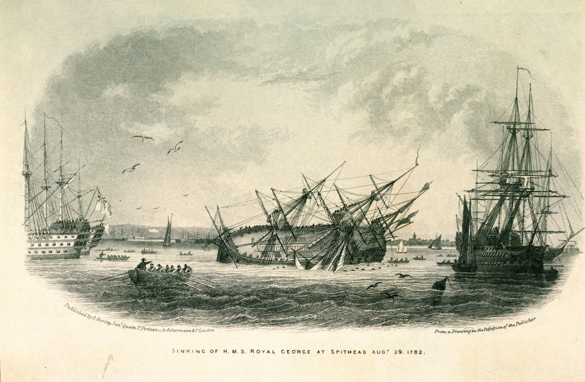

# The Sinking of the Royal George


TO DO

```{admonition} Royal George ordered to Deal from Torbay, August 1782
:class: dropdown 
In *Oxford Journal*, [Saturday 17 August 1782](https://britishnewspaperarchive.co.uk/viewer/bl/0000073/17820817/009/0002),

An Order is sent to Torbay, for the Royal George, and five other Ships of the Line, to come into the Downs `[off Deal, on the eastern coast of Kent]`immediately, where they are to he joined by some other Men of War and go directly to the North Seas. And, 

We hear that Orders are gone from the Admiralty, for Admiral Kempenfelt, with eight Line of Battle Ships, to proceed immediately for the North Seas, to convoy the homeward-bound Trade from the Baltick. This Fleet is very valuable, and will consist of upwards of three hundred Sail. The Transports and Victuallers for Gibraltar, are ordered to rendezvous in Torbay, where they will wait the Return of this Squadron, before they will sail for the Relief of Gibraltar, which, in all Probability, will be about the Beginning of next Month.
```

```{admonition} Royal Geoge arrives in Portsmouth, August 1782
:class: dropdown
In *Caledonian Mercury*, [Monday 19 August 1782](https://britishnewspaperarchive.co.uk/viewer/bl/0000045/17820819/005/0002).

Advices are received from Portsmouth, that yesterday morning Lord Howe arrived there with the following ships from Torbay, viz-. Victory, Britannia, Royal George, Atlas, Queen, Foudroyant, Alexander, Bellona, Courageux, Dublin, Edgar, Goliah, Suffolk, Vengeance, Sampson, Panther, Minerva, Tisiphone fire ship.

Yesterday, orders were given to all the officers of the ships belonging to the grand fleet to repair immeediately on board their respective vessels. 

```

```{admonition} Preparing the fleet, August 1782
:class: dropdown
In *Hampshire Chronicle*, [Monday 19 August 1782](https://britishnewspaperarchive.co.uk/viewer/bl/0000230/17820819/001/0001).

...

A great many victuallers and storeships are now getting ready in the river `[i.e the Thames]` for Jamaica and the Leeward Islands; the convoy is appointed to sail about the 1st September, and four hundred soldiers are now under orders to proceed to Portsmouth, to be embarked on board the merchantmen which sail with this fleet.
 
Saturday Lord Howe arrived at his house in Grafton-street, from Portsmouth; he is only come up for a few days, as he is expected to sail again in the course of a week.

All the East-India ships, and many of the West India, are prepared to sail, will leave Portsmouth, with the grand fleet, when sails for Gibraltar; for this purpose the pursers are already sent on board, and every preparation is making at Spithead for their departure on the shortest notice.

```


TO DO in same edition of Hampshire Chronicle as the report of Tyrie's execution

```{admonition} The Sinking of the Royal George, September, 1782
:class: dropdown seealso
In *Hampshire Chronicle*, [Monday 02 September 1782](https://britishnewspaperarchive.co.uk/viewer/bl/0000230/17820902/004/0003).

HOME NEWS.

PORTSMOUTH. Aug. 31.

On Thursday morning, between nine and ten o'clock, the Royal George man of war of 100 guns, on board of which Admiral Kempenfelt had hoisted his flag, nearly in the center of Lord Howe's fleet at Spithead, most unfortunately and instantaneously went to the bottom. The melancholy accident was occasioned by the being heeled upon her side, in order to have the water-pipe of her cistern repaired, at which instant of time a strong squall of wind at N. N. W. threw her further upon her side, and the lower port holes being unluckily open, she filled and went down in less than three minutes. The alarm and confusion at an event so unexpected and so horrid, is indescribable. A victualling sloop, and several wherries full of people, which had just put off in order to go ashore, were drawn down by the prodigious whirlpool and suction occasioned by the sinking of the ship. Of about fourteen hundred men, women, and boys which were on board, not more than 320 were saved; and it must give unspeakable concern to every lover of his country, as well as to the humane heart, that the brave and able veteran Admiral Kempenfelt is amongst the drowned.— Major Graham, and several other officers of marines, the surgeon, the master, three lieutenants, several midshipmen, and some ladies who had gone on board to see the ship, were also lost. Captain Waghorn, Admiral Kempenfelt's Captain, was fortunately gone on duty for few hours on board another ship. The ship's complement was 900 men, and she was completely manned with the best seamen, victualled and ready for sea at an hour's notice. There were also a number of carpenters from the yard, at work in her; and several of the officers, with the whole of the marines, had only come on board from Portsmouth the preceding evening. The unspeakable distress of this fatal catastrophe has occasioned is inconceivable. The shore for a length of time exhibited scenes of the most poignant grief, being lined with persons lamenting their fathers, or their children, who had perished in this calamity. And every one will read with added concern that the brave Admiral Kempenfelt, who had hold of the same rope with a marine, was so exhausted and fatigued, that he let go but a few minutes before a boat reached the unhappy spot where he sunk, and picked up the marine alive.

Though the depth in which she now lies, about fourteen fathom, is not considerable, it seems to be the general opinion here, that she cannot be raised, as no purchase can be obtained equal to the immense weight. But if this ship, so long the pride of our navy, and so essential a part of the strength of this country, at this most critical period, could be recovered, the loss of so many brave and able seamen is irremediable, and never sufficiently to be lamented.

An accident of this kind to a capital ship, is unpredented *[sic]* in the annals of the Navy.

The Royal George man of war is the oldest first rate in the service; she was built at Woolwich, her keel was laid down in 1751, and she was hauled out of the dock in July 1755, it being unusual to build such large ships on slips to launch; she was pierced for 100 guns, but having lately had two additional ports, including the carronades, mounted 108 guns; she was rather short and high, as all the old first rates are, but so good a sailer, that she has had more flags on board her than any vessel in the service. Lord Anson, Admiral Boscawen, Lord Hawke, Lord Rodney, Lord Howe, and several other principal officers, have repeatedly commanded in her. Lord Hawke commanded the squadron in her which fought the French under Conflans, when the Suberb of 70 guns, was sunk by her cannon and the Soliel Royal of 84, burnt on shore: she carried the tallest masts and canvas of any English built ship in the navy, and originally the heaviest metal, viz. 52, 40, and 28 pounders, but they were lately changed, account of her age, to 40, 32, and 18 pounders.

```




```{admonition} Correspondence from Portsmouth, September 1782
:class: dropdown

In *Stamford Mercury*, [Thursday 12 September 1782](https://www.britishnewspaperarchive.co.uk/viewer/bl/0000254/17820912/007/0002).

*Extract of a Letter from Portsmouth, Sept. 6.*

An order came down this morning for the ships to take all their stores on board directly, which is now performing in the greatest haste imaginable.

"Lord Howe has not left his command once since his arrival.

"The First Lord of the Admiralty is expected to see the fleet sail, and it is even said will go as far as Plymouth in the Victory, where he will take a view the Dock-yard, during the absence of the grand fleet.

"We have now 1160 men, including labourers, employed this yard, and talk of employing 200 more before the spring; Indeed so much work calls for additional hands.

"The person who is to go down into the Royal George, tried the experiment in the harbour this morning, in the machine contrived for the purpose; and I have just been informed that great hopes of success are expected from it, as he was able to continue under water near an hour.

"A clear benefit of 90*l.* was last night given at the Sadlers Wells Theatre, near this town, to the widows and orphans of the persons lost in the Royal George. Another will be given at the Theatre in the town this evening by the Comedians."

A Correspondent has made the following observations respecting the Royal George.

The absolute weight of a body sinking a fluid is equal to such part of the fluid as shall be thrust away or displaced thereby.

It is now presumed, that the Royal George had all her ordnance, rigging, &c. on board and therefore by calculation she displaced, or removed, a body of sea water containing 21,965,978 pounds of water, which makes 9805 tons and upwards, which is equal to her weight. Now, supposing her to be sixteen fathom perpendicular under water, and admitting the truth of 64 pounds to be a solid foot of sea water, she sustains the weight of 20,9941/2 tons.

The ship's weight, upon a present computation, 9805 tons.

The perpendicular weight of water over her, 20994 1/2 tons.

Total, without considering the water in her body. 30799 1/2 tons.

He concludes with asserting that he can form a machine upon a simple construction, whereby she may be unloaded of her ordnance and stores.

As Tyrie was conducting to execution, he said the gaoler, "At this place I was to have been rescued, could I have raised money enough, for the Smugglers had offered do it, but demanded a sum greater than was in my power to give." He afterwards said, there was one man living yet, who furnished intelligence to the French, and while he lived, the navy of Great Britain would never be successful. After he was executed and buried in the sand, the sailors dug him up, pulled him to pieces, lapped his fingers and toes in rags to make tobacco-stoppers of, and carried his entrails in triumph on a stick.
```

```{admonition} A life well worth preserving, September 1782
:class: dropdown

In *Caledonian Mercury*, [Wednesday 18 September 1782](https://www.britishnewspaperarchive.co.uk/viewer/bl/0000045/17820918/003/0001).

Notwithstanding the late David Tyrie's seeming contempt of death, both at his trial and execution, the following letter, together with his subsequent design of escaping from Winchester goal, evidently prove that he thought life well worth preserving. This letter, in Tyrie's hand-writing, was found on the person to whom it was addressed, who was apprehended for altering bank-notes:

*`As quoted previously.`*
```


TO DO

```{admonition} Infant saved by two sheep, September 1782
:class: dropdown
In *Manchester Mercury*, [Tuesday 24 September 1782](https://britishnewspaperarchive.co.uk/viewer/bl/0000239/17820924/002/0001)

The following Account is given upon the Credit of a Gentleman of Veracity: When the Royal George overset, the live Stock upon Deck were naturally left floating on the Water; among were two Sheep, who swam to Ryde in the Isle of Wight, and brought on Shore with them a little Boy in Petticoats, between two and three Years old, having an Arm over each their Necks. The Chiid is likely to do well; and having lost both its Parents in the unhappy Catastrophe, a Naval Officer wno was present, intimated an Intention of adopting it.
```

```{admonition} The Sinking of the Royal George recalled, 1839
:class: dropdown

In *Surrey Mercury*, [Monday 07 September 1846](https://britishnewspaperarchive.co.uk/viewer/bl/0004135/18460907/015/0001).

THE ROYAL GEORGE.

The loss of this vessel, which sunk at Spithead in 1762, has been so often related, that some apology is requisite in recurring to the story. But we are induced to do so, from finding the following brief though graphic description of the accident in a book just published, "the Naval Life and services of Sir P.Durhant," who was one of the parties saved.

"The Royal George was under orders to sail for the relief of Gibraltar. During her last cruize she had made rather more water than usual, and, after a short survey, the carpenters discovered a leak, and they stopped it. It was likewise observed that the pipe which admitted the water into the hold for cleansing the ship was out of repair. This pipe is usually placed atout three feet below the surface of the water. To remove the old pipe, therefore, and to insert a new one, it became necessary to heel the Royal George on one side, so as to raise the mouth of the pipe out of the water. This operation brought the larboard porthole sills even with the water. A lighter came on the lower side of the ship, and put her cargo of rum on board, the weight of which, with that of the men engaged in hoisting the casks, cased the Royal George to heel considerably more, and brought the lower deck port-holes under water, which now dashed in such quantities to the hold that she began gradually to settle down. The carpenter twice warned the first lieutenant (Sandon) of the danger the ship was in, but he would not listen to him, and delayed giving the order to right the ship till it was too late; and a slight breeze springing up, heeled her completely on her broadside, when guns shot, and every thing moveable fell to leeward, and rendered it an impossibility to right her. She sank almost immediately. The watch on deck, consisting of 230 men, were saved by running up the rigging and were taken off by the boats which came to their assistance, and which likewise succeeded in picking up about seventy, who had escaped by swimming. Amongst the latter were the Captain Waghorn, and, two acting lieutenants, Durham and Richardson. By this calamity about 200 persons met with a watery grave, among whom was the brave old Admiral Kempenfelt, who at the time was sitting writing in his cabin. He was in the 70th year of his age. When the Royal George settled down finally the masts stood tupright, the cap of her bowsprit appeared above water, and the admiral's flag remained flying at the mizen topmast head," &c.

It is a curious fact that during Colonel Pasley's operations of 1841 a relic of the wreck was discovered which Sir P. Durham identified as having been his property. It is a stamp he employed for marking his books, linen, &c. The types were in perfect preservation, though they had been in the great deep for nearly 60 years. 

```


https://archive.org/details/sim_knights-penny-magazine_1834-05-03_3_134/page/174/mode/2up
The Penny Magazine  1834-05-03: Vol 3 Iss 134

pp.174-6

THE LOSS OF THE ROYAL GEORGE.

We are enabled, through the kindness of a correspondent, to present our readers with an extremely curious and interesting paper,—a Narrative of the Loss of the Royal George, by Mr. James Ingram, who was on board her at the time of this fearful calamity, Our correspondent says, "Mr. Ingram is a very respectable and intelligent man, who lives and has lived for many years at Woodford, a village exactly midway between Gloucester and Bristol, This statement is given exactly in his own words, except that I occasionally asked a question where explanation appeared to be necessary."

The Royal George was a ship of one hundred guns. Originally her guns had been all brass, but when she was docked at Plymouth, either in the spring of 1782 or the year before, the brass:forty-two pounders on her lower gun-deck were taken out of her as being too heavy, and iron thirty-two pounders put there in their stead: so that after that she carried brass twenty-four pounders on her main-deck, quarter-deck, and poop, brass thirty-two pounders on her middle-deck, and iron thirty-two pounders on her lower-deck. She did not carry any carronades. She measured sixty-six feet from the kelson to the taffrail; and, being a flag-ship, her lanterns were so big, that the men used to go into them to clean them.

In August, 1782, the Royal George had come to Spithead. She was in a very complete state, with hardly any leakage, so that there was no occasion for the pumps to be touched oftener than once in every three or four days. By the 19th of August she had got six months' provision on board, and also many tons of shot. The ship had her gallants up, the blue flag of Admiral Kempenfelt was flying at the mizen, and the ensign was hoisted on the ensign-staff,—and she was in about two days to have sailed to join the grand fleet in the Mediterranean. It was ascertained that the water-cock must be taken out and a new one put in. The water-cock is something like the tap of a barrel,— itis in the hold of the,ship on the starboard side, and at that part of the ship called the well. By turning a thing which is inside the ship, the sea-water is let into a cistern in the hold, and it is from that pumped up to wash the decks. In some ships the water is drawn up the side in buckets, and there is no water-cock. To get out the old water-cock it was necessary to make the ship heel so much on her larboard side as to raise the oulside of this water-cock above water. This was done at about 8 o'clock on the morning of the 19th of August. To do it the whole of the guns on the larboard side were run out as far as they would go, quite to the breasts of the guns, and the starboard guns drawn in a midship and secured by tackles, two to every gun, one on each side the gun. This brought the water nearly ona level with the port-holes of the larboard side of the lower gun-deck. The men were working at this water-cock on the outside of the ship for near an hour, the ship remaining all on one side as I have stated.

At about 9 o'clock a.m., or rather before, we had just finished our breakfast, and the last lighter, with rum on board, had come alongside: this vessel was a sloop of about fifty tons, and belonged to three brothers, who used her to carry things on board the men-of-war. She was lashed to the larboard side of the Royal George, and we were piped to clear the lighter and get the rum out of her, and stow it in the hold of the Royal George. I was in the waist of our ship, on the larboard side, bearing the rum-casks over, as some men of the Royal George were aboard the sloop to sling them.

At first no danger was apprehended from the ship being on one side, although the water kept dashing in at the port-holes at every wave; and there being mice in the lower part of the ship, which were disturbed by the water which dashed in, they were hunted in the Water by the men, and there had been a rare game going on. However, by about 9 o'clock the additional quantity of rum on board the ship, and also the quantity of sea-water which had dashed in through the portholes, brought the larboard port-holes of the lower gundeck nearly level with the sea.

As soon as that was the case, the carpenter went on the quarter-deck to the lieutenant of the watch, to ask him to give orders to right ship, as the ship could not bear it. However, the lieutenant made him a very short answer, and the carpenter then went below. The captain's name was Waghorn. He was on board, but where he was I do not know ;—however, captains, if anything is to be done when the ship is in harbour, seldom interfere, but leave it all to the officer of the watch. The lieutenant was, if I remember right, the third lieutenant; he had not joined us long; his name I do not recollect; he was a good-sized man, between thirty and forty years of age. The men called him * Jib-and-Foresail Jack," for, if he had the watch in the night, he would be always bothering the men to alter the sails, and it was "up jib" and "down jib," and "up foresail" and "down foresail," every minute. However, the men considered him more of a troublesome officer than a good one; and, from a habit he had of moving his fingers about when walking the quarter-deck, the men said he was an organ-player from London, but I have no reason to know that that was the case. The admiral was either in his cabin or in his steerage, Ido not know which; and the barber, who had been to shave him, had just left. The admiral was a man upwards of seventy years of age; he was a thin tall man, who stooped a good deal.

As I have already stated, the carpenter left the In a very short time he came up again, and asked the lieutenant of the watch to right ship, and said again that the ship could not bear it; but the lieutenant replied, "D—e, sir, if you can manage the ship better than I can, you had better take the command." Myself and a good many more were at the waist of the ship and at the gangways, and heard what passed, as we knew the danger, and began to feel aggrieved, for there were some capital seamen aboard, who knew what they were about quite as well or better than the officers.

In a very short time, in a minute or two I should think, the lieutenant ordered the drummer to be called to beat to right ship. The drummer was called in a moment, and the ship was then just beginning to sink. I jumped off the gangway as soon as the drummer was called. ‘There was no time for him to beat his drum, and I don't know that he even had time to get it. I ran down to my station, and, by the time I had got there, the men were tumbling down the hatchways one over another to get to their stations as quick as possible to right ship. My station was at the third gun from the head of the ship on the starboard side of the lower gundeck, close by where the cable passes, indeed it was just abaft the bight of the cable. I said to the lieutenant of our gun, whose name was Carrell, for every gun has a captain and lieutenant (though they are only sailors), "* Let us try to bouse our gun out without waiting for the drum, as it will help to right ship." We pushed the gun, but it ran back upon us, and we could not start him. The water then rushed in at nearly al! the port-holes of the larboard side of the lower gundeck, and I directly said to Carrell, "Ned, lay hold of the ring-bolt and jump out at the port-hole ; the ship is sinking, and we shall be all drowned." He laid hold of the ring-bolt, and jumped out at the port-hole into the sea: I believe he was drowned, for I never saw him afterwards. I immediately got out at the same port-hole, which was the third from the head of the ship on the starboard side of the lower gun-deck, and when I had done so, I saw the port-hole as full of heads as it could cram, all trying to get out. I caught hold of the best bower-anchor, which was just above me, to prevent falling back again into the port-hole, and seized hold of a woman who was trying to get out at that same port-hole,—I dragged her out. The ship was full of Jews, women, and people selling all sorts of things. I threw the woman from me,—and saw all the heads drop back again in at the port-hole, for the ship had got so much on her larboard side, that the starboard port-holes were as upright as if the men had tried to get out of the top of a chimney with nothing for their legs and feet to act upon. I threw the woman from me, and just after that moment the air that was between decks drafted out at the port-holes very swiftly. It was quite a huff of wind, and it blew my hat off, for I had all my clothes on, including my hat. The ship then sunk in a moment. [f tried to swim, but I could not swim a morsel, although I plunged as hard as I could both hands and feet. The sinking of the ship drew me down so,—indeed I think I must have gone down within a yard as low as the ship did. When the ship touched the bottom, the water boiled up a great deal, and then I felt that I could swim, and began to rise.

When I was about half way up to the top of the water, I put my right hand on the head of a man that was nearly exhausted. He wore long hair, as many of the men at that time did ; he tried to grapple me, and he put his four fingers into my right shoe alongside tke outer edge of my foot. I succeeded in kicking my shoe off, and, putting my hand on his shoulder, I shoved him away,—-I then rose to the surface of the water.

At the time the ship was sinking, there was a barrel of tar on the starboard side of her deck, and that had rolled to the larboard and staved as the ship went down, and when I rose to the top of the water the tar was floating like fat on the top of a boiler. I got the tar about my hair and face, but I struck it away as well as I could, and when my head came above water I heard the cannon ashore firing for distress. I looked about me, and at the distance of eight or ten yards from me I saw the main topsail halyard block above water ;— the water was about thirteen fathoms deep, and at that time the tide was coming in. I swam to the main topsail halyard block, got on it, and sat upon it, and there I rode. The fore, main, and mizen tops were all above water, as were a part of the bowsprit and part of the ensign-staff, with the ensign upon it.

In going down, the main yard of the Royal George caught the boom of the rum-lighter and sunk her, and there is no doubt that*this made the Royal George more upright in the water when sunk than she otherwise would have been, as she did not lie much more on her beam ends than small vessels often do when left dry on a bank of mud.

When I got on the main topsail halyard block I saw the admiral's baker in the shrouds of the mizen-topmast, and directly after that the woman whom I had pulled out of the port-hole came rolling by: I said to the baker, who was an Irishman named Robert Cleary, "Bob, reach out your hand and catch hold of that woman ;—that is a woman I pulled out at the porthole. I dare say she is not dead." He said "I dare say she is dead enough; it is of no use to catch hold of her." I replied, "I dare say she is not dead." He caught hold of the woman and hung her head over one of the ratlins of the mizen shrouds, and there she hung by her chin, which was hitched over the ratlin, but a surf came and knocked her backwards, and away she went rolling over and over. A captain of a frigate which was lying at Spithead came up in a boat as fast as he could. I dashed out my left-hand in a direction towards the woman as a sign to him. He saw it, and saw the woman. His men left off rowing, and they pulled the woman aboard their boat and laid her on one of the thwarts. The captain of the frigate called out to me, "My man, I must take care of those that are in more danger than you." I said "I am safely moored now, Sir." There was a seaman named Hibbs hanging by his two hands from the main-stay; his name was Abel Hibbs, but he was called Monny, and as he hung from the main-stay the sea washed over him every now and then as much as a yard deep over his head, and when he saw it coming he roared out: hoy. ever, he was but a fool for that, for if he had kept him. self quiet he would not have wasted his strength, and would have been able to take the chance of holding on so much the longer. The captain of the frigate ha his boat rowed to the main-stay, but they got the stay over part of the head of the boat and were in great danger before they got Hibbs on board. The captain of the frigate then got all the men that were in the different parts of the rigging, including myself and the baker, into his boat and took us on board the Victory, where the doctors recovered the woman, but she was very ill for three or four days. On board the Victory I saw the body of the carpenter, lying on the hearth before the galley fire; some women were trying to recover him, but he was quite dead.

The captain of the Royal George, who could no} swim, was picked up and saved by one of our seamen, The lieutenant of the watch, I believe, was drowned, The number of persons who lost their lives I cannot state with any degree of accuracy, because of there being so many Jews, women, and other .persons on board who did not belong to the ship. The complement of the ship was nominally 1000 men, but it was not full. Some were ashore, and sixty marines had gone ashore that morning.

The government allowed 5*l.* each to the seamen who were on board, and not drowned, for the loss of their things. I saw the list, and there were only seventy-five, A vast number of the best of the men were in the hold stowing away the rum-casks: they must all have perished, and so must many of the men who were slinging the casks in the sloop. Two of the three brothers belonging to the sloop perished, and the other was saved. I have no doubt that the men caught hold of each other, forty or fifty together, and drowned one another—those who could not swim catching hold of those who could; and there is also little doubt that as many got into the launch as could cram into her, hoping to save themselves in that way, and went down in her all together.

In a few days after the Royal George sunk, bodies would come up, thirty or forty nearly at a time. A body would rise, and come up so suddenly as to frighten any one. The watermen, there is no doubt, made 2 good thing of it: they took from the bodies of the men their buckles, money, and watches, and then made fast a rope to their heels and towed them to land.

The water-cock ought to have been put to rights before the immense quantity of shot was put on board; but if the lieutenant of the watch had given the order to right ship a couple of minutes earlier, when the carpenter first spoke to him, nothing amiss would have happened; as three or four men at each tackle of the starboard guns would very soon have boused the guns all out, and have righted the ship. At the time this happened, the Royal George was anchored by two anchors from the head. The wind was rather from the north-west,—not much of it,—only a bit of a breeze; and there.was no sudden gust or puff of wind which made her heel just before she sunk ; it was the weight of metal and the water which had dashed in through the port-holes which sunk her, and not the effect of the wind upon her. Indeed I do not recollect that she had even what is called a stitch of canvass, to keep her head steady as she lay at anchor.

I am now seventy-five years of age, and was about twenty-four when this happened.


https://archive.org/details/seaitsstirringst12whymrich/page/n83/mode/2up
The sea: its stirring story of adventure, peril & heroism
by Whymper, Frederick

Publication date [1877-80]


pp. 59-62

From what small causes may great and lamentable disasters arise! "During the washing of her decks, on the 28th, the carpenter discovered that the pipe which admitted the water to cleanse and sweeten the ship, and which was about three feet under the rater, was out of repair — that it was necessary to replace it with a new one, and to heel her on one side for that purpose." The guns on the port side of the ship were run out of the port-holes as far as they would go, and those from the starboard side were drawn in and secured amidships. This brought her porthole-sills on the lower side nearly even with the water. "At about 9 o'clock a.m., or rather before," stated one of the survivors. `[A "Narrative of the Loss of the Royal George" published at Portsea, and written by a gentleman who was on the island at the time.]` "we had just finished our breakfast, and the last lighter, with rum on board, had come alongside; this vessel was a sloop of about fifty tons, and belonged to three brothers, who used her to carry things on board the men-of-war. She was lashed to the larboard side of the Royal George, and we were piped to clear the lighter and get the rum out of her, and stow it in the hold. ... At first, no danger was apprehended from the ship being on one side, although the water kept dashing in at the portholes at every wave; and there being mice in the lower part of the ship, which were disturbed by the water which dashed in, they were hunted in the water by the men, and there had been a rare game going on." Their play was soon to be rudely stopped. The carpenter, perceiving that the ship was in great danger, went twice on the deck to ask the lieutenant of the watch to order the ship to be righted; the first time the latter barely answered him, and the second replied, savagely, "If you can manage the ship better than I can, you had better take the command." In a very short time, he began himself to see the danger, and ordered the drummer to beat to right ship. It was too late — the ship was beginning to sink; a sudden breeze springing upheeled her still more; the guns, shot, and heavy articles generally, and a large part of the men on board, fell irresistibly to the lower side; and the water, forcing itself in at every port, weighed the vessel down still more. She fell on her broadside, with her masts nearly flat on the water, and sank to the bottom immediately. "The officers, in their confusion, made no signal of distress, nor, indeed, could any assistance have availed if they had, after her lower-deck ports were in the water, which forced itself in at every port with fearful velocity." In going down, the main-yard of the Royal George caught the boom of the rum-lighter and sank her, drowning some of those on board.

At this terrible moment there were nearly 1,200 persons `[The exact number was never known. There were 250 women on board, a large proportion of whom were the wives and relatives of the sailors; and there were also a number of children, most of whom belonged to Portsmouth. Besides these, there were a number of Jew and other traders on board.]` on board. Deducting the larger proportion of the watch on deck, about 230, who were mostly saved by running up the rigging, and afterwards taken off by the boats sent for their rescue, and, perhaps, seventy others who managed to scramble out of the ports, &c., the whole of the remainder perished. Admiral Kempenfelt, whose flag-ship it was, and who was then writing in his cabin, and had just before been shaved by the barber, went down with her. The first-captain tried to acquaint him that the ship was sinking, but the heeling over of the ship had so jammed the doors of the cabin that they could not be opened. One young man was saved, as the vessel filled, by the force of the water rushing upwards, and sweeping him bodily before it through a hatchway. In a few seconds, he found himself floating on the surface of the sea, where he was, later, picked up by a boat. A little child was almost miraculously preserved by a sheep, which swam some time, and with which he had doubtless been playing on deck. He held by the fleece till rescued by a gentleman in a wherry. His father and mother were both drowned, and the poor little fellow did not even know their names; all that he knew was that his own name was Jack. His preserver provided for him.

One of the survivors, `[Mr. Ingram, whose narrative, printed in the little work before quoted, hears all the impress of truth.]` who got through a porthole, looked back and saw the opening "as full of heads as it could cram, all trying to get out. I caught," said he, "hold of the best bower-anchor, which was just above me, to prevent falling back again into the porthole, and seizing hold of a woman who was trying to get out of the same porthole, I dragged her out." The same writer says that he saw "all the heads drop back again in at the porthole, for the ship had got so much on her larboard side *that the starboard portholes were as upright as if the men had tried to get out of the top of a chimney, with nothing for their legs and feet to act upon.*" The sinking of the vessel drew him down to the bottom, but he was enabled afterwards to rise to the surface and swim to one of the great blocks of the ship which had floated off. At the time the ship was sinking, an open barrel of tar stood on deck. When he rose, it was floating on the water like fat, and he got into the middle of it, coming out as black as a negro minstrel!

When this man had got on the block he observed the admiral's baker in the shrouds of the mizentop-mast, which were above water not far off; and directly after, the poor woman whom he had pulled out of the porthole came rolling by. He called out to the baker to reach out his arm and catch her, which was done. She hung, quite insensible, for some time by her chin over one of the ratlines of the shrouds, but a surf soon washed her off again. She was again rescued shortly after, and life was not extinct; she recovered her senses when taken on board our old friend the Victory, then lying with other large ships near the Royal George. The captain of the latter was saved, but the poor carpenter, who did his best to save the ship, was drowned.

In a few days after the Royal George sank, bodies would come up, thirty or forty at a time. A corpse would rise "so suddenly as to frighten any one." The watermen, there is no doubt, made a good thing of it; they took from the bodies of the men their buckles, money, and watches, and then made fast a rope to their heels and towed them to land." The writer of the narrative from which this account is mainly derived says that he "saw them towed into Portsmouth Harbour, in their mutilated condition, in the same manner as rafts of floating timber, and promiscuously (for particularity was scarcely possible) put into carts, which conveyed them to their final sleeping-place, in an excavation prepared for them in Kingstown churchyard, the burial-place belonging to the parish of Portsea." Many bodies were washed ashore on the Isle of Wight.

Futile attempts were made the following year to raise the wreck, but it was not till 1839-40 that Colonel Pasley proposed, and successfully carried out, the operations for its removal. Wrought-iron cylinders, some of the larger of which contained over a ton each of gunpowder, were lowered and fired by electricity, and the vessel was, by degrees, blown up. Many of the guns, the capstans, and other valuable parts of the wreck were recovered by the divers, and the timbers formed then, and since, a perfect godsend to some of the inhabitants of Portsmouth, who manufactured them into various forms of "relics" of the Royal George. It is said that the sale of these has been so enormous that if they could be collected and stuck together they would form several vessels of the size of the fine old first-rate, large as she was! But something similar has been said of the " wood of the true cross," and, no doubt, is more than equally libellous.

It is said, by those who descended to the wreck, that its appearance was most beautiful, when seen from about a fathom above the deck. It was covered with seaweeds, shells, starfish, and anemones, while from and around its ports and openings the fish, large and small, swam and played — darting, flashing, and sparkling in the clear green water.


## The Raising of the Royal George


http://heritage.lrfoundation.org.uk/stories/the-salvage-of-the-royal-george-at-spithead

https://babel.hathitrust.org/cgi/pt?id=uc1.31822031034986&seq=7
Also ish https://www.iwhistory.org.uk/rg.pdf

A narrative of the loss of the Royal George, at Spithead, August, 1782 : Tracey's attempt to raise her in 1783 : her demolition and removal by Major-General Pasley's operations in 1839-40-41-42 & 43 : including a statement of her sinking / written by her then flag-lieutenant, the late Admiral Sir P.C.H. Durham

p.26

A poor little child was also miraculously preserved by a sheep, who swam with it for some time, holding only by its fleece, when the little fellow was taken off by a gentleman in a wherry. His father and mother were drowned, and the boy did not know their names; all he knew was that his own name was Jack, so he was christened John Lamb. The gentleman ever after provided for him. A nautical drama on the supposed parentage and adventures of this child, was played both in London and the country, in 1840, with great success. It was called, 'The Wreck of the Royal George.'


## The Raising of the Royal George

```{admonition} Awaiting an attempt to raise the Royal George, June 1783
:class: dropdown

In *Hampshire Chronicle*, [Monday 23 June 1783](https://britishnewspaperarchive.co.uk/viewer/BL/0000230/17830623/016/0003).

PORTSMOUTH AND CHICHESTER POST

PORTSMOUTH, Saturday, June 12.

...

The Diligente, one of the ships appointed to weigh the Royal George, has been at Spithead some days past, to be ready against the attempt is made, which will take place as soon as she is joined by the Royal William, now fitting for that service.

The diving-bell, poised with lead, and which is to sink full of air, is to be situated as near as possible parallel to the horizon, so as to close with the water's surface all at once, at the operation of raising the Royal George.
```


```{admonition} A short lived mutiny, June 1783
:class: dropdown

In *Hampshire Chronicle*, [Monday 23 June 1783](https://britishnewspaperarchive.co.uk/viewer/BL/0000230/17830623/016/0003).

A very alarming mutiny has happened this week on board the Raisonable man of war at Spithead, the crew of which, on being ordered to sail for the River, in company with the Anson, Ruby, and Polyphemus, to be paid off there, absolutely refused to sail; but on the contrary prepared to bring the ship into harbour, insisting she should be paid off at this place. Information of these proceedings being sent to Admiral Montague, who commands at this port, he immediately gave orders for the men of war at Spithead bear up and lay their broadsides towards her, and the guns from South Sea Battery, the platform, and Block house, to bear upon her, that, in case the crew attempted to bring her into harbour, they should, the moment they got under weigh, fire upon, and sink her; notice of which orders he previously sent on board the Raisonable, to inform the crew of their inevitable destiny, if they persisted in their unwarrantable proceedings. This resolute and decisive conduct in the Admiralty, had its proper effect. The ship's company were to man struck with the danger that awaited them, and were soon brought to a sense of their indiscretion and imprudence. Very happily no further opposition or mischief ensued, nor did any of the sailors in other ships join the mutiny, the expectation of which was so great, that orders were sent to the regiments quartered in the neighbouring towns, to hold themselves in readiness to march to the aid of the Commander in Chief here, on a few minuets notice, in case they should be wanted. The crew thus brought to a proper sense of their duty, have since weighed anchor, and sailed for the River, where they are to be paid off.

```

```{admonition} Raising the wreck of the Royal George, 1839
:class: dropdown

In *London Dispatch*, [Sunday 08 September 1839](https://britishnewspaperarchive.co.uk/viewer/bl/0000080/18390908/009/0003).

Raising the Wreck of the Royal George

We have already mentioned that the great Cylinder, containing about one ton of gunpowder, which was lowered down on the 23d inst.,which did not explode when the action of the galvanic battery was applied to the priming, had become, somehow, entangled amongst the wreck, and could not be extricated. The hawser which was attached to it being broken, and the downhaul rope having got foul of the ship's timbers, it was necessary to investigate matters by means of "helmet divers"— and as these men could only work at slack water, a period which at spring tides is exceedingly short, many successive days were employed in this difficult research. At length, omn the morning of the 30th, the cylinder was got at, and a hook rope being attached to one of its rings, the monstrous charge was drawn to the surface, when the whole of the powder was found to be saturated with water. The cause of this accident has not yet been ascertained, nor can it till the cylinder is completely dismantled and inspected by Col, Pasley,  whose official duties have called him away to Chatham; and we shall, therefore, content ourselves at present with mentioning the fact.

The intended plan is to blow the Royal George to pieces by a succession of great and small charges, and then raise the fragments by means of ropes attached to them by help of the diving bell. Many technical difficulties occur in this process, in placing and fixing the vessels. properly. in sounding over the wreck, in warping and securing the lighters containing the charges, and finally, in adjusting the boats and ladders, by which the helmet divers descend, or from which the diving-bell is lowered, In arranging and conducting the details of these complicated manipulations Col. Pasley has the advantage of Mr. Sadler's experience; and we are sure that his abilities, his cheerfulness, and his habits of resource cannot fail to prove of the greatest use. The engineering details on the other hand, are under the immediate management of Captain Williams, of the royal engineers and of Mr. Symonds, also of that corps, son of the surveyor of the navy. These officers, with a party of sappers and miners, live on board the Success, a frigate in ordinary, which, with no small consideration and foresight, had been moved out to Spithead, for the accommodation of the various parties employed on this service. Boats, officers, and seamen are also furnished by her Majesty's ship Pique, Captain Boxer, to assist in the many laborious processes connected with these operations.

On Thursday last, the 29th of August, being the anniversary of the day on which

"Brave Kempenfielt went down,  
With twice four hundred men,"

Col. Pasley made an effort not to let the old ship be any longer in peace, and on this occasion he succeeded so completely that if ever we had held the slightest doubt of his being able to accomplish the object in view, our apprehensions on this score must have been removed. Five successive charges were sunk and exploded on the wreck, and, so far as can be ascertained, with the most destructive effect. These charges, however, were comparatively small, the largest containing only 180 pounds of powder, the other four being of 45 pounds each. They were all fired by means of Bickford's fuses, an ingenious device, by which a match is made to burn for two minutes under the water, before the fire reaches the charge, which then explodes.

The first, or largest explosion, on the 29th, produced a double shock sufficient to shake one of the largest of the dock-yard lighters, or lumps, from end to end, and to produce a sensation to those who were on board her resembling a smart shock of electricity or galvanism. The interval between the shocks was very short, say the tenth of a second. The sound was sharper and louder than we had expected, of a quick angry character. The effect on most persons was remarkable; but not the same on all. Several ladies who were present felt severely shaken in the back; many imagined they were thrown up an inch or two off the deck, and one person had a headache instantly after feeling the shock.

The water aver the explosions was not in the smallest degree affected, so far as could be observed, for four or five seconds, when a boiling motion became apparent, and an evident rise in the water over a circular area of 10 or 12 yards, accompanied by the most violent ebullition. Some go so far as to say the water rose four or five feet over the great explosion; we dare not say that it much exceeded a foot, or a foot and a half. Be this as it may, no smoke was seen, and at first only a prodigious evolution of air or gas, and a violent commotion on the water. In the course of a few seconds a cloud of mud, of a dark blue colour, rose to the surface, accompanied by a disagreeable smell, caused either by the inflamed gunpowder, or by the foetid mud collected over the wreck. Several large fish were killed by the first explosion, but none by any of the others, at least none rose to the surface.—*Hampshire Telegraph.*
```

```{admonition} Operations on the hull of the Royal George, June 1840
:class: dropdown

In *Hampshire Telegraph*, [Monday 08 June 1840](https://britishnewspaperarchive.co.uk/viewer/bl/0000069/18400608/025/0004).

ROYAL GEORGE.

Since our last notice of the operations on the hull of the *Royal George*, much wreck has been brought on shore, among which are entire deck beams, the stanchions or wooden standards of the orlop deck which rested on the keelson, some fragments of the after part of the keel with the dead wood framed into them, attached to which are strong connecting plates of brass, the stanchions of the pump well or shot locker at the main hatchway, with two vertical rabbits, into which the bulkheads connected with it where inserted, all this shows that the wreck from the stern post to the main hatchway is completely thrown abroad, and that little now remains to do but to pick up the fragments. Besides the two divers Geo. Hall and Fullager; two others of the corps of Royal Sappers and Miners have commenced with considerable promise—one, a private, Andrew Duncan, who distinguished himself before he entered the service, by saving several lives by swimming, for which he received premiums from the Royal Humane Society, to this man, however, a trifling accident, luckily attended with no serious consequence happened on Thursday morning, owing to one of the riggers, who had charge of the life line, having allowed it to become too slack, in consequence of which he fell down, which rendered it necessary to haul him up, as his helmet was full of water, and he had become senseless, or nearly so, but he soon recovered, and this spirited young soldier is ready to dive again, it was only the second time he had been down, the first time he got up a beam. Corporal David Harris has also been diving for several days with great activity and success. This morning an iron 32-pounder and two gun-carriages were got up, and about two dozen bottles of wine, but the quantity of wreck recovered during the last two days has been rather smaller than usual, so that Col. Pasley has directed two charges to be fired on Monday next, one of 260 lbs. the other of 47 1bs., at the mid~day slack-tide, and it is probable that a large charge of upwards, of 2,0000lbs., will he fired at the next neep tides, that is in about a fortnight from this, probably on the 22nd inst. Several small charges have been fired during the week, as the mud has been more troublesome than usual, and will continue so, as long as any great quantity of wreck prevents the current from carrying it off either by the flood or ebb tide.

```


https://britishnewspaperarchive.co.uk/viewer/bl/0000045/18410710/008/0002
Caledonian Mercury - Saturday 10 July 1841

https://britishnewspaperarchive.co.uk/viewer/bl/0000846/18410925/006/0001
Waterford Mail - Saturday 25 September 1841

