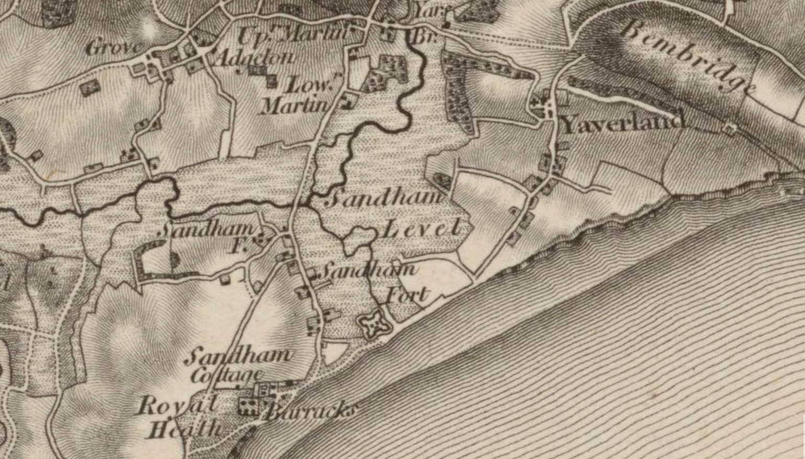

# Sandown History and Origins

https://maps.nls.uk/geo/explore/#zoom=15.0&lat=50.66127&lon=-1.14192&layers=270&b=ESRIWorld&o=100

## Sandown in the Early to mid-1800s

At the start of the 19th century, there was little to Sandown. A fort had been constructed there in the rein of Henry VIII, at the site of what is now Sandham gardens, and one or two summer villas had started to make an appearance.

https://britishnewspaperarchive.co.uk/viewer/bl/0000230/17871119/005/0003
Hampshire Chronicle - Monday 19 November 1787

*NEWPORT, Isle of Wight, Nov. 16.* The excessive rains that have of late prevailed in this Island are astonishing. That beautiful vale at the foot of St. Catherine's, which is bounded by the high lands on the right and left as far as Sandown, presents a melancholy prospect below Newchurch to the head of Brading harbour. Deluged with water, rich pastures exhibit at present more the appearance of sea than land; and his Majesty's fort of Sandown Castle is surrounded (excepting the high beach) with water, which gives it every appearance of an Island.

https://britishnewspaperarchive.co.uk/viewer/bl/0000230/17911128/010/0003
Hampshire Chronicle - Monday 28 November 1791

*Newport, Nov. 24.* The late heavy rains have laid all the low parts of this island under water, particularly from Newchurch to Brading Wall, that the fine of marshes of Sandown, &c. look more like the sea than pasturage lands. The small pox lately made its appearance in the village of Sandown, on which inoculation was immediately introduced, and we hear that all are in a favourable way. This salutary caution being taken in the first stage of the erruption we hope will prevent its spreading to any other part of the island.

https://britishnewspaperarchive.co.uk/viewer/bl/0000230/17890309/004/0003
Hampshire Chronicle - Monday 09 March 1789

Newport, March 6. On Thursday evening some persons found means to break into the storehouse, on Brading Quay, in which is deposited several pieces of excellent brandy (saved from the wreck at Sandown, some time ago). They succeeded fo far as get one piece of about 150 gallons out, and from circumstances it is supposed, that they meant have rolled it into the water, and towed it off, but the tide of ebb was too rapid in its retreat for them to accomplish it.—After making all fast, and to appearance the same as the store had not been broke open, they made an attempt to secret it, by digging a hole near the beach, but as it was not of a sufficient depth, it appeared above the ground, by which means the property was recovered. The perpetrators got off undiscovered, and as there is no suspicion who they are, perhaps it may remain a secret for ever, unless in the hour of dissipation, some one out of the number concerned, makes a discovery.

https://britishnewspaperarchive.co.uk/viewer/bl/0001960/18851010/015/0002
Isle of Wight County Press - Saturday 10 October 1885

SANDOWN AND JOHN WILKES.

*To the Editor of the Isle of Wight County Press.*

Sir,—One of the charms of the Isle of Wight consists in the circumstance that within its contracted compass are found towns and villages, both old and new. In the very heart of the Island is the historic village of Carisbrooke, the former capital of the Island, with its written annals going so far back as the Venerable Bede and the Saxon Chronicle, where its name is mentioned, A.D. 530, and with its unwritten evidence of the more ancient occupation of the Romans stamped upon its still existing well-preserved "villa." At the back of the Island is the new, bright, cheerful, watering-place of Sandown. Rarely have we the opportunity of seeing the birth of a town; a town may extend in length, or breadth, or it may become the recipient of new municipal or electoral privileges, but there are few cases where we can assert that people still living saw the town start into being. Such is the case of Sandown. Canon Venables, in his guide, p. 161, has observed, "If the tourist examines the 'Ordnance Map' (dated 1810) he will observe no such place as 'Sandown' marked upon it. "Sandham Fort," "Sandham Cottage" (Wilkes's Villakin), and the barracks, are the only buildings indicated, while the site of the present town appears under the designation of "Royal Heath," then a common, as rough and uncultivated as "Pan Common" is now, overgrown with gorse, and feuding a few sheep on its scanty herbage." Even so lately as the date of Mr. James Thorne's publication ("The Land we Live in," vol. ii, p. 264) Sandown is described as a "little village, in which a neat church has been recently erected." "A few fishermen's huts," adds Thorne, "and humble cottages are dropped here and there along the cliffs, and two or three boats may generally be seen hauled on the beach. In the early morning, when the cliff's lie in deep shadow, or about sunset, when their sombre tints deepen into a richer hue, while two or three shrimpers are plying their craft, or a way-farer is wending along the sands to or from his day's labour, the scene has a quiet beauty that reminds one of the charming pictures which Collins used to paint so delightfully; not a few indeed of his paintings were taken from sketches made in this neighbourhood." All this has changed since the time when Collins painted his earlier pictures (1814-1836), and Sandown takes its place, if not with Newport and Ryde, yet with Cowes, Ventnor, and Shanklin, with its governing Board and powers Hof self-taxation for local purposes.

https://britishnewspaperarchive.co.uk/viewer/bl/0000230/17880609/004/0003
Hampshire Chronicle - Monday 09 June 1788

*Newport, Isle of Wight, June 5.*. On Thursday last arrived at Cowes, Mr. Chamberlain Wilkes, on his way to this town, and the delightful cottage he has taken near Sandown Fort. No situation can be more charming, as it commands the magnificent view of Culver Cliff, relieved by the wood and down of Yaverland to the east, and the heights of Shanklin to the west, with a fine bold shore of four miles; on the smooth land of which every diversion of riding, walking, or bathing may be enjoyed, under the protection of the stupendous cliff. The prospect of the sea is interminable; and as ships and vessels of various description are continually passing, the eye is gratified with all the requisites which the painter would wish to groupe in his softer or grander compositions. Mr. Wilkes left the Island on Sanday last, and proposes to return with his accomplished daughter, the beginning of July, to take possession of this enchanting retreat, "fit haunt of the study and the muse."

https://britishnewspaperarchive.co.uk/viewer/bl/0000231/18291019/007/0001
Hampshire Chronicle - Monday 19 October 1829

ISLE OF WIGHT, Saturday, Oct. 17.

A short time since, the workmen employed in repairing the sea banks on the beach, in Sandown Bay, discovered the fossil remains of some very large animals, apparently of different species, which had probably been washed there and buried by the sea during some convulsion of nature, at a very remote period, as they were at a considerable depth below the surface of the present beach. Though perfectly changed into a kind of hard red gritstone, the forms of ribs, vertebrae, leg bones, teeth, &c. remain quite distinct and perfect. These curiosities of nature have been carefully preserved , and are now in the possession of John Smith, of Yaverland Farm.

https://www.britishnewspaperarchive.co.uk/viewer/bl/0001417/18571128/028/0004
Isle of Wight Mercury - Saturday 28 November 1857

SANDOWN.

SANDOWN BAY IMPROVEMENT.

The agitation which has kept Sandown all alive for some time past, relative to procuring a Act for improving the place, is likely to lapse into quietude without resulting in any substantial benefit to the locality. Meetings have been held, and the village has been thickly placarded by "rate-payers" and "friends of the poor man," till the ratepayers themselves have become so mystified as scarcely to know for what they were voting and what they were expected to oppose, A strong opposition to the Proposed Act was got up and organized by the Incumbent of the place, the Rev, W. Thomas, and which will no doubt result in the suspension for the present, of any further progress on the part of the promoters of the Local Act. A meeting of the opponents of the Act was held on Monday last, at the Star and Garter Hotel, which was presided over by the Rev. W. Thomas. It was moved by Mr. Joseph Duns, and seconded by Lieutenant J. S. K.N.—"That this Meeting is of opinion that the proposal to apply to Parliament for leave to bring in a Bill and pass an Act for constituting and creating a Town within the District mentioned and set forth in a Notice of such intended application inserted in the Isle of Wight Mercury on the 14th day of November instant, is highly inexpedient and ingsipuch as the Present rateable value of property within such intended District is wholly inadequate to bear the very heavy expenses which must be incurred in obtaining and afterwards carrying out the provisions of such intended Act, and that this do hereby most strongly protest against such intended Application, and hereby declare theit firm declaration to oppose such Application by every means in their * 

Lagann An Amendment to the above resolution was moved by Mr. and seconded by Mr. Dgnnant,— | Free "That so long as the proposed Act contains the | % ins, ¢ Jimitation of the Rates to 2s.in the pound, it is desi- } as U yable il should be soluti snow of hands being taken, the original | Ways Resolution was carried by a large majority. ight It was moved by Mr. Porter, seconded by not t Dore, and carried unanimously,—* That the | progt mentioned Gentlemen be appointed a Committee 1 ndee (with power to add to their number) to watch the progress of the proposed Bill, with power to take such proceedings and do all such acts as they may from ancie nme oppo to time consider necessary or expedient to clear se the Rev, William Thomas, Lieut. | king: R.N., Mr. Dunn, Mr. Porter, Mr. Munt, Mr. | have Ressant, Mr. Taylor, sen., Mr. Cornish, Mr. Rawkins, | t hing and Mr. Love." pred A meeting was held on the following evening at the School Rooms, which was numerously attended. The object of the meeting, as stated in the handbill, was for the Committee, which had been appointed to take into consideration relative to procuring the Act, to lay before the rate-payers a and statement of their progress up to the time of the | titac meeting, and to take the sense of the ratepayers as to whether they should proceed in their application to Parliament for the Act. Mr. Joseph Duxw was called to the chair. tem] Mr. as chairman of the then |} nscr read a clear and straightforward statement of ail the | and proceedings of the Committee in the matter, with the | ¢atl) whole of the correspondence relative thereto. He] t he | expressed his regret that Mr. Hearn (to whom the of ar application for the bill had been was not Indi present, that gentleman being prevented attending. t Ver owing to indisposition. If he had been present he would have been able to answer any technical i afus questions which he (Mr. Hale) do. Mr. the | Hale, after reading the whole of the minutes of the Committee, said he would mention a circumstance, to diffe show what discreditable means had been adopted in antagonism to the proposed Bill. Mr. Pring, of univ Newport, came to him (Mr. Hale) a short time ago, gent and wanted him to read the minutes of the Committee | 24 for his (Bging's) edification asa ratepayer. This he expr refused to do without the sanction of the Committee, own and told him (Pring) that he (Mr. Hale) was very much surprised at such an application. Mr. Pring then All stated most emphatically to him that Mr. Hearn had said he would attend the meeting that was about to take place, for the express purpose of opposing the Committee in their exertions. Mr. Hale went on to say that he did not believe it was the intention of Mr. Hearn to "sell" the Committee, and wrote to Mr. Hearn on the subject, when he received the following reply:-—" Ryde, Nov. 12, 1857.—Dear Sir,—If [had } intended to be present at the meeting on Tuesday Las last to oppose the application to Parliament, I should law have been there. I never for one instant entertained such an intention, or made to Mr, Pring the statement Mr. he wade to you. At the meeting of the Town Council of Newport on Monday last, Mr. Mew | "38 charged Pring with a direct falsehood, and he appears pla anxious to have that charge repeated. Yours truly, Col Hearn." (Hear, hear, and laughter.) After replying satisfactorily to several questions put by rate- The payers, and expressing a hope that the present movement would be discussed in an amicable and manly £ spirit, and not characterized by such hole-and-coraer actions as that adopted by Mr. Pring, the speaker resumed his seat. I T.W esster, Esq., spoke at considerable length in Tu favour of the Bill, and adduced facts to show that bei Sandown would be considerable ale ticularly in a sanitary point of view—by its adoption the of the Act of Parliament sought to be obtained, He took exception to the opposition to the Bill being bes organized and headed by the Incumbent of the parish, and thought the influence thus used might have been used to a better purpose than that of opposing a measure fraught with general good. He also adduced figures to show that the introduction of the proposed bill would not involve more expensive rateage than the pound on all the rateable property in the place. Dr. Porter laid before the chairman a memorial, signed by 6+ ratepayers, who opposed the introduction wil of the Bill on the plea that the rateable property of | ¢9 Sandown was not sufficient to carry out the workings | ha of an Act of Parliament. Mr. said the memorial presented by Dr. a Porter could not be taken as a fair estimate of the | yy feeling of the rate-payers tke subject, as it had been carried round by the Rev. W. Thomas, and] representations made by that gentleman that the a introduction of an Act of Parliament would raise the rates to ts. in the pound. Under this influence, he bs said, the memorial was signed; but the statement as | 9 | tp the rateage was not founded an fact. The Rey. W. said it wae bis opinion that it eas founded en fact, and he firmly believed that the would become to be quite as high as he had represented Mr. Webster, after some pungent remarks, and an allusion to the sanitary state of Sandown, proposed the following :— That, as the opposition which has been organized will great additional expense in the prosecution of the Bill, and impose an unnecessary burden on the rates, the Committee be authorised to take such steps as may be necessary respecting the prosecution of the Bill in the ensuing session." The Rev. W. at some length, spoke of the injury which the introduction of the proposed Act of Parliament would cause in Sandown, which place, he said, was not yet large for such an Act. His object In opposing the measure was for the benefit of the ratepayers at large. He felt satisfied that the procuring ef the proposed Act, with its adjuncts, would not cost Jess than £2,000. Ie also produced a letter from Winchester College, which spoke in terms of objection to the alteration us be made; likewise a letter from Mr. Yelf, of Ryde, who instanced the extravagant rateage and expenditure ot the latter as a guide, to show why the rate-payers of Sandown should have nothing to do with a Local Act. He then went on to show that the place would act more wisely if it placed itself under the General Board of Health Act, which Act, while allowing them to govern themselves, would afford them every facility for improving their district in a sanitary point of view; and concluded by stating that be would much rather Sandown should be under the Board of Health Act than be governed by any private Act. Mr. Wesster said the introduction of the Board ef Health Act into Sandown would be the most direful step they could adopt. Mr. said be had been informed to the same effect, by a gentleman who had ample of forming an opinion thereon, A paper was then read by the Chairman, containing a complete exposition of the financial state of Ryde, enormous sum of money which had been squandered holding it up as a frightful warning to all aspirants to self-government A long, incongruous, and irrelevant discussion here took place, as to the sgnitary eondision of the Isle of Wight ip genera) and Sandown in particular, in which Dr. Meers, the Bev, W. Thomas, and a rate-payer in the body of the rogim, took part, and which terminated an the Island being set as almost the healthiest place under the sun; alter which conclusion Dr. Porter moved the following amendment to the resolution of Mr. Webster;-— That this meeting is of opinion that the intended Bill is highly pedient and unnecessary, and they do hereby earnestly to the promoters of such Ball, after the expression of opinion of a large Ges ot rate-payers present al a public meeting held at the Star and Garter Hotel last evening, to abandon the same, and so avoid the expense and litigation which must ensue if it is persevered 12." Mr. with a few appropriate remarks, seconded the amendment. The amendment was then put, and subsequently the original motion, when there appeared, Iu the show of ha ds, for the amendment, 37; lor the original motion 27. The announcement was received with clatter, which lasted some minutes, after which, Mr. WerssTER proposed a vote of thanks to the chairman, and stated that he for one was glad the ratepayers had released the Committee from a great responsibility. His object in moving in the matter was for the benefit of the place; and as the ratepayers seemed to think a Local Aet would not be of that service which he himself believed would be the case, he was perfectly satisfied with the conclusion they bad come lo. This brought the proceedings to a termination.

