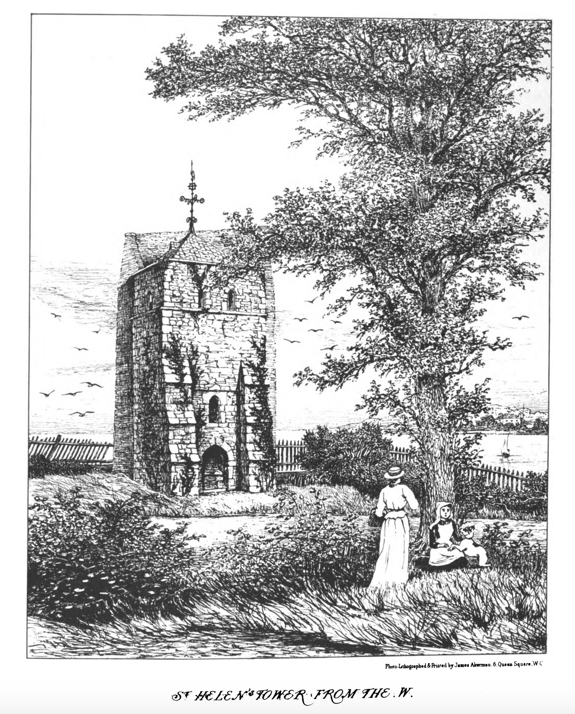

# Down on the Duver

If you go down to the Duver at St Helens, you'll see the ruined tower [tower was added in the 13th century during the reign of Henry III] of the original Church there, painted white [?since 1719?] and clearly visible as a marker to those out at sea. There used to be a Priory buildings too, but they are lost to the mists of the time.

??reverse timeline?

https://books.googleusercontent.com/books/content?req=AKW5QacX__HB7zujgtHdSwDVyAcA0BqDODRBueTp6MsKXot-9F8XK-jFMYQg2SszXMBGNEbDOCLYw_4OBPP1jHYya7yq_IAzWbAXNEIYrQw090WHNHeeCC5YzkJA7auYqLV7eHdAK2AsD6FVbzpn7n6gjhv2F3X6_M0GFtGB2Uxd7yD9RcMDytk6eu3fTzl_yJPgPPQ8x35gog3Pv3IsJjMKjdAsvfEZuAoAZubLb7Cs1xxuo3lHO24dy2jfNBEuuOoJvKL9_d9fDa5Hxu_bc3QE1NK5KFVNZ_0YPWdCOzbGom7svrveB50
Percy Stone Architectural Antiquties Isle of Wight

. HELEN'S Priory must have been founded during the tenure of the Island by the Foundation
ofthe
Priory.
Crown, between the escheat of Roger of Hereford and the grant to Richard de
Redvers—i.e. between 1086 and 1100,2—and probably owed its existence to the Conqueror's
son, William Rufus. It was a cell from a Norman abbey of the
Cluniac order, whose name, however, does not appear in any deed.
That the priory was founded before the Church of S. Mary at Brading
seems evident, or it would not have claimed the advowson of the
church, and that such a claim was valid is shown by the fact that the
Convent of Breamore paid 45 marks in consideration of its abandonment. If there was no claim on the church, how could it have been Claim on
relinquished ? Besides, the priory is referred to in the Patent Roll, Brading.
2nd Richard II . , as existing " from the foundation of our ancestors. " c
In Bishop Pontissara's Register, 1282-1304, occurs the entry,
" Admissio ad Vicariam S. Elene " The Vicarage seems to have
been in the Prior's hands till the time of Bishop Stratford, 1323-33,
when it appears in the presentation of Peter de Watford, probably
as the appurtenance of an alien Priory, under grant from the Crown. SELERA
We find the church of the Priory did duty for the parish, and the entry
appears in the Winchester Registers of Bishop Edingdon, 1346-66, granting a license to
the prior to celebrate mass and administer the sacraments till a vicar should be established.
Shortly after, the living appears to have lapsed to the Bishop, as in the next Register,
that of Wykeham, 1367-1404, a license is granted to serve the Church of S. Helen's,
" per unum monachim. "
Church of
the Priory
Church.
the parish
The fortunes of the monks of S. Helen's underwent the many vicissitudes incident to Suppression
e
the alien foundations, being now suppressed, and anon reinstated, till the priory was
finally extinguished in the reign of Henry V. Its revenues, having thus lapsed to the
Crown, were granted by the next king-Henry VI.-to Eton College, and the Priory Grant to
itself was shortly after granted by Edward IV. to the same foundation, from whom the Eton.
King, in the 14th year of his reign, appears to have transferred it to Windsor College.d
In the reign of Edward I. the Prior released his claim to the Rectory of Brading. In Release of the same reign, in the Return of the Dean of the Island, 1305, under " Sct. Elene, " we find Brading.
" Prior habet ecclesiam sibi appropriatam. " That at all events in the reign of Edward III.
the Priory was not a wealthy establishment is evident, as it furnished only one archer to the
Island strength. In the valuation of benefices by Cardinal Beaufort, temp. Henry VI . , the
church is rated at 30 marks.
The inroads of the sea have been the greatest enemy of the structure, which, from its The Church indecay.
exposed position, bore the brunt of all the storms that swept up from the S.E. In the reign Temp.
of Edward VI . the north wall was taken down as a dangerous structure, and in the reign o

since " you might see in at one end and out at the other " ; and George Oglander, " the
،،
centoner of S. Elyn's, " in his report, December 1559, goes on to say " that the church
" hath been evil served and worse repaired ever since Dr. Cole hath been Provost of
Eton, " there had been no curate and but little service for many years-" so that
" the parishioners had been fain to bury their corpses themselves ; and yet they pay " nevertheless their tithes. Foreign sailors, seeing the shameful using of the same, think
" that all other churches within the realm be like used, and so have both spoken and done
" shameful acts in our derision ; and what they have said and made report of in their own
،،
Erection of country God knoweth." At the beginning of the 18th century the inhabitants obtained
a faculty to erect a new church on a site to the north of the village, which was accordingly.
church. consecrated by Bishop Trelawney, in 1719.
The tower,
Former im- portance of
S. Helen's.
The only remaining portion of the ancient church is the Early 13th century tower, which
was buttressed up, probably about the time of the building of the new church by the Trinity Board, as it formed a valuable landmark. In the reign of James I. the Priory was bought by
Mr. Emanuel Badd, who, according to Sir John Oglander, was a poor man's son, “ but by God's blessing, and ye losse of 5 wyfes, he grewe very ritch ; " (the italics are mine). Of the ancient building not a vestige remains, it having been finally demolished, and a modern
house erected on the site, about the middle of the last century.
“
The Parish of S. Helen's appears to have formerly enjoyed a certain amount of importance as a place of call for foreign vessels, and probably a harbour of refuge. Here
it was that outward-bound ships were wont to put in for water, which it is said remained fresh
and bright even at the end of a long voyage, so excellent was the spring from whence it was
drawn. A family of some distinction took its name from S. Helen's, and appear from time to
time in the history of the Island, generally as witnesses to deeds. It was from S. Helen's
Sir Edward that the gallant Sir Edward Wydvil, * with the Island chivalry at his back, sailed, in 1488, on
Wydvil.
his ill-fated expedition which ended so disastrously on the field of St. Aubyn, in the July
of the same year.

 * The orthography of the family name in contemporary documents varies, a

????ref for below?

The original wooden Church built there in the first decade of the eighth century by Hildila, Chaplain to the Bishop of Chicester, supposedly because he could look back over the Solent to Chichester. A Cluniac Priory was founded on the site in the first decade of the twelfth century in the reign of Henry I; its mother house was the Priory of Much Wenlock. A stone church was now built along with the Priory buildings. The community continued for the next three hundred years, but it was not a wealthy house, and when the Mother House of Much Wenlock bought its Charter of Denization back from Cluny, St Helens could not follow suit. Its continuing financial commitments to Cluny, to "the French", sealed its alien status and it was finally suppressed in 1414 by Henry V, the title to the land passing from the crown to Eton College in 1467.

By early 1500s the priory, and the Church along with it, were falling into disrepair, - letter Elizabeth state of the church; perhaps around this time holystone; despite occasional repairs the state of the Church continued to decline through the 1600s.

If you look at John Speed's map of 1611 

Church were built, the sea channel into the harbour ran much closer to the Church, passing through where the houses by the car park are now. If you look at old maps of the Island from even the early 1800s you'll also see that the whole area extending back to Brading across what is now Brading marsh as far as Yarbridge (?which used to be called ford?), was underwater: the embankment along the side of Bembridge harbour, alongside which many houseboats are moored, wasn't there in those days... If you wanted to get to Bembridge, ferry... 

the land also jutted out towards the St Helens side from the Bembridge side. or yarbridge...

 and there was also land out further towards where St Helens Fort stands now. Indeed, the path to the Fort is shallow enough even to this day that on the lowest tide of the year, in mid-summer, many hundreds of Islanders have a tradition of walking out to the fort, and around a ledge on the outside wall of the fort, in a continuous snake-like procession connecting St Helens beach to the fort.

The anchorage at St Helens Roads was good and calm, and many a ship would anchor there, merchantmen and ships of the fleet alike.

There were two other reasons that ships would lie up there, and sent small boats ashore.

The first reason was that that there was a good supply of water the like of which you'd be hard to find anywhere else. The water would be lifted from the well [close to the shore??], placed in wooden barrels and ferried back to the anchored ships. It is said that ships of the East India company, whose year long journeys to the East Indies, what today we would call Indonesia and Malaysia, would take them the long way round past the bottom of Africa to trade English wool for Indian tea and spices [??], would be as fresh as the day they sailed back to England as when they had left.

scour decks and white them

>"A holystone was a block of Portland stone the
size of a large pillow, flat on one side and usually
rounded on the other. An eyebolt was fitted on the
rounded side and two lengths of rope were spliced to it.
With the deck wet, sand was sprinkled over it, and men
holding the ropes pulled the holystone back and forth, the
stone, sand and water scouring the planking.

The second reason was no so much appreciated by the sailors. Life on deck was hard when there was work to be done, and boring when it wasn't. So to keep the men occupied, and to keep a ship in order, the men would regularly have to scrub the wetted decks clean with sand, much as you might sandpaper a wooden deck today.

hear phrase scour the deck, meaning scrape it clean, much as you might scour a pan if you've burned you tea...

Any sailors amongst you, or so I am told, not being a sailor myself, may know the phrase "to holystone the deck". This makework originally involved either getting down on your knees and using a small sandstone block, sometimes referred to as a Prayer Book, to scrape the deck clean, or tying a larger block, known as a Bible, in ropes and dragging it across the deck.

Some say the phrase "holystoning" comes from the prayer like posture you would have to adopt when using the Prayer Book stones. But legend has it that the stones were so named from the stones gathered from the ruin of old the collapsed St Helens Church for just such a use. 

https://en.wikipedia.org/wiki/St_Helens_Fort

----

alien priories henry V https://en.wikipedia.org/wiki/Alien_priory 

https://www.nationaltrust.org.uk/st-helens-duver/features/the-story-of-st-helens-old-church
St Helens Church tower stands just off of National Trust land, and is an intriguing sight, located where the sea meets the land. It's the last remaining part of the ancient church that once stood here, and now serves as a marker for those at sea.
The first church at St Helens, or 'Etharin' as we think it was then known, was built on the Duver in Saxon times by Hildila who was Chaplain to Wilfred, Bishop of Chichester.
The wooden church
Wilfred had been granted land on the Isle of Wight by Caedwalla the Saxon king, who took the Island by force in AD686.
The simple wooden church with its views over to Chichester was built following Wilfred's visit to the Island in AD704 and is believed to have survived until it was burnt down by the marauding Danes in AD998.
Founding the priory
A priory at St Helens was founded after the Norman Conquest by French Benedictine monks. The church was rebuilt in Norman style to serve both parish and priory.
It was dedicated to St Helena, mother of the Roman Emperor Constantine, from whom the village subsequently took its name. The tower was added in the 13th century during the reign of Henry III.
Old Church St Helens has been used as a white sea mark for hundreds of years
The tower is now all that remains of St Helens Old Church 
The Old Church in decline
The Benedictine community in St Helens survived for over 300 years until financial problems led to it disbanding in 1414. The property was given to Eton College who owned it until 1799 but failed to maintain it, so the church gradually fell into disrepair.
Its exposed position became even more acute in the 1620s when Sir Hugh Myddleton built an embankment across the harbour from the duver (dunes). Limestone rocks making up the foreshore had protected the church but were now used in the construction of the new embankment, which only lasted eight years.
Dismantling the church
In the 1630s, the sea defences were further undermined by the tenant of the priory, who sold off the church stones.
A dispute arose with his parishioners, but it's likely that they too were removing stones for their own purposes.
Blocks of soft sandstone from which the church was built – known as 'Holy Stones' - were used by sailors of vessels anchored off St Helens to 'holystone the decks' - meaning to scour and whiten them.
As a result, the church was left jutting out on a peninsula, washed on three sides by the sea. Eventually only the tower remained and this was subsequently bricked up and painted white as a seamark for Navy ships in 1719.
It fulfils this purpose today and is associated with the high-level seamark on Ashey Down erected 16 years later. A new church for St Helens was built further inland in the 18th century. 

https://www.nationaltrust.org.uk/st-helens-duver/features/maritime-history-of-st-helens-duver
Although hard to imagine today, at the east end of today's St Helens Duver on the Isle of Wight, the port of St Helens was important from the end of the 13th-century until the rise of Cowes in the 1700s.
St Helens Roads
Naval and merchant fleets would often anchor in the sheltered waters of St Helen's Roads just offshore to take supplies on board. Press gangs would come ashore and try to boost crew numbers – hence the name of the Gaggen or Gaggun Edge path at the edge of the Common. The water of St Helens had excellent keeping qualities and would remain fresh for a voyage to the West Indies and back. Legend has it that Admiral Lord Nelson's last view of England was of the Old Church at St Helens when his ship HMS Victory stopped to take on supplies before setting sail for the Battle of Trafalgar.
Strategic defence
Of course St Helens was vulnerable to attack, particularly by the French navy who came ashore in 1340. On this occasion they were driven back, and again in 1545 during the campaign in which the Mary Rose capsized and sank off Portsmouth. A watchtower with a beacon was then erected at Nodes Point but although the waters round St Helens were sheltered, shipwrecks were not uncommon and many sailors who were drowned are buried locally.
By the time of the Second World War, Woodnutt's boatyard at the west end of the Duver employed 200 workers, building mainly Fairmile-class patrol boats for the admiralty and airborne lifeboats for rescuing RAF crew who had ditched into the sea.
More recent activity on the water
There used to be a ferry from the Duver across the harbour entrance to Bembridge but it finally stopped running in 1993. This area has been used for commercial maritime activities from the end of the 19th-century. In that period, wooden hulls have been replaced by fibreglass, inboard motors have become outboard and new vessels have appeared such as catamarans. 

From: Twelve Hundred Years in St Helens, David Low & Sheila White

Mr Percivall, drunken curate, p. 39-31

See stocks and pillory...

http://www.havenchurches.org.uk/history

https://www.iwhistory.org.uk/#projects

https://www.iwhistory.org.uk/RM/bembridgeisle/reclaim.htm

Salt and smuggling around Seaview? Salt Tax
https://www.saltassociation.co.uk/education/salt-history/salt-the-chemical-revolution/eighteenth-century-salt-making-salt-and-the-salt-tax/
https://wightsalt.co.uk/
https://isleofwightdistillery.com/collection/mermaid-salt-vodka

https://www.wightpedia.org.uk/detail2.php?id=salterns-seaview
https://www.wightpedia.org.uk/detail.php?id=salt-works
https://www.wightpedia.org.uk/detail2.php?id=saltworks-newtown

https://www.nationaltrust.org.uk/newtown-national-nature-reserve/features/the-salt-industry-at-newtown

http://www.customscowes.co.uk/tales_of_island_smugglers.htm

English smuggling in the eighteenth century - PhD thesis
http://oro.open.ac.uk/57643/1/DX204643.pdf

https://www.lymingtonharbour.co.uk/history-of-lymington
Smuggling in Lymington
In one tale about smuggling in Lymington, it was said that some weeping passengers and downcast crew came ashore from a ship that was moored here with the sad news that the captain had died whilst at sea.
A doctor was called, and he duly certified the captain as deceased, and called the undertakers.
Soon a sombre procession including the local customs men headed up the main high street, to drown their sorrows. The mourners called at 'The Angel Inn' (Originally called 'The George Inn', this is the oldest Inn in Lymington), where the King's men were especially well treated. The cortège continued, in a slightly less dignified manner, but as soon as there was a clear road, the hearse sped off so they were far away from the funeral, and the coffin and its contents of contraband were spirited away to a safer spot, no doubt to the benefit of undertakers, doctor and all of the mourners.
There is good reason to believe that this ruse would have been successful even if the customs men had not had their brains fuddled by drink, The vicar was in league with the smugglers too, and he allowed the tower of St Thomas' church to be used for storage.

??Merlin's well

http://www.smuggling.co.uk/gazetteer_s_10.html

http://www.wightfarmholidays.co.uk/iow/smuggling-and-piracy-on-the-isle-of-wight/
Operation Eyeful
Historic - the Bishop of Winchester ordered Island priests to deliver a sermon at least three times a year against such murders, but King Edward1's Shipwreck Act of 1275, which gave the ship owners a year and a day to claim their cargoes – on condition that 'one living thing' survived the wreck
WHeelers of Wheelers bay

Maps http://vectisarchaeology.org.uk/pdfs/antiqe_maps_iow.pdf By 1724 [H Moll geographer] map, St Helens butts out to Bembridge, 1805 still water there, and 1837, and 1841, closed off by 1882

https://www.iwhistory.org.uk/HER/

https://www.iwhistory.org.uk/HER/0902sheepwashsites.htm Several places called sheepwash

http://vectisarchaeology.org.uk/

https://bembridgeharbourtrust.org/local-history/
Some of the earliest relevant references concern 'St Helens Roads', being the area to the seaward of the harbour. This has always been a sheltered anchorage and is still used as such, as it is protected from westerly winds. It has often been a departure point for fleets sailing west down the English Channel, perhaps most famously being the departure point for Nelson's fleet in 1805 en route to Trafalgar.
The original entrance of Brading Haven was by St Helens Old Church with the spit, known as the Duver, originally extending from the Bembridge side, although this changed, as a result of natural causes, by the early 1600s to the current layout, with the entrance on the Bembridge end of the Duver. The Old Church itself was built in the reign of Henry lll (1215-1272). The Church began to fall into the sea about 1550 and from then on gradually disintegrated until only the portion of the Tower seen today remained. In 1703 it was bricked up on the seaward side for use as a Seamark. Allegedly sailors used to remove the stones of the Old Church for scouring the decks of wooden ships and the term 'holystoning the decks' is said to have originated here.
Several important construction operations have contributed to the development of the harbour into its current location and form. In 1338 the Yarbridge connection to the Isle of Binbridge (Bembridge) was constructed, blocking off the water to Sandham (Sandown). The next reclamation was in 1562 when the area alongside Carpenters Road at the Brading End was cut off. In 1594 land at the bottom of Quay Lane in Brading was reclaimed. Up until this point, small commercial vessels could sail nearly up to Brading High Street. The first attempt to cut off a major portion of the harbour was between 1620 – 1622 when a barrier was constructed from what is now Bembridge Lodge to Woodnutts but it only lasted eight years before being breached.
The major closure of Brading Haven to form what is now known as Bembridge Harbour was started in 1874 and finally finished, after several abortive attempts, in 1880. After this work was completed the ownership of the Harbour passed into the hands of the local railway company. It passed to the Southern Railway after the First World War and then British Railways following nationalisation. It eventually passed back into private hands in 1968.

On the 19th July 1545 Bembridge was invaded by the French under the command of Seigneur de Taix and the village set on fire. This was in order to provoke the English fleet in Portsmouth, who were able to see the flames, to come out and fight the French, but they did not, except the Mary Rose, which promptly sank. The French did not stay in Bembridge long, though. They managed to take Bembridge, Whitecliff and St. Helens, getting as far as Yarbridge in Brading and building temporary earthworks just outside Centurions Copse. The English fleet, though, refused to leave the safety of Portsmouth. Also, the local militia, having repelled another invasion at Yaverland, were approaching and were using the Brading Parish cannon, called the 'Fire Engine' to bombard the French positions over Brading Haven. The French admiral had also calculated that it would take 6,000 men to keep the island over the winter when ships were unable to sail regularly from France, and could not spare that many, and so the French forces soon left.

Bembridge Harbour was originally just part of Brading Haven, and the sea extended down as far as Yaverland and Sandown. The whole peninsula was almost an island. Brading was used as a port in Roman times. In 1388 Sir William Russell had drained the southern half of Brading Haven, and in 1562 North Marsh was walled by George Oglander, with further walls built in 1594 and 1620. During this time, St. Helens was used as a port. However, after the flood of March 1630, Brading Haven was not reclaimed until 1878 at a cost of £420,000.

Bembridge was always too difficult to access as the only route to it was via marshes in Yaverland which flooded in winter. Even at the start of the 19th Century access to Bembridge was difficult, and as there were strong currents across the mouth of the harbour, the only safe time to get to Bembridge was via a 'horse boat', which only operated in low tide and in fair weather.

In 1864, the Bembridge Railway, Tramway and Pier Act was passed by Parliament, authorising the construction of land-reclamation works and the building of a pier. By 1878 over 800 acres of land were reclaimed, and a pier built. Bembridge Harbour Pier was only 250ft long, and quite narrow too. Despite this, it was used by ships such as the 46 tonnes Tynemouth, and after the harbour had been dredged to allow larger ships, such as the 125ft. Island Queen in 1878 and in 1892 the 104 tonnes, 137ft paddle steamer Princess of Wales, which was re-named the Bembridge. This was run by the Southsea and Ventnor Steamship Company. This later merged with the Southsea, Ventnor, Shanklin and Sandown Steamship Company to become the Bembridge and Seaview Steamship Company in 1912. Ships which called at Bembridge regularly on a passenger service included the Sandringham, Prince, Duke of York, Carrier and the 130ft Lord Kitchener. The largest ferry was the Alexandra in 1913, which was a 235-tonne ship and 171ft long.
Bembridge became even busier when one of Britain 's first golf courses, as the St Helen's Duver was for many Years the Royal Golf Links. The Royal Isle of Wight Golf Club was founded in 1882 and was responsible for the much of the development of the modern game of Golf, at one point challenging the pre-eminence of St Andrews as the source of the authoritative rules of the game and even forcing changes in some of the St Andrews rules.

https://jsbookreader.blogspot.com/2014/05/a-tour-of-isle-of-wight-1790.html

Charles Tomkins' 1796 A Tour to the Isle of Wight.
https://archive.org/details/atourtoislewigh00tomkgoog vol i, and col ii https://archive.org/details/atourtoislewigh01tomkgoog

A topographical and historical guide to the Isle of Wight, W C F G Sheridan 1840
https://archive.org/details/atopographicala00bretgoog

Hassell, John 1790 Tour of the Isle of Wight
https://archive.org/details/tourislewightdr00hassgoog

Hassell vol 2 1790, p33 St Helens
Outward-bound ships not only take in their poultry, &c. here, but likewise their water, which is found to be preferable to that of most other parts. East Indiamen have been known to carry it to their destined ports, and bring some of it back, in as Vol. II . ſweet
( 34 )
sweet a state as when taken from the spring.

And it has this further advantage, that when at sea, it recovers itself sooner than any
other.

Near the [Nettlestone] priory several salt-works are established, which for convenience exceed
the general run of these works.

https://www.countypress.co.uk/news/18185002.isle-wight-childhood-home-pink-panther-actor-david-niven-sale----price-tag-almost-1-million/

https://www.visionofbritain.org.uk/place/5645

https://www.visionofbritain.org.uk/maps/?layer=europe&xMin=3224582.32674&yMin=2695416.45403&xMax=3261582.32674&yMax=2732416.45403

https://www.visionofbritain.org.uk/maps/series?xCenter=3243082.32674&yCenter=2713916.45403&scale=63360&viewScale=181417.4208&mapLayer=nineteenth&subLayer=first_edition&title=Ordnance%20Survey%20and%20Ordnance%20Survey%20of%20Scotland%20First%20Series&download=true

https://www.nationaltrust.org.uk/bembridge-windmill/features/the-history-of-bembridge-windmill-

Mew
Mottistone
SZ4083 4m SE of Freshwater 
At Mottistone a large tomb, excavated for the bodies of seven sailors washed ashore from a wreck, was used for storing contraband (a theme that recurs in every part of Britain). The tower of the church was probably also used as a landmark and lookout point, and the local gang used caves in the cliffs above the beach for storage; cottages looking out to sea reputedly have small windows to carry lanterns for signalling. The manor at Mottistone was pressed into service, too: tubs were stored in the large loft...'and although the revenue men often looked in at the clap door, they did not dare venture up the rotten ladder.'

http://woottonbridgeiow.org.uk/smuggling.php

http://www.vernoncottage.co.uk/p/history.html

https://victorian-supersleuth.com/smugglers-island/
	
https://www.britishhops.org.uk/hops/what-is-a-hop/
Humulus lupulus or 'wolf of the woods' is the Latin name for the hop.

Holystoning

https://en.wikipedia.org/wiki/Holystone

https://joyfulmolly.wordpress.com/2007/11/05/resource-the-secret-diary-of-a-midshipman/
https://ussconstitutionmuseum.org/2016/07/14/decks/ 'Lieutenant Blockhead keeping the Morning Watch' shows sailors holystoning the top deck; a study for an illustration for 'The Life of a Midshipman,' by Frederick Marryat, 1820. [© The Trustees of the British Museum]

https://asailorslifeforme.org/educate/annotated-scenes/holystoning/
Holy stone and smaller "prayer book"

The Old East Indiamen, by Edward Keble Chatterton, 1914
https://www.gutenberg.org/files/54561/54561-h/54561-h.htm
On Wednesdays and Saturdays the 'tween decks were cleaned and holystoned. The origin of the word "holystoned" has been variously derived. To "holystone" is to rub the decks with sandstone or "prayer-books." When ships, both of the East India Company, his Majesty's navy and other craft, used to anchor in St Helen's Roads (off Bembridge, Isle of Wight, facing Portsmouth) the place was found convenient for two reasons. There was a convenient dip-well close to the shore, which still exists to-day: and this water kept in wooden butts used to keep so well, and unlike much other water did not turn putrid when the ships had been at sea some time, that East Indiamen were actually known to have brought back some of it home quite fresh after being out to the East and remaining in the ship about a twelvemonth. But besides the excellent water, the men used to be sent ashore here to obtain sand for scrubbing the decks. One day it was discovered that there was nothing so good as a piece of the stone of the old St Helen's Church, which had recently been abandoned, the relic of which survives to-day only as a sea-mark. In those sacrilegious days there was little respect for hallowed267 things, such as churches or graves, and before long every ship that came to these roads would send men ashore as a matter of course to fetch bits of the church and even gravestones in small blocks. The suggestion is that thus when the decks were rubbed with them the work was known as "holystoning," and the blocks themselves called "Bibles" or "Prayer-books."F
F Mentioned in Captain E. du Boulay's "Bembridge, Past and Present."

 https://www.wellandantiquemaps.co.uk/sites/default/files/irun/uc_product/images/Miniature-Speed-of-WIGHT-ISLAND-Isle-of-Wight-c-16662.jpg
 
 https://www.iwhistory.org.uk/RM/bembridgeisle/and.htm 1769

https://digitalcommons.lsu.edu/cgi/viewcontent.cgi?article=5344&context=gradschool_disstheses
1987
Crime and Punishment in the Royal Navy:
Discipline on the Leeward Islands Station,
1784-1812 (England).
John D. Byrn Jr
Louisiana State University and Agricultural & Mechanical College "A holystone was a block of Portland stone the
size of a large pillow, flat on one side and usually
rounded on the other. An eyebolt was fitted on the
rounded side and two lengths of rope were spliced to it.
With the deck wet, sand was sprinkled over it, and men
holding the ropes pulled the holystone back and forth, the
stone, sand and water scouring the planking." Pope, Life,
p. 167."
Dudley Pope, Life in Nelson's Navy (London:
George Allen St Unwin, 1981),

Seamen on Late Eighteenth-Century European Warships
Niklas Frykman
International Review of Social History
https: // www. jstor .org / stable / 44583116 https://www.researchgate.net/publication/232015238_Seamen_on_Late_Eighteenth-Century_European_Warships p78
. The day's
work on a typical battleship began at four in the morning, when one of
the two watches was ordered to commence holy-stoning the deck, one of
the most odious activities on board:
Here the men suffer from being obliged to kneel down on the wetted deck, and
a gravelly sort of sand strewed over it. To perform this work, they kneel with
their bare knees, rubbing the deck with a stone and the sand, the grit of which is
often very injurious.49
This continued for three and a half hours until breakfast, after which the
other watch was set to holy-stoning for four hours. The crew detested this
incessant cleaning of the decks, especially in the winter months – one new
recruit was even driven to thoughts of desertion after only a single day of
it – but captains nevertheless continued to order it, because quite simply
there was little else for the crew to do.50
49. William Robinson, Jack Nastyface: Memoirs of an English Seaman (Annapolis, MD, 1973),
p. 32.
50. A British Seaman, Life on Board a Man-of-War (Glasgow, 1829), pp. 28–29.
As the majority of the men were impressed, conscripted, or crimped,
there was plenty of disgruntlement on the lower deck, and the threat of
open disaffection never far away. And so they were kept busy with makework like holy-stoning or endless drills at small arms or the great guns,
both of which the men found only marginally less objectionable.52
52. Herman Melville, White-Jacket, or The World in a Man-of-War (Oxford, 1990), pp. 66–67.

---

1340 - French invaded St Helens; Sir Theobald Russell of Yaverland (?), Warden of Isle of Wight "killed in the battle and according to the Historical Memoirs of the House of Russell, "Embalmed with their tears, his body was taken to the little church of Yaverland, which the piety either of his father or himself had built, and as honourably interred." He died a hero. He was survived by his second wife Elanor de La Tour." https://www.pinterest.co.uk/pin/434878907739881545/

---

TO DO
Lost well / town of wolverton, Centurions copse
https://www.h2g2.com/entry/A87775960

Letters, archaeological and historical relating to the Isle of Wight; 1896
2 vols
by James, Edward Boucher; James, Rachel Boucher
https://archive.org/details/lettersarchaeolo01jameuoft
https://archive.org/details/lettersarchaeolo02jameuoft

Wanderings in the Isle of Wight
Ethel C. Hargrove 1913

St Urian - lost village of Wolverton - magic well
https://www.h2g2.com/entry/A87775960
St Urian - history: boucher - letters relating to isle of wight p72 1896.pdf
Woolverton: new forest isle of wight 1903 Cornish.pdf p75-6 "The beautiful Jacobean manor house of Yaverland stands on the site of what was the ancient home of the Lords, not only of the Manor of Yaverland, but of the Isle of Bembridge, so far as its protection and defence demanded a captain. It was granted to Sir William Russell, an ancestor of the Duke of Bedford, by Edward I. There the people of the island used to send the first news of the coming of the French, and the Lords of Yaverland would summon their men and lead the array of the island. When the French landed at Bembridge in 1340 Sir Theobald Russell, of Yaverland, met them and drove them back to their ships, but was himself killed in the fight. There is a persistent tradition that the little church which stands by the manor house was built, not on the spot, but at Woolverton a short distance off, on the shore of the ancientBradingHaven. The local story is that the town of Woolverton was burnt by the French and every person killed but one, before the Knight of Yaverland could come to help them. The site of the old town is well authenticated, and is now covered by a thick wood called the "Centurion's Copse" (St. Urian's Copse according to antiquaries). The stones of the Norman chapel at Woolverton were taken to Yaverland when Sir William Russell built the church at Yaverland for the convenience of his household. The road, which anciently ran by Woolverton, is now carried higher up the hill-side above, a change made, according to the same tradition, because the ghosts of the dead people of Woolverton haunted the ruins where they made their last stand against the French.
The traces of this ancient town which was strangled out of existence in a night, standing on the shores of a harbour which is now dry land, and called by a name dating from an earlier period than the foundation of the town itself, are a typical example of the history of the island and the sufferings of its inhabitants in its old and evil days."

