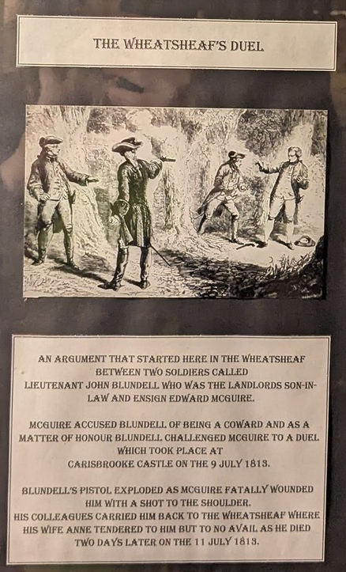
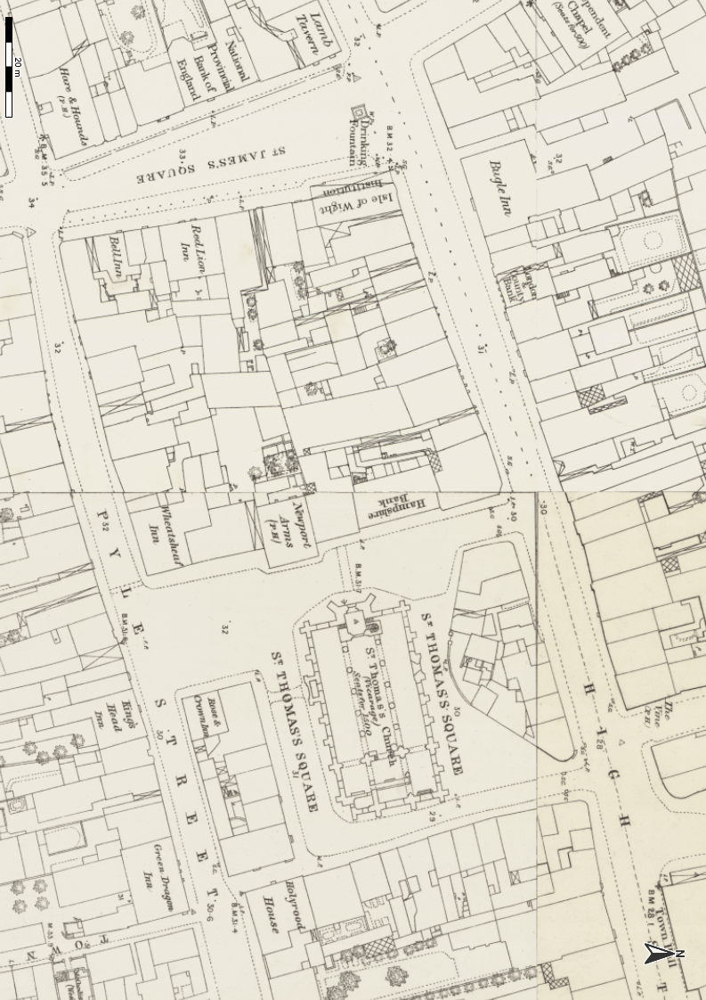

# A Duel at Carisbrooke Castle

If every pub has its story, I've found that one good way of sharing them — or at least, that one good way of me *finding* them — is to put them on the wall. And so it was, that one Tuesday evening, at the Wheatsheaf Hotel in Newport, as I was scanning the walls in search of inspiration for a tale to tell at the weekly open mic session there, that I came across the following:


Which is to say....



> __The Wheatsheaf Duel__
>
> An argument that started here in the Wheatsheaf 
> between two soldiers called
> Lieutenant John Blundell who was the landlord's son-in-
> law and ensign Edward Mcguire.
>
> Mcguire accused Blundell of being a coward and as a
> matter of honour Blundel challenged Mcguire to a duel
> which took place at
> Carisbrooke Castle on the 9 July 1813.
>
> Blundell's pistol exploded as Mcguire fatally wounded
> him with a shot to the shoulder.
> His colleagues carried him back to the Wheatsheaf where
> his wife Anne tendered to him but to no avail as he died
> two day's later on the 11 July 1813.

Needless to say, my next stop was the [*British Newspaper Archive*](https://britishnewspaperarchive.co.uk/) to see what the local newspapers of the time had to say about the affair.

## Introducing the Wheatsheaf

The Wheatsheaf Hotel is one of the few surviving pubs of old Newport. We can find a near contemporary description of it from an advert posted in the *Hampshire Chronicle* just over a decade later, announcing the sale, by auction, of the premises.

```{admonition} Old-established Public-House, December 1826
:class: dropdown
In *Hampshire Chronicle*, [Monday 18 December 1826](https://britishnewspaperarchive.co.uk/viewer/bl/0000231/18261218/026/0003).

TO BREWERS, INN KEEPERS, AND OTHERS.

Capital Free and Old-established Public-House, in one of the best situations in the town of Newport.

TO SOLD by AUCTION, by Mr FRANCIS PITTIS, by order and under the direction of the Executors of the late Mr. F. Kiddle, on Tuesday the 19th of December, 1826, at the Wheat-sheaf Inn, Newport, Isle of Wight, all that Good Accustomed PUBLIC HOUSE, known the name of the *Red Lion*, situated in the centre of St. James's Square, where the cattle market is held, and now in the occupation of Mr George Pedder. The house is very substantially brick built, and comprises on the ground floor, three sitting rooms in front, two back ditto, a good cellar, large stables, and stores; the second floor, two large rooms in front, and three back bed rooms the attic, six sleeping rooms. The whole of the rooms are well arranged, and the premises are front thirty-seven feet.

*The Sale to commence precisely at Six o'Clock in the Evening.*

```

A town plan from the mid-19th century shows the preponderance of pubs around St Thomas' square and the site (at the time) of the new Church there, built in the early 1850s on the site of the previous one.



THe Wheatsheaf also appears to have been a departure point for transits over to Portsmouth, via passage provided by Mr James Beazley. His new pub in Ryde in 1811, (the Bugle), also seems to have been the departure point of the Royal Mail coach to Newport, presumably after receiving the mail from Portsmouth via the passage operated by Beazley.

```{admonition} Newport to Portsmouth, 1811
:class: dropdown
In *Hampshire Telegraph*, [Monday 22 July 1811](https://britishnewspaperarchive.co.uk/viewer/bl/0000069/18110722/003/0002).

BUGLE INN, RYDE,—ISLE OF WIGHT. JAMES BEAZLEY, Sen. begs leave to inform his Friends and the Public in general, that he has succeeded Mr. Robert Williams at the above Inn, which (although in an unfinished state at present) he has opened; and trusts, by his long experience in conducting the Passage to and from the Island, his assiduity, and attention, to accommodate those who may be pleased to honour him with their company, so as to merit a continuance of their favours.

Tbe Passage to and from the Isle of Wight, will be continued by him as usual, from the West India and Quebec Tavern; and a Telegraph Coach will wait its return daily from Portsmouth, to the Wheat Sheaf at Newport.

J. B. has laid in a good assortment of choice old Wines and Liquors of the first quality.

N.B. The Mail is conveyed every morning from the West India and Quebec Tavern, Portsmouth, by Messrs. Moore and Beck, to the above Inn, where the Royal Mail coach waits its arrival to proceed to Newport.

Post Chaise and Horses on the shortest notice.
```

*The Quebec Hotel in Portsmouth features in the tale of another Solent duel, in 1845, but that is another story for another day...*

## A Duel Near Carisbrooke

The first news of the duel, which took place on Friday, July 9th, 1813, started to appear a couple of days later. In the initial reports, the duel had not proved immediately fatal.

```{admonition} A Duel Near Carisbrooke, July 1813
:class: dropdown
In *Statesman (London)*, [Monday 12 July 1813](https://britishnewspaperarchive.co.uk/viewer/bl/0002647/18130712/009/0002).

Duel.—We are concerned to hear that a duel took place on Friday, near Carisbrooke, in the Isle of Wight, between Lieutenant Blundell, and Lieutenant M'Gregor, of the 101st Regiment, in which the former received a wound, which is considered likely to prove fatal to him. Liet. B was lately married to the daughter of H. White, Esq. of Portsmouth; and what is remarkable, his adversary in this unfortunate dispute gave the Lady away.
```

Lieutenant Blundell was just recently married, in Newport, to a widow, Mrs. Monro, although no mention is made of M'Gregor having given the bride away.

```{admonition} Married, June 1813
:class: dropdown
In *Stamford Mercury*, [Friday 25 June 1813](https://britishnewspaperarchive.co.uk/viewer/bl/0000237/18130625/030/0003).

MARRIED. On the 16th instant, at Newport, (Isle of Wight,) John Blundell, Esq. of the 101st regiment of foot, Mrs. Monro, relict of the late Captain Monro, of the 42d regiment, and daughter of Henry White, Esq. of Portsmouth.
```

Mrs. Monro's previous husband had also been an officer in the British Army, killed in the line of duty a year before, so perhaps M'Gregor was a family friend, or had served with Captain Monro.

```{admonition} Previously widowed, May 1812
:class: dropdown
In *Caledonian Mercury*, [Thursday 07 May 1812](https://britishnewspaperarchive.co.uk/viewer/bl/0000045/18120507/004/0002).

Private accounts from the army in Spain, state the death of Captain Monro, of the 42d regiment, at the siege of Badajoz, though his name does not appear in the Extraordinary Gazette. He was the second officer who attempted to scale the walls, and was shot through the body, when at the top of the ladder. It is only a few weeks since he resigned his situation as Aid-de-Camp to General Whetham and embarked from Portsmouth to join his regiment. He lately married a daughter of Mr H. White, of that town. He had seen much service before, in Spain and Portugal, and was esteemed a good soldier. 

```

It seems that Mrs. (Ann) Monro's first marriage had also been short lived.

```{admonition} Married, January 1812
:class: dropdown
In *Sun (London)*, [Friday 31 January 1812](https://britishnewspaperarchive.co.uk/viewer/bl/0002194/18120131/015/0004).

Marriages

A few days since, at St. Paul's, Covent-garden, Captain G. A. Monro, Aid de-Camp to General Whettam, of Portsmouth, to Anne, daughter of Henry White, Esq. of that place. 

```

*Drakard's Stamford News* commented wryly on the affair.

```{admonition} Pride in Duelling, July 1813
:class: dropdown
In *Drakard's Stamford News*, [Friday 16 July 1813](https://britishnewspaperarchive.co.uk/viewer/bl/0001659/18130716/042/0004).

A duel took place near Carisbrooke, in the Isle of Wight, between Lieut. Blundell and Lieut. M'Gregor, of the 101st regiment, in which the former was severely wounded. Lieut. B. was lately married to the daughter of H. White, Esq. of Portsmouth; and what is remarkable, his adversary in this unfortunate dispute gave the lady away.

To shew with what justice we are proud of *duelling,* we translate a passage from Voltaire, *des Turks*, v. 6 p. 243. "The Turks are brave, but duelling is unknown to them: this is a virtue common to them with all the Asiatics, and it arises from the custom of never going armed, except in war. Such was also the usage of the Greeks and Romans; and opposite manners did not introduce themselves amongst Christians, until the days of *barbarism and chivalry*, when it was counted a duty and an honour to walk about with spurs at their heels, and to sit down at table, or to offer up prayers to God, with a long sword by their side. —The christian nobility distinguished themselves by this custom, soon followed by the common people, and at length ranked amongst those absurdities, the folly and wickedness of which are not perceived, because they are of every day's occurrence."
```

Although the *Hampshire Telegraph* — or to give it its full name, the *Hampshire Telegraph and Sussex Chronicle; or, Portsmouth and Chichester Advertiser* — did not pick up on the news of the duel that week, it did manage to report on another incident involving a military man:

```{admonition} A Dreadful Cliff Accident, July 1812
:class: dropdown
In *Hampshire Telegraph*, Monday 20 July 1812, [no. 667, vol. XII](https://britishnewspaperarchive.co.uk/viewer/BL/0000069/18120720/007/0003).

On Wednesday last a private of the 63d Regt. of the name of Webster, in attempting to descend a short distance down the awful and tremendous cliffs at High Down, in the Isle of Wight, about 200 yards east of the Signal House, lost his hold, and was precipitated to the bottom, a distance, it is supposed, of about 630 feet. A boat containing some gentlemen, who were making a tour of the island, and were going by water from Allum Bay, through the Needles, to Freshwater Gate, happened luckily to pass within a few minutes of the fall, and immediately carried the mangled body of the poor sufferer, placed him in the boat, and took him to Freshwater Gate, and who, wonderful to relate, was still alive and spoke. Surgical assistance was procured without delay, and the supposition is that the wretched man may recover! Amputation of the right arm, which was most dreadfully broken, was about to be performed, when the gentlemen left Freshwater Gate, and the sight which the miserable being exhibited, from his head and other parts of him being most horribly cut and bruised, formed an object which was sensibly felt by the persons lending him assistance, and must have filled the strongest mind with horror.
```

News was often slow to travel, and relative times of "seven days ago" (*se'nnight*) in newspaper reports could often end up meaning a date between seven and fourteen days previously, depending on the date on which the report was written or typeset and not necessarily the date it was published. So from the following report which appeared a couple of weeks after the duel, we might infer that Lieutenant Blundell, the wounded party in the duel, had succumbed to his injuries and died a couple of days after the event, on Sunday, July 18th, 1813.

```{admonition}  Lieutenant Blundell died the Sunday following, July 1813
:class: dropdown
In *Cambridge Chronicle and Journal*, [Friday 23 July 1813](https://britishnewspaperarchive.co.uk/viewer/bl/0000420/18130723/019/0004).

FATAL DUEL.— The duel which look place Friday se'nnight, near Newport, Isle of Wight, between Lieutenant Blundell, 101st regiment, and Lieut. Maguire (not M'Gregor,) of the 6th West-India regiment, has terminated fatally. Lieutenant Blundell died the Sunday following. The ball entered the right shoulder, in an oblique direction, crossed the back, taking part of the vertebrae, and lodged near the arm-pit; mortification, delirium, and death, were the consequences. The deceased was the son of J. Blundell, Esq. merchant in London.—A Coroner's Jury has been held on the body, and a verdict of Wilful Murder returned against Lieutenant M'Guire, and several other persons who were present, the whole of whom have absconded.
```

A report in the *Morning Chronicle* a couple of days before the *Cambridge Chronicle* report was a little more forthcoming in naming the several parties identified as being responsible for the "Wilful Murder" of Lieutenant Blundell. That those involved had absconded was also noted.

```{admonition} The Coroner's Jury's Verdict, July 1813
:class: dropdown
In *Morning Chronicle*, [Tuesday 20 July 1813](https://britishnewspaperarchive.co.uk/viewer/bl/0000082/18130720/007/0003).

*Fatal Duel.*— The duel which took place on Friday se’nnight near Newport, between Lieut. Blundell of the 101st regiment, and Lieut. M'Guire (not M'Gregor) of the 6th West-India regt. has terminated fatally. Lieut. Blundell died on Sunday noon last. The ball entered the right shoulder, in an oblique direction, crossed the back, taking part of the vertebrae, and lodged near the arm-pit; mortification, delirium, and death, were the consequences. The deceased was the son of J. Blundell, Esq. merchant in London.

On Monday and Tuesday an Inquest was taken on the case by Thomas Sewel, Esq. the Coroner for the Island, and a most respectable jury; after a full and minute investigation of the circumstances, and an impartial summing up of the evidence by the Coroner, the Jury returned a verdict of Wilful Murder against Ensign Maguire, as a principal in the first degree; against Ensign Gilchrist, of the 6th West India regiment, and Liet. Hemmings, of the 101st regiment (the seconds), as principals in the second degree; and against Lieutenant Kinsley and Ensign Slater, of the 101st regiment, as accessories before the fact.

The principals and seconds absconded immediately after the duel.
```

The case was passed up to the Summer Assizes at Winchester. A few more details of what had prompted the duel appeared in the *Hampshire Chronicle* report of events at those sessions.

```{admonition} TO DO
:class: dropdown
In *Hampshire Chronicle*, [Monday 02 August 1813](https://britishnewspaperarchive.co.uk/viewer/bl/0000230/18130802/014/0004).

WINCHESTER, Saturday, July 31. HAMPSHIRE ASSIZES.

On Tuesday last the Commission for holding the Assizes for this country was opened before the Hon. Sir Robert Graham, and the Hon. Sir Vicary Gibbs, Knts.

...

There were forty prisoners on the calendar for trial, the following 13 of whom were capitally convicted, and received sentence of death:—

...

*Edward M'Guire*, aged 28, and *James Gilchrist*, for the murder of John Blundell, in a duel, at Carisbrook, in the Isle of Wight.

*Anthony Dillon*, aged 26, and *David O'Brien*, aged 17, for having incited, counselled, and instigated Edward M'Guire to murder the said John Blundell. The particulars of this unfortunate catastrophe are follows:—

Lieut. Blundell took a young officer of his corps, to a cottage in Niton, to dine with him. Ensign M'Guire, belonging the West India Regiment, who was stationed with Lieut. Blundell, took offence at this circumstance, perhaps thinking it a partiality which reflected on him. Lieut. Blundell treating the observations made by M'Guire, on this occasion, with disregard, the latter became so enraged, that he wrote to the officers of the 101st Regiment, to which the deceased belonged, calling him a rascal and a ruffian. On the receipt of this letter, the officers waited on Lieut. Blundell, stated the calumny uttered against him, and gave it as their opinion that he must fight him. Lieut. Blundell for some time evaded coming to this crisis, but, at last, he gave these gentlemen a challenge for Ensign M'Guire, and the parties met near Carisbrook, very early the next morning, without having taken repose. Lieut. Blundell's first pistol burst; his second handed him another, but never proposed a reconciliation. Another shot was fired, Lieut. Blundell fell; he was taken in blanket to the Wheat Sheaf Inn, Newport, where died. The ball, it seems, entered sideways into the right shoulder, crossed the back, taking a part of the vertebrae, and broke a rib. He died the day after the wound was received. Two servants, one belonging to each of the duellists, were on the spot during the whole time.

...

Of the capital convicts, *Edward M'Guire*, *James Gilchrist*, *Anthony Dillon*,  and *David O'Brien* are respited till August 21.
```

M'Guire had been the other party in the duel, with Gilchrist as his second. Heming had been second to the deceased, Blundell.

A more comprehensive report of the trial appeared in the *Morning Chronicle*.

```{admonition} Principals and Accessaries in the Late Fatal Duel, August 1813
:class: dropdown
In *Star (London)*, [Tuesday 03 August 1813](https://britishnewspaperarchive.co.uk/viewer/bl/0002646/18130803/020/0004).

Assizes, Winchester, July 31.

These Assizes terminated this day. The following were among the cases tried:

...

Ensign *M'Guire*, Ensign *Gilchrist*, Lieutenant *Dillon*, and Lieutenant *Daniel O'Brien*, the principals and accessaries in the late fatal duel at Newport, were tried for the murder of Lieutenant Blundell, of the 100th regiment. (Lieutenant *Heming* did not surrender himself). The principal circumstances in this case, besides those already given in this Paper, were comprised in the following evidence:

James Fitzgerald, a private in the 69th regiment, stated, that he was a servant to Ensign Gilchrist, that he was so on the 9th of the month, and stationed in Parkhurst Barracks; that by order of his master he took to Newport a case, but did not know its contents; afterwards went with his master to where the duel was fought, at the back of Carisbrook Castle. Mr. M'Guire was with his master soon after they were there. Mr. Blundell and Mr. Heming came to the spot; they then proceeded to the back of Carisbrook Castle, and Mr. Heming measured out the ground, taking either 12 or 13 paces. Mr. Heming asked Gilchrist for a pistol: Gilchrist answered, if you have it, it shall be without my consent, and it was against his wish that they should be used on that day. On this Mr. Heming was desired by Mr. Blundell to get one of his own, and the pistol was produced and loaded. Witness retired about 15 or 20 yards, and Mr. Heming gave the word, either "make ready, present, fire,"—or, "make ready, fire;" and they both fired together. Blundell stood his ground, and handed his pistol to Fleming, who said it was burst, and Blundell asked to borrow another of Gilchrist, as he wished to have another shot. Then Gilchrist and Fleming went to Blundell, and afterwards to M'Guire, but he did not hear what had passed. After this they loaded M'Guire's pistols, and each took one, and then Mr. Heming gave the word again, and they fired, and Mr. Blundell fell. Then M'Guire, Fleming, and Gilchrist, came up to him; Blundell said—"My dear M'Guire, I am dying, but I forgive you from my heart and soul." Then Gilchrist shook hands with him, and said—"Are you satisfied that we have behaved as Gentlemen to-day?"— He replied, "Yes, my dear Gilchrist, I die in peace with you all." Witness was sent for a Doctor, who he met coming out, and when be returned the parties were all gone.

Thomas Rayles, Captain and Adjutant at the Army Depot, in the Isle of Wight, on the 9th was in company with the deceased J. Blundell. In consequence of a letter, witness waited on the deceased, who told him he was mortally wounded. Witness told him he was sent by General Taylor to inquire into the circumstances, and requested him to inform him who were the seconds: he replied Heming was his second, Gilchrist the other's. He said that M‘Guire and he had an altercation, but that it was not his wish to meet M'Guire if he could have helped it, but that he was in a manner compelled to it. On asking him in what way he was compelled, he said several Officers had been to him; among them were O'Brien and Dillon; that he did not owe M'Guire any animosity. It was between four and five in the afternoon when he went down to Blundell. He understood on the same day the duel took plo.ce, there were several person's in the room when he went there, but did not particularly observe any one; he went to Blundell, for the purpose of collecting the particulars: he told him it was not his intention to have fought if he could have avoided it; that he had the Adjutant-General's permission to go to London; that he intended to let the business pass over, and to have got on the half-pay, and that he was going off on that day; O'Brien and Dillon told him if he did not meet M'Guire, he should be discarded.— Witness did not hear from the deceased how the dispute originated.

Henry White is father-in-law to the deceased; saw him on the 10th instant, and was told by him that he had received a wound, which he supposed to be mortal: said he was sorry to see him in such a situation; that it was not his fault; it was a malicious business—that he could not help it—and that he did not wish to fight—that O'Brien, Dillon and others, had come down to the White Lion, the evening before, and he was obliged to do it by the Officers he had been conversing with.

Mr. Dillon said, in his defence, he was not aware of being implicated in this charge, till yesterday morning; from the shortness of the notice, he could not procure his witnesses.

Mr. M'Guire said he was a native of Ireland, and a stranger in this country—that he was challenged by the deceased, and as a Gentleman was obliged tq accept it.

Mr. Gilchrist said, he was a native of Scotland; from the shortness of the time since the transaction he had not sufficient time to obtain witnesses to his character.

Mr. O'Brien was a native of Ireland, and there was not time to acquaint his connections with his situation.

The prisoners severally received good characters from some of their brother officers, who were well acquainted with them at the depot.

The four prisoners were all sentenced to suffer Death on Monday next, but were afterwards reprieved until the 21st of August.
```


```{admonition} TO DO
:class: dropdown
In *Saint James's Chronicle*, [Thursday 05 August 1813](https://britishnewspaperarchive.co.uk/viewer/bl/0002193/18130805/013/0003).

*Also in *London Courier and Evening Gazette, [Tuesday 03 August 1813 with come presentation al differences](https://britishnewspaperarchive.co.uk/viewer/bl/0001476/18130803/011/0004).*

HAMPSHIRE ASSIZES

DUELLING.

Edward McGuire, Andrew Dillon, Joseph Gilchrist, and Daniel O'Brien, were charged with the wilful murder of Lieutenant Blundell, in a duel in the Isle of Wight.

The Rev. Jon Barwis is a Magistrate residing at Niton, in the Isle of Wight. — On the 8th of July, about eight in the evening, was informed that Mrs. White, mother-in-law to Lieutenant Blundell the deceased, wished to see him; he went to her about dusk; in consequence of what she said, he went to the White Lion, and asked the landlord for Mr. McGuire, who came to him, and they walked backward and forward near the inn. He told Mr. McGuire, in consequence of information, he must bind him to keep the peace. Mr. McGuire replied, he was a peaceable man, and that he had been ill used; that Blundell had raised a report that he had supplied McGuire with clothes. Witness said he must do his duty, if he persisted in his intention of fighting, and requested him to go to the barracks immediately. He replied he should be happy to oblige him, and he repeated his request, and required his word and honour that he would not fight Blundell: McGuire replied, I give you my word of honour that I will not challenge Blundell; on which they parted, and McGuire went towards the barracks. Witness returned to the White Lion, and desired Blundell might be brought to him: he waited a considerable time, but he did not come; went to the house where he was, and saw Blundell with Lieuts. Dillon and A. O'Brien. Mr. Blundell came to him, and they had some conversation. Mr. Blundell returned, and so did the witness, addressing himself to the company, Lieut. Dillon, sitting at the head of the table, he said he feared they were there at no good, that he was a magistrate, and that he came to keep the peace; that if there was any disposition to a duel he should bind them over. Mr. Blundell then took the lead in the conversation, and said, in certain situations, Gentlemen in the army were obliged to fight duels. Dillon observed, if any officer in his regiment refused to fight, he should feel it his duty to inform the commanding officer. The rest, with the exception of Blundell, followed, but did not say so much about it. Witness then repeated that he would have no fighting, and asked if there was no intermediate course; he was told by Mr. Dillon, that fighting there must be, in some situations. After a little more conversation, he retired, saying there should be no fighting; Mr. Dillon said to him, "there should be no fighting in your district." They were then eating and drinking freely. Witness then went home.

The Judge censured Mr. Barwis for not acting more promptly.

`[In London Courier and Evening Gazette bit not Saint James's Chronicle]` *Cross examined* — is quite certain Mr. Dillon and Mr. O'Brien were at the Red Lion. When he saw them before the Coroner recognised them. O'Brien did not say much, but what he said accorded with Dillon.

James Fitzgerald, private in the 96th regiment of foot, is servant to Gilchrist, was so on the 9th of this month, was in Parkhurst Barracks on that morning. By order of his master, he took to Newport a box; did not at that time know its contents; went to Mr. Webb's for a hat for him, and afterwards went with his master to where the duel was fought, at the back of Carisbrook Castle. Mr. McGuire was with his master. Soon after they were there, Mr. Blundell and Mr. Hemmings came to the spot; when they met they proceeded to the back of the castle, and Mr. Hemmings measured out the ground, taking either 12 or 13 paces. Hemmings asked Mr. Gilchrist for a pistol; Gilchrist answered if you have it it shall be without my consent, and against my wishes that they should be used on that day; on which Mr. Hemmings was desired by Mr. Blundell to get one of his own, and the pistol was produced and loaded. Mr. Hemmings gave the word, and both fired together. Blundell stood his ground, and handed his pistol to Hemmings. Hemmings said the pistol was burst, and Blundell was asked to borrow one of Gilchrist, as he wished to have another shot. Then Gilchrist and Hemmings went to Blundell and afterwards to McGuire, but he did not hear what passed. After this they loaded McGuire's pistols, and each took one. Hemmings gave the word, they fired, and Mr. Blundell fell. McGuire, Gilchrist, and Hemmings came up to him. Blundell said, my dear McGuire, I am dying, but I forgive you from my heart and soul; then Gilchrist shook hands with him, and said, are you satisfied that we have behaved as Gentlemen to-day: he replied yes, my dear Gilchrist, I die in peace with you all. Witness was sent for a Doctor, who he met coming out, and when he returned the parties were all gone.

Mr. Wm. Dunlop is surgeon of the 98th regiment; on the 9th inst he was called on to attend Mr. Blundell about one o'clock, at Newport; he was lying on his back, his clothes taken off, and a medical gentleman attending. The ball had entered between the back bone and shoulder blade, had passed through the lungs, and struck the sixth rib on the left side, and lodged under the arm pit.

`[In London Courier and Evening Gazette bit not Saint James's Chronicle]` T. Raylis, Captain and Adjutant at the Army Depot, in the Isle of Wight, on the 9th was in company with the deceased, Blundell; in consequence of a letter witness waited on the deceased, who told him he was mortally wounded, witness told him he was sent by Gen. Taylor to enquire into the circumstances, and requested him to inform him who were the seconds, he replied Hemmings was his second, Gilchrist the other's, he said that Mr. McGuire and he had had an altercation, but that it was not his wish to meet Mr. McGuire, he would have settled it, but that he was in a manner compelled; he said several officers had been to him, their names were O'Brien, Dillon, and several others, that he did not owe Mr. McGuire any animosity. It was between four and five in the afternoon when he went down to Blundell, he understood on the same day the duel took place, there were several persons in the room when he went there, but did not particularly observe any one. He went to Blundell for the purpose of collecting the particulars; he told him it was not his intention to have fought if he could have avoided it, that he had the Adjutant General's permission to go to London, that he intended to let the business pass over, and to have got on the half-pay, and that he was going off on that day. O'Brien and Dillon told him if he did not meet McGuire he should be discarded. Witness could not learn how dispute originated.

Henry White is father in law to the deceased; saw him on the 10th instant, and was told by him he had received a wound, which he supposed would be mortal; said he was sorry to see him in such a situation; that it was not his fault. It was a malicious business; that he could not help it, and that he did not wish to fight. That O'Brien and Dillon, and others, had come down to the White Lion, the evening before, and was obliged to do it by the officers he had been conversing with.

Mr. Dillon, in his defence said, he was not aware of being implicated in this charge till yesterday morning, and from the shortness of the notice he could not procure the witnesses he could have procured if the time had been longer.

Mr. McGuire said, he was a native of Ireland, and a stranger to this country; that he was challenged by the deceased, and as a Gentleman, was obliged to accept it.

Mr. Gilchrist said, he was a natice of Scotland, that from the shortness of the time since the transaction, he had not sufficient time to obtain his witnesses to his character.

Mr. O'Brien, who is a native of Ireland, said there had not been time to acquaint his connections with his situation.

McGuire received a good character from Capt. Davis, and the Rev. Mr. Barwis.— Mr. Dutch, the Surgeon, knows McGuire; he has borne a very good character. Capt. Rayles [Roylis in other reports?] gave McGuire a favourable character. Lieut. J. Husom, of the 89th, knows Mr. Gilchrist, since the year 1809, since that period he has borne the best possible character. Dr. Dunlop has known Gilchrist since he has been at the Depot, his conduct and character has been most gentlemanly.

Guilty — Death; but respited till the 21st of August.
```

TO DO

```{admonition} Furhter Respite, August 1813
:class: dropdown
In *Morning Chronicle*, [Monday 23 August 1813](https://britishnewspaperarchive.co.uk/viewer/bl/0000082/18130823/010/0003).

The four officers sentenced to be executed at Winchester, for the murder of Lietenant Blundell, in a duel, have received a further respite until the 2d of September.
```

```{admonition} TO DO
:class: dropdown
In *Statesman (London)*, [Tuesday 03 August 1813](https://britishnewspaperarchive.co.uk/viewer/bl/0002647/18130803/016/0004).
```

TO DO - also a previous report?

```{admonition} TO DO
:class: dropdown
In *Morning Chronicle*, [Wednesday 04 August 1813](https://britishnewspaperarchive.co.uk/viewer/bl/0000082/18130804/014/0004).

Winchester Assizes

These Assizes terminated on Saturday. The following were among the cases tried:—

...
```

TO DO but a duplicate?

```{admonition} TO DO
:class: dropdown
In *Taunton Courier and Western Advertiser*, [Thursday 12 August 1813](https://britishnewspaperarchive.co.uk/viewer/bl/0000348/18130812/026/0007).

ASSIZE INTELLIGENCE. At Winchester Assizes

...

The last trial at the Hampshire assizes was that of the young men who were concerned in the duel at Carisbrook, in the Isle of Wight, and which took place on the 9th ult. between Lieut. Blundell and Ensign M'Guire, the former of whom was killed.—M'Guire, with his second, J. Gilchrist, and A. Dillon and D. O’Brien, who were deemed accessories, surrendered themselves on Friday. They were all four convicted of murder, and sentence of death was passed on them, but they were respited till the 21st inst.
```

```{admonition} TO DO
:class: dropdown
In *Hampshire Chronicle*, [Monday 20 September 1813](https://britishnewspaperarchive.co.uk/viewer/bl/0000230/18130920/015/0004).

The following General Orders have been issued respecting the four Officers who were convicted, at our last Assizes, of murder of Lieutenant Blundell, in duel, the Isle of Wight:—

Horse Guards, Sept. 13, 1813.

The Commander in Chief is persuaded, that the late trial of Ensign Edw. M'Guire, 6th West India Regiment; Lieut. Anthony Dillon, 101st Regiment Ensign Daniel O'Brien, 101st Regiment, for the heinous crime of murder, has excited the liveliest interest and anxiety throughout the Army. His Royal Highness `[Prince Frederick, Duke of York, Commander in Chief of the Army]` has therefore been pleased to direct, that the following Letter, which he has received from the Lord Viscount Sidmouth, one of his Majesty's Principal Secretaries of State, shall be published in General Orders.

"Whitehall, Sept. 8. 1813.  
"In obedience to the command of the Prince Regent, I have the honour of acquainting your Royal Highness, that it is his Royal Highness's gracious intention not to order the sentence upon the four Officers of the army, who were capitally convicted at the last Assizes at Winchester, of the murder of Lieutenant Blundell, of the 101st Regiment of Foot, to be carried into execution; but to grant them the Royal Pardon.

"I think it incumbent upon me at the same time, to lay before your Royal Highness a copy of the evidence, adduced upon the trial of those Officers; from which it appears, that the original disagreement between Lieutenant Blundell and Ensign M'Guire, arose from a trivial cause; that no attempt was made to reconcile the parties, but on the contrary, that instead of those efforts, which, if properly and seasonably exerted, might have had the happy effect of preventing the meeting, which led to the fatal result, great pains were most unwarrantably taken to instigate and promote it. This observation, I am bound to state, refers more especially to Lieut. Dillon, who, from his rank in the regiment, and his standing in the army, was peculiarly called upon exercise his influence and authority for a purpose very different from that to which they were applied.

"I deem it my indispensable duty, to submit this representation to your Royal Highness, and I do so in the full persuasion, that your Royal Highness will be pleased to cause such steps to be taken upon this painful occasion as the circumstances of the case shall, upon consideration, be found to require.

(Signed) "Sidmouth".

While the awful sentence of the law was pending, the Commander in Chief abstained from expressing any opinion on this most distressing occasion. His Royal Highness now feels it incumbent on him to take that part which a due regard to the discipline and character the Army demands.

The Commander in Chief is sincerely rejoiced, that the clemency of his Royal Highness the Prince Regent, acting in the name and on behalf of his Majesty, has been graciously extended to these Officers, and has prevented their suffering an ignominious death.

The offence of which they have been guilty, cannot, however, in a military point view, remain unnoticed.

On a due consideration of all the circumstances attending this transaction, the Commander in Chief is induced to think, that of all the parties concerned, the unfortunate Officer who lost his life, and the yet more unfortunate one by whose hand his comrade fell, are the least culpable; they appear not have been actuated by any personal animosity, but to have been instigated and governed by the advice of others.

The Commander Chief is greatly concerned to observe, that no such palliation can be adduced in the cases of Lieutenant Dillon. Ensign Gilchrist, and Ensign O'Brien.

Their interference was equally uncalled for and unnecessary, and tended, not as might have been expected, to settle the trivia! differences which existed between their brother Officers, but to magnify its importance, and instigate them to the measure which has led to so fatal a result.

The Commander Chief, therefore, has it in command to convey to all these Officers the highest displeasure of the Prince Regent, for conduct so unmilitary and disgraceful; and to notify to them, that they are no longer Officers in his Majesty's service; but his Royal Highness being disposed, in this decision, to attend to the distinction which appears in their conduct, and observing that Lieutenant Dillon, who, from his rank and standing in the army, ought to have set a different example, has throughout taken the most prominent part in these outrageous proceedings, and greatly influenced the conduct of Ensigns Gilchrist and O'Brien, is pleased to limit the declaration of being incapable of ever serving his Majesty in any military capacity to Anthony Dillon, late Lieutenant in the 101st Regiment.
```

```{admonition} TO DO
:class: dropdown
In *Nottingham Review*, [Friday 24 September 1813](https://britishnewspaperarchive.co.uk/viewer/bl/0001100/18130924/026/0003).


*Duelling.*—The Commander in Chief has signified, in General Orders, dated Horse-Guards, Sept. 10, 1813, the Prince Regent's declaration of pardon to Lieut. Dillon, and Ensigns Gilchrist, and O'Brien, found guilty, at the Winchester Assizes, of the murder of Lieut. Blundell, who fell in a duel by the hand of Ensign M'Guire, the others acting as Seconds.—The Commander in Chief, however, expresses his high disapprobation of the conduct of Lieut. Dillon and Ensigns Gilchrist and O'Brien, who, instead of endeavouring to settle the trivial difference which existed between their brother Officers, magnified its importance, and instigated them to the measure whhich led to the fatal result—In consequence, the Prince Regent has ordered that the three last named Officers be *dismissed the service*; but as Lieut. Dillon, who "from his rank and standing in the army, ought to have set a different example, has throughout taken the most prominent part in these outrageous proceedings, and greatly influenced the conduct of Ensigns Gilchrist and O'Brien," his Royal Highness limits to *him* the sentence of being incapable of *ever* again serving his Majesty in any capacity.—This Order his Royal Highness orders to be read at the head of every regiment; and "he hopes it will prove an useful and impressive lesson to the young officers of the army, and a warning to them of the fatal consequences of allowing themselves to be misled by erroneous notions and false principles of honor; which, when rightly understood, and leading to its legitimate object, is the highest gem in the character of a soldier."

```

```{admonition} TO DO
:class: dropdown
In *National Register (London)*, [Sunday 19 September 1813](https://britishnewspaperarchive.co.uk/viewer/bl/0002644/18130919/032/0015).

ACCIDENTS AND OFFENCES.

The four Officers found guilty of murder, and sentenced to death for the part they had severally taken in the late duel in the Isle of Wight, in which Lieut. Blundell, of the 101st regiment was killed, have been pardoned. A special representation on the subject, from the Civil Administration to the Commander in Chief, having, however, been thought proper; and the Commander in Chief having, in consequence made a special military case for the decision of the Prince, in which it is declared, on a full consideration of all the circumstances, that the officer who lost his life, and the officer by whose hand he fell (Ensign M'Guire, 6th West India regiment), are the least guilty; but no such palliation appearing on. the part of Lieut. Dillon, 101st; Ensign O'Brien, 101st; or Ensign Gilchrist, 6th West India regiment, these three are dismissed his Majesty's service. Lieut. Dillon being declared incapable of serving his Majesty again, for not having used the influence of his superior rank over inexperienced minds, for the purpose of conciliating rather than inflaming. Ensigns Gilchrist and O'Brien are left open to restoration. Ensign M'Guire is pardoned without condition.
```

Another year on, and Mrs. Blundell, previously, Mrs. Monro, *née* White, was to marry again, whilst her father was coming to the end of his year's term as Mayor of Portsmouth,

```{admonition} Married at Portsmouth, June, 1814
:class: dropdown
In *Hampshire Chronicle*, [Monday 20 June 1814](https://britishnewspaperarchive.co.uk/viewer/bl/0000230/18140620/018/0004).

On Monday last was married at Portsmouth, James Andrews, Esq. of Funtington, Sussex, to Mrs. Blundell, widow  of Lieut. Blundell, of the 101st regiment, who unfortunately fell in a duel, at Carisbrook, in the Isle of Wight, and daughter of Henry White, Esq. Mayor of Portsmouth.
```

A few days later, Henry White would be knighted.

```{admonition} Knighted, June, 1814
:class: dropdown
In *Morning Post*, [Wednesday 29 June 1814](https://britishnewspaperarchive.co.uk/viewer/bl/0000174/18140629/005/0002).

*Portsmouth, June 25,* 1814.

His Royal Highness the Prince Regent was this day pleased, in ihe name and on the behalf of his Majesty, to confer the honour of Knighthood on Henry White, Esq. Mayor of Portsmouth. His
```

And there ends the tale. And for how long Ann White's third marriage lasted, I cannot say.
